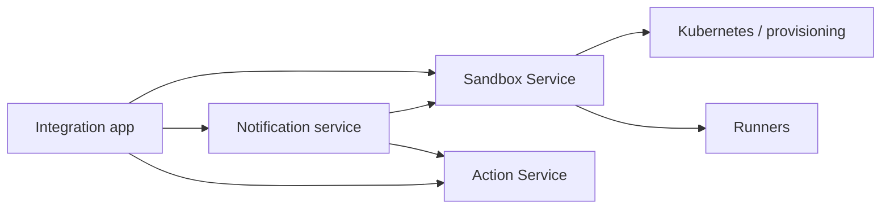

# Agentplane service dependency rule

Status: **accepted architecture constraint, including v1.** Sandbox Service and the production app
client are implemented in source; the live authority handoff is not yet verified. Notification
implementation remains separate. See the [extraction plan](../plans/sandbox_service.md) for rollout gates.

## The integration app is a client

The integration app integrates independent capabilities into a user-facing view. **Other Agentplane
services must not depend on it.** The dependency direction is app to services, never services to app.

The services may depend on shared infrastructure and explicit backend APIs. The graph is the relevant
ownership direction, not an exhaustive list of existing infrastructure dependencies.

For backend operations, this forbids:

- Calling the app's Thread, runner, provisioning, or private identity endpoints as a service API.
- Reading app-owned tables or importing `agentplane.app` implementation modules from another backend.
- Depending on the app's process/attachment, a browser session, or an app-issued ticket merely to act
  as a service. Shared authentication and independently owned operator authority are different things.
- Making the app the only source of session instructions, provider configuration, or destination IDs
  needed to create/manage sessions independently.
- A "temporary v1" app API or app proxy that becomes a prerequisite for notification delivery.

A shared helper belongs in an independently owned package. Backend records belong to their backend
owner; a shared database server does not make private tables a supported API. The app can retain
presentation state and projections, but those must not become hidden sources of backend authority.

## Ownership

- **Sandbox Service:** sandbox provisioning/lifecycle, verified destination bindings, authorized
  runner-session access, and command relay/event following. It does not own a session-log archive.
- **Runner:** native harness scheduling/execution, durable command journal, canonical execution Events
  and causal receipts.
- **Notification service:** providers, subscriptions, persisted payloads, inbox HWM, notice policy, and
  notice delivery bookkeeping.
- **Action Service:** Action authorization/Decisions, execution lifecycle, and canonical Action history.
- **Integration app:** user-facing composition, interaction, presentation, and app-only projections/state;
  a client of the above, retaining its existing PostgreSQL session archive and ingestion checkpoints.

The backend is named **Sandbox Service**: it manages sandboxes and access to their runner
sessions. It is not another Action executor or a service called "runtime" with unspecified ownership.
`app/threads/` owns only the app's thread archive, metadata, projections, and browser-facing
composition. Its session adapter uses the service client; it does not provision sandboxes or
connect to runners. Thread identities never enter the Sandbox Service API.

## Extraction before notification v1

Build the minimum independently usable [Sandbox Service](../plans/sandbox_service.md) before wiring
notifications. It must resolve explicit session destinations, expose authorized command delivery and
receipt/event following, and distinguish available, unavailable, and permanently removed destinations
without querying the app. Migrate the app to be a client of those extracted operations.

Provisioning and suspend/resume implementations belong on the Sandbox Service side as they are
extracted. Notification-triggered wake and durable acceptance of commands for offline destinations
remain separate, deferred product features. A service boundary is not permission to silently create
a second runner-command queue.

Runner journals remain durable on runner state volumes. Sandbox Service exposes the surviving
runner log, not an independently retained archive; clients needing retention beyond that volume
must archive events themselves. The app keeps its existing archive/projections as a service client.
That archive must not become a dependency of backend services, and migrating it is not a required
follow-up. Preserve its retained history and provenance during the app cutover.

Sandbox Service uses a protobuf/gRPC service API; the app retains its browser-facing HTTP API.
After cutover, Sandbox Service is the sole normal production client of runner control/event RPCs.
This boundary does not proxy runner outbound model, Actions, or egress traffic. Administrative/test
exceptions must be explicit; there is no production direct-runner fallback in the app or notifications.

## Existing staging data

Backend independence is not a reason to discard the current staging instance. For this extraction,
default to preserving existing data and identities, with an inventory, tested migration/restore path,
and controlled ownership handoff. One-time migration of app-owned records is distinct from a
steady-state dependency on app tables. See [staging data preservation](../plans/sandbox_service.md#staging-data-preservation).
Any necessary loss/reset must be described and explicitly approved before execution; the general
staging-disposability rule in [`../AGENTS.md`](../AGENTS.md) is not permission to bypass this task-specific requirement.

## Review and acceptance gates

- Reject new reverse imports, app API clients, app-table reads, or app-only bootstrap dependencies in
  backend code. Make this rule visible to coding agents in [`../AGENTS.md`](../AGENTS.md).
- Declare each moved record, queue, lifecycle operation, and auth decision's owner. No overlapping
  command authorities or implicit new persistence semantics during the cutover.
- Exercise provisioning/session setup for the extracted paths, notification ingestion/subscription,
  payload read/ack, command delivery, and receipt replay **with the integration app unavailable**.
  For new code, independence is required from its first implementation, not a later cleanup task.
- Verify restart/recovery also works without the app: a happy path using state pre-created by the app
  alone does not demonstrate backend independence.
- Test authorization failures and preserve the distinction between accepted intent, runner admission,
  and harness effect. Human decision requirements stay in their backend authority even if the UI is down.

Dependency enforcement and those acceptance tests are implementation gates. Source changes and unit
tests do not themselves prove the live handoff complete or staging data preservation.

## Sandbox Service callers

Sandbox provisioning, grant mutations, and runner RPCs are service-owned operations. Consumers
must call the authenticated Sandbox Service API, not instantiate its inventory, provisioner,
reconciler, destination resolver, command relay, or lifecycle implementation. Do not introduce
local-or-remote unions, in-process fallbacks, or a second provisioning dependency in the app.
Backend implementation targets have Bazel visibility limited to the service and its testing package.

Public protobuf/client models and read-only Kubernetes projections can be shared. The projection
modules carry no create/delete/grant/session authority. Consumer acceptance tests use the real gRPC
boundary through service-owned test fixtures; tests of backend mutations live with the service.

Bazel defaults keep app implementation visible only to the app and its explicit acceptance/deployment
consumers, and Sandbox Service implementation visible only inside that service. Public DTOs,
client/protobufs, and read-only projections are opt-in exports. The direct runner transport and its
generated gRPC stub are visible only to runner code and Sandbox Service. Archive fault tests get
an explicit test-only transport dependency, which production app targets cannot use. Shared runner
error types live separately so importing an error does not grant a transport
dependency. Use concrete service clients, not protocols introduced solely to allow alternate
in-process implementations in consumer tests.

Session defaults are named `SessionDefaults` / `session_defaults` in the API. The annotation codec
alone retains the legacy `thread_defaults` storage key, preserving staging data and old-app rollback;
it is not an API alias. No database schema, identities, or retained logs change with package renames.
