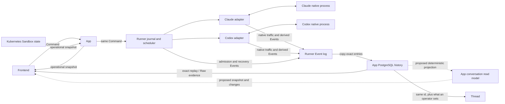
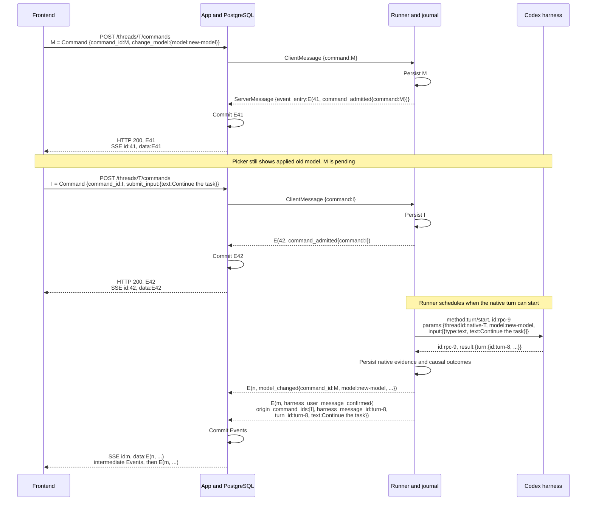
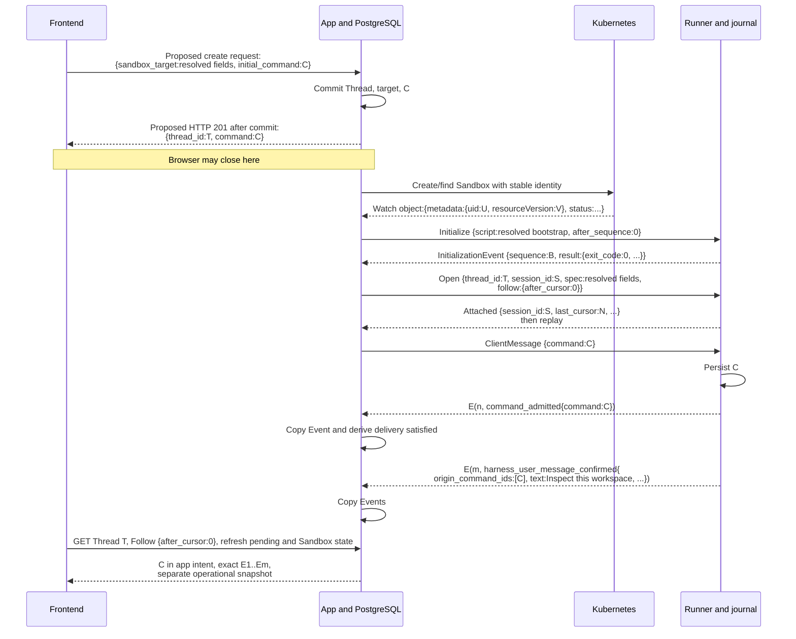
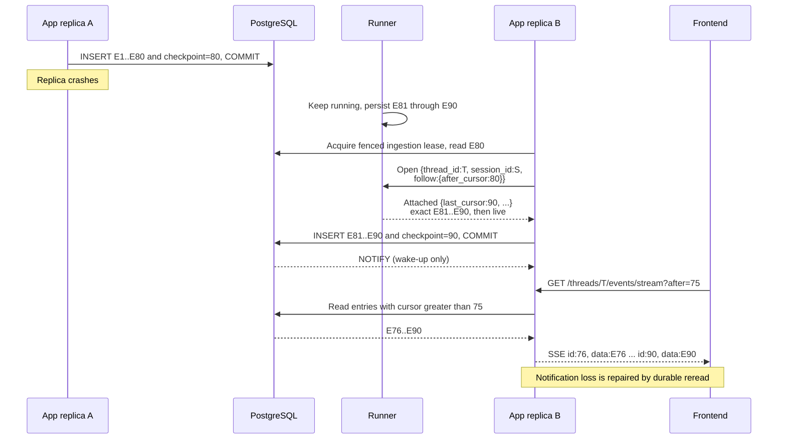
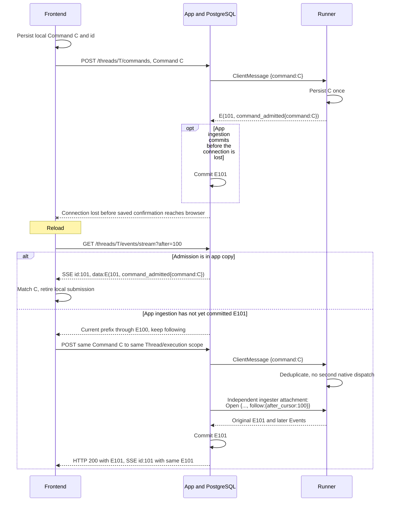
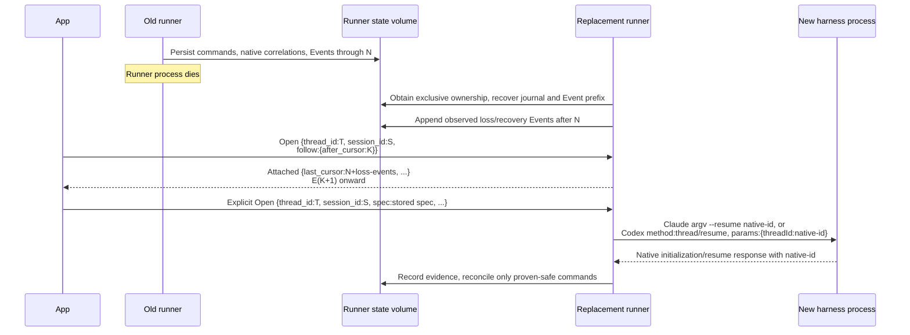

# Thread, runner, and harness layering

Status: **design under review.** This is the cross-layer source of truth for
identities, durability, command handling, and Thread presentation. It distinguishes
required guarantees from the open decision about accepting commands before a runner
is available. [The runner specification](../runner/SPEC.md) describes the implemented
runner contract; the target below is not a claim that every recovery case works today.
Protocol changes are atomic monorepo cutovers, with no old-runner/data compatibility.

## Product requirements

Agentplane manages Sandboxes and presents Threads as conversations. A user must be
able to trust what the page says:

- A saved input remains recoverable after reload and app restart.
- Submission, runner admission, native message confirmation, and completed model
  output are different facts. A model picker changes its applied value only on
  evidence of application; an interrupt request is not yet a stopped turn.
- The runner continues executing and recording while the app is unavailable.
- The app retains copied history after the Sandbox is deleted.
- Native traffic remains inspectable on demand even when normal conversation sync omits it.
  The initial design retains it losslessly; optional retention controls are a separate,
  deferred contract, never an implicit consequence of filtered delivery.
- Sandbox lifecycle, connection health, and native harness state remain distinguishable.
- The simple workflow is preset, message, Enter. Accepting that message before a runner
  exists is an additional durability promise, whose implementation is a separate choice.

Presets literally pre-fill editable fields, including Sandbox template, model,
standing instructions, egress policies, and action policy sets. Manual creation of a
Sandbox without a Thread and manual lifecycle/inspection surfaces remain useful.

## Authorities and representations



The runner is the harness-neutral command/event boundary. Its two adapters interpret
Claude and Codex semantics; they preserve the native messages they observe as well as
derived Events. Unknown native messages remain available for debugging. Derived facts
cite their native evidence. An outbound native frame records an attempted write, not
proof that the harness received or acted on it.

“Lossless” applies to retaining observed protocol traffic alongside its interpretation.
The common conversation projection is intentionally lossy. Neither the raw log nor
that projection claims to contain hidden harness state, every system prompt, or the
exact LLM API conversation. The runner also cannot preserve a native frame it never
received. Mocked-LLM tests observe a further boundary and establish what native receipts
actually prove. See [native harness evidence](harness_evidence.md).

The implemented frontend replays the exact archive. The proposed
[conversation-view sync](#planned-conversation-view-synchronization) adds a derived
read interface; it does not change runner Events or command admission.

| Representation                       | Authority and identity                                                                                                                                        | Ordering                                                                                            |
| ------------------------------------ | ------------------------------------------------------------------------------------------------------------------------------------------------------------- | --------------------------------------------------------------------------------------------------- |
| Native conversation                  | The selected harness; native ids and resume artifacts                                                                                                         | Harness-defined; not portable between Claude and Codex                                              |
| Thread                               | The operator's handle on one Event log: that log's id and stable URL, plus the name and archive state an operator sets                                        | Its Event log's sequence, presented through the conversation view                                   |
| Runner session / harness incarnation | Attachment and execution provenance within an Event log                                                                                                       | Does not create a new conversation or a new Event counter                                           |
| Runner command journal               | Exact immutable `Command`, identified by `command_id` within its execution scope                                                                              | Serialized admission; operation-specific execution                                                  |
| Runner Event log and app copy        | Runner appends; the app mints the copy's identity, with its static Sandbox association, on first sight of a runner session and persists the same `EventEntry` | One sequence per log across supported harness incarnations; app and browser track consumed prefixes |
| Sandbox and bootstrap state          | Kubernetes desired/observed objects; bootstrap's own log                                                                                                      | Separate operational state, with its own provenance                                                 |
| Conversation view                    | Pure projection of runner Events                                                                                                                              | Cards anchored to their causal Event; streaming may compact several Events                          |

One Sandbox can host multiple Threads. A Thread may resume through several harness
processes on that Sandbox. Current runner storage calls its durable, resumable container
a “session”; it already spans process restarts. That existing name does not establish
the target product Thread/incarnation relationship. The identity cutover must make the
mapping explicit without duplicating the log's static Sandbox on each association.

The Thread sits above its Event log rather than owning it. The app mints the log when it first
sees a runner session, and everything recorded hangs off the log: the copied Events, the feed
state, and the conversation view projected from them. The Thread adds only what an operator sets
(a name, and whether it is archived) under the log's id, so a Thread exists exactly when its log
does and ingestion never has to create one.

## What storage guarantees

The runner already has a command journal, Event log, and native resume artifacts.
These serve different purposes: retaining requested work, replaying observed facts,
and restoring the harness's own conversation. The app's PostgreSQL copy supplies
history while a runner is unreachable and after its Sandbox has gone away.

### Command protocol: intent, admission, then outcome

| Fact                                   | Evidence                                                                                                             | Meaning                                                          |
| -------------------------------------- | -------------------------------------------------------------------------------------------------------------------- | ---------------------------------------------------------------- |
| Local submission                       | Browser retains the exact command and id                                                                             | Awaiting saved confirmation; not yet a server durability promise |
| App stored, if an app outbox is chosen | Committed app command record                                                                                         | App owns eventual delivery even while the runner is unavailable  |
| Runner admitted                        | Durable runner journal and `CommandAdmitted`, which includes the full `Command`                                      | Runner owns processing; no native effect is implied              |
| Effect                                 | Causal `HarnessUserMessageConfirmed`, `ModelChanged`, interrupted `TurnCompleted`, or command-caused `HarnessExited` | The specifically evidenced operation took effect                 |
| Terminal non-effect                    | `CommandFailed` or `CommandNoop`, with reason                                                                        | The command will not subsequently take effect in that scope      |

A network write, timeout, or disconnected attachment is not one of the terminal
outcomes. Absence of an observed admission means “admission not observed,” not
“definitely never reached the runner.”

Retrying the same id and payload against the same surviving runner journal is
idempotent; a different payload under that id is rejected. This transport property
does not by itself make native execution exactly-once across a crash. The difficult
window is native execution followed by a runner crash before durable evidence of that
execution. Recovery needs native correlation/history or a native idempotency mechanism.
Blindly invoking the native operation again cannot supply the guarantee.

Saved input remains inspectable even if continuation is blocked. Unproven recovery
must expose its last durable facts and the blocked operation; it cannot invent success,
failure, or safe-to-retry status. A generic “uncertain” terminal outcome adds no proof.
Operations only become automatically recoverable after tests establish that recovery.

### Runner independence and Event durability

The target log must be an immutable prefix across replay, process restart, and the
declared storage failures. Every published entry, including Native frames and streaming
deltas, must survive the supported restart boundary and retain its cursor. Persist
before publication; batching may amortize synchronization but publication must wait
for the batch's durability fence. Losing an already published tail can otherwise
reuse cursors for different facts. The runner commits every public entry through
its SQLite durability fence.

The app ingester commits copied entries and advances its contiguous checkpoint in the
same transaction. Duplicate entries must agree in payload and provenance; a key conflict
must not silently hide a different Event. Notify browsers only after commit. Lost
notifications trigger rereads, not loss of history.

App restart or temporary app unavailability does not stop a runner. Runner-local
storage permits independent progress followed by catch-up. Storage exhaustion must
surface explicitly and stop accepting more work before the runner cannot record it;
silently trimming unreplicated history violates this contract.

### One Event high-water mark per log across harness sessions

There is one runner-owned sequence per Event log, and so per Thread, continued from
its durable journal through supported runner/harness restarts. The app checkpoint says
how much it has copied; the browser checkpoint says how much it has consumed. They are
positions in the same sequence, not additional Event counters.

Only one runner writer may own a log's journal at a time. Local storage ownership
and replacement handoff must fence the old writer before a successor appends or
retries commands. The app's ingestion lease only fences PostgreSQL copying; it does
not fence native execution or two runners writing the same log.

A copied high-water mark alone cannot recover lost runner state. The runner might
have emitted an unreplicated suffix while the app was offline. Starting a replacement
at “app high-water mark + 1” could reuse those positions and says nothing about lost
commands or native history. Restore the authoritative journal and recovery state
before continuation. If that is impossible, retain the app's known prefix and report
the unavailable history/recovery; do not silently manufacture continuous history.

### Storage loss and Sandbox lifecycle

Process restart with a surviving state volume is the supported recovery foundation.
Total loss of that volume while the app lacks its tail is a different failure class;
an app outbox can preserve input text but cannot recreate missing output or native
resume artifacts.

Managed suspension must preserve the runner state and allow the tested shutdown/resume
path. Kubernetes readiness does not prove native resume. The checked-in Sandbox
operating model removes the Pod on suspension and keeps its workspace PVC; processes
must be re-established. Verify the actual template's state mount and harness artifacts.

Managed deletion needs an explicit preservation rule: quiesce writers, drain output,
and copy the final durable runner prefix before releasing its storage. If the runner
is unreachable, retain the storage or explicitly report an incomplete archive.
Externally deleting the only remaining storage while the app is behind cannot carry
a no-loss guarantee. A Thread's archived page still displays the history the app has.

## Queue placement decision

**Current implementation slice:** require a reachable runner for submission and
make runner admission, app archival, replay, and UI state trustworthy first. Retain
the app outbox as a deferred option for “submit while unavailable,” including combined
Sandbox + Thread + first input. Its additional availability promise remains a future
product decision.

Both choices use the same generated `Command` and runner `EventEntry` payloads.
Runner storage is required in either choice. Adding an app outbox does not remove the
runner's native recovery obligations.

|                                       | Runner admission first                                     | App outbox before runner admission                                                      |
| ------------------------------------- | ---------------------------------------------------------- | --------------------------------------------------------------------------------------- |
| Earliest server promise               | Runner admission archived by app                           | App command transaction commits                                                         |
| Runner unavailable                    | Preserve draft, show unavailable; no server-queued command | App owns delivery and shows waiting for runner                                          |
| Tab closes after saved confirmation   | Runner continues; app has the input                        | Reconciler continues even if no runner exists yet                                       |
| Authoritative pending runner commands | Fold `CommandAdmitted` and outcomes                        | Same runner fold, plus app commands without observed runner admission                   |
| Additional durable app intent         | None for ordinary runner commands                          | Immutable command ledger and delivery reconciler                                        |
| Combined creation plus first input    | Deferred                                                   | Requires atomic Thread/target/first-command persistence and provisioning reconciliation |

### Message sketches used below

Arrows use abbreviated protobuf text, not new message types. For example:

```text
M = Command { command_id: "M", change_model: { model: "new-model" } }
I = Command { command_id: "I", submit_input: { text: "Continue the task" } }
C = Command { command_id: "C", submit_input: { text: "Inspect this workspace" } }
X = Command { command_id: "X", interrupt_turn: { turn_id: "turn-7" } }

E(41, command_admitted { command: M }) = EventEntry {
  cursor: 41
  origin: { source_id: "opaque-thread-log-id", sequence: 41 }
  event: {
    at: <runner timestamp>
    command_admitted: { command: <full M above> }
  }
}
```

`E(n, observation)` always carries the full envelope above. In this direct-copy
design, `origin.sequence` and `cursor` have the same value; they do not advance
independently. `ClientMessage { command: M }` and
`ServerMessage { event_entry: E(...) }` are the existing gRPC wrappers, elided
after their first use. HTTP/SSE carry the same generated payload in protobuf JSON.
Attachment setup is omitted where a stream is already open: each new gRPC attachment
starts with `Open` and receives `Attached` before commands/replay. The app's command
relay and its independent ingester may use different attachments.
Thread URLs and HTTP command responses containing the exact archived admission are implemented.
The `thread_id` selector on runner `Open` remains proposed; current `Open` only selects
`session_id`. Native sketches omit unrelated request fields.

### Runner admission first

The browser retains a command id and payload before sending. The app relays it to the
runner; the product reports “saved” after the contiguous PostgreSQL copy contains the
runner's `CommandAdmitted` for that exact command. Since that Event contains the full
command, the saved input and pending controls survive reload and Sandbox deletion
without an app delivery queue. The current bridge implements this archived-admission response
boundary; browser-local recovery and pending presentation are separate acceptance work.

A timeout preserves the browser's local submission as “awaiting saved confirmation.”
Reload catches up and matches by id; retry uses the same id against the same surviving
execution scope. Local persistence serves recovery of an unconfirmed submission; it
does not promise server delivery after closing the tab. Retry into a replacement
scope requires the separate successor-delivery decision.

#### Runner queues a model change



The diagram omits intermediate Native/turn Events; `n` and `m` identify the
respective outcomes with any intervening Events preserved in replay.
Admission order is serialized at
the runner; network arrival order across app replicas is not a global order.
Effects can occur in a different order. If a client needs model selection before its
next input, it must establish admission order, not race independent requests.

The app must not withhold that input until `ModelChanged`: Codex's effect depends on
the next `turn/start`. The runner scheduler handles native dependencies. An interrupt
targets the clicked turn and must not wait for queued inputs to finish. An outbox,
if added, preserves required admission order without waiting for each command's effect.

### Optional app queue

The app atomically saves an immutable `Command` and its target before promising
delivery. Existing Threads need only the command; combined creation also needs a
Thread id, resolved Sandbox target, and runner-opening intent. Presets are resolved
editable fields, not another runtime identity. Kubernetes owns Sandbox lifecycle.



“Saved by app, runner admission not observed” is an app fact. It does not appear in
an exact forwarded runner log. The command ledger is sufficient to reconstruct it;
a dispatch attempt remains diagnostic and a lost response does not establish failure.
A reconciler retries stable ids to the same journal and stops retrying on admission.

An app queue needs its own cancellation/expiry and unavailable-target semantics:
an interrupt for an old turn cannot wake a later turn, and a command cancelled before
delivery has an app outcome, not a fabricated runner `CommandNoop`. Cancelling after
an attempted write needs reconciliation because runner admission may be unobserved.
These obligations are part of choosing an app queue, not details to defer after
calling it authoritative.

## Reconnect and catch-up

### App restarts while the runner continues



Several app replicas may relay commands; one fenced ingestion owner per Sandbox
copies all its Threads. The relay need not be the ingester. Lease handoff must fence
writes in the same transaction as copying. No database transaction spans a network call.

### Browser loses a submit response, then reloads



A browser may follow from zero on a fresh load. A saved cursor is valid only with the
corresponding cached prefix/projection; persisting the cursor alone would skip history.
Duplicate delivery is harmless; missing or conflicting sequence entries are errors.
Replay hands off to live following without a gap. Notifications are wakeups, never
the authoritative transport of history.

### Runner restarts with its state intact



A harness-only crash follows the same evidence rules without replacing the runner.
An app outage by itself never triggers native resume. An attachment disconnect is
not a harness stop. Sharing a Thread id and counter does not prove native continuation.

## Timeline, pending queue, and operational state

The Thread page combines three views with different meanings:

- **Conversation:** a deterministic fold of runner Events. Confirmed user input is
  placed at its confirmation; assistant/tool items are anchored at their start and
  updated by subsequent deltas. Control effects get distinct system cards.
- **Pending commands:** runner admissions without terminal outcomes. If the app outbox
  is chosen, also include app-stored commands without observed runner admission. Local
  unconfirmed submissions are visibly local until matched with durable evidence.
- **Operational state:** Sandbox desired/observed state, bootstrap output, and runner
  connection health, including staleness. These can explain blocked work.

The normal conversation approximates what the harness exposes. A native acknowledgement
need not prove an LLM request was made or native history was durably flushed. Input
confirmation retains all originating command ids and the evidenced native text/grouping:
Claude can coalesce requests; Codex can preserve them separately. Receipt strength must
remain tied to the tested harness behavior.

Raw mode adds native frames, exact Events, ids, source references, and command details
to the same page. A streaming card can span many interleaved Events; expanding it must
preserve access to their exact order. Normal card order is not the chronology of every
delta. Confirmed input can appear after assistant output emitted while that input waited.

The app uses one chronological conversation-block projection in both modes. Confirmed input and
control observations split collapsible item runs; toggling Raw does not substitute a different
conversation order or reset its disclosures. A block's cards show the current aggregate at their
first-observed position, explicitly labelled with the consumed prefix in Raw. Its exact Events
remain in cursor order below the aggregate, including complete native envelopes and causal links.
The operational `Attached` disclosure stays outside that timeline and shows both advertised and
consumed cursors. Pending commands remain above the composer, separate from confirmed messages.

### Shared vocabulary does not require a fabricated single history

Both app and runner can serve the same followable runner Event log, preserving cursor,
origin, and payload. They serve different retained prefixes of it. Operational snapshots
already have a separate app source; those are useful state even without a lifecycle
audit log. History/audit, if desired, must persist observations with their source and
cannot be reconstructed exactly from Kubernetes' current snapshot.

The current runner `Attached` snapshot is another distinct observation: its `last_cursor`
can exceed the app's copied prefix while replay catches up. The app persists that snapshot
before the missing Events. Report its runner provenance and as-of cursor separately; do not
seed or overwrite a conversation or pending-command reducer with state from beyond its
copied prefix. The current transport's `attached` frame is not a replay checkpoint.

For an app queue, its pending snapshot can join command records and copied Events in
one PostgreSQL read, reporting the included runner cursor. Reconnect refreshes that
snapshot; a second append-only browser command feed is not inherently required. The
frontend still consumes generated Commands and Events, not guessed delivery statuses.

If a future single activity feed includes app admission or Kubernetes observations,
it must be explicitly an **app activity projection**. Preserve each runner Event and
its original cursor inside it; an app activity cursor means app observation/commit
order, not harness execution order. Multiplexing kinds on one connection cannot make
their independent orders a total causal order. A new activity log is optional and
should earn its persistence/replay machinery from an actual audit requirement.

The current UI uses one runner Event feed and the existing operational snapshot
mechanism. The planned read interface below changes normal conversation loading, not
the exact archive or command path. Component-local state remains for drafts and
presentation, not server delivery orchestration.

## Planned conversation-view synchronization

The [Thread view synchronization design](thread_view_sync.md) owns the proposed
conversation records, sync-engine integration, materialization, snapshot/live handoff, long-gap
catch-up, history/payload hydration, on-demand Raw, frontend ownership and validation.
It is an explicitly derived read API, not a filtered version of the runner Event
stream. The HTTP/SSE sequence diagrams above describe the current implementation.

The normal view will load selected assembled state and follow it through the chosen sync engine.
Commands keep their runner-first admission semantics. Operational snapshots keep
their own provenance. No second command queue or authoritative Event sequence is
introduced. The initial implementation retains the complete exact runner archive;
optional retention changes require a separate, explicit contract.

## Required harness-loss and Sandbox lifecycle cross-check

| Boundary to test                            | Required evidence                                                                                                                                      |
| ------------------------------------------- | ------------------------------------------------------------------------------------------------------------------------------------------------------ |
| Native adaptation                           | Separate Claude/Codex scripted tests assert exact relevant model request contents and input cohorts, not just natural-language prompt instructions     |
| Admission and relay loss                    | Crash before admission and after admission before app copy; preserve id/text, deduplicate same id, reject changed payload, recover across replicas     |
| Native execution before outcome persistence | Kill real harness/runner at that exact window; prove how history/correlation prevents duplicate LLM input or explicitly gate automatic recovery        |
| Command outcome and public Event commit     | Commit or roll back the exact outcome and Event together; multi-input coalesced receipts settle every origin atomically                                |
| Streaming durability                        | Kill process and exercise unsynced-storage loss; published Native/delta entries never disappear or reuse their cursor                                  |
| Model and interrupt scheduling              | Codex pending model plus next input makes progress; applied UI state waits for effect; interrupt does not block behind input completion                |
| Queued input interrupted                    | Each input is confirmed, dropped with evidence, or demonstrably retained for later processing; no inferred queue fate                                  |
| Long tool interrupted                       | Pin partial output, process abortion, tool result, and the fate of queued inputs on the next prompt, separately per harness                            |
| App/browser reconnect                       | Competing ingesters, stale lease owner, lost wakeup, reload after lost submit response, and replay/live handoff converge on the same durable prefix    |
| Suspend/resume and deletion                 | Real state mount survives intended Pod replacement; native resume is evidenced; final archive is copied before managed storage removal                 |
| Writer replacement                          | Fence old runner, continue the same Event journal, preserve native references; missing journal cannot be replaced by an app checkpoint                 |
| Normal/Raw UI                               | Streaming, grouped inputs, admission without effect, failed/no-op, suspended/deleted Sandbox, local unconfirmed submission, and additive native detail |

### Deferred: commands unsettled across successor sessions

Keeping one Event journal per log does not decide whether an unsettled command is
valid in a successor execution scope. Preserve the original target and causal ids.
Do not replay automatically into a successor until both harnesses' native evidence
and the operation's target semantics establish that this is safe.

## Review boundaries

### Runner SQLite mode

The runner uses SQLite rollback journaling with `synchronous=EXTRA`, including the
directory fence after journal removal. The Bazel Python runtime verified for this
cutover links SQLite 3.50.4, which predates the
[WAL-reset repair](https://sqlite.org/wal.html#walreset). WAL is inappropriate until
the linked runtime contains that repair (3.50.7 backport or 3.51.3 and later).
The runner's serialized connection does not require WAL's concurrent-reader benefit.
SQLite owns crash recovery; no custom JSONL repair or old-format import remains.

### Remaining identity and delivery boundaries

The [current runner specification](../runner/SPEC.md) exposes a session-scoped SQLite
journal with atomic command/Event commits and publication after the storage fence.
The target runner Thread identity/cursor change and native crash recovery need implementation
and integration evidence. Canonical Thread pages replay the archived prefix without a live runner;
the app's saved-response boundary waits for archived admission, not command effect. An app outbox is a separate decision about accepting work
before the runner can; it does not satisfy those gates by existing.

No cross-harness transcript portability, inferred native effects, or old-protocol
compatibility is promised.
