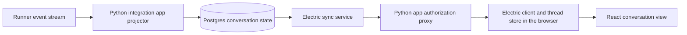

# Thread view synchronization

Status: **implemented; acceptance incomplete.** The server-side fold in
`agentplane/app/agent_runtime/view/fold.py` is connected to PostgreSQL through the
transactional writer. The integration uses Electric through its published TypeScript client:
one shape per thread and per payload field, with the browser's window loaded as subsets of them.
See [app implementation notes](../app/README.md) for endpoints and storage details.
The acceptance requirements below remain gates, including browser behavior and server
memory; implementation presence is not evidence that they have passed.

[Thread layering](thread_layering.md) owns command admission, runner identities and
execution durability. This document owns the materialized conversation and partial
browser state. Record names below describe domain concepts; concrete schemas and wire
representations remain implementation decisions to validate with the sync integration.

## Requirements

[Thread sync requirements](thread_sync_requirements.md) states what any sync implementation
owes the browser, with IDs; the list below is the whole view's.

- A Thread has one ordered history. Existing items can change anywhere in it, including
  parallel tools completing out of order. Editing earlier user input, forks and branches
  are outside this contract.
- Opening a Thread reads its tail and current controls without replaying its history.
  Earlier items load only on demand. A tab left open for months retains a limited tail
  and reading window, with eviction and virtualization.
- Neither browser nor server processes may require a complete conversation in memory. Resident state
  scales with selected windows/content, active execution state and bounded processing
  batches, not total conversation length or the number of raw frames.
- Text and tool arguments stream when the harness exposes deltas. Completion may replace
  the accumulated value. Tool results update the invocation they identify.
- Reads cost the requested items and selected content, independent of total conversation
  length apart from indexed lookup. A count limit does not promise a response byte bound.
- The runner persists semantic batches before forwarding them; the app commits projected
  state before publication to browsers. Multiple replicas and listeners share committed
  state. Disconnecting a reader does not interrupt execution.
- Raw capture is independently optional in the target storage model. Retained evidence is
  accessible at the item or turn that produced it, as well as in original chronology.

The [September 15 inspection](../debug/thread_load_20260915.md) measured 3,091 Events and
approximately 1.79 MB of SSE for eight turns with 6,278 bytes of completed text/reasoning.
It is a historical host HTTP measurement, not a current browser benchmark. It motivated replacing browser archive replay with the materialized view described here.

## Conversation structure and projection

`Segment` is the readable unit. Its first-observed runner cursor identifies and orders it
within the source. Later changes preserve that position. Its `revision_cursor` identifies
its latest modification; each content field has its own immutable `PayloadRef` revision.
Source and projection epoch scope all of these identities.

An `Item` accumulates assistant text, reasoning, or a tool invocation. Its text, arguments
and output have independent references. Its observed completion is separate from whether
its bodies are loaded. A known turn association stays attached across later updates.
Confirmed input separates its selectable body from harness identity, turn and origin command IDs.
Turn boundaries, model effects and harness lifecycle observations retain their existing Event types. Command admission/outcome observations
produce separate command summaries. Display grouping is a rule over the loaded items;
it does not require an entire turn or an ever-growing group object.

| Observation                             | Projection                                                                                        |
| --------------------------------------- | ------------------------------------------------------------------------------------------------- |
| Confirmed user input                    | Preserve confirmed text and all origin command IDs at confirmation position.                      |
| Item start or first mention             | Establish identity, order and available turn context.                                             |
| Text / argument / output delta          | Append content to that item's named field; preserve other fields' references.                     |
| Complete arguments or item completion   | Replace the corresponding field with its authoritative value; preserve the invocation's position. |
| Command admitted                        | Record pending summary and exact admission provenance.                                            |
| Command effect, failure or noop         | Settle that same command, including one outside loaded history.                                   |
| Turn interrupted / failed, harness lost | Preserve explicit outcome; unfinished items do not become successful completions.                 |
| Native, stderr, test checkpoint         | Advance projection coverage without inventing a conversation item. Keep evidence separately.      |

Updates address item identities, never "the last message". For example, tools A then B
start at cursors 100 and 110; B completes at 120 and A at 130. Their final order remains
A, B, with revisions 130, 120. Partial tool arguments are text until an authoritative
complete JSON value arrives. Do not invent argument streaming for a harness that exposes
only the complete arguments.

Unknown semantic observations halt the affected projection with an explicit diagnostic.
Unknown native traffic remains available when captured. New harness-native kinds need an
adapter decision; treating every unknown item as a tool call is not a domain definition.

## Positions and partial state

Three positions have distinct meanings:

- **Segment cursor:** stable identity/order in the source's history.
- **Revision cursor:** the observation that last changed an entity or content field.
- **Sync token:** the sync engine's opaque continuation state for a particular shape.

`Position` is the projector's processed source prefix and epoch, **not** the third token.
Electric offsets, shape handles and transaction snapshot metadata are engine-owned. They
must not be compared with runner cursors or replaced by a maximum observed item revision.

`ViewState` carries the committed projection position, controls and unresolved command
count. That count covers all commands, not merely the loaded page. A runner `Attached`
snapshot can be ahead of the archive and must not seed event-derived controls.
An HTTP admission receipt likewise does not advance projection or subscription progress.

A body is either included whole at its reference or explicitly omitted. Included empty
content, content not yet observed, omitted content, and unavailable content are different
states. An actively streaming value is complete **at its current revision**; it is not
truncated to satisfy a query budget. Body selection does not remove item metadata or
completion facts. Reasoning and tool outputs can remain omitted until requested.

## Queries

These logical operations map to sync-engine queries or existing app HTTP calls. They do
not mandate a second wire protocol beside the engine.

| Operation                   | Meaning                                                                               |
| --------------------------- | ------------------------------------------------------------------------------------- |
| List segments, no direction | Latest N segments; return in conversation order.                                      |
| List before cursor          | Closest N earlier segments, excluding the cursor.                                     |
| List after cursor           | Closest N later segments, excluding the cursor.                                       |
| Get segments by cursor      | Exact identities, even outside loaded windows.                                        |
| Read payload                | Whole immutable selected content, or typed unavailability.                            |
| List pending commands       | Keyset page by admission cursor.                                                      |
| Get commands by ID          | Reconcile admitted and settled commands after a lost response.                        |
| Follow selected commands    | Live authoritative rows for a bounded set of command IDs, including settled outcomes. |
| Submit                      | Existing runner-first command admission; no app queue.                                |

There is no `around` operation, offset pagination, query byte budget or truncated body.
Counts have server maxima. `ContentSelection` explicitly chooses text, reasoning, tool
arguments and output; selecting nothing still returns metadata and references. Selecting
text includes confirmed user input as well as assistant text. The `ConfirmedInput` record separates that selectable body from its metadata; the
exact confirmation Event remains evidence at the Segment cursor.

A page's `position` reports its short consistent database snapshot. `exhausted` states
whether anything else existed in that direction at that snapshot. Before/after paging
continues from returned item cursors, not a count of scanned native Events. A by-ID query
returns only existing requested items and marks its result exhausted; absent IDs are
absent at the sampled position. A minimum processed cursor is a lag precondition, not a
filter or a subscription token. Missed deadlines report lag rather than stale success.

## Reuse the synchronization engine

**Selected integration: Electric, through its published TypeScript client.** Agentplane
owns projection, domain records, command admission and authorization. The engine should
own snapshot/live handoff, transaction reconciliation, resumable delivery and refetch.
Do not implement an Agentplane `Changes` journal, suffix wire messages, client replay
reducer or `FollowView` service before establishing a concrete gap in that integration.

Electric documents changes-only shape logs plus subset snapshots with ordering and limits;
its snapshots carry PostgreSQL transaction metadata for reconciling concurrent changes.
Shapes can select columns and are immutable. See the [HTTP API](https://electric-sql.com/docs/api/http)
and [shape definitions](https://electric-sql.com/docs/guides/shapes). These are capabilities
to exercise against pinned versions, not evidence that Agentplane's acceptance cases already
pass; `agentplane/app/test_electric_subset_window.py` pins the ones below against the deployed
Electric.

A thread is one entity shape, and each payload field one chunk shape, both opened from now
with changes-only logs; a shape's predicate names only the thread and its projection epoch,
so it never changes. The browser loads its window as subset snapshots of those shapes, which
Electric ANDs with the shape's predicate and reconciles with the live log through the
snapshot's transaction metadata: the tail and each page before the oldest held row by
`entity_index`, the view state, pending commands, commands by ID, and bodies by
`(owner_id, generation)` pair. The proxy pins every shape and admits only those subset forms,
with bounded limits. Nothing is replayed on open, and every later change to a held row
arrives on the one live log, wherever the row is. A body renders as far as its reference's
chunk count, so a chunk arriving ahead of the metadata that names it stays hidden. There is
no persistent browser cache.

**Deviation:** the live log carries every change in the thread, including rows outside a
reader's window, which the client discards. Electric's client withholds a shape's
`up-to-date` from a stream that reopens a shape it followed within the last minute, so the
store gates subsets on the first subset's response, never on that message. It also moves a live
stream to a subset response's offset, which skips changes to rows outside the subset; the store's
fetch client hands a subset response the stream's own offset back.

Against the [requirements](thread_sync_requirements.md), it falls short in four places:

- **E5:** the live log re-sends nothing a reader holds, but it carries rows the reader discards.
- **O2:** Electric runs one active instance per replication slot, with shape logs on local disk.
- **P10:** nothing evicts ([§ Retained browser state](#retained-browser-state)).
- **E6:** a thread with no fold yet has its scope re-read on a one-second timer.

Shapes per thread, shared by every reader of it: one entity shape, plus one per payload field in use.

Acceptance must still establish:

1. **Limited bootstrap and recovery.** Establish changes-only/on-demand synchronization
   and fetch the selected tail. A full shape for the whole Thread must never load as an
   initialization or recovery side effect. The collection documentation describes some
   persisted-cache recovery paths that request a full shape even in on-demand mode.
   Initially omit persistent browser caching; still test handle expiry and library reset
   paths. Reject a configuration that silently falls back to full history.
2. **Membership versus live traffic.** A limited subset snapshot does not limit the
   underlying live shape: the thread's shape carries updates to unloaded items, and each
   field's shape every chunk of that field. Measure that traffic, and keep large bodies
   out of the entity shape. Live updates to unloaded items must not accumulate an
   implicit full-history cache; the store drops them, and a later subset obtains their
   current committed state.
3. **Atomic visibility.** PostgreSQL transaction atomicity does not establish atomic React
   publication across several collections. Evaluate one entity collection containing
   segments, controls/checkpoint and commands, with queryable kind/cursor/identity columns.
   Publish a visible transaction only with every relevant selected update. Keep immutable
   payload data separate and select it by reference. Cross-collection consistency needs
   proof before using a different layout.
4. **Streaming storage.** Database row replication must not retransmit the entire growing
   text on each write. Replicate immutable content chunks and changing manifests/references;
   hydrate the selected revision through the supported snapshot mechanism. Assemble the
   whole selected body for reads. Final replacement switches its manifest atomically.
5. **Authorization and operational cost.** Proxy shape access through the app's existing
   caller checks; the app owns Thread predicates and allowed columns. Test cookies, expiry,
   cancellation and reconnect through the deployed ingress. Measure logical replication,
   retained WAL and sync-service failure/recovery as well as app-replica replacement.
6. **Library ownership.** Use the published client for reconciliation; do not hand-interpret
   Electric snapshot metadata or maintain a second mutable cache. Pin versions, generate
   domain types once, and verify exact 64-bit cursor handling.

### Rejected designs

- **The window in a shape's `where`.** A shape's predicate is fixed when it is created, so a moved
  window is a new shape. It replays the overlap (D1, E5) and withdraws the old shape's rows (P5).
  And a tail bound that moves with every appended row mints a fresh shape each time a growing
  thread is opened, which spends `ELECTRIC_MAX_SHAPES` without ever hitting the cache.
- **Fixed-bound pages.** Pages that never move meet D1, but they cost:
  - a shape for every page and every field in use (O1);
  - a landing pad for a row that crosses a page boundary;
  - a caught-up signal gated across pages (S3).

  Subsets of one shape meet D1 without any of these.

- **TanStack DB's Electric collection.** Its on-demand mode deduplicates only identical requests,
  so a live query whose `where` moves fetches the overlap again. The raw client's
  `requestSnapshot` reads only the rows it asks for.
- **Completed bodies over a separate HTTP route.** It gives one body two read paths (D2). It also
  assumes that a body which has stopped streaming never changes, which P3 does not grant.
- **Polling the whole thread.** It fails E6 by construction, and E2 and E5 with it.

Zero is the next engine candidate if Electric fails a required case; it supports query-driven
partial sync but introduces its own replica and client integration. Matrix supplies useful
limited-timeline and gap-recovery ideas, but its message-edit events do not provide streamed
field replication without extra semantics. AG-UI, AI SDK and ACP provide useful agent-event
vocabularies; they do not remove the storage/projection work. Evidence from the evaluation
should select an engine before proposing a custom REST/SSE fallback.

## Component responsibilities



The Python app folds runner events and writes ordinary PostgreSQL transactions. Electric
runs as a separate service, consumes committed changes through logical replication, and
serves selected data over HTTP. Its TypeScript client feeds the browser's thread store,
which renders projected records without folding raw harness events again.

The app proxy authenticates callers and fixes the permitted conversation predicates,
tables and columns. Client-supplied sync parameters must not widen those permissions,
including subset query bodies. Proxy replicas share authorization state and the same
Electric endpoint; browser sessions must not require replica affinity. Commands continue
through the app's existing admission API. The proxy does not own another conversation
cache or implement snapshot/live reconciliation.

### Server memory ownership

The full durable conversation belongs in storage; no integration-app replica needs an
in-memory copy of it. Updating an old item requires indexed reads of that item and the
batch's other affected entities, independent of the size of the preceding history.

| Component                 | Resident state target                                                                                                 |
| ------------------------- | --------------------------------------------------------------------------------------------------------------------- |
| Integration app/projector | Current batch, touched entity metadata, checkpoint and bounded queues; release after commit.                          |
| Read/auth proxy           | Requested window or selected content and bounded transport buffers; no per-listener conversation copy.                |
| Runner                    | Required active execution state, recovery checkpoint and bounded journal buffers; page historical entries from disk.  |
| Electric                  | Bounded replication buffers and caches for active shapes; persisted shape history must not require full residency.    |
| Postgres                  | Durable records and indexes with configured buffer/query memory; conversation size does not mandate loading all rows. |

Electric's server memory behavior is an adoption gate, not an established property of the
spike. Measure its resident memory as stored history grows with fixed active subscriptions,
and during initial shape creation, reconnect, restart and a stalled downstream reader.
Identify supported cache/shape lifecycle controls and replication backpressure; document
any unavoidable per-shape metadata growth. Browser transfer measurements do not establish
server memory bounds. Selected large content and concurrent work may cost proportional
memory, but inactive conversation history must remain pageable from durable storage.

## Storage and durability

The initial implementation projects the existing exact archive. Each worker transaction
validates its source/checkpoint, loads the affected prior records, applies a batch, commits
changed records/content and advances `ViewState`. Serialize per-Thread writes with a row
lock or fenced ownership. Recovery rereads the durable checkpoint; notifications are only
wakeups. Every app replica serves the same committed data.

Do not reconstruct all segment maps, sort all history or recount every pending command per
batch. Required work is proportional to incoming observations, touched entities and new
content. Store pending counts with the same transactional transitions. Projection rebuild
is explicit background work into a new epoch, never a first-view or reconnect operation.
Workers release preloaded entities, payload writes and evidence associations after each
committed batch. Replay and rebuild page through durable storage; neither needs a complete
conversation map in memory. A stalled reader cannot make ingestion or proxy queues grow
without bound: apply backpressure or end the subscription and resume through the engine.

Store append chunks and manifests so writes cost new content, rather than rewriting every
prefix of a growing string. Authoritative completion can replace streamed content, even
with an empty value. Immutable references need a documented retention lifetime and explicit
expiry; retaining a reference must never silently return a different revision. Query reads
return a whole selected value irrespective of storage chunk boundaries.

The target durability path is:

```text
harness output -> runner commits semantic batch -> runner forwards batch
               -> app commits content + projection + ingestion checkpoint
               -> sync engine publishes committed state -> browser
```

Batching amortizes commits without requiring provisional browser text. Runner-process or
app-replica crashes replay from committed checkpoints. An uncommitted runner batch has not
been forwarded. Permanent runner-volume loss can lose observations not yet copied to the
app; app-committed content survives under the app database's storage guarantee. Output the
runner never received is outside this guarantee. Measure commit latency on actual storage
before relaxing publication durability.

Runner restart uses persisted recovery state, indexed pending commands and paged journal
reads. Its independent runner PR must demonstrate that open and recovery work stay bounded
as retained history grows. During execution, retain required active state and bounded journal buffers;
page historical entries from disk rather than accumulating them in process memory. Native
harness context and resume cost are separate measurements; bounding Agentplane's memory
and work does not prove Claude/Codex's own execution or resume is bounded.

## Snapshot, live stream, and command recovery

These interactions state observable requirements; the engine supplies the actual wire
messages and snapshot reconciliation algorithm.

### Open at the tail

Subscribe through the engine to metadata/current controls and request the latest 30 items
with text selected, reasoning and tool bodies omitted. The metadata collection catches up
to the sampled projection position through the engine. Selected text loads from its exact
payload reference; loading is explicit until its whole revision is available. Follow
concurrent changes using engine sync tokens. No replay of old token Events and no hidden
background history load.

### Scroll upward while an old item changes

At processed source cursor 1000, request before item 400. The page reflects cursor 1010,
while live changes include an update to an item on that page at 1030. The engine reconciles
the snapshot and live transaction stream so 1030 wins. A late page cannot regress the item,
and a page ahead of the currently installed transaction state cannot masquerade as an
older consistent view. Preserve the visible item and pixel offset after prepending.

### Reconnect

For a disconnect, the engine resumes the same shape from its own token and deduplicates
delivery. When Electric retires a shape's log, reload the rows held as fresh subsets while
they stay on screen; when the projection epoch is gone, read the scope again and replace the
window once the new one has caught up. Restore an old reading position with by-ID and before/after
queries. Preserve drafts, disclosure state and reading position. Do not download the items
between that position and the tail. Ignore late callbacks from superseded subscriptions.

### Expand content during streaming

An item points to output revision R. Hydrate that whole immutable value on demand and use
the engine's supported content subscription for subsequent chunks/manifests. The reference
is not a replacement for its sync token. If a newer manifest is selected before the read
returns, cache the old immutable value without substituting it for the new one. Content
writes use field identity, so an
output update cannot make an independently loaded arguments value appear stale.

### A command response is lost

Keep the exact local Command and ID. Query that ID, including settled commands outside the
visible history. `NotObservedThrough` is not a NACK. Retrying uses the same ID and payload;
a different ID risks duplicate work. Admission marks saved intent, while model/interrupt
controls change only on their observed effects. The runner remains the only command queue.

## Raw and debug surface

An item has indexed evidence associations to its producing observations and their native
`source_sequences`. These are many-to-many and demand-paged, never an ever-growing list in
the item's routine sync row. Evidence with no item association belongs at its turn/lifecycle
position. Offer both "evidence for this item" and original chronological inspection.
Retained raw identities remain source/sequence pairs independent of projection epoch.

The target separates three lifetimes: durable semantic content and execution facts;
engine replay history for reconnect; optional raw/native capture. Omitting content from
browser queries changes none of these retention policies.

Initially retain all current Events. Before allowing capture to be disabled, make the
semantic journal/checkpoints sufficient for projection and recovery without native frames.
The existing dense Event stream mixes native and semantic observations: simply dropping
Native rows would violate its contiguous-prefix checks. Define a semantic replication
sequence/checkpoint and independent raw identities at that cutover; missing capture must
not look like a corrupted semantic stream. Keep native resume artifacts under their own
ownership, separate from debug capture.

Raw batches may live compressed in object storage with indexed manifests in PostgreSQL,
without one database transaction per packet. Record whether evidence was not captured,
expired, not yet archived or lost. Raw-free recovery cannot reinterpret discarded native
traffic after an adapter bug. Journal compaction must wait for durable downstream uptake
or a sufficient retained checkpoint; it must not delete the only recoverable content.

## Frontend ownership and acceptance

One normalized server-state owner serves the open Thread: the thread store holds loaded
entities, and components read them from it rather than copying them into another mutable
store. Payloads are immutable caches
keyed by reference. Drafts, local unconfirmed commands and viewport/disclosure state retain
their distinct local provenance. Logout clears subscriptions and user-scoped caches.

Keep a limited tail and reading window; evict the middle. Virtualization limits mounted DOM
independently of network/cache limits. Unloaded bodies, fetch failures, empty bodies and
incomplete harness output must look different. New output follows the bottom only while
the reader is already there.

### Retained browser state

Keep the tail and the current reading window independently; opening an old page does not
load the intervening history. Explicitly selected bodies and a small prefetch margin may
remain resident. Moving the reading window releases obsolete page interests and evicts
unneeded entities, body chunks/manifests and assembled values from the collection caches.
Closing a body or retiring a selection releases its subscriptions and outstanding request
references. Late callbacks must neither change the active selection nor repopulate retired
caches. Shared data stays resident only while another active interest or bounded cache
policy needs it. Persistent browser caches, if enabled later, also need eviction policies.

**Not met:** the current store evicts nothing. It holds every row it has loaded and every row
added at the tail since, and every body it has shown, until the thread is closed.

Eviction is local, not a deletion from durable history. Retain only the necessary lightweight
viewport anchors, drafts and local command state; rereading an evicted page obtains a fresh
subset and reconciles with live changes through the engine. A failed historical read stays
explicit rather than silently restoring an obsolete copy. Retained memory may scale with
large selected bodies: this requirement does not introduce query byte budgets or truncate
content at a reported revision.

### Acceptance evidence

Required evidence before accepting the integrated implementation:

- Projection parity over different batch boundaries, including parallel tools finishing in
  reverse order, authoritative replacement, independent content fields, unknown observations,
  command outcomes and interruption. Invalid batches publish no partial state.
- Transaction/crash tests for source/checkpoint validation, duplicate delivery and app-replica
  takeover. Notifications lost across reconnect cannot lose committed data.
- Real sync-engine/browser tests for history/live races, content selection, expired handles,
  large individual bodies, unsubscribe/refetch, auth and old subscription callbacks.
- Scale comparisons over orders of magnitude of history: initial queries and reconnect fetch
  only requested windows; per-batch projection and memory do not scan/retain full history.
  Measure transfer, storage writes and browser paint separately. Large selected content may
  cost proportionally to its size; a fixed item count is not a fixed number of bytes.
- Repeated scroll/load/evict/revisit and open/close body cycles, with background updates to
  evicted items: collection row counts, subscriptions and retained heap must stabilize for a
  fixed set of interests as total history grows. Verify release in the thread store and Electric's client,
  not only disappearance from the DOM. Revisit must show current revisions; drafts and the
  visible scroll anchor survive eviction and reconnect.
- Measure live traffic for updates outside selected windows separately from fetched snapshot
  size. Record any unavoidable metadata traffic; omitted bodies must stay off the wire.
- Long-running ingestion and slow-reader experiments must bound worker/proxy buffers; runner
  execution and recovery use bounded journal buffers and checkpoint plus paged suffix.
  Native harness memory/context and resume cost are measured separately.

## Implementation boundaries

Review the conversation model and requirements first. The pure incremental projector and its
semantic tests are a separate change. Evaluate the existing sync integration independently
of that server fold, then implement transactional materialization and integrate the browser.
Tail loading, history paging, content selection and reconnect must all be exercised before
cutover. Remove the obsolete full-history browser reducer at that cutover.

Optional raw capture and journal compaction follow durable semantic storage. This document
changes no running runner, database schema, command queue, transport or capture policy.
The parked Connect and gRPC-Web experiments remain reference material; no transport migration
is required to choose the domain model or the sync engine.

## Transport experiments

The parked [Connect server PR](https://github.com/agentydragon/ducktape/pull/7079) and
[browser PR](https://github.com/agentydragon/ducktape/pull/7083) preserve reusable replay/feed
semantics. Its generated Python client yielded no frames in a recorded 20-second open-stream
probe; the cause was not established. Separate ASGI mounts also needed explicit authorization
wiring. These constrain that evaluated integration, not every implementation of Connect.

The gRPC-Web/Envoy spike at commit `7e1a36d8` worked, but required an additional translation
hop in production and the browser acceptance environment. A native Python gRPC client bypassed
that browser wire. Generated protobuf domain types remain useful independently of either RPC
transport; choosing a domain model does not require committing to protobuf or RPC services.
