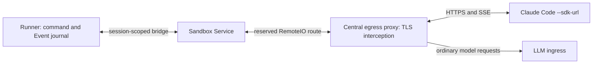

# Claude RemoteIO as an optional Agentplane transport

Status: **unranked evaluation**, tracked as `CLAUDE_REMOTE_IO_EVAL` in the [task DAG](task_dag.md). This plan authorizes no runtime cutover. Keep the runner's current `stream-json` path available while evidence and parity are established.

## Why investigate

Claude Code 2.1.292 has a hidden `--sdk-url` mode. Static debundling in the sibling private repository found a RemoteIO worker that reads commands through an authenticated SSE stream, uploads structured output and internal transcript rows over HTTP, and reports command delivery separately. The server contract has not been verified with an independently implemented server. Agentplane currently pins Claude Code 2.1.252 ([`MODULE.bazel`](../../MODULE.bazel)); version-specific behavior must be retested against the binary chosen for the runner.

The possible product gain is better access to Claude's internal transcript, especially compaction summaries and their restoration after resume. **This is a hypothesis, not a unique capability established for RemoteIO.** In a measured 2.1.233 `stream-json` capture, Claude emitted a `compact_boundary` followed by a synthetic `user` frame containing the summary ([runtime contract](../docs/claude_runtime_contracts.md#compaction-on-the-wire-measured-21233-re-verify-on-21252)). The runner retains these frames as raw `Native` evidence but does not project a typed compaction item ([runner contract](../runner/SPEC.md#harness-originated-messages)). First compare what each transport actually exposes, when it becomes durable, and what remains after restart. If displaying the summary is the only verified gain, scope that feature against the existing transport before committing to a new server.

Other possible gains to measure are delivery states, reconnect and replay, internal transcript hydration, and cleaner separation between Claude's process and its controller. Compare their semantics with Agentplane's existing journal; a second network ledger is not automatically a stronger guarantee.

## Proposed boundary

Give Claude an HTTPS `--sdk-url` whose host passes its ordinary CLI allowlist and whose path is reserved for an Agentplane session, for example `/agentplane/remote-io/sessions/{session_id}`. The central egress proxy already terminates sandbox HTTPS with a CA in the runner's trust bundle and streams admitted response bodies ([egress contract](../egress/SPEC.md), [`responseheaders`](../egress/addon.py)). Add an **exact host, path, method, and authenticated caller** route for RemoteIO. This is a proxy dispatch rule, not a DNS rewrite and not a general replacement for requests to the allowlisted host. Its CONNECT is admitted by host; every inner HTTP request is checked by path and method. A missing route, unknown session, failed backend, redirect, or expired credential must fail locally, with no fallback to the real Anthropic host and no session token forwarded there.

The proxy has no runner-session inventory and the existing network boundary lets Sandbox Service, not the central proxy, reach the runner control port ([Sandbox Service API](../sandbox_service/API.md#authentication-and-destinations)). The proposed bridge therefore routes through a narrow Sandbox Service endpoint to the runner that owns the session. Sandbox Service resolves the authenticated source Pod to its exact Sandbox/VM incarnation and checks the session destination; the runner remains the only command/Event and native transcript authority. Define explicit authentication between proxy, service, and runner. Do not treat a client-provided session ID, host header, forwarded identity header, or arbitrary bearer as proof of ownership. The bridge must also work when the integration app is unavailable ([service boundary](../docs/service_boundaries.md)).

A runner-local interception shim is a fallback if the central route cannot be implemented without weakening those boundaries. It would need its own TLS identity and a reliable route for all other egress, so evaluate that cost rather than assuming it is free. The [KubeVirt plan](kubevirt_environments.md#proxy-outside-the-guest) puts the runner behind a guest/Pod boundary; prove the chosen path for both the existing Pod environment and any VM profile before enabling it there.

## Runner transport and evidence

The RemoteIO server surface inferred for 2.1.292 is:

| Direction                              | Wire                                                            | Runner meaning                                                                                              |
| -------------------------------------- | --------------------------------------------------------------- | ----------------------------------------------------------------------------------------------------------- |
| Claude → server                        | `GET`/`PUT {session}/worker`, `POST {session}/worker/heartbeat` | Register one worker epoch, report liveness, and fence stale workers.                                        |
| Claude → server; SSE response → Claude | `GET {session}/worker/events/stream`                            | Send durably admitted commands with sequence numbers and replay from `from_sequence_num` / `Last-Event-ID`. |
| Claude → server                        | `POST {session}/worker/events`                                  | Commit raw native output and derived Events before acknowledging an upload.                                 |
| Claude → server                        | `POST {session}/worker/events/delivery`                         | Record `received`, `processing`, and `processed` as distinct native evidence, correlated to command IDs.    |
| Claude ↔ server                        | `POST`/`GET {session}/worker/internal-events`                   | Persist and restore transcript rows, including rows marked `is_compaction` and the compact summary.         |

Start with HTTP uploads and SSE. Do not offer the optional WebSocket upload lane until HTTP behavior and recovery are proven. The SSE route must pass chunks promptly, keep idle streams alive, and reconnect across proxy replica drain. The server must reject stale worker epochs and make repeated uploads, delivery updates, and replayed SSE commands idempotent. Any acknowledgement follows the runner's journal commit. Keep bounded event sizes and backpressure; the observed client batches up to 100 events or 10 MiB.

The [current session loop](../runner/session.py) records an outbound native frame before writing stdin and records inbound frames before publishing derived Events. Move those invariants to a transport-independent ingestion boundary. Preserve the runner's existing ownership lock and immutable journal prefix. `received` means Claude saw an SSE envelope; `processing` and `processed` are worker reports, not proof that a specific prompt entered the model or that a tool effect was durable. In the debundled RemoteIO path, the stdio `command_lifecycle` forwarder is bypassed and those states are reported over `/events/delivery`. The [Claude adapter](../runner/claude.py) currently uses `started` cohorts and replayed user frames to confirm coalesced or tool-continuation prompts. Measure exact event-ID/UUID correlation and rebuild that confirmation from actual RemoteIO evidence; never infer it from `received` alone.

Keep the model API route and credentials separate from RemoteIO's worker token. Determine how the CLI sources and refreshes its session authorization, whether child tools can inherit that value, and how to scope/rotate it without leaking it into logs, model requests, or real Anthropic egress. The bridge must not introduce a second command queue or independent event authority.

## Evidence-gated work

1. **Protocol and value probe.** Choose and pin a runner-matched Claude version in a separate implementation change; update the native capture profile. Drive `--sdk-url` against a local scripted RemoteIO server through a test interception proxy. Capture worker registration, initialize, prompt, output, interrupt, tool control, forced compaction, shutdown, and resume. Compare against matching `stream-json` captures, including the synthetic summary. Identify fields that make a summary safe to display as Claude-authored context rather than as an operator message. Outcome: a short observed-wire contract and a decision on whether RemoteIO offers a material benefit.
2. **Routing and authentication spike.** Prove the allowlisted URL reaches only the reserved Agentplane route, including SSE, through both proxy replicas. Test route absence, wrong Pod/session, backend outage, redirect, token expiry, and ordinary API traffic to the same host. Show how the proxy reaches the owning runner through Sandbox Service without opening general runner control access. Outcome: chosen bridge location, credentials, network policy, and failure behavior.
3. **Runner implementation behind a per-session transport selection.** Add durable SSE outbox, worker epoch, HTTP upload/internal-event ingestion, and delivery correlation. Reuse the existing common command/Event protocol and native projection. Add a typed compaction boundary and summary only after observed payloads prove the mapping and privacy/retention policy; retain raw native evidence for replay. Persist the transport choice with the retained session spec so resume uses the same one. Keep `stream-json` as the existing option while parity is tested. Outcome: a real-runner fixture with the app stopped, plus explicit transport selection for hosted sessions.
4. **Parity, recovery, and product acceptance.** Exercise queued/coalesced input, active-tool continuation, permission/control replies, interruption, prompt confirmation, model and effort changes, normal completion, proxy/SSE reconnect, duplicate uploads, worker crash, runner crash, and native resume. Verify exact model requests and the runner journal, not just UI text. If summaries are exposed, prove one correctly attributed summary per compaction across live view, history, restart, and reconnect; preserve the distinction between old conversation and Claude's new compacted context. Repeat through the production proxy and, when enabled, KubeVirt guest route. Decide whether to enable RemoteIO for new Claude sessions only after this matrix passes and its measured gain justifies the extra service path.

## Decision record to complete after the probes

Record the pinned binary/version, observed request and response fixtures, authentication source, selected bridge route, session/epoch ownership, summary shape, `stream-json` comparison, failure matrix, and operational cost. The private debundle is a starting hypothesis; source inspection alone cannot establish server interoperability or user-visible benefit.
