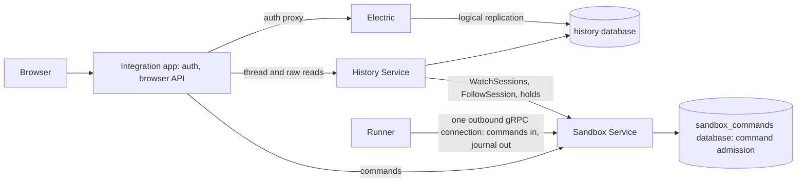

# History Service extraction, runner dial-out and delta settlement

Status: **proposed sequence, nothing implemented.** The operator agreed to the target wiring in
discussion on 2026-10-10 PDT. The [task DAG](task_dag.md#7-history-service-extraction-and-delta-settlement)
owns every step, its status and its edges; this plan owns the target, the facts the order rests
on, and the alternatives behind each decision node.

Three workstreams meet here: moving the raw event log and the thread fold into one History Service,
inverting runner connections, and settling streamed deltas. They touch the same ingestion path, so
they are sequenced together, but each can land in bounded steps without waiting for the others
except where an edge says so.

## Target



| Component       | Owns                                                                                                                                                                               | Does not own                       |
| --------------- | ---------------------------------------------------------------------------------------------------------------------------------------------------------------------------------- | ---------------------------------- |
| Runner          | harness driving, journal, journal-ordered command admission, spool                                                                                                                 | durable history beyond its volume  |
| Sandbox Service | provisioning, lifecycle, grants, egress, the runner channel and its authentication, durable command submission, locator ↔ Sandbox binding, live follow and replay, retention holds | stored history, folds              |
| History Service | raw event log, delta settlement, thread fold and projection, read API, scoped history reads                                                                                        | runner connections, commands       |
| App             | browser auth and API, app-only Thread metadata                                                                                                                                     | folds, raw history, runner routing |

Properties the target keeps:

- **One client surface:** the History Service subscribes with the same Sandbox Service calls a
  historyless client uses (`WatchSessions`, `FollowSession`), plus retention holds, which any client
  may place. The Sandbox Service stores no history and pushes to no one, so running without history
  means running no subscriber, and someone's own archiver is another subscriber. Driving a runner
  directly needs neither service.
- **History Service outage:** runners keep running and commands keep flowing. The runner journal
  is the buffer for every subscriber, so an outage is cursor lag; a hold keeps the Sandbox from
  being deleted until the History Service catches up through the seal.
- **Settlement and fold in one transaction:** the log, settlement and fold evidence live in one
  database, so dropping a settled item's chunks and their evidence rows is one commit and readers
  never see a cursor gap across a service boundary. That removes the app-side half of
  [#9713](https://github.com/agentydragon/ducktape/pull/9713).
- **Sessions can outlive a Sandbox later:** the History Service keys by Session and records each
  Sandbox as an incarnation, and a teardown seal ends an incarnation, not the Session, so reviving a
  Session in a new Sandbox ([task DAG section 8](task_dag.md#8-sessions-that-outlive-their-sandbox))
  needs no change here.
- **No reads of runners from the History Service:** it reads only through the Sandbox Service, so the locator ↔ Sandbox identity check stays where the authenticated runner channel
  terminates.

## Facts the order rests on

- **The `sandbox_service` database holds only Session history today** (`session_history` and
  `session_event`, `sandbox_service/session_history/db.py`; the package has its own migrations).
  Handing that database to the History Service moves the raw log with no copy. The Sandbox Service
  then needs a fresh database for command admission ([#9573](https://github.com/agentydragon/ducktape/pull/9573)),
  which would otherwise be the first non-history table in the one being handed over.
- **The fold's tables live in the `app` database** (`thread_entity`, `thread_evidence`,
  `thread_native_link`, `thread_payload_chunk`/`_manifest`, `thread_checkpoint`,
  `session_projection_lease`), and Electric replicates from it. Moving the fold means a new
  projection in the history database and a new Electric source.
- **Projections are derived.** A rebuild into a new epoch from the raw log is supported
  ([storage and durability](../docs/thread_view_sync.md#storage-and-durability)); only the raw log is
  irreplaceable. The staging-preservation rule ([`AGENTS.md`](../AGENTS.md#preserve-staging-data-during-the-sandbox-service-extraction))
  binds the raw log and identities, not a rebuildable projection.
- **Command admission reconciles spooled receipts in the same transaction as the archive checkpoint**
  ([command admission](command_admission.md#transport-independent-core-and-outbound-integration)).
  Once the archive leaves the Sandbox Service that cannot hold, so the follow contract restates it.
- **The biggest disk win is unrelated:** the retired `app.event` (7.5 GB of the app's 10 GB) is
  dropped by the raw-history retirement ([#9725](https://github.com/agentydragon/ducktape/pull/9725)). Settlement addresses the 4.3 GB `session_event` and the
  2.2 GB of per-delta evidence rows.

## Decided (operator, 2026-10-10 PDT)

- **Store placement:** the History Service takes over the existing `sandbox_service` database and
  role; the Sandbox Service gets a new `sandbox_commands` database for command admission. A `TODO` at the database
  declaration records that the name is then a misnomer. Rejected: a new database with a one-off
  copy of `session_event`, which is a second migration like the one just finished; its one
  advantage, returning disk by dropping the old copy, `pg_repack` also gives in place.
- **No rename:** `session_event` keeps its name.
- **Fold data:** the History Service projection is rebuilt from the raw log, not copied from the
  app. It is a long migration and runs as resumable, rate-bounded background work.
- **Live updates:** Electric replicates the history database behind the app's unchanged
  authorization proxy, at least for now. A History Service subscription API stays one of the
  [thread sync](thread_sync/README.md#a-second-implementation) candidates.
- **Existing runners:** not upgraded in place. Sandboxes on images that cannot dial out are archived
  and deleted, and inbound access is retired once none is left.

## Open decisions

### Follow and hold contract (`SESSION_FOLLOW_CONTRACT`)

Accepted 2026-10-10 PDT.

- Discovery: `WatchSessions` streams every Session the caller may see, then each creation and state
  change, from a resume token. Each change names the current incarnation (`sandbox_uid`), so the
  History Service records incarnations without a registration call, and creating a Session does not
  depend on it.
- Follow: `FollowSession` from the caller's cursor serves one stream for catch-up and live;
  entries older than the live tail are replayed from the runner journal over the runner channel. A
  `sealed` frame carries an incarnation's final cursor.
- Ingestion: the existing ingester and its per-log claim move into the History Service, still
  idempotent by cursor and rejecting a conflicting duplicate, as `Store.append` does today.
- Admission: the Sandbox Service reconciles spooled receipts from the stream it terminates and
  acknowledges a prefix to the runner after its own commit, waiting on no subscriber. Positive
  admission evidence still cannot regress. This amends the one clause in
  [command admission](command_admission.md) that puts reconciliation in the archive transaction.
- Completeness before deletion: at Sandbox teardown, after stopping every harness, the Sandbox
  Service sends a seal command; the runner journals a seal entry with each Session's final cursor and
  then refuses resume and writes. An ordinary stop never seals, since a stopped Session can resume.
  `DeleteSandbox` deletes once every hold on every Session has `confirmed_through >= seal_cursor`,
  and asks the operator when a runner is unreachable. Old-image runners cannot seal, so their
  wind-down compares the committed cursor with the journal head read over the old route.
- Reads: for now only the app's ServiceAccount reads, for every Session; agent reads come with
  `THREAD_READ_POLICY`, enforced here.
- Holders (decided): any permitted Sandbox Service caller may watch and place a hold for now,
  since only a few services call it.
- Expiry (decided): holds never expire. A stale hold keeps the Sandbox until the operator
  releases it, and `GetSandbox` shows which hold blocks deletion.

### Fold placement (decided 2026-10-10 PDT)

Moves: the projector (`app/threads/history_projector.py`, `projected_lifecycle.py`), the fold
(`app/threads/view/`), the projection tables above with their per-Session leases, and
`thread_history_summary`, every field of which is derived from the log. Stays in the app: Thread
`name` and `archived`, which the operator authors, and `event_log` reduced to the Thread → Session
link, its harness, model and cwd copies dropped. The read API keys by public Session ID and serves
list summaries, an entity window, payloads by reference and raw/debug reads.

## APIs

A sketch, starting from `agentplane/sandbox_service/protocol.proto`; names are not final.

```proto
service SandboxService {
  // Unchanged: sandboxes, templates, egress, CreateSession, OpenSession, ResumeSession,
  // LookupSession, ListSessions, SubmitCommand.
  // Changed: fence, stop, seal, wait for holds, then delete. Progress comes from GetSandbox.
  rpc DeleteSandbox(DeleteSandboxRequest) returns (google.protobuf.Empty);
  rpc WatchSessions(WatchSessionsRequest) returns (stream SessionChange);           // new
  rpc GetCommand(GetCommandRequest) returns (CommandStatus);                        // new
  // Replays from the runner journal below the live tail; sends `sealed` once runners seal.
  rpc FollowSession(FollowSessionRequest) returns (stream FollowSessionResponse);
  rpc PlaceHold(PlaceHoldRequest) returns (Hold);                                   // new, idempotent per holder
  rpc ConfirmHold(ConfirmHoldRequest) returns (Hold);                               // new: through_cursor
  rpc ReleaseHold(ReleaseHoldRequest) returns (google.protobuf.Empty);              // new
  // ReadSessionEvents and ReadSessionObservations move to the History Service.
}

message SessionChange {
  string session_id = 1;    // public UUID
  string sandbox_uid = 2;   // current incarnation
  SessionState state = 3;   // created, running, stopped, sealing, sealed
  bytes resume_token = 4;
}

message Hold {
  string session_id = 1;
  string holder = 2;
  uint64 confirmed_through = 3;
  optional uint64 seal_cursor = 4;  // satisfied once confirmed_through >= seal_cursor
}

service HistoryService {
  rpc ReadSessionEvents(ReadSessionEventsRequest) returns (ReadSessionEventsResponse); // + settlements
  rpc ReadSessionObservations(ReadSessionObservationsRequest) returns (ReadSessionObservationsResponse);
  rpc ListSessionSummaries(ListSessionSummariesRequest) returns (ListSessionSummariesResponse);
  rpc ReadThreadEntities(ReadThreadEntitiesRequest) returns (ReadThreadEntitiesResponse);
  rpc ReadPayload(ReadPayloadRequest) returns (Payload);
  // Committed cursor, incarnations with seal cursors, fold cursor or error.
  rpc GetSessionHistory(GetSessionHistoryRequest) returns (SessionHistoryStatus);
}
```

Live browser updates are not an RPC: Electric replicates the projection tables behind the app's
authorization proxy. The History Service ingester loops: `WatchSessions`; per Session under its
claim, `PlaceHold`, then `FollowSession` from its committed cursor; per batch, one transaction that
stores entries, settles, folds, deletes settled evidence and advances the checkpoint; then
`ConfirmHold`. On `sealed` it records the incarnation's end and keeps the hold until the Sandbox is
gone.

| Caller               | Sandbox Service                                    | History Service                    |
| -------------------- | -------------------------------------------------- | ---------------------------------- |
| App                  | sandboxes, Sessions, `SubmitCommand`, `GetCommand` | summaries, entities, payloads, raw |
| History Service      | `WatchSessions`, `FollowSession`, holds            |                                    |
| Historyless client   | Sessions, `SubmitCommand`, `FollowSession`         |                                    |
| Notification Service | `SubmitCommand`                                    |                                    |
