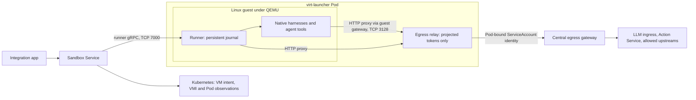

# KubeVirt execution environments

Status: proposed design; implementation and deployed acceptance remain open under
[`SANDBOX_VM_ISOLATION`](task_dag.md#sandbox_vm_isolation--selectable-vm-backed-sandbox-isolation).
KubeVirt is the recommended first VM provider. This document records source inspection and upstream
constraints, not a working VM integration or a live cluster audit.

## Proposed shape

Make execution environment kind an explicit, immutable creation-time choice: `agent_sandbox` or
`kubevirt`. Keep the product's Sandbox concept and Sandbox Service API ownership; distinguish it
from the Agent Sandbox Kubernetes `Sandbox` CR. A KubeVirt environment is a `VirtualMachine`, with
its runner and native harnesses inside the guest and the existing egress relay in the generated
`virt-launcher` Pod. KubeVirt still needs a Pod to host QEMU; agent code runs behind a guest kernel.

Presets prefill the kind and a compatible template; the user can edit both. Kind is independent of
Claude versus Codex. V1 supports fresh VM environments, retained-disk stop/start, and explicit image
replacement. Conversion of existing container environments, live migration, memory snapshots, warm
pools, and arbitrary user-provided VM specifications are later work.

Sandbox Service owns lifecycle, grants, destination resolution, and access to sessions. Runner SQLite
remains the only admitted-command/Event authority. The app remains a client and independent archive;
VM startup, recovery, and notifications must work with the app unavailable. There is no VM-specific
command queue or new credential issuer.

## Existing seams

| Current source                                                                                                               | Change needed                                                                                                                                                                                                                                             |
| ---------------------------------------------------------------------------------------------------------------------------- | --------------------------------------------------------------------------------------------------------------------------------------------------------------------------------------------------------------------------------------------------------- |
| [`inventory.py`](../sandbox_service/inventory.py), [`kubernetes_views.py`](../sandbox_service/kubernetes_views.py)           | Inventory currently copies an Agent Sandbox template and expects a same-named Pod. Add a KubeVirt provider and normalize observations without hiding raw VM/VMI conditions.                                                                               |
| [`protocol.proto`](../sandbox_service/protocol.proto), [`binding_storage.py`](../sandbox_service/binding_storage.py)         | Carry kind, typed backing-resource identity, template capabilities, and VM status. Store concrete launch defaults and pending provisioning intent on the owning VM.                                                                                       |
| [`destinations.py`](../sandbox_service/destinations.py)                                                                      | Replace the same-name/direct-Sandbox-owner assumption with provider-specific, UID-checked discovery.                                                                                                                                                      |
| [`sandbox_pod.py`](../../cluster/cdk8s/agentplane/sandbox_pod.py), [`sidecar.py`](../egress/sidecar.py)                      | Reuse relay image, token audiences, placeholder credentials and public trust configuration; replace loopback routing and Pod-template injection.                                                                                                          |
| [`workload_auth`](../workload_auth/README.md), [`egress/identity.py`](../egress/identity.py)                                 | Preserve ServiceAccount authorization and Pod-bound TokenReview, including same-principal checks on substituted tokens. Current authentication does **not** traverse Sandbox owners or verify source IP; the older egress ADR describes earlier behavior. |
| [`runner/image.nix`](../runner/image.nix), [`runner/README.md`](../runner/README.md)                                         | Share runner packaging with a Linux guest image; retain the journal, native histories, ownership fence, and protocol semantics.                                                                                                                           |
| [`app.py`](../../cluster/cdk8s/agentplane/app.py), [`sandbox_service.py`](../../cluster/cdk8s/agentplane/sandbox_service.py) | Extend deployment RBAC, network policy, image/template publishing and app projections for VM resources.                                                                                                                                                   |

### Environment identity and provider boundary

Use a small typed provider interface for list/get/create, stop/start/delete, and resolving the
current runner endpoint. Persist Kubernetes intent, not an in-memory provider registry of running
instances. The backing resource is the existing Sandbox CR for `agent_sandbox`, and the VM for
`kubevirt`; there is no placeholder Sandbox CR with a competing Pod controller and no new umbrella CR
in v1. The VM's UID is the stable environment UID across VMI replacements.

Extend destinations to include kind and namespace/name/UID; retain the owning ServiceAccount and
session ID. Treat `(kind, namespace, name, uid)` as the resource identity, since the two APIs can have
the same name. Update API callers, authorization, notification destinations, app archive references,
watchers, and UI together. Unknown kinds and unavailable capabilities fail explicitly. Template
selection returns typed descriptors instead of treating every template name as a `SandboxTemplate`.

Each environment keeps its own ServiceAccount and existing policy/grant bindings. Sandbox Service
validates the selected template, persists pending grants/defaults on a halted VM, reconciles its
ServiceAccount/PVCs/bindings, then allows startup. Provisioning must survive service restarts and
concurrent replicas using Kubernetes UIDs/resource versions and idempotent reconciliation. Clean up
partial creates through recorded ownership; an uncertain create response is reconciled, not blindly
retried. Reuse the current provisioning/finalizer machinery where its semantics apply.

## Proxy outside the guest

### Sidecar injection is real implementation work

The repo pins [KubeVirt v1.8.2](../../cluster/cdk8s/kubevirt/operators.py). A VM template is a VMI
specification, not a PodSpec with an arbitrary `containers` list. KubeVirt documents injected
[Istio sidecars](https://kubevirt.io/user-guide/network/istio_service_mesh/), which establishes the
general composition, but does not implement our relay injection or token mounts.

**Selected v1 approach:** KubeVirt owns VM lifecycle; the existing Kyverno installation injects
the relay container and its private projected-token mounts into launcher Pods. The runner and
harnesses run inside the guest. First prove this composition with a disposable VM on the pinned
stack, including secure owner/ServiceAccount resolution; revisit the mechanism only if that proof
finds a concrete limitation. A hook adapter, dedicated admission server and KubeVirt fork are outside
v1: this relay needs no domain or cloud-init hook, and the hook protocol alone cannot supply its mounts.

The repo already owns Kyverno
[proxy injection policies](../../cluster/cdk8s/kyverno/proxy_injection.py); these currently inject
environment and CA configuration, not our launcher sidecar or credentials. Extend that machinery with
a separately scoped policy. The other mechanisms below are alternatives if the proof requires a
design change, not additional components of the selected approach.

| Mechanism                                            | Fit and unresolved work                                                                                                                                                                                                                                                                                                                   |
| ---------------------------------------------------- | ----------------------------------------------------------------------------------------------------------------------------------------------------------------------------------------------------------------------------------------------------------------------------------------------------------------------------------------- |
| Existing Kyverno admission                           | Can mutate the launcher Pod to add the relay and projected volumes. Still uses an admission webhook, but the existing Kyverno service owns it. Prove live owner/SA verification using API context and narrowly scoped reader RBAC, reinvocation, admission ordering and failure behavior.                                                 |
| Kubernetes `MutatingAdmissionPolicy`                 | Runs CEL mutation in the API server, with no webhook service. Check the cluster's API/version/feature-gate support. It cannot simply perform arbitrary live VMI/VM reads like a webhook; require a separately enforced trusted mapping from controller-created VM intent to Pod identity.                                                 |
| KubeVirt hook sidecar plus declarative admission     | KubeVirt creates the hook container; our wrapper implements the handshake and runs the relay. Admission supplies identity and token mounts omitted by the hook schema. Viable if KubeVirt lifecycle integration is useful; never inject a second relay through the admission policy.                                                      |
| Native KubeVirt extension with no admission mutation | Would need supported launcher ServiceAccount selection and proxy-only projected volumes as well as container creation. Those are not supplied by the v1.8.2 hook API. An upstream enhancement or maintained KubeVirt patch is an explicit option, with API/upgrade maintenance cost; implementing only the hook protocol is insufficient. |
| Per-environment companion proxy Pod                  | Avoids changing the launcher Pod. Requires a private guest-to-proxy route with enforced environment identity and coupled revocation/lifecycle; the authenticated Pod is now the proxy Pod. Revisit those contracts before choosing it.                                                                                                    |

[Kubernetes admission policy](https://kubernetes.io/docs/reference/access-authn-authz/mutating-admission-policy/)
and [Kyverno API context](https://kyverno.io/docs/policy-types/cluster-policy/external-data-sources/#variables-from-kubernetes-api-server-calls)
describe the declarative mechanisms. Their availability and suitability here still need proof.
A dedicated webhook remains a fallback if the required live verification cannot be expressed safely
in the existing policy engine; accepting KubeVirt-specific integration is not itself a reason to
operate a new service.

The Kyverno policy supplies the relay, resource budget, readiness probe, projected token volume
and proxy-only mounts before Pod creation. Select the managed namespace and launcher labels; additionally
verify the controller owner UID against a live VMI and its managed VM, approved template, and recorded
ServiceAccount. Labels or caller-supplied annotations alone cannot select an identity. Reject
inconsistent preexisting relay/token configuration; reinvocation must be idempotent. Restrict who can
create Pods or mutate these VMs/VMIs and use admission validation for the final invariants.

The Pod mutation sets the launcher's `serviceAccountName`, disables token automount, and ensures no
automounted token or projected credential is available to `compute`, disk helpers, or guest volumes.
In v1.8.2 the [launcher renderer](https://github.com/kubevirt/kubevirt/blob/v1.8.2/pkg/virt-controller/services/template.go)
normally derives the account from a VMI `serviceAccount` volume and enables automount. That volume
[presents credentials to the guest](https://kubevirt.io/user-guide/storage/disks_and_volumes/#serviceaccount),
so it is unsuitable here. Mutating the generated Pod's identity without that volume needs a real
pinned-version proof, including admission ordering and resulting mounts.

Fail closed only within the selected admission scope, using Kyverno's replicated admission service.
Admission unavailability blocks
new matching VM launches; it does not terminate running VMs. Prove the configured failure scope does
not block unrelated Pods. Verify sidecar restart and termination behavior against KubeVirt's launcher
monitoring before choosing ordinary versus Kubernetes native sidecar lifecycle. Never patch a live
launcher to add containers.

The [legacy hook-sidecar API](https://kubevirt.io/user-guide/user_workloads/hook-sidecar/) serves
domain/cloud-init hooks and requires a protocol implementation; it is not a general PodSpec extension.
With `hooks.kubevirt.io/hookSidecars`, the launcher
[waits for the declared hook sockets and calls gRPC `Info`](https://github.com/kubevirt/kubevirt/blob/v1.8.2/pkg/hooks/manager.go).
Our plain HTTP relay would leave that discovery waiting until timeout. A wrapper would have to run
the relay plus a hook server (or upstream `sidecar-shim`), advertise a supported version and implement
any advertised callbacks, with coordinated startup/shutdown. No-op domain hooks would suffice for a
relay that does not alter the guest, but do not provide its token volume. The pinned
[`HookSidecar` schema](https://github.com/kubevirt/kubevirt/blob/v1.8.2/pkg/hooks/hooks.go) exposes
ConfigMap/PVC mounts, not arbitrary projected ServiceAccount-token volumes: the wrapper alone does
not complete this design. The protocol implementation is bounded integration work, not a reason to
reject the hook route. Direct Pod admission injection is another option: it supplies both container
and mounts without the handshake.

Current upstream docs deprecate it in v1.9. The new
[Plugins API](https://kubevirt.io/user-guide/cluster_admin/plugins/) starts in v1.9 alpha and still
uses a `MutatingAdmissionPolicy` or webhook for sidecar injection. It can package a KubeVirt
integration after an upgrade, but does not independently solve Pod mutation or token projection.

### Guest-to-relay routing

Use the Pod network with an explicit `masquerade` interface. KubeVirt
[NATs guest traffic through the Pod address](https://kubevirt.io/user-guide/network/interfaces_and_networks/#masquerade).
Guest `127.0.0.1` is distinct from Pod loopback. Configure the guest's proxy URL using the internal
gateway from its network configuration, with the relay listening on a guest-reachable Pod-side
address. First prove gateway reachability and bind timing on v1.8.2; a wildcard listener is acceptable
only with the ingress fence below. Do not hardcode the example guest CIDR as a cluster-wide address.

Explicitly forward only runner port `7000` to the guest. Ports `3128` (relay) and `3129` (relay
readiness) stay in the launcher network namespace; omitting the interface port list would forward
all ports and can break this arrangement. Test kubelet probes and guest-to-gateway packets through
the actual NAT rules; do not borrow Istio's special annotations as undocumented network fixes.

Apply Cilium policy to launcher Pods: inbound runner control only from Sandbox Service, no external
access to the unauthenticated relay, and outbound only to the existing DNS and central-egress routes.
Prove another environment cannot borrow this relay's identity. The guest and sidecar still share
the Pod's external network identity: direct guest TCP access to the central gateway can exist, but
an unauthenticated request must fail. Guest firewall/proxy environment variables are convenience,
not the enforcement boundary. V1 has no secondary network, host networking, or bypass route.

Reuse both cases of HTTP proxy variables, narrow `NO_PROXY`, public interception CA bundle, Java
trust store, placeholder kubeconfig, and LLM credential placeholders from the current composition.
Pass that environment through the runner to both harnesses and tool entry points. The proxy reopens
short-lived projected tokens on requests as today; real upstream credentials remain at the gateway.
Guest boot media carries only public configuration, never tokens or credential-bearing TLS keys.
Treat CA/config replacement as an explicit guest restart until dynamic reload is implemented.

## Runner image and guest resources

Build a dedicated NixOS qcow2 packaged as an OCI `containerDisk`, reusing
[`container_disk_vm`](../../cluster/cdk8s/kubevirt/virtual_machine.py) and the
[existing publisher workflow](../../.github/workflows/nix-containerdisk-publish.yml).
Extract the runner wheel derivation from `runner/image.nix` so the container and VM consume the same
package and explicit Claude/Codex pins. Include systemd, virtio support, QEMU guest agent, trust
configuration, and the intended sandbox toolset. The existing runner tests use different harness
pins from its published image; acceptance must exercise the actual built guest artifacts.

Bake software into the image; pass environment UID, public endpoints, resource profile, and config
through a small read-only config disk or cloud-init. Start the runner via systemd after persistent
disks are mounted and validated. Pass binary paths from the Nix closure, `--state-dir`,
`--listen 0.0.0.0:7000`, model endpoints and harness environment explicitly. Runner bootstrap/setup
remains its existing durable operation; do not run per-Thread setup again from cloud-init.

### What an OOM guarantee requires

Running the runner inside the guest means a guest panic or whole-guest OOM can still kill it. The VM
provides a host isolation boundary; runner availability needs an additional guest resource boundary:

- Put the runner and its journal service work in a protected systemd cgroup. Put each native harness
  and its descendants in separately bounded cgroups, with an aggregate agent-work budget below guest
  RAM after reserving kernel, system services, runner, page cache and filesystem headroom. Bound
  process counts, CPU, disk space/inodes and I/O as well as memory.
- Moving the native harness out of the runner's cgroup requires a runner launch integration or narrow
  guest supervisor that preserves stdio, signal forwarding, and the inherited state-owner lock.
  Killing a harness must not release ownership while its descendants still run. Capping just shell
  commands misses native helpers, hooks, MCP processes, and subagents.
- The initial guarantee is runner survival when the bounded **harness subtree** exceeds its budget;
  that harness can die. Keeping the harness alive when only a tool exceeds its budget needs an
  additional tool subgroup and the harness-specific coverage work in
  [tool memory isolation](../docs/harness_tool_memory_isolation.md).
- Run agent processes without unrestricted guest root or cgroup administration in this profile.
  A future guest-root profile can preserve the host/credential boundary, but cannot promise a
  guest-resident runner survives hostile changes to guest limits, storage, or services. The existing
  runner/harness trust domain also does not make the journal tamper-proof against agent code.
- Budget the QEMU/launcher limit for guest RAM **plus** hypervisor overhead, disk helpers and the
  separately limited relay. Include those requests in scheduling; do not set a Pod/container ceiling
  equal to guest RAM and call that isolation. Require KVM-capable workers outside the control plane,
  namespace quotas and capacity checks. Do not silently fall back to software emulation.

## Persistent state, discovery and lifecycle

Use an ephemeral, digest-pinned `containerDisk` root plus persistent virtual disks. Keep runner
SQLite, recovery journals, session metadata and native histories together on a state disk at `/state`;
put workspaces/tool caches on a separately bounded disk so filling a checkout does not fill the
journal filesystem. Preserve the runner's expected native state paths. If any durable workspace stays
under `/state`, make its quota and reserved journal capacity explicit.

A Pod filesystem PVC cannot simply be mounted as the guest's directory. Provision a valid virtual
disk using CDI's blank-volume path or an equivalent reviewed initializer, then initialize its guest
filesystem exactly once. Unknown/nonempty disks fail closed; never format a retained disk because
boot-time mounting failed. Keep PVC deletion separate from VM garbage collection and retain by
default. Do not expose state via a network filesystem or share it with another running guest.

Start with the existing node-local storage class only if the accepted availability contract remains
node-local: stop/start retains state; node loss is not automatic failover. POSIX locks inside separate
guest kernels do not fence duplicate VM writers, and `ReadWriteOnce` alone is insufficient. Require
single VM/VMI attachment and confirmed old-instance termination, including node fencing before any
force replacement on an unreachable node. Prove flush/barrier behavior and crash recovery of SQLite
through QEMU's selected disk cache mode. Filesystem locks remain useful within one guest.

| Operation           | Required behavior                                                                                                                                                                                                                                                                                                          |
| ------------------- | -------------------------------------------------------------------------------------------------------------------------------------------------------------------------------------------------------------------------------------------------------------------------------------------------------------------------- |
| Create/start        | Reconcile approved VM spec, grants and disks; start only once ready. Report provisioning, image pull, disk, scheduling and guest boot failures separately.                                                                                                                                                                 |
| Resolve runner      | Follow live `Pod → VMI → VM` controller references, checking every UID, environment owner and launcher ServiceAccount. Select the current nonterminating ready instance; ambiguity is unavailable. Connect to its Pod IP on forwarded `7000`, then check the actual runner RPC. Pod/VMI `Running` is not runner readiness. |
| Read/control        | Keep the existing network-only runner access boundary for v1 and its explicit TLS/auth TODO. Never grant guests access to other runners; never execute commands inside `virt-launcher` as if it were the guest. VM console/guest diagnostics need a separately authorized path.                                            |
| Suspend/resume      | Expose stop/start semantics: gracefully stop runner/native work, flush state and halt the VM; startup creates a new VMI and reopens retained state. This is not RAM pause. Report forced termination and uncertain native effects honestly.                                                                                |
| Restart/failure     | Service observations report guest/runner loss without inventing runner Events. Replay durable Events after recovery; unconfirmed native effects stay unknown and are not automatically resubmitted. Bound restart loops and surface the reason.                                                                            |
| Image/config update | Pin an immutable image at creation. Change it only via an explicit drain/stop/update/start operation with retained storage and schema compatibility checks; no automatic mid-turn restart on a moving tag. Do not enroll these VMs in generic image-restart automation.                                                    |
| Delete              | Stop and fence execution, revoke grants, retain disks and enable archive/export before destructive cleanup. An unreachable runner can prevent complete archival; surface that fact instead of claiming deletion preserved everything. Preserve person-authored workspace data.                                             |

For v1, reject live migration and RAM suspension in the capability model and prevent unauthorized
migration creation. Disable automatic migration eviction behavior for these VMs. Provider code must
not choose an arbitrary launcher when multiple candidates appear, and must verify the required relay
and token-mount configuration before marking a destination ready. Existing Sandbox Actions that use
Pod exec do not gain guest exec automatically: advertise it as unsupported for VM environments until
a separately authorized guest transport exists. Preserve the existing container
environments and the Sandbox Service extraction's staging-preservation requirements.

## Implementation slices and gates

These are proposed independently reviewable PR slices, not a priority change to the task DAG. Move
them into dispatchable DAG nodes when this deferred track is scheduled. Image packaging and provider
contract work can proceed in parallel with the platform proof; only integration depends on its result.

| Slice                    | Deliverable and exit evidence                                                                                                                                                                                                                                                                                                                                                                                                          |
| ------------------------ | -------------------------------------------------------------------------------------------------------------------------------------------------------------------------------------------------------------------------------------------------------------------------------------------------------------------------------------------------------------------------------------------------------------------------------------- |
| Platform proof           | Disposable VM on the pinned KubeVirt/Cilium stack. Prove injected relay lifecycle, selected SA with proxy-only rotating tokens, guest routing, control ingress, and cross-environment denial. Inspect final admitted Pod and guest devices; compare generated manifests. Record whether namespace PodSecurity, KVM scheduling and local storage admit this shape. If injection is incompatible, resolve that before production wiring. |
| Image and storage        | Published digest-pinned guest with runner/harness versions recorded; blank disk initialization, retained state and workspace bounds; runner starts without package downloads or real credentials. Verify the actual image with both harnesses.                                                                                                                                                                                         |
| Provider and API         | Typed kind/templates/destinations, KubeVirt inventory/reconciliation, owner-chain discovery, grants/finalizers, scoped RBAC and app watchers/UI. Existing container semantics still pass. Reconcile after service restart and under concurrent replicas, with the integration app unavailable.                                                                                                                                         |
| Guest resource isolation | Enforced aggregate harness budgets and runner launch/fencing integration. Force memory, process and disk exhaustion; prove runner/journal survival and truthful harness failure. Tool-only survival is a separately measured capability.                                                                                                                                                                                               |
| Lifecycle acceptance     | Both harnesses through real LLM ingress and Action Service; stop/start, Pod replacement, proxy restart/token rotation, guest crash, runner crash, image change, deletion/export, and negative access. Confirm stable environment identity, changed incarnation identity, retained Events, and no invented or duplicate command effects.                                                                                                |

The platform proof must test Kyverno admission failure/reinvocation, missing/expired tokens,
replacement Pods, forged environment labels, and attempts to reach another environment's
relay/control port. Verify
revocation using actual TokenReview semantics; deletion must not be described as instantaneous token
invalidation without measurement. Inspect rendered credentials/mounts without logging bearer values.

For crash acceptance, separately kill a tool, harness, runner, guest and launcher; distinguish
surviving control from durable recovery. Capture exact image/runner/harness versions, VM/VMI/Pod UIDs,
storage backend, resource limits, readiness timings and journal evidence. Measure cold/warm startup,
shutdown and scheduling overhead before choosing defaults. Unit and Docker/RBE tests cover provider
and runner logic; they cannot substitute for KVM/Cilium/storage acceptance on the deployed stack.

The design is ready to implement once the platform proof resolves sidecar admission, guest proxy
reachability and disk initialization. A per-environment companion proxy Pod is a fallback only if
launcher injection fails: it changes the token's Pod identity and introduces a guest-to-proxy
authentication/lifecycle problem, so it needs a revised design rather than an invisible substitution.
