# Agentplane task DAG

This is the authoritative map of remaining Agentplane work. Edges are technical dependencies;
operator priority is separate. Completed implementation belongs in the component contracts, not
this backlog. See the [Action Service specification](../action_service/SPEC.md),
[service integration details](../action_service/README.md),
[workload authentication](../docs/workload_authentication.md),
[operator federation](../docs/operator_federation.md),
[launch presets](../docs/launch_presets.md), and [action policies](../docs/action_policies.md).

## Operator priority

All Agentplane components and their acceptance contracts are multi-replica by default. Durable
state belongs to its authority: runner SQLite for admitted commands and Events, PostgreSQL for
the app archive and Action Service, and Kubernetes for Sandbox intent. Cross-replica change fanout uses
the authority's notification/watch mechanism (PostgreSQL `NOTIFY` for Action Service state), with
reconnect/replay from durable state rather than process-local memory. A single-replica deployment
is an explicit temporary operational constraint, never an implicit correctness assumption.

Proposed execution order for the Thread correctness/UI track:

- **P0:** close deployed Claude/Codex acceptance (`THREAD_DEPLOYED_ACCEPTANCE`), including
  the current model-path availability failure (`EGRESS_IDENTITY_AVAILABILITY`). Keep one
  runner-owned command queue; no app outbox or combined-start expansion in this batch.
- **P1, current batch:** end-to-end LLM error evidence (`LLM_ERROR_SURFACE`). Compact activity
  mocks (`THREAD_ACTIVITY_MOCKS`) and native resume/recovery remain on the board but are excluded
  from this dispatch batch.
- **Reported UI bug, unranked:** Sandbox-level default reasoning effort appears not to carry into
  the frontend’s later Thread launch (`SANDBOX_REASONING_DEFAULT`).
- **Workspace design, unranked:** reconcile once-per-Sandbox bootstrap and per-Thread working
  directories, especially for the finance-agent repo (`THREAD_WORKSPACE_BOOTSTRAP`).
- **P2:** browser-driven acceptance against the deployed cluster (`CLUSTER_BROWSER_ACCEPTANCE`)
  and driver-hosted tools (`DT`). Neither blocks the current API-level acceptance closure.
- **Low priority / deferred:** bounded browser cache state (`THREAD_LAZY_HISTORY`, desire D6),
  and optional app-wide/per-Thread raw-evidence retention controls (`THREAD_EVIDENCE_RETENTION`).
  The current view sync lazily loads long content and retains loaded rows/bodies until the Thread
  closes; it keeps the archive lossless.
- **Unranked future harness capabilities:** project skills and commands, web search, visual input,
  native subagents, interactive controls, project hooks/plugins, and prompt suggestions. The
  existing P2 item `DT` is included below as a cross-reference and keeps its current priority; it
  covers Action-backed tools and background-work control. The new candidates are an inventory, not
  an execution order or a priority claim against the rest of this DAG. Their win/work estimates are
  provisional; compare them with the full roadmap when scheduling. `HARNESS_CONFIG_ISOLATION` is
  the shared technical prerequisite.

The independent Action Service track still has console policy parity (`CONSOLE_POLICIES`) and Haku
MCP/tool-approval retirement (`MCP_CONSOLE_INTERNAL`, `MCPAGG`, `RETIRE_TOOLS`). Transcript
search/lookup (`T3`) remains deferred. Priority is not a dependency between these tracks.

## DAG

**A node is one atomic piece of work.** A migration that replaces three services running on
three clocks is three nodes, not one, even when a single sentence describes all of them: one
node cannot be half done, and a node nothing can finish hides which third is blocked. Where
the pieces only mean something together, they feed a **capstone** node that depends on all of
them and carries the "it is all migrated" claim -- the capstone is what other work waits on,
and the pieces are what gets dispatched.

```mermaid
flowchart TB
    classDef active fill:#dbeafe,stroke:#1d4ed8,color:#1e3a8a,stroke-width:3px
    classDef decision fill:#ffedd5,stroke:#c2410c,color:#7c2d12,stroke-width:2px,stroke-dasharray:5 3
    classDef future fill:#f3f4f6,stroke:#6b7280,color:#374151
    classDef milestone fill:#ede9fe,stroke:#6d28d9,color:#4c1d95,stroke-width:2px

    ELEVATE["Planned behavior<br/>agent-requested temporary permission<br/>ServiceAccount and Sandbox callers, operator-approved"]:::future
    MCP_CONSOLE_INTERNAL["Deferred migration<br/>Console's in-process grants server<br/>temporary-grant Action surface"]:::future
    MCPAGG["Capstone<br/>every Console MCP server has an ActionGroup<br/>the aggregator can be retired"]:::milestone
    RETIRE_MCP_CATALOG["Deferred migration<br/>retire Haku Console's connected-MCP catalog<br/>once the Action catalog answers for it"]:::future
    RETIRE_APPROVAL_QUEUE["Deferred migration<br/>retire Haku Console's tool-call approval queue<br/>once Decisions and the approval UI cover it"]:::future
    RETIRE_TOOLS["Capstone<br/>Haku Console owns no tool call<br/>catalog and approval queue both gone"]:::milestone
    INPUT_DELIVERY["Remaining native evidence<br/>input/interrupt/recovery gaps<br/>exact upstream requests and queue fates"]:::active
    T3["Deferred product work<br/>thread search and lookup<br/>later prioritization"]:::future
    PC_EGRESS_CREDENTIALS["Planned configuration<br/>public-coder's iron-proxy substitutions as EgressCredentials<br/>plus its dedicated ServiceAccount"]:::future
    PC_EGRESS["Capstone<br/>public-coder-agent egress migration<br/>proven equivalent, cut over, old proxy retired"]:::milestone
    ACCESS["Deferred design<br/>delegated vs brokered external access<br/>grants and revocation"]:::future
    EGRESS_CHANGE["Deferred design<br/>agent-requested egress<br/>policy expansion"]:::future

    ING["Deferred support<br/>Event & Notification Hub<br/>Action decisions and subscribed external events -> Thread ingress"]:::future
    DT["P2 deferred<br/>Action-backed driver tools and background control"]:::future
    HARNESS_CONFIG_ISOLATION["Unranked prerequisite<br/>separate hosted feature config from capture scenarios<br/>keep project and host settings isolated"]:::future
    HARNESS_SKILLS["Unranked candidate<br/>project-scoped skills and commands<br/>both native harnesses"]:::future
    HARNESS_WEB_SEARCH["Unranked candidate<br/>routed web search<br/>source evidence in Thread"]:::future
    HARNESS_VISUAL_INPUT["Unranked candidate<br/>image attachments and visual input<br/>composer, protocol, storage, replay"]:::future
    HARNESS_INTERACTIVE_CONTROLS["Unranked candidate<br/>questions and permission decisions<br/>durable park, answer, recovery"]:::future
    HARNESS_PROJECT_HOOKS["Unranked candidate<br/>trusted project hooks<br/>bounded execution and control replies"]:::future
    HARNESS_PLUGINS["Unranked candidate<br/>project plugins and skill packages<br/>source trust and capability grants"]:::future
    HARNESS_PROMPT_SUGGESTIONS["Optional, lowest estimated win<br/>Claude prompt suggestions<br/>measure UX before enabling"]:::future
    THREAD_OUTLIVES_SANDBOX["Deferred design<br/>a Thread lifecycle that outlives its Sandbox<br/>hosted rather than Sandbox-bound"]:::future
    HOSTED_THREAD_SURFACES["Deferred design<br/>read and control surfaces for a hosted Thread<br/>beyond today's Sandbox-bound view"]:::future
    CROSS_IDENTITY_READ_POLICY["Deferred decision<br/>explicit policy for reading across Identities<br/>what cross-Identity delivery waits on"]:::decision
    AG["Capstone<br/>hosted Agent and Thread model<br/>lifecycle, surfaces and read policy together"]:::milestone
    PROD["Milestone<br/>production-capable governed action execution"]:::milestone
    ACTION_PROVENANCE_PRUNE["Deferred idea<br/>prune ActionRequestInput origin/correlation<br/>collapse to one client-authored identifier?"]:::future
    CONNECTION_SA_REBIND["Planned mutation<br/>rebind a Connection's ServiceAccount in place<br/>no mutation exists; only a fresh OAuth consent does"]:::future
    SANDBOX_RBAC["Planned Kubernetes access<br/>Sandbox permissions and lifecycle<br/>identity choice open; see #8596"]:::future
    CALLER_GRANT_VIEW["Planned UI<br/>one grant view for Sandboxes and unmanaged agents<br/>an unmanaged agent's policy is invisible today"]:::future
    MANAGED_SA_RBAC["Planned Kubernetes access<br/>RoleBindings as a managed grant kind<br/>any managed ServiceAccount, Sandbox-backed or not"]:::future
    CLAUDE_AI_SA["Planned identity<br/>the claude.ai account's deliberate authority<br/>cluster diagnostics and agent-readable reads; reaches Forgejo as haku"]:::future
    CONSOLE_POLICIES["Deferred migration<br/>console auto-approval policies not yet sets<br/>some first need Haku's sandbox identity, a grants surface, or DENY_LISTS"]:::future

    UISHELL_NEWTHREAD_SANDBOX["Deferred combined UI<br/>pre-scoped '+ New thread' on a Sandbox's page<br/>Sandbox selected, Thread fields editable"]:::future
    UISHELL_NEWTHREAD_LANDING["Deferred combined UI<br/>sidebar '+' unscoped new-thread composer<br/>Sandbox/preset/model pickers + prompt"]:::future
    COMMAND_QUEUE_DECISION["Deferred decision<br/>accept commands while runner unavailable?<br/>current slice uses runner admission first"]:::decision
    CLAUDE_RECOVERY["Required evidence then implementation<br/>Claude execution before durable runner proof<br/>native correlation and safe recovery"]:::active
    CODEX_RECOVERY["Required evidence then implementation<br/>Codex execution before durable runner proof<br/>native correlation and safe recovery"]:::active
    SANDBOX_LIFECYCLE_DURABILITY["Planned lifecycle correctness<br/>retained state through suspension<br/>archive before managed storage deletion"]:::future
    SANDBOX_VM_ISOLATION["Deferred investigation<br/>selectable container or VM Sandbox implementation<br/>contain agent resource exhaustion"]:::future
    THREAD_EVENT_CONTINUITY["Planned identity cutover<br/>one Thread journal across incarnations<br/>exclusive runner writer and retained state"]:::future
    THREAD_COMMAND_DELIVERY["Deferred backend<br/>app outbox delivery to existing runner<br/>only if app-first acceptance is chosen later"]:::future
    THREAD_LAZY_HISTORY["Deferred desire D6<br/>bound browser cache after loading<br/>long content remains on demand"]:::future
    THREAD_EVIDENCE_RETENTION["Low-priority design<br/>optional app-wide / per-Thread raw retention<br/>lossless storage remains the default contract"]:::future
    THREAD_DEPLOYED_ACCEPTANCE["P0 remaining acceptance<br/>deployed commands/events cutover<br/>real Claude and Codex via devbox"]:::active
    EGRESS_IDENTITY_AVAILABILITY["P0 observed availability failure<br/>egress authentication ApiException / 502<br/>trace Kubernetes, ingress, LiteLLM hops"]:::active
    LLM_ERROR_SURFACE["P1 correctness<br/>native LLM errors through protocol and UI<br/>partial output, retries, terminal failure"]:::future
    THREAD_ACTIVITY_MOCKS["P1 UI design<br/>mock compact tool/reasoning activity<br/>one-line calls with individual expansion"]:::future
    THREAD_ACTIVITY_DENSITY["Planned UI after mock review<br/>compact activity with per-item disclosure<br/>preserve status, ordering, and Raw evidence"]:::future
    SANDBOX_REASONING_DEFAULT["Reported UI bug<br/>Sandbox default reasoning effort<br/>not reflected in later Thread launch"]:::future
    THREAD_WORKSPACE_BOOTSTRAP["Unranked workspace design<br/>one Sandbox bootstrap vs Thread cwd<br/>finance-agent repo as natural cwd"]:::future
    CLUSTER_BROWSER_ACCEPTANCE["P2 deployed browser acceptance<br/>in-cluster frontend button clicks<br/>screenshots and behavioral assertions"]:::future
    NATIVE_SUBAGENT_THREADS["Unranked candidate<br/>enable and adopt native subagents<br/>as linked Agentplane Threads"]:::future
    NEWTHREAD_DURABLE["Deferred combined workflow<br/>server-owned sandbox+thread provisioning<br/>survive browser close and app restart"]:::future
    THREAD_OUTBOX_CUTOVER["Deferred cutover<br/>all product commands via app outbox if chosen<br/>no competing relay path"]:::future
    THREAD_SUCCESSOR_DELIVERY["Deferred decision<br/>unsettled Thread command across<br/>successor runner session"]:::future
    NO_MANUAL_REFRESH["Planned principle<br/>no page in the app needs a Refresh button<br/>push (WS or SSE) everywhere, not just Sandboxes/Actions"]:::future

    ELEVATE --> CONSOLE_POLICIES
    ELEVATE -- grants half --> MCP_CONSOLE_INTERNAL
    MCP_CONSOLE_INTERNAL --> MCPAGG
    THREAD_OUTLIVES_SANDBOX --> AG
    HOSTED_THREAD_SURFACES --> AG
    CROSS_IDENTITY_READ_POLICY --> AG
    CROSS_IDENTITY_READ_POLICY -. cross-Identity delivery .-> ING
    EGRESS_IDENTITY_AVAILABILITY --> THREAD_DEPLOYED_ACCEPTANCE
    MCPAGG -. replacement surface .-> RETIRE_MCP_CATALOG
    CONSOLE_POLICIES -. policy parity .-> RETIRE_APPROVAL_QUEUE
    RETIRE_MCP_CATALOG --> RETIRE_TOOLS
    PC_EGRESS_CREDENTIALS --> PC_EGRESS
    RETIRE_APPROVAL_QUEUE --> RETIRE_TOOLS

    INPUT_DELIVERY -. reliable Thread ingress .-> ING
    HARNESS_CONFIG_ISOLATION -. prerequisite .-> HARNESS_SKILLS
    HARNESS_CONFIG_ISOLATION -. prerequisite .-> HARNESS_WEB_SEARCH
    HARNESS_CONFIG_ISOLATION -. prerequisite .-> HARNESS_VISUAL_INPUT
    HARNESS_CONFIG_ISOLATION -. prerequisite .-> NATIVE_SUBAGENT_THREADS
    HARNESS_CONFIG_ISOLATION -. prerequisite .-> HARNESS_INTERACTIVE_CONTROLS
    HARNESS_CONFIG_ISOLATION -. prerequisite .-> HARNESS_PROJECT_HOOKS
    HARNESS_CONFIG_ISOLATION -. prerequisite .-> HARNESS_PLUGINS
    HARNESS_CONFIG_ISOLATION -. prerequisite .-> HARNESS_PROMPT_SUGGESTIONS
    HARNESS_CONFIG_ISOLATION -. prerequisite .-> DT
    THREAD_ACTIVITY_MOCKS --> THREAD_ACTIVITY_DENSITY
    THREAD_EVENT_CONTINUITY --> THREAD_SUCCESSOR_DELIVERY
    CLAUDE_RECOVERY -. native continuation evidence .-> THREAD_SUCCESSOR_DELIVERY
    CODEX_RECOVERY -. native continuation evidence .-> THREAD_SUCCESSOR_DELIVERY
    COMMAND_QUEUE_DECISION -. if app-first acceptance chosen .-> THREAD_COMMAND_DELIVERY
    THREAD_COMMAND_DELIVERY --> THREAD_OUTBOX_CUTOVER
    THREAD_OUTBOX_CUTOVER --> NEWTHREAD_DURABLE
    NEWTHREAD_DURABLE --> UISHELL_NEWTHREAD_SANDBOX
    NEWTHREAD_DURABLE --> UISHELL_NEWTHREAD_LANDING
    T3 -. product work .-> PROD

    ACCESS -. authority choice .-> EGRESS_CHANGE
    ACCESS -. Kubernetes authority and credential choices .-> SANDBOX_RBAC
    SANDBOX_RBAC -. subject generalization .-> MANAGED_SA_RBAC
    MANAGED_SA_RBAC -. third grant kind to render .-> CALLER_GRANT_VIEW
    CLAUDE_AI_SA -. one account by hand, then the kind .-> MANAGED_SA_RBAC
```

Completed work is off this board: the credentialless MCP vertical, whose deployed Claude/Codex
proof is the [acceptance suite](../acceptance/README.md), credentialed provider acceptance, and the
first external client, operator approval, and Web Push proofs below. Input delivery and proxy
survivability proceed independently of the external-client track.

### Tested on staging

On 2026-09-12 the deployed MCP facade accepted a Claude.ai OAuth Connection from Claude Code, an
external harness rather than an Agentplane-hosted one, bound to a labeled ServiceAccount; policy
bindings auto-approved GitHub reads that executed through the operator-linked GitHub upstream; a
repeated idempotency key was refused and recovered by key; a pending Action was approved by the
operator through Authentik federation and executed; and a browser push arrived and was decided
from its buttons. Not tested: that operator REST and enrollment-management routes are unreachable
through the public MCP route; and, left to bug reports, the Deny control, grant retention across
refresh and restart, negative isolation and revocation for an external client, duplicate Decision or
Execution under retries or reconnect, push subscription revocation, unavailable-push and SSE
fallbacks, and Web Push reconciliation after reconnect.

Credentialed provider acceptance -- upstream token refresh and refresh failure, rotation without
rebuilding the executor, and the Kubernetes provider -- closed on 2026-09-28 on the operator's call
rather than a recorded run, so what breaks there arrives as a bug report. The implemented contract is
the [service README](../action_service/README.md); bringing the node back means restoring its edge
to `PROD`, not inventing one.

The external-client track is complete and single-operator: Identity (configured authority),
Connection (runtime named client enrollment), and Thread (execution/conversation state), with no
multi-operator management or per-operator ownership model. A Connection binds to a ServiceAccount,
the principal policies bind to; backend credentials are the ActionGroup executor's auth modes
([MCP executor transports](../action_service/README.md#mcp-executor-transports)), shared by every
caller of the group, and no linked token, static bearer, or kubeconfig reaches the MCP
client, Sandbox, transcript, or Action prompt. Generic tool discovery stays compact; a client that needs more opts into a schema or description per
Action. What remains of the Haku Console cutover is Action Service counterparts for its
in-process servers (`MCP_CONSOLE_INTERNAL`), policy parity (`CONSOLE_POLICIES`), and retiring the
aggregator (`MCPAGG`, `RETIRE_TOOLS`).
The deny lists of the landed [action policies](../docs/action_policies.md) are `DENY_LISTS`.
Processes that must outlive an SSH connection to the `ssh-mcp` server
(<../../x/ssh_mcp_server/README.md>) are `SSHDURABLE`.

The Thread correctness/UI track is independent of Action Service milestones.
Its authority and failure contracts are in
[Thread, runner, and harness layering](../docs/thread_layering.md).
The current slice uses the runner's command queue: make runner admission, app archival,
pending-command UI, and reconnect reliable. Accepting commands while no runner is
available is deferred under `COMMAND_QUEUE_DECISION`, along with the app outbox and
combined-start workflow. Normal replay and controls do not depend on that later choice.

The graph's edges gate integrated acceptance, not starting an independently reviewable
change. UI reducers and visual cases can proceed against established Events while
native recovery research runs. Automatic recovery is gated separately for each harness
and operation by its evidence; do not claim it from a working ordinary command path.

**Proposed next dispatch wave:** finish deployed relay verification and operator-login
acceptance, then use two independent lanes: conversation UI fixes and one narrowly scoped
native-evidence gap at a time. The coordinating agent owns deployed acceptance and landing/CI.
Native evidence does not block independent UI work.
Reuse existing agent worktrees. Each self-contained change gets its own PR against
`devel`; stack only on required implementation content and remove completed tasks as
their work lands.

The combined start composers require `NEWTHREAD_DURABLE` before promising “submit
and walk away.” A browser-owned provisioning chain is not a correct intermediate
version of that promise. Manual Sandbox creation and explicit open/resume remain
available while combined start is deferred.

### `EGRESS_CHANGE` — agent-requested egress policy expansion

**Deferred design:** define how an agent can request an expansion or change to its egress rules.
The request may become a policy-gated Action with operator approval, or use another reviewed
configuration path. Keep the authority, approval, persistence, and rollback model open until a
concrete caller and policy owner are chosen. This does not grant agents a direct policy mutation
path and does not block current credential-placeholder egress.

### `ACTION_PROVENANCE_PRUNE` — prune `ActionRequestInput.origin`/`correlation`

**Deferred idea:** `origin` and `correlation` on `ActionRequestInput` are two open-ended
`dict[str, JsonValue]` bags with no consumer: nothing in the Action Service parses or acts on
their contents; they are stored, returned in `ActionRequestView` (redacted for non-operators),
and otherwise inert. Consider collapsing both down to one client-authored identifier field, or
confirm no simplification is warranted.

It changes a Pydantic model, DB columns, tests and documented invariants (`action_service/SPEC.md`,
`action_service/README.md`), so it is its own change, not a rider on an unrelated addition of
caller-facing fields to the same model. No dependency on anything else; nothing waits on this.

### `CONNECTION_SA_REBIND` — rebind a Connection's ServiceAccount in place

**Planned mutation:** no mutation exists today, frontend or backend, to change which ServiceAccount
an existing Connection acts as. `connections.py`'s `ConnectionAuthority` and the exposed
`ConnectionService` (`list`/`callerServiceAccounts`/`rename`/`unbind` in `client.ts`) cover listing,
renaming, and unbinding, but the only way to change a Connection's bound ServiceAccount is a fresh
OAuth consent authorization (`consent.tsx`) that creates a new grant — a new revision, prior grants
revoked, not an in-place edit. The frontend's OAuth-clients settings table currently shows the
ServiceAccount as read-only text for exactly this reason.

**Design questions, not yet settled:** should rebinding revoke the prior grant's revision the same
way a fresh consent does, or coexist with it; does it need its own audit trail distinct from a
reconnect; and does it require re-running eligibility checks (the ServiceAccount must still carry
`agentplane.allegedly.works/use-action-service: "true"`) at rebind time, not just at original consent.
No dependency on anything else; nothing waits on this. Once it exists, the settings table's
ServiceAccount column becomes a real dropdown instead of static text.

### `SANDBOX_RBAC` — manage Sandbox Kubernetes access, optionally through presets

**Planned, not in the current Thread correctness batch:** support explicit Kubernetes
role selections and namespace/cluster scope for a Sandbox, for example “public-coder
Sandboxes receive these Kubernetes roles.” Add the same individually editable fields
to Sandbox creation and optional preset defaults. Presets only prefill values; neither
the apiserver nor credential handling interprets preset names as authority. This does
not require the broad `PROFILES` design.

Resolve the credential path for those principals with `ACCESS`. Current implementation
creates and owns a ServiceAccount per Sandbox at launch. That is current behavior, not a
settled identity choice. The open models are per-Sandbox ServiceAccounts with preset-selected
default RoleBindings (a proposed extension to presets), one shared Haku-specific ServiceAccount
for Haku-mode managed runners, or a launch-time choice between those identities. Resolve how
Sandbox-only temporary grants remain isolated and revocable alongside shared/default Haku
permissions; no model is selected. OAuth-connected Connections already have static caller
ServiceAccounts and remain a separate path. Managed-runner Coinbase key delivery is tracked in
[#8596](https://github.com/agentydragon/ducktape/issues/8596).

Preserve live Sandbox UID/Pod attribution in workload authentication. Distinct ServiceAccounts
in accepted namespaces are already supported by that authenticator. The credential path and
whether/how Kubernetes RBAC objects represent grants remain open under `ACCESS`; their
canonical design questions are in
[external-system permissions](external_access.md#kubernetes-sandbox-access-decisions).
This task integrates the chosen model into Sandbox creation, access inspection/change,
and lifecycle cleanup, including cross-namespace resources where applicable. Respect
existing GitOps ownership. Merely creating a RoleBinding does not provide a usable or
safely revocable API access path.
Current `ELEVATE` grants Action policy bindings, not Kubernetes roles; any Kubernetes
elevation workflow must authorize the grant itself.
`MANAGED_SA_RBAC` carries the same grant for an account with no Sandbox to own it.

**Acceptance:** launch with a public-coder-style preset and without a preset using the
same explicit fields; prove equivalent effective access, including overrides and an empty
selection. Real API requests succeed only for intended operations/scopes; unauthorized
role selection, another Sandbox's identity, and privilege-escalating grants are refused.
Cover independent grants for two Sandboxes, inspection of effective access, revocation
and reconciliation failure, suspend/resume, deletion/name reuse, and orphan-grant
cleanup. Preset edits must not silently widen existing Sandboxes' grants. Verify the
chosen credential boundary without exposing privileged credentials in evidence.

### `CLAUDE_AI_SA` — the claude.ai account's deliberate permissions and egress

**Planned identity:** `agentplane-staging/claude-ai` is the principal a Connection from the
Claude.ai MCP connector acts as, and now also the account every sandbox this caller creates runs
as ([sandbox Actions](../action_service/sandbox/README.md)). Its authority accreted from what each smoke
test needed rather than from a decision about what this caller should hold, and the sandbox surface
changed what that authority reaches: the account is no longer only an Action caller, it is the
identity of a shell somebody can run arbitrary commands in.

What exists today (<../../cluster/cdk8s/agentplane/actions_staging_policies.py>, which lists each
policy and set with why it is there): the labelled ServiceAccount with
`automountServiceAccountToken: false`, an `EgressBinding` to the basic policy -- which carries the
API server rule every sandbox is granted (egress.py) -- plus read-only and credentialed ones, and
an `ActionPolicyBinding` auto-approving reviewed reads plus the whole `sandbox-self` set. Its
Kubernetes authority is the cluster-wide `cluster-diagnostics-reader`
ClusterRoleBinding (`cluster/generated/agents/shared-rbac/`), reads of
non-sensitive cluster state, plus the metadata and pod-log readers Kyverno generates in namespaces
labelled `agent-readable-*`, plus `get` on one Secret: the view-only Coinbase key its sandboxes
sign with, since the proxy cannot. The verified Kubernetes evidence from a sandbox is still a
`SelfSubjectReview`, not a read of any object.

Haku's credentials are the deliberate part, and `forgejo-haku` the widest. claude-ai is the
Connection Haku runs through (<../../haku/TODO.md> § Wiring / hardening), so at the operator's
request a sandbox of this caller's reaches the in-cluster Forgejo as the `haku` service account
(`forgejo-haku`, the proxy substituting that account's own password into Basic auth) and Haku's own
mailbox (`haku-mailbox`). `forgejo-haku` is the account rather than a scoped token, so it carries
every repository haku owns and the web UI besides, and any other agent run through the same
Connection holds all of it too. Those grants are decided; what they sharpen is the question below, because
the account holds authority whose blast radius is Haku's.

**Kubernetes authority is RoleBindings on this ServiceAccount.** Decided; which roles beyond the
diagnostics reader, at what scope, is the open part and needs a conversation before anything is
written. The two alternatives
are rejected: binding haku's `haku-k8s` Authentik JWT on `kubeapi.allegedly.works` would make a
sandbox `oidc-ksbx-groups:haku`, and the `claude-web-k8s` one `kubectl-sandbox-users`, but both
hairpin out through the Gateway for an apiserver one hop away and, worse, layer a second identity
on a box that already authenticates as itself. The projected token is Pod-bound to the box that
sent the request -- `SelfSubjectReview` from inside one names its own Pod and UID -- and that
binding is the property the whole substitution design rests on. Roles on the account keep it; a
bearer for a group does not.

Still to decide: the roles themselves; whether the Kubernetes egress rule should stay an
all-verbs, all-paths admission once RBAC is what bounds it; and whether the GitHub reads a
Connection may auto-approve should also be what a sandbox of this account reaches, since the
`EgressBinding` and the `ActionPolicyBinding` are separate grants that nothing keeps consistent.

**Acceptance:** a stated, reviewed authority for the account, rendered by the generator rather than
accumulated; a real API request from inside a sandbox succeeds for the intended operations and is
refused outside them; and removing the account or its label still disables the whole path.

### `CALLER_GRANT_VIEW` — one grant view for Sandboxes and unmanaged agents

**Planned UI:** a caller with no Sandbox is an **unmanaged agent** -- an OAuth-bound externally
hosted one such as claude.ai, holding an account and its grants while the app runs no Pod for it.
An Action policy bound to such a caller cannot be seen in the web UI at all. The only surface that
renders one is the Sandbox page's "Action policy" tab, which `live.py` fills from
`policy.for_subject(sandbox.service_account)` and skips entirely when there is no Sandbox. Egress is
the same shape: `GET /sandboxes/{name}/egress` is the only read. So the operator can create such a
caller through consent, rename and unbind its Connection, and never learn what it may reach or do.

**Most of the machinery is already account-keyed.** `Egress.bindings_for(subject: ServiceAccountRef)`
returns every binding naming an account, and `ActionPolicy.for_subject(subject)` asks the Action
Service's `/v1/operator/action-policy/service-accounts/{namespace}/{name}` for the same. The Sandbox
is a lookup detour rather than a data dependency: `sandbox_egress` dereferences one only to reach
`.service_account`. The roster exists too -- `caller_service_accounts()` lists every account carrying
`CALLER_LABEL`, sandbox-backed or not, already plumbed to `callerServiceAccounts()` in the frontend,
where both consumers use it as a picker (the OAuth-clients table, the consent dropdown) rather than
as a subject to inspect.

What is missing is therefore routes and a page, not a read model: an app route for an arbitrary
account's action policy (`for_subject` has no HTTP exposure, only `live.py`'s snapshot path), an
egress read keyed by account rather than Sandbox name, and a surface that joins the roster to both.

**Settled intent:** Sandboxes and unmanaged agents share one Action policy view rather than each
getting their own, and share the Kubernetes permissions view too once `MANAGED_SA_RBAC` provides one.
The subject is the account in every case, so what differs between the two is what else the page can
say about the subject -- a Sandbox has a Pod, a state and a template; an unmanaged agent has a
Connection -- not how its grants are read or rendered.

**Questions, not yet settled:** whether the shared view is a per-account page or one roster table
with grant columns; and whether the roster is the `CALLER_LABEL` set or every account the app
manages, which differ exactly for an account whose label was removed to cut it off while its
bindings still exist.

### `MANAGED_SA_RBAC` — Kubernetes RoleBindings as a managed grant kind

**Planned Kubernetes access:** grant and inspect Kubernetes RoleBindings on the ServiceAccounts the
app manages the way it already does egress policies and Action policy sets -- so an agent can be
allowed to talk to the apiserver by a grant on its account, rather than through a governed Action or
a hand-written manifest.

`SANDBOX_RBAC` is the Sandbox-scoped form of this, reached through launch fields and presets. The
generalization is the subject: a caller with no Sandbox, such as an OAuth-bound externally hosted
agent, has an account and can hold bindings, but no Sandbox to hang them off. That difference is the
design question rather than a detail -- a Sandbox's grants are garbage-collected by an
`ownerReference` on the Sandbox, and an account that outlives every Sandbox has no such owner, so
what creates, owns and reclaims its RoleBindings is unsettled.

**Further questions, not yet settled:** whether a grant names a Role the operator selects or a named
bundle the way an `ActionPolicySet` does; whether expiry works as it does for the other two kinds,
given that Kubernetes RBAC has no expiry of its own and something must sweep; and whether this
shares `ACCESS`'s credential boundary or only its authority decisions. Respect existing GitOps
ownership: an account's bindings must not fight a reconciler for the same objects.

### `CONSOLE_POLICIES` — console auto-approval policies without a set

**Deferred migration:** the Haku console's `auto_approval_policies`
(`cluster/cdk8s/haku/console_config.py`) is the reviewed authority the Action policy model
replaces. What remains, each with what it needs; an entry leaves when its set is written or
another route replaces it.

- **`exact_tools` over `grants`** (`kubernetes_reads`, `grants_whoami`, `grants_own_revoke`):
  `grants` has no Action Service counterpart, so no set can name these until one exists, the
  `grants` half of `MCP_CONSOLE_INTERNAL`.
- **`grant_self_list` and grants self-introspection** (`grants_own_list`,
  `grants_self_introspection`): `list_grants(principal=self)` is argument-only, an
  `argument_schema` set over a `grants` ActionGroup; but the grant model itself is console-owned,
  so this waits on the Action Service having its own grant surface, not on a kind.

  **Keep policy introspection separate from grant introspection.**
  `get_action_policy(target=SELF)` reports the policy applied to the caller using the same
  `resolve_bindings` source admission uses, so reported and enforced decisions cannot drift.
  The console's `grants` tools inspect something else: expiring access. `grants_whoami`, `grant_self_list`, `kubernetes_can_i`, `get_grant`
  and `revoke_grants` are all that surface, and what they wait on is **temporary grants**, which is
  `ELEVATE` -- a caller asking for a set plus an `expiresAt`, approval writing the
  `ActionPolicyBinding` with that expiry. `BindingSpec.expires_at` already exists, so what is
  missing is the request-and-approve flow, not the storage.

- **Schema auto-denial** (was: `autoDenyIf` equivalent): the console records a call whose arguments
  fail the registered tool schema as born-denied. The Action Service refuses such a request at
  admission before persisting anything, so the audit row the console keeps does not exist here.
  This is **not** a denial rule and does not wait on `DENY_LISTS`: the request never reached a
  policy, so what is missing is a durable record of an admission rejection, not a policy kind that
  denies it. Give it its own node when `CONSOLE_POLICIES` needs it.

**The composition layer, which the list above omits.** What is actually bound to an agent is the
`any_of` bundles `public_coder_v1` and `haku_v1`, and `manual_review`, which is `type: never`.

These need no kind. `ActionPolicyBinding.policySets` is a list and evaluation unions across every
set of every binding a subject has, so an `any_of` bundle is one binding naming several sets, and
`manual_review` is the absence of a binding. What the bundles do is turn the leaf list into
per-agent progress:

- **`public_coder_v1`** = `kubernetes_reads` + `grants_self_introspection` +
  `grants_own_revoke`, the `grants` trio, which the list above puts behind the Action Service
  having its own grant surface. That trio is the whole remaining distance for this agent, and it
  is the same blocker `PC_EGRESS` meets from the other side.
- **`haku_v1`** = `haku_sandbox_control` plus the `grants` trio, so it waits on both halves of
  `MCP_CONSOLE_INTERNAL` and is the long pole.

Nothing waits on this except `RETIRE_APPROVAL_QUEUE`, which needs policy parity for the
affordances it retires.

## Named gates and acceptance evidence

### `THREAD_DEPLOYED_ACCEPTANCE` — close the deployed command/Event cutover

**P0:** finish operator-login/MCP-linkage setup and run the explicit egress,
instructions, launch-preset, and MCP acceptance targets from the cluster devbox
against the final deployed app/runner images. Existing runs cover egress, instructions,
basic MCP execution on both harnesses, and preset behavior; they do not close the
operator-authenticated cases or validate the command-relay candidate on its deployed image.
Use the [acceptance suite](../acceptance/README.md) as the runbook, retain sanitized
test/runtime evidence, and verify fixture cleanup. Do not resend the operator's failed
staging input as a test. This is API-level deployed proof, not browser click-through proof.
Testing's operator federation runs the explicit Dex claim profile; rerun the operator cases
against it (the [sanitized investigation](../debug/agentplane_testing_operator_dex_20260915.md)
records the last run). Signed offline tests alone do not close this gate.

### `EGRESS_IDENTITY_AVAILABILITY` — locate the observed model-path 502

**P0:** the live run [92f9cd4c](https://app.buildbuddy.io/invocation/92f9cd4c-2f08-4914-b14d-cc343381b0b0)
passed five egress cases, both instruction cases, and the preset case. Claude's late-binding
case failed before executing its GitHub probe: retained Events show command admission,
input confirmation, and `TURN_STATUS_FAILED` with an HTTP 502 diagnostic. In the same
08:01–08:03 UTC window on 2026-09-15, central egress logged three `ApiException` failures
and `unavailable` refusals before identifying a Sandbox. Its per-Sandbox decision query
therefore returned no rows. The model vendor is not established as the source of the 502.

The shared workload resolver now logs the fixed Kubernetes operation and numeric API status
without exception bodies, reasons, headers or tracebacks. The historical type-only logs cannot
identify which operation failed. After this diagnostic reaches the proxy, retain new safe
failure evidence and correlate it with Kubernetes health; this is not an incident repair.

Correlate the path from runner/sidecar through central egress authentication, Kubernetes
TokenReview, Agentplane LLM ingress, LiteLLM, and the model backend. Identify
the first failing hop and distinguish policy denial, identity-service unavailability,
transport failure, and backend rejection using safe status/correlation evidence. Do not
log bearer headers or relax the fail-closed identity boundary. Fix the established cause
in a focused PR, rerun the failed case, and retain both failed and successful evidence.

### `LLM_ERROR_SURFACE` — truthful model-turn failures through every layer

**P1, independent of the particular 502 cause:** audit and pin native error behavior for
Claude and Codex with the scripted LLM endpoints. Cover an HTTP error before content,
failure after partial streaming, a native retry that succeeds, exhausted retries, and
a later successful turn. Assert exact request/response evidence; process loss is a
separate outcome, and a native internal retry is not an app-issued replacement command.

Verify runner normalization and app archival/replay preserve the terminal status and
available safe diagnostic/native evidence without turning an admitted or confirmed input
back into an unsaved command. Do not attribute an opaque harness error to LiteLLM, egress,
or a model vendor without evidence, or invent retryability guarantees. Use the existing
[layering contract](../docs/thread_layering.md), extending it only where the evidence
requires a new guarantee; do not create a parallel error protocol.

Finish native-backed verification of these failures through the app archive and normal/Raw
views, including reload and a later successful input; controlled-source browser coverage is
not native harness evidence. Any future retry control must explicitly distinguish same-command
delivery retry from requesting a new model turn; do not silently resend the original input.

### `THREAD_ACTIVITY_MOCKS` — design compact tool and reasoning activity

**P1, mocks before implementation:** long tool/reasoning runs require too much scrolling.
The current run disclosure expands into full tool cards; grouping alone does not give
each tool its own compact disclosure. Mock default one-line tool summaries with individual
click-to-expand details, and compact reasoning steps, before choosing the final layout.
Compare a compact per-item list with a grouped run that expands into those same compact
rows; keep assistant answers and user messages readable in their actual order.

Collapsed reasoning should preview the available summary text on one line, showing
as much as fits with ellipsis for overflow; expanding reveals the full text. Cover
short, long, absent, and streaming summaries at narrow and wide viewport sizes.

Include many mixed steps, long tool names/arguments/output, running and failed calls,
an expanded call while others stream, narrow screens, and normal/Raw views. Summaries
must not imply success or invent unavailable reasoning. Review the mocks with the operator
before changing production presentation; this task does not settle the layout.

### `THREAD_ACTIVITY_DENSITY` — implement the reviewed compact activity design

Implement the selected mocks with individually expandable tools, keyboard-accessible
disclosures, visible running/failure state, and stable expansion/scroll behavior while
Events arrive. Preserve timeline order and Raw evidence. Add behavioral and visual
coverage of the reviewed cases, including reload and reconnect.

Reasoning and tool arguments and output already load on demand (`LazyBody` in
`projected_session.tsx`); compact rows keep that loading and explicitly distinguish unloaded,
streaming, empty, and unavailable details.

### `SANDBOX_REASONING_DEFAULT` — honor Sandbox reasoning effort on later Thread launch

**Operator report, not yet reproduced:** setting a default reasoning effort at the Sandbox level
appears not to take effect in the frontend when launching subsequent Threads from that Sandbox.
Check the effective `binding.thread_defaults` returned for the Sandbox, the Thread launch form's
initial selection after model options load, and the submitted session-open request. Distinguish a
frontend prefill/reset bug from incorrect preset resolution or a backend launch bug; do not assume
which layer is at fault. In particular, inspect the model-catalog and Sandbox-default effects in
`app/frontend/sandbox_page.tsx` for ordering or validation interactions.

**Acceptance:** with a Sandbox default reasoning effort different from the model's first offered
effort, open its page and launch a later Thread without changing the effort. The form must show
the effective Sandbox default, and the created Thread must use it. Explicit per-Thread changes
must override that default without changing future launches. Cover initial load, reload, and a
model/harness change (where a now-invalid effort must be handled intentionally) in frontend tests.

### `THREAD_WORKSPACE_BOOTSTRAP` — make Thread cwd and bootstrap ownership coherent

**Operator question / current code, not a deployed verification:** Threads have an explicit
`SessionSpec.cwd`. The current `finance-agent` Thread preset specifies
`/state/workspaces/{session_id}`; the Sandbox page's later-Thread launch also sends
`/state/workspaces/${sessionId}` explicitly, which overrides any bound preset cwd in the app's
session-open merge. The runner creates that directory and launches the harness there. Threads in
one Sandbox therefore default to separate working directories, not to the shared
`/state/workspaces/finance-agent` repo. The finance-agent Sandbox bootstrap clones that repo once
at `/state/workspaces/finance-agent`, and runner initialization executes once per Sandbox from its
state directory, not from each Thread's cwd. The instructions currently describe the cloned repo
as the agent's workspace, but that does not make it the launched Codex process's cwd.

**Design decision:** decide whether an agent such as finance-agent should start in one shared
Sandbox repo, a per-Thread clone/worktree of it, or a configurable mix. Define ownership and
lifetime of initialization for both Sandbox-shared state and Thread-local cwd; account for
concurrent Threads modifying the same checkout, credential handling in cloned Git remotes,
existing Sandboxes whose bootstrap hash cannot change, and safe migration of preset defaults.
Keep cwd and bootstrap visible/overridable at the appropriate scope rather than silently ignoring
configured cwd. Avoid treating a once-per-Sandbox script as a per-Thread setup mechanism.

**Acceptance:** a newly launched finance-agent Codex Thread reports a cwd that is the intended
Git checkout (and can work there without a manual `cd`); a second Thread has the explicitly
chosen sharing/isolation behavior. Test both the create-and-launch and later-Thread paths with
preset and explicit cwd overrides, plus reload and bootstrap replay/failure. Record the chosen
workspace contract in [launch presets](../docs/launch_presets.md) before changing runtime behavior.

### `CLUSTER_BROWSER_ACCEPTANCE` — browser-driven acceptance in the cluster

**P2:** run a real browser from a controlled cluster devbox or dedicated test workload
against the deployed frontend, app, runner, and real Claude/Codex harnesses. Exercise
operator login, manual Sandbox/Thread creation, composer submission, pending-to-effective
controls, normal/Raw views, and reload/reconnect through visible buttons and fields.
Assert behavior and durable command/Event evidence; screenshots alone are not a pass.
Capture screenshots and sanitized traces at meaningful transitions and on failure.

Reuse the existing browser fixtures and acceptance setup where appropriate. The
deterministic real-Chromium transport suite in [the app README](../app/README.md#replica-safe-runner-delivery)
already covers gated failure/reconnect cases, but its scripted runner is not deployed
native-harness evidence. Keep both layers. Resolve the Bazel/browser runner, cluster
identity/network access, and safe artifact-capture boundary explicitly; never capture
credentials, login form contents, OAuth state, or unrelated user Threads. Clean up only
resources the run owns. Cover tail-first history, and combined start once it lands, without
making this P2 suite a prerequisite of either.

### Unranked future harness capabilities

These candidates describe native features currently disabled, narrowed, or not surfaced by
Agentplane's hosted adapters. The `DT` row is the existing P2 item; other rows are unranked. Their
value and effort estimates are rough planning inputs, not a ranking. The harness protocol roster
records the current switches and uncovered wire surfaces
([protocol roster](../native/docs/protocol_roster.md)). Keep the test capture profile deterministic;
feature enablement belongs in an isolated hosted profile, not by widening every capture. Rows are
ordered by identifier only. For Claude-specific behavior, start from the partial Claude Code
reverse engineering in the sibling `gaffer-private` repository and extend it where a candidate
needs evidence that work does not already provide.

- **`DT` (existing P2) — high win, medium–high work:** Surface Action-backed tools through
  Claude driver MCP and Codex dynamic tools, plus the existing list/status and per-task stop floor
  for background work. Reuse Action Service decisions, execution, idempotency, and provenance; it
  remains deferred pending a named consumer. See [driver tools and background work](driver_tools_and_background.md).
- **`HARNESS_INTERACTIVE_CONTROLS` — high win, high work:** Support questions and permission
  requests that park a turn, survive reconnect/restart, accept or reject a durable decision, and
  resume safely. Keep user decisions distinct from Action Service authorization.
- **`HARNESS_PLUGINS` — medium win, high work:** Enable project plugin/skill packages with
  explicit source trust and capability grants. Define install/update behavior and test that plugin
  tools cannot exceed the Thread's authority.
- **`HARNESS_PROJECT_HOOKS` — medium win, high work:** Run project hooks only behind an explicit
  trust boundary; support bounded execution, hook replies, timeout/cancellation, and evidence in
  the Thread. Do not inherit arbitrary host hooks.
- **`HARNESS_PROMPT_SUGGESTIONS` — low win, low work:** Consider Claude's prompt suggestions only
  if user research shows meaningful composer value; keep optional and avoid extra model work
  without evidence.
- **`HARNESS_SKILLS` — high win, low–medium work:** Enable project-scoped skills and custom
  commands for Claude and Codex. Prove the project catalog is available in a Thread while
  host-global settings and unrelated user configuration stay out.
- **`HARNESS_VISUAL_INPUT` — high win, high work:** Carry supported image input/viewing through the
  harness protocol and retained Thread history; prove Claude's image input path and Codex viewing
  an image already in its workspace. Text-only transcripts are insufficient acceptance. For Codex,
  keep workspace `view_image` distinct from user composer attachments: the completed app-server
  item is `{type: "imageView", id, path}`, with no `status` or image bytes. A completed
  `commandExecution` instead carries `status` plus fields such as `aggregatedOutput`, `exitCode`,
  and `durationMs`; the current generic adapter would misclassify `imageView` as unsuccessful unless
  it models this item explicitly. Test with a fixture image in the Codex workspace and a scripted
  `view_image` call; assert the following model request contains that image as `input_image`, and
  that Agentplane retains/projects the `imageView` lifecycle and path. This proves image transport,
  not visual understanding; use a live model check for semantic recognition. The JSON item alone
  cannot render a preview in the UI: that needs the runner to retain or transfer the viewed bytes
  through an authorized media reference for replay and rendering.
- **`HARNESS_WEB_SEARCH` — high win, medium work:** Route native search through an approved,
  observable egress path; retain source evidence and links in the Thread. Confirm provider/tool
  availability before wiring either harness.
- **`NATIVE_SUBAGENT_THREADS` — high win, high work:** Enable Claude Task and Codex multi-agent
  features; discover child identity, output, completion, and restart/resume, then expose linked
  child Threads with parent/child provenance and reconnect deduplication. Start with read-only
  inspection; child control is a separate evidence-gated extension.

#### `HARNESS_CONFIG_ISOLATION` — separate hosted features from capture configuration

**Unranked prerequisite:** production adapters currently reuse narrow scenario launch/config
helpers. Separate deterministic capture settings from an explicit hosted feature profile before
turning on native capabilities. Prove that each Thread receives only its selected Agentplane
configuration, project-scoped settings stay inside the workspace boundary, and machine/user-global
configuration cannot silently expand tools or permissions. Keep feature choices independently
switchable so each candidate can be enabled and accepted on its own. This is a harness-configuration
boundary, separate from the deferred product capability profile in [Profiles](profiles.md).

#### `NATIVE_SUBAGENT_THREADS` — adopt harness-native subagents as Threads

**Unranked candidate:** when Claude or Codex starts a native subagent, discover its native identity
and available transcript/events and expose it as a linked child Thread in Agentplane. Verify
creation, output, completion, and restart/resume from separate harness evidence; do not infer child
messages from the parent's tool summary. Preserve native frames and parent/child provenance, and
deduplicate rediscovery across reconnects and restarts.

Decide the mapping to Sandbox, Thread, and harness incarnation before implementation. Adoption is
not spawning another Agentplane-managed harness or claiming the parent's command receipts for a
child. Read-only inspection may be the first useful slice; independent input, interrupt, model
control, and resume are separate evidence-gated capabilities. This has no dependency on the current
delivery/UI batch.

### `ELEVATE` — agent-requested temporary permission

**Planned behavior:** a caller that knows it will need an Action outside its current policy asks
for it through an Action of its own: the request names the set to add (or the binding to remove),
the subject (its own ServiceAccount or Sandbox; never another caller), and an `expiresAt`. The
operator sees it rendered as that specific request, with the set's lists shown, not as a generic
approval card. Approval writes the `ActionPolicyBinding` with the requested expiry through the same
authority the app uses; denial writes nothing. Both caller classes get this: a ServiceAccount-bound
OAuth client and a harness in a Sandbox.

**Design gate / acceptance:** the requesting Action is an ordinary Action with an ordinary Decision,
so the request itself can be auto-approved by policy later, never by default. A granted binding is
evaluated like any other, once per subsequent Action at admission. Prove: a Sandbox requests a set,
the operator approves, the next matching Action auto-approves and the Decision names the new
binding; the same request from a different subject grants nothing to the requester; expiry ends it.

### `T3` — thread search and lookup

**Deferred product work:** search and look up stored threads at a later product-planning point.
This is technically independent of the MCP facade, but it is intentionally not in the current work
sequence. Existing transcript persistence and unrelated lifecycle reliability work are not
reclassified as search implementation by this deferral.

### `ACCESS` — delegated versus brokered external access

**Deferred design:** choose per-system whether an Action uses the Agent's delegated identity, a
brokered operator credential, or a hybrid. Keep target-side RBAC and egress enforcement authoritative;
use grants/revocation reconciliation where a broker mints delegated authority. This is the broader
external-access policy behind the operator-linked providers and the SSH MCP server, not a prerequisite for the completed credentialless MCP vertical.
The [external-access design](external_access.md) is the source of truth for these choices;
its [Kubernetes decisions](external_access.md#kubernetes-sandbox-access-decisions) also
cover `SANDBOX_RBAC`, separately from that task's Sandbox/preset UI and lifecycle wiring.
Evaluate existing authorization engines/protocols and possible hybrids against the concrete
[GitHub, Kubernetes, and HTTP compatibility probes](external_access.md#compatibility-evaluation-github-kubernetes-http)
before selecting a shared decision service; protocol reuse does not settle grant or credential ownership.

**Acceptance evidence:** a selected system proves the credential boundary, approval behavior, and
revocation/expiry semantics without putting a reusable privileged credential in the harness.

### `BINDING_SUBJECT_ARITY` — one subject shape across both binding kinds

**Planned schema:** `EgressBinding.spec.subjects` is an array (`minItems: 1`); `ActionPolicyBinding`
names one `subject`. Everything inside them is now the same `ServiceAccountRef`, so arity is the
only difference left, and `agentplane/crds/generate.py` has to special-case array-versus-object
to splice it in.

Nothing writes the plural side. The one checked-in `EgressBinding` (staging's `claude-ai`) names a
single subject and `EgressInventory.grant` writes exactly one entry, so the multi-subject shape is
an untested degree of freedom in the authorization path. Collapsing it to a singular `subject` makes
the two CRDs identical rather than merely compatible; the cost is that a seed granting several
accounts one policy becomes several objects, which is already what per-binding `expiresAt` wants.

Its own clock, and cheaper before something starts using it than after.

### `PC_EGRESS_CREDENTIALS` — public-coder's substitutions as EgressCredentials

**Planned configuration:** give the app Pod a dedicated ServiceAccount, labelled
`agentplane.allegedly.works/use-action-service` so one object serves both surfaces, and express every
substitution its own iron-proxy performs today as an `EgressCredential` with its exact targets.
`_substitutions()` in `cluster/cdk8s/public_coder_proxy.py` is the roster; its Haku Console bearer
is also what kubectl presents to Haku's Kubernetes API proxy. An unsubstituted placeholder reaches
the upstream inert, so a missed credential loses that destination silently rather than failing
loudly.

Its own clock: configuration against a mechanism that already exists, needing no Action Service
change. Adopting the egress sidecar in the OpenClaw Pod belongs here too, since it replaces the
dedicated proxy with the central engine.

### `PC_EGRESS` — public-coder-agent egress migration

**Capstone,** over `PC_EGRESS_CREDENTIALS`: what remains once it lands is proving equivalence and
cutting over.

**Milestone:** replace the existing `haku-console` / `iron-proxy` proxy path in front of
`public-coder-agent` with the Agentplane egress proxy, using a dedicated production (non-staging)
Agentplane instance. Preserve the current public-coder configuration as the starting contract: its
wide-open egress and the small set of substituted tokens are intentional inputs to the migration,
not an invitation to redesign policy in this milestone.

**Needed support:** deploy and operate the production Agentplane egress instance, express the
public-coder destination rules and token substitutions in its reviewed configuration, and provide
the required ServiceAccount, network policy, routing, and secret wiring. Compare effective behavior
against the existing path before cutover; do not infer equivalence from source configuration alone.

**What already exists**, read from the repository rather than assumed, because this milestone is
smaller than its description implies:

- **The substitution mechanism is built.** An `EgressCredential` holds the real value and declares
  every exact location it may be presented; its placeholder is `agentplane-credential-<name>` and
  the `schemeToken` target parses `<scheme> <credential>`, which is the shape public-coder's GitHub
  token already travels in. That is iron-proxy's `iron.yaml` expressed as resources
  (<../egress/SPEC.md>), so the GitHub token substitution needs configuration, not code.
- **Some GitHub auto-approval is ported**: `cluster/k8s/agentplane-staging/` carries
  `ActionPolicySet`s for `github-identity-reads`, `github-reads`, `public-github-reads`,
  `public-ducktape-reads`, `public-ducktape-fork-reads` and `public-gaffer-private-reads`.
  Whether that set covers what
  public-coder is allowed to do today is not established here; the ported ones are a starting point
  to diff against, not a finished policy.

**The gap is configuration, not identity.** Egress and the Action Service both authenticate a
Pod-bound ServiceAccount token and stop at the account it names, whatever owns the Pod
(`workload_auth/principal.py`, behind `egress/identity.py` and `action_service/caller_auth.py`),
and on each a binding naming that account is the grant (`BindingSpec.subjects` in
`egress/resources.py`, `subject` in `action_service/policies/resources.py`). So public-coder being a
plain Deployment running OpenClaw stands in the way of neither surface: what it lacks is the
dedicated, labelled ServiceAccount of `PC_EGRESS_CREDENTIALS`, in a namespace both services accept
bearers from, and the bindings naming it. The app Pod runs as `default` today; only the sshpiper
Deployment names an account. Give the new one to exactly this workload and never reuse it: a
subject is every Pod running as that account, and the token's Pod binding is all that stands
between it and replay from elsewhere in the cluster.

**The sidecar replaces the per-agent proxy.** Egress already ships a sidecar: a loopback listener
in the Pod that the workload speaks ordinary HTTP proxy to, forwarding every request and CONNECT to
the central proxy with `Proxy-Authorization: Bearer <token>` added from the Pod's projected
ServiceAccount token. It holds no credential and never looks inside a tunnel (`egress/sidecar.py`).
Putting that in the OpenClaw Pod replaces `public-coder-agent-proxy` outright, and moves
substitution from a per-agent iron-proxy config to the one central engine.

When it is scheduled, diff what public-coder would gain and lose against Console's tool set, which
for this agent is only `grants` (`cluster/cdk8s/haku/console_config.py`): the staging Action Service
offers its own ActionGroups at `agentplane-actions-staging.allegedly.works`, and this milestone
requires a production instance rather than staging.

**Acceptance evidence:** public-coder can reach every currently supported destination, each existing
substituted token is presented only at its intended destination, denied/unmatched traffic behaves as
specified, and the Agentplane proxy survives rollout/restart without silently dropping the agent's
in-flight work. Run the real devbox/agent acceptance through the new path, retain redacted effective
rules and token-boundary evidence, then cut over with a reversible rollback window. This milestone is
an egress migration, not permission to widen the stable configuration.

**What retirement covers.** "The old `haku-console` / `iron-proxy` path" names three separate things,
and only the first is this milestone's to delete. Inventory taken from the repository, not from
running cluster state, so re-check before deleting anything.

_Retire, once the production path is proven and rollback is available:_

- `cluster/cdk8s/public_coder_proxy.py` and everything it renders into
  `cluster/k8s/agents/public-coder-agent/proxy/` — the dedicated iron-proxy for this agent, which is
  an OpenClaw instance (`git.allegedly.works/ducktape-ci/public-coder-agent`, configured by
  `cluster/cdk8s/public_coder_agent_config.py`); the proxy is what lets it hold placeholders instead
  of real credentials. It renders the Deployment, Service, `iron.yaml` substitution rules, the
  `public-coder-agent-proxy-root-ca` Certificate and its trust Bundle, the ingress and egress
  CiliumNetworkPolicies and the ExternalSecrets; `proxy/image-pins/` beside them is hand-written.
  One of those ExternalSecrets, `forgejo-images-creds`, is also the agent Deployment's and the
  namespace `default` ServiceAccount's image pull secret: move it, don't delete it.
- The placeholder contract in `cluster/cdk8s/public_coder_agent_config.py`: the agent is handed the
  placeholder of every credential the proxy substitutes (`public_coder_proxy`'s `*_PLACEHOLDER`
  constants) and told the contract, because only the sibling proxy performs the swap. Whatever
  replaces the proxy inherits that contract or the agent's configuration changes with it.
- The Haku Console side of the credential: `HAKU_CONSOLE__STATIC_AGENTS__PUBLIC_CODER__TOKEN` in
  `cluster/cdk8s/haku/console.py` and `Secret/haku-console-public-coder-agent`. This is
  the whole "`haku-console`" half of the name — Console is the bearer's authority, not a proxy.

_Shared, so not this milestone's to delete:_

- The `iron-proxy` image build — `cluster/images/iron-proxy/`,
  `.github/workflows/iron-proxy-image.yml`, and its entry in
  `cluster/cdk8s/forgejo_image_automation.py`. It carries a pinned upstream commit for HTTP/2 MITM
  support and is consumed by `haku-openclaw-spike-proxy` as well. It was named for public-coder
  only because this was its first consumer.

_A second consumer set, on its own retirement clock:_

The `haku-egress-proxy` namespace is the other half of the estate. It is not public-coder's path and
this milestone does not retire it, but it is the same question asked of different workloads, so its
consumers are listed here rather than discovered later:

- **Haku Console Sandbox MCP (retired).** Its Haku-specific SandboxTemplate and warm pool were
  removed from `haku-sandbox`; the old MCP and image sources are parked in
  `haku/x/sandbox_mcp/`. The generic egress injection remains relevant to other Pods admitted in
  `haku-sandbox`, including Haku-authored workloads.
- **`haku-ci`**, which wires it explicitly instead: `HTTP(S)_PROXY` env in
  `cluster/cdk8s/haku_ci/runner.py`, including for dockerd's image pulls.
- **One more iron-proxy listener it hosts**: `haku-openclaw-spike-proxy` for
  `haku-openclaw-spike` -- the second OpenClaw deployment, after public-coder.

`cluster/validation/kyverno/test_proxy_injection.py` asserts that wiring, and
`cluster/cdk8s/haku_egress_proxy.py` and `egress_fences.py` generate the proxy and its fence.
Deleting this namespace because this entry says "retire the old proxy" would remove the fence in
front of Haku's sandbox and CI.

### `MCP_CONSOLE_INTERNAL` — counterparts for the console-internal servers

**Deferred migration:** the deployed Console catalog now offers only its in-process `grants`
server. [#8620](https://github.com/agentydragon/ducktape/pull/8620) removed the `sandbox` server,
its profile grant, and its auto-approval policy without an Action Service migration. The separate
[#8621](https://github.com/agentydragon/ducktape/pull/8621) proposes disabling Console's own
agent-facing `/mcp` endpoint; disabling an ingress does not itself replace Console's grant model,
browser APIs, or approval ledger. If the older Haku-identity Sandbox workflow is needed later,
assess that as a new product requirement, not an automatic prerequisite for this migration.

- **`grants` has no Action Service counterpart**, so this is not configuration: the surface
  has to exist first. It also waits on `ELEVATE`: its tools are about access that expires, and
  temporary grants are what the Action Service is missing, not the tool definitions.

### `MCPAGG` — every Console MCP server has an ActionGroup

**Capstone** over `MCP_CONSOLE_INTERNAL`, whose servers are the only ones Console fronts.

Use the implemented generic Action MCP frontend as the replacement surface; do not build a second
frontend, approval coordinator, or authority store. The real-client proof (§ Tested on staging) is
the client-compatibility evidence, not just a protocol fixture. Generic Action tools are the
facade; the direct tools a group configures for external Connections are not required for migration.

The retirements themselves are separate nodes: `RETIRE_MCP_CATALOG` waits on this one,
`RETIRE_APPROVAL_QUEUE` does not.

### `RETIRE_MCP_CATALOG` — retire Haku Console's connected-MCP catalog

**Deferred migration:** Console's own catalog of connected MCP servers goes once the Action
catalog answers for the same servers, which is what `MCPAGG` establishes. Its own clock: a
catalog can be retired while the approval queue still runs, because a tool an agent can no
longer discover through Console is not a tool Console still approves.

Preserve the catalog's export and a rollback path before removing it.

### `RETIRE_APPROVAL_QUEUE` — retire Haku Console's tool-call approval queue

**Deferred migration:** Console's tool-call application and approval queue goes once Decisions
and the integration app's approval UI cover the same workflows, and once policy parity exists —
`CONSOLE_POLICIES`, since an auto-approval policy is exactly what decides whether a call reaches
this queue at all. Its own clock, and the slower of the two: it waits on a UI and on policy
coverage, where the catalog waits only on the Action catalog.

Preserve tool-call audit and export evidence before removing it.

### `RETIRE_TOOLS` — Haku Console owns no tool call

**Capstone.** True when both retirements above have landed. It carries no work of its own; it
is what other tracks wait on when they need "Console is out of the tool-call business" rather
than one half of it.

What is retired is the surface an agent calls — the role the Action Service now serves, per
[its README](../action_service/README.md) — so parity is measured against that role, not against
the aggregator's shape. Console has no conversation management left to keep.

### `INPUT_DELIVERY` — remaining native queue and recovery evidence

**Remaining evidence:** close the harness-specific queue and recovery gaps, independently of
live Action/MCP acceptance. The admission/effect outcomes and app presentation are in
[Thread, runner, and harness layering](../docs/thread_layering.md#command-protocol-intent-admission-then-outcome).
Do not rebuild the ordinary command/reconnect path or repeat already-pinned scenarios.
Claude fresh-process resume framing is under investigation in
[#6996](https://github.com/agentydragon/ducktape/pull/6996); it is not recovery support.
Long-running Bash interruption, partial output, and queued-message fate are tracked in
[#6807](https://github.com/agentydragon/ducktape/issues/6807). Reuse native tests and the
sibling `gaffer-private` checkout; new evidence gates only the operations it proves.

**Needed support — mandatory first step:** re-read the landed
[Claude queue research](../docs/claude_input_queue.md),
[Claude/Codex protocol notes](../docs/harness_protocols.md),
[native harness evidence](../docs/harness_evidence.md),
[Claude runtime contracts](../docs/claude_runtime_contracts.md), and
[current common protocol](../docs/common_protocol.md), then inspect the pinned drivers/tests.
Reconsider the common protocol's input semantics from this evidence rather than assuming the
bridge is the only queue or that one input equals one turn.

- Claude: UUID command handles, lifecycle receipts, capability negotiation, targeted withdrawal,
  interrupt receipts/queued survivors, and coalescing that can make cancellation batch-granular.
  Do not interpret an ambiguous `cancelled:false` as a guaranteed no-op or fabricate receipts.
- Codex: distinguish joined input in the active turn's in-memory pending list from the separate
  experimental durable `thread/queue/*` API. Examine queue promotion, dispatch/delete locking,
  interruption, and correlated user-message evidence; an RPC acknowledgement is not consumption
  or completion, and a queue-changed notification alone does not prove promotion.

**Observed evidence boundary:** some queue behavior comes from declarations/static analysis, not
capture-pinned tests. Refresh live probes/captures against both pinned binaries for the behavior
being adopted before changing the common protocol; then encode supported behavior in scripted
native-harness CI tests against the controlled model endpoint. Missing capabilities and blocked
experiments stay explicit, not normalized into success. This research may justify common-protocol
changes, but it does not preselect a queue facade, selective cancellation, or a new persistence layer.

**Acceptance evidence:** exercise disconnect before delivery, delivery before observed admission,
reconnect/replay with the same command id, and restart. Prove duplicate-ID handling at each actual
boundary rather than assuming native idempotency. Include Claude coalescing/interrupt/withdrawal
and Codex join-versus-durable-queue cases, preserving raw native evidence and harness differences.
In both harnesses, queue several inputs, interrupt before native message confirmation, and prove
each input is confirmed, terminally dropped/no-op, or later confirmed; none may remain indefinitely
admitted without a terminal outcome. No acknowledgement, retry, steering, cancellation, or completion may be invented by the
runner. Keep unsupported operations native or explicitly unavailable. **Deferred:** generic queue
management and unproven per-input cancellation.

### `COMMAND_QUEUE_DECISION` — where submission becomes durable

**Deferred beyond this slice:** [queue placement](../docs/thread_layering.md#queue-placement-decision)
compares runner admission first with accepting commands in an app outbox before the
runner is reachable. Build the runner-first path now. Revisit app-first acceptance
when its additional availability promise is needed.

Keep #6625's outbox and #6985's mixed Thread-record design outside the current merge
sequence. Review them for independently useful changes to salvage into appropriate
slices; do not stack new work on their deferred queue design. Preserve the runner's
own journal in either option.

### `CLAUDE_RECOVERY` — native execution before durable runner evidence

**Evidence first, then runner implementation:** pin the uncovered crash window where
Claude has acted on input but the runner has not durably recorded its outcome. Test
the exact mocked-LLM requests and native correlation/history available after resume.
Existing interrupt/queued-input evidence is a starting point, not proof of this window.
Use the Claude RE when needed, with additional RE work in its own PR.

Land a focused native-behavior PR, then runner recovery changes justified by that
evidence, with real-process crash tests. Prove duplicate-input prevention and original
command provenance; gate unsupported automatic recovery rather than inventing an
outcome. Follow [the command recovery contract](../docs/thread_layering.md#command-protocol-intent-admission-then-outcome).

### `CODEX_RECOVERY` — native execution before durable runner evidence

**Evidence first, then runner implementation:** pin Codex's corresponding crash window,
including what `turn/start` acceptance, native persisted history, and subsequent resume
can establish. Assert exact mocked-LLM input contents and duplicate behavior. Keep
Codex scenarios separate where its native semantics differ from Claude's.

Land the native evidence and resulting runner changes as independently reviewable
PRs, with real-process crash tests preserving command provenance. The same
[recovery contract](../docs/thread_layering.md#command-protocol-intent-admission-then-outcome)
applies; neither harness waits for the other's research to land its own proven change.

### `SANDBOX_LIFECYCLE_DURABILITY` — preserve state through suspension and deletion

**Planned lifecycle correctness:** verify the actual runner state mount, native artifacts,
graceful shutdown, and explicit native resume across Pod replacement. Implement
[archive-before-deletion](../docs/thread_layering.md#storage-loss-and-sandbox-lifecycle)
with quiesced writers and the final runner prefix copied before managed storage removal.

Acceptance covers suspended/resumed Sandboxes, app downtime during suspension,
unreachable runners at deletion, and incomplete recovery state. Storage inspection
and native evidence can proceed independently; full archive-preservation acceptance
requires Event durability and app replication. Gate lifecycle automation on its own
evidence without blocking ordinary messaging and UI work.

### `SANDBOX_VM_ISOLATION` — selectable VM-backed Sandbox isolation

**Deferred investigation:** evaluate running harnesses and agent-controlled tools in
VMs or microVMs to contain resource exhaustion, especially an agent workload OOM-killing
its own runner/Pod. Revisit the [runtime isolation decision](../docs/adr_sandbox_proxy_gateway.md#not-firecrackerkatagvisor-immediately)
for availability as well as container escape. Verify the suggested Claude Code Web
comparison before using it as evidence; no runtime is selected by this task. In-container
alternatives and each harness's interception points are compared in
[harness tool memory isolation](../docs/harness_tool_memory_isolation.md).

If implemented, make the Sandbox implementation an explicit creation-time choice,
retaining container-backed Sandboxes alongside VM-backed ones, not a global replacement
or a harness-specific choice. Presets only prefill this individually editable field.
Expose unsupported capabilities honestly; a creation-time selection does not promise
live migration between implementations.

Define where the runner, journal, proxy, and untrusted processes live and which memory
budgets protect them. A VM label alone is not an OOM guarantee: account for guest,
hypervisor/container, and host limits and reserve resources for the control plane.
Compare failure containment, startup overhead, storage retention, suspend/resume,
network/egress enforcement, debugging, and cluster support. Acceptance must force guest
memory exhaustion and process loss, then prove the claimed control/journal survival,
truthful failure reporting, and recovery without invented or duplicated command effects.
This investigation does not block current container correctness work.

### `THREAD_EVENT_CONTINUITY` — one runner-owned Thread Event log through harness resume

**Deferred identity decision:** decide whether the app's `thread_id` and the runner's persistent
`session_id` should share one stable identity. Carrying two IDs for one conversation across UI,
HTTP, and resume paths can suggest that resuming creates a new session. A shared identity could make
the conversation identity consistent end to end; separate IDs may still be right for the app's
product identity versus the runner's storage/recovery ownership. Record the choice and its rationale
in the identity cutover. This decision does not change the immediate rule: shutdown/resume reopens
the same runner session under the same Thread.

**Identity/storage cutover:** implement
[one high-water mark per Event log](../docs/thread_layering.md#one-event-high-water-mark-per-log-across-harness-sessions):
app-minted Thread identity, explicit incarnation association, and a retained runner journal on
the landed exclusive writer fence. Thread owns its static Sandbox; association rows do not
duplicate it. App and browser checkpoints refer to the runner's sequence. Native recovery remains
separately evidence-gated.

A successor reopens the journal; it cannot replace missing state with “app cursor + 1.”
Test runner replacement, fenced old writers, native resume, and unavailable recovery
state. Change protocol, runner storage, app routes, tests, and specification atomically.
No compatibility with old histories is required.

Replay of an existing single-session Thread can improve independently; multiple
incarnations must not ship by inventing a second Event counter. This item does not
choose successor command replay (`THREAD_SUCCESSOR_DELIVERY`).

### `THREAD_COMMAND_DELIVERY` — optional app command delivery queue

**Deferred for this slice, conditional on `COMMAND_QUEUE_DECISION`:** if the app promises acceptance while the
runner is unavailable, implement the
[app queue contract](../docs/thread_layering.md#optional-app-queue) for existing Threads
before combined creation. An unconsumed outbox is not a product ingress.

Cover immutable ids/payloads, multi-replica delivery, cancellation/expiry, unavailable
targets, and response loss at admission. Delivery order must not wait for terminal
effects; the runner owns scheduling. Input, model, interrupt, and stop need one coherent
app admission policy. No automatic cross-successor replay is implied.

### `PROD` — production-capable governed action execution

**Milestone:** a production Agentplane instance, distinct from staging, governing Actions for real
operator work; `PC_EGRESS` needs the same instance. Its former gate on credentialed-provider
acceptance has cleared; `T3` is product work that lands on it, not a prerequisite. What "production-capable"
requires beyond the staging deployment is not defined.

### `THREAD_OUTLIVES_SANDBOX` — a Thread lifecycle beyond its Sandbox

**Deferred design:** today a Thread is bound to the Sandbox that runs it. A hosted Thread outlives
one, which is a durability and ownership question about the Thread record itself, separable from
what any surface shows of it.

### `HOSTED_THREAD_SURFACES` — read and control for a hosted Thread

**Deferred design:** the read and control surfaces a hosted Thread needs, beyond the Sandbox-bound
view the derived read model serves. Separate from the lifecycle: a Thread can outlive its Sandbox
before anything new reads it that way, and these surfaces can be designed against a Thread that
does not yet.

### `CROSS_IDENTITY_READ_POLICY` — an explicit policy for reading across Identities

**Deferred decision:** what one Identity may read of another's Threads, stated explicitly rather
than left to whatever a query happens to reach. This is the piece `ING` actually waits on — its
cross-Identity delivery needs the policy, not the hosted lifecycle or the surfaces — which the
merged node hid by making `ING` look blocked on all three.

### `AG` — hosted Agent and Thread model

**Capstone** over the three above. It carries the claim that the hosted model exists, and nothing
of its own.

### `DT` — driver-provided declarations and background control

**P2, deferred pending a real consumer:** a driver may declare model-visible tools and control
background work, but any such runner surface reuses the Action Service contracts rather than a
second tool-request lifecycle; the settled harness behavior and the seam are in
[driver tools and background work](driver_tools_and_background.md).

### `ING` — Event & Notification Hub

**Deferred support:** consume Action events and external sources such as GitHub/Calendar, match
user/Agent subscriptions, and deliver structured events into an Agent/Thread ingress. The Hub owns
subscription matching, deduplication, batching/debounce, rate limits, backpressure, offline delivery,
and Thread wake/queue semantics. It is not an executor or an Action decision authority. It consumes
the canonical Action event sequence, preserving individual events and ordering, and adds no second
Action outbox or event store; cross-Identity delivery requires an explicit read policy, which is
`CROSS_IDENTITY_READ_POLICY`.

Make Action approval and denial notifications an explicit first consumer: deliver the
decision to the requesting Agent/Thread, correlated with the original Action request.
Distinguish approval from execution success and preserve later execution results/errors.
Use this same ingress for subscribed external notifications, with an agent-facing
interface to create, inspect, update, and cancel subscriptions (initially including
GitHub event filters), subject to source authorization and destination access checks.

Define notification identity, provenance, ordering, retry/deduplication, and the point
at which delivery is confirmed by the harness. Notifications are not fabricated human
messages or runner observations. Specify busy, suspended, and unavailable Thread
behavior before promising offline delivery; this deferred Hub must not silently add
an app command queue to the current runner-only design. Test approval/denial while an
agent is busy or disconnected, duplicate/replayed events, subscription cancellation,
unauthorized sources/destinations, and truthful delivery state after reconnect.

### `UISHELL_NEWTHREAD_SANDBOX` — pre-scoped "+ New thread" on a Sandbox's page

**Deferred combined UI:** a Sandbox's page opens the shared new-Thread composer with
that Sandbox selected and editable Thread fields prefilled. Accepting the first input
before a runner attachment is ready requires `NEWTHREAD_DURABLE`; explicit creation
and opening remain available independently.

### `UISHELL_NEWTHREAD_LANDING` — sidebar "+" unscoped new-thread composer

**Deferred combined UI:** the sidebar's "+" and a Sandbox page's own "+ New thread" open the same page an open
Thread already uses — same composer, same layout — just with no Sandbox/Thread bound yet. That state
lets the operator target an existing Sandbox or describe a new one (reusing `sandboxes.tsx`'s New
Sandbox fields and `sandbox_page.tsx`'s New Session fields, composed on one page); pressing Enter
persists the Thread command immediately, provisions whatever is missing, and rebinds the page to
the real Thread in place — the composer itself never moves or remounts. Pending input appears in
the command queue above the composer, not as a transcript bubble, until runner evidence confirms
its actual harness message. Depends on `NEWTHREAD_DURABLE` for the durable acceptance promise,
same as `UISHELL_NEWTHREAD_SANDBOX`.

**Existing chrome:** the sidebar's "+" currently opens the Sandbox list. Replacing it
with this combined composer waits for the durable acceptance dependency above. Whether this composer
eventually becomes the default landing page instead of requiring the sidebar click first is an open
question, not decided.

### `NEWTHREAD_DURABLE` — server-owned sandbox+thread provisioning

**Deferred, conditional on choosing app-first acceptance:** extend a proven,
authoritative existing-Thread outbox (`THREAD_OUTBOX_CUTOVER`) to atomically persist
Thread identity, resolved target/opening intent, and first command. Reconcile
Kubernetes prerequisites and native attachment without a live browser.

Acceptance follows [the optional app queue flow](../docs/thread_layering.md#optional-app-queue):
stable URL and pending input survive app/browser restart, while operational status
and runner effects remain distinct. Each preset field is individually editable.
Do not infer native resume from Sandbox readiness or silently transfer unsettled
commands into a successor scope.

### `THREAD_LAZY_HISTORY` — deferred browser-cache bound (D6)

The thread store retains every row and body it has loaded until the Thread closes. Long content is
loaded on demand, and the owner accepts this cache growth for the current product slice; bounded
browser state is not an acceptance gate. If resource pressure justifies revisiting D6, evict rows
and bodies outside the reading window while preserving the reader's place. The proposed design and
future evidence are in [Thread view synchronization](../docs/thread_view_sync.md#accepted-browser-cache-state-d6)
and the [Thread sync plan](thread_sync/README.md).

### `THREAD_EVIDENCE_RETENTION` — optional raw capture

After durable semantic storage is sufficient for recovery, separate raw capture from content
and sync-log retention. Define the semantic replication checkpoint before omitting Native rows
from the current dense log. Preserve item/turn evidence links and explicit not-captured/expired
availability; evaluate compressed raw batches with indexed manifests. Compaction cannot delete
unreplicated content or native resume artifacts. No capture deletion is authorized by this plan.

### `THREAD_OUTBOX_CUTOVER` — one ingress if the app queue is chosen

**Deferred for this slice, conditional on `COMMAND_QUEUE_DECISION`:** when the app queue has its complete
delivery/recovery semantics, move every normal product `Command` through it in one
cutover. Retire the ordinary relay path and per-operation bypasses, including manual
UI controls that issue runner commands. Manual Sandbox lifecycle remains available.

Prove input, interrupt, model change, and stop through app commit, runner admission,
effect/non-effect, and reload. Keep “saved by app” distinct from “runner admitted.”
This is an extension of the chosen ingress, not a second concurrent normal path.

### `THREAD_SUCCESSOR_DELIVERY` — unsettled command across a successor runner session

**Deferred decision:** when a harness/session is replaced, decide whether an admitted-but-unsettled
Thread command is recoverable only in its predecessor session or may be delivered by a successor.
The required native continuation proof, command-provenance guarantee, and no-duplicate-effect test
gate are in [Thread, runner, and harness layering](../docs/thread_layering.md#deferred-commands-unsettled-across-successor-sessions).
Until then there is no automatic cross-session replay.

### `NO_MANUAL_REFRESH` — no page in the app should ever need a Refresh button

**Planned principle:** every page in the integration app should stay automatically up to date by
listening for changes — push (WebSocket, SSE, or similar), not a manual Refresh button and not a
poll timer. Concretely missing it today: the Settings modal's OAuth-clients tab
(`settings/connections.tsx`), MCP-servers tab (`settings/mcp_servers.tsx`), and Notifications tab
(`settings/push.tsx`) all fetch once on mount and rely on an explicit "Refresh" button for anything
that changes afterward. This is not starting from nothing: `sandboxes.tsx`/`sandbox_page.tsx`
already push via `live.tsx`'s `useLive`/`EventSource` mechanism (`/live/sandboxes`,
`/live/sandboxes/:name`), and `actions.tsx` already opens its own `/actions/stream` `EventSource`
independently of that. [The push mechanism plan](push_mechanism.md) (not yet confirmed) designs a
`live.tsx`-style snapshot-on-change stream for each Settings tab's own resource (Connections, MCP
linkages, push subscriptions), reusing `live.py`'s generic `frames()` helper on the Action Service
side rather than a third hand-rolled implementation.

**No dependency** on the UI-shell cluster above; ships independently, one tab/page at a time.

## Deferred work

Real work items, parked. Most are here because they had no edge of any kind -- not a hard
dependency, not a dotted soft one -- so the diagram carried their boxes without carrying any
relationship. The rest are parked by decision even though they had one. Where that happens the
edge leaves the diagram with the node and the relationship it carried is stated in the entry's
own text instead, so bringing one back means restoring an edge rather than inventing one.

- **`THREAD_VIEW_TRANSPORT`** — reconsider an RPC transport, gated on authorization
- **`SSHDURABLE`** — durable SSH-backed processes
- **`PROFILES`** — cross-cutting capability profiles
- **`BB`** — BuildBuddy hosted-run credential boundary
- **`DENY_LISTS`** — denial rules for `ActionPolicySet`
- **`THREAD_BROWSE_PAGINATE`** — paginated/searchable all-threads page
- **`CONTROL_STATE`** — dynamic runtime control acceptance
- **`LIVE_CLEAN`** — executor heartbeat retention cleanup
- **`FORK`** — per-task identity fork (depends on `ELEVATE`, which stays on the board)

### `THREAD_VIEW_TRANSPORT` — optional RPC transport

Deferred. Electric's protocol serves thread sync, which does not require migrating ordinary app
REST/SSE or runner protobuf RPC. The prior [transport experiments](../docs/thread_view_sync.md#transport-experiments)
record concrete Python-streaming and ingress/test costs. Revisit against the existing browser
session authorization boundary if a remaining use case benefits from RPC.

### `SSHDURABLE` — durable SSH-backed processes

**Deferred support:** the `ssh-mcp` server behind the MCP Executor runs one-shot commands; for
processes that must survive an SSH disconnect, add a small `agentplane-execd` host component for
`rugged` and `wyrm2`. SSH still authenticates as the configured target user; an
unprivileged stdio client forwards structured requests over a local Unix socket to a root-owned
daemon. The daemon derives the execution user from kernel Unix-socket peer credentials and does not
accept a requested-user field. It delegates process lifetime, cgroups, signals, and unit status to
the host systemd system manager, so user lingering is not required.

The daemon's durable handle is a systemd transient unit derived from the Agentplane Execution ID.
Future code-owned Actions may start, inspect, read bounded output from, signal, and terminate that
unit. Agentplane remains authoritative for Action schemas, approval, caller control rights, durable
Execution state, leases, and unknown-outcome reconciliation; the daemon is only a constrained
systemd adapter. See [the durable SSH process plan](ssh_durable_processes.md) for the protocol and
acceptance boundaries. Do not add this daemon, PTYs, or stdin streaming to the first one-shot implementation.

### `PROFILES` — cross-cutting capability profiles

**Deferred decision — Rai confirmation required:** define a durable authority for capabilities shared by egress, approvals, MCP
reachability, and other tool permissions. Do not widen the landed launch-preset slice merely to
reserve the concept; Kubernetes remains a storage candidate, and the profile owner, inheritance, and policy
read/verification boundary remain open. Do not start implementation before the design is confirmed.

**Acceptance evidence:** one profile can be resolved consistently by each participating authority,
with explicit precedence and negative tests for stale, cross-Agent, or caller-supplied profile names.

### `BB` — BuildBuddy hosted-run credential boundary

**Deferred decision:** accept the weaker hosted-runner boundary — a narrow `runner.RunRequest`
rewrite that keeps the real key out of the local Sandbox but hands it to agent-controlled code on
BuildBuddy's runner — or wait for a stronger seam (a per-run BuildBuddy credential or a run-scoped
gateway). The boundary, wire shape and required evidence are in
[`buildbuddy_remote_auth.md`](../docs/buildbuddy_remote_auth.md).

### `DENY_LISTS` — denial rules for an `ActionPolicySet`

**Consider adding, do not add by reflex.** A set carries one list, `autoApproveIf`, and what it does
not match waits for a human. It used to carry `autoDenyIf` and `autoDenyUnless` too: parsed,
validated, reported to callers and to the Sandbox page, and evaluated by nothing. Those fields are
removed; the reasoning is the [action policies design](../docs/action_policies.md) § Rejected. A set
whose spec adds a deny list later is a non-breaking `v1alpha1` change, so nothing is reserved here.

Two things a deny list would obviously be reached for are **not** deny lists, and should be built
without one:

- **Hiding an Action the operator will never approve** (Haku's old steering denial of the GitHub
  Copilot delegation tools). A policy denial still advertises the tool, still costs a submit and a
  round-trip, and teaches the agent that routing around is worth trying. That is a per-group tool
  denylist over catalog discovery and admission -- already noted in
  [`action_service/TODO.md`](../action_service/TODO.md) with the same example -- and the catalog
  already carries `available` and per-group health to hang it on.
- **A broad set minus one carve-out.** Because a policy set is the _shared_ unit and a carve-out is
  about one subject, this belongs on the `ActionPolicyBinding`, not the set; and evaluation unions
  across every set of every binding, so it cannot be expressed against the set today. If a real
  case ever needs it, the deny field goes on the binding.

`autoDenyUnless` should not come back as a policy field at all. "Deny me anything outside this
list" is a caller saying how much operator attention it is willing to spend, which is a
request-side flag -- the shape `submit_decided` already refuses with for direct tools -- not an
operator-authored authorization rule.

**Open question a re-add has to settle first:** whether a deny that wins over approve is even
compatible with evaluate-once. `autoDenyIf` was specced to dominate `autoApproveIf`, so a set edit
could deny what an earlier revision approved; that is fine, since each request decides from one
snapshot. But a deny on a _binding_ joined to a subject that also holds an approved, unclaimed
Execution is a different object's decision than the one that allowed it, and dispatch re-checks
caller authority only. Say which of the two the deny is allowed to reach.

Nothing waits on this.

### `THREAD_BROWSE_PAGINATE` — paginated/searchable all-threads page

**Deferred, way later:** the sidebar's Threads list is fine for a working set, but finding one old
Thread once it runs past the dozens needs its own answer — probably a full page, the same shape as
the Action history page. Not designed here; flagged only so the with-sandboxes endpoint doesn't get
assumed to stay one unpaginated call forever.

**Depends on** the cross-sandbox Thread-listing endpoint (extends it with cursor pagination and,
eventually, search). Nothing above waits on this.

### `CONTROL_STATE` — dynamic runtime control acceptance

**Deferred native-capability work:** the admission/effect contract, display of an
admitted-but-not-effective model change, and any future time-local capability snapshot
are specified in [Thread, runner, and harness layering](../docs/thread_layering.md#command-protocol-intent-admission-then-outcome).
The harness-specific evidence still needed for model/effort capability reporting is in
[runtime control acceptance](../docs/runtime_control.md). Do not introduce an app-side
common active-turn gate or make the picker claim success before a causal effect.

### `LIVE_CLEAN` — executor heartbeat retention cleanup

**Deferred cleanup:** executor liveness currently creates one heartbeat identity row per coordinator
process lifetime. Once deployment scale makes that accumulation meaningful, choose a stable executor
identity or bounded expiry/compaction policy and add retention tests; do not change the exactly-one
claim or unknown-outcome semantics while doing so.

### `FORK` — per-task identity fork

**Deferred design:** a wide ServiceAccount-bound identity such as "Claude Code web via OIDC" may
serve several concurrent agent threads managed outside Agentplane. An agent forks its identity into
a per-task sub-identity, requests permission for that sub-identity through `ELEVATE`, and uses the
sub-identity's credential for the task. Scope then follows possession of that credential: a thread
that never receives it never gains the permission. Open questions: how a sub-identity is
represented (a derived ServiceAccount, or a child Connection under the parent's OAuth grant),
whether the parent's permissions flow down, and how the sub-identity ends. Low priority; nothing
else depends on it.

## Out of scope

Not deferred work with a node below, but scope this project is not pursuing:

- capability matrices or a broad Agent identity/privilege framework;
- cross-cutting capability profiles — see [`profiles.md`](profiles.md);
- delegated-versus-brokered external-access policy and grant/revocation semantics — see
  [`external_access.md`](external_access.md);
- MCP registry, dynamic action marketplace, standing grants, and cross-agent permissions;
- access to Agentplane services beyond Actions for hosted agents and external harnesses — the
  constraints are in
  [workload authentication § Access beyond Actions](../docs/workload_authentication.md#access-beyond-actions);
- per-destination workload audiences until recipient isolation is required;
- per-Action output schemas on direct tools, or other new generic-tool metadata;
- registration/enrollment retention cleanup, once actual growth is measured — bounded expiry that
  preserves historical attribution and replay tombstones, never a gate for client use;
- broad profiles beyond the landed launch-preset slice;
- separating the egress proxy's rule namespace from its Sandbox namespace — both deployments pass
  one namespace for both today, the reason separation mattered is not recorded, and a split has to
  replace the app's binding-to-Sandbox ownerReference cascade with a sweep
  (`agentplane/app/egress.py`);
- a runtime editing surface for `ActionPolicySet`s, and for bindings beyond the one the app
  writes at launch — Git and `kubectl` are the editors;
- creating a labeled caller ServiceAccount at OAuth enrollment instead of by a Git edit;
- a TokenReview admission path for an external client holding a ServiceAccount token with a
  dedicated audience, as Sandboxes authenticate, instead of OAuth; and
- cryptographic Decision signing until Decisions cross a boundary that requires it.
