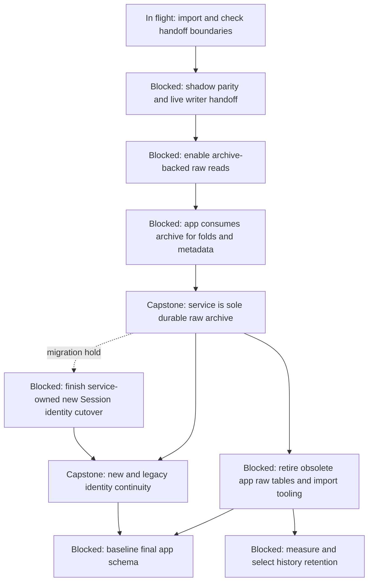
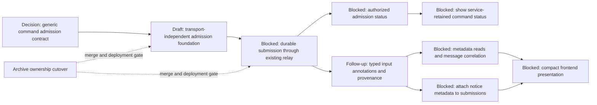
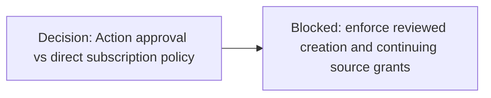
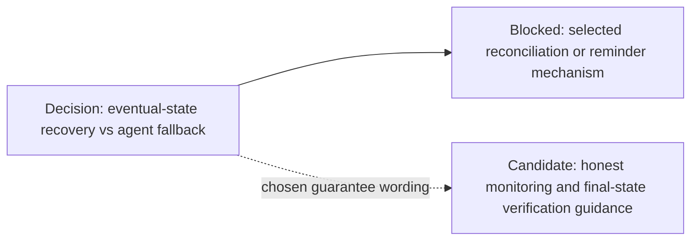
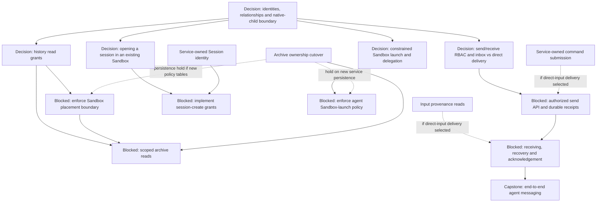
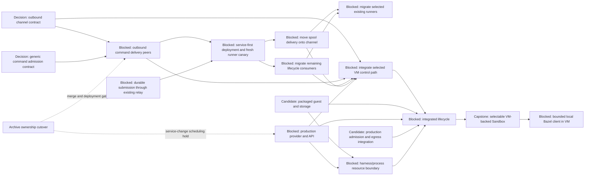
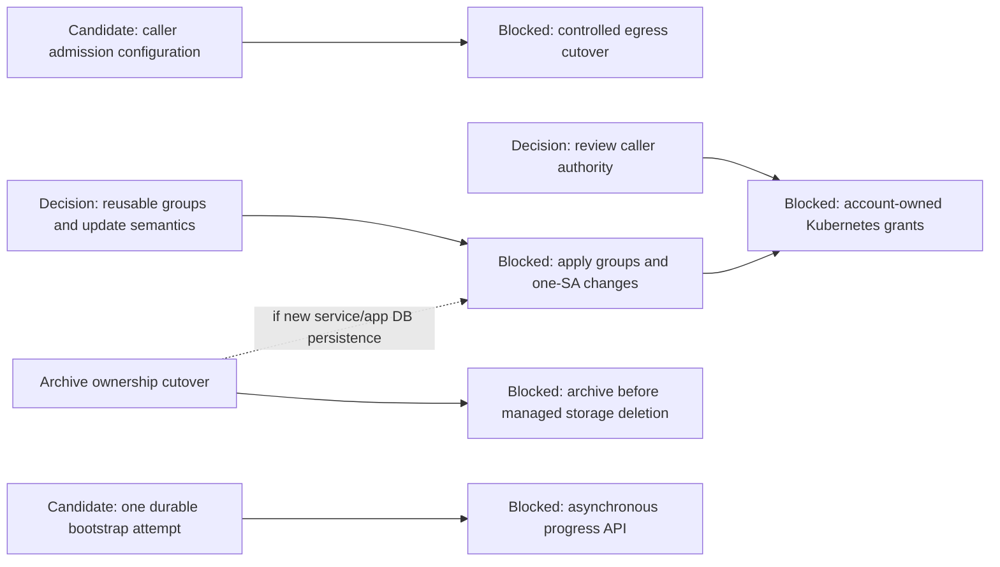

# Agentplane task DAG

This is the dispatch map for **unfinished** work. Detailed contracts belong in component plans;
completed work belongs in component docs, not done nodes here. Maintenance rules are in
[AGENTS.md](../AGENTS.md#task-dag-maintenance). Deliberately deferred candidates and conditional
hardening live in the [freezer](task_freezer.md), not the execution graph.

## Current state and scheduling

**In flight: Session history cutover cleanup.** On 2026-10-09 PDT the migration agent
confirmed all 55 retained staging Sessions were fenced, with matching app/service inventories,
service coverage of every final raw cursor, and app checkpoint coverage of every nonempty
Session. The live canary's app projection advanced beyond its fixed raw fence. The operator
explicitly excluded the six empty Sessions from further verification work. Do not launch
another backfill, whole-history scan, or competing cutover.

**In flight (migration agent, 2026-10-10 PDT):** #9670's app test/runtime port and
its split prerequisites #9677–#9679 are merged. Follow-up code cleanup renames the
app projection lease API; it leaves the deployed schema and retained data unchanged.
Post-merge deployment verification and explicit schema retirement remain separate.
The next code-only PR retires app handoff tooling and selects projection work by
summary metadata, keeping replica lease fencing and checkpoint validation. It does
not drop raw tables or remove their database triggers.

Schema retirement also includes the [post-cutover schema cleanup](session_history_read_cutover.md#post-cutover-schema-cleanup):
rename stale archive/ingestion names, route app commands/resume by public Session ID,
and remove legacy tables, locator copies and fence columns after their callers are retired.

Remaining work: remove temporary flags and legacy paths, verify ordinary new-Session/read
behavior, remove migration jobs and temporary grants, and check testing before changing its
runtime defaults. Retained data and runner storage must remain intact. Details and accepted
bounded evidence belong in the [read handoff](session_history_read_cutover.md).

**Sequencing hold:** finish `THREAD_ARCHIVE_OWNERSHIP` before unrelated additions to the Sandbox
Service database or app database surgery. App raw-table removal and schema consolidation have
additional dependencies below. This is a start-work constraint, not just a gate on merging.
Migration-owned changes continue; API/policy design and independent UI work can proceed without
changing the migrating schema. Do not use a parallel command/metadata database to evade the hold.

**Scoped drafting exception (operator discussion, 2026-10-09 PDT):** command-admission foundation
and coordinated outbound-channel draft code/isolated tests may proceed before cutover, subject to
their contract-review dependencies. Merge, schema application and deployment still wait for archive
ownership and compatibility verification. This does not lift unrelated service/database holds or
authorize notification metadata work. Keep the exception here and in component plans, not `AGENTS.md`.

**Next useful parallel work:** prepare the command-admission/outbound-channel contracts and operator-reviewable
multiagent/read-policy decisions. The previously requested scoped-read design remains useful now;
its implementation waits for the archive and trust-boundary enforcement. No new multiagent transport,
native-subagent integration, offline command queue, or extra worker service is selected here.

States: **in flight** means reported work is underway; **decision** needs a reviewed outcome;
**blocked** names prerequisites; **candidate** is dispatchable when selected, not a priority claim.
A **capstone** closes an integrated contract, not another implementation. Solid arrows below are
prerequisites; dashed arrows explicitly label scheduling holds or conditional choices. All service
contracts remain multi-replica unless a reviewed temporary restriction says otherwise.

## 1. Finish the history migration before expanding persistence

### `THREAD_ARCHIVE_BACKFILL` — one-way import and bounded handoff checks

**In flight; existing migration owner.** Finish/resume import from committed cursors, including
legacy and deleted-Sandbox histories. Retain public UUIDs, native locators and existing Thread URLs.
The import's fast resume validates checkpoint boundaries, not every skipped Event. The operator
chose import receipts, per-Session watermarks and bounded canonical-byte handoff samples rather
than a full historical rescan, accepting residual interior-mismatch risk. Follow the runbook's
bounded checks and close live-writing gaps before handoff. Resolve
active legacy histories with unknown Sandbox UID using verified incarnation evidence, not name
matching. Completion is all scoped histories accounted for, not a Job being Running or one session
reaching its ceiling. Keep backups/high-water marks; do not rename native files or reset databases.
Use the [bounded verification and handoff preflight](../sandbox_service/session_history/CUTOVER.md);
its runner overlap result is evidence, not authorization to populate a legacy UID.

### `THREAD_ARCHIVE_INGEST` — shadow parity and writer handoff

**Blocked on backfill/identity verification for the affected logs.** Shadow-copy code exists; the
remaining outcome is a caught-up, fenced live ingestion path independent of app folds. Finish any
missing owner/claim behavior and reconcile final cursors while quiescing the old raw writer. Use
existing duplicate/conflict and replica/reconnect tests; a bounded handoff comparison covers the
actual migration. An incomplete source prefix or unresolved legacy locator is a real blocker.

### `THREAD_ARCHIVE_READ_CUTOVER` — enable service-backed raw reads

**Blocked on verified backfill and ingestion parity.** Deploy the service reader before enabling
the app's opt-in history switch. Check raw paging, stream resume, old native evidence and denial to
non-authorized service accounts. Lag must remain explicit, not fall back to stale app rows. This
read-only step does not establish sole write ownership or permit deleting app tables. The draft reader captures a service watermark instead of chasing the app raw cursor; its
projection primitive resumes the existing UI checkpoint without copying raw Events. The draft also adds a durable per-Thread raw fence and a default-off supervisor using existing
leases; metadata/lifecycle handoff, UI lag/error reporting and end-to-end interruption tests remain gates;
see the [handoff primitives](session_history_read_cutover.md#draft-app-consumer-handoff-primitives-not-a-rollout-switch).

### `THREAD_ARCHIVE_UI_CUTOVER` — app becomes an archive consumer

**Blocked on raw-read handoff.** Move remaining app raw observation metadata reads and fold input
to archive replay with independent checkpoints. Stop app raw ingestion; keep app-owned UI folds
and operator metadata. Preserve raw progress when a projector fails and expose fold lag/error.
Remove direct SA transcript bypasses, not security checks. See the [read handoff plan](session_history_read_cutover.md).

### `THREAD_ARCHIVE_OWNERSHIP` — archive cutover capstone

**Blocked on all preceding migration phases.** One durable raw archive belongs to Sandbox Service;
app readers/projectors consume it without backend-to-app queries. Record final checkpoint coverage and bounded handoff evidence,
writer ownership and a bounded read/reconnect check, including a retained deleted-Sandbox history.
Keep the runner journal as the source of execution facts. The migration owner records cutover and
rollback evidence in the archive plan/runbook. Only then release the persistence expansion hold.
This does not grant agent reads, make harness state portable, or move command admission.

### `APP_RAW_HISTORY_RETIRE` — remove obsolete storage

**In flight (migration agent, 2026-10-09):** #9660 landed the reader and runner-copy
retirements and is deployed in testing (1/1 Ready) and staging (2/2 Ready). Testing's
142 retained histories remain fenced; the staging `haku` Session advanced with service
and projection cursors at 54,132 and app raw cursor zero, with no feed error.

The next single cleanup PR removes lower-level app raw writers, production raw cursor
lookups and old FeedState/Thread view fallbacks. Old-schema regression setup stays
in test-only fixtures. CI and rollout verification remain required for that change.
One-off import/handoff tooling and temporary grants remain separate cleanup. Retained
tables, rows and runner storage must not be deleted incidentally. Preserve the durable
legacy runner-locator mapping and fold associations. See the
[cleanup acceptance evidence](session_history_read_cutover.md#runtime-cleanup-acceptance).

### `THREAD_IDENTITY_NEW` — service-owned identity for new histories

**Blocked by the migration scheduling hold.** Finish the
[app identity cutover](app_session_identity_cutover.md): use the service-reserved public UUID,
resolve cwd after reservation, and recover a committed Open via authorized lookup. Preserve
legacy private runner locators, native storage and existing URLs. This is not a new public-ID
placement decision. Coordinate any already-open implementation with the migration owner.

### `THREAD_EVENT_CONTINUITY` — identity cutover capstone

**Blocked on ownership and new-ID cutovers.** Verify the retained legacy association and the new
identity path through Open/resume/replay without inventing a second Event counter. Existing
same-storage runner restart/resume tests remain evidence; do not demand copied-volume portability
or a new native experiment. If this particular cutover changes a runner protocol/image, use a
compatible guarded rollout; automatic fleet upgrades are not inherently a prerequisite.

### `APP_ALEMBIC_SQUASH` — consolidate the final app schema

**Blocked on raw-table retirement and identity continuity.** Baseline only the settled schema,
verify fresh and migrated databases and their deployed stamps before pruning old revisions.
Retain the data-preserving rollback procedure. No Action Service or other database squash implied.

### `SESSION_EVENT_RETENTION` — measure before changing history retention

**Blocked on old-copy retirement.** Re-measure actual table/TOAST/index and fold/evidence costs;
the earlier app sample (~6.2 GiB raw Events, ~11m rows) is not the final service footprint. Present
a policy for redundant terminal text/tool deltas before implementing deletion. Keep incomplete
turns and raw/native evidence by default; final UI text is not proof a native frame is reconstructible.
Use replay/fold tests and bounded storage measurement, not an open-ended live failure exercise.

## 2. Service-owned command admission and later notification presentation

Details: [Command admission](command_admission.md); later
[notification presentation and input metadata](notification_presentation.md).

### `SESSION_COMMAND_CONTRACT` — review durable command admission

**Decision; draft code permitted during backfill.** Route all supported runner Commands through
Sandbox Service with persistence, immediate dispatch and spool-based admission reconciliation.
No notification metadata or producer integration in the initial PR. Review authenticated destination
scope, immutable retries, rejection semantics and retention. The command is a protobuf message, not
an operation enum; typed SQLAlchemy columns retain its wire payload and unknown fields.

### `SESSION_COMMAND_CORE` — transport-independent admission foundation

**Draft code and isolated tests permitted; merge/deployment gated on contract review and archive
ownership.** Separate the protobuf service envelope from the full runner Command. Implement durable
submission records, immutable retries, immediate-dispatch coordination through a transport interface,
receipt lookup and direct/spooled reconciliation. No notification metadata, background dispatch or
automatic startup. Keep runner journal admission independent of `Attach`; do not require new inbound
`InsertCommand`/`ListenSpool` endpoints before inversion. Unique command keys and per-command updates
must not serialize unrelated queue work with ingestion; no database lock spans a runner call.

In-flight source: operator discussion and draft [#9573](https://github.com/agentydragon/ducktape/pull/9573),
2026-10-09 PDT. Draft implementation is not deployed capability or verified runtime acceptance.
Test concurrent/conflicting retries, mutable protobuf snapshots, lost receipts, reconciliation
rollback and interrupt responsiveness. The public handler remains a separate integration outcome.

### `SESSION_COMMAND_SUBMISSION` — wire durable submission through the existing relay

**Blocked on admission core, admission contract review and archive ownership; not on inversion.**
Wire the authenticated public RPC to persistence and immediate dispatch through a narrow adapter
around the existing `Attach`-based relay. Reusing this path does not require new inbound runner RPCs.
Return OK only on durable runner admission; record explicit refusal and preserve uncertainty on
transport failure. Reconcile receipts through the existing service-owned ingestion path without
changing its transport. Cover destination authorization, disconnect around admission, immutable
retries and direct/spooled receipt races with the app unavailable. Replay cursors are an adapter
implementation detail, not part of the durable public submission contract. No automatic startup.
Outbound command delivery later replaces this adapter without changing persistence semantics.

### `SESSION_COMMAND_STATUS_READ` — authorized submission status

**Blocked on command admission.** Read pending/admitted/rejected state and retained receipts through
Session authorization, including reconnect and lost responses. Keep runner admission distinct from
harness effects. The service-retained UI indicator is a later client integration, not part of the
initial persistence/routing PR.

### `SESSION_COMMAND_STATUS_UI` — distinguish service retention from runner admission

**Blocked on submission status reads.** Add a command-state dot for service-retained commands whose
runner admission is unconfirmed. Reconcile after reload/lost responses; do not claim definitely
unsent, safe cancellation, or guaranteed eventual execution. Keep browser recovery and harness
confirmation distinct. Independent of compact notice rendering and outside the initial command
persistence/routing PR; include focused state/visual tests.

### `SESSION_INPUT_METADATA` — later typed annotations on input commands

**Follow-up; blocked on command admission contract settling.** Extend the service envelope with typed
metadata and restricted trusted producer provenance. Notification-specific authorization and producer
integration belong here, not in the generic command-admission PR. Metadata never enters runner commands;
notification attachments are invalid on controls. No untyped extension dictionary.

### `SESSION_INPUT_METADATA_READ` — authorized annotation reads

**Blocked on typed input metadata.** Expose metadata by session/command identity and join existing
`origin_command_ids` in projections. Include pending/failed inputs, replay and retained historical
annotations without requiring a live notification inbox. Keep canonical runner Events unchanged.

### `NOTIFICATION_NOTICE_METADATA` — producer integration

**Blocked on typed input metadata.** Attach notice identity/range metadata using existing delivery
command IDs. Preserve receipt reconciliation and explicit inbox acknowledgement. Verify the backend
path without the app; use automated integration coverage rather than requiring a provider outage.

### `NOTIFICATION_PRESENTATION` — compact notification rendering

**Blocked on producer and metadata read integration.** Compact authenticated notification-only
inputs, expand full text and render mixed human/notice messages normally with annotations. Missing
metadata falls back to text. Include visual coverage and one bounded real-notice check; no inbox
acknowledgement on render and no text-prefix provenance heuristic. Runners remain unaware.

### Subscription authorization before broader sources

### `SUBSCRIPTION_AUTHORIZATION_DESIGN` — auto-allow and operator-approved subscriptions

**Decision.** Compare an Action-backed subscribe operation using existing auto-allow/operator
approval with authorization inside Notification Service; do not preselect another policy engine.
Review which callers may subscribe to which sources, targets, fields/filters, destinations and
lifetimes, and who can approve/delegate that access. Subscription creation approval is distinct
from continuing source access and from ownership of the destination inbox. Define renewal, scope
expansion, policy changes/revocation and what happens to already-retained entries.

Use Kubernetes as a concrete design case: namespace/resource/UID scope, object/status/event/log
content, name reuse and whether grants delegate the caller's existing read authority or explicitly
allow additional observation. A privileged watcher must not expose arbitrary cluster data merely
because the agent owns an inbox. Review argument examples that auto-allow narrow approved scopes,
require operator approval for additional scopes, and reject requests nobody can delegate. See the
[subscription authorization design](notifications.md#subscription-authorization-and-action-approval).
This is independent of selecting a messaging transport or fixing existing GitHub delivery gaps.

### `SUBSCRIPTION_AUTHORIZATION` — creation gate and continuing enforcement

**Blocked on the authorization decision.** If Actions is selected, implement its subscribe operation
and reviewed policy bindings; otherwise implement the chosen direct policy path. Keep Notification
Service the subscription/delivery authority in either case. Carry verified caller/decision scope
across the service boundary rather than substituting the executor's broad identity. Enforce the
same access contract on direct APIs, renewals and updates; no approval bypass by another endpoint.

Test auto-allow, pending approval, denial, restricted destinations, scope escalation and expiry/
revocation with controlled identities. No entry may be delivered beyond the reviewed source scope;
approval is not permission to wake a Sandbox or execute source content. Future Kubernetes sources
must depend on this contract/enforcement when promoted from the freezer. Ordinary authorized
subscription reads/cancellation and existing GitHub gap recovery need not wait for a broad redesign.

### GitHub notice reliability after missed updates

The operator reports that GitHub updates may sometimes be missed. This is a concrete reliability
concern, not proof that GitHub webhook delivery itself is at fault. Diagnose webhook receipt,
matching, inbox persistence and notice dispatch separately. Do not reopen waived broad provider
outage/refresh exercises; test the specific recovery contract with controlled missing webhooks.

### `GITHUB_NOTICE_RELIABILITY_DESIGN` — delivery guarantee and fallback

**Decision.** Review the gap and choose the guarantee needed for PR shepherding: eventual awareness
of current head/check/review/merge state, or historical delivery of each event. Compare bounded
service-side reconciliation using existing durable shared GitHub refresh state with explicit agent
fallback checks, optionally scheduled reminders. Recommend the smallest reliable path with a stated
staleness bound/cost. A webhook subscription is not proof no changes occurred when it stays silent.
Snapshot polling cannot reconstruct all intermediate events, and a cron reminder alone is not
recovery if no active agent checks state. Detailed alternatives and questions are in the
[notification plan](notifications.md#missed-github-updates-and-shepherding-reliability).

### `GITHUB_NOTIFICATION_RECOVERY` — implement the reviewed recovery contract

**Blocked on the reliability decision.** If service reconciliation is selected, periodically compare
eligible shared subjects with authoritative GitHub state and durably emit deduplicated observations
for uncovered relevant changes. Reuse refresh leases, backoff and access checks; bound API load.
Distinguish observed state from a received webhook; do not fabricate delivery IDs or promise replay
of events the API cannot recover. If agent fallback is selected instead, provide its actual bounded
check/reminder mechanism and explicit limitations rather than just advising agents to remember.
Add `CRON_NOTIFICATIONS` as a prerequisite only if that reviewed implementation actually needs it;
a service refresh deadline need not introduce a general scheduler. Backend workers stay in-process.

Test a suppressed webhook, duplicate webhook/reconciliation races, changed head/check state and
restart/checkpoint recovery with a controlled GitHub peer. Observe one eventual update for the
promised scope, honest access/backoff state and no false claim of complete history. No live GitHub
outage or exhaustive historical event matrix is required.

### `GITHUB_SHEPHERD_GUIDANCE` — explain monitoring limits and completion checks

**Candidate for immediate baseline clarification; final wording follows the decision.** Treat
notifications as prompts to inspect authoritative current PR state, not evidence that the latest
head passed or that silence means no progress. Document the chosen fallback deadline/ownership and
how an agent notices unreliable monitoring. If reminders are chosen, state who runs them and that
notices do not start a stopped harness. Guidance accompanies the selected reliability behavior;
it must not advertise a polling/reminder guarantee before that mechanism exists.

## 3. Multiagent decisions before implementations

These are operator-reviewable decisions, not permission to implement every possibility. Drafts can
be developed together, but publish a coherent shared identity/authority vocabulary before downstream
APIs. Do not equate creating a resource, reading history, sending a message or receiving/acking it.

### `MULTIAGENT_MODEL` — shared identity and authority vocabulary

**Decision; no runtime work implied.** Present concrete API examples for independent agents,
Sandboxes and Sessions, with creator, manager and parent/provenance represented separately. Ask
the operator to choose addressing/ownership and delegation semantics. No permission inheritance
from an organizational edge or preset. Review how native harness children could later be ingested:
linked execution in the same Sandbox trust boundary versus independently provisioned Sandboxes,
addressability, observability and which controls must remain unavailable. Native integration itself
stays frozen; this decision must allow explicit exclusion rather than require its implementation.

### `THREAD_READ_POLICY_DESIGN` — scoped history read policy

**Decision; draft in parallel with the shared model.** Review compartments versus exact-session
grants, who classifies/reclassifies histories and grants/revokes access, and caller replacement
semantics. Neither grant model isolates Sessions sharing a Sandbox (see the
[isolation boundary](../docs/thread_layering.md#sandbox-isolation-boundary)). Defaults expose
no existing histories to workloads. Select raw read/list/follow scope; read does not imply
send/create, and no folded-read API is required for v1. Decide how revocation
applies to live feeds, discovery and linked evidence. Do not block this on a messaging transport.

### `SANDBOX_COMPARTMENT_BOUNDARY` — enforce Sandbox placement boundary

**Blocked on the reviewed scoped-read policy; new tables also wait for archive ownership.**
The Sandbox is the security isolation boundary: co-resident Sessions share filesystem, credentials,
and ServiceAccount authority, regardless of archive-read classifications. Enforce compatible
placement for any proposed scoped-read policy at Open, adoption and replacement, rejecting
placements whose claimed isolation depends on separating co-resident Sessions. Test shared
filesystem/SA cases and denied placements. Keep VM isolation a separate capability, not a
fictional fix for shared credentials inside one VM. See the
[Sandbox boundary](../docs/thread_layering.md#sandbox-isolation-boundary).

### `THREAD_READ_POLICY` — authorized retained-history access

**Blocked on archive ownership, reviewed read policy and compartment enforcement.** Enforce at
the owning backend across list, raw/native evidence, direct reads and feeds, including reconnect
and revocation. Keep app-only UI folds separate. Test allowed/denied histories, two principals,
deleted Sandboxes and revocation with deterministic service tests plus a bounded deployed auth check.

### `AGENT_MESSAGING_DESIGN` — send and receive contract

**Decision.** Merge the former overlapping `CROSS_THREAD_DELIVERY` design here. Present examples
of sender authentication, recipient discovery/opt-in, send grants, recipient read/ack grants and
administration. Compare Notification Service inbox delivery with direct session input and an
existing messaging channel; recommend the smallest fit. Define accepted, delivered, handled and
acknowledged separately; decide offline behavior, retention, batching, abuse limits and mailbox
ownership after Sandbox deletion. Reading a transcript does not authorize sending or acking.

Output includes the selected owner/API and explicit conditional prerequisites: a direct-input
implementation reuses `SESSION_COMMAND_SUBMISSION` and separately reviewed provenance reads; a notification source reuses
inboxes without treating admission as acknowledgement. Neither branch is selected in this DAG.
Before dispatch, add the chosen branch's edges; do not require implementing both. New Sandbox
Service or app tables still wait for the migration hold. Pure Notification Service work need not
wait for unrelated archive schema once its contract is reviewed.

### `AGENT_MESSAGE_INGRESS` — authorized send and acceptance

**Blocked on messaging decision and its selected prerequisites.** Implement bounded payloads,
server-authenticated sender provenance, per-recipient send policy, idempotent message IDs and honest
acceptance receipts in the chosen authority. Test denied pairs, spoofing and retry/conflict behavior.

### `AGENT_MESSAGE_RECEPTION` — delivery, recovery and acknowledgement

**Blocked on ingress contract/implementation.** Implement selected recipient read/delivery/ack
operations, batching and recovery of unread work. Test revoked/deleted recipients, ordinary offline
catch-up and duplicate delivery without leaking payloads. Do not start/resume a harness implicitly.

### `AGENT_MESSAGING` — integrated messaging capstone

**Blocked on ingress and reception.** Demonstrate an authorized pair exchanging a message through
the selected API, with correct provenance and distinct receipt/ack states. Security-negative and
multi-replica retry cases belong in automated tests; no real provider outage requirement.

### `THREAD_CREATE_POLICY` — authorize session creation separately

**Decision.** Review caller scope to open in an existing Sandbox, accepted defaults, quotas,
creator visibility and revocation. Use the service-reserved Session identity, not a caller-invented
public UUID. Opening in an existing Sandbox grants no isolation from its other Sessions; require a
separate Sandbox when incompatible trust or credentials are needed. Decide whether launch-and-open
is a composition of separate grants, never an implicit read/send/launch permission. This contract
need not choose a durable offline command queue.

### `THREAD_CREATE_AUTHORIZATION` — implement session-create grants

**Blocked on create policy and new identity cutover.** Enforce scope/defaults and idempotent Open
lookup at the service boundary; test forbidden targets/overrides and a lost creation reply.

### `AGENT_LAUNCH_POLICY_DESIGN` — Sandbox launch and delegation policy

**Decision.** Review which callers can use which templates and resource budgets, mounts, images,
secrets, egress and Kubernetes/Action grants; presets are defaults, not authority. A new Sandbox is
required for an independent isolation boundary; adding a Session within one is not. Define manager,
lifetime, parent termination, quota/fanout and revocation without automatic privilege inheritance.
Choose policy ownership and audit records before adding tables. State separately whether the
operation also opens a session; if so, depend on `THREAD_CREATE_AUTHORIZATION` for that composition.

### `AGENT_SANDBOX_LAUNCH` — constrained agent-requested launch

**Blocked on launch policy, idempotent create and the persistence hold.** Enforce the reviewed
effective spec and delegation server-side. Test allowed and forbidden launch parameters and
concurrent retries. Reuse Sandbox Service creation, not harness-native agent tools. Launch alone
does not grant history read, messaging, credentials or execution of another principal's Actions.

## 4. VM environment phases

The [KubeVirt plan](kubevirt_environments.md) contains completed prototype evidence and the detailed
provider design. Split implementation rather than making “VM support” one indivisible task. This is
an unranked candidate lane, not authorization for local Bazel in current containers. Co-design
runner dial-out with VM control networking before committing to guest inbound routing. Changing
connection direction need not move command durability or remove the runner journal.

### `RUNNER_TRANSPORT_DESIGN` — runner dial-out and connection lifecycle

**Decision; narrow command-channel design can proceed during backfill.** The operator selected
one runner-initiated connection per runner incarnation, multiplexing Sessions, using protobuf over
binary WebSocket frames. On disconnect the runner reconnects to an available service replica.
Postgres `LISTEN`/`NOTIFY` is a wakeup/routing signal only, not durable delivery or an admission
receipt. RemoteIO inspires connection direction, not the wire protocol or authority model.

Review the minimum command/receipt framing, incarnation authentication/bootstrap, ownership/epoch
fencing and active dispatch-attempt lifetime. Resolve these before channel implementation, but do
not require the complete spool or lifecycle protocol to ship durable admission over the old relay.
Spool replay/backpressure review belongs to `RUNNER_OUTBOUND_SPOOL`; inventory remaining lifecycle
consumers early and finish their mappings separately. Keep runner journal authority and offline
queue policy unchanged. Details: [runner transport design](runner_discovery.md#outbound-control-channel-design).

### `RUNNER_OUTBOUND_CHANNEL` — implement outbound command delivery

**Blocked on command-channel and admission contract review; draft code/isolated tests permitted,
with merge/deployment gated on archive ownership.** Implement both WS peers, command/receipt
correlation, authenticated incarnation binding, ownership/fencing and reconnect. Use durable command
and outcome records with Postgres notifications to wake the connection owner and waiting caller.
Define active dispatch attempts before routing; reconnect must not scan pending commands for delivery.
Keep existing spool ingestion unchanged. Test missed/duplicate/delayed notifications, owner loss,
authentication denial/revocation, stale connections and ambiguous sends. No new inbound unary API.

### `RUNNER_OUTBOUND_CANARY` — switch command delivery on a fresh runner

**Blocked on outbound command peers and durable submission through the existing relay.** Deploy
compatible service support first with old routes unchanged, then a compatible runner image in a fresh
canary. Select one explicit command route per incarnation and switch its submission adapter to WS;
keep the existing spool reader. Verify the real proxy path, cross-replica routing, owner loss and
reconnect, receipt persistence and exact retries. No silent fallback after an ambiguous send. This
proves command delivery independently of moving spool traffic or migrating existing environments.

### `RUNNER_OUTBOUND_SPOOL` — move spool delivery onto the channel

**Blocked on the command canary; review replay/acknowledgement and backpressure here.** Add independent
cursor-based replay/live Events and acknowledgements only after archive commit. Preserve existing
archive identities, duplicate/conflict checks and direct/spooled admission reconciliation. Bound
buffers and keep controls/receipts responsive during catch-up; test reconnect, checkpoint rollback
and slow readers. Switch the canary's ingester explicitly, then expand this capability in bounded
steps. This changes event transport, not archive storage or admission authority.

### `RUNNER_OUTBOUND_LIFECYCLE` — migrate remaining inbound control consumers

**Blocked on the command canary; inventory and design may proceed earlier.** Map remaining lifecycle
and other inbound/`Attach` consumers onto the channel without accidental startup/resume semantics.
Verify each consumer's auth and retry behavior before retiring its old route. Completion establishes
that selected environments no longer require inbound controls; no automatic fleet migration.

### `RUNNER_OUTBOUND_ROLLOUT` — migrate selected existing runners and retire legacy routes

**Blocked on outbound spool and remaining lifecycle integration.** Expand complete outbound support
to selected existing environments with explicit image/route transitions and rollback preserving
submissions, command IDs, history and runner storage. Partial command/spool canaries above need not
wait for this full migration. Never blindly resend ambiguous commands through a competing route.
Retire legacy `Attach` command submission and inbound access only after all relevant consumers move.
Fleet migration is not a gate on first VM use.

### `VM_CONTROL_NETWORKING` — integrate the reviewed connection direction

**Blocked on the reviewed outbound command, spool and lifecycle capabilities and VM provider.** Wire
VM control reachability/authentication to the chosen path. An outbound channel may remove guest
control-port exposure and endpoint discovery; retain the independently needed outbound API/credential
proxy path. Image packaging and process-isolation work need not wait for this decision. Verify the
selected path on the actual VM network, not just a host-loopback transport test.

### `VM_IMAGE` — packaged guest and state storage

**Candidate.** Publish a digest-pinned guest with runner/harness versions, blank-disk setup and
retained state/workspace bounds. Check startup with both harnesses, without ad hoc downloads or
real credentials baked into the image. Reuse the proven prototype, not another platform evaluation.

### `VM_PROVIDER` — production provider API and lifecycle intent

**Blocked by scheduling hold on concurrent service surgery.** Integrate typed environment kinds,
templates/destinations, inventory, reconciliation, RBAC and UI. Container behavior remains intact.
Existing provider design can proceed during backfill; no uncoordinated service schema changes.

### `VM_EGRESS` — integrate production admission and proxy path

**Candidate.** Implement the selected launcher-injection/proxy route on the production stack.
Verify proxy-only credentials, routing, token replacement and denied cross-environment access;
check failure scope for the new admission configuration. Do not repeat the entire completed
prototype matrix or require simultaneous cluster-wide disasters.

### `VM_PROCESS_ISOLATION` — protect control from harness processes

**Blocked on image/provider.** Enforce aggregate memory/process/disk budgets and process-control
boundaries. Test representative tool/harness termination and bounded exhaustion to establish which
runner/control state survives and what needs durable recovery. This directly addresses agents
accidentally killing their own harness; guest or container packaging alone is not that guarantee.

### `VM_LIFECYCLE` — integrated lifecycle verification

**Blocked on provider, image, selected control networking, egress and isolation.** Exercise both harnesses through real service
routes with retained-state stop/start and a representative replacement; confirm identity, replay and
cleanup. Automated tests cover restart/concurrency branches. Additional live faults need a concrete
unresolved platform risk, not a Cartesian product of every component crash and lifecycle operation.

### `SANDBOX_VM_ISOLATION` — VM integration capstone

**Blocked on integrated lifecycle.** Publish the selectable VM environment and measured isolation
limits, with no implied existing-Sandbox conversion or live migration. Component evidence, not
absence of every imaginable failure, establishes the delivered contract.

### `LOCAL_BAZEL` — bounded local client in a VM

**Blocked on VM capstone.** Wire Bazelisk, storage and authenticated RBE/cache/BES; set CPU/memory/disk
budgets and cleanup. Run a representative build/test with the client inside the VM and actions
remote; check cancellation/cleanup while the harness stays responsive. Installed tools and working
hosted builds do not authorize local Bazel in agent containers. Hosted build acceptance is complete.

## 5. Independent UI and narrowly scoped service work

These candidates need no multiagent or VM decision. Any implementation that turns out to require
app/Sandbox Service database changes inherits the migration hold; non-mutating UI work does not.

### `THREAD_NOTIFICATION_INDICATOR` — pending notice status in the sidebar

**Candidate.** Expose authorized pending/next-eligible notice state and distinguish queued,
delivered and acknowledged states. Reconnect against backend state; any countdown is an estimate.
Independent of compact delivered-message rendering. Never acknowledge from viewing the sidebar.

### `THREAD_BROWSE_PAGINATE` — bounded history browsing

**Candidate; data changes wait for migration.** Paginate/search the Thread listing with authorized
stable cursors, independent of deferred transcript full-text search. Verify ordering, navigation and
permissions rather than making the frontend load every Thread.

### `THREAD_SYNC_STOPPED_RECOVERY` — recover stopped UI synchronization

**Candidate; coordinate with archive read cutover.** Recover stopped feeds from retained cursors
without a manual refresh loop; show honest lag/failure and avoid duplicate rows. Follow the
[Thread sync plan](thread_sync/README.md), including bounded paging and error visibility. Changes to
archive ownership or app persistence wait for their migration nodes; client-only recovery can proceed.

## 6. Existing access and lifecycle follow-ups

These are bounded existing work, not dependencies on the broader multiagent model. Confirm current
source/deployment state with the relevant owner when dispatching; old acceptance notes are not live
observations. New database work inherits the migration hold.

### `PC_EGRESS_CREDENTIALS` — label public-coder's Action Service caller

**Candidate; verify remaining configuration.** Admit the intended OpenClaw account to the dedicated
Action Service using its configured namespace and policy bindings. A label alone is not an execution
grant. Coordinate with the owner of the currently disabled/controlled workload before rollout.

### `PC_EGRESS` — public-coder-agent egress migration

**Blocked on caller admission and a controlled deployment.** Compare effective allowed/denied routes,
credential substitution and Action policy against the existing proxy, then do a reversible cutover.
Remove only unused OpenClaw-specific wiring; retain shared Iron/Haku consumers. Do not turn this
into an outage matrix. Source: [public-coder wiring](../../cluster/cdk8s/public_coder/proxy.py).

### `CLAUDE_AI_SA` — review the external caller's actual authority

**Decision.** Review the claude.ai account's Connection and arbitrary-shell Sandbox privileges,
Kubernetes scope and egress/Action grants. Record intended authority in generated configuration,
not ad hoc grants. Test an allowed and denied operation; do not add privileges as part of this review.

### `KUBERNETES_RBAC_POLICIES` — reusable groups and update semantics

**Decision.** Replace the hundreds of per-namespace grant selections in some Sandbox presets
and their creation dialog with a named, subject-free Kubernetes grant group. Compare snapshot
expansion (acceptable) with live updates to existing bound SAs (preferred); keep a one-SA runtime
grant operation, which may use the same group mechanism. Decide ownership, namespace expansion,
role-edit/revocation behavior and inspection. The launch catalog is not already a live policy.
See the [RBAC grant-group plan](kubernetes_rbac_groups.md) for the current behavior, prior art,
trade-offs and acceptance cases. The preferred live design is an Agentplane-owned,
subject-free group CR and per-Sandbox assignment CR, reconciled by a separate small controller
image/ServiceAccount with narrowly reviewed binding-write and named-role `bind` authority;
final CRD schemas, migration and RBAC grants still require review. Snapshot expansion remains
an acceptable simpler fallback.

### `KUBERNETES_RBAC_POLICY_BINDINGS` — apply groups and one-SA changes

**Blocked on the reviewed policy shape.** Implement compact group selection and durable assignment,
expanded Kubernetes bindings, a one-SA runtime change and inspection. Reconcile changed group
membership for existing SAs if live semantics are chosen; otherwise make snapshots explicit and
support deliberate updates. Retain managed binding conflict/cleanup safeguards and verify
add/remove, overlaps and restart. Any new app or Sandbox Service database persistence remains
under the archive-ownership hold. See the [plan](kubernetes_rbac_groups.md).

### `MANAGED_SA_RBAC` — grants for accounts without a Sandbox

**Blocked on reviewed policy/ownership model and reusable group binding.** Extend the chosen
group assignment and one-SA runtime model to accounts without a Sandbox, including
owner/reconciliation/expiry when no Sandbox can own the binding. Do not fight GitOps over objects.
Existing grant views can ship first; add this grant kind when it exists. Keep ordinary authorization
and cleanup tests; no dependency on a new external-credential broker. See the
[RBAC grant-group plan](kubernetes_rbac_groups.md).

### `SANDBOX_RBAC` — bounded deployed grant checks

**Candidate; security-relevant remaining check.** Inspect the concrete managed-Sandbox grant path
and verify intended versus unrelated scope, including Role edits and credential-use boundaries,
without recording credentials. Use [agent RBAC](../../cluster/docs/agent_rbac.md) and existing tests;
only unresolved deployed wiring needs a live check, not a repeat of every already-covered operation.

### `NOTIFICATION_INGRESS_BOUNDARY` — bounded public-route security check

**Candidate; security-relevant deployment check, not a provider failure drill.** Existing tests
cover invalid signatures. Close the remaining route-wiring uncertainty with an unsigned webhook
request and a private-API request through the public hostname: both must be refused, without
creating subscriptions or inbox entries. Record the result once; no exhaustive provider matrix.

### `BINDING_SUBJECT_ARITY` — singular subject shape

**Candidate; schema changes wait for migration if they touch service/app persistence.** Align the
binding kinds on one explicit subject before adding multi-subject use. Preserve owner/replacement
and authorization semantics; this cleanup does not authorize broader grants.

### `BOOTSTRAP_ATTEMPT_RECEIPT` — one Sandbox bootstrap attempt

**Candidate.** Make repeated initialization return the retained attempt/result, including failed
or interrupted state, without rerunning a script. Test ordinary response loss/restart; an unknown
result is not automatic retry permission. A fresh initialization needs a distinct Sandbox.

### `BOOTSTRAP_PROGRESS_CONTRACT` — asynchronous start/status

**Blocked on durable attempt semantics.** Add authorized start/progress/result semantics without
holding an Open RPC through a long script. Keep successful bootstrap as the Open precondition
unless the operator reviews a change. Separate Sandbox initialization from per-session setup.

### `SANDBOX_LIFECYCLE_DURABILITY` — preserve archive before deleting storage

**Blocked on archive ownership.** Quiesce/fence and archive the final prefix before managed storage
removal. Explicitly handle an unreachable runner or incomplete state rather than claiming recovery.
Use existing same-storage suspension tests; a bounded deletion/archive check validates the new
boundary. No copied-volume portability or simultaneous multi-component crash requirement.

## Scope and retirement of stale gates

- Notifications keep workers in the HTTP service. Retention, worker extraction, idle-polling
  optimization and new-source wiring are frozen with triggers, not hidden release prerequisites.
- Existing GitHub error/backoff visibility, durable refresh reuse, hosted-build authentication and
  the Ducktape preset are accepted. No live provider-outage injection or repeat staging exercise is
  pending. Remaining broad provider-matrix exploration is frozen; ordinary auth/signature denial
  regression coverage belongs with the implementation, not an unbounded production checklist.
- Native subsessions and runner durability/thin-adapter redesign remain frozen. Transport direction
  has its own decision co-sequenced with VMs; neither that nor multiagent design unfreezes the broader
  runner-state redesign.
- Archive placement/store were removed as future tasks because the selected service-owned store and
  import/read code exist; this explicitly does **not** burn down backfill or writer/read cutover.
- `CROSS_THREAD_DELIVERY` is consolidated into `AGENT_MESSAGING_DESIGN`; `THREAD_OPEN_RELOAD_RECOVERY` is part
  of the identity cutover. Do not dispatch duplicate work under the old names.
- Existing security boundaries, data-preserving migration checks and representative deployment
  integration checks remain requirements. The freezer is not a waiver for a known data-loss or
  unauthorized-access bug; promote one when evidence makes it concrete.

### `APP_LOCATOR_COLUMN_RETIREMENT` — remove the redundant app locator

**In flight (migration agent, 2026-10-10):** #9707 public-ID readers are deployed.
Schema cleanup #9712 is draft pending CI and the deployment-only app Recreate
prerequisite. This operational hold applies before merging the schema-removal image:
old replicas still map the column. Verify the strategy live first, then schema
rollout with bounded checks, then remove the temporary override/test. Preserve
service locator bindings, public identities and retained history. See the
[deployment prerequisite](session_history_read_cutover.md#locator-column-deployment-prerequisite).
