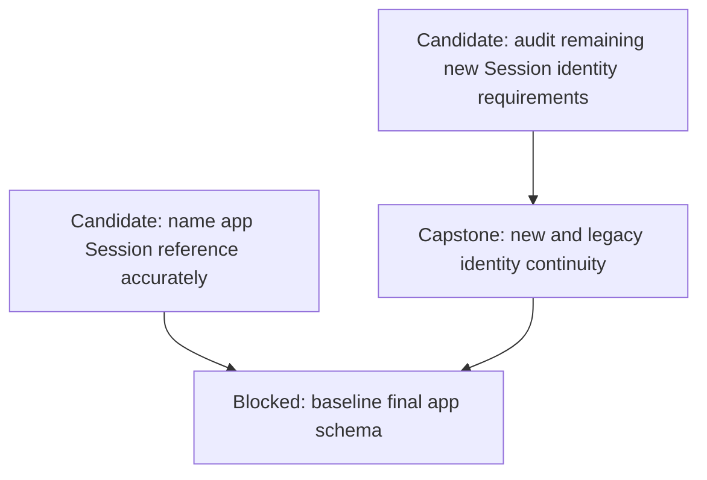
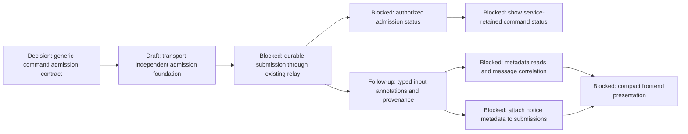
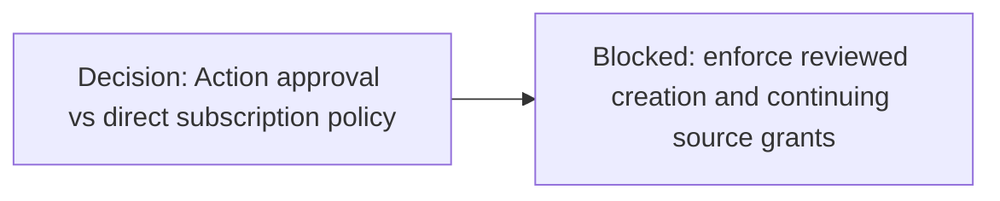
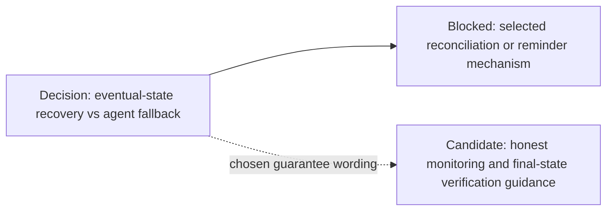
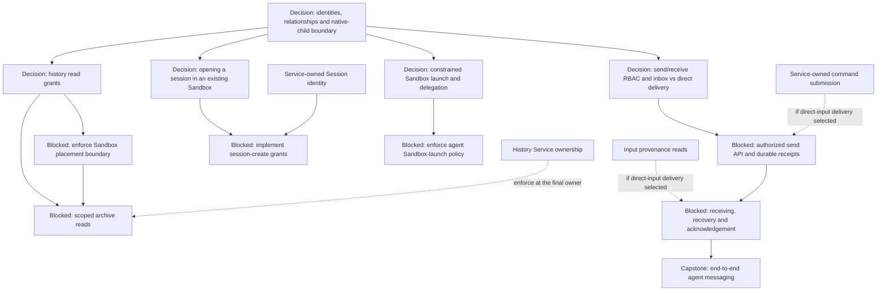
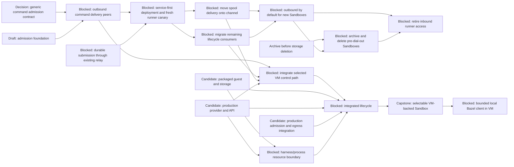
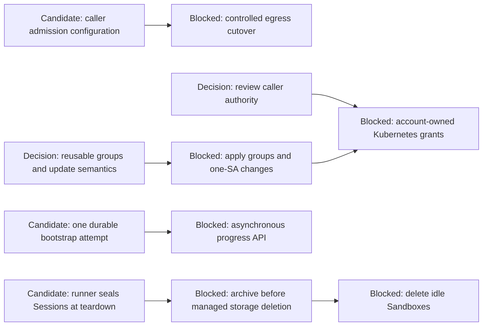
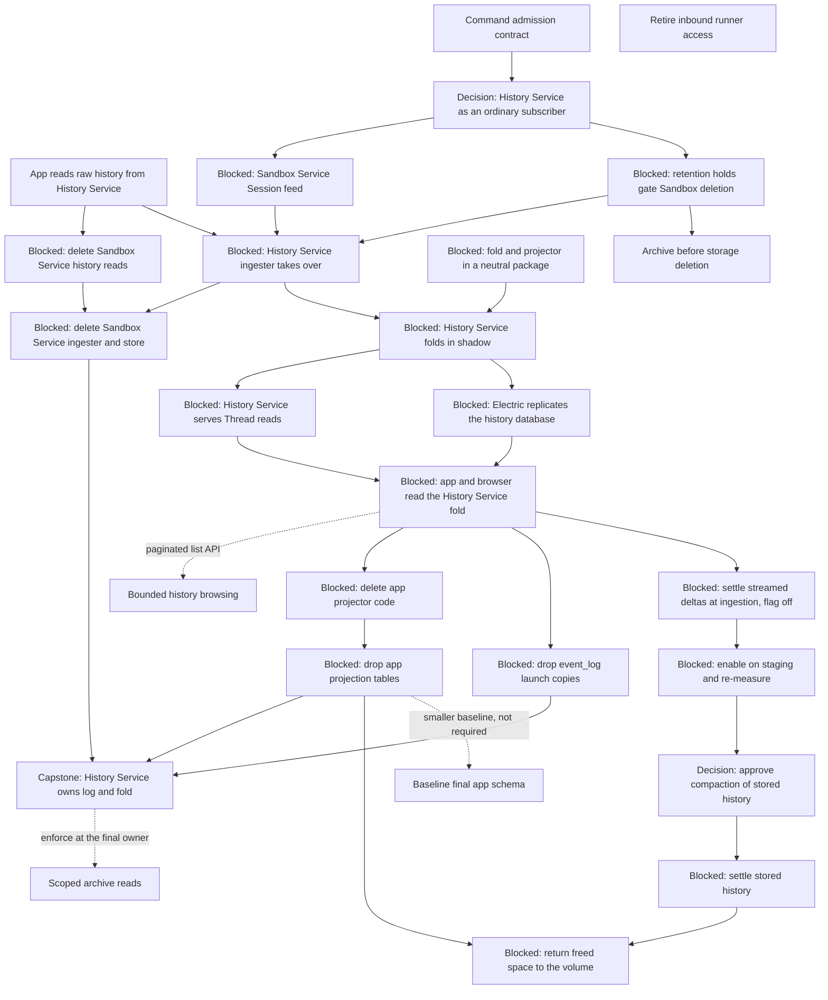
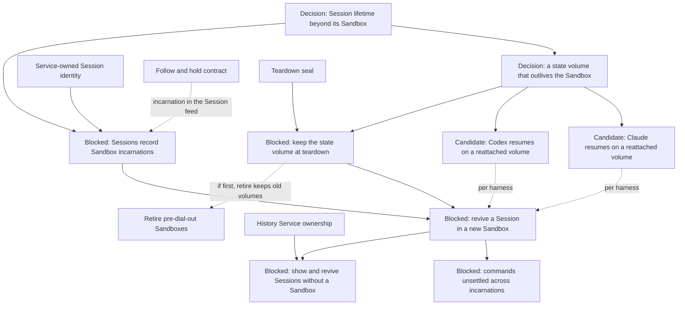

# Agentplane task DAG

This is the dispatch map for **unfinished** work. Detailed contracts belong in component plans;
completed work belongs in component docs, not done nodes here. Maintenance rules are in
[AGENTS.md](../AGENTS.md#task-dag-maintenance). Deliberately deferred candidates and conditional
hardening live in the [freezer](task_freezer.md), not the execution graph.

## Current state and scheduling

The archive ownership cutover is complete in testing and staging. Sandbox Service
owns raw history; the app consumes it through gRPC and owns UI projections. Backfill,
writer/read/UI handoff, runtime migration flags/tooling, per-Session leases and app
locator retirement are completed work, with evidence in the
[cutover completion record](../sandbox_service/session_history/CUTOVER.md#completion-and-retirement).
The old archive-ownership scheduling hold is lifted; contract review, authorization,
and task-specific dependencies below still apply. Do not repeat backfill or full-history
verification. The six empty staging Sessions remain explicitly excluded from extra checks.

Raw-table/fence retirement (#9725) is deployed in both environments, and #9723
removed the temporary rollout override/test. The
[retirement evidence and staging overlap incident](../sandbox_service/session_history/CUTOVER.md#completion-and-retirement)
close that task; the incident is not a clean coordinated-rollout result. Remaining
schema naming, metadata/tooling/grant audits and identity-checklist reconciliation
remain unfinished. Audit metadata consumers (`sandbox`, `harness`, `model`, `cwd`,
summary/activity fields) before deleting useful UI projections; inventory remaining
migration-only tools and grants before removing them. Naming and identity work are
tracked below; squash Alembic only once that schema settles.

States: **in flight** means reported work is underway; **decision** needs a reviewed outcome;
**blocked** names prerequisites; **candidate** is dispatchable when selected, not a priority claim.
A **capstone** closes an integrated contract, not another implementation. Solid arrows below are
prerequisites; dashed arrows explicitly label scheduling holds or conditional choices. All service
contracts remain multi-replica unless a reviewed temporary restriction says otherwise.

## 1. Session schema and identity follow-up

### `APP_SESSION_SCHEMA_RENAME` — name the app Session reference accurately

**Candidate.** Rename `EventLog`/`event_log` with their foreign keys, queries and
references. Preserve public IDs and app projection/operator metadata; do not rename
service archive tables or runner storage. Coordinate a safe schema rollout. Metadata
consumer audits remain scoped cleanup, not permission to discard useful UI projections.

### `THREAD_IDENTITY_NEW` — service-owned identity for new histories

**Candidate: reconcile remaining identity requirements with deployed CreateSession.** Audit the
[app identity cutover](app_session_identity_cutover.md): use the service-reserved public UUID,
resolve cwd after reservation, and recover a committed Open via authorized lookup. Preserve
legacy private runner locators, native storage and existing URLs. This is not a new public-ID
placement decision. Reconcile already-open implementations before dispatching duplicate work.

### `THREAD_EVENT_CONTINUITY` — identity cutover capstone

**Blocked on the remaining new-ID requirements.** Verify the retained legacy association and the new
identity path through Open/resume/replay without inventing a second Event counter. Existing
same-storage runner restart/resume tests remain evidence; do not demand copied-volume portability
or a new native experiment. If this particular cutover changes a runner protocol/image, use a
compatible guarded rollout; automatic fleet upgrades are not inherently a prerequisite.

### `APP_ALEMBIC_SQUASH` — consolidate the final app schema

**Blocked on final schema naming/cleanup and identity continuity.** Baseline only the settled schema,
verify fresh and migrated databases and their deployed stamps before pruning old revisions.
Retain the data-preserving rollback procedure. No Action Service or other database squash implied.

## 2. Service-owned command admission and later notification presentation

Details: [Command admission](command_admission.md); later
[notification presentation and input metadata](notification_presentation.md).

### `SESSION_COMMAND_CONTRACT` — review durable command admission

**Decision.** Route all supported runner Commands through
Sandbox Service with persistence, immediate dispatch and spool-based admission reconciliation.
No notification metadata or producer integration in the initial PR. Review authenticated destination
scope, immutable retries, rejection semantics and retention. The command is a protobuf message, not
an operation enum; typed SQLAlchemy columns retain its wire payload and unknown fields.

### `SESSION_COMMAND_CORE` — transport-independent admission foundation

**Draft code and isolated tests permitted; merge/deployment gated on contract review and archive
ownership.** Separate the protobuf service envelope from the full runner Command. Implement durable
submission records, immutable retries, immediate-dispatch coordination through a transport interface,
receipt lookup and direct/spooled reconciliation. No notification metadata, background dispatch or
automatic startup. Keep runner journal admission independent of `Attach`; do not require new inbound
`InsertCommand`/`ListenSpool` endpoints before inversion. Unique command keys and per-command updates
must not serialize unrelated queue work with ingestion; no database lock spans a runner call.
Admission tables go in the `sandbox_commands` database, never the `sandbox_service` database the
History Service takes over.

In-flight source: operator discussion and draft [#9573](https://github.com/agentydragon/ducktape/pull/9573),
2026-10-09 PDT. Draft implementation is not deployed capability or verified runtime acceptance.
Test concurrent/conflicting retries, mutable protobuf snapshots, lost receipts, reconciliation
rollback and interrupt responsiveness. The public handler remains a separate integration outcome.

### `SESSION_COMMAND_SUBMISSION` — wire durable submission through the existing relay

**Blocked on admission core, admission contract review not on inversion.**
Wire the authenticated public RPC to persistence and immediate dispatch through a narrow adapter
around the existing `Attach`-based relay. Reusing this path does not require new inbound runner RPCs.
Return OK only on durable runner admission; record explicit refusal and preserve uncertainty on
transport failure. Reconcile receipts through the existing service-owned ingestion path without
changing its transport. Cover destination authorization, disconnect around admission, immutable
retries and direct/spooled receipt races with the app unavailable. Replay cursors are an adapter
implementation detail, not part of the durable public submission contract. No automatic startup.
Outbound command delivery later replaces this adapter without changing persistence semantics.

### `SESSION_COMMAND_STATUS_READ` — authorized submission status

**Blocked on command admission.** Read pending/admitted/rejected state and retained receipts through
Session authorization, including reconnect and lost responses. Keep runner admission distinct from
harness effects. The service-retained UI indicator is a later client integration, not part of the
initial persistence/routing PR.

### `SESSION_COMMAND_STATUS_UI` — distinguish service retention from runner admission

**Blocked on submission status reads.** Add a command-state dot for service-retained commands whose
runner admission is unconfirmed. Reconcile after reload/lost responses; do not claim definitely
unsent, safe cancellation, or guaranteed eventual execution. Keep browser recovery and harness
confirmation distinct. Independent of compact notice rendering and outside the initial command
persistence/routing PR; include focused state/visual tests.

### `SESSION_INPUT_METADATA` — later typed annotations on input commands

**Follow-up; blocked on command admission contract settling.** Extend the service envelope with typed
metadata and restricted trusted producer provenance. Notification-specific authorization and producer
integration belong here, not in the generic command-admission PR. Metadata never enters runner commands;
notification attachments are invalid on controls. No untyped extension dictionary.

### `SESSION_INPUT_METADATA_READ` — authorized annotation reads

**Blocked on typed input metadata.** Expose metadata by session/command identity and join existing
`origin_command_ids` in projections. Include pending/failed inputs, replay and retained historical
annotations without requiring a live notification inbox. Keep canonical runner Events unchanged.

### `NOTIFICATION_NOTICE_METADATA` — producer integration

**Blocked on typed input metadata.** Attach notice identity/range metadata using existing delivery
command IDs. Preserve receipt reconciliation and explicit inbox acknowledgement. Verify the backend
path without the app; use automated integration coverage rather than requiring a provider outage.

### `NOTIFICATION_PRESENTATION` — compact notification rendering

**Blocked on producer and metadata read integration.** Compact authenticated notification-only
inputs, expand full text and render mixed human/notice messages normally with annotations. Missing
metadata falls back to text. Include visual coverage and one bounded real-notice check; no inbox
acknowledgement on render and no text-prefix provenance heuristic. Runners remain unaware.

### Subscription authorization before broader sources

### `SUBSCRIPTION_AUTHORIZATION_DESIGN` — auto-allow and operator-approved subscriptions

**Decision.** Compare an Action-backed subscribe operation using existing auto-allow/operator
approval with authorization inside Notification Service; do not preselect another policy engine.
Review which callers may subscribe to which sources, targets, fields/filters, destinations and
lifetimes, and who can approve/delegate that access. Subscription creation approval is distinct
from continuing source access and from ownership of the destination inbox. Define renewal, scope
expansion, policy changes/revocation and what happens to already-retained entries.

Use Kubernetes as a concrete design case: namespace/resource/UID scope, object/status/event/log
content, name reuse and whether grants delegate the caller's existing read authority or explicitly
allow additional observation. A privileged watcher must not expose arbitrary cluster data merely
because the agent owns an inbox. Review argument examples that auto-allow narrow approved scopes,
require operator approval for additional scopes, and reject requests nobody can delegate. See the
[subscription authorization design](notifications.md#subscription-authorization-and-action-approval).
This is independent of selecting a messaging transport or fixing existing GitHub delivery gaps.

### `SUBSCRIPTION_AUTHORIZATION` — creation gate and continuing enforcement

**Blocked on the authorization decision.** If Actions is selected, implement its subscribe operation
and reviewed policy bindings; otherwise implement the chosen direct policy path. Keep Notification
Service the subscription/delivery authority in either case. Carry verified caller/decision scope
across the service boundary rather than substituting the executor's broad identity. Enforce the
same access contract on direct APIs, renewals and updates; no approval bypass by another endpoint.

Test auto-allow, pending approval, denial, restricted destinations, scope escalation and expiry/
revocation with controlled identities. No entry may be delivered beyond the reviewed source scope;
approval is not permission to wake a Sandbox or execute source content. Future Kubernetes sources
must depend on this contract/enforcement when promoted from the freezer. Ordinary authorized
subscription reads/cancellation and existing GitHub gap recovery need not wait for a broad redesign.

### GitHub notice reliability after missed updates

The operator reports that GitHub updates may sometimes be missed. This is a concrete reliability
concern, not proof that GitHub webhook delivery itself is at fault. Diagnose webhook receipt,
matching, inbox persistence and notice dispatch separately. Do not reopen waived broad provider
outage/refresh exercises; test the specific recovery contract with controlled missing webhooks.

### `GITHUB_NOTICE_RELIABILITY_DESIGN` — delivery guarantee and fallback

**Decision.** Review the gap and choose the guarantee needed for PR shepherding: eventual awareness
of current head/check/review/merge state, or historical delivery of each event. Compare bounded
service-side reconciliation using existing durable shared GitHub refresh state with explicit agent
fallback checks, optionally scheduled reminders. Recommend the smallest reliable path with a stated
staleness bound/cost. A webhook subscription is not proof no changes occurred when it stays silent.
Snapshot polling cannot reconstruct all intermediate events, and a cron reminder alone is not
recovery if no active agent checks state. Detailed alternatives and questions are in the
[notification plan](notifications.md#missed-github-updates-and-shepherding-reliability).

### `GITHUB_NOTIFICATION_RECOVERY` — implement the reviewed recovery contract

**Blocked on the reliability decision.** If service reconciliation is selected, periodically compare
eligible shared subjects with authoritative GitHub state and durably emit deduplicated observations
for uncovered relevant changes. Reuse refresh leases, backoff and access checks; bound API load.
Distinguish observed state from a received webhook; do not fabricate delivery IDs or promise replay
of events the API cannot recover. If agent fallback is selected instead, provide its actual bounded
check/reminder mechanism and explicit limitations rather than just advising agents to remember.
Add `CRON_NOTIFICATIONS` as a prerequisite only if that reviewed implementation actually needs it;
a service refresh deadline need not introduce a general scheduler. Backend workers stay in-process.

Test a suppressed webhook, duplicate webhook/reconciliation races, changed head/check state and
restart/checkpoint recovery with a controlled GitHub peer. Observe one eventual update for the
promised scope, honest access/backoff state and no false claim of complete history. No live GitHub
outage or exhaustive historical event matrix is required.

### `GITHUB_SHEPHERD_GUIDANCE` — explain monitoring limits and completion checks

**Candidate for immediate baseline clarification; final wording follows the decision.** Treat
notifications as prompts to inspect authoritative current PR state, not evidence that the latest
head passed or that silence means no progress. Document the chosen fallback deadline/ownership and
how an agent notices unreliable monitoring. If reminders are chosen, state who runs them and that
notices do not start a stopped harness. Guidance accompanies the selected reliability behavior;
it must not advertise a polling/reminder guarantee before that mechanism exists.

## 3. Multiagent decisions before implementations

These are operator-reviewable decisions, not permission to implement every possibility. Drafts can
be developed together, but publish a coherent shared identity/authority vocabulary before downstream
APIs. Do not equate creating a resource, reading history, sending a message or receiving/acking it.

### `MULTIAGENT_MODEL` — shared identity and authority vocabulary

**Decision; no runtime work implied.** Present concrete API examples for independent agents,
Sandboxes and Sessions, with creator, manager and parent/provenance represented separately. Ask
the operator to choose addressing/ownership and delegation semantics. No permission inheritance
from an organizational edge or preset. Review how native harness children could later be ingested:
linked execution in the same Sandbox trust boundary versus independently provisioned Sandboxes,
addressability, observability and which controls must remain unavailable. Native integration itself
stays frozen; this decision must allow explicit exclusion rather than require its implementation.

### `THREAD_READ_POLICY_DESIGN` — scoped history read policy

**Decision; draft in parallel with the shared model.** Review compartments versus exact-session
grants, who classifies/reclassifies histories and grants/revokes access, and caller replacement
semantics. Neither grant model isolates Sessions sharing a Sandbox (see the
[isolation boundary](../docs/thread_layering.md#sandbox-isolation-boundary)). Defaults expose
no existing histories to workloads. Select raw read/list/follow scope; read does not imply
send/create, and no folded-read API is required for v1. Decide how revocation
applies to live feeds, discovery and linked evidence. Do not block this on a messaging transport.

### `SANDBOX_COMPARTMENT_BOUNDARY` — enforce Sandbox placement boundary

**Blocked on the reviewed scoped-read policy.**
The Sandbox is the security isolation boundary: co-resident Sessions share filesystem, credentials,
and ServiceAccount authority, regardless of archive-read classifications. Enforce compatible
placement for any proposed scoped-read policy at Open, adoption and replacement, rejecting
placements whose claimed isolation depends on separating co-resident Sessions. Test shared
filesystem/SA cases and denied placements. Keep VM isolation a separate capability, not a
fictional fix for shared credentials inside one VM. See the
[Sandbox boundary](../docs/thread_layering.md#sandbox-isolation-boundary).

### `THREAD_READ_POLICY` — authorized retained-history access

**Blocked on reviewed read policy and compartment enforcement.** Enforce at
the owning backend across list, raw/native evidence, direct reads and feeds, including reconnect
and revocation. Keep app-only UI folds separate. Test allowed/denied histories, two principals,
deleted Sandboxes and revocation with deterministic service tests plus a bounded deployed auth check.

### `AGENT_MESSAGING_DESIGN` — send and receive contract

**Decision.** Merge the former overlapping `CROSS_THREAD_DELIVERY` design here. Present examples
of sender authentication, recipient discovery/opt-in, send grants, recipient read/ack grants and
administration. Compare Notification Service inbox delivery with direct session input and an
existing messaging channel; recommend the smallest fit. Define accepted, delivered, handled and
acknowledged separately; decide offline behavior, retention, batching, abuse limits and mailbox
ownership after Sandbox deletion. Reading a transcript does not authorize sending or acking.

Output includes the selected owner/API and explicit conditional prerequisites: a direct-input
implementation reuses `SESSION_COMMAND_SUBMISSION` and separately reviewed provenance reads; a notification source reuses
inboxes without treating admission as acknowledgement. Neither branch is selected in this DAG.
Before dispatch, add the chosen branch's edges; do not require implementing both. New Sandbox
Service or app tables require their task-specific contract review. Pure Notification Service work need not
wait for unrelated archive schema once its contract is reviewed.

### `AGENT_MESSAGE_INGRESS` — authorized send and acceptance

**Blocked on messaging decision and its selected prerequisites.** Implement bounded payloads,
server-authenticated sender provenance, per-recipient send policy, idempotent message IDs and honest
acceptance receipts in the chosen authority. Test denied pairs, spoofing and retry/conflict behavior.

### `AGENT_MESSAGE_RECEPTION` — delivery, recovery and acknowledgement

**Blocked on ingress contract/implementation.** Implement selected recipient read/delivery/ack
operations, batching and recovery of unread work. Test revoked/deleted recipients, ordinary offline
catch-up and duplicate delivery without leaking payloads. Do not start/resume a harness implicitly.

### `AGENT_MESSAGING` — integrated messaging capstone

**Blocked on ingress and reception.** Demonstrate an authorized pair exchanging a message through
the selected API, with correct provenance and distinct receipt/ack states. Security-negative and
multi-replica retry cases belong in automated tests; no real provider outage requirement.

### `THREAD_CREATE_POLICY` — authorize session creation separately

**Decision.** Review caller scope to open in an existing Sandbox, accepted defaults, quotas,
creator visibility and revocation. Use the service-reserved Session identity, not a caller-invented
public UUID. Opening in an existing Sandbox grants no isolation from its other Sessions; require a
separate Sandbox when incompatible trust or credentials are needed. Decide whether launch-and-open
is a composition of separate grants, never an implicit read/send/launch permission. This contract
need not choose a durable offline command queue.

### `THREAD_CREATE_AUTHORIZATION` — implement session-create grants

**Blocked on create policy and new identity cutover.** Enforce scope/defaults and idempotent Open
lookup at the service boundary; test forbidden targets/overrides and a lost creation reply.

### `AGENT_LAUNCH_POLICY_DESIGN` — Sandbox launch and delegation policy

**Decision.** Review which callers can use which templates and resource budgets, mounts, images,
secrets, egress and Kubernetes/Action grants; presets are defaults, not authority. A new Sandbox is
required for an independent isolation boundary; adding a Session within one is not. Define manager,
lifetime, parent termination, quota/fanout and revocation without automatic privilege inheritance.
Choose policy ownership and audit records before adding tables. State separately whether the
operation also opens a session; if so, depend on `THREAD_CREATE_AUTHORIZATION` for that composition.

### `AGENT_SANDBOX_LAUNCH` — constrained agent-requested launch

**Blocked on launch policy and idempotent create.** Enforce the reviewed
effective spec and delegation server-side. Test allowed and forbidden launch parameters and
concurrent retries. Reuse Sandbox Service creation, not harness-native agent tools. Launch alone
does not grant history read, messaging, credentials or execution of another principal's Actions.

## 4. VM environment phases

The [KubeVirt plan](kubevirt_environments.md) contains completed prototype evidence and the detailed
provider design. Split implementation rather than making “VM support” one indivisible task. This is
an unranked candidate lane, not authorization for local Bazel in current containers. The
[runner channel](../docs/runner_channel.md) settles the dial-out contract VM control networking
builds on; changing connection direction does not move command durability or remove the runner
journal.

### `RUNNER_OUTBOUND_CHANNEL` — implement outbound command delivery

**Blocked on the admission contract review and admission core; draft code/isolated tests permitted,
with merge/deployment gated on them.** Implement both gRPC peers of the
[runner channel](../docs/runner_channel.md): framing and capabilities, the dedicated token audience
and its egress policy, incarnation binding, epoch fencing, dispatch attempts over the core's
submission records, heartbeats and reconnect. Reconnect must not scan pending commands for delivery.
Keep existing spool ingestion unchanged. Test missed/duplicate/delayed notifications, owner loss,
authentication denial/revocation, stale connections and ambiguous sends. No new inbound unary API.

### `RUNNER_OUTBOUND_CANARY` — switch command delivery on a fresh runner

**Blocked on outbound command peers and durable submission through the existing relay.** Deploy
compatible service support first with old routes unchanged, then a compatible runner image in a fresh
canary. Select one explicit command route per incarnation and switch its submission adapter to the channel;
keep the existing spool reader. Verify the real proxy path, cross-replica routing, owner loss and
reconnect, receipt persistence and exact retries. No silent fallback after an ambiguous send. This
proves command delivery independently of moving spool traffic or migrating existing environments.

### `RUNNER_OUTBOUND_SPOOL` — move spool delivery onto the channel

**Blocked on the command canary; review replay/acknowledgement and backpressure here.** Add independent
cursor-based replay/live Events, acknowledged once the Sandbox Service commits its own admission
reconciliation (`SESSION_FOLLOW_CONTRACT`); the journal stays the buffer for every subscriber. Preserve existing
archive identities, duplicate/conflict checks and direct/spooled admission reconciliation. Bound
buffers and keep controls/receipts responsive during catch-up; test reconnect, checkpoint rollback
and slow readers. Switch the canary's ingester explicitly, then expand this capability in bounded
steps. This changes event transport, not archive storage or admission authority. Replay through
the channel then serves `FollowSession` from any cursor; this and
`HISTORY_WRITE_HANDOFF` change opposite ends of ingestion, so either may land first.

### `RUNNER_OUTBOUND_LIFECYCLE` — migrate remaining inbound control consumers

**Blocked on the command canary; inventory and design may proceed earlier.** Map remaining lifecycle
and other inbound/`Attach` consumers onto the channel without accidental startup/resume semantics.
Verify each consumer's auth and retry behavior before retiring its old route. Completion establishes
that selected environments no longer require inbound controls; no automatic fleet migration.

### `RUNNER_OUTBOUND_ROLLOUT` — outbound by default for new Sandboxes

**Blocked on outbound spool and remaining lifecycle integration.** New Sandboxes start on an image
that dials out, with the route chosen per incarnation and rollback preserving submissions, command
IDs and history. Existing runners are not upgraded in place (operator, 2026-10-10 PDT); they keep
the inbound route until `LEGACY_SANDBOX_RETIRE`. Never blindly resend ambiguous commands through a
competing route. Not a gate on first VM use.

### `LEGACY_SANDBOX_RETIRE` — wind down pre-dial-out Sandboxes

**Blocked on the rollout and archive-before-delete.** The operator approved on 2026-10-10 PDT
archiving and then deleting Sandboxes whose runner image cannot dial out, instead of upgrading them.
Settle each one's history (final prefix archived), then delete it with its runner storage. Exit: no
live Sandbox runs a pre-dial-out image. This is a deliberate exception to the staging-preservation
rule for runner volumes; archived history and public Session identities are kept.

### `RUNNER_INBOUND_RETIRE` — remove inbound runner access

**Blocked on legacy Sandbox retirement.** Remove
`Attach` command submission, the pull ingester, the runner control port and its network policy.
The [runner-auth TODO](runner_discovery.md#todo-proper-runner-authentication-and-transport-security)
goes with them.

### `VM_CONTROL_NETWORKING` — integrate the reviewed connection direction

**Blocked on the reviewed outbound command, spool and lifecycle capabilities and VM provider.** Wire
VM control reachability/authentication to the chosen path. An outbound channel may remove guest
control-port exposure and endpoint discovery; retain the independently needed outbound API/credential
proxy path. Image packaging and process-isolation work need not wait for this decision. Verify the
selected path on the actual VM network, not just a host-loopback transport test.

### `VM_IMAGE` — packaged guest and state storage

**Candidate.** Publish a digest-pinned guest with runner/harness versions, blank-disk setup and
retained state/workspace bounds. Check startup with both harnesses, without ad hoc downloads or
real credentials baked into the image. Reuse the proven prototype, not another platform evaluation.

### `VM_PROVIDER` — production provider API and lifecycle intent

**Candidate.** Integrate typed environment kinds, templates/destinations, inventory, reconciliation,
RBAC and UI. Container behavior remains intact. Review the changed service contracts and schema
rollout as part of this work.

### `VM_EGRESS` — integrate production admission and proxy path

**Candidate.** Implement the selected launcher-injection/proxy route on the production stack.
Verify proxy-only credentials, routing, token replacement and denied cross-environment access;
check failure scope for the new admission configuration. Do not repeat the entire completed
prototype matrix or require simultaneous cluster-wide disasters.

### `VM_PROCESS_ISOLATION` — protect control from harness processes

**Blocked on image/provider.** Enforce aggregate memory/process/disk budgets and process-control
boundaries. Test representative tool/harness termination and bounded exhaustion to establish which
runner/control state survives and what needs durable recovery. This directly addresses agents
accidentally killing their own harness; guest or container packaging alone is not that guarantee.

### `VM_LIFECYCLE` — integrated lifecycle verification

**Blocked on provider, image, selected control networking, egress and isolation.** Exercise both harnesses through real service
routes with retained-state stop/start and a representative replacement; confirm identity, replay and
cleanup. Automated tests cover restart/concurrency branches. Additional live faults need a concrete
unresolved platform risk, not a Cartesian product of every component crash and lifecycle operation.

### `SANDBOX_VM_ISOLATION` — VM integration capstone

**Blocked on integrated lifecycle.** Publish the selectable VM environment and measured isolation
limits, with no implied existing-Sandbox conversion or live migration. Component evidence, not
absence of every imaginable failure, establishes the delivered contract.

### `LOCAL_BAZEL` — bounded local client in a VM

**Blocked on VM capstone.** Wire Bazelisk, storage and authenticated RBE/cache/BES; set CPU/memory/disk
budgets and cleanup. Run a representative build/test with the client inside the VM and actions
remote; check cancellation/cleanup while the harness stays responsive. Installed tools and working
hosted builds do not authorize local Bazel in agent containers. Hosted build acceptance is complete.

## 5. Independent UI and narrowly scoped service work

These candidates need no multiagent or VM decision. Any implementation that turns out to require
app/Sandbox Service database changes requires its own migration safety review.

### `THREAD_NOTIFICATION_INDICATOR` — pending notice status in the sidebar

**Candidate.** Expose authorized pending/next-eligible notice state and distinguish queued,
delivered and acknowledged states. Reconnect against backend state; any countdown is an estimate.
Independent of compact delivered-message rendering. Never acknowledge from viewing the sidebar.

### `THREAD_BROWSE_PAGINATE` — bounded history browsing

**Candidate.** Paginate/search the Thread listing with authorized
stable cursors, independent of deferred transcript full-text search. Verify ordering, navigation and
permissions rather than making the frontend load every Thread. The paging cursors come from the History Service's
list API (`FOLD_READ_API`); client-only work can start earlier.

### `THREAD_SYNC_STOPPED_RECOVERY` — recover stopped UI synchronization

**Candidate; preserve service-backed replay.** Recover stopped feeds from retained cursors
without a manual refresh loop; show honest lag/failure and avoid duplicate rows. Follow the
[Thread sync plan](thread_sync/README.md), including bounded paging and error visibility. Changes to
app persistence require their own safe rollout; client-only recovery can proceed.

## 6. Existing access and lifecycle follow-ups

These are bounded existing work, not dependencies on the broader multiagent model. Confirm current
source/deployment state with the relevant owner when dispatching; old acceptance notes are not live
observations. New database work follows the task-specific review and rollout requirements.

### `PC_EGRESS_CREDENTIALS` — label public-coder's Action Service caller

**Candidate; verify remaining configuration.** Admit the intended OpenClaw account to the dedicated
Action Service using its configured namespace and policy bindings. A label alone is not an execution
grant. Coordinate with the owner of the currently disabled/controlled workload before rollout.

### `PC_EGRESS` — public-coder-agent egress migration

**Blocked on caller admission and a controlled deployment.** Compare effective allowed/denied routes,
credential substitution and Action policy against the existing proxy, then do a reversible cutover.
Remove only unused OpenClaw-specific wiring; retain shared Iron/Haku consumers. Do not turn this
into an outage matrix. Source: [public-coder wiring](../../cluster/cdk8s/public_coder/proxy.py).

### `CLAUDE_AI_SA` — review the external caller's actual authority

**Decision.** Review the claude.ai account's Connection and arbitrary-shell Sandbox privileges,
Kubernetes scope and egress/Action grants. Record intended authority in generated configuration,
not ad hoc grants. Test an allowed and denied operation; do not add privileges as part of this review.

### `KUBERNETES_RBAC_POLICIES` — reusable groups and update semantics

**Decision.** Replace the hundreds of per-namespace grant selections in some Sandbox presets
and their creation dialog with a named, subject-free Kubernetes grant group. Compare snapshot
expansion (acceptable) with live updates to existing bound SAs (preferred); keep a one-SA runtime
grant operation, which may use the same group mechanism. Decide ownership, namespace expansion,
role-edit/revocation behavior and inspection. The launch catalog is not already a live policy.
See the [RBAC grant-group plan](kubernetes_rbac_groups.md) for the current behavior, prior art,
trade-offs and acceptance cases. The preferred live design is an Agentplane-owned,
subject-free group CR and per-Sandbox assignment CR, reconciled by a separate small controller
image/ServiceAccount with narrowly reviewed binding-write and named-role `bind` authority;
final CRD schemas, migration and RBAC grants still require review. Snapshot expansion remains
an acceptable simpler fallback.

### `KUBERNETES_RBAC_POLICY_BINDINGS` — apply groups and one-SA changes

**Blocked on the reviewed policy shape.** Implement compact group selection and durable assignment,
expanded Kubernetes bindings, a one-SA runtime change and inspection. Reconcile changed group
membership for existing SAs if live semantics are chosen; otherwise make snapshots explicit and
support deliberate updates. Retain managed binding conflict/cleanup safeguards and verify
add/remove, overlaps and restart. See the [plan](kubernetes_rbac_groups.md).

### `MANAGED_SA_RBAC` — grants for accounts without a Sandbox

**Blocked on reviewed policy/ownership model and reusable group binding.** Extend the chosen
group assignment and one-SA runtime model to accounts without a Sandbox, including
owner/reconciliation/expiry when no Sandbox can own the binding. Do not fight GitOps over objects.
Existing grant views can ship first; add this grant kind when it exists. Keep ordinary authorization
and cleanup tests; no dependency on a new external-credential broker. See the
[RBAC grant-group plan](kubernetes_rbac_groups.md).

### `SANDBOX_RBAC` — bounded deployed grant checks

**Candidate; security-relevant remaining check.** Inspect the concrete managed-Sandbox grant path
and verify intended versus unrelated scope, including Role edits and credential-use boundaries,
without recording credentials. Use [agent RBAC](../../cluster/docs/agent_rbac.md) and existing tests;
only unresolved deployed wiring needs a live check, not a repeat of every already-covered operation.

### `NOTIFICATION_INGRESS_BOUNDARY` — bounded public-route security check

**Candidate; security-relevant deployment check, not a provider failure drill.** Existing tests
cover invalid signatures. Close the remaining route-wiring uncertainty with an unsigned webhook
request and a private-API request through the public hostname: both must be refused, without
creating subscriptions or inbox entries. Record the result once; no exhaustive provider matrix.

### `BINDING_SUBJECT_ARITY` — singular subject shape

**Candidate.** Align the
binding kinds on one explicit subject before adding multi-subject use. Preserve owner/replacement
and authorization semantics; this cleanup does not authorize broader grants.

### `BOOTSTRAP_ATTEMPT_RECEIPT` — one Sandbox bootstrap attempt

**Candidate.** Make repeated initialization return the retained attempt/result, including failed
or interrupted state, without rerunning a script. Test ordinary response loss/restart; an unknown
result is not automatic retry permission. A fresh initialization needs a distinct Sandbox.

### `BOOTSTRAP_PROGRESS_CONTRACT` — asynchronous start/status

**Blocked on durable attempt semantics.** Add authorized start/progress/result semantics without
holding an Open RPC through a long script. Keep successful bootstrap as the Open precondition
unless the operator reviews a change. Separate Sandbox initialization from per-session setup.

### `SANDBOX_LIFECYCLE_DURABILITY` — preserve archive before deleting storage

**Blocked on the teardown seal and retention holds.** Quiesce/fence and archive the final prefix before managed storage
removal. Explicitly handle an unreachable runner or incomplete state rather than claiming recovery.
Use existing same-storage suspension tests; a bounded deletion/archive check validates the new
boundary. No copied-volume portability or simultaneous multi-component crash requirement.
After `HISTORY_WRITE_HANDOFF`, "archived" means the History Service committed the final prefix.
Completeness is the seal from `RUNNER_TEARDOWN_SEAL` for every Session in the Sandbox, and every
retention hold (`RETENTION_HOLDS`) on those Sessions confirmed through its seal cursor; with no
holds, deletion follows the seal.
When a runner is unreachable or its volume is broken, stop and ask the operator: delete with the
last committed cursor recorded as the end, or keep the Sandbox.

### `RUNNER_TEARDOWN_SEAL` — prove a Session's history is final

**Candidate (design approved by the operator, 2026-10-10 PDT).** At Sandbox teardown the Sandbox
Service fences the Sandbox (no new Sessions, only stop commands), stops every harness, then sends a
seal command. The runner journals one seal entry per Session with its final cursor and then refuses
resume and further writes in this Sandbox. An ordinary stop never seals, since a stopped Session can
resume. A seal ends the Sandbox's incarnation of the Session, not the Session: a later revival
(section 8) continues the same history. The
seal travels through the journal like any entry and reaches followers as the `sealed` frame
`FollowSession` already defines, so a
subscriber can tell a finished Session from a lagging one. Runners on images without the command (`LEGACY_SANDBOX_RETIRE`) are compared
instead against the journal head read over the old route after the harness stops.

### `SANDBOX_IDLE_EXPIRY` — delete Sandboxes nobody uses

**Blocked on archive-before-delete.** Draft [#7859](https://github.com/agentydragon/ducktape/pull/7859)
expires idle Sandboxes (`TODO(sandbox-lifetime)` in `action_service/sandbox/inventory.py`); deleting
one must first archive its final prefix.

## 7. History Service extraction and delta settlement

Not scheduled. Target and the reasoning behind this order: [History Service plan](history_service.md).
Decided by the operator on 2026-10-10 PDT: the History Service takes over the existing
`sandbox_service` database; the fold's projection is rebuilt from the raw log, not copied; Electric
replicates the history database; `session_event` keeps its name.

Each implementation node is one deployment, in this order: a server capability with no callers, then
the caller switch, then deleting the old path in a later release after bounded checks on both
environments. Testing goes first, staging after its checks pass. Retained data is deleted only by a
node that says so. There is no dual write of the raw log: there is one copy of its tables, and each
node switches which service reads or writes it. Only the fold double-runs.

### `SESSION_FOLLOW_CONTRACT` — History Service as an ordinary subscriber

**Decision; design accepted by the operator, 2026-10-10 PDT.** The History Service uses the same
Sandbox Service calls as a historyless client: it discovers Sessions with `WatchSessions`, follows
each from its own committed cursor with `FollowSession`, and places a retention hold. The Sandbox
Service stores no history and pushes to no one; older entries are replayed from the runner journal.
Running without history means running no subscriber. Command admission is still reconciled in the
Sandbox Service from the stream it terminates, and its acknowledgement to the runner waits only on
its own commit; this replaces the [command admission](command_admission.md) clause that reconciles in
the archive transaction. A Session's incarnations (`SessionChange.sandbox_uid`) come from the feed.
For now only the app's ServiceAccount reads history, for every Session; agent reads are
`THREAD_READ_POLICY`. Any permitted Sandbox Service caller may place a hold for now (operator,
2026-10-10 PDT), since only a few services call it. Holds never expire: a stale hold keeps the Sandbox until
the operator releases it, and `GetSandbox` shows which hold blocks deletion. API sketch:
[History Service plan](history_service.md#apis).

### `HISTORY_READ_CUTOVER` — app reads raw history from the History Service

**Candidate.** Switch the app's raw and observation reads to the deployed History Service, with
authorization and lag explicit, after its reads match the Sandbox Service's on a bounded sample in
both environments. Rollback: point the app back at the same tables.

### `SANDBOX_HISTORY_READS_RETIRE` — delete the old read path

**Blocked on the read cutover, one release later.** Remove the Sandbox Service history read RPCs and
their client code.

### `SESSION_WATCH` — a feed of Sessions

**Blocked on the follow contract.** `WatchSessions` streams every Session the caller may see, then
creations and state changes (including the current Sandbox incarnation), from a resumable position.
No callers yet. Test resume after disconnect and that authorization filters the feed.

### `RETENTION_HOLDS` — holds gate Sandbox deletion

**Blocked on the follow contract.** `PlaceHold`, `ConfirmHold` and
`ReleaseHold`, stored by the Sandbox Service. `DeleteSandbox` waits until every hold on every
Session has confirmed its seal cursor. Test holds racing teardown, a holder that never confirms
(deletion waits and reports it), and a Sandbox with no holds.

### `HISTORY_WRITE_HANDOFF` — the History Service ingester takes over

**Blocked on the Session feed, holds and the read cutover.** Move the Sandbox Service's
ingester into the History Service as a subscriber of those calls, with its per-log claim; one writer
at a time. Test a History Service outage (it resumes from its cursor; the runner journal is the
buffer), duplicate and conflicting replays, and claim handover between replicas. Rollback: run the
old ingester again; the tables are the same.

### `SANDBOX_LOCAL_HISTORY_RETIRE` — remove the local store

**Blocked on the write handoff and read retirement, one release later.** Delete the Sandbox
Service's ingester and `session_history` store code and revoke its grants on history tables. Test
that the Sandbox Service provisions, drives and reconciles commands with no History Service
running, and update `sandbox_service/API.md`.

### `FOLD_LIBRARY_EXTRACT` — the fold leaves `agentplane.app`

**Candidate.** Move the fold and projector into a neutral package the app and the
History Service both import, since backends may not import the app. The app keeps running it; no
behavior change.

### `FOLD_SHADOW` — History Service folds beside the app

**Blocked on the neutral fold and the write handoff.** History Service copies of the projection
tables (`thread_entity`, payload chunks and manifests, `thread_evidence`, `thread_native_link`,
`thread_checkpoint`), `session_projection_lease` and `thread_history_summary`, with the projector,
built in a new epoch by rebuild (all decided by the operator, 2026-10-10 PDT), while the app projector keeps serving. The rebuild reads
every retained event once (operator-approved despite the migration's no-scan rule) and is expected
to run long: it is resumable from its own checkpoint, rate-bounded so live ingestion and folding
keep up, and reports per-Session progress. Exit: materialized
threads (entities and bodies) equal the app's on a bounded sample of Sessions, plus live catch-up.
Rollback: drop the shadow tables.

### `FOLD_READ_API` — History Service serves Thread reads

**Blocked on the shadow.** The Thread read API, keyed by public Session ID (list summaries, an entity window,
payloads by reference, raw/debug reads), authorized per Session,
with fold lag and errors explicit. List summaries page with stable, authorized cursors from the
start (operator, 2026-10-10 PDT), so `THREAD_BROWSE_PAGINATE` only adds the UI. No callers yet.

### `ELECTRIC_HISTORY_SOURCE` — Electric over the history database

**Blocked on the shadow.** An Electric deployment replicating the History
Service projection, reachable through the app's authorization proxy but not yet selected. Measure
shape count and memory as `thread_sync` requires.

### `FOLD_READ_CUTOVER` — read the History Service fold

**Blocked on the read API and the new Electric source.** App Thread reads and the proxy's Electric
upstream switch together; the app projector stops but keeps its checkpoint. Test with the app
unavailable: ingestion and folding continue. Rollback: switch back and resume the app projector.
Open tabs need a reload after the switch; `THREAD_SYNC_STOPPED_RECOVERY` is not a prerequisite
(operator, 2026-10-10 PDT).

### `APP_PROJECTOR_RETIRE` — delete the app projector

**Blocked on the fold read cutover, one release later.** Remove the app projector, its leases'
code and the app's Electric deployment. Retained tables stay.

### `APP_PROJECTION_RETIRE` — drop the app projection

**Blocked on projector retirement.** An explicit deletion PR for the app projection tables and
leases. The data is derived and rebuildable from the raw log. Skip
[post-cutover cleanup](session_history_read_cutover.md#post-cutover-schema-cleanup) renames of
tables this drops.

### `APP_EVENT_LOG_COPIES_RETIRE` — drop the app's launch copies

**Blocked on the fold read cutover; decided by the operator, 2026-10-10 PDT.** The app reads
harness and cwd from the Sandbox Service's session record and the current model and last model
activity from the History Service summary, then an explicit schema PR drops those `event_log`
columns, leaving it the Thread → Session link. `APP_SESSION_SCHEMA_RENAME` renames the same
table; either may land first, and the second rebases its migration. Replaces that item of the
[post-cutover cleanup audit](session_history_read_cutover.md#post-cutover-schema-cleanup).

### `HISTORY_SERVICE_OWNERSHIP` — capstone

**Blocked on projection and local-store retirement.** The History Service is
the only owner of the raw log and fold; the app is a facade over it. Each service's README states
what unrelated agents can still do while it is down or rolling.

### `SESSION_EVENT_RETENTION` — settle streamed deltas

**Blocked on the fold read cutover.** The policy was approved 2026-10-10 PDT: behind a default plus
per-Session override (off by default), drop an item's delta frames and derived deltas only when
every frame matches an exact versioned template and the retained completion holds exactly their
concatenation. Lift the templates, pure settler and settlement tables from draft
[#9713](https://github.com/agentydragon/ducktape/pull/9713) into the History Service ingester's
batch transaction, deleting fold evidence for
the settled cursors in the same transaction; the app-side gap handling is not carried over. #9713
stays parked as the fallback if disk pressure arrives first.

### `SESSION_EVENT_RETENTION_ENABLE` — turn it on and measure

**Blocked on settlement.** Enable on testing, then staging, and re-measure `session_event` and
evidence growth against the 2026-10-10 sample.

### `SESSION_EVENT_COMPACTION_PLAN` — approve settling stored history

**Decision.** A reviewed plan for a resumable one-off Job that settles stored Sessions with the same
code: the Sessions it touches and what is lost. It deletes stored history, so it needs the
operator's explicit approval.

### `SESSION_EVENT_COMPACTION` — settle stored history

**Blocked on the approved plan.** Run the Job in testing, then staging, stopping and resuming
cleanly. Backups keep the old rows until their retention expires.

### `HISTORY_REPACK` — return freed space

**Blocked on compaction and the app projection drop.** `pg_repack` (or `VACUUM FULL` in a window)
on the log and projection tables; deleted rows otherwise stay as reusable space inside Postgres.

## 8. Sessions that outlive their Sandbox

Not scheduled (operator, 2026-10-10 PDT: co-plan, not now). A Session and its history are durable;
its Sandbox is one incarnation that can be deleted, with a new one provisioned later to revive the
Session on a runner. Today a Session lives exactly as long as its Sandbox's runner volume
(suspension removes the Pod and keeps the volume). The event log alone is not a native resume image;
the operator's direction (2026-10-10 PDT) is a state volume holding the harness files and runner
state that survives the Sandbox and is attached to the next one. Section 7 is written so it does not
preclude this: the History Service keys by Session, a Session records each Sandbox incarnation, and
a teardown seal closes an incarnation, not the Session.

### `DURABLE_SESSION_LIFECYCLE` — Session lifetime beyond its Sandbox

**Decision.** Replaces the frozen `THREAD_OUTLIVES_SANDBOX`. Decide: what a revived Session gets
back (native harness state only, or also its workspace files); which launch configuration a new
incarnation uses (the Session's frozen one, or a current template, which also decides whether an
image upgrade happens on revival); who may revive and how (an explicit API call, never implicitly
on a read or a notification). Sessions that shared a Sandbox revive together (one state volume per
Sandbox, `SESSION_STATE_VOLUME_DESIGN`).

### `SESSION_STATE_VOLUME_DESIGN` — a state volume that outlives the Sandbox

**Decision; direction set by the operator, 2026-10-10 PDT.** Replaces the frozen
`THREAD_PORTABLE_STATE`. A persistent volume holds the native harness files and the runner's state,
separate from the workspace, is kept when the Sandbox is deleted, and is attached to the next
incarnation, whose runner continues the same journal. Decided: one volume per Sandbox, so the
Sessions that shared a Sandbox revive together in its successor. Decide: whether the runner's state
goes on it or only the harness files;
whether the workspace survives too (operator neutral; default: it does, kept with the state volume,
because a revived conversation refers to files the agent made and its cwd must exist); storage class, since `local-path` pins a volume to one node and
so pins revival there; who deletes a retained volume (an explicit Session deletion) and its quota;
and refusing to attach to an incompatible harness or runner version rather than attempting it.

### `CLAUDE_PORTABLE_STATE` — Claude evidence

**Candidate after the volume design.** Attach a retained volume to a new Sandbox (new Pod, possibly
a newer image) and resume, checking continuation and prompt-cache cost. The frozen
`RUNNER_IMAGE_UPGRADE_PROOF` is the same experiment on one Sandbox. Independent of Codex.

### `CODEX_PORTABLE_STATE` — Codex evidence

**Candidate after the volume design.** The same for Codex; neither harness waits for the other.

### `SESSION_INCARNATIONS` — a Session records its Sandboxes over time

**Blocked on the lifecycle decision and service-owned identity.** The Sandbox Service's Session
record holds a sequence of Sandbox incarnations, at most one live; the locator ↔ Sandbox binding
becomes per incarnation. The Session feed (`WatchSessions`) reports each incarnation's `sandbox_uid`, from
which the History Service records it, and its seal ends that incarnation, not the Session. On the retained volume the runner journal and its
cursors simply continue; the next incarnation journals that it resumed after a seal.

### `STATE_VOLUME_RETENTION` — keep the state volume at teardown

**Blocked on the volume design and the teardown seal.** Provision the state volume separately from
the Sandbox's other storage; at teardown, after the seal commits, delete the Sandbox and keep the
volume, bound to the deleted Sandbox's identity so that its successor receives it. Test that a Sandbox
deletion never deletes a retained volume and that an explicit Session deletion does.

### `SESSION_REVIVE` — revive a Session in a new Sandbox

**Blocked on incarnations, retained volumes and per-harness evidence.** Provision a new Sandbox
from the decided launch configuration with the retained volume attached, and resume the harness as a new
incarnation of the same Session and history. Ships per harness as its evidence lands. Test revival
after deletion, a refused incompatible volume, and concurrent revive requests.

### `THREAD_SUCCESSOR_DELIVERY` — commands unsettled across incarnations

**Blocked on revival.** A command whose admission was ambiguous when an incarnation ended is not
replayed into the next one; it stays unknown and is shown as such. Moved from the freezer.

### `HOSTED_THREAD_SURFACES` — show and revive Sessions without a Sandbox

**Blocked on revival and History Service ownership.** The app lists Sessions whose Sandbox is gone,
reads their history from the History Service, and offers an explicit revive. Moved from the freezer.

## Scope and retirement of stale gates

- Notifications keep workers in the HTTP service. Retention, worker extraction, idle-polling
  optimization and new-source wiring are frozen with triggers, not hidden release prerequisites.
- Existing GitHub error/backoff visibility, durable refresh reuse, hosted-build authentication and
  the Ducktape preset are accepted. No live provider-outage injection or repeat staging exercise is
  pending. Remaining broad provider-matrix exploration is frozen; ordinary auth/signature denial
  regression coverage belongs with the implementation, not an unbounded production checklist.
- Native subsessions and runner durability/thin-adapter redesign remain frozen. Transport direction
  has its own decision co-sequenced with VMs; neither that nor multiagent design unfreezes the broader
  runner-state redesign.
- Archive placement/store were removed as future tasks because the selected service-owned store and
  import/read code and the verified backfill/writer/read cutover are complete.
- `CROSS_THREAD_DELIVERY` is consolidated into `AGENT_MESSAGING_DESIGN`; `THREAD_OPEN_RELOAD_RECOVERY` is part
  of the identity cutover. Do not dispatch duplicate work under the old names.
- Existing security boundaries, data-preserving migration checks and representative deployment
  integration checks remain requirements. The freezer is not a waiver for a known data-loss or
  unauthorized-access bug; promote one when evidence makes it concrete.
