# Agentplane task DAG

This is the authoritative map of **unfinished** Agentplane tasks. Edges are technical dependencies;
operator priority is separate. Remove a task when completed; do not retain done nodes, shipped-foundation
sections or acceptance-history recaps here. Completed work and evidence belong in component contracts,
not this backlog. See the [Action Service specification](../action_service/SPEC.md),
[service integration details](../action_service/README.md),
[workload authentication](../docs/workload_authentication.md),
[operator federation](../docs/operator_federation.md),
[launch presets](../docs/launch_presets.md), and [action policies](../docs/action_policies.md).

## Operator priority

All Agentplane components and their acceptance contracts are multi-replica by default. Durable
state belongs to its authority: runner SQLite for admitted commands and Events, PostgreSQL for
the app archive and Action Service, and Kubernetes for Sandbox intent. Cross-replica change fanout uses
the authority's notification/watch mechanism (PostgreSQL `NOTIFY` for Action Service state), with
reconnect/replay from durable state rather than process-local memory. A single-replica deployment
is an explicit temporary operational constraint, never an implicit correctness assumption.

Proposed execution order for the Thread correctness/UI track:

- **P1, reported against deployed staging:** command-submission deadlines
  (`ADMISSION_DEADLINE_BUDGET`, then `ADMISSION_UNCERTAIN_OUTCOME`). The staged submission
  indicator (`SUBMISSION_STAGE_INDICATOR`) follows them and shares its test changes with
  [#9063](https://github.com/agentydragon/ducktape/issues/9063).
- **P2:** browser-driven acceptance against the deployed cluster (`CLUSTER_BROWSER_ACCEPTANCE`)
  and driver-hosted tools (`DT`). Neither blocks the current API-level acceptance closure.
- **Unranked future harness capabilities:** project skills and commands, web search, visual input,
  native subagents, interactive controls, project hooks/plugins, prompt suggestions, and a Claude
  RemoteIO transport evaluation. The
  existing P2 item `DT` is included below as a cross-reference and keeps its current priority; it
  covers Action-backed tools and background-work control. The new candidates are an inventory, not
  an execution order or a priority claim against the rest of this DAG. Their win/work estimates are
  provisional; compare them with the full roadmap when scheduling. `HARNESS_CONFIG_ISOLATION` is
  the shared technical prerequisite.

Transcript search/lookup (`T3`) remains deferred. Priority is not a dependency between these tracks.

## DAG

**A node is one atomic piece of work.** A migration that replaces three services running on
three clocks is three nodes, not one, even when a single sentence describes all of them: one
node cannot be half done, and a node nothing can finish hides which third is blocked. Where
the pieces only mean something together, they feed a **capstone** node that depends on all of
them and carries the "it is all migrated" claim -- the capstone is what other work waits on,
and the pieces are what gets dispatched.

```mermaid
flowchart TB
    classDef active fill:#dbeafe,stroke:#1d4ed8,color:#1e3a8a,stroke-width:3px
    classDef decision fill:#ffedd5,stroke:#c2410c,color:#7c2d12,stroke-width:2px,stroke-dasharray:5 3
    classDef future fill:#f3f4f6,stroke:#6b7280,color:#374151
    classDef milestone fill:#ede9fe,stroke:#6d28d9,color:#4c1d95,stroke-width:2px

    ELEVATE["Planned behavior<br/>agent-requested temporary permission<br/>ServiceAccount and Sandbox callers, operator-approved"]:::future
    INPUT_DELIVERY["Remaining native evidence<br/>input/interrupt/recovery gaps<br/>exact upstream requests and queue fates"]:::active
    T3["Deferred product work<br/>thread search and lookup<br/>later prioritization"]:::future
    PC_EGRESS_CREDENTIALS["Remaining configuration<br/>label public-coder's OpenClaw caller<br/>for Action Service admission"]:::future
    PC_EGRESS["Capstone<br/>public-coder-agent egress migration<br/>proven equivalent, cut over, old proxy retired"]:::milestone
    ACCESS["Deferred design<br/>delegated vs brokered external access<br/>grants and revocation"]:::future
    EGRESS_CHANGE["Deferred design<br/>agent-requested egress<br/>policy expansion"]:::future
    BINDING_SUBJECT_ARITY["Schema cleanup<br/>singular subject across binding kinds<br/>before multi-subject use"]:::future
    NOTIFICATION_ACTION_FEED["Notification source follow-up<br/>event-driven Action consumption<br/>replace idle history polling"]:::future
    HARNESS_AUTO_COMPACTION_PROOF["Future harness acceptance<br/>automatic compaction<br/>standing instructions on next request"]:::future
    NOTIFICATION_NOTICE_PACING["Incremental improvement<br/>stage-aware notice pacing<br/>avoid redundant busy-turn notices"]:::future
    GITHUB_DELIVERY_RECOVERY["Remaining GitHub acceptance<br/>redelivery deduplication and restart recovery"]:::future
    HOME_ASSISTANT_NOTIFICATIONS["Unranked future source<br/>Home Assistant events and state changes"]:::future
    NOTIFICATION_SOURCE_WIRING["Conditional future refactor<br/>extract shared source wiring<br/>from concrete implementations"]:::future
    CRON_NOTIFICATIONS["Unranked future capability<br/>scheduled / cron notifications<br/>durable schedules and missed-tick policy"]:::future
    NOTIFICATION_PRESENTATION["Unranked future capability<br/>structured notification provenance<br/>compact frontend presentation"]:::future
    NOTIFICATION_STATUS_UI["Unranked future capability<br/>Thread/Sandbox notification status<br/>integration app inspection"]:::future
    KUBERNETES_MONITORING["Unranked future capability<br/>agent-visible Kubernetes rollout monitoring<br/>notifications are an option"]:::future
    DT["P2 deferred<br/>Action-backed driver tools and background control"]:::future
    HARNESS_CONFIG_ISOLATION["Unranked prerequisite<br/>separate hosted feature config from capture scenarios<br/>keep project and host settings isolated"]:::future
    HARNESS_SKILLS["Unranked candidate<br/>project-scoped skills and commands<br/>both native harnesses"]:::future
    HARNESS_WEB_SEARCH["Unranked candidate<br/>routed web search<br/>source evidence in Thread"]:::future
    HARNESS_VISUAL_INPUT["Unranked candidate<br/>image attachments and visual input<br/>composer, protocol, storage, replay"]:::future
    HARNESS_MANUAL_COMPACTION["Unranked future control<br/>user-triggered harness compaction<br/>from the frontend"]:::future
    CLAUDE_REMOTE_IO_EVAL["Unranked transport evaluation<br/>Claude RemoteIO through egress proxy<br/>compare with stream-json"]:::decision
    HARNESS_INTERACTIVE_CONTROLS["Unranked candidate<br/>questions and permission decisions<br/>durable park, answer, recovery"]:::future
    HARNESS_PROJECT_HOOKS["Unranked candidate<br/>trusted project hooks<br/>bounded execution and control replies"]:::future
    HARNESS_PLUGINS["Unranked candidate<br/>project plugins and skill packages<br/>source trust and capability grants"]:::future
    HARNESS_PROMPT_SUGGESTIONS["Optional, lowest estimated win<br/>Claude prompt suggestions<br/>measure UX before enabling"]:::future
    THREAD_OUTLIVES_SANDBOX["Deferred design<br/>a Thread lifecycle that outlives its Sandbox<br/>hosted rather than Sandbox-bound"]:::future
    HOSTED_THREAD_SURFACES["Deferred design<br/>read and control surfaces for a hosted Thread<br/>beyond today's Sandbox-bound view"]:::future
    THREAD_READ_POLICY["Deferred design<br/>explicit ServiceAccount access to Thread history<br/>specific IDs or reviewed selectors"]:::decision
    AG["Capstone<br/>hosted Agent and Thread model<br/>lifecycle, surfaces and read policy together"]:::milestone
    CONNECTION_SA_REBIND["Planned mutation<br/>rebind a Connection's ServiceAccount in place<br/>no mutation exists; only a fresh OAuth consent does"]:::future
    SANDBOX_RBAC["Managed Kubernetes access<br/>catalog choices and SA bindings<br/>live acceptance pending; see #8596"]:::active
    KUBERNETES_RBAC_POLICIES["Deferred design<br/>reusable Kubernetes RBAC policies<br/>shared bindings, propagation, compact UI"]:::future
    CALLER_GRANT_VIEW["Planned UI<br/>one grant view for Sandboxes and unmanaged agents<br/>an unmanaged agent's policy is invisible today"]:::future
    MANAGED_SA_RBAC["Planned Kubernetes access<br/>RoleBindings as a managed grant kind<br/>any managed ServiceAccount, Sandbox-backed or not"]:::future
    CLAUDE_AI_SA["Planned identity<br/>the claude.ai account's deliberate authority<br/>cluster diagnostics and agent-readable reads; reaches Forgejo as haku"]:::future

    UISHELL_NEWTHREAD_SANDBOX["Deferred combined UI<br/>pre-scoped '+ New thread' on a Sandbox's page<br/>Sandbox selected, Thread fields editable"]:::future
    UISHELL_NEWTHREAD_LANDING["Deferred combined UI<br/>sidebar '+' unscoped new-thread composer<br/>Sandbox/preset/model pickers + prompt"]:::future
    COMMAND_QUEUE_DECISION["Deferred decision<br/>accept commands while runner unavailable?<br/>current slice uses runner admission first"]:::decision
    ASYNC_PROTOCOL_AUDIT["Design decision<br/>audit long-lived request/response contracts<br/>ticket vs durable admission vs push"]:::decision
    ADMISSION_DEADLINE_BUDGET["P1 reported failure<br/>submission waits bound on archive lag<br/>four coupled 15 s budgets, one setting"]:::active
    ADMISSION_UNCERTAIN_OUTCOME["Planned correctness<br/>unconfirmed submission reconciles<br/>not a failed send"]:::future
    COMMAND_DISPATCHED_EVENT["Missing observation<br/>runner handed the command to the harness<br/>journal-only today; needs an Event"]:::future
    SUBMISSION_STAGE_INDICATOR["Planned UI<br/>staged submission indicator<br/>which of five stages, not two strings"]:::future
    CLAUDE_RECOVERY["Required evidence then implementation<br/>Claude execution before durable runner proof<br/>native correlation and safe recovery"]:::active
    CODEX_RECOVERY["Required evidence then implementation<br/>Codex execution before durable runner proof<br/>native correlation and safe recovery"]:::active
    CODEX_RECOVERY_PROTOCOL["Deferred interoperability follow-up<br/>Codex reconciliation via documented app-server APIs<br/>replace private rollout inspection"]:::future
    SANDBOX_LIFECYCLE_DURABILITY["Planned lifecycle correctness<br/>retained state through suspension<br/>archive before managed storage deletion"]:::future
    RUNNER_IMAGE_ROLLOUT["Planned operator workflow<br/>upgrade the runner image on existing Sandboxes<br/>preserve Thread state and resume safely"]:::future
    SANDBOX_VM_ISOLATION["Deferred provider integration<br/>selectable KubeVirt environments<br/>production service, gateway and lifecycle proof"]:::future
    THREAD_EVENT_CONTINUITY["Planned identity cutover<br/>one Thread journal across incarnations<br/>exclusive runner writer and retained state"]:::future
    THREAD_COMMAND_DELIVERY["Deferred backend<br/>app outbox delivery to existing runner<br/>only if app-first acceptance is chosen later"]:::future
    THREAD_SETUP_PROGRESS["P2 Thread UI<br/>coalesce live setup stdout/stderr<br/>progress widget with raw detail"]:::future
    CLUSTER_BROWSER_ACCEPTANCE["P2 deployed browser acceptance<br/>in-cluster frontend button clicks<br/>screenshots and behavioral assertions"]:::future
    NATIVE_SUBAGENT_THREADS["Unranked candidate<br/>enable and adopt native subagents<br/>as linked Agentplane Threads"]:::future
    NEWTHREAD_DURABLE["Deferred combined workflow<br/>server-owned sandbox+thread provisioning<br/>survive browser close and app restart"]:::future
    THREAD_OUTBOX_CUTOVER["Deferred cutover<br/>all product commands via app outbox if chosen<br/>no competing relay path"]:::future
    THREAD_SUCCESSOR_DELIVERY["Deferred decision<br/>unsettled Thread command across<br/>successor runner session"]:::future
    NO_MANUAL_REFRESH["Planned principle<br/>no page in the app needs a Refresh button<br/>push (WS or SSE) everywhere, not just Sandboxes/Actions"]:::future

    THREAD_OUTLIVES_SANDBOX --> AG
    HOSTED_THREAD_SURFACES --> AG
    THREAD_READ_POLICY --> AG
    PC_EGRESS_CREDENTIALS --> PC_EGRESS

    HARNESS_CONFIG_ISOLATION -. prerequisite .-> HARNESS_SKILLS
    HARNESS_CONFIG_ISOLATION -. prerequisite .-> HARNESS_WEB_SEARCH
    HARNESS_CONFIG_ISOLATION -. prerequisite .-> HARNESS_VISUAL_INPUT
    HARNESS_CONFIG_ISOLATION -. prerequisite .-> NATIVE_SUBAGENT_THREADS
    HARNESS_CONFIG_ISOLATION -. prerequisite .-> HARNESS_INTERACTIVE_CONTROLS
    HARNESS_CONFIG_ISOLATION -. prerequisite .-> HARNESS_PROJECT_HOOKS
    HARNESS_CONFIG_ISOLATION -. prerequisite .-> HARNESS_PLUGINS
    HARNESS_CONFIG_ISOLATION -. prerequisite .-> HARNESS_PROMPT_SUGGESTIONS
    HARNESS_CONFIG_ISOLATION -. prerequisite .-> DT
    THREAD_EVENT_CONTINUITY --> THREAD_SUCCESSOR_DELIVERY
    CLAUDE_RECOVERY -. native continuation evidence .-> THREAD_SUCCESSOR_DELIVERY
    CODEX_RECOVERY -. native continuation evidence .-> THREAD_SUCCESSOR_DELIVERY
    CODEX_RECOVERY -. required recovery evidence .-> CODEX_RECOVERY_PROTOCOL
    COMMAND_QUEUE_DECISION -. if app-first acceptance chosen .-> THREAD_COMMAND_DELIVERY
    ADMISSION_DEADLINE_BUDGET --> ADMISSION_UNCERTAIN_OUTCOME
    ADMISSION_UNCERTAIN_OUTCOME --> SUBMISSION_STAGE_INDICATOR
    COMMAND_DISPATCHED_EVENT --> SUBMISSION_STAGE_INDICATOR
    THREAD_COMMAND_DELIVERY --> THREAD_OUTBOX_CUTOVER
    THREAD_OUTBOX_CUTOVER --> NEWTHREAD_DURABLE
    NEWTHREAD_DURABLE --> UISHELL_NEWTHREAD_SANDBOX
    NEWTHREAD_DURABLE --> UISHELL_NEWTHREAD_LANDING

    ACCESS -. authority choice .-> EGRESS_CHANGE
    ACCESS -. Kubernetes authority and credential choices .-> SANDBOX_RBAC
    SANDBOX_RBAC -. subject generalization .-> MANAGED_SA_RBAC
    KUBERNETES_RBAC_POLICIES -. reusable policy contract .-> MANAGED_SA_RBAC
    MANAGED_SA_RBAC -. third grant kind to render .-> CALLER_GRANT_VIEW
    CLAUDE_AI_SA -. one account by hand, then the kind .-> MANAGED_SA_RBAC
```

The Thread correctness/UI track is independent of Action Service milestones.
Its authority and failure contracts are in
[Thread, runner, and harness layering](../docs/thread_layering.md).
The current slice uses the runner's command queue: make runner admission, app archival,
pending-command UI, and reconnect reliable. Accepting commands while no runner is
available is deferred under `COMMAND_QUEUE_DECISION`, along with the app outbox and
combined-start workflow. Normal replay and controls do not depend on that later choice.

The graph's edges gate integrated acceptance, not starting an independently reviewable
change. UI reducers and visual cases can proceed against established Events while
native recovery research runs. Automatic recovery is gated separately for each harness
and operation by its evidence; do not claim it from a working ordinary command path.

**Proposed next dispatch wave:** finish deployed relay verification and operator-login
acceptance, then use two independent lanes: conversation UI fixes and one narrowly scoped
native-evidence gap at a time. The coordinating agent owns deployed acceptance and landing/CI.
Native evidence does not block independent UI work.
Reuse existing agent worktrees. Each self-contained change gets its own PR against
`devel`; stack only on required implementation content and remove completed tasks as
their work lands.

The combined start composers require `NEWTHREAD_DURABLE` before promising “submit
and walk away.” A browser-owned provisioning chain is not a correct intermediate
version of that promise. Manual Sandbox creation and explicit open/resume remain
available while combined start is deferred.

### `EGRESS_CHANGE` — agent-requested egress policy expansion

**Deferred design:** define how an agent can request an expansion or change to its egress rules.
The request may become a policy-gated Action with operator approval, or use another reviewed
configuration path. Keep the authority, approval, persistence, and rollback model open until a
concrete caller and policy owner are chosen. This does not grant agents a direct policy mutation
path and does not block current credential-placeholder egress.

### `CONNECTION_SA_REBIND` — rebind a Connection's ServiceAccount in place

**Planned mutation:** no mutation exists today, frontend or backend, to change which ServiceAccount
an existing Connection acts as. `connections.py`'s `ConnectionAuthority` and the exposed
`ConnectionService` (`list`/`callerServiceAccounts`/`rename`/`unbind` in `client.ts`) cover listing,
renaming, and unbinding, but the only way to change a Connection's bound ServiceAccount is a fresh
OAuth consent authorization (`consent.tsx`) that creates a new grant — a new revision, prior grants
revoked, not an in-place edit. The frontend's OAuth-clients settings table currently shows the
ServiceAccount as read-only text for exactly this reason.

**Design questions, not yet settled:** should rebinding revoke the prior grant's revision the same
way a fresh consent does, or coexist with it; does it need its own audit trail distinct from a
reconnect; and does it require re-running eligibility checks (the ServiceAccount must still carry
`agentplane.allegedly.works/use-action-service: "true"`) at rebind time, not just at original consent.
No dependency on anything else; nothing waits on this. Once it exists, the settings table's
ServiceAccount column becomes a real dropdown instead of static text.

### `SANDBOX_RBAC` — verify deployed Sandbox Kubernetes grants

**Remaining acceptance:** exercise two managed Haku
Sandboxes and an unrelated one through real `kubectl`/sidecar requests; verify Role
rule edits affect both existing bindings, external OAuth Haku's MCP sandbox reports its
actual static SA, and only intended runners can read the Coinbase Secret. Verify
deletion cleanup and credential use without recording the key. The exact sequence is
in [agent RBAC](../../cluster/docs/agent_rbac.md). Runtime grant editing and revocation
remain later work.

### `CLAUDE_AI_SA` — the claude.ai account's deliberate permissions and egress

**Remaining authority review:** `agentplane-staging/claude-ai` is both the Claude.ai MCP
Connection's principal and the ServiceAccount used by Sandboxes it creates. Review its current
access for that arbitrary-shell surface before adding grants. The
[staging policy source](../../cluster/cdk8s/agentplane/actions_staging_policies.py),
[Agent RBAC documentation](../../cluster/docs/agent_rbac.md), and
[Haku wiring notes](../../haku/TODO.md) hold the current grant inventory and credential details.

Decide which Kubernetes Roles beyond the diagnostics reader this account needs and at what scope.
Preserve its existing Pod-bound identity as the authority boundary. Also decide whether its
Kubernetes egress rule should remain all-verbs/all-paths once RBAC bounds access, and whether GitHub
reads approved for its Connection should also be available to its Sandboxes; the egress and Action
policy bindings are separate grants and can drift.

**Acceptance:** a stated, reviewed authority for the account, rendered by the generator rather than
accumulated; a real API request from inside a sandbox succeeds for the intended operations and is
refused outside them; and removing the account or its label still disables the whole path.

### `KUBERNETES_RBAC_POLICIES` — reusable Kubernetes RBAC policies

**Deferred design:** decide whether Agentplane should let one named Kubernetes access policy be
bound to many Sandboxes or managed ServiceAccounts, so changing that policy updates every existing
binding. A preset such as `public-coder` should be selectable as one policy in Sandbox creation,
with its detailed permissions inspectable elsewhere, rather than presenting a long list of repeated
namespace-level metadata and log grants.

The deployment-side `cluster/cdk8s/agent_access_profiles.py` already factors static identity and
preset selections, but those profiles resolve to individual catalog grant names; they are not
independently managed runtime policies. Each Sandbox still stores its expanded grant selections
and gets its own RoleBinding or ClusterRoleBinding objects. The pain is the repeated per-Sandbox,
per-scope bindings and UI choices, not a claim that every underlying Role's rules are independently
authored for every Sandbox.

**Questions, not yet settled:** should a policy be a named bundle of Kubernetes Role/ClusterRole
references, an Agentplane-owned rule set compiled into those native objects, or another explicit
model? Kubernetes RoleBindings are namespace-scoped while ClusterRoleBindings are cluster-scoped;
work out how a multi-namespace policy expands without broadening authority, and who owns, reconciles,
updates, audits, rolls back, and cleans up those objects. Determine how edits reach existing
Sandboxes, how migration from persisted grant lists works, and how the UI shows the policy name
while still exposing its effective scope and permissions. Keep Flux ownership and other RBAC
reconcilers from fighting Agentplane over the same objects.

This is a Kubernetes-specific representation and lifecycle question. It does not settle or require
the broader cross-cutting capability profile in `PROFILES`, and it does not choose to replace
Kubernetes RBAC as the enforcement model. No storage/API shape or migration is decided here.

### `CALLER_GRANT_VIEW` — one grant view for Sandboxes and unmanaged agents

**Remaining UI and API work:** expose each managed ServiceAccount's Action policy and egress
bindings by account, then let an operator inspect them from a caller roster even when the account
has no Sandbox. The account-keyed read helpers and caller roster already exist; this needs the
missing app routes and joined grant view, plus the Kubernetes view when `MANAGED_SA_RBAC` lands.

**Settled intent:** Sandboxes and unmanaged agents share one Action policy view rather than each
getting their own, and share the Kubernetes permissions view too once `MANAGED_SA_RBAC` provides one.
The subject is the account in every case, so what differs between the two is what else the page can
say about the subject -- a Sandbox has a Pod, a state and a template; an unmanaged agent has a
Connection -- not how its grants are read or rendered.

**Questions, not yet settled:** whether the shared view is a per-account page or one roster table
with grant columns; and whether the roster is the `CALLER_LABEL` set or every account the app
manages, which differ exactly for an account whose label was removed to cut it off while its
bindings still exist.

### `MANAGED_SA_RBAC` — Kubernetes RoleBindings as a managed grant kind

**Planned Kubernetes access:** grant and inspect Kubernetes RoleBindings on the ServiceAccounts the
app manages the way it already does egress policies and Action policy sets -- so an agent can be
allowed to talk to the apiserver by a grant on its account, rather than through a governed Action or
a hand-written manifest.

`SANDBOX_RBAC` is the Sandbox-scoped form of this, reached through launch fields and presets. The
generalization is the subject: a caller with no Sandbox, such as an OAuth-bound externally hosted
agent, has an account and can hold bindings, but no Sandbox to hang them off. That difference is the
design question rather than a detail -- a Sandbox's grants are garbage-collected by an
`ownerReference` on the Sandbox, and an account that outlives every Sandbox has no such owner, so
what creates, owns and reclaims its RoleBindings is unsettled.

**Further questions, not yet settled:** whether expiry works as it does for the other two kinds,
given that Kubernetes RBAC has no expiry of its own and something must sweep; and whether this
shares `ACCESS`'s credential boundary or only its authority decisions. The reusable policy and
Role-versus-bundle representation belongs to `KUBERNETES_RBAC_POLICIES`. Respect existing GitOps
ownership: an account's bindings must not fight a reconciler for the same objects.

## Named gates and acceptance evidence

### `THREAD_SETUP_PROGRESS` — coalesce live Thread setup output

**P2, observed during fresh Haku checkout:** setup currently renders each incoming stderr chunk
as a separate “Setup stderr” block. A Git clone then fills the transcript with repeated
“Cloning into ...” and “Updating files: N%” blocks rather than showing one progressing operation.
Group consecutive setup output for the same setup run and stream into a live setup widget; render
carriage-return and newline progress sensibly, including distinct clone steps, and expose an
expandable raw stdout/stderr log for diagnostics. Preserve original archived events and ordering;
do not silently hide warnings, nonzero exit status, or interrupted setup. On reconnect/replay,
rebuild the same widget without duplicating chunks, and leave a useful final summary when setup
finishes. Test incremental arrival, interleaved stdout/stderr, failure, and replay using the
existing Thread event feed. This is presentation work, not a new setup protocol.

### `CLUSTER_BROWSER_ACCEPTANCE` — browser-driven acceptance in the cluster

**P2:** run a real browser from a controlled cluster devbox or dedicated test workload
against the deployed frontend, app, runner, and real Claude/Codex harnesses. Exercise
operator login, manual Sandbox/Thread creation, composer submission, pending-to-effective
controls, normal/Raw views, and reload/reconnect through visible buttons and fields.
Assert behavior and durable command/Event evidence; screenshots alone are not a pass.
Capture screenshots and sanitized traces at meaningful transitions and on failure.

Reuse the existing browser fixtures and acceptance setup where appropriate. The
deterministic real-Chromium transport suite in [the app README](../app/README.md#replica-safe-runner-delivery)
already covers gated failure/reconnect cases, but its scripted runner is not deployed
native-harness evidence. Keep both layers. Resolve the Bazel/browser runner, cluster
identity/network access, and safe artifact-capture boundary explicitly; never capture
credentials, login form contents, OAuth state, or unrelated user Threads. Clean up only
resources the run owns. Cover tail-first history, and combined start once it lands, without
making this P2 suite a prerequisite of either.

### Unranked future harness capabilities

These candidates describe native features currently disabled, narrowed, or not surfaced by
Agentplane's hosted adapters. The `DT` row is the existing P2 item; other rows are unranked. Their
value and effort estimates are rough planning inputs, not a ranking. The harness protocol roster
records the current switches and uncovered wire surfaces
([protocol roster](../native/docs/protocol_roster.md)). Keep the test capture profile deterministic;
feature enablement belongs in an isolated hosted profile, not by widening every capture. Rows are
ordered by identifier only. For Claude-specific behavior, start from the partial Claude Code
reverse engineering in the sibling `gaffer-private` repository and extend it where a candidate
needs evidence that work does not already provide.

- **`DT` (existing P2) — high win, medium–high work:** Surface Action-backed tools through
  Claude driver MCP and Codex dynamic tools, plus the existing list/status and per-task stop floor
  for background work. Reuse Action Service decisions, execution, and idempotency; it
  remains deferred pending a named consumer. See [driver tools and background work](driver_tools_and_background.md).
- **`CLAUDE_REMOTE_IO_EVAL` — unranked decision:** Compare Claude RemoteIO with `stream-json`,
  prove the scoped egress interception and runner-owned bridge, and measure compaction-summary
  visibility before choosing an implementation. See [Claude RemoteIO transport](claude_remote_io.md).
- **`HARNESS_INTERACTIVE_CONTROLS` — high win, high work:** Support questions and permission
  requests that park a turn, survive reconnect/restart, accept or reject a durable decision, and
  resume safely. Keep user decisions distinct from Action Service authorization.
- **`HARNESS_PLUGINS` — medium win, high work:** Enable project plugin/skill packages with
  explicit source trust and capability grants. Define install/update behavior and test that plugin
  tools cannot exceed the Thread's authority.
- **`HARNESS_PROJECT_HOOKS` — medium win, high work:** Run project hooks only behind an explicit
  trust boundary; support bounded execution, hook replies, timeout/cancellation, and evidence in
  the Thread. Do not inherit arbitrary host hooks.
- **`HARNESS_PROMPT_SUGGESTIONS` — low win, low work:** Consider Claude's prompt suggestions only
  if user research shows meaningful composer value; keep optional and avoid extra model work
  without evidence.
- **`HARNESS_SKILLS` — high win, low–medium work:** Enable project-scoped skills and custom
  commands for Claude and Codex. Prove the project catalog is available in a Thread while
  host-global settings and unrelated user configuration stay out.
- **`HARNESS_VISUAL_INPUT` — high win, high work:** Carry supported image input/viewing through the
  harness protocol and retained Thread history; prove Claude's image input path and Codex viewing
  an image already in its workspace. Text-only transcripts are insufficient acceptance. For Codex,
  keep workspace `view_image` distinct from user composer attachments: the completed app-server
  item is `{type: "imageView", id, path}`, with no `status` or image bytes. A completed
  `commandExecution` instead carries `status` plus fields such as `aggregatedOutput`, `exitCode`,
  and `durationMs`; the current generic adapter would misclassify `imageView` as unsuccessful unless
  it models this item explicitly. Test with a fixture image in the Codex workspace and a scripted
  `view_image` call; assert the following model request contains that image as `input_image`, and
  that Agentplane retains/projects the `imageView` lifecycle and path. This proves image transport,
  not visual understanding; use a live model check for semantic recognition. The JSON item alone
  cannot render a preview in the UI: that needs the runner to retain or transfer the viewed bytes
  through an authorized media reference for replay and rendering.
- **`HARNESS_WEB_SEARCH` — high win, medium work:** Route native search through an approved,
  observable egress path; retain source evidence and links in the Thread. Confirm provider/tool
  availability before wiring either harness.
- **`NATIVE_SUBAGENT_THREADS` — high win, high work:** Enable Claude Task and Codex multi-agent
  features; discover child identity, output, completion, and restart/resume, then expose linked
  child Threads with parent/child provenance and reconnect deduplication. Start with read-only
  inspection; child control is a separate evidence-gated extension.

#### `HARNESS_CONFIG_ISOLATION` — separate hosted features from capture configuration

**Unranked prerequisite:** production adapters currently reuse narrow scenario launch/config
helpers. Separate deterministic capture settings from an explicit hosted feature profile before
turning on native capabilities. Prove that each Thread receives only its selected Agentplane
configuration, project-scoped settings stay inside the workspace boundary, and machine/user-global
configuration cannot silently expand tools or permissions. Keep feature choices independently
switchable so each candidate can be enabled and accepted on its own. This is a harness-configuration
boundary, separate from the deferred product capability profile in [Profiles](profiles.md).

#### `NATIVE_SUBAGENT_THREADS` — adopt harness-native subagents as Threads

**Unranked candidate:** when Claude or Codex starts a native subagent, discover its native identity
and available transcript/events and expose it as a linked child Thread in Agentplane. Verify
creation, output, completion, and restart/resume from separate harness evidence; do not infer child
messages from the parent's tool summary. Preserve native frames and parent/child provenance, and
deduplicate rediscovery across reconnects and restarts.

Decide the mapping to Sandbox, Thread, and harness incarnation before implementation. Adoption is
not spawning another Agentplane-managed harness or claiming the parent's command receipts for a
child. Read-only inspection may be the first useful slice; independent input, interrupt, model
control, and resume are separate evidence-gated capabilities. This has no dependency on the current
delivery/UI batch.

### `ELEVATE` — agent-requested temporary permission

**Planned behavior:** a caller that knows it will need an Action outside its current policy asks
for it through an Action of its own: the request names the set to add (or the binding to remove),
the subject (its own ServiceAccount or Sandbox; never another caller), and an `expiresAt`. The
operator sees it rendered as that specific request, with the set's lists shown, not as a generic
approval card. Approval writes the `ActionPolicyBinding` with the requested expiry through the same
authority the app uses; denial writes nothing. Both caller classes get this: a ServiceAccount-bound
OAuth client and a harness in a Sandbox.

**Design gate / acceptance:** the requesting Action is an ordinary Action with an ordinary Decision,
so the request itself can be auto-approved by policy later, never by default. A granted binding is
evaluated like any other, once per subsequent Action at admission. Prove: a Sandbox requests a set,
the operator approves, the next matching Action auto-approves and the Decision names the new
binding; the same request from a different subject grants nothing to the requester; expiry ends it.

### `T3` — thread search and lookup

**Deferred product work:** search and look up stored threads at a later product-planning point.
This is technically independent of the MCP facade, but it is intentionally not in the current work
sequence. Existing transcript persistence and unrelated lifecycle reliability work are not
reclassified as search implementation by this deferral.

### `ACCESS` — delegated versus brokered external access

**Deferred design:** choose per-system whether an Action uses the Agent's delegated identity, a
brokered operator credential, or a hybrid. Keep target-side RBAC and egress enforcement authoritative;
use grants/revocation reconciliation where a broker mints delegated authority. This is the broader
external-access policy behind the operator-linked providers and the SSH MCP server, not a prerequisite for the completed credentialless MCP vertical.
The [external-access design](external_access.md) is the source of truth for these choices;
its [Kubernetes decisions](external_access.md#kubernetes-sandbox-access-decisions) also
cover `SANDBOX_RBAC`, separately from that task's Sandbox/preset UI and lifecycle wiring.
Evaluate existing authorization engines/protocols and possible hybrids against the concrete
[GitHub, Kubernetes, and HTTP compatibility probes](external_access.md#compatibility-evaluation-github-kubernetes-http)
before selecting a shared decision service; protocol reuse does not settle grant or credential ownership.

**Acceptance evidence:** a selected system proves the credential boundary, approval behavior, and
revocation/expiry semantics without putting a reusable privileged credential in the harness.

### `BINDING_SUBJECT_ARITY` — one subject shape across both binding kinds

**Planned schema:** `EgressBinding.spec.subjects` is an array (`minItems: 1`); `ActionPolicyBinding`
names one `subject`. Everything inside them is now the same `ServiceAccountRef`, so arity is the
only difference left, and `agentplane/crds/generate.py` has to special-case array-versus-object
to splice it in.

Nothing writes the plural side. The one checked-in `EgressBinding` (staging's `claude-ai`) names a
single subject and `EgressInventory.grant` writes exactly one entry, so the multi-subject shape is
an untested degree of freedom in the authorization path. Collapsing it to a singular `subject` makes
the two CRDs identical rather than merely compatible; the cost is that a seed granting several
accounts one policy becomes several objects, which is already what per-binding `expiresAt` wants.

Its own clock, and cheaper before something starts using it than after.

### `PC_EGRESS_CREDENTIALS` — label public-coder's Action Service caller

**Remaining configuration:** add
`agentplane.allegedly.works/use-action-service: "true"` to the existing `openclaw` ServiceAccount.
The Deployment already uses that account; its egress sidecar, binding, and credential substitutions
are configured.

The label admits the account only to an Action Service instance that watches the
`public-coder-agent` namespace. Namespace admission and ActionPolicyBindings belong with that
instance; the egress production cutover and behavior proof remain in `PC_EGRESS`.

### `PC_EGRESS` — public-coder-agent egress migration

**Remaining migration:** deploy a dedicated production Agentplane instance that watches
`public-coder-agent`, configure its egress credentials and reviewed Action policies, then point the
OpenClaw sidecar at it. The checked-in Deployment sets `replicas=0`; verify live state and arrange
a resumed or equivalent controlled deployment for real-agent acceptance.
Compare effective destinations, credential substitution, Action behavior, denied traffic, and
rollout/restart behavior with the existing proxy before a reversible cutover. Compare the
production Action catalog and policies with the current Haku Console grant path as well. Do not
widen the current egress or Action contract.

After acceptance, remove only OpenClaw-specific proxy dependencies and Console credential wiring.
Keep the Iron path used by the devbox and shared `iron-proxy` resources. The separate
`haku-egress-proxy` still serves Haku Sandboxes, Haku CI, and another OpenClaw workload; confirm
current consumers before removing or splitting any shared resource. Source inventory starts at
[`public_coder_proxy.py`](../../cluster/cdk8s/public_coder_proxy.py) and
[`haku_egress_proxy.py`](../../cluster/cdk8s/haku_egress_proxy.py).

### `INPUT_DELIVERY` — remaining native queue and recovery evidence

**Remaining evidence:** close the harness-specific queue and recovery gaps, independently of
live Action/MCP acceptance. The admission/effect outcomes and app presentation are in
[Thread, runner, and harness layering](../docs/thread_layering.md#command-protocol-intent-admission-then-outcome).
Do not rebuild the ordinary command/reconnect path or repeat already-pinned scenarios.
Claude fresh-process resume framing is under investigation in
[#6996](https://github.com/agentydragon/ducktape/pull/6996); it is not recovery support.
Long-running Bash interruption, partial output, and queued-message fate are tracked in
[#6807](https://github.com/agentydragon/ducktape/issues/6807). Reuse native tests and the
sibling `gaffer-private` checkout; new evidence gates only the operations it proves.

- Claude: UUID command handles, lifecycle receipts, capability negotiation, targeted withdrawal,
  interrupt receipts/queued survivors, and coalescing that can make cancellation batch-granular.
  Do not interpret an ambiguous `cancelled:false` as a guaranteed no-op or fabricate receipts.
- Codex: distinguish joined input in the active turn's in-memory pending list from the separate
  experimental durable `thread/queue/*` API. Examine queue promotion, dispatch/delete locking,
  interruption, and correlated user-message evidence; an RPC acknowledgement is not consumption
  or completion, and a queue-changed notification alone does not prove promotion.

**Observed evidence boundary:** some queue behavior comes from declarations/static analysis, not
capture-pinned tests. Refresh live probes/captures against both pinned binaries for the behavior
being adopted before changing the common protocol; then encode supported behavior in scripted
native-harness CI tests against the controlled model endpoint. Missing capabilities and blocked
experiments stay explicit, not normalized into success. This research may justify common-protocol
changes, but it does not preselect a queue facade, selective cancellation, or a new persistence layer.

**Acceptance evidence:** exercise disconnect before delivery, delivery before observed admission,
reconnect/replay with the same command id, and restart. Prove duplicate-ID handling at each actual
boundary rather than assuming native idempotency. Include Claude coalescing/interrupt/withdrawal
and Codex join-versus-durable-queue cases, preserving raw native evidence and harness differences.
In both harnesses, queue several inputs, interrupt before native message confirmation, and prove
each input is confirmed, terminally dropped/no-op, or later confirmed; none may remain indefinitely
admitted without a terminal outcome. No acknowledgement, retry, steering, cancellation, or completion may be invented by the
runner. Keep unsupported operations native or explicitly unavailable. **Deferred:** generic queue
management and unproven per-input cancellation.

### `ASYNC_PROTOCOL_AUDIT` — choose a truthful asynchronous interaction contract

**Design first, before changing submission APIs:** audit Thread Open/Resume/SubmitCommand and
related browser, app, Sandbox Service, runner, and archive protocols for requests held open across
long-running work. Inventory who owns durable state at each boundary, the exact point where a
response can truthfully promise acceptance, timeout/disconnect behavior, retry and replay identity,
authorization of status reads, and how the client learns later outcomes. Include other comparable
long-running request/response flows encountered in the audit, not just command submission.

Compare runner-first admission with a prompt ticket plus status lookup / existing Thread push feed;
a `202 Accepted` must not imply durable acceptance before an authority has committed it. An
app-owned pending ticket/outbox while the runner is unavailable changes the availability promise
and remains an explicit `COMMAND_QUEUE_DECISION`, not an incidental implementation detail.
Specify semantics for a repeated command id with a changed payload, rejection vs still-unobserved,
reload/reconnect, multi-replica delivery, and retention of ticket/status evidence. Record a design
and independently dispatchable implementation/acceptance nodes _after discussion_; do not fold a
protocol cutover into `ADMISSION_DEADLINE_BUDGET`'s timeout fix. The existing
`ADMISSION_UNCERTAIN_OUTCOME` and `SUBMISSION_STAGE_INDICATOR` nodes remain distinct.

### `COMMAND_QUEUE_DECISION` — where submission becomes durable

**Deferred beyond this slice:** [queue placement](../docs/thread_layering.md#queue-placement-decision)
compares runner admission first with accepting commands in an app outbox before the
runner is reachable. Build the runner-first path now. Revisit app-first acceptance
when its additional availability promise is needed.

Keep #6625's outbox and #6985's mixed Thread-record design outside the current merge
sequence. Review them for independently useful changes to salvage into appropriate
slices; do not stack new work on their deferred queue design. Preserve the runner's
own journal in either option.

### `ADMISSION_DEADLINE_BUDGET` — one submission budget, bounded by ingest lag rather than failure

**P1, reported against deployed staging:** submitting a message can answer
`admission of command '…' was not confirmed within 15 seconds; outcome uncertain` after the runner
already took the command. Four independent 15-second budgets gate one submission, and only moving
them together helps:

- `agentplane/app/threads/bridge.py` `COMMAND_ADMISSION_S`, the wait in `_wait_for_admission`. It is
  not a runner round trip: it polls `ContentStore.admitted_command`, so it ends when the Ingester has
  copied the runner's `CommandAdmitted` into the app archive — ingest lag, longest on a Thread whose
  stream is busy delivering `TextDelta`/`ToolOutputDelta` for the turn already in progress.
- The same file's `_archive_open`, which inlines its own 15 s wait for the Ingester to reach the
  runner's `attached.last_cursor` on Open and Resume.
- `agentplane/sandbox_service/main.py` `admission_timeout_s`, which `grpc_api.py` applies both as the
  generic request deadline, as the `admit_running_command` budget and as the per-write timeout inside
  `FollowSession`. It is one field doing three unrelated jobs, and its `le=60` makes the target below
  unconfigurable.
- `agentplane/app/frontend/client.ts` `COMMAND_TIMEOUT_MS`, a browser abort documented as sitting above
  the server's sequential waits, so it inherits their size.

Split submission out of `admission_timeout_s` — the SSE write timeout should stay short and the
submit budget should not be its side effect — thread one named setting through the app and the
Sandbox Service instead of four constants, and keep the browser abort above the server bound.
Set it generously: a Codex harness inserts a steer only at an opportunity inside the turn, and on a
local model that gap is long, workload-dependent and routinely dwarfs 15 seconds. Five minutes is
the starting value, not a measured one; measure ingest lag on a busy Thread rather than guessing
again.

### `ADMISSION_UNCERTAIN_OUTCOME` — an unconfirmed submission reconciles instead of failing

A deadline on the archive wait means "not yet observed", not "the runner never received it"; the
exception already says the outcome is uncertain, and
[the command protocol](../docs/thread_layering.md#command-protocol-intent-admission-then-outcome)
makes the absence of observed admission non-authoritative. Today the error reaches the composer as a
failed send while the command may already be admitted and running. Turn the timeout into a
non-terminal state: keep watching the archive for that immutable command, resolve through the
Thread's existing push feed when it lands, and make any retry replay the same command —
`RunnerBridge.command` already short-circuits on an archived admission, so no new recovery path is
needed. Only an explicit runner refusal is a failure. Land after `ADMISSION_DEADLINE_BUDGET` so the
reconciliation window is not simply a longer error message.

### `COMMAND_DISPATCHED_EVENT` — make "the runner sent this to the harness" an observation

The third submission stage is unobservable. The runner records it in its own SQLite —
`Command.dispatch_planned` in `agentplane/runner/journal.py`, written by `dispatch_planned()` at the
points in `agentplane/runner/session.py` where an input goes to the adapter, sometimes with a
`native_correlation` such as a Codex `turn_id` — and none of it reaches the app: no observation in
`agentplane/protocol/event.proto`, no fold row, so no consumer can tell "queued in the runner" from
"handed to the harness", which is what an operator waiting on a steer means. Add the Event, its fold
and view handling, and runner tests pinning its ordering against `CommandAdmitted` for both harnesses.
Keep `native_correlation` runner-local unless a consumer is named for it; a native id is not an
app-level promise.

### `SUBMISSION_STAGE_INDICATOR` — show which submission stage a pending command is in

Replace the two-state copy in `agentplane/app/frontend/threads/thread_commands.tsx` and
`thread_cards.tsx` — `"Saved locally · awaiting admission"` and `"Saved · awaiting effect"` — with an
indicator that names its stage: the browser holds it, the app has it, the runner was sent it, the
runner admitted it, the harness has taken effect. Four of the five are observable now; the third
waits on `COMMAND_DISPATCHED_EVENT`. Prefer a fixed-angular-position advancing indicator — a dot or
breathing spinner whose position _is_ the stage — over longer prose, with the exact stage and its
age in the hover/expanded copy. Keep the wording honest: nothing tells the app that the model's
context contains the input, so the last stage stays "awaiting effect" and never claims the model has
seen it. Pin the state machine and its transitions in tests, not the strings —
[#9063](https://github.com/agentydragon/ducktape/issues/9063) removes the existing wording pins.

### `CLAUDE_RECOVERY` — native execution before durable runner evidence

**Evidence first, then runner implementation:** pin the uncovered crash window where
Claude has acted on input but the runner has not durably recorded its outcome. Test
the exact mocked-LLM requests and native correlation/history available after resume.
Existing interrupt/queued-input evidence is a starting point, not proof of this window.
Use the Claude RE when needed, with additional RE work in its own PR.

Land a focused native-behavior PR, then runner recovery changes justified by that
evidence, with real-process crash tests. Prove duplicate-input prevention and original
command provenance; gate unsupported automatic recovery rather than inventing an
outcome. Follow [the command recovery contract](../docs/thread_layering.md#command-protocol-intent-admission-then-outcome).

### `CODEX_RECOVERY` — native execution before durable runner evidence

**Evidence first, then runner implementation:** pin Codex's corresponding crash window,
including what `turn/start` acceptance, native persisted history, and subsequent resume
can establish. Assert exact mocked-LLM input contents and duplicate behavior. Keep
Codex scenarios separate where its native semantics differ from Claude's.

Land the native evidence and resulting runner changes as independently reviewable
PRs, with real-process crash tests preserving command provenance. The same
[recovery contract](../docs/thread_layering.md#command-protocol-intent-admission-then-outcome)
applies; neither harness waits for the other's research to land its own proven change.

### `CODEX_RECOVERY_PROTOCOL` — reconcile through documented app-server history APIs

**Remaining migration:** replace Agentplane's private rollout parsing with the public Codex
history APIs. At implementation time, first update the runner's Codex CLI pin and native protocol
fixtures to the newest release selected for the runner; target that protocol rather than maintaining
a compatibility matrix for older CLI versions. Evaluate metadata-only `thread/read` followed by
`thread/timeline/list`, `thread/turns/list`, and `thread/items/list`. In the runner-matched 0.157.0
protocol, the unified timeline API is experimental, while turns/items pagination are not marked
experimental in the request registry even though the public docs classify them that way; item
pagination is also history-store-dependent. Before implementation, refresh these details against the
release selected for the runner and verify its negotiation requirements and store support. Determine
whether the returned fields support the existing retained, absent, revised, and unknown decisions,
including interrupted tool and reasoning items. The [API investigation](../debug/codex_app_server_history_apis.md)
records the current protocol baseline and migration constraints. History items are Codex's persisted
display projection, so an item missing from a page does not prove it is absent from raw model context
or rollout records. Preserve command provenance and never replay old side effects. Keep outcomes
unknown where the public protocol cannot establish them, and record any upstream protocol gap
instead of silently depending on internal rollout details.

Agentplane still reads Codex's persisted history for reconciliation. `excludeTurns` only avoids
returning the full transcript in a resume response; it does not replace this migration.

### `SANDBOX_LIFECYCLE_DURABILITY` — preserve state through suspension and deletion

**Planned lifecycle correctness:** verify the actual runner state mount, native artifacts,
graceful shutdown, and explicit native resume across Pod replacement. Implement
[archive-before-deletion](../docs/thread_layering.md#storage-loss-and-sandbox-lifecycle)
with quiesced writers and the final runner prefix copied before managed storage removal.

Acceptance covers suspended/resumed Sandboxes, app downtime during suspension,
unreachable runners at deletion, and incomplete recovery state. Storage inspection
and native evidence can proceed independently; full archive-preservation acceptance
requires Event durability and app replication. Gate lifecycle automation on its own
evidence without blocking ordinary messaging and UI work.

### `RUNNER_IMAGE_ROLLOUT` — upgrade runner images on existing Sandboxes

**Planned operator workflow:** a runner image version is recorded in each Sandbox CR's
`podTemplate`, so updating the default image only affects newly created Sandboxes. Define
and implement a supported way to move an existing Thread to a fixed runner image while
preserving its Sandbox storage and native session state. First establish whether a safe
manual recovery sequence is possible by quiescing or pausing the Sandbox, patching its
stored image, and resuming it; make the eventual workflow smoother than hand-editing CRs.
Specify writer fencing, interruption handling, and rollback, then verify that an existing
Thread resumes on the fixed image without losing state or repeating side effects.

### `SANDBOX_VM_ISOLATION` — selectable VM-backed Sandbox isolation

**Deferred provider integration:** the pinned-stack prototype and guest acceptance are complete
([platform evidence](../debug/kubevirt/evidence.md),
[guest runtime acceptance](../debug/kubevirt/runtime-20261003.md)). They do not add a KubeVirt
provider to the production Sandbox Service or exercise the production egress gateway.

Implement the creation-time `agent_sandbox` / `kubevirt` choice and provider lifecycle in the
Sandbox Service, API, app, and deployment; publish and run the integrated guest image through
the production egress path. Complete the remaining admission-failure, guest resource-boundary,
and lifecycle/recovery acceptance in the [KubeVirt environment plan](kubevirt_environments.md).
No existing-environment conversion or live migration is implied. This remains independent of
current container correctness work and ordinary Sandbox Service extraction.

### `THREAD_EVENT_CONTINUITY` — one runner-owned Thread Event log through harness resume

**Deferred identity decision:** decide whether the app's `thread_id` and the runner's persistent
`session_id` should share one stable identity. Carrying two IDs for one conversation across UI,
HTTP, and resume paths can suggest that resuming creates a new session. A shared identity could make
the conversation identity consistent end to end; separate IDs may still be right for the app's
product identity versus the runner's storage/recovery ownership. Record the choice and its rationale
in the identity cutover. This decision does not change the immediate rule: shutdown/resume reopens
the same runner session under the same Thread.

**Identity/storage cutover:** implement
[one high-water mark per Event log](../docs/thread_layering.md#one-event-high-water-mark-per-log-across-harness-sessions):
app-minted Thread identity, explicit incarnation association, and a retained runner journal on
the landed exclusive writer fence. Thread owns its static Sandbox; association rows do not
duplicate it. App and browser checkpoints refer to the runner's sequence. Native recovery remains
separately evidence-gated.

A successor reopens the journal; it cannot replace missing state with “app cursor + 1.”
Test runner replacement, fenced old writers, native resume, and unavailable recovery
state. Change protocol, runner storage, app routes, tests, and specification atomically.
No compatibility with old histories is required.

Replay of an existing single-session Thread can improve independently; multiple
incarnations must not ship by inventing a second Event counter. This item does not
choose successor command replay (`THREAD_SUCCESSOR_DELIVERY`).

### `THREAD_COMMAND_DELIVERY` — optional app command delivery queue

**Deferred for this slice, conditional on `COMMAND_QUEUE_DECISION`:** if the app promises acceptance while the
runner is unavailable, implement the
[app queue contract](../docs/thread_layering.md#optional-app-queue) for existing Threads
before combined creation. An unconsumed outbox is not a product ingress.

Cover immutable ids/payloads, multi-replica delivery, cancellation/expiry, unavailable
targets, and response loss at admission. Delivery order must not wait for terminal
effects; the runner owns scheduling. Input, model, interrupt, and stop need one coherent
app admission policy. No automatic cross-successor replay is implied.

### `THREAD_OUTLIVES_SANDBOX` — a Thread lifecycle beyond its Sandbox

**Deferred design:** today a Thread is bound to the Sandbox that runs it. A hosted Thread outlives
one, which is a durability and ownership question about the Thread record itself, separable from
what any surface shows of it.

### `HOSTED_THREAD_SURFACES` — read and control for a hosted Thread

**Deferred design:** the read and control surfaces a hosted Thread needs, beyond the Sandbox-bound
view the derived read model serves. Separate from the lifecycle: a Thread can outlive its Sandbox
before anything new reads it that way, and these surfaces can be designed against a Thread that
does not yet.

### `THREAD_READ_POLICY` — explicit ServiceAccount grants for Thread history

**Design first; no grant model selected:** a logical agent may run as a ServiceAccount in
independent Threads over time and should be able to find and read authorized prior history,
including after a Sandbox or runner session changes. Do not infer read authority merely from
sharing a Sandbox, a label, a similarly named agent, or a previously used credential. Specify
which identity owns a Thread and how a caller's ServiceAccount obtains read authority through
an explicit, inspectable, revocable policy.

Compare grants scoped to specific Thread IDs with broader reviewed scopes (for example an
operator-assigned tag or collection of Threads). Define who may assign or change selectors,
whether existing and future Threads match, what a retag does to access, and how grants survive
ServiceAccount replacement without silently sharing another agent's history. Distinguish
Thread identity from runner session/incarnation IDs, and bound list/search/discovery as well as
raw Event/transcript reads so listing cannot leak inaccessible history. Decide what the agent
can see versus what an operator can see, the authority for API and archive reads, revocation
and audit behavior, and tests for same-agent history, cross-agent denial, selector changes and
replay. Treat cross-Identity reads as a deliberate policy choice, not a side effect of queries.

This design can proceed independently of a hosted-Thread lifecycle or UI. Future cross-Identity
notification delivery needs its read policy, but [subscriptions v1](notifications.md) retains
its authenticated ServiceAccount authority and explicit runner-session scope; it does not
require app Thread ownership or cross-account delivery policy. Do not commit to a tag-based
schema or implement broad reads before the authority model is reviewed.

### `AG` — hosted Agent and Thread model

**Capstone** over the three above. It carries the claim that the hosted model exists, and nothing
of its own.

### `DT` — driver-provided declarations and background control

**P2, deferred pending a real consumer:** a driver may declare model-visible tools and control
background work, but any such runner surface reuses the Action Service contracts rather than a
second tool-request lifecycle; the settled harness behavior and the seam are in
[driver tools and background work](driver_tools_and_background.md).

### `NOTIFICATION_ACTION_FEED` — remove idle Action-history polling

**Remaining implementation:** replace the notification source's five-second history polling with
one read-authorized change feed per replica, followed by catch-up from canonical Action events.
Reuse the existing Action Service committed-event signals; no operator authority or cross-service
DB access. [Acceptance](notifications.md#next-event-driven-actions-consumption) includes reconnect,
missed-signal recovery, subscription-creation races and idle-without-polling behavior.
The shared PostgreSQL listener refactor did not implement this cross-service feed.

### `NOTIFICATION_NOTICE_PACING` — stage-aware batching before another notice

**Incremental improvement, policy/timers TBD:** the current per-inbox quiet/max-wait debounce
batches entry creation, not opportunities to act on a previous notice. Entries can accumulate
while that input waits in the runner or during a long tool call/compaction; a second notice may
be unnecessary if the agent's eventual read picks up all entries after its last acknowledged
cursor. Try inexpensive improvements before requiring hook or native queue changes:

- Keep inbox persistence and reads immediate. Distinguish prepared, runner-admitted, harness-
  confirmed, actually model-visible (when observable), read, and acknowledged states. Harness
  confirmation does **not** prove the model sampled or handled a notice; a read does not ack.
- Preserve the existing single-unconfirmed-notice behavior: accumulate newer entries rather than
  preparing a second immutable notice. Keep its command ID, coverage, receipt/retry behavior and
  recovery; handle uncertain admission without resubmitting under a new ID.
- After confirmation, consider a bounded grace window for newer entries: the first notice may
  prompt a read covering those entries too. Recheck acknowledgement and current uncovered
  entries when the window expires; suppress a now-unneeded follow-up, otherwise send one notice
  covering the then-current cursor. Do not remind solely about already-covered, unacknowledged
  entries. Bound delay from the oldest _new_ uncovered entry even under continuous arrivals,
  missing acknowledgement or unavailable lifecycle signals; make timers durable.
- If the runner session becomes idle (harness running, no active turn), consider sending a
  follow-up for _new, uncovered_ entries promptly rather than waiting out the grace window:
  the previous turn no longer has an opportunity to pick them up in its next read. Recheck the
  inbox ack and runner state immediately before admission, including queued inputs and races
  with a new turn. Idle alone does not authorize a reminder for already-covered unacked entries;
  do not treat an offline, lost or suspended harness as idle. A submitted notice may itself start
  a new turn, so prevent an idle-to-notice feedback loop.

Measure the baseline and the proposed stages on both Claude and Codex: long operations,
compaction, resume, successive arrivals, ack during the grace window, stuck/unconfirmed notice,
restarts, idle transitions, and mixed/coalesced runner inputs. The Notification Service needs a
read-authorized, resumable view of runner session progress (e.g. attach state and turn events
through the existing Sandbox Service route), with a catch-up read before relying on idle events;
avoid per-inbox long-lived polling, cross-service DB access, and holding delivery leases while
waiting. Specify the waiting reason and next eligible time (or event, with a time fallback) in
durable/service-readable status so `NOTIFICATION_STATUS_UI` can explain why e.g. seven entries
are pending; distinguish pending inbox entries from notices
waiting for harness confirmation and entries awaiting agent acknowledgement. Do not claim a
precise delivery time if it depends on a harness event or the runner being offline.

Compare optional lifecycle/hook signals only if simple stage-aware timers leave a measurable
problem; hooks are not guaranteed pre-sample events. Native queued-input update/withdrawal
needs explicit too-late outcomes and must not cancel other coalesced inputs. Do not require LLM
proxy interception, which could cover subagents or unrelated requests. Keep this separate from notice wording and presentation.

### `HARNESS_AUTO_COMPACTION_PROOF` — exercise non-manual compaction

**Optional regression coverage, not a prerequisite for relying on standing instructions:**
deterministically trigger harness-initiated automatic compaction in runner-matched Claude and
Codex, where supported. Prove the boundary and inspect the first following ordinary model
request and resume for instructions. The native explicit-compaction tests establish the current
working assumption that standing instructions survive; they do not directly test automatic
compaction or the runner's exact constructed instructions. Do not block a frontend compaction
control on this optional coverage.

### `GITHUB_DELIVERY_RECOVERY` — remaining live reliability acceptance

**Remaining deployed acceptance:** prove same-delivery-ID redelivery does not append another entry,
and listener/service restart resumes committed work without missing or duplicating delivery.
Overlap deduplication and a successful first delivery do not prove these cases. Include failed
webhook visibility and the operator redelivery procedure: GitHub does not automatically retry
failed requests, and durable recovery starts at receipt commit. Track remaining access/event/fork
coverage separately in the [notification plan](notifications.md#remaining-live-verification).

### `HOME_ASSISTANT_NOTIFICATIONS` — entity and event subscriptions

**Unranked future source:** let agents follow authorized Home Assistant entity state changes and
events, using upstream entity IDs/event names and source-owned filters/payloads. Choose the connection,
credential and subscriber authorization model before implementation; do not expose every entity or
sensitive attribute merely because the service can read it. Prefer Home Assistant's event stream over
polling. Define reconnect/current-state reconciliation and missed-event limitations explicitly.
Acceptance covers a real state/event change through inbox and harness, filtering, reconnect and
revoked access. Monitoring does not grant control of devices or permission to run automations.

### `NOTIFICATION_SOURCE_WIRING` — extract shared wiring as sources accumulate

**Conditional future refactor, not a prerequisite for new sources:** as Actions, GitHub and further
sources expose concrete duplication, extract the wiring they genuinely share: source registration
and schema discovery, lifecycle ownership, stream reconnects, durable scheduling/checkpoints or
inbox handoff. Keep source-specific webhook verification, authorization, filter semantics, payloads
and upstream vocabulary with each source. Do not invent a universal filter DSL, unnecessary Protocols
or a new service before there is demonstrated shared behavior. Preserve meaningful differences
between webhook, watched-event and scheduled sources; add shared tests only for shared guarantees.
New sources beyond the candidates below should be driven by concrete agent use cases.

### `CRON_NOTIFICATIONS` — scheduled notifications for agents

**Unranked future capability:** let agents subscribe to recurring cron-style notifications through
the existing inbox/delivery machinery. Define schedule/timezone semantics (including DST), payloads,
ownership and cancellation in the source contract rather than adding a general-purpose job executor.

Use durable next-fire state and per-occurrence identity so restart or multiple replicas cannot lose
or duplicate scheduled entries. Choose missed-tick behavior explicitly (skip, bounded catch-up or
coalesce); bound frequency/backlog and avoid a burst after downtime. Reuse explicit acknowledgement
and existing destination-lifetime rules; waking suspended harnesses remains a separate decision.
Acceptance covers firing, cancellation, restart, replica races, missed ticks and DST transitions.
A scheduled notification must not itself grant authority to perform an Action or bypass approval.

### `NOTIFICATION_STATUS_UI` — inspect Thread/Sandbox notification status in the integration app

**Unranked future capability:** give the operator a read-only view of notification state for a
Thread's runner session and its Sandbox incarnation, including whether an inbox/subscriptions
exist, which sources are active or expired, latest entry/acknowledged/expired cursors, pending
entries, and the latest notice's delivery/confirmation or source errors. Distinguish "runner
admitted", "harness confirmed" and "agent acknowledged"; none proves the Action or source
itself succeeded. A Sandbox-level view should identify its sessions instead of merging their
inboxes into an ambiguous count.

Explore a discoverable entry point in the Thread/Sandbox UI (overflow menu, status icon or a
panel; do not prescribe placement yet). Show useful empty, loading, disconnected, suspended and
error states, plus timestamps and links to the underlying inbox/subscriptions where authorized.
Display the service's actual pacing state when available: pending entry count, latest notice's
stage, whether a follow-up is waiting for confirmation, a grace deadline, a runner idle
transition, or a delivery retry, and the next eligible time or condition plus its reason. Label
estimates and offline/unknown conditions honestly; never infer a cooldown from a frontend-only
timer. This can ship first
with existing state and expand when `NOTIFICATION_NOTICE_PACING` adds stage-aware decisions.
Do not imply that reading or inspecting marks entries handled; no implicit acknowledgement or
subscription mutation. Decide the backend read/projection path with explicit operator-to-inbox
authorization: the Notification Service's workload API is scoped to ServiceAccounts, not an
operator browser credential, so do not expose its bearer token to the frontend or silently give
every viewer the Sandbox workload's inbox authority. Use paged/on-demand detail rather than
copying arbitrary provider payloads into a global UI feed; treat displayed payloads as untrusted.

Acceptance covers multiple sessions and Sandbox incarnations, an absent inbox, active and
cancelled/expired subscriptions, entries awaiting acknowledgement, failed delivery, reconnect,
and an unauthorized viewer. This is a status/inspection surface, distinct from
`NOTIFICATION_PRESENTATION`'s compact rendering of notices in the conversation; neither is a
prerequisite for the other.

### `NOTIFICATION_PRESENTATION` — structured metadata and compact notification rendering

**Unranked future capability:** attach Agentplane notification metadata to generated runner input,
then preserve it through the runner journal, Sandbox Service event transport and app projection so
the frontend knows "this is a notification about this thing." The agent still receives the useful
retrieval instructions; the human-facing UI should default to a compact summary rather than the
whole machine-oriented message, with expansion/raw evidence available.

- Define versioned provenance and identity fields: notification origin, inbox/notice identity,
  covered cursor and safe subject/summary data as appropriate. Decide how a batched notice refers
  to multiple entries/sources without copying full provider payloads into runner metadata.
- Preserve metadata through retries, replay, archival and coalesced inputs. Explicitly represent
  mixed human/notification origins rather than relabeling an entire combined message. Reuse the
  existing command/Event authority; no parallel frontend notification log or app-owned ingress.
- Use explicit trusted origin metadata, never a text-prefix heuristic. Ordinary user text that
  resembles "Agentplane automated notification" must not be hidden or acquire system provenance.
  Missing/unknown metadata falls back to normal text rendering, and provider content remains untrusted.
- Acceptance: a real notification renders compactly by default and expands to full retained text;
  the agent sees unchanged actionable content. Verify older messages, replay/reconnect, mixed-origin
  coalescing and notification-looking human messages. Rendering must not acknowledge the inbox,
  hide human input or discard the authoritative message/evidence.

The owning backend/protocol carries metadata without depending on the integration app; the app is
its presentation client. This is independent of the shipped notice debounce and of Kubernetes
source selection.

### `KUBERNETES_MONITORING` — agents observe rollout progress and outcomes

**Unranked future capability; design not selected:** let an Agentplane agent follow an explicitly
selected Kubernetes workload's rollout while doing other work, then inspect evidence of progress,
success, failure or stalled rollout. Start with a namespaced Deployment; broader resource kinds,
Flux reconciliation, Pod warnings and cluster-wide discovery can be evaluated later.

- Choose the read/watch API and its owning backend. A notification-service source is an option,
  not a prerequisite or a decision to add another service. Reuse existing inbox/notice/acknowledgement
  machinery if chosen; do not make a backend depend on the integration app or give runners a new
  notification connection.
- Define caller-authorized cluster/namespace/resource scope and revocation. A broad worker identity
  must not silently grant subscribers visibility they lack. Keep monitoring read-only; rollout
  mutation/remediation stays separately governed through Actions or existing workload authority.
- Follow Kubernetes list/watch semantics, including resource versions, reconnect and expired-version
  relist. Pin object UID and rollout generation/revision; distinguish replacement, deletion,
  supersession and revoked access from successful rollout. Do not promise complete historical replay
  from ephemeral Kubernetes Events.
- Derive rollout state from authoritative workload status/conditions (including observed generation
  and desired/updated/available replicas), not just a convenient Event message or an accepted change.
  Preserve diagnostic provenance and surface failure/timeout explicitly. Avoid exposing Secrets or
  unrelated Pod contents; bound retained evidence and coalesce noisy progress updates.
- Acceptance: an agent starts monitoring, continues other work, receives or retrieves progress and
  terminal evidence for both a successful and a stalled/failed rollout, and stops monitoring explicitly.
  Exercise reconnect/relist, duplicate signals, resource replacement and denied/revoked namespace
  access. If using notifications, prove the inbox-to-harness path and explicit acknowledgement too.

This is independent of the remaining GitHub recovery tests and Action-feed implementation; neither
is a technical prerequisite for designing Kubernetes monitoring. Prioritization remains open.

### `UISHELL_NEWTHREAD_SANDBOX` — pre-scoped "+ New thread" on a Sandbox's page

**Deferred combined UI:** a Sandbox's page opens the shared new-Thread composer with
that Sandbox selected and editable Thread fields prefilled. Accepting the first input
before a runner attachment is ready requires `NEWTHREAD_DURABLE`; explicit creation
and opening remain available independently.

### `UISHELL_NEWTHREAD_LANDING` — sidebar "+" unscoped new-thread composer

**Deferred combined UI:** the sidebar's "+" and a Sandbox page's own "+ New thread" open the same page an open
Thread already uses — same composer, same layout — just with no Sandbox/Thread bound yet. That state
lets the operator target an existing Sandbox or describe a new one (reusing `sandboxes.tsx`'s New
Sandbox fields and `sandbox_page.tsx`'s New Session fields, composed on one page); pressing Enter
persists the Thread command immediately, provisions whatever is missing, and rebinds the page to
the real Thread in place — the composer itself never moves or remounts. Pending input appears in
the command queue above the composer, not as a transcript bubble, until runner evidence confirms
its actual harness message. Depends on `NEWTHREAD_DURABLE` for the durable acceptance promise,
same as `UISHELL_NEWTHREAD_SANDBOX`.

**Existing chrome:** the sidebar's "+" currently opens the Sandbox list. Replacing it
with this combined composer waits for the durable acceptance dependency above. Whether this composer
eventually becomes the default landing page instead of requiring the sidebar click first is an open
question, not decided.

### `NEWTHREAD_DURABLE` — server-owned sandbox+thread provisioning

**Deferred, conditional on choosing app-first acceptance:** extend a proven,
authoritative existing-Thread outbox (`THREAD_OUTBOX_CUTOVER`) to atomically persist
Thread identity, resolved target/opening intent, and first command. Reconcile
Kubernetes prerequisites and native attachment without a live browser.

Acceptance follows [the optional app queue flow](../docs/thread_layering.md#optional-app-queue):
stable URL and pending input survive app/browser restart, while operational status
and runner effects remain distinct. Each preset field is individually editable.
Do not infer native resume from Sandbox readiness or silently transfer unsettled
commands into a successor scope.

### `THREAD_OUTBOX_CUTOVER` — one ingress if the app queue is chosen

**Deferred for this slice, conditional on `COMMAND_QUEUE_DECISION`:** when the app queue has its complete
delivery/recovery semantics, move every normal product `Command` through it in one
cutover. Retire the ordinary relay path and per-operation bypasses, including manual
UI controls that issue runner commands. Manual Sandbox lifecycle remains available.

Prove input, interrupt, model change, and stop through app commit, runner admission,
effect/non-effect, and reload. Keep “saved by app” distinct from “runner admitted.”
This is an extension of the chosen ingress, not a second concurrent normal path.

### `THREAD_SUCCESSOR_DELIVERY` — unsettled command across a successor runner session

**Deferred decision:** when a harness/session is replaced, decide whether an admitted-but-unsettled
Thread command is recoverable only in its predecessor session or may be delivered by a successor.
The required native continuation proof, command-provenance guarantee, and no-duplicate-effect test
gate are in [Thread, runner, and harness layering](../docs/thread_layering.md#deferred-commands-unsettled-across-successor-sessions).
Until then there is no automatic cross-session replay.

### `NO_MANUAL_REFRESH` — no page in the app should ever need a Refresh button

**Planned principle:** every page in the integration app should stay automatically up to date by
listening for changes — push (WebSocket, SSE, or similar), not a manual Refresh button and not a
poll timer. Concretely missing it today: the Settings modal's OAuth-clients tab
(`settings/connections.tsx`), MCP-servers tab (`settings/mcp_servers.tsx`), and Notifications tab
(`settings/push.tsx`) all fetch once on mount and rely on an explicit "Refresh" button for anything
that changes afterward. This is not starting from nothing: `sandboxes.tsx`/`sandbox_page.tsx`
already push via `live.tsx`'s `useLive`/`EventSource` mechanism (`/live/sandboxes`,
`/live/sandboxes/:name`), and `actions.tsx` already opens its own `/actions/stream` `EventSource`
independently of that. [The push mechanism plan](push_mechanism.md) (not yet confirmed) designs a
`live.tsx`-style snapshot-on-change stream for each Settings tab's own resource (Connections, MCP
linkages, push subscriptions), reusing `live.py`'s generic `frames()` helper on the Action Service
side rather than a third hand-rolled implementation.

**No dependency** on the UI-shell cluster above; ships independently, one tab/page at a time.

## Deferred work

Real work items, parked. Most are here because they had no edge of any kind -- not a hard
dependency, not a dotted soft one -- so the diagram carried their boxes without carrying any
relationship. The rest are parked by decision even though they had one. Where that happens the
edge leaves the diagram with the node and the relationship it carried is stated in the entry's
own text instead, so bringing one back means restoring an edge rather than inventing one.

- **`SSHDURABLE`** — durable SSH-backed processes
- **`PROFILES`** — cross-cutting capability profiles
- **`BB`** — BuildBuddy hosted-run credential boundary
- **`THREAD_BROWSE_PAGINATE`** — paginated/searchable all-threads page
- **`CONTROL_STATE`** — dynamic runtime control acceptance
- **`LIVE_CLEAN`** — executor heartbeat retention cleanup
- **`FORK`** — per-task identity fork (depends on `ELEVATE`, which stays on the board)

### `SSHDURABLE` — durable SSH-backed processes

**Deferred support:** the `ssh-mcp` server behind the MCP Executor runs one-shot commands; for
processes that must survive an SSH disconnect, add a small `agentplane-execd` host component for
`rugged` and `wyrm2`. SSH still authenticates as the configured target user; an
unprivileged stdio client forwards structured requests over a local Unix socket to a root-owned
daemon. The daemon derives the execution user from kernel Unix-socket peer credentials and does not
accept a requested-user field. It delegates process lifetime, cgroups, signals, and unit status to
the host systemd system manager, so user lingering is not required.

The daemon's durable handle is a systemd transient unit derived from the Agentplane Execution ID.
Future code-owned Actions may start, inspect, read bounded output from, signal, and terminate that
unit. Agentplane remains authoritative for Action schemas, approval, caller control rights, durable
Execution state, leases, and unknown-outcome reconciliation; the daemon is only a constrained
systemd adapter. See [the durable SSH process plan](ssh_durable_processes.md) for the protocol and
acceptance boundaries. Do not add this daemon, PTYs, or stdin streaming to the first one-shot implementation.

### `PROFILES` — cross-cutting capability profiles

**Deferred decision — Rai confirmation required:** define a durable authority for capabilities shared by egress, approvals, MCP
reachability, and other tool permissions. Do not widen the landed launch-preset slice merely to
reserve the concept; Kubernetes remains a storage candidate, and the profile owner, inheritance, and policy
read/verification boundary remain open. Do not start implementation before the design is confirmed.

**Acceptance evidence:** one profile can be resolved consistently by each participating authority,
with explicit precedence and negative tests for stale, cross-Agent, or caller-supplied profile names.

### `BB` — BuildBuddy hosted-run credential boundary

**Deferred decision:** accept the weaker hosted-runner boundary — a narrow `runner.RunRequest`
rewrite that keeps the real key out of the local Sandbox but hands it to agent-controlled code on
BuildBuddy's runner — or wait for a stronger seam (a per-run BuildBuddy credential or a run-scoped
gateway). The boundary, wire shape and required evidence are in
[`buildbuddy_remote_auth.md`](../docs/buildbuddy_remote_auth.md).

### `THREAD_BROWSE_PAGINATE` — paginated/searchable all-threads page

**Deferred, way later:** the sidebar's Threads list is fine for a working set, but finding one old
Thread once it runs past the dozens needs its own answer — probably a full page, the same shape as
the Action history page. Not designed here; flagged only so the with-sandboxes endpoint doesn't get
assumed to stay one unpaginated call forever.

**Depends on** the cross-sandbox Thread-listing endpoint (extends it with cursor pagination and,
eventually, search). Nothing above waits on this.

### `HARNESS_MANUAL_COMPACTION` — user-triggered compaction from the frontend

**Unranked future capability:** let the user request native harness context compaction from the
Thread UI, through the existing authorized app → Sandbox Service → runner command path. Determine
Claude and Codex support and busy-turn behavior separately; show unsupported/unavailable states
rather than pretending a generic summarization prompt is native compaction. Distinguish request
admission from actual start/completion/failure using runner evidence, including reconnect/replay.
Preserve Thread/session identity and the durable transcript/Event archive: compacting model context
is not deleting conversation history. Acceptance covers a real frontend request, native compaction,
continued conversation and retained shared instructions for each supported harness, plus failure and
reconnect behavior. Reuse the native triggers and post-compaction evidence from the harness
tests; the frontend control does not need a separate instruction-retention proof first.
Implementation and UI details remain open.

### `CONTROL_STATE` — dynamic runtime control acceptance

**Deferred native-capability work:** the admission/effect contract, display of an
admitted-but-not-effective model change, and any future time-local capability snapshot
are specified in [Thread, runner, and harness layering](../docs/thread_layering.md#command-protocol-intent-admission-then-outcome).
The harness-specific evidence still needed for model/effort capability reporting is in
[runtime control acceptance](../docs/runtime_control.md). Do not introduce an app-side
common active-turn gate or make the picker claim success before a causal effect.

### `LIVE_CLEAN` — executor heartbeat retention cleanup

**Deferred cleanup:** executor liveness currently creates one heartbeat identity row per coordinator
process lifetime. Once deployment scale makes that accumulation meaningful, choose a stable executor
identity or bounded expiry/compaction policy and add retention tests; do not change the exactly-one
claim or unknown-outcome semantics while doing so.

### `FORK` — per-task identity fork

**Deferred design:** a wide ServiceAccount-bound identity such as "Claude Code web via OIDC" may
serve several concurrent agent threads managed outside Agentplane. An agent forks its identity into
a per-task sub-identity, requests permission for that sub-identity through `ELEVATE`, and uses the
sub-identity's credential for the task. Scope then follows possession of that credential: a thread
that never receives it never gains the permission. Open questions: how a sub-identity is
represented (a derived ServiceAccount, or a child Connection under the parent's OAuth grant),
whether the parent's permissions flow down, and how the sub-identity ends. Low priority; nothing
else depends on it.

## Out of scope

Not deferred work with a node below, but scope this project is not pursuing:

- capability matrices or a broad Agent identity/privilege framework;
- cross-cutting capability profiles — see [`profiles.md`](profiles.md);
- delegated-versus-brokered external-access policy and grant/revocation semantics — see
  [`external_access.md`](external_access.md);
- MCP registry, dynamic action marketplace, standing grants, and cross-agent permissions;
- access to Agentplane services beyond Actions for hosted agents and external harnesses — the
  constraints are in
  [workload authentication § Access beyond Actions](../docs/workload_authentication.md#access-beyond-actions);
- per-destination workload audiences until recipient isolation is required;
- per-Action output schemas on direct tools, or other new generic-tool metadata;
- registration/enrollment retention cleanup, once actual growth is measured — bounded expiry that
  preserves historical attribution and replay tombstones, never a gate for client use;
- broad profiles beyond the landed launch-preset slice;
- separating the egress proxy's rule namespace from its Sandbox namespace — both deployments pass
  one namespace for both today, the reason separation mattered is not recorded, and a split has to
  replace the app's binding-to-Sandbox ownerReference cascade with a sweep
  (`agentplane/app/egress.py`);
- a runtime editing surface for `ActionPolicySet`s, and for bindings beyond the one the app
  writes at launch — Git and `kubectl` are the editors;
- creating a labeled caller ServiceAccount at OAuth enrollment instead of by a Git edit;
- a TokenReview admission path for an external client holding a ServiceAccount token with a
  dedicated audience, as Sandboxes authenticate, instead of OAuth; and
- cryptographic Decision signing until Decisions cross a boundary that requires it.
