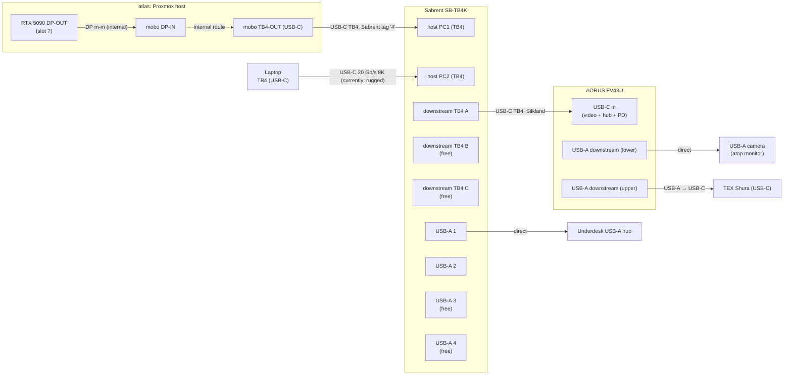

# Desk wiring

Working notes for the home desk setup. Goal: hang every peripheral off
a Thunderbolt KVM so one button-press swaps the whole desk between
**atlas** (see top-level <../README.md>) and a hot-plug laptop.

Living doc: inventory, target topology, cable plan, mounting TODOs,
cable routing, open questions. Chronological experiments and
hypothesis-update history live in <debug/build_log.md>.

**North star** — **achieved 2026-07-01**: one-button switching
between atlas (desktop) and whatever laptop is docked, both plugged
into the SB-TB4K with a single USB-C cable each; everything else
(monitor, keyboard, camera, underdesk hub) downstream of the KVM.
Plan A in "Target topology" describes the wiring.

## Desired state

Detailed spec the desk needs to satisfy — the "one-switch KVM" as
intended:

- **Two hosts on the SB-TB4K.**
  - `atlas` — permanent, occupies one host port.
  - **Laptop slot** — variable. `rugged` is currently sitting in it,
    but the slot is designed as a rotating dock point for whatever
    laptop is at the desk at a given time.
- **One KVM button press switches all shared peripherals** between
  the two hosts, atomically:
  - AORUS FV43U monitor (video + audio).
  - The FV43U's own built-in USB hub — reaches the active host back
    through the monitor USB-C uplink → KVM downstream.
  - USB-A camera on the FV43U's lower downstream USB-A port (rides
    the monitor hub).
  - TEX Shura keyboard — rides the monitor hub too (upper USB-A
    downstream), so a single upstream cable brings the keyboard
    with the KVM switch instead of an additional KVM USB-A run.
  - Underdesk USB-A hub on a KVM USB-A port.
- ~~**Both host ports receive PD continuously**~~ **Not achievable
  with the SB-TB4K.** Per Sabrent's own forum, delivering PD to
  both host ports simultaneously would violate Thunderbolt 4
  certification, so the switch only charges the currently-active
  host by design. See the gap discussion in the North-Star
  experiment. Workaround: if the docked laptop needs to charge
  while atlas is the active host, plug its own AC adapter alongside
  the KVM cable.

### Future desiderata (not blocking Plan A)

- **Play games with the RTX 5090s.** Out-of-scope for the desk
  wiring itself but a real constraint on the atlas software config
  (VFIO passthrough, wyrm2 vs. host GPU allocation, whether one card
  stays for the host, etc.). Whatever solution is picked has to
  coexist with the current one-switch KVM setup — the display path
  is atlas TB4-OUT → KVM → monitor, so games either run on the
  atlas side of the KVM or the desk needs a different display
  routing.

## Devices on hand

| Device              | Notes                                                                                                                                                                                                                                                            |
| ------------------- | ---------------------------------------------------------------------------------------------------------------------------------------------------------------------------------------------------------------------------------------------------------------- |
| atlas               | Proxmox host, 2× RTX 5090 (per `plans/atlas_proxmox_to_nixos.md`). One GPU DP-OUT → mobo DP-IN feeds TB4-OUT (internal).                                                                                                                                         |
| AORUS FV43U         | 43" 4K@144 monitor. Inputs: 1× DP 1.4, 2× HDMI 2.1 (24 Gb/s), 1× USB-C (DP-Alt + USB data + PD). USB hub: 1× USB-B uplink, 2× USB-A downstream. 2× 3.5 mm jacks (headphone, line-out). Internal "dual-KVM" toggles which uplink (USB-B vs. USB-C) feeds the hub. |
| Sabrent SB-TB4K     | TB4 KVM. 2× TB4 host (PC1, PC2) + 3× TB4 downstream (40 Gb/s, 60 W PD per port) + 4× USB-A 3.2 Gen 2 (10 Gb/s, 5 V / 2.4 A). **No standalone DP output** — video goes over TB4 downstream USB-C.                                                                 |
| TEX Shura           | 60% mech with trackpoint, USB-C jack at the back. Detachable cable ships in box (USB-C → USB-A, 1.5 m). BT-LE module on board (BT4+). Planned: wired USB.                                                                                                        |
| USB-A camera        | Model TBD. Sits atop the FV43U, plugged into the monitor's **lower** USB-A downstream port. USB-A plug on the camera end.                                                                                                                                        |
| Underdesk USB-A hub | Mounted left-underside of the desk. USB-A uplink plug — plugs directly into a KVM USB-A port.                                                                                                                                                                    |
| USB WiFi adapter    | Model TBD. Spare; could go into atlas as a temporary wireless NIC.                                                                                                                                                                                               |

## Cables on hand

Cables physically present at home. Anything in the storage unit is
listed in the next section so we don't accidentally plan around it.

| Qty | Cable                               | Vendor   | Current state                                                                                                 |
| --- | ----------------------------------- | -------- | ------------------------------------------------------------------------------------------------------------- |
| 1   | DP male-male                        | —        | In use: atlas GPU DP-OUT → mobo DP-IN.                                                                        |
| 1   | DP male-male, 8K                    | Ivanky   | Spare.                                                                                                        |
| 1   | USB A → USB B                       | —        | Spare.                                                                                                        |
| 1   | USB-C, 40 Gb/s, 200 W (TB-class)    | Silkland | In use: KVM downstream TB4 → FV43U USB-C (video + hub + PD).                                                  |
| 1   | USB-C, USB 3.2 Gen 2×2, 20 Gb/s, 8K | —        | In use: laptop-side host link (rugged ↔ SB-TB4K PC2). Visibly worn on one connector but working in this role. |
| 1   | Shielded Ethernet, ~1 ft            | —        | Spare. Known-good but almost certainly too short to reach atlas from the wall jack.                           |
| 1   | USB-A extension (female ↔ male)     | —        | Previously ran to the monitor; repositionable.                                                                |
| 1   | USB-A → USB-C                       | —        | Tagged green, label "keyboard". Spare.                                                                        |
| 1   | USB-A → USB-C                       | —        | Untagged. Currently in use with the TEX Shura.                                                                |
| 1   | USB-A → USB-C                       | —        | Spare.                                                                                                        |
| 1   | DP ↔ USB-C                          | Ivanky   | Spare. Passive DP-Alt adapter cable.                                                                          |
| 1   | Thunderbolt USB-C, ~2 ft            | Sabrent? | Spare. Tagged "4". Likely a TB4 cable bundled with the SB-TB4K. Verify the marking.                           |

## In storage (not available now)

- Colored cable-marker paper rings (see "Cable marking" below).

## Target topology

Plan A (USB-C only) is what's currently wired and drawn below — the
monitor link is a single USB-C cable carrying DP-Alt video + USB hub
data + PD, which lets the camera ride the FV43U's own USB-A hub back
up to the KVM-switched bus. Plan B (DP video + a separate USB A→B
hub uplink) is a fallback, described after; the cables for it are on
hand either way.

Free after Plan A wiring: SB-TB4K downstream TB4 ports B and C,
SB-TB4K USB-A 2 / 3 / 4, FV43U DP 1.4, FV43U 2× HDMI 2.1, FV43U
USB-B uplink.

### Port-assignment caveats

- **atlas RTX 5090 DP-OUT slot** — atlas has 2× RTX 5090. Which card
  and which DP port feeds the internal DP m-m to the mobo isn't
  recorded yet.
- **SB-TB4K downstream port choice (A vs. B vs. C)** — they're
  symmetric; any one can carry the monitor video. Pick by cable reach.
- **Which SB-TB4K USB-A number** each accessory ends up on is drawn
  arbitrarily; label the physical port once cables are pulled.

## Cable plan vs. inventory (Plan A)

Each row is one physical link.

| Link                     | Source port                                | Destination port                  | Cable          | Have?                                                                                                                                                                            |
| ------------------------ | ------------------------------------------ | --------------------------------- | -------------- | -------------------------------------------------------------------------------------------------------------------------------------------------------------------------------- |
| atlas internal video     | atlas RTX 5090 DP-OUT (slot ?)             | atlas mobo DP-IN                  | DP m-m         | Yes (already wired).                                                                                                                                                             |
| atlas → KVM              | atlas mobo TB4-OUT (**middle** port)       | SB-TB4K host PC1                  | USB-C TB-class | Cabled — Sabrent-looking 2 ft, tag "4". Atlas's top TB port carries BIOS video but not kernel DP-Alt; middle port works after kernel takeover, so the cable belongs there.       |
| Laptop → KVM             | Laptop TB4 (USB-C) — right-drawer position | SB-TB4K host PC2                  | USB-C          | In use — 20 Gb/s USB 3.2 Gen 2×2 cable, currently plugged into rugged as laptop stand-in. Not TB4, but the SB-TB4K accepts it and switches cleanly.                              |
| KVM → monitor (combined) | SB-TB4K downstream TB4 (USB-C)             | FV43U USB-C in (video + hub + PD) | USB-C TB-class | In use — Silkland 40 Gb/s 200 W. Replaces the visibly damaged 20 Gb/s cable that was flaky under strain.                                                                         |
| Monitor hub → keyboard   | FV43U USB-A downstream (upper)             | TEX Shura USB-C                   | USB-A → USB-C  | In use — the keyboard is on the monitor hub, not the KVM directly. Cable runs monitor → desk keyboard slot → keyboard. Still switches with the KVM via the monitor USB-C uplink. |
| KVM → underdesk hub      | SB-TB4K USB-A                              | Hub uplink (USB-A plug)           | none (direct)  | Yes — hub plugs in. USB-A F↔M extension available if reach is short.                                                                                                             |
| Monitor hub → camera     | FV43U USB-A downstream (lower)             | Camera (USB-A plug)               | none (direct)  | Yes — camera plugs in.                                                                                                                                                           |

All links buildable with cables on hand. Remaining cable-side
questions: the tag-4 cable's TB4 marking (atlas host link) and the
underdesk USB-A reach.

### Plan B — fallback if Plan A's USB-C link won't hold

If the 20 Gb/s USB-C cable can't be made reliable (see
<debug/build_log.md>), swap the "KVM → monitor (combined)" row for
two links:

| Link                  | Source port                    | Destination port   | Cable      | Have?                        |
| --------------------- | ------------------------------ | ------------------ | ---------- | ---------------------------- |
| KVM → monitor (video) | SB-TB4K downstream TB4 (USB-C) | FV43U DP 1.4 in    | USB-C ↔ DP | Yes — Ivanky DP/USB-C cable. |
| KVM → monitor (hub)   | SB-TB4K USB-A                  | FV43U USB-B uplink | USB A → B  | Yes.                         |

Camera stays on the FV43U USB-A downstream either way. Consequences of
switching: burns one extra KVM USB-A port (the USB-B uplink); the
20 Gb/s USB-C cable and the FV43U USB-C input become spare.

## Cable marking

Deferred until the marker paper comes out of storage. Sketch of options
to decide between then:

- Colored bands at each end, color = port group (host TB / video /
  USB-downstream).
- Numbered tags `01..NN` with the key recorded here.

## Cable routing

Physical paths cables take through / around the desk. Grows as more
cables are pulled.

- **KVM → monitor (Silkland USB-C)** — routed through the
  **back-right grommet hole** on the desk. The monitor end sits at
  the FV43U's USB-C input; the KVM end drops under the desk.
- **Monitor → keyboard (USB-A → USB-C)** — runs from the FV43U's
  **upper** USB-A downstream port, along the desk to the keyboard
  slot, into the TEX Shura. Stays on top of the desk end-to-end.
- **KVM → laptop slot (20 Gb/s USB-C)** — cable runs from the
  SB-TB4K under the desk, up through the **right-drawer grommet
  hole**, and into whichever laptop is docked (currently rugged).
  Cable is deliberately oriented with the visibly-worn end at the
  laptop side (visible + easy to grab) and the clean end at the KVM
  (buried under the desk), so if it acts up we can inspect / replug
  the suspect connector fast.

## Open questions

- atlas: which RTX 5090 and which DP port feeds the internal DP m-m
  into the mobo's DP-IN.
- Camera model.
- Whether the spare 20 Gb/s 8K USB-C cable will negotiate DP-Alt HBR3
  - USB 3.2 cleanly into the FV43U's USB-C input reliably. Plan A
    bench test worked but was flaky under cable strain — see
    <debug/build_log.md>.
- Whether the "tag 4" ~2 ft Sabrent-looking USB-C cable is actually
  TB4-marked (now the atlas host link — cabled, marking not yet
  visually verified).
- Which SB-TB4K host port (PC1 vs. PC2) each host cable is landed on.
  Atlas-side TB port is now known: **middle** on the mobo silkscreen
  (top port carries BIOS video but drops after kernel init).
- Physical placement of the KVM (desktop vs. underdesk mount) —
  affects all USB-A cable lengths.
- Per-link cable-length constraints (desk-edge to under-desk, monitor
  back to KVM, KVM to camera position, etc.). Measure as we go.

## Networking (separate from KVM plan)

atlas's network link isn't part of the KVM topology, but the inventory
is being gathered together. Current options if the in-use Ethernet path
doesn't work:

- Use the on-hand shielded Ethernet cable if reach permits (it's short).
- Drop the USB WiFi adapter into atlas as a stopgap wireless NIC.

## Placement & mounting

Current physical state and mounting TODOs.

- **SB-TB4K KVM box.** Sitting on top of the atlas tower for now — a
  temporary perch, not a good long-term spot.
  - **TODO:** mount it to the desk (or the under-desk grid).
    Candidate: magnetic tape on a ferromagnetic surface, otherwise
    Velcro / 3M-Command style adhesive.
- **KVM toggle switch (wired remote button).** Routed to sit next to
  the keyboard so it's within thumb reach.
  - **TODO:** mount it. The toggle body is ferromagnetic, so magnetic
    tape is the leading candidate.
- **SB-TB4K PSU.** Plugged into the power strip mounted on the
  back-underside of the desk.
  - **TODO:** mount the PSU brick onto the Underware 3D-printed grid
    under the desk (so it isn't just hanging off the power-strip
    cable).

## Out of scope (for now)

- Wall power, surge protection, under-desk power routing — possible
  later sweep.
- Audio routing (monitor speakers vs. headphones vs. KVM audio jack).
