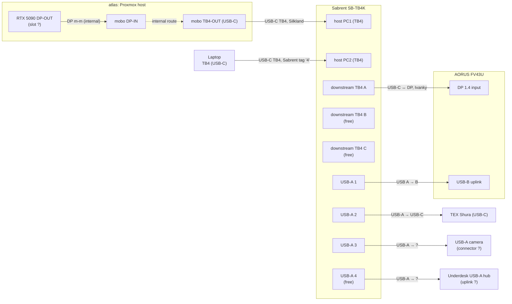

# Desk wiring

Working notes for the home desk setup. Goal: hang every peripheral off
a Thunderbolt KVM so one button-press swaps the whole desk between
**atlas** (see top-level <../README.md>) and a hot-plug laptop.

Pre-build. Inventory and target topology only — no cables pulled yet.

## Devices on hand

| Device              | Notes                                                                |
| ------------------- | -------------------------------------------------------------------- |
| atlas               | Proxmox host, 2× RTX 5090 (per `plans/atlas_proxmox_to_nixos.md`). One GPU DP-OUT → mobo DP-IN feeds TB4-OUT (internal). |
| AORUS FV43U         | 43" 4K@144 monitor. Inputs: 1× DP 1.4, 2× HDMI 2.1 (24 Gb/s), 1× USB-C (DP-Alt + USB data + PD). USB hub: 1× USB-B uplink, 2× USB-A downstream. 2× 3.5 mm jacks (headphone, line-out). Internal "dual-KVM" toggles which uplink (USB-B vs. USB-C) feeds the hub. |
| Sabrent SB-TB4K     | TB4 KVM. 2× TB4 host (PC1, PC2) + 3× TB4 downstream (40 Gb/s, 60 W PD per port) + 4× USB-A 3.2 Gen 2 (10 Gb/s, 5 V / 2.4 A). **No standalone DP output** — video goes over TB4 downstream USB-C. |
| TEX Shura           | 60% mech with trackpoint, USB-C jack at the back. Detachable cable ships in box (USB-C → USB-A, 1.5 m). BT-LE module on board (BT4+). Planned: wired USB. |
| USB-A camera        | Model TBD.                                                           |
| Underdesk USB-A hub | Mounted left-underside of the desk.                                  |
| USB WiFi adapter    | Model TBD. Spare; could go into atlas as a temporary wireless NIC.   |

## Cables on hand

Cables physically present at home. Anything in the storage unit is
listed in the next section so we don't accidentally plan around it.

| Qty | Cable                                  | Vendor   | Current state                                |
| --- | -------------------------------------- | -------- | -------------------------------------------- |
| 1   | DP male-male                           | —        | In use: atlas GPU DP-OUT → mobo DP-IN.       |
| 1   | DP male-male, 8K                       | Ivanky   | Spare.                                       |
| 1   | USB A → USB B                          | —        | Spare.                                       |
| 1   | USB-C, 40 Gb/s, 240 W (TB-class)       | Silkland | Spare. Active, USB4/TB4-grade.               |
| 1   | USB-C, USB 3.2 Gen 2×2, 20 Gb/s, 8K    | —        | Spare. Not TB; OK for DP-Alt video + USB data only. |
| 1   | Shielded Ethernet, ~1 ft               | —        | Spare. Known-good but almost certainly too short to reach atlas from the wall jack. |
| 1   | USB-A extension (female ↔ male)        | —        | Previously ran to the monitor; repositionable. |
| 1   | USB-A → USB-C                          | —        | Tagged green, label "keyboard". Spare. |
| 1   | USB-A → USB-C                          | —        | Untagged. Currently in use with the TEX Shura. |
| 1   | USB-A → USB-C                          | —        | Spare. |
| 1   | DP ↔ USB-C                             | Ivanky   | Spare. Passive DP-Alt adapter cable. |
| 1   | Thunderbolt USB-C, ~2 ft               | Sabrent? | Spare. Tagged "4". Likely a TB4 cable bundled with the SB-TB4K. Verify the marking. |

## In storage (not available now)

- Colored cable-marker paper rings (see "Cable marking" below).

## Target topology

Two viable shapes given the on-hand cables. **Plan A (USB-C only)**
collapses the monitor link to a single USB-C cable (video + USB hub +
PD); **Plan B (DP video + separate USB-B uplink)** is the conservative
two-cable shape. Both are buildable from cables already at home;
choice depends on whether Plan A's combined DP-Alt + USB stream proves
stable in practice — see Experiments.

(Mermaid edges between subgraph nodes can be finicky; ports `B`/`C` of
the SB-TB4K and the unused USB-A 4 are drawn explicitly so the diagram
also shows expansion headroom.)

### Port-assignment caveats

- **atlas RTX 5090 DP-OUT slot** — atlas has 2× RTX 5090. Which card
  and which DP port feeds the internal DP m-m to the mobo isn't
  recorded yet.
- **FV43U DP 1.4 input** — only one DP port on the monitor, so no
  ambiguity. HDMI 2.1 inputs are unused.
- **SB-TB4K downstream port choice (A vs. B vs. C)** — they're
  symmetric; any one can carry the monitor video. Pick by cable reach.
- **`USB-A 4 unused`** in the diagram — could become a future link
  (storage, dock, etc.).

## Cable plan vs. inventory (plan B)

Each row is one physical link.

| Link                  | Source port                    | Destination port           | Cable                  | Have?                                                  |
| --------------------- | ------------------------------ | -------------------------- | ---------------------- | ------------------------------------------------------ |
| atlas internal video  | atlas RTX 5090 DP-OUT (slot ?) | atlas mobo DP-IN           | DP m-m                 | Yes (already wired).                                   |
| atlas → KVM           | atlas mobo TB4-OUT (USB-C)     | SB-TB4K host PC1           | USB-C TB-class         | Yes — Silkland 40 Gb/s 240 W.                          |
| Laptop → KVM          | Laptop TB4 (USB-C)             | SB-TB4K host PC2           | USB-C TB-class         | Yes — Sabrent-looking 2 ft, tag "4" (verify TB4 mark). |
| KVM → monitor (video) | SB-TB4K downstream TB4 (USB-C) | FV43U DP 1.4 in            | USB-C ↔ DP             | Yes — Ivanky DP/USB-C cable.                           |
| KVM → monitor (hub)   | SB-TB4K USB-A                  | FV43U USB-B uplink         | USB A → B              | Yes.                                                   |
| KVM → keyboard        | SB-TB4K USB-A                  | TEX Shura USB-C            | USB-A → USB-C          | Yes — 3 on hand (one tagged "keyboard").               |
| KVM → camera          | SB-TB4K USB-A                  | Camera (connector ?)       | USB-A → ?              | **TBD** (camera connector).                            |
| KVM → underdesk hub   | SB-TB4K USB-A                  | Underdesk hub uplink (?)   | USB-A → ?              | **TBD** (hub uplink connector).                        |

All host-side and core peripheral cables are on hand; only accessory
connectors remain unknown.

### Plan A — USB-C only to the monitor (simpler if it works)

Use the SB-TB4K's downstream TB4 port to feed the FV43U's **USB-C**
input instead of DP. That one cable carries DP-Alt video + USB data
for the monitor's hub + PD — so the separate USB A→B uplink and the
USB-C ↔ DP adapter cable both disappear.

| Link                  | Source port                    | Destination port           | Cable                  | Have?                                |
| --------------------- | ------------------------------ | -------------------------- | ---------------------- | ------------------------------------ |
| KVM → monitor (combined) | SB-TB4K downstream TB4 (USB-C) | FV43U USB-C in           | USB-C, DP-Alt + USB3.2 | Maybe — the spare 20 Gb/s 8K USB-C cable should pass DP-Alt HBR3 + USB-3.2, but verify on first plug-in. Falls back to Plan B if not. |

Spares freed if Plan A works: Ivanky 8K DP-DP, Ivanky DP↔USB-C, USB A → B.

The 20 Gb/s USB 3.2 USB-C cable doesn't fit any link in this plan
(can't host a TB switch, not needed for monitor video since we have a
DP-DP). Keep as a spare — useful for a direct laptop-to-monitor
fallback if the KVM is ever bypassed.

With the Sabrent-looking 2 ft TB cable added, both host links are
covered (Silkland for the longer atlas run, short Sabrent for laptop).
Remaining unknowns are accessory-side cables for the camera and
underdesk hub, which depend on connectors we haven't confirmed yet.

## Cable marking

Deferred until the marker paper comes out of storage. Sketch of options
to decide between then:

- Colored bands at each end, color = port group (host TB / video /
  USB-downstream).
- Numbered tags `01..NN` with the key recorded here.

## Experiments

### 2026-06-30 — Plan A bench test with rugged as host

**Setup.** First end-to-end test of the Plan A monitor link, using
rugged (Dell Rugged 12 tablet, per `nix/nixos/hosts/rugged/`) as a
stand-in for the laptop slot. Wiring:

- rugged TB4 (USB-C) → short TB cable → SB-TB4K host port (PC1 or PC2;
  not recorded which).
- SB-TB4K downstream TB4 → 20 Gb/s 8K USB-C cable → FV43U USB-C input.
- TEX Shura plugged directly into a rugged USB-A port (KVM bypass for
  this test).
- Pixel 6 plugged into one of the FV43U USB-A downstream ports via a
  USB-A → USB-C cable, to exercise the monitor's hub through the same
  USB-C uplink.

**Observations.**

- Video to the FV43U: works.
- Audio out via the monitor: works. Adjusting the monitor's volume
  control changes the output volume — i.e. the host is targeting the
  monitor as the sink.
- FV43U USB hub (over USB-C uplink): works — Pixel 6 is recognized.
- **Stability: flaky.** Link dropped a couple of times during the
  test. Working hypothesis: the 20 Gb/s 8K USB-C cable between the
  SB-TB4K and the monitor is currently bent, and the bend is enough to
  marginalize the connector or shielding.

**Conclusion.** Plan A's combined DP-Alt + USB-3.2 stream is
electrically feasible through this stack of cables — but not yet
proven reliable. Next moves:

- Reroute / straighten the 20 Gb/s cable and re-test before changing
  anything else.
- If still flaky, swap to Plan B (Ivanky USB-C ↔ DP for video, USB
  A→B for the hub uplink) and re-bench.
- Independently: get the TEX Shura on a KVM USB-A port so we're
  testing the real target topology.

### 2026-06-30 — TEX Shura on KVM USB-A

**Setup.** Moved the TEX Shura off rugged's direct USB-A and onto a
SB-TB4K downstream USB-A port (specific port number not recorded).
USB-A → USB-C cable, same Plan A monitor link as the previous test.

**Observation.** Keyboard works through the KVM.

**Conclusion.** "KVM USB-A → keyboard" row of the cable plan is
confirmed for the rugged-host case. With the keyboard now off the
host directly, all of (video, audio, monitor hub, keyboard) are on
the KVM-shared bus — the only target-topology link still bypassed is
the camera (model TBD) and the underdesk hub (uplink TBD).

## Open questions

- atlas: which RTX 5090 and which DP port feeds the internal DP m-m
  into the mobo's DP-IN.
- Camera model + connector (TBD pending model).
- Underdesk USB-A hub uplink type (USB-A male plug, captive cable, or
  USB-B socket).
- Whether the spare 20 Gb/s 8K USB-C cable will negotiate DP-Alt HBR3
  + USB 3.2 cleanly into the FV43U's USB-C input (Plan A viability).
- Physical placement of the KVM (desktop vs. underdesk mount) —
  affects all USB-A cable lengths.
- Per-link cable-length constraints (desk-edge to under-desk, monitor
  back to KVM, KVM to camera position, etc.). Measure as we go.

## Networking (separate from KVM plan)

atlas's network link isn't part of the KVM topology, but the inventory
is being gathered together. Current options if the in-use Ethernet path
doesn't work:

- Use the on-hand shielded Ethernet cable if reach permits (it's short).
- Drop the USB WiFi adapter into atlas as a stopgap wireless NIC.

## Out of scope (for now)

- Wall power, surge protection, under-desk power routing — possible
  later sweep.
- Audio routing (monitor speakers vs. headphones vs. KVM audio jack).
