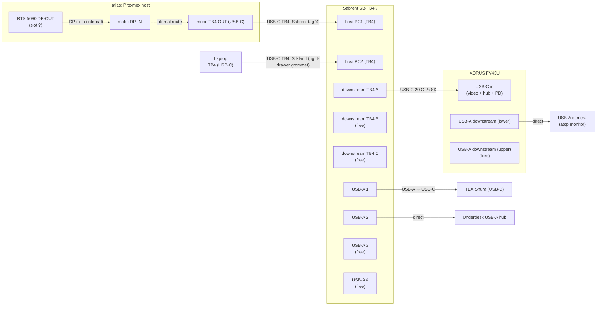

# Desk wiring

Working notes for the home desk setup. Goal: hang every peripheral off
a Thunderbolt KVM so one button-press swaps the whole desk between
**atlas** (see top-level <../README.md>) and a hot-plug laptop.

Pre-build. Inventory and target topology only — no cables pulled yet.

## Devices on hand

| Device              | Notes                                                                |
| ------------------- | -------------------------------------------------------------------- |
| atlas               | Proxmox host, 2× RTX 5090 (per `plans/atlas_proxmox_to_nixos.md`). One GPU DP-OUT → mobo DP-IN feeds TB4-OUT (internal). |
| AORUS FV43U         | 43" 4K@144 monitor. Inputs: 1× DP 1.4, 2× HDMI 2.1 (24 Gb/s), 1× USB-C (DP-Alt + USB data + PD). USB hub: 1× USB-B uplink, 2× USB-A downstream. 2× 3.5 mm jacks (headphone, line-out). Internal "dual-KVM" toggles which uplink (USB-B vs. USB-C) feeds the hub. |
| Sabrent SB-TB4K     | TB4 KVM. 2× TB4 host (PC1, PC2) + 3× TB4 downstream (40 Gb/s, 60 W PD per port) + 4× USB-A 3.2 Gen 2 (10 Gb/s, 5 V / 2.4 A). **No standalone DP output** — video goes over TB4 downstream USB-C. |
| TEX Shura           | 60% mech with trackpoint, USB-C jack at the back. Detachable cable ships in box (USB-C → USB-A, 1.5 m). BT-LE module on board (BT4+). Planned: wired USB. |
| USB-A camera        | Model TBD. Sits atop the FV43U, plugged into the monitor's **lower** USB-A downstream port. USB-A plug on the camera end. |
| Underdesk USB-A hub | Mounted left-underside of the desk. USB-A uplink plug — plugs directly into a KVM USB-A port. |
| USB WiFi adapter    | Model TBD. Spare; could go into atlas as a temporary wireless NIC.   |

## Cables on hand

Cables physically present at home. Anything in the storage unit is
listed in the next section so we don't accidentally plan around it.

| Qty | Cable                                  | Vendor   | Current state                                |
| --- | -------------------------------------- | -------- | -------------------------------------------- |
| 1   | DP male-male                           | —        | In use: atlas GPU DP-OUT → mobo DP-IN.       |
| 1   | DP male-male, 8K                       | Ivanky   | Spare.                                       |
| 1   | USB A → USB B                          | —        | Spare.                                       |
| 1   | USB-C, 40 Gb/s, 200 W (TB-class)       | Silkland | In use: laptop-side host link (routed through right-drawer grommet). |
| 1   | USB-C, USB 3.2 Gen 2×2, 20 Gb/s, 8K    | —        | Spare. Not TB; OK for DP-Alt video + USB data only. |
| 1   | Shielded Ethernet, ~1 ft               | —        | Spare. Known-good but almost certainly too short to reach atlas from the wall jack. |
| 1   | USB-A extension (female ↔ male)        | —        | Previously ran to the monitor; repositionable. |
| 1   | USB-A → USB-C                          | —        | Tagged green, label "keyboard". Spare. |
| 1   | USB-A → USB-C                          | —        | Untagged. Currently in use with the TEX Shura. |
| 1   | USB-A → USB-C                          | —        | Spare. |
| 1   | DP ↔ USB-C                             | Ivanky   | Spare. Passive DP-Alt adapter cable. |
| 1   | Thunderbolt USB-C, ~2 ft               | Sabrent? | Spare. Tagged "4". Likely a TB4 cable bundled with the SB-TB4K. Verify the marking. |

## In storage (not available now)

- Colored cable-marker paper rings (see "Cable marking" below).

## Target topology

Plan A (USB-C only) is what's currently wired and drawn below — the
monitor link is a single USB-C cable carrying DP-Alt video + USB hub
data + PD, which lets the camera ride the FV43U's own USB-A hub back
up to the KVM-switched bus. Plan B (DP video + a separate USB A→B
hub uplink) is a fallback, described after; the cables for it are on
hand either way.

Free after Plan A wiring: SB-TB4K downstream TB4 ports B and C,
SB-TB4K USB-A 3 and 4, FV43U upper USB-A, FV43U DP 1.4, FV43U 2× HDMI
2.1, FV43U USB-B uplink.

### Port-assignment caveats

- **atlas RTX 5090 DP-OUT slot** — atlas has 2× RTX 5090. Which card
  and which DP port feeds the internal DP m-m to the mobo isn't
  recorded yet.
- **SB-TB4K downstream port choice (A vs. B vs. C)** — they're
  symmetric; any one can carry the monitor video. Pick by cable reach.
- **Which SB-TB4K USB-A number** each accessory ends up on is drawn
  arbitrarily; label the physical port once cables are pulled.

## Cable plan vs. inventory (Plan A)

Each row is one physical link.

| Link                  | Source port                       | Destination port                     | Cable                  | Have?                                                  |
| --------------------- | --------------------------------- | ------------------------------------ | ---------------------- | ------------------------------------------------------ |
| atlas internal video  | atlas RTX 5090 DP-OUT (slot ?)    | atlas mobo DP-IN                     | DP m-m                 | Yes (already wired).                                   |
| atlas → KVM           | atlas mobo TB4-OUT (**middle** port) | SB-TB4K host PC1                  | USB-C TB-class         | Cabled — Sabrent-looking 2 ft, tag "4". Atlas's top TB port carries BIOS video but not kernel DP-Alt; middle port works after kernel takeover, so the cable belongs there. |
| Laptop → KVM          | Laptop TB4 (USB-C) — right-drawer position | SB-TB4K host PC2            | USB-C TB-class         | Cabled end-to-end — Silkland 40 Gb/s 200 W, routed through the right-drawer grommet; laptop end currently occupied by rugged as a stand-in. |
| KVM → monitor (combined) | SB-TB4K downstream TB4 (USB-C) | FV43U USB-C in (video + hub + PD)    | USB-C, DP-Alt + USB3.2 | Yes — spare 20 Gb/s 8K USB-C. Bench-tested; flaky under cable strain, see Experiments. |
| KVM → keyboard        | SB-TB4K USB-A                     | TEX Shura USB-C                      | USB-A → USB-C          | Yes — 3 on hand (one tagged "keyboard").               |
| KVM → underdesk hub   | SB-TB4K USB-A                     | Hub uplink (USB-A plug)              | none (direct)          | Yes — hub plugs in. USB-A F↔M extension available if reach is short. |
| Monitor hub → camera  | FV43U USB-A downstream (lower)    | Camera (USB-A plug)                  | none (direct)          | Yes — camera plugs in.                                 |

All links buildable with cables on hand. Remaining cable-side
questions: the tag-4 cable's TB4 marking (atlas host link) and the
underdesk USB-A reach.

### Plan B — fallback if Plan A's USB-C link won't hold

If the 20 Gb/s USB-C cable can't be made reliable (see Experiments),
swap the "KVM → monitor (combined)" row for two links:

| Link                  | Source port                    | Destination port           | Cable                  | Have?                                |
| --------------------- | ------------------------------ | -------------------------- | ---------------------- | ------------------------------------ |
| KVM → monitor (video) | SB-TB4K downstream TB4 (USB-C) | FV43U DP 1.4 in            | USB-C ↔ DP             | Yes — Ivanky DP/USB-C cable.         |
| KVM → monitor (hub)   | SB-TB4K USB-A                  | FV43U USB-B uplink         | USB A → B              | Yes.                                 |

Camera stays on the FV43U USB-A downstream either way. Consequences of
switching: burns one extra KVM USB-A port (the USB-B uplink); the
20 Gb/s USB-C cable and the FV43U USB-C input become spare.

## Cable marking

Deferred until the marker paper comes out of storage. Sketch of options
to decide between then:

- Colored bands at each end, color = port group (host TB / video /
  USB-downstream).
- Numbered tags `01..NN` with the key recorded here.

## Cable routing

Physical paths cables take through / around the desk. Grows as more
cables are pulled.

- **KVM → monitor (20 Gb/s 8K USB-C)** — routed through the
  **back-right grommet hole**.
- **Laptop → KVM (Silkland USB-C)** — routed through the grommet hole
  on the back of the **right drawer**, where the laptop sits. The
  KVM-side end is plugged into a SB-TB4K host (PC1/PC2) port.

## Experiments

### 2026-06-30 — Plan A bench test with rugged as host

**Setup.** First end-to-end test of the Plan A monitor link, using
rugged (Dell Rugged 12 tablet, per `nix/nixos/hosts/rugged/`) as a
stand-in for the laptop slot. Wiring:

- rugged TB4 (USB-C) → short TB cable → SB-TB4K host port (PC1 or PC2;
  not recorded which).
- SB-TB4K downstream TB4 → 20 Gb/s 8K USB-C cable → FV43U USB-C input.
- TEX Shura plugged directly into a rugged USB-A port (KVM bypass for
  this test).
- Pixel 6 plugged into one of the FV43U USB-A downstream ports via a
  USB-A → USB-C cable, to exercise the monitor's hub through the same
  USB-C uplink.

**Observations.**

- Video to the FV43U: works.
- Audio out via the monitor: works. Adjusting the monitor's volume
  control changes the output volume — i.e. the host is targeting the
  monitor as the sink.
- FV43U USB hub (over USB-C uplink): works — Pixel 6 is recognized.
- **Stability: flaky.** Link dropped a couple of times during the
  test. Working hypothesis: the 20 Gb/s 8K USB-C cable between the
  SB-TB4K and the monitor is currently bent, and the bend is enough to
  marginalize the connector or shielding.

**Conclusion.** Plan A's combined DP-Alt + USB-3.2 stream is
electrically feasible through this stack of cables — but not yet
proven reliable. Next moves:

- Reroute / straighten the 20 Gb/s cable and re-test before changing
  anything else.
- If still flaky, swap to Plan B (Ivanky USB-C ↔ DP for video, USB
  A→B for the hub uplink) and re-bench.
- Independently: get the TEX Shura on a KVM USB-A port so we're
  testing the real target topology.

### 2026-06-30 — TEX Shura on KVM USB-A

**Setup.** Moved the TEX Shura off rugged's direct USB-A and onto a
SB-TB4K downstream USB-A port (specific port number not recorded).
USB-A → USB-C cable, same Plan A monitor link as the previous test.

**Observation.** Keyboard works through the KVM.

**Conclusion.** "KVM USB-A → keyboard" row of the cable plan is
confirmed for the rugged-host case. With the keyboard now off the
host directly, all of (video, audio, monitor hub, keyboard) are on
the KVM-shared bus — the only target-topology link still bypassed is
the camera (model TBD) and the underdesk hub (uplink TBD).

### 2026-07-01 — rugged on the laptop-side slot; Plan A end-to-end

**Setup.** Rugged unplugged from its earlier direct-to-KVM short TB
cable and plugged into the **laptop end** of the Silkland cable
(right-drawer position, cable routed through the drawer grommet, KVM
end already landed on a SB-TB4K host port). All other Plan A links
per the target topology.

**Observations.**

- Rugged switched its video output to the FV43U.
- Audio out via the monitor still works.
- TEX Shura on a KVM USB-A port continues to work with rugged as the
  active host.
- Rugged is **charging over the TB link** — Power Delivery is passing
  through the KVM host port and the Silkland cable.

**Conclusion.** Validates the Silkland end-to-end (through the
grommet + into a KVM host port + into rugged) and validates the whole
KVM-shared-bus chain from the intended laptop position, not just from
the earlier short-cable test rig. Also validates PD upstream through
the KVM host port. Still to validate: the **atlas-side** switch —
toggle the KVM to atlas's host port and confirm atlas sees the FV43U
as its output.

### 2026-07-01 — atlas first boot on the KVM chain: BIOS/GRUB visible, then "USB-C no signal"

**Setup.** atlas powered on for the first time with Plan A wiring, KVM
toggled to the atlas-side host port. No network to atlas: USB WiFi
stick not installed yet, no ethernet reachable, current apartment's
WiFi SSID not configured on atlas.

**Observations.**

- BIOS splash: visible on the FV43U.
- GRUB menu: visible.
- A few lines of early kernel syslog scroll: visible.
- Then the monitor drops to "USB-C no signal" and stays there.

**Interpretation (working hypothesis).** BIOS / GRUB / early kernel
paint on one RTX 5090's firmware framebuffer, which does reach the
monitor via the mobo DP-IN → TB-OUT → KVM → 20 Gb/s USB-C → FV43U
USB-C. Once the Linux kernel finishes loading and `vfio-pci` binds
both RTX 5090s for wyrm2 passthrough, the framebuffer handoff drops
atlas's console output — that's the "no signal" moment. If wyrm2
autostarts and its guest driver outputs on the same physical DP port,
video should come back; in this test it didn't (within the time we
watched), so wyrm2 either isn't autostarting or is outputting to a
different DP.

**Conclusion.** The whole desk-side wiring — mobo TB-OUT → Sabrent
tag "4" → KVM PC port → 20 Gb/s USB-C → FV43U USB-C — is confirmed
end-to-end for atlas up through kernel boot. The remaining blocker is
atlas-side software: no display source for the Proxmox host after
`vfio-pci` binds the GPUs, and no way to diagnose because atlas has no
network yet.

**Additional test — KVM bypass.** Reconnected the FV43U's USB-C
directly into the same atlas TB port that had been feeding the KVM
(the **top** TB port on atlas). Result: monitor shows a **gray
screen** — link is up (EDID negotiated) but no useful content. Same
phenomenon as with the KVM in-line, so the KVM chain is out of the
diagnosis. User reports the same symptom on this hardware at the
previous apartment.

**Additional test — different atlas TB port.** Moved the direct-
connect FV43U USB-C from atlas's **top** TB port to atlas's **middle**
TB port. This works: **atlas is signed in with the desktop console
live on the FV43U** and the keyboard usable via the monitor's built-in
USB-A hub. So the earlier "gray screen" wasn't a `vfio-pci` /
framebuffer-handoff issue after all — it was port-selection. The
mobo's TB DP-Alt output is only wired to the middle TB port after the
kernel initialises, not the top one (BIOS paints all ports; kernel
paints only middle).

**Current physical state.** For local atlas setup:

- FV43U USB-C is on atlas's **middle** TB port directly (KVM still
  bypassed for atlas video).
- TEX Shura is on the FV43U's built-in USB-A hub, giving atlas the
  keyboard.

**Follow-ups.**

- Get network to atlas — cheapest path is the on-hand USB WiFi stick;
  fallback is a rescue USB to drop new WiFi creds into
  `wpa_supplicant.conf` or an SSH key into `authorized_keys`.
- Once SSH-able: check `virsh list --all` / `qm list` for wyrm2's
  autostart state; check which GPU (bus:slot.function) is passed
  through and which physical DP port that GPU's guest driver is
  outputting to.
- Since the KVM-in-line and direct-connect tests both produce the
  same gray-screen state, the KVM stays out of scope for this
  diagnosis. Debugging is atlas config, not desk wiring.
- Longer-term: understand *why* only the middle TB port carries kernel
  DP-Alt (BIOS setting? mobo silkscreen? IOMMU group of the top port
  is passed through?). Could also give atlas a display source that
  survives full VFIO passthrough (iGPU or spare GPU outside the
  passthrough set) so console debugging isn't dependent on TB port
  choice.

### 2026-07-01 — KVM back in the chain, atlas on middle port

**Setup.** Sabrent tag "4" cable moved to atlas's **middle** TB port
on one end, SB-TB4K host port on the other. Rugged still on the
Silkland at the drawer position. KVM downstream → 20 Gb/s USB-C →
FV43U USB-C unchanged.

**Observations.**

- Rugged → KVM → FV43U: works.
- Atlas → KVM → FV43U (middle port via Sabrent tag "4"): "no USB-C
  signal".

**Interpretation.** Direct-connect from atlas's middle port to the
FV43U via the 20 Gb/s USB-C cable worked. Add the KVM + swap the
inline cable to Sabrent tag "4" and it doesn't. Two likely
candidates:

- The Sabrent tag "4" cable can't carry DP-Alt at whatever rate atlas
  is trying to negotiate from the middle port (even though it did
  carry BIOS-era video from the *top* port earlier — top port likely
  negotiated a lower link rate). This is the leading suspicion; the
  tag "4" TB4 marking has never been visually verified.
- The KVM host port that atlas is on isn't tolerating atlas's TB
  handshake. Less likely given rugged negotiates fine on the other
  host port.

**Follow-ups.**

- **Swap-cable test:** put the 20 Gb/s USB-C cable on atlas → KVM
  (middle port) and put the Sabrent tag "4" cable on KVM downstream →
  FV43U. If atlas video reaches the FV43U through the KVM in that
  configuration, the tag "4" cable is at fault at the source-side
  link rate.
- Prioritize this after atlas is SSH-able; user is pausing this
  thread to get atlas on the network and merge the current doc as a
  base for further troubleshooting.

## Open questions

- atlas: which RTX 5090 and which DP port feeds the internal DP m-m
  into the mobo's DP-IN.
- Camera model.
- Whether the spare 20 Gb/s 8K USB-C cable will negotiate DP-Alt HBR3
  + USB 3.2 cleanly into the FV43U's USB-C input reliably. Plan A
  bench test worked but was flaky under cable strain — see
  Experiments.
- Whether the "tag 4" ~2 ft Sabrent-looking USB-C cable is actually
  TB4-marked (now the atlas host link — cabled, marking not yet
  visually verified).
- Which SB-TB4K host port (PC1 vs. PC2) each host cable is landed on.
  Atlas-side TB port is now known: **middle** on the mobo silkscreen
  (top port carries BIOS video but drops after kernel init).
- Physical placement of the KVM (desktop vs. underdesk mount) —
  affects all USB-A cable lengths.
- Per-link cable-length constraints (desk-edge to under-desk, monitor
  back to KVM, KVM to camera position, etc.). Measure as we go.

## Networking (separate from KVM plan)

atlas's network link isn't part of the KVM topology, but the inventory
is being gathered together. Current options if the in-use Ethernet path
doesn't work:

- Use the on-hand shielded Ethernet cable if reach permits (it's short).
- Drop the USB WiFi adapter into atlas as a stopgap wireless NIC.

## Placement & mounting

Current physical state and mounting TODOs.

- **SB-TB4K KVM box.** Sitting on top of the atlas tower for now — a
  temporary perch, not a good long-term spot.
  - **TODO:** mount it to the desk (or the under-desk grid).
    Candidate: magnetic tape on a ferromagnetic surface, otherwise
    Velcro / 3M-Command style adhesive.
- **KVM toggle switch (wired remote button).** Routed to sit next to
  the keyboard so it's within thumb reach.
  - **TODO:** mount it. The toggle body is ferromagnetic, so magnetic
    tape is the leading candidate.
- **SB-TB4K PSU.** Plugged into the power strip mounted on the
  back-underside of the desk.
  - **TODO:** mount the PSU brick onto the Underwear 3D-printed grid
    under the desk (so it isn't just hanging off the power-strip
    cable).

## Out of scope (for now)

- Wall power, surge protection, under-desk power routing — possible
  later sweep.
- Audio routing (monitor speakers vs. headphones vs. KVM audio jack).
