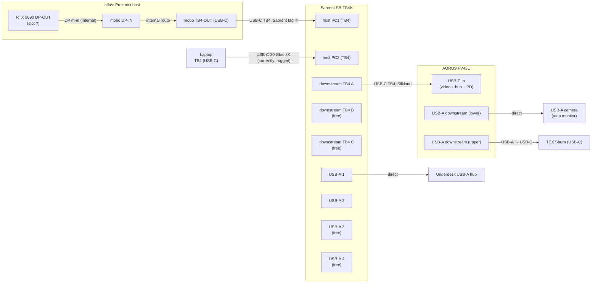

# Desk wiring

Working notes for the home desk setup. Goal: hang every peripheral off
a Thunderbolt KVM so one button-press swaps the whole desk between
**atlas** (see top-level <../README.md>) and a hot-plug laptop.

Living doc: inventory, target topology, cable plan, mounting TODOs,
and a running experiments log. The desk is mid-build — see
Experiments for the current wiring state.

**North star** — **achieved 2026-07-01**: one-button switching
between atlas (desktop) and whatever laptop is docked, both plugged
into the SB-TB4K with a single USB-C cable each; everything else
(monitor, keyboard, camera, underdesk hub) downstream of the KVM.
Plan A in "Target topology" describes the wiring.

## Desired state

Detailed spec the desk needs to satisfy — the "one-switch KVM" as
intended:

- **Two hosts on the SB-TB4K.**
  - `atlas` — permanent, occupies one host port.
  - **Laptop slot** — variable. `rugged` is currently sitting in it,
    but the slot is designed as a rotating dock point for whatever
    laptop is at the desk at a given time.
- **One KVM button press switches all shared peripherals** between
  the two hosts, atomically:
  - AORUS FV43U monitor (video + audio).
  - The FV43U's own built-in USB hub — reaches the active host back
    through the monitor USB-C uplink → KVM downstream.
  - USB-A camera on the FV43U's lower downstream USB-A port (rides
    the monitor hub).
  - TEX Shura keyboard — rides the monitor hub too (upper USB-A
    downstream), so a single upstream cable brings the keyboard
    with the KVM switch instead of an additional KVM USB-A run.
  - Underdesk USB-A hub on a KVM USB-A port.
- ~~**Both host ports receive PD continuously**~~ **Not achievable
  with the SB-TB4K.** Per Sabrent's own forum, delivering PD to
  both host ports simultaneously would violate Thunderbolt 4
  certification, so the switch only charges the currently-active
  host by design. See the gap discussion in the North-Star
  experiment. Workaround: if the docked laptop needs to charge
  while atlas is the active host, plug its own AC adapter alongside
  the KVM cable.

### Future desiderata (not blocking Plan A)

- **Play games with the RTX 5090s.** Out-of-scope for the desk
  wiring itself but a real constraint on the atlas software config
  (VFIO passthrough, wyrm2 vs. host GPU allocation, whether one card
  stays for the host, etc.). Whatever solution is picked has to
  coexist with the current one-switch KVM setup — the display path
  is atlas TB4-OUT → KVM → monitor, so games either run on the
  atlas side of the KVM or the desk needs a different display
  routing.

## Devices on hand

| Device              | Notes                                                                                                                                                                                                                                                            |
| ------------------- | ---------------------------------------------------------------------------------------------------------------------------------------------------------------------------------------------------------------------------------------------------------------- |
| atlas               | Proxmox host, 2× RTX 5090 (per `plans/atlas_proxmox_to_nixos.md`). One GPU DP-OUT → mobo DP-IN feeds TB4-OUT (internal).                                                                                                                                         |
| AORUS FV43U         | 43" 4K@144 monitor. Inputs: 1× DP 1.4, 2× HDMI 2.1 (24 Gb/s), 1× USB-C (DP-Alt + USB data + PD). USB hub: 1× USB-B uplink, 2× USB-A downstream. 2× 3.5 mm jacks (headphone, line-out). Internal "dual-KVM" toggles which uplink (USB-B vs. USB-C) feeds the hub. |
| Sabrent SB-TB4K     | TB4 KVM. 2× TB4 host (PC1, PC2) + 3× TB4 downstream (40 Gb/s, 60 W PD per port) + 4× USB-A 3.2 Gen 2 (10 Gb/s, 5 V / 2.4 A). **No standalone DP output** — video goes over TB4 downstream USB-C.                                                                 |
| TEX Shura           | 60% mech with trackpoint, USB-C jack at the back. Detachable cable ships in box (USB-C → USB-A, 1.5 m). BT-LE module on board (BT4+). Planned: wired USB.                                                                                                        |
| USB-A camera        | Model TBD. Sits atop the FV43U, plugged into the monitor's **lower** USB-A downstream port. USB-A plug on the camera end.                                                                                                                                        |
| Underdesk USB-A hub | Mounted left-underside of the desk. USB-A uplink plug — plugs directly into a KVM USB-A port.                                                                                                                                                                    |
| USB WiFi adapter    | Model TBD. Spare; could go into atlas as a temporary wireless NIC.                                                                                                                                                                                               |

## Cables on hand

Cables physically present at home. Anything in the storage unit is
listed in the next section so we don't accidentally plan around it.

| Qty | Cable                               | Vendor   | Current state                                                                                                 |
| --- | ----------------------------------- | -------- | ------------------------------------------------------------------------------------------------------------- |
| 1   | DP male-male                        | —        | In use: atlas GPU DP-OUT → mobo DP-IN.                                                                        |
| 1   | DP male-male, 8K                    | Ivanky   | Spare.                                                                                                        |
| 1   | USB A → USB B                       | —        | Spare.                                                                                                        |
| 1   | USB-C, 40 Gb/s, 200 W (TB-class)    | Silkland | In use: KVM downstream TB4 → FV43U USB-C (video + hub + PD).                                                  |
| 1   | USB-C, USB 3.2 Gen 2×2, 20 Gb/s, 8K | —        | In use: laptop-side host link (rugged ↔ SB-TB4K PC2). Visibly worn on one connector but working in this role. |
| 1   | Shielded Ethernet, ~1 ft            | —        | Spare. Known-good but almost certainly too short to reach atlas from the wall jack.                           |
| 1   | USB-A extension (female ↔ male)     | —        | Previously ran to the monitor; repositionable.                                                                |
| 1   | USB-A → USB-C                       | —        | Tagged green, label "keyboard". Spare.                                                                        |
| 1   | USB-A → USB-C                       | —        | Untagged. Currently in use with the TEX Shura.                                                                |
| 1   | USB-A → USB-C                       | —        | Spare.                                                                                                        |
| 1   | DP ↔ USB-C                          | Ivanky   | Spare. Passive DP-Alt adapter cable.                                                                          |
| 1   | Thunderbolt USB-C, ~2 ft            | Sabrent? | Spare. Tagged "4". Likely a TB4 cable bundled with the SB-TB4K. Verify the marking.                           |

## In storage (not available now)

- Colored cable-marker paper rings (see "Cable marking" below).

## Target topology

Plan A (USB-C only) is what's currently wired and drawn below — the
monitor link is a single USB-C cable carrying DP-Alt video + USB hub
data + PD, which lets the camera ride the FV43U's own USB-A hub back
up to the KVM-switched bus. Plan B (DP video + a separate USB A→B
hub uplink) is a fallback, described after; the cables for it are on
hand either way.

Free after Plan A wiring: SB-TB4K downstream TB4 ports B and C,
SB-TB4K USB-A 2 / 3 / 4, FV43U DP 1.4, FV43U 2× HDMI 2.1, FV43U
USB-B uplink.

### Port-assignment caveats

- **atlas RTX 5090 DP-OUT slot** — atlas has 2× RTX 5090. Which card
  and which DP port feeds the internal DP m-m to the mobo isn't
  recorded yet.
- **SB-TB4K downstream port choice (A vs. B vs. C)** — they're
  symmetric; any one can carry the monitor video. Pick by cable reach.
- **Which SB-TB4K USB-A number** each accessory ends up on is drawn
  arbitrarily; label the physical port once cables are pulled.

## Cable plan vs. inventory (Plan A)

Each row is one physical link.

| Link                     | Source port                                | Destination port                  | Cable          | Have?                                                                                                                                                                            |
| ------------------------ | ------------------------------------------ | --------------------------------- | -------------- | -------------------------------------------------------------------------------------------------------------------------------------------------------------------------------- |
| atlas internal video     | atlas RTX 5090 DP-OUT (slot ?)             | atlas mobo DP-IN                  | DP m-m         | Yes (already wired).                                                                                                                                                             |
| atlas → KVM              | atlas mobo TB4-OUT (**middle** port)       | SB-TB4K host PC1                  | USB-C TB-class | Cabled — Sabrent-looking 2 ft, tag "4". Atlas's top TB port carries BIOS video but not kernel DP-Alt; middle port works after kernel takeover, so the cable belongs there.       |
| Laptop → KVM             | Laptop TB4 (USB-C) — right-drawer position | SB-TB4K host PC2                  | USB-C          | In use — 20 Gb/s USB 3.2 Gen 2×2 cable, currently plugged into rugged as laptop stand-in. Not TB4, but the SB-TB4K accepts it and switches cleanly.                              |
| KVM → monitor (combined) | SB-TB4K downstream TB4 (USB-C)             | FV43U USB-C in (video + hub + PD) | USB-C TB-class | In use — Silkland 40 Gb/s 200 W. Replaces the visibly damaged 20 Gb/s cable that was flaky under strain.                                                                         |
| Monitor hub → keyboard   | FV43U USB-A downstream (upper)             | TEX Shura USB-C                   | USB-A → USB-C  | In use — the keyboard is on the monitor hub, not the KVM directly. Cable runs monitor → desk keyboard slot → keyboard. Still switches with the KVM via the monitor USB-C uplink. |
| KVM → underdesk hub      | SB-TB4K USB-A                              | Hub uplink (USB-A plug)           | none (direct)  | Yes — hub plugs in. USB-A F↔M extension available if reach is short.                                                                                                             |
| Monitor hub → camera     | FV43U USB-A downstream (lower)             | Camera (USB-A plug)               | none (direct)  | Yes — camera plugs in.                                                                                                                                                           |

All links buildable with cables on hand. Remaining cable-side
questions: the tag-4 cable's TB4 marking (atlas host link) and the
underdesk USB-A reach.

### Plan B — fallback if Plan A's USB-C link won't hold

If the 20 Gb/s USB-C cable can't be made reliable (see Experiments),
swap the "KVM → monitor (combined)" row for two links:

| Link                  | Source port                    | Destination port   | Cable      | Have?                        |
| --------------------- | ------------------------------ | ------------------ | ---------- | ---------------------------- |
| KVM → monitor (video) | SB-TB4K downstream TB4 (USB-C) | FV43U DP 1.4 in    | USB-C ↔ DP | Yes — Ivanky DP/USB-C cable. |
| KVM → monitor (hub)   | SB-TB4K USB-A                  | FV43U USB-B uplink | USB A → B  | Yes.                         |

Camera stays on the FV43U USB-A downstream either way. Consequences of
switching: burns one extra KVM USB-A port (the USB-B uplink); the
20 Gb/s USB-C cable and the FV43U USB-C input become spare.

## Cable marking

Deferred until the marker paper comes out of storage. Sketch of options
to decide between then:

- Colored bands at each end, color = port group (host TB / video /
  USB-downstream).
- Numbered tags `01..NN` with the key recorded here.

## Cable routing

Physical paths cables take through / around the desk. Grows as more
cables are pulled.

- **KVM → monitor (Silkland USB-C)** — routed through the
  **back-right grommet hole** on the desk. The monitor end sits at
  the FV43U's USB-C input; the KVM end drops under the desk.
- **Monitor → keyboard (USB-A → USB-C)** — runs from the FV43U's
  **upper** USB-A downstream port, along the desk to the keyboard
  slot, into the TEX Shura. Stays on top of the desk end-to-end.
- **KVM → laptop slot (20 Gb/s USB-C)** — cable runs from the
  SB-TB4K under the desk, up through the **right-drawer grommet
  hole**, and into whichever laptop is docked (currently rugged).
  Cable is deliberately oriented with the visibly-worn end at the
  laptop side (visible + easy to grab) and the clean end at the KVM
  (buried under the desk), so if it acts up we can inspect / replug
  the suspect connector fast.

## Experiments

### 2026-06-30 — Plan A bench test with rugged as host

**Setup.** First end-to-end test of the Plan A monitor link, using
rugged (Dell Rugged 12 tablet, per `nix/nixos/hosts/rugged/`) as a
stand-in for the laptop slot. Wiring:

- rugged TB4 (USB-C) → short TB cable → SB-TB4K host port (PC1 or PC2;
  not recorded which).
- SB-TB4K downstream TB4 → 20 Gb/s 8K USB-C cable → FV43U USB-C input.
- TEX Shura plugged directly into a rugged USB-A port (KVM bypass for
  this test).
- Pixel 6 plugged into one of the FV43U USB-A downstream ports via a
  USB-A → USB-C cable, to exercise the monitor's hub through the same
  USB-C uplink.

**Observations.**

- Video to the FV43U: works.
- Audio out via the monitor: works. Adjusting the monitor's volume
  control changes the output volume — i.e. the host is targeting the
  monitor as the sink.
- FV43U USB hub (over USB-C uplink): works — Pixel 6 is recognized.
- **Stability: flaky.** Link dropped a couple of times during the
  test. Working hypothesis: the 20 Gb/s 8K USB-C cable between the
  SB-TB4K and the monitor is currently bent, and the bend is enough to
  marginalize the connector or shielding.

**Conclusion.** Plan A's combined DP-Alt + USB-3.2 stream is
electrically feasible through this stack of cables — but not yet
proven reliable. Next moves:

- Reroute / straighten the 20 Gb/s cable and re-test before changing
  anything else.
- If still flaky, swap to Plan B (Ivanky USB-C ↔ DP for video, USB
  A→B for the hub uplink) and re-bench.
- Independently: get the TEX Shura on a KVM USB-A port so we're
  testing the real target topology.

### 2026-06-30 — TEX Shura on KVM USB-A

**Setup.** Moved the TEX Shura off rugged's direct USB-A and onto a
SB-TB4K downstream USB-A port (specific port number not recorded).
USB-A → USB-C cable, same Plan A monitor link as the previous test.

**Observation.** Keyboard works through the KVM.

**Conclusion.** "KVM USB-A → keyboard" row of the cable plan is
confirmed for the rugged-host case. With the keyboard now off the
host directly, all of (video, audio, monitor hub, keyboard) are on
the KVM-shared bus — the only target-topology link still bypassed is
the camera (model TBD) and the underdesk hub (uplink TBD).

### 2026-07-01 — rugged on the laptop-side slot; Plan A end-to-end

**Setup.** Rugged unplugged from its earlier direct-to-KVM short TB
cable and plugged into the **laptop end** of the Silkland cable
(right-drawer position, cable routed through the drawer grommet, KVM
end already landed on a SB-TB4K host port). All other Plan A links
per the target topology.

**Observations.**

- Rugged switched its video output to the FV43U.
- Audio out via the monitor still works.
- TEX Shura on a KVM USB-A port continues to work with rugged as the
  active host.
- Rugged is **charging over the TB link** — Power Delivery is passing
  through the KVM host port and the Silkland cable.

**Conclusion.** Validates the Silkland end-to-end (through the
grommet + into a KVM host port + into rugged) and validates the whole
KVM-shared-bus chain from the intended laptop position, not just from
the earlier short-cable test rig. Also validates PD upstream through
the KVM host port. Still to validate: the **atlas-side** switch —
toggle the KVM to atlas's host port and confirm atlas sees the FV43U
as its output.

### 2026-07-01 — atlas first boot on the KVM chain: BIOS/GRUB visible, then "USB-C no signal"

**Setup.** atlas powered on for the first time with Plan A wiring, KVM
toggled to the atlas-side host port. No network to atlas: USB WiFi
stick not installed yet, no ethernet reachable, current apartment's
WiFi SSID not configured on atlas.

**Observations.**

- BIOS splash: visible on the FV43U.
- GRUB menu: visible.
- A few lines of early kernel syslog scroll: visible.
- Then the monitor drops to "USB-C no signal" and stays there.

**Interpretation (working hypothesis).** BIOS / GRUB / early kernel
paint on one RTX 5090's firmware framebuffer, which does reach the
monitor via the mobo DP-IN → TB-OUT → KVM → 20 Gb/s USB-C → FV43U
USB-C. Once the Linux kernel finishes loading and `vfio-pci` binds
both RTX 5090s for wyrm2 passthrough, the framebuffer handoff drops
atlas's console output — that's the "no signal" moment. If wyrm2
autostarts and its guest driver outputs on the same physical DP port,
video should come back; in this test it didn't (within the time we
watched), so wyrm2 either isn't autostarting or is outputting to a
different DP.

**Conclusion.** The whole desk-side wiring — mobo TB-OUT → Sabrent
tag "4" → KVM PC port → 20 Gb/s USB-C → FV43U USB-C — is confirmed
end-to-end for atlas up through kernel boot. The remaining blocker is
atlas-side software: no display source for the Proxmox host after
`vfio-pci` binds the GPUs, and no way to diagnose because atlas has no
network yet.

**Additional test — KVM bypass.** Reconnected the FV43U's USB-C
directly into the same atlas TB port that had been feeding the KVM
(the **top** TB port on atlas). Result: monitor shows a **gray
screen** — link is up (EDID negotiated) but no useful content. Same
phenomenon as with the KVM in-line, so the KVM chain is out of the
diagnosis. User reports the same symptom on this hardware at the
previous apartment.

**Additional test — different atlas TB port.** Moved the direct-
connect FV43U USB-C from atlas's **top** TB port to atlas's **middle**
TB port. This works: **atlas is signed in with the desktop console
live on the FV43U** and the keyboard usable via the monitor's built-in
USB-A hub. So the earlier "gray screen" wasn't a `vfio-pci` /
framebuffer-handoff issue after all — it was port-selection. The
mobo's TB DP-Alt output is only wired to the middle TB port after the
kernel initialises, not the top one (BIOS paints all ports; kernel
paints only middle).

**Current physical state.** For local atlas setup:

- FV43U USB-C is on atlas's **middle** TB port directly (KVM still
  bypassed for atlas video).
- TEX Shura is on the FV43U's built-in USB-A hub, giving atlas the
  keyboard.

**Follow-ups.**

- Get network to atlas — cheapest path is the on-hand USB WiFi stick;
  fallback is a rescue USB to drop new WiFi creds into
  `wpa_supplicant.conf` or an SSH key into `authorized_keys`.
- Once SSH-able: check `virsh list --all` / `qm list` for wyrm2's
  autostart state; check which GPU (bus:slot.function) is passed
  through and which physical DP port that GPU's guest driver is
  outputting to.
- Since the KVM-in-line and direct-connect tests both produce the
  same gray-screen state, the KVM stays out of scope for this
  diagnosis. Debugging is atlas config, not desk wiring.
- Longer-term: understand _why_ only the middle TB port carries kernel
  DP-Alt (BIOS setting? mobo silkscreen? IOMMU group of the top port
  is passed through?). Could also give atlas a display source that
  survives full VFIO passthrough (iGPU or spare GPU outside the
  passthrough set) so console debugging isn't dependent on TB port
  choice.

### 2026-07-01 — regression: direct middle port stops working; 20 Gb/s cable visibly damaged

**Setup.** Same direct-connect wiring as the earlier middle-port
success: FV43U USB-C ↔ 20 Gb/s USB-C ↔ atlas middle TB port. No KVM.

**Observation.** Monitor now shows "no USB-C signal" from that path,
even though the identical wiring worked earlier in the session. The
20 Gb/s USB-C cable is **visibly wonky on one end** — likely
mechanical damage at the connector.

**Reframing.** This calls the earlier "middle port works, top port
doesn't" experiment into question. If the 20 Gb/s cable is
intermittent, some of that session's signal / no-signal outcomes may
have been aliased by cable behaviour rather than by which TB port on
atlas we were trying. The "atlas via KVM (middle port) → no signal"
result from the KVM-inline retry is also probably contaminated: the
20 Gb/s cable is on the KVM → monitor leg there.

**Follow-ups.**

- Swap the 20 Gb/s cable out for a known-good USB-C. Cheapest test:
  temporarily grab the Silkland from the laptop-side Silkland run
  (rugged isn't being used) and put it on atlas ↔ FV43U USB-C.
- Or: try the Ivanky USB-C ↔ DP cable into the FV43U's DP1 input for
  a fully independent path.
- Once cable-quality noise is removed, re-run both port variants
  (top and middle) direct-connect, then rebuild the KVM chain and
  redo the atlas-via-KVM test. That's the point at which any port
  distinction should be believable.
- Retire the 20 Gb/s cable from load-bearing links; it may still be
  usable as a low-stakes spare, but not for anything that has to be
  stable.

### 2026-07-01 — KVM back in the chain, atlas on middle port

**Setup.** Sabrent tag "4" cable moved to atlas's **middle** TB port
on one end, SB-TB4K host port on the other. Rugged still on the
Silkland at the drawer position. KVM downstream → 20 Gb/s USB-C →
FV43U USB-C unchanged.

**Observations.**

- Rugged → KVM → FV43U: works.
- Atlas → KVM → FV43U (middle port via Sabrent tag "4"): "no USB-C
  signal".

**Interpretation.** Direct-connect from atlas's middle port to the
FV43U via the 20 Gb/s USB-C cable worked. Add the KVM + swap the
inline cable to Sabrent tag "4" and it doesn't. Two likely
candidates:

- The Sabrent tag "4" cable can't carry DP-Alt at whatever rate atlas
  is trying to negotiate from the middle port (even though it did
  carry BIOS-era video from the _top_ port earlier — top port likely
  negotiated a lower link rate). This is the leading suspicion; the
  tag "4" TB4 marking has never been visually verified.
- The KVM host port that atlas is on isn't tolerating atlas's TB
  handshake. Less likely given rugged negotiates fine on the other
  host port.

**Follow-ups.**

- **Swap-cable test:** put the 20 Gb/s USB-C cable on atlas → KVM
  (middle port) and put the Sabrent tag "4" cable on KVM downstream →
  FV43U. If atlas video reaches the FV43U through the KVM in that
  configuration, the tag "4" cable is at fault at the source-side
  link rate.
- Prioritize this after atlas is SSH-able; user is pausing this
  thread to get atlas on the network and merge the current doc as a
  base for further troubleshooting.

### 2026-07-01 — Silkland cable direct-connect, both atlas ports; same "no USB-C signal"

**Setup.** Freed the Silkland cable from the rugged/KVM path and put
it directly between atlas's TB port and the FV43U's USB-C input.
Tried atlas's middle TB port first, then the top port. Atlas was not
restarted between any of the cable / port changes in this session.

**Observations.**

- Monitor detects a connection each time (link-layer up — user notes
  "obviously there's some kind of electricity going around").
- Monitor reports "USB-C no signal" on both ports with the Silkland
  cable, i.e. no video packets are being sent.

**Reframing.** This exonerates the cable — the Silkland is confirmed
TB-class and worked end-to-end with rugged earlier. And it's not just
the top port that's broken, both ports behave the same. So the
"middle works, top doesn't" finding really was aliased by the 20 Gb/s
cable's flakiness; on this pass with a good cable, neither port
paints video.

**Leading hypothesis.** Atlas's TB port(s) are stuck in a bad DP-Alt
state after the earlier KVM + hot-plug shuffles. TB controllers can
fail to renegotiate DP-Alt on the next connect once they've been
hot-unplugged via a switch — the kernel driver still "owns" the
port but nothing is drawing to it. No atlas reboot between the port
swaps means whatever wedged, stayed wedged.

**Follow-ups (before waiting on SSH).**

- Cable **source-side hotplug**: unplug at the atlas side (not just
  the monitor), wait 10 s, replug. Some TB controllers only
  renegotiate DP-Alt on source-side re-insertion.
- If that doesn't clear it, **reboot atlas**. BIOS/GRUB will paint
  on whatever port carries firmware framebuffer (previously the top
  port), which unblocks direct console access without needing the
  network.

**Follow-ups (after SSH).**

- `dmesg -T | grep -Ei 'thunderbolt|drm|nouveau|nvidia|vfio' | tail -100`
  to see the TB / display-driver state around the last connect
  attempt.
- Check `/sys/bus/thunderbolt/devices/` and
  `/sys/class/drm/*/status` to see whether the kernel currently
  believes anything is plugged into the port.

**In parallel.** User is still hunting for the USB WiFi stick; plan
B once video is back is to tether atlas to a phone hotspot.

### 2026-07-01 — isolate: keyboard-into-atlas + DP off a non-loopback GPU port

Two isolation tests to rule out simpler explanations.

**Test A — keyboard directly into atlas.** Moved TEX Shura off the
FV43U hub and into a rear USB-A port on atlas itself, with the FV43U
USB-C into atlas's top TB port. Mashing keys did not wake anything up
on the monitor: same "USB-C no signal". So the gray/no-signal isn't
"display server idle-blanked, needs input" — atlas is not painting
video regardless of input.

**Test B — DP off a different GPU port.** Cabled DP from a second
DP-OUT on one of the RTX 5090s (a port that is _not_ the one feeding
the mobo's internal DP-IN loopback) into the FV43U's DP 1.4 input.
No signal there either.

**Interpretation.** Combined with the earlier findings:

- BIOS/GRUB/early kernel _did_ light up the monitor (via the mobo TB
  loopback). So one GPU + its DP-OUT does produce a valid signal
  during firmware framebuffer.
- Once the kernel finishes booting: nothing on the mobo TB output at
  any port, nothing on a direct DP-OUT off the same GPU family, and
  no wake-on-USB input either.

This is strongly consistent with the original `vfio-pci` hypothesis
that we prematurely dismissed: both RTX 5090s get bound to `vfio-pci`
for wyrm2 passthrough at kernel boot, all their outputs go dark
because atlas Proxmox itself has no console GPU left, and — because
wyrm2 either doesn't autostart or is configured to output on some
port we haven't tried yet — nothing else drives the display either.
The earlier "middle vs. top TB port" and cable-quality distinctions
look like noise on top of that root cause.

**Follow-ups.**

- Once atlas is on the network (USB WiFi stick or phone tether):
  - `qm list --full` (or `virsh list --all`) — is wyrm2 running?
    `qm config <wyrm2 vmid>` — is `onboot: 1`? Which DP output does
    its guest driver target?
  - `lspci -nnk | grep -A3 -Ei 'nvidia|thunderbolt'` — driver
    binding on the RTX 5090s post-boot.
  - `dmesg -T | grep -Ei 'vfio|thunderbolt|drm|nouveau|nvidia'` —
    the exact handoff moment.
- Before SSH: try DP from _each_ DP-OUT on _each_ RTX 5090 to the
  FV43U DP input in turn. If wyrm2 _is_ up but outputting to a
  specific port, one of the eight-or-so ports will show something.
- Ultimate fallback: rescue USB, mount `/`, either
  disable-vfio-in-GRUB for one boot, or fix `wyrm2` autostart config
  from the recovered filesystem.

### 2026-07-01 — planned test: pull the DP loopback, DP straight from GPU to monitor, cold-boot atlas

Immediate objective narrowed to "get atlas connected to monitor +
keyboard". Everything KVM- / TB- / hub-shaped is now variable to
eliminate.

**Planned setup.**

- Remove the internal DP m-m between the RTX 5090 DP-OUT and the
  mobo's DP-IN (i.e. dismantle the TB loopback source).
- Cable that same GPU DP-OUT directly to the FV43U's DP 1.4 input.
- TEX Shura stays on a rear USB-A port on atlas itself.
- Reboot atlas from cold.

**Expected outcomes.**

- BIOS / GRUB / early kernel should paint on the FV43U via straight
  DP (same framebuffer path that was reaching us over the TB
  loopback earlier). If _that_ doesn't happen, something else is
  wrong with the GPU or its DP-OUT.
- Handoff moment: if the display stays lit past kernel init, then
  either `vfio-pci` isn't binding that GPU or wyrm2 is up and
  driving it via passthrough. Either way, we're in.
- If the display dies at handoff, we've confirmed the VFIO cliff on
  the shortest possible cable path — no more variables to blame —
  and the next step becomes "boot without VFIO for one cycle to fix
  the wyrm2 config".

### 2026-07-01 — direct DP boot: greeter, violent reboot, EFI-stub-then-artifact stall

**Observations.**

- First boot with GPU → DP → FV43U direct produced BIOS, GRUB, the
  full kernel boot log, and eventually **a greeter**. So atlas can
  paint the monitor via this GPU's DP-OUT all the way to a login
  prompt — which strongly suggests wyrm2 autostarted and drove the
  DP through VFIO passthrough (the Proxmox host itself has no
  console GPU, so the greeter has to be coming from the guest).
- Then atlas **rebooted "violently"** — could be an unattended
  update install, a wyrm2 guest kernel panic taking the host video
  with it, or a hardware reset. Not yet clear which.
- Second boot got as far as `EFI stub: Loaded initrd from
LINUX_EFI_INITRD_MEDIA_GUID device path`, then the framebuffer
  froze with faint horizontal purple/green artifact lines and
  stayed there for at least a minute. That's the firmware
  framebuffer going stale as the kernel takes over, with no repaint
  yet from either the kernel or the guest.

**Interpretation.** VFIO cliff confirmed on the direct-DP path;
wyrm2's guest is the only thing painting video on this box, and it
takes a while to come up after Proxmox boots. The greeter on boot 1
is the important positive datapoint — it means the whole video path
works when the guest is running. The stall on boot 2 is expected
until wyrm2 boots enough to reclaim the DP-OUT.

**Follow-ups.**

- **Wait 2–3 minutes** on any given boot before concluding it's dead.
- If the display stays stuck past that: **cable-hotplug the DP** at
  either end to force a re-negotiation once the guest is up.
- Once a greeter appears again, **first** action is to open a
  terminal, drop an SSH authorized_key, ensure the SSH service is
  running, and grab the IP — before any other work, so the next
  reboot doesn't strand us.
- Look into what caused the "violent reboot" via `journalctl -b -1`
  once SSH is up.

### 2026-07-01 — correction + new attempt: no loopback, monitor on top TB, keyboard in back USB-A

**Corrections to earlier hypotheses.**

- The greeter I was calling "wyrm2's guest" was atlas's own Proxmox
  desktop greeter. So atlas keeps a GPU available for its own console
  — the sweeping "VFIO killed all video" story was wrong. Every
  "signal comes then goes" observation earlier was a symptom of some
  other layer (cable strain / port renegotiation / DPMS blanking),
  not the VFIO cliff I kept invoking.
- The "keyboard doesn't work in atlas" was tested against known-good
  hardware: swapped in a Das Keyboard (verified working on rugged with
  the same cable), same silence. So the earlier no-input state was
  not Shura-specific.

**New wiring for this attempt.**

- Removed the internal GPU DP-OUT → mobo DP-IN loopback.
- Monitor USB-C → atlas's **top** TB port (was previously the
  "doesn't work after kernel" port; retrying without the loopback in
  play).
- Das Keyboard in a rear USB-A port on atlas.

**Progress so far.**

- BIOS logo visible.
- GRUB visible; **Enter registers from the keyboard** — first
  concrete positive on input reaching the box at any stage.
- Kernel boots for a while, then does a mode-switch to a full-size
  resolution — DRM driver is actively painting through the top TB
  port, not just firmware framebuffer.
- Currently: `Atlas booting…` messages, waiting for greeter.

**Immediate next step (as soon as greeter appears).**

- Confirm keyboard input in the login box.
- Log in.
- Set up SSH: `sudo systemctl enable --now ssh`;
  `curl https://github.com/agentydragon.keys >> ~/.ssh/authorized_keys`;
  `ip -brief addr` for the IP; SSH-test from another device before
  touching anything else. This finally breaks the "can't fix atlas
  because I can't get into atlas" loop.

### 2026-07-01 — atlas SSH-able via wyrm2 as a jump host

**Path taken.** Wifi stick was USB-passed-through to wyrm2, so wyrm2
came online but atlas host stayed offline. Both `vmbr0` on atlas and
`ens18` on wyrm2 were UP but had no IPv4. Assigned matching static
addresses (`192.168.100.1/24` on atlas `vmbr0`, `192.168.100.2/24` on
wyrm2 `ens18`), got ping, then SSH-as-root from wyrm2 to atlas
(user's key already authorised).

**Consequence.** The dependency loop that has blocked atlas debugging
all day (need input to fix atlas, need atlas working to have input)
is now broken. All further atlas work can happen over SSH from
wyrm2 (or via wyrm2 as a jump host from any other machine wyrm2 can
be reached from — LAN, Nebula mesh, etc.).

**Follow-ups.**

- Persist the atlas `vmbr0` IP so this doesn't vanish on the next
  reboot (edit `/etc/network/interfaces` static stanza — see also
  what the Proxmox web UI was expecting on that bridge normally).
- Sort atlas's own outbound networking so it doesn't need wyrm2 to be
  up (or accept that wyrm2 is the jump-host of record for the desk).
- Now, at leisure: `journalctl -b -1` for the violent reboot cause,
  wyrm2 autostart config, why input was silent in the earlier
  wiring, and return to Plan A KVM wiring for the desk itself.

### 2026-07-01 — KVM back in the chain; video + USB both work

**Setup.** With atlas back up after the accidental power-button
press and reboot: put the KVM back inline.

- atlas top TB port → Sabrent tag "4" (short) → SB-TB4K host port
  (PC1 or PC2 — record which one on the next look).
- SB-TB4K downstream TB4 → **Silkland** → FV43U USB-C.
- TEX Shura on the FV43U's built-in USB-A hub (mouse also on it).
- The visibly-damaged 20 Gb/s USB-C cable is retired to spares.

**Observations.**

- Video from atlas to the FV43U works.
- USB works: mouse events reach atlas via monitor-hub → USB-C uplink
  → KVM downstream → KVM host → atlas.

**Conclusion.** Plan A is functionally live on the atlas side. Only
the laptop-side host link is missing (needs another TB-class USB-C
cable; the right-drawer grommet is reserved for it).

### 2026-07-01 — North Star: both hosts on the KVM, one-button switching works

**Setup.** Filled the laptop-side slot with the previously-retired
20 Gb/s USB 3.2 Gen 2×2 USB-C cable, from SB-TB4K host PC2 to
rugged. Cable was flagged as visibly damaged and had been unreliable
on the KVM → monitor leg; put it here as a "does it work at all"
test.

**Observations.**

- With KVM toggled to laptop: rugged's video reaches the FV43U;
  mouse events reach rugged.
- Press the KVM toggle: atlas becomes the active host; its video
  reaches the FV43U; mouse events reach atlas.
- The 20 Gb/s cable works fine in this role, contrary to its earlier
  behaviour on the KVM → monitor leg. Either the KVM handshake is
  more forgiving than the FV43U's USB-C input, or the earlier
  flakiness was really about how the cable was bent, not the cable
  itself.

**Conclusion.** North Star achieved. The full Plan A topology is
live: two hosts on the KVM, monitor + hub + keyboard + camera
downstream, single button switches everything.

**Known gap.** When rugged is _not_ the active host on the KVM, it
does not charge. The desired-state spec calls for both host ports to
receive PD continuously so a docked laptop always charges — this
requirement isn't met yet. Not critical (user is fine with it for
now), but recorded as a known deviation.

**Diagnosis (confirmed).** Rugged _does_ charge while it's the
active host, but stops charging when the KVM is toggled to atlas.
That rules out the cable and localises the problem to the KVM's
default PD-routing behaviour: only the active host gets PD.

**Root cause (confirmed via Sabrent).** The SB-TB4K only delivers
PD to the currently-active host by design. Per Sabrent's community
forum, dual-host simultaneous charging would violate Thunderbolt 4
certification, so it isn't a firmware/mode limitation — it's the
hardware.

- <https://sabrent.com/community/xenforum/topic/152900/thunderbolt-4-kvm-charging>
- <https://sabrent.com/community/xenforum/topic/128405/sb-tb4k-pd-power>

**Resolution.** Retired the "both hosts get continuous PD" clause
from the desired-state spec — it's unachievable with this KVM.
Workaround for the docked laptop: plug its own AC adapter alongside
the KVM cable when it needs to charge while atlas is active. If
this ever needs to be a hard requirement, we'd need a different
switch (probably a non-TB-certified USB-C dock).

### 2026-07-01 — earlier: waited, greeter appeared at correct resolution

**Observation.** Left atlas alone on the "EFI stub" stalled screen;
after a couple more minutes the full-size greeter appeared at the
correct resolution — same GPU DP-OUT → FV43U DP path.

**Conclusion.** VFIO cliff + slow wyrm2 autostart confirmed: the
display is dead for the couple minutes between kernel handoff and
guest driver claiming the DP, then normal. So the desk video path
works — the bring-up delay is atlas config, not wiring.

**Immediate next step (top priority).** Get SSH set up **while the
greeter is live** — before the next reboot strands us. Log in →
`sudo systemctl status ssh` → drop pubkey into `authorized_keys`
(`curl https://github.com/agentydragon.keys >> ~/.ssh/authorized_keys`
is one path) → `ip -brief addr` for the IP → test SSH from another
device on the same network. Only after that, dig into
`journalctl -b -1` for the violent-reboot cause and check wyrm2
autostart config.

## Open questions

- atlas: which RTX 5090 and which DP port feeds the internal DP m-m
  into the mobo's DP-IN.
- Camera model.
- Whether the spare 20 Gb/s 8K USB-C cable will negotiate DP-Alt HBR3
  - USB 3.2 cleanly into the FV43U's USB-C input reliably. Plan A
    bench test worked but was flaky under cable strain — see
    Experiments.
- Whether the "tag 4" ~2 ft Sabrent-looking USB-C cable is actually
  TB4-marked (now the atlas host link — cabled, marking not yet
  visually verified).
- Which SB-TB4K host port (PC1 vs. PC2) each host cable is landed on.
  Atlas-side TB port is now known: **middle** on the mobo silkscreen
  (top port carries BIOS video but drops after kernel init).
- Physical placement of the KVM (desktop vs. underdesk mount) —
  affects all USB-A cable lengths.
- Per-link cable-length constraints (desk-edge to under-desk, monitor
  back to KVM, KVM to camera position, etc.). Measure as we go.

## Networking (separate from KVM plan)

atlas's network link isn't part of the KVM topology, but the inventory
is being gathered together. Current options if the in-use Ethernet path
doesn't work:

- Use the on-hand shielded Ethernet cable if reach permits (it's short).
- Drop the USB WiFi adapter into atlas as a stopgap wireless NIC.

## Placement & mounting

Current physical state and mounting TODOs.

- **SB-TB4K KVM box.** Sitting on top of the atlas tower for now — a
  temporary perch, not a good long-term spot.
  - **TODO:** mount it to the desk (or the under-desk grid).
    Candidate: magnetic tape on a ferromagnetic surface, otherwise
    Velcro / 3M-Command style adhesive.
- **KVM toggle switch (wired remote button).** Routed to sit next to
  the keyboard so it's within thumb reach.
  - **TODO:** mount it. The toggle body is ferromagnetic, so magnetic
    tape is the leading candidate.
- **SB-TB4K PSU.** Plugged into the power strip mounted on the
  back-underside of the desk.
  - **TODO:** mount the PSU brick onto the Underware 3D-printed grid
    under the desk (so it isn't just hanging off the power-strip
    cable).

## Out of scope (for now)

- Wall power, surge protection, under-desk power routing — possible
  later sweep.
- Audio routing (monitor speakers vs. headphones vs. KVM audio jack).
