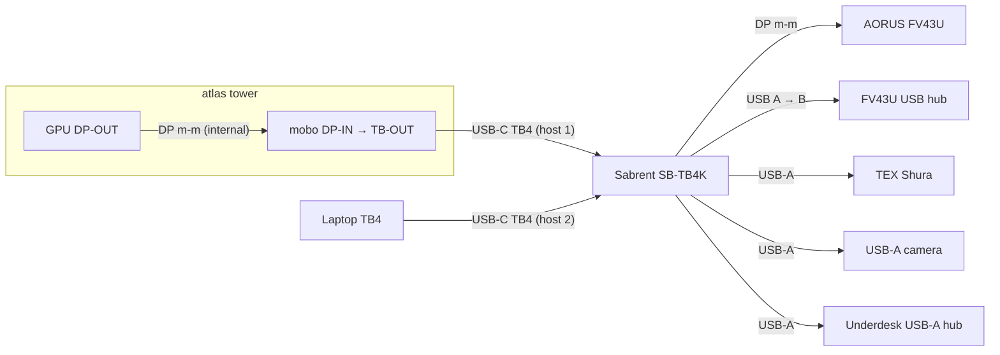

# Desk wiring

Working notes for the home desk setup. Goal: hang every peripheral off
a Thunderbolt KVM so one button-press swaps the whole desk between
**atlas** (see top-level <../README.md>) and a hot-plug laptop.

Pre-build. Inventory and target topology only — no cables pulled yet.

## Devices on hand

| Device              | Notes                                                                |
| ------------------- | -------------------------------------------------------------------- |
| atlas               | Tower, powered. GPU DP-OUT → mobo DP-IN feeds TB-OUT (internal).     |
| AORUS FV43U         | 43" 4K monitor, powered. DP / HDMI / USB-C video in. USB-B hub uplink, USB-A hub out. |
| Sabrent SB-TB4K     | TB4 KVM. 2 host inputs + downstream TB4 / USB-A / DP / audio. Exact port count: TBD on the unit. |
| TEX Shura           | Mech keyboard with BT-LE module. Planned: wired USB.                 |
| USB-A camera        | Model TBD.                                                           |
| Underdesk USB-A hub | Mounted left-underside of the desk.                                  |
| USB WiFi adapter    | Model TBD. Spare; could go into atlas as a temporary wireless NIC.   |

## Cables on hand

Cables physically present at home. Anything in the storage unit is
listed in the next section so we don't accidentally plan around it.

| Qty | Cable                                  | Vendor   | Current state                                |
| --- | -------------------------------------- | -------- | -------------------------------------------- |
| 1   | DP male-male                           | —        | In use: atlas GPU DP-OUT → mobo DP-IN.       |
| 1   | DP male-male, 8K                       | Ivanky   | Spare.                                       |
| 1   | USB A → USB B                          | —        | Spare.                                       |
| 1   | USB-C, 40 Gb/s, 240 W (TB-class)       | Silkland | Spare. Active, USB4/TB4-grade.               |
| 1   | USB-C, USB 3.2 Gen 2×2, 20 Gb/s, 8K    | —        | Spare. Not TB; OK for DP-Alt video + USB data only. |
| 1   | Shielded Ethernet, ~1 ft               | —        | Spare. Known-good but almost certainly too short to reach atlas from the wall jack. |
| 1   | USB-A extension (female ↔ male)        | —        | Previously ran to the monitor; repositionable. |
| 1   | USB-A → USB-C                          | —        | Tagged green, label "keyboard". Spare. |
| 1   | USB-A → USB-C                          | —        | Untagged. Currently in use with the TEX Shura. |
| 1   | USB-A → USB-C                          | —        | Spare. |
| 1   | DP ↔ USB-C                             | Ivanky   | Spare. Passive DP-Alt adapter cable. |
| 1   | Thunderbolt USB-C, ~2 ft               | Sabrent? | Spare. Tagged "4". Likely a TB4 cable bundled with the SB-TB4K. Verify the marking. |

## In storage (not available now)

- Colored cable-marker paper rings (see "Cable marking" below).

## Target topology

## Cable plan vs. inventory

Each row is one physical link in the diagram above.

| Link                          | Cable type            | Have?                                   |
| ----------------------------- | --------------------- | --------------------------------------- |
| atlas GPU → atlas mobo        | DP m-m                | Yes (already wired).                    |
| atlas mobo TB-OUT → KVM host 1 | USB-C TB4 (≥ TB-class) | Yes — Silkland 40 Gb/s 240 W.           |
| Laptop TB → KVM host 2        | USB-C TB4 (≥ TB-class) | Yes — Sabrent-looking 2 ft cable tagged "4" (verify TB4 marking). |
| KVM DP-OUT → monitor DP-IN    | DP m-m                | Yes — Ivanky 8K DP.                     |
| KVM USB-A → monitor USB-B in  | USB A → B             | Yes.                                    |
| KVM USB-A → keyboard          | USB-A → USB-C        | Yes — two on hand (one tagged "keyboard", one in use). |
| KVM USB-A → camera            | USB-A → ? (camera connector TBD) | **TBD**.                      |
| KVM USB-A → underdesk hub     | USB-A → ? (hub uplink connector TBD) | **TBD**.                  |

The 20 Gb/s USB 3.2 USB-C cable doesn't fit any link in this plan
(can't host a TB switch, not needed for monitor video since we have a
DP-DP). Keep as a spare — useful for a direct laptop-to-monitor
fallback if the KVM is ever bypassed.

With the Sabrent-looking 2 ft TB cable added, both host links are
covered (Silkland for the longer atlas run, short Sabrent for laptop).
Remaining unknowns are accessory-side cables for the camera and
underdesk hub, which depend on connectors we haven't confirmed yet.

## Cable marking

Deferred until the marker paper comes out of storage. Sketch of options
to decide between then:

- Colored bands at each end, color = port group (host TB / video /
  USB-downstream).
- Numbered tags `01..NN` with the key recorded here.

## Open questions

- Confirm SB-TB4K downstream port count and exact mix (TB4 ×?, USB-A ×?,
  USB-C ×?, DP ×?). The plan above assumes ≥1 DP-out, ≥4 USB-A.
- Camera model + connector.
- Underdesk USB-A hub uplink type (USB-A male, or captive cable?).
- Does the FV43U USB-C input carry data + USB-PD as well as DP-Alt
  video? If yes, a laptop plugged via the KVM still wouldn't see the
  monitor hub through the USB-C path — the hub upstream goes via the
  separate USB-B uplink to the KVM, so this is moot for the KVM
  topology but worth knowing for direct-plug fallbacks.
- Physical placement of the KVM (desktop vs. underdesk mount) — affects
  USB-A cable lengths.
- Per-link cable-length constraints (desk-edge to under-desk, monitor
  back to KVM, KVM to camera position, etc.). Measure as we go.

## Networking (separate from KVM plan)

atlas's network link isn't part of the KVM topology, but the inventory
is being gathered together. Current options if the in-use Ethernet path
doesn't work:

- Use the on-hand shielded Ethernet cable if reach permits (it's short).
- Drop the USB WiFi adapter into atlas as a stopgap wireless NIC.

## Out of scope (for now)

- Wall power, surge protection, under-desk power routing — possible
  later sweep.
- Audio routing (monitor speakers vs. headphones vs. KVM audio jack).
