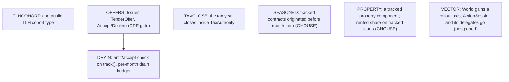

# Remaining `World` slices

The composition (GWORLD: a coordinating `World` over tracked actors) and recording
(GMETRICS: every caller records what it wants between steps) are decided and
landed; the implemented shape and the rejected designs are in
[the simulator design](../sim/DESIGN.md). The [roadmap](roadmap.md#committed-library-cleanups)
owns dispatch as COMPOSE; [the P12 cleanup](cleanup_migration.md) owns the configured
strategy's deletions. The broader market-input/identifier redesign and package
splitting are not committed tasks.

## Remaining work, in dependency order

An edge means the target cannot start until the source has landed. Everything else
is independent. Each node leaves this section when it lands.

- **TLHCOHORT** (postponed by the operator; kept). `sim/tlh.py`'s `TlhOpeningCohort`
  becomes the one public `TlhCohort` (value at a mark, cost basis, purchase month, in
  currency quanta) once `TlhPortfolioSpec` stops carrying the authored decimal
  `scenario.TlhCohort`. Open: the Plaid source that builds the spec knows
  `iso_currency_code` but no currency quantum, while every other portfolio amount is
  quantized per request by the compiler. Either the source quantizes, which needs a
  quantum at portfolio resolution and a check against the request's, or the decimal
  cohort moves beside `HoldingTaxLotConfig` in `api/portfolio.py` under a config name
  and only the sim record is `TlhCohort`.
- **OFFERS.** Gated on GPE: which compulsory events run without a tender policy, and
  when forced proceeds become spendable. Then `Issuer` emits `TenderOffer` and
  `ForcedRecovery` from the path's series, the household answers with `Accept` or
  `Decline` inside the month, and `PrivateEquity.advance` and `declare_tender_policy`
  go.
- **DRAIN.** With a second addressee and a reactive message, mail emitted during a
  month is queued in deterministic producer order and delivered to its addressee
  only; an actor receiving mail after its `MonthOpened` handler is invoked again for
  that message. The queue drains to quiescence under a per-month message budget whose
  breach raises an error naming the loop. `track()` checks that every message an
  actor can emit has an acceptor. Settlement stays synchronous: the world never sends
  a retry, and an intra-month quote is a helper call, not a message.
- **TAXCLOSE.** The tax book becomes `TaxAuthority`'s state;
  `Accounting.close_tax_year` moves into the authority, which posts the assessment it
  computes.
- **SEASONED.** A tracked `Mortgage` may carry an `origination_month` before the
  world's origin; the ledger opens with the outstanding balance and the amortisation
  schedule is honoured from there. A contract a household's decision originates
  mid-run (a purchase signing a mortgage) is HOUSE, not this slice.
- **PROPERTY.** A property held at month zero is a tracked component with its own
  statements; a tracked loan's rented share comes from it instead of being zero,
  and a tracked bill may name it.
- **VECTOR** (postponed by the operator: no optimization until an actual large-N
  workload shows `ActionSession` is the bottleneck). Policies act on a rollout axis: `World` carries N paths, reactive
  months make rounds ragged across rollouts, and selected replay re-creates agents
  with fresh state on the same paths. The batch session and its delegate households
  are deleted, and these `ActionSession` callers move to `World`: `x/monthly_actions`,
  `x/bounded_spending`, `x/bond_policies`, `x/allocation_glide`, `study/trinity`,
  `policy/test_sleeves.py`, `product/{funding_test,test_action_projection,test_tlh_timeline}.py`
  and most `sim/*_test.py` suites. The app (`product/simulation.py`) and
  `x/joint_spending_allocation` already step a tracked agent.
