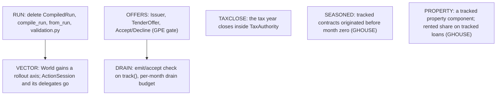

# Library composition and metrics design gates

GWORLD and GMETRICS are decided below; neither is a new API specification. The
[roadmap](roadmap.md#committed-library-cleanups) owns tasks and sequencing;
[reader retirement](cleanup_migration.md) owns concrete deletions.

## Agreed direction

The agreed cleanups still open are:

1. Stop making `Scenario` / `PreparedScenario` / `CompiledRun` the mandatory way to
   compose every financial experiment. Retain useful validation, quantization and
   artifact import; an adapter must construct the same domain objects, not another
   financial executor.
2. Retire configured implicit-strategy orchestration consumer by consumer. Preserve
   supported financial behavior and explicitly resolve differences from ordered
   action execution before removing a reader.

Do not expose arbitrary bookkeeping calls as the public API or install a universal
component/plugin framework.

The broader market-input/identifier redesign, package splitting and other parts
of the preceding audit were not confirmed by the operator and are not committed
tasks. Previously recorded independent roadmap work retains its own scope.

## GWORLD — decided: a coordinating World over tracked components

Selected 2026-09-12. COMPOSE implements it in slices; each slice moves its
durable statements to `SPEC.md` and `sim/DESIGN.md`, and this section leaves with
the last one. What is left is [the remaining-work graph](#remaining-work-in-dependency-order).

The experiment constructs an empty `World`, tracks the economic objects that take
part, then owns the loop around `World.step()`:

```python
# Target shape; names are not final API declarations.
world = World(paths=paths, tax_rules=rules)
retiree = SpendingHousehold(...)  # EconomicAgent subclass; its state lives on the instance
world.track(retiree)
mortgage = Mortgage(...)  # a contract that already exists at month zero
world.track(mortgage)

while not world.finished:
    metrics.append({"mortgage_remaining": world.principal(mortgage), ...})
    if some_condition:
        retiree.change_policy(...)  # experiment-owned logic between months
    world.step()
```

- `EconomicAgent` is a base class the experiment subclasses. Spending tiers,
  memory and parameters live on the instance. `decide(observation)` is the agent's
  handler for the month-opened message and runs exactly once per month; the
  observation carries the agent's state view plus its inbox (claims, offers,
  statements, last month's receipts). The caller-ordered, fatal-rejection contract
  is unchanged; only the invoker of `decide` moves from the experiment's loop into
  `step()`.
- A month has three global moments and no domain-specific phases. **Open:** the
  World applies scheduled flows and delivers month-opened to everything tracked, in
  a fixed three-tier order (market and paths, then contracts and components, then
  agents), so claims exist before the household observes and TLH advances before
  investor operations. **Drain:** typed messages emitted during the month are
  queued in deterministic producer order and delivered to their addressee only; an
  actor that receives mail after its month-opened handler is invoked again for that
  message. The queue drains to quiescence under a per-month message budget, and
  exceeding it raises an error naming the loop, never a silent stop. **Close:**
  marks, tax-year close and stop determination. A domain nobody tracked emits no
  messages, so the schedule never grows a phase for it. The month's message log is
  the trace.
- Settlement stays synchronous. Actions execute against the ledger in caller order
  with atomic rejection, and a rejected action stops the path: the World never
  delivers a "retry" message, so negotiation cannot creep back in. Intra-month
  request/response (a quote before deciding) is a helper call, not a message.
- Messages are a closed typed union per domain (claim, offer, statement, receipt),
  not a generic bus, subscription protocol or global event registry.
- Tracking closes before the opening snapshot. `track()` is where cross-object
  consistency is checked: unknown accounts, duplicate ownership, cross-actor
  references, missing price series. Attaching mid-run is contract origination and
  stays with GP/GHOUSE.
- A domain the experiment did not track is absent from the world, observations,
  results and fixtures, not present-and-empty. A two-security spending experiment
  produces no private-equity, property, bond or TLH fields anywhere.
- Financial facts keep one owner. Outstanding principal stays in the ledger; a
  `Mortgage` reads it through the world rather than mirroring it. Components expose
  readings, never a second authoritative book.
- The single-path world is the primary object. A batched N-path driver (today's
  `ActionSession`) becomes a layer over N worlds for vectorised policies, later and
  not as a second policy interface; reactive months make rounds ragged across
  rollouts, the non-reactive case batches as before. Selected replay re-creates
  agents with fresh state on the same paths.
- Contracts that begin from an agent's decision (a purchase originating a mortgage)
  wait for GHOUSE; servicing a contract that exists at month zero is in scope.

Rejected: explicit guarded composition without a World, because consistency checks
across agents, contracts and tax treatment need one registration point and every
sketch of the lighter form reinvented it. A fixed global phase list, because it
must be the union of every domain's phases and runs them even where the domain is
absent. "Re-ask every actor until all are quiet" as the drain rule, because
termination then depends on every agent's politeness and batched policies face
ragged rounds even when nothing reactive happened. A ledger that is itself an
actor with a mailbox, because atomic rejection and caller-ordered execution are
transaction semantics against one ledger and would change meaning as asynchronous
messages. A separable state-container/step-coordinator hybrid is deferred until a
consumer needs the split; forwarding alone does not justify it.

### Message shape — decided 2026-09-12

Every tracked thing is an actor of one shape: it receives typed messages and emits
typed messages. The World routes mail and settles actions against the one ledger;
it holds no view on anyone's behalf. The sketch is the decided shape, not the API;
the landed actors and their message types are described in `sim/DESIGN.md`.

```python
class Actor[In, Out]:
    def handle(self, message: In) -> list[Out]: ...

# Each emitter defines its message types beside itself; there is no catch-all class.
class Mortgage(Actor[MonthOpened | PaymentReceipt, InstallmentDue]): ...
class TaxAuthority(Actor[MonthOpened | PaymentReceipt, AssessmentDue]): ...
class Issuer(Actor[MonthOpened | Accept | Decline, TenderOffer | ForcedRecovery]): ...
class Household(
    Actor[MonthOpened | AccountStatement | tlh.Statement | InstallmentDue | TenderOffer | Receipt, Action]
):
    def handle(self, message):
        match message:
            case AccountStatement():
                self.accounts = message
                return []
            case InstallmentDue():
                self.due.append(message)
                return []
            case MonthOpened():
                return self.plan()  # today's decide, over what this actor was told
            case TenderOffer():
                return [Accept(...)]
```

- **One method.** Today's `decide` already emits messages (`Sell`, `PayClaim` and
  `Consume` are requests addressed to the ledger), so `MonthOpened` is simply the
  message that makes a household act. There is no separate reactive handler.
- **Typed per actor, checked twice.** The generic parameters say what an actor
  accepts and produces; mypy checks each `handle` body against them, and `track()`
  checks at runtime that everything an actor can emit is accepted by its addressee.
  Messages are addressed by typed actor ids (`AgentId`).
- **Statements are pushed.** At open, every owner receives its statements before
  `MonthOpened`: the ledger's `AccountStatement` (balances, lots and basis, prices),
  a manager's `tlh.Statement`, a contract's `InstallmentDue`. Tier order (market and
  paths, then contracts and components, then agents) guarantees the statements
  arrive first. An actor knows what it was told plus what it remembers; nothing
  called `Observation` is built by the world. The batch caller assembles the flat
  per-path view its policy function wants from the statements its delegate received,
  in the caller's code.
- **The ledger is synchronous.** It emits statements at open and settles action
  messages during drain in the sender's order, atomically, with a `Receipt` back to
  the sender that arrives in next month's mail. It never re-invokes a sender for its
  own rejection, so a retry cannot creep back in as negotiation.
- **Drain.** Mail created during a month is delivered to its addressee only, in
  deterministic producer order, under a per-month budget whose breach raises. A
  `TenderOffer` is the first message that needs a reply inside the month; until the
  PE boundary lands nothing reactive flows and the month is open, act, close.
- **One coordinator.** `ActionSession` is an ordinary caller that owns N worlds,
  feeds each a delegate household carrying the caller's submitted actions, and
  records what its `Finished` promises. When vectorised policies arrive, `World`
  gains a rollout axis and `ActionSession` is deleted with its callers migrating to
  `World`.
- **Tax authority, first form.** `TaxAuthority` emits its assessments from what the
  tax book already computes; `close_tax_year` stays in `Accounting` and moves into
  the authority when the tax book itself becomes tracked state.

### Callers by surface

Today's callers, so the remaining work can be checked off:

- **`World.step` with a tracked agent:** `x/joint_spending_allocation` and the app (below).
- **`ActionSession` (batch):** `x/monthly_actions`, `x/bounded_spending`, `x/bond_policies`,
  `x/allocation_glide`, `study/trinity`, most `sim/*_test.py` acceptance suites,
  `sim/test_{results,invocation,world}.py`, `policy/test_sleeves.py` and the product
  funding, projection and TLH-timeline tests.
  These stay on the batch API; the batch layer already drives N worlds through
  delegate agents, and a vectorised policy layer replaces the delegates later.
- **App (`product/service.py`) — composes its worlds:** `product/scenarios.py` lowers a
  request once through the compiler's per-table pieces into prepared declarations and
  declares them onto one world per path, the `ConfiguredHousehold` tracked on it and
  `step()` to the horizon; it consults `configured_allocation.plan` for its sales, pays
  claims all or none per account and sizes exact purchases from what those leave.
- **`Scenario`/`compile_run` authoring:** on the sim side only the tests of `compile_run`
  itself and of the prepared-input file. Every sim, policy, product and experiment suite
  composes its worlds, and the app lowers through the compiler's per-table pieces.
  Leaves with RUN.

### Remaining work, in dependency order

The burn-down that is left, as a graph: an edge means the target cannot start until
the source has landed. Everything else is independent and can be dispatched in
parallel. Each node leaves this section when it lands.



- **RUN.** `CompiledRun`, `PreparedScenario`, `compile_run`, `World.from_run`,
  `ActionSession.from_run`, `MarketPath.from_run`, `sim/validation.py` and the
  prepared-input file (`sim/artifacts.py`) are deleted with the tests whose subject
  they are (`compiler/execution_test`'s `compile_run` cases, `artifacts_test`), and
  with them the `Scenario` adapters over the compiler's per-table pieces
  (`compile_tax`, `scenario_level_series_keys`, `collect_level_series_keys`,
  `validate_series_indexed_amounts`); the prepared record types stay as the
  declaration vocabulary. With the authored `scenario.TlhCohort` gone, `sim/tlh.py`'s
  `TlhOpeningCohort` takes the name `TlhCohort` as the one public cohort (value at a
  mark, cost basis, purchase month), which the Plaid source builds directly;
  `_Cohort` stays private and uses the same `purchase_month_index` name. `SCHEMA`
  closes here.
- **OFFERS.** Gated on GPE: which compulsory events run without a tender policy, and
  when forced proceeds become spendable. Then `Issuer` emits `TenderOffer` and
  `ForcedRecovery` from the path's series, the household answers inside the month,
  and `PrivateEquity.advance` and `declare_tender_policy` go.
- **DRAIN.** With a second addressee and a reactive message, `track()` checks that
  every message an actor can emit has an acceptor, and the month's drain has a budget
  whose breach raises.
- **TAXCLOSE.** The tax book becomes the authority's state; `Accounting.close_tax_year`
  moves into `TaxAuthority`, which posts the assessment it computes.
- **SEASONED.** A tracked `Mortgage` may carry an `origination_month` before the
  world's origin; the ledger opens with the outstanding balance and the amortisation
  schedule is honoured from there.
- **PROPERTY.** A property held at month zero is a tracked component with its own
  statements; a tracked loan's rented share comes from it instead of being zero,
  and a tracked bill may name it.
- **VECTOR.** Policies act on a rollout axis; `World` carries N paths, and the batch
  session with its delegate households is deleted with its callers moving to `World`.

## GMETRICS — decided: every caller records what it wants, between steps

Selected 2026-09-12. The world exposes present state and each component's outcomes
for the current month; it assembles no frame, log, summary or metric on anyone's
behalf. A caller reads the values it cares about before or after `step()` and keeps
them itself: the batch session builds the `Summary` and `Trace` its `Finished`
promises, the app's runner builds its `WorldResult` and metric slab in `product/`,
an experiment records only what it measures. Inside a
component the rule is: a field stays if a later month reads it to compute the
future; a log nothing reads is history and leaves. No observer class, collector
protocol or event bus is introduced; if repetition across callers earns a shared
helper later, it is extracted from the code that actually repeats.
