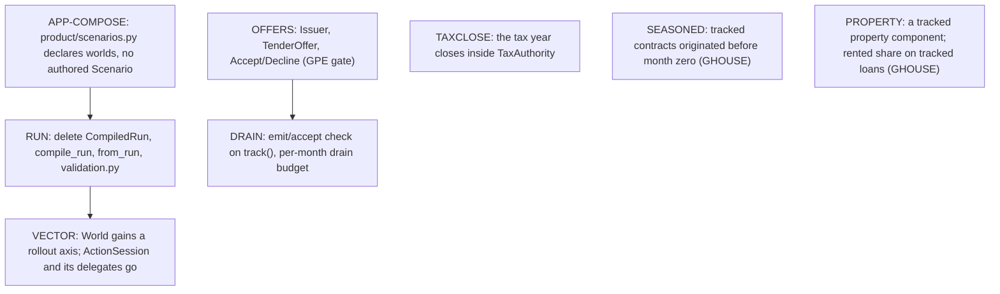

# Library composition and metrics design gates

GWORLD is decided below and GMETRICS is still open; neither is a new API
specification. The [roadmap](roadmap.md#committed-library-cleanups-and-open-designs)
owns tasks and sequencing; [reader retirement](cleanup_migration.md) owns concrete
deletions. Existing code and interface sketches are evidence, not decisions the
open gate has already made.

## Agreed direction versus open mechanism

The agreed cleanups are:

1. Stop making `Scenario` / `PreparedScenario` / `CompiledRun` the mandatory way to
   compose every financial experiment. Retain useful validation, quantization and
   artifact import; an adapter must construct the same domain objects, not another
   financial executor.
2. Retire configured implicit-strategy orchestration consumer by consumer. Preserve
   supported financial behavior and explicitly resolve differences from ordered
   action execution before removing a reader.
3. Make stateful components composable without extending a central world schema or
   constructor switch for every new experiment. Keep one owner per financial fact.
4. Separate financial state and correctness from application-specific metrics and
   recording. The collection API and any role a coordinating World plays in it
   remain open.
5. Retire legacy artifact-to-frame acceptance projections while preserving their
   independent financial assertions.

The coordinating `World` below is the selected composition. Do not expose
arbitrary bookkeeping calls as the public API or install a universal
component/plugin framework.

The broader market-input/identifier redesign, package splitting and other parts
of the preceding audit were not confirmed by the operator's response. This update
does not promote those recommendations into new committed implementation tasks.
Previously recorded independent roadmap work retains its own scope.

## GWORLD — decided: a coordinating World over tracked components

Selected 2026-09-12. COMPOSE implements it in slices; each slice moves its
durable statements to `SPEC.md` and `sim/DESIGN.md`, and this section leaves with
the last one. Landed: `EconomicAgent`, `World.track/start/step` over the existing
`CompiledRun`, the session as a layer over N worlds, and a present-tense world:
no capture mode, no subject actor, no history; components keep only the state a
later month reads plus this month's outcomes, and every caller records what it
wants between steps; typed statements and dues posted at open, a month-zero
`Mortgage` as a tracked contract, the scenario's bills, property tax and tax
authority as counterparty actors, a World composed from declared facts with
`compile_run` as an import adapter, and untracked domains absent from the world,
its books and its capture.

The experiment constructs an empty `World`, tracks the economic objects that take
part, then owns the loop around `World.step()`:

```python
# Target shape; names are not final API declarations.
world = World(paths=paths, tax_rules=rules)
retiree = SpendingHousehold(...)  # EconomicAgent subclass; its state lives on the instance
world.track(retiree)
mortgage = Mortgage(...)  # a contract that already exists at month zero
world.track(mortgage)

while not world.finished:
    metrics.append({"mortgage_remaining": world.principal(mortgage), ...})
    if some_condition:
        retiree.change_policy(...)  # experiment-owned logic between months
    world.step()
```

- `EconomicAgent` is a base class the experiment subclasses. Spending tiers,
  memory and parameters live on the instance. `decide(observation)` is the agent's
  handler for the month-opened message and runs exactly once per month; the
  observation carries the agent's state view plus its inbox (claims, offers,
  statements, last month's receipts). The caller-ordered, fatal-rejection contract
  is unchanged; only the invoker of `decide` moves from the experiment's loop into
  `step()`.
- A month has three global moments and no domain-specific phases. **Open:** the
  World applies scheduled flows and delivers month-opened to everything tracked, in
  a fixed three-tier order (market and paths, then contracts and components, then
  agents), so claims exist before the household observes and TLH advances before
  investor operations. **Drain:** typed messages emitted during the month are
  queued in deterministic producer order and delivered to their addressee only; an
  actor that receives mail after its month-opened handler is invoked again for that
  message. The queue drains to quiescence under a per-month message budget, and
  exceeding it raises an error naming the loop, never a silent stop. **Close:**
  marks, tax-year close and stop determination. A domain nobody tracked emits no
  messages, so the schedule never grows a phase for it. The month's message log is
  the trace.
- Settlement stays synchronous. Actions execute against the ledger in caller order
  with atomic rejection, and a rejected action stops the path: the World never
  delivers a "retry" message, so negotiation cannot creep back in. Intra-month
  request/response (a quote before deciding) is a helper call, not a message.
- Messages are a closed typed union per domain (claim, offer, statement, receipt),
  not a generic bus, subscription protocol or global event registry.
- Tracking closes before the opening snapshot. `track()` is where cross-object
  consistency is checked: unknown accounts, duplicate ownership, cross-actor
  references, missing price series. Attaching mid-run is contract origination and
  stays with GP/GHOUSE.
- A domain the experiment did not track is absent from the world, observations,
  results and fixtures, not present-and-empty. A two-security spending experiment
  produces no private-equity, property, bond or TLH fields anywhere.
- Financial facts keep one owner. Outstanding principal stays in the ledger; a
  `Mortgage` reads it through the world rather than mirroring it. Components expose
  readings, never a second authoritative book.
- The single-path world is the primary object. A batched N-path driver (today's
  `ActionSession`) becomes a layer over N worlds for vectorised policies, later and
  not as a second policy interface; reactive months make rounds ragged across
  rollouts, the non-reactive case batches as before. Selected replay re-creates
  agents with fresh state on the same paths.
- Contracts that begin from an agent's decision (a purchase originating a mortgage)
  wait for GHOUSE; servicing a contract that exists at month zero is in scope.

Rejected: explicit guarded composition without a World, because consistency checks
across agents, contracts and tax treatment need one registration point and every
sketch of the lighter form reinvented it. A fixed global phase list, because it
must be the union of every domain's phases and runs them even where the domain is
absent. "Re-ask every actor until all are quiet" as the drain rule, because
termination then depends on every agent's politeness and batched policies face
ragged rounds even when nothing reactive happened. A ledger that is itself an
actor with a mailbox, because atomic rejection and caller-ordered execution are
transaction semantics against one ledger and would change meaning as asynchronous
messages. A separable state-container/step-coordinator hybrid is deferred until a
consumer needs the split; forwarding alone does not justify it.

### COMPOSE evidence

Small runnable compositions on supplied paths, not a framework spike:

- A spending agent with cash/lots and explicit tax treatment, including a taxable
  sale, due claim and year boundary.
- An opaque TLH component with contribution/withdrawal and settlement rejection.
- An already-supported mortgage servicing example with ledger-authoritative
  principal and paid-interest state; no new housing-purchase policy is required.

Exercise unknown/cross-actor references, duplicate component ownership, invalid
transfers, insufficient funding, a rejected middle action, an unpaid tax claim,
explicit untaxed treatment, repeated/omitted lifecycle calls and independent
rollouts. Check independently calculated books and unchanged established behavior.
An omitted duty must reject or produce an explicit incomplete/failure result,
not silently certify the period. Checkpoints, nested forecasts, a many-agent
economy and a throughput target are not prerequisites.

### Message shape — decided 2026-09-12

Every tracked thing is an actor of one shape: it receives typed messages and emits
typed messages. The World routes mail and settles actions against the one ledger;
it holds no view on anyone's behalf. Names below are the intended ones, not yet API.

```python
class Actor[In, Out]:
    def handle(self, message: In) -> list[Out]: ...

# Each emitter defines its message types beside itself; there is no catch-all class.
class Mortgage(Actor[MonthOpened | PaymentReceipt, InstallmentDue]): ...
class TaxAuthority(Actor[MonthOpened | PaymentReceipt, AssessmentDue]): ...
class Issuer(Actor[MonthOpened | Accept | Decline, TenderOffer | ForcedRecovery]): ...
class Household(
    Actor[MonthOpened | AccountStatement | tlh.Statement | InstallmentDue | TenderOffer | Receipt, Action]
):
    def handle(self, message):
        match message:
            case AccountStatement():
                self.accounts = message
                return []
            case InstallmentDue():
                self.due.append(message)
                return []
            case MonthOpened():
                return self.plan()  # today's decide, over what this actor was told
            case TenderOffer():
                return [Accept(...)]
```

- **One method.** Today's `decide` already emits messages (`Sell`, `PayClaim` and
  `Consume` are requests addressed to the ledger), so `MonthOpened` is simply the
  message that makes a household act. There is no separate reactive handler.
- **Typed per actor, checked twice.** The generic parameters say what an actor
  accepts and produces; mypy checks each `handle` body against them, and `track()`
  checks at runtime that everything an actor can emit is accepted by its addressee.
  Messages are addressed by typed actor ids, so IDTYPES lands with the queue rather
  than staying deferred.
- **Statements are pushed.** At open, every owner receives its statements before
  `MonthOpened`: the ledger's `AccountStatement` (balances, lots and basis, prices),
  a manager's `tlh.Statement`, a contract's `InstallmentDue`. Tier order (market and
  paths, then contracts and components, then agents) guarantees the statements
  arrive first. An actor knows what it was told plus what it remembers; nothing
  called `Observation` is built by the world. The batch caller assembles the flat
  per-path view its policy function wants from the statements its delegate received,
  in the caller's code.
- **The ledger is synchronous.** It emits statements at open and settles action
  messages during drain in the sender's order, atomically, with a `Receipt` back to
  the sender that arrives in next month's mail. It never re-invokes a sender for its
  own rejection, so a retry cannot creep back in as negotiation.
- **Drain.** Mail created during a month is delivered to its addressee only, in
  deterministic producer order, under a per-month budget whose breach raises. A
  `TenderOffer` is the first message that needs a reply inside the month; until the
  PE boundary lands nothing reactive flows and the month is open, act, close.
- **One coordinator.** `_Session` goes; `ActionSession` becomes an ordinary caller
  that owns N worlds, feeds each a delegate household carrying the caller's
  submitted actions, and records what its `Finished` promises. When vectorised
  policies arrive, `World` gains a rollout axis and `ActionSession` is deleted with
  its callers migrating to `World`.
- **Tax authority, first form.** `TaxAuthority` emits its assessments from what the
  tax book already computes; `close_tax_year` stays in `Accounting` and moves into
  the authority when the tax book itself becomes tracked state.

### COMPOSE slices and caller burn-down

Each slice is its own PR and removes one dependency on the scenario bag or on the
batch layer. The order is a dependency order, not a schedule; the rows below say
which callers each slice moves.

| Slice                                                                                                                                                                                                                                                                                                                                                                                                                                                                                                                                                                                | Callers it moves                                                                                                                                                                                                                                                                      |
| ------------------------------------------------------------------------------------------------------------------------------------------------------------------------------------------------------------------------------------------------------------------------------------------------------------------------------------------------------------------------------------------------------------------------------------------------------------------------------------------------------------------------------------------------------------------------------------ | ------------------------------------------------------------------------------------------------------------------------------------------------------------------------------------------------------------------------------------------------------------------------------------- |
| Queue and statements — **landed**: `Actor[In, Out]` and `MonthOpened` (`sim/actor.py`), `AgentId` (`sim/ids.py`), statements beside their emitters, typed dues beside `claims.assemble` and `Mortgage`, `Receipt` as mail; `World.open_mail` replaces `observe`; `EconomicAgent` and `ActionSession` assemble `Observation` from mail; `_Session` folded into `ActionSession`. Left for the offers slice: the runtime emit/accept check on `track()` and the drain budget, which need a second addressee and a reactive message to mean anything.                                    | Batch policies keep reading the assembled `Observation`; `x/joint_spending_allocation` reads it through `decide`. Nothing else moved.                                                                                                                                                 |
| Contracts as tracked actors — **landed**: `Mortgage` is an `Actor` that quotes on `MonthOpened` from the `ServicingStatement` it was posted and books an `InstallmentPaid`; `World.track(mortgage)` opens the ledger with the contract's month-zero balance, and configured purchases' loans run through the same messages. A tracked contract's property is not a component, so its rented share is zero until GHOUSE.                                                                                                                                                              | `sim/test_world.py` gains the household-servicing example from the gate evidence; `sim/test_world_mortgages.py` keeps exercising the configured path.                                                                                                                                 |
| Counterparties as tracked actors — **landed**: `bills.Biller`, `property_tax.PropertyTaxAuthority` and `tax_authority.TaxAuthority` emit typed demands on `MonthOpened` from the statements they are posted (`PropertyStatement`, `TaxLiabilityStatement`); the world registers demands as claims in tier order and `claims.assemble` is gone. `World.track(biller)` takes a bill that exists at month zero. The world still constructs the scenario's counterparties itself until the constructor slice; a property-linked bill needs the property tracked, which waits for GHOUSE. | `sim/test_payments.py` assesses through `TaxAuthority`; the acceptance suites are unchanged because registration order matches the old assembly order.                                                                                                                                |
| Constructor over tracked actors — **landed**: `World(market, horizon_months=…, income_sources=…, jurisdictions=…)` starts empty; the caller declares accounts, pools, lots, bonds and TLH portfolios and tracks agents, contracts, bills and tax authorities. Every component owns the facts it reads. `World.from_run` is the import adapter over the prepared scenario, and `compile_series`/`compile_profile` are the compiler pieces a composed world still needs. `x/joint_spending_allocation` is composed with no `Scenario`.                                                 | Every experiment and study is composed onto `World` and `ActionSession(worlds, actor)`: `x/{joint_spending_allocation,allocation_glide,monthly_actions,bounded_spending,bond_policies}` and `study/trinity`; none writes an execution-input artifact any more, the situation is code. |
| Untracked domains absent — **landed**: `World.properties`, `bonds`, `managed`, `private_equity` and `distributions` are `None` until something is declared, held, tracked or attached, and the month loop, statements, book and capture skip an absent domain. `Book.bonds`, `properties` and `tlh_portfolios`, the `FinancialOutput` channels (property and private-equity outcomes grouped per domain) and `Trace.bond_cashflows`/`distributions` are `None` for an absent domain; `event_log` still emits every frame, empty, so the app's wire is unchanged.                     | `capture.FinancialCapture`, `ActionSession`'s record and `product.metrics.product_row` guard the absent domains; the acceptance decoders and `product/action_projection.py` read `None` where a domain is absent.                                                                     |
| Offers: `Issuer` emits `TenderOffer` and `ForcedRecovery`; the household replies with `Accept` or `Decline` inside the month. **Landed short of the actor shape**: holding a private lot brings the issuer protocol onto a composed world (its series checked on the path), `declare_tender_policy` is the owner's standing answer, and `close_month` runs the protocol after settlement for every driver.                                                                                                                                                                           | The configured PE tender path (`sim/private_equity.py`, `product/scenarios.py`); this is the GPE boundary and waits for it.                                                                                                                                                           |

Callers by surface today, so the burn-down can be checked off:

- **`World.step` with a tracked agent:** `x/joint_spending_allocation` only.
- **`ActionSession` (batch):** `x/monthly_actions`, `x/bounded_spending`, `x/bond_policies`,
  `x/allocation_glide`, `study/trinity`, `product/funding.py` and its tests, and the
  acceptance suites in `sim/{action,asset_sales,bond,harvest,held_bond,indexed_payments,lot_basis,obligations,public_sales,security_distributions,transfers}_test.py`,
  `sim/test_{results,invocation,world,observations}.py`, `policy/test_sleeves.py` and
  the product projection suites.
  These stay on the batch API; the batch layer already drives N worlds through
  delegate agents, and a vectorised policy layer replaces the delegates later.
- **App (`product/service.py`) — landed on `product/simulation.py`:** one world per
  path, the `ConfiguredHousehold` tracked on it and `step()` to the horizon; it
  consults `configured_allocation.plan` for its sales, pays claims all or none
  per account and sizes exact purchases from what those leave.
- **Configured runner — gone:** every configured acceptance suite composes its
  worlds in `sim/*_test.py`; `sim/configured.py` and the legacy result
  adapters are deleted.
- **`Scenario`/`compile_run` authoring:** `product/scenarios.py` with the app's
  `product/simulation.py`, `configured_allocation.validate_prepared` and the product
  tests built on them (`funding_test`, `test_simulation`, `service_test`); on the sim
  side only the tests of `compile_run` itself, of the prepared-input file and of
  `validate_prepared`. Every sim, policy and experiment suite composes its worlds.
  Leaves with RUN.
- **Recording between steps:** the app's `WorldResult` and `product_row` slab live in
  `product/simulation.py` and `product/metrics.py`; `sim/capture.py::FinancialCapture`
  is the library's detailed record, read by `ActionSession`'s trace, the app's
  dense/forensic runs and the sim tests.

### Remaining work, in dependency order

The burn-down that is left, as a graph: an edge means the target cannot start until
the source has landed. Everything else is independent and can be dispatched in
parallel. Each node leaves this section when it lands.



- **APP-COMPOSE.** `product/scenarios.py` builds an authored `Scenario` that
  `compile_run` lowers; instead it declares accounts, pools, lots, bonds, housing,
  distributions, tender and funding policies on each `World` through the compiler's
  per-table pieces (`compile_series`, `compile_profile`, and the property, bond and
  distribution lowerings still inside `compile_run`), and tracks its household,
  billers and authorities. `scheduled_transfers` and the property cashflow tables
  become tracked emitters or declarations on the way. `product/funding_test`,
  `test_simulation` and `service_test` compose through what it declares.
- **RUN.** `CompiledRun`, `PreparedScenario`, `compile_run`, `World.from_run`,
  `ActionSession.from_run`, `MarketPath.from_run`, `sim/validation.py` and the
  prepared-input file (`sim/artifacts.py`) are deleted with the tests whose subject
  they are (`compiler/execution_test`'s `compile_run` cases, `artifacts_test`); the
  prepared record types stay as the declaration vocabulary.
  `configured_allocation.validate_prepared` and `prepared_allocation_test` go too:
  its guards on the funding policies move to a check against the composed world,
  called where APP-COMPOSE tracks the household. With the authored `scenario.TlhCohort`
  gone, `sim/tlh.py`'s `TlhOpeningCohort` takes the name `TlhCohort` as the one public
  cohort (value at a mark, cost basis, purchase month), which the Plaid source builds
  directly; `_Cohort` stays private and uses the same `purchase_month_index` name.
  `SCHEMA` closes here.
- **OFFERS.** Gated on GPE: which compulsory events run without a tender policy, and
  when forced proceeds become spendable. Then `Issuer` emits `TenderOffer` and
  `ForcedRecovery` from the path's series, the household answers inside the month,
  and `PrivateEquity.advance` and `declare_tender_policy` go.
- **DRAIN.** With a second addressee and a reactive message, `track()` checks that
  every message an actor can emit has an acceptor, and the month's drain has a budget
  whose breach raises.
- **TAXCLOSE.** The tax book becomes the authority's state; `Accounting.close_tax_year`
  moves into `TaxAuthority`, which posts the assessment it computes.
- **SEASONED.** A tracked `Mortgage` may carry an `origination_month` before the
  world's origin; the ledger opens with the outstanding balance and the amortisation
  schedule is honoured from there.
- **PROPERTY.** A property held at month zero is a tracked component with its own
  statements; a tracked loan's rented share comes from it instead of being zero.
- **VECTOR.** Policies act on a rollout axis; `World` carries N paths, and the batch
  session with its delegate households is deleted with its callers moving to `World`.

## GMETRICS — decided: every caller records what it wants, between steps

Selected 2026-09-12. The world exposes present state and each component's outcomes
for the current month; it assembles no frame, log, summary or metric on anyone's
behalf. A caller reads the values it cares about before or after `step()` and keeps
them itself: the batch session builds the `Summary` and `Trace` its `Finished`
promises, the app's runner builds its `WorldResult` and metric slab in `product/`,
an experiment records only what it measures. Inside a
component the rule is: a field stays if a later month reads it to compute the
future; a log nothing reads is history and leaves. No observer class, collector
protocol or event bus is introduced; if repetition across callers earns a shared
helper later, it is extracted from the code that actually repeats.
