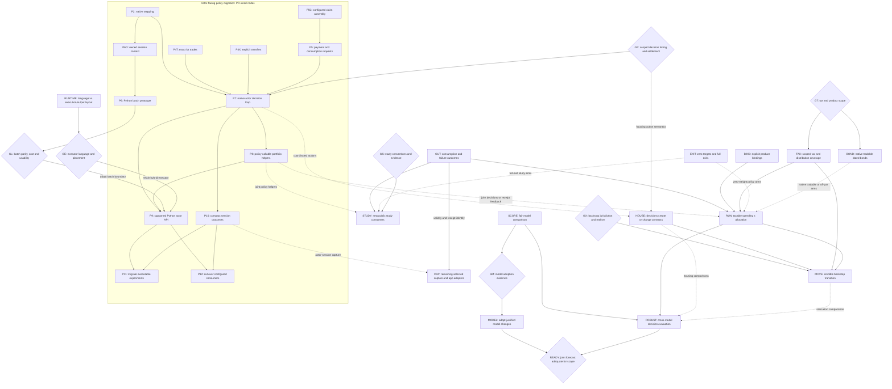

# Augur: experiment-driven modularization

This is the landing plan for a composable financial simulator: an experiment
loads or samples worlds, varies financial decisions, runs the shared mechanics,
and examines distributions and individual timelines. The primary acceptance
case is joint spending-flexibility × allocation planning with supported taxes.
Housing remains a capability; the house-buying web app does not define the library.

Grounded at `devel` `42f7cb84c7` (2026-09-09). The
[experiment/interface sketches, PR #5859](https://github.com/agentydragon/ducktape/pull/5859)
remain a proposal, not an API to implement wholesale. This plan owns sequencing;
[allocation experiments](allocation_program.md) owns the remaining experiment
questions. Other plans and issues are inputs, not additional prerequisite chains.
Remove entries and edges as their work lands; put proven contracts in `SPEC.md`
and responsibility docstrings beside the implementing modules.

## Destination and stopping conditions

- An author can load named datasets, fit/sample or supply paths, compose a
  financial situation and executable policies, sweep them, and request outcomes
  or a selected trace without importing the app or editing engine policy enums.
- Trinity, flexible-spending and changing-allocation studies are runnable examples
  with explicit conventions and deviations. Offline checks run in CI; sourced
  long-running reproductions remain separately runnable.
- A taxable household experiment starts from actual lots and tax state, pays
  spending through canonical settlement, and reports consumption, cuts,
  shortfalls, taxes and terminal wealth—not merely whether wealth stays positive.
  Private inputs stay downstream. The public acceptance case uses synthetic data.
- Model experiments independently compare predictive behavior and the financial
  decisions models support. A report identifies its evidence, assumptions and
  uncertainty; passing an accounting test does not certify a market forecast.
- Mortgages and multi-agent transfers still work through the same mechanics.
  Existing contracts survive a policy change; experiments need not implement
  optimizing lenders, landlords, or a general-equilibrium economy.

The policy-interface milestone is P2–P12: Python-authored decisions, a caller-owned
decision loop, measured high-N execution and removal of the superseded
public-portfolio decision machinery. RUNTIME/GE reassess the executor's language,
separately from P6/GL's policy-call boundary. The current P9 bridge path requires
both gates and the actor/helper work; another executor choice replans that path,
not the actor/environment responsibilities. A rejected probe leaves the gap open.
P11 exercises the joint experiment and P12 cuts over configured consumers.

The broader library milestone also includes truthful products (BIND), remaining
outcome/capture work (OUT/CAP), full exits (EXIT), new STUDY consumers and the HOUSE
action example. P2–P12 preserve existing housing and other supported mechanics;
they do not complete adaptive housing purchases, native tradable bonds, expanded
tax coverage, relocation or market-model improvements.
A new experiment must not require a new engine policy variant, app configuration,
transport implementation, or copy of financial mechanics. These are acceptance
areas, not prerequisites for starting every experiment.

The first usable household milestone is **RUN** below, for an explicitly bounded
product/tax/residency scope. The broader decision-support milestone is **ROBUST**,
plus **BOND**, **HOUSE**, and **MOVE** when those capabilities enter the chosen
experiment. A cheaper USD spending tier is not completion of the Europe backstop.
Until that branch is supported or explicitly excluded, relocation remains an
unmet part of the goal.

The forecast goal additionally requires **READY**: a prospective joint
equity/rates/inflation model whose evaluated behavior supports the declared
decision scope. Particular model families are optional; this behavioral gate is
not. Early ROBUST results under limited models do not complete it. If no candidate
passes, keep the modeling gap open and qualify the household report accordingly.

Do not make completion depend on every paper, an institutional-quality label,
exact proprietary forecasts, or proof of perpetual sustainability from finite
data. More horizons, models and stress assumptions can expose uncertainty; they
cannot make it disappear.

## Build on what is already there

`compile_run` already accepts caller-supplied paths and produces one
`ExecutionInput`. Reuse native spending and allocation functions, dynamic purchase
lots, compact consumption receipts, and scoring without simulator outputs.
Historical replay needs no structural-model fit; market sampling is separate from
product construction. Reuse scoped cash/public holdings in `rust/holdings.rs`,
borrowed actor books/claims in `rust/engine/observations.rs`, purchase-anchored
property marks in `rust/property.rs`, and shared native invocation
in `rust/invocation.{py,rs}`. Private `RolloutState` already owns initialized books,
contracts, tax state, capture and the month/stop cursor; its driver still runs the
whole horizon. Actor books expose originated mortgages and known tax facts;
opening review still precedes claim assembly. These seams have the limitations below.

Reuse [Trinity](../study/trinity/README.md),
[bounded spending](../x/bounded_spending/README.md),
[bond policies](../x/bond_policies/README.md), and
`study/macro_window/{holdout,mixed_windows,stability}.py` as consumers and controls.
The bond example supplies discount curves and unitizes strategies; it does **not**
make a native `BondHolding` tradable.

## Intended responsibilities

These are module responsibilities, not a demand for new packages, services,
crates, registries or a mandatory interface count. Move existing definitions
only where ownership or a real consumer demands it. Keep short responsibility
docstrings on the resulting modules, as in the interface sketches.

| Building block        | Owns                                                                                                                                                                                                | Does not own / current starting point                                                                                                                                                                  |
| --------------------- | --------------------------------------------------------------------------------------------------------------------------------------------------------------------------------------------------- | ------------------------------------------------------------------------------------------------------------------------------------------------------------------------------------------------------ |
| Money and instruments | Currency/quantity precision; product identity, contractual terms and distribution character shared by all consumers.                                                                                | Investor strategy or fitted dynamics. Start with `sim/fixed_point.py`, `model/{equity,bond_fund,nominal_bond}.py` and scenario holding types; `BondFundSpec` is still a particular proxy construction. |
| Books and taxes       | Positions/lots, balanced transfers, accumulated filing-unit facts, versioned statutory consequences and payment liabilities; read-only views at an explicit phase and mark time.                    | Which lifestyle or asset to choose. Reuse `sim/` declarations and Rust accounting/tax execution.                                                                                                       |
| Valuation             | Product-specific valuation from contractual terms, position state and supplied marks, shared by settlement, observations and reporting.                                                             | A second position store or a forecast model. Reuse `rust/property.rs` and dated-bond math as BIND/BOND extend the supported products.                                                                  |
| Contracts             | Due claims, amortization, origination and termination/payoff consequences.                                                                                                                          | Whether to buy, move, refinance or cut spending. Reuse existing mortgage/property lifecycle mechanics.                                                                                                 |
| Data and markets      | Author-named datasets and alignment; model-specific fit/condition/sample functions; explicit bindings from factors to compatible product prices/cashflows.                                          | A universal evidence bundle, investor decisions, or settlement. Reuse `finance/evidence`, `fit/` and `model/`; scoring-only models need no product bindings.                                           |
| Policies              | Actor-observable information and path-local memory → economic action requests. Budgets, target weights and funding/rebalancing/lot-selection algorithms belong inside policies or optional helpers. | Direct book mutation or private settlement. Ordinary functions may be native or Python subject to GL; the engine does not silently choose extra trades.                                                |
| Execution and state   | Opening financial facts, scheduling, validated execution/settlement, isolated rollout state and actual results; stepping shared by native and batched drivers.                                      | Actor strategy, evidence loading, market fitting, sweep selection or HTTP. Enforce contracts and explicit standing instructions; keep financial state in the canonical executor.                       |
| Results               | Account/actor-scoped financial measures, experiment-selected reductions, traces and reproduction inputs.                                                                                            | A universal objective or every metric ever needed in an engine enum. Reuse event frames and compact capture; app projections sit above them.                                                           |
| Experiment/app shells | Explicit composition, parameter grids, model/policy selection, storage and presentation.                                                                                                            | New financial semantics. `study/`, `x/`, downstream code and the web app are peer consumers.                                                                                                           |

Code dependencies point from shells to these blocks, never from settlement into
`product/`, HTTP, datasets or a particular forecast provider. Models and policies
are **compatible, not independent**: an experiment binds the same products,
currencies, timing, prices and payouts on both sides, and unsupported combinations
fail before execution. Use concrete supported types/functions, not a universal
plugin protocol. Presampled markets assume these actors do not move market prices.

The [actor-facing interface plan](policy_interfaces.md) specifies the proposed
observation/action loop and module docstrings. Its economic boundary is agreed;
exact batch layout and whether policy authors implement scalar or batch functions
remain decisions for P6/GL. GP now resolves scoped timing/execution choices,
not whether the engine should own the actor's strategy.

## Antipatterns to remove

Paths are relative to `finance/augur/`. Each row names the change that removes it.

| Existing problem and evidence                                                                                                                                                                        | Replacement / deletion criterion                                                                                                                                                                                 | Landing unit                       |
| ---------------------------------------------------------------------------------------------------------------------------------------------------------------------------------------------------- | ---------------------------------------------------------------------------------------------------------------------------------------------------------------------------------------------------------------- | ---------------------------------- |
| Product-shaped `Engine` methods require a primary actor and fixed metric slabs (`sim/backend.py`); known contract/tax views are not yet selected domain capture.                                     | Extend scoped facts and compact session outcomes; app projections consume selected domain outputs. No new study requires every product slab.                                                                     | P10, CAP                           |
| Compact failure metadata does not identify the unpaid component or contract (`rust/product.rs`).                                                                                                     | Domain-owned cause/claim/component identity reconciles to actual receipts; preserve stop books and explicit observation validity. P5/P10 cover new action-session results; OUT covers existing-run reporting.    | OUT, P5, P10                       |
| Native spending/allocation callbacks cannot be composed jointly; target changes still invoke engine-owned funding/cash-band/drift and lot-selection heuristics (`rust/engine/target_allocation.rs`). | Actor observations → concrete trades/payments → results; optional sleeve helpers produce proposals. Migrate all callers of each replaced API and remove implicit public-portfolio strategy from execution input. | P4T/P4X/P5C/P5, P7–P9, P11–P12; GP |
| Allocation requires positive targets, making a full exit an invalid input.                                                                                                                           | Zero is a supported target, with correct integer-rounded funding, full-exit and redeposit behavior.                                                                                                              | EXIT                               |
| Consumption is converted into `ActiveObligation`; chosen spend and existing promises share an all-or-none funding group.                                                                             | Distinguish consumption requests, due claims, payment actions and receipts. Contracts generate claims; actors choose funding/payment. Current grouping is a named control, not the target API.                   | P5, P7, OUT, HOUSE; GP             |
| A total-return equity proxy can look like a taxable security, and `SecurityDistribution` treats payouts as interest.                                                                                 | Explicit product bindings and supported distribution character; separate price return from payouts for taxed holdings.                                                                                           | BIND, TAX                          |
| `BondHolding` means par-bought, unmarked and unsellable; a portfolio choice is encoded as an instrument invariant.                                                                                   | The same dated position can pay coupons, sell partially, or redeem; hold/sell/roll are choices. Keep the old constant-maturity approximation explicitly labeled.                                                 | BOND                               |
| Tax surface is narrower than the intended fidelity: single filing status; missing NIIT/qualified-dividend support; no effective-year schedule in `Jurisdiction`.                                     | Declared supported-case matrix, dated rules and opening tax state; unsupported relevant cases reject. Existing loss netting/carryforward is not reimplemented.                                                   | GT, TAX                            |
| Policy functions remain compiled into native binaries; the full-run driver owns the decision loop (`rust/engine.rs`, `rust/engine/{spending,allocation}.rs`).                                        | Retained state and shared stepping support a caller-owned batched decision loop. Compare authoring representations, migrate consumers and remove superseded interfaces; keep one executor.                       | P2, P6, P9, P11–P12; GL            |
| `x/allocation_sensitivity.py::standard_error_points` uses heuristic historical effective counts and reports "separable" winners.                                                                     | Justified uncertainty or explicit refusal to rank; preserve dependence and model limitations.                                                                                                                    | SCORE                              |

`x/allocation_sensitivity.py` is a deliberately tax-free independent recurrence.
Keep it as a named simplified control if useful; do not promote its answer to a
taxable recommendation or silently change its methodology. The user-facing
experiment **RUN** must use canonical execution.

## Landing DAG

Solid arrows are **content/behavior prerequisites**, not preferred chronology or
overlapping files; dashed arrows apply only to the labeled arms. Unconnected roots
can land independently. Diamonds are decisions with bounded evidence below; a gate
blocks only its outgoing branches.
An empty prerequisite means ready to scope now, not permission to implement all
of this plan in one PR. Several nodes explicitly split into smaller PRs.
For such nodes, an edge consumes the named contract, not every later improvement
under that ID. The acceptance table identifies the first slices.

**Deliberate non-edges:** P2, P4T, P4X and P5C are independent migration
roots. P6 consumes P2's existing-spending control through P6O, not GP, P4T/P4X/P5C/P5, P7–P8, OUT,
CAP or new tax coverage. Native P7–P8 and compact P10 do not wait for Python P9.
RUNTIME is independent of P2–P8 and P10; it can compare a matched bounded slice
without waiting for the new bridge. GE resolves executor placement before P9's
supported hybrid adoption. P6/GL can contribute bridge-cost evidence, but do not
answer whether the executor should be Rust at all. The first batch continues:
state ownership, actor views and canonical transactions are useful in either
language. A different GE outcome explicitly replans remaining language-specific
work; it does not authorize an automatic full rewrite.

P11 and P12 depend on P9/P10, not on one another. File overlap is not a prerequisite;
stack work when its required content is available and rebase whoever lands second.

OUT and EXIT remain independent. CAP's existing-native-output improvements can
proceed separately; only its labeled contract/tax or actor-session capture arms
reuse existing actor views and consume P10. P10 owns the bounded session-capture requirement, not CAP's whole
app/general-output redesign. OUT supplies existing-run cause reporting; P5/P10
supply action-session identity/results without waiting for that reporting migration.
Reuse their domain identities rather than creating parallel claim vocabularies.

STUDY does not wait for TAX or Python adoption. P11 migrates executable examples;
P12 migrates configured controls; STUDY adds paper-specific consumers. RUN can
begin with current APIs, supported taxes, supplied paths and static allocation
varied between cells; reuse P11's joint shell when available. Neither P11 nor P12
certifies RUN's broader tax/residency scope. Pricing BOND does not wait for a
generative curve or BIND's payout work. RUN/ROBUST do not wait for MODEL or every
study; existing limited models can already expose disagreement.

### Python policy boundary to investigate now

The [interface plan](policy_interfaces.md) defines the destination: actor-visible
observations, executable policies, economic actions and execution results.
Wrapping today's amount/weight callbacks is a language probe, not completion of
that boundary. P8 moves strategy into optional policy-callable helpers; GP and
BOND/HOUSE define the scoped action/execution contracts.

The currently scoped P6 probe starts with Rust-owned financial state and batched
transfer through the existing Python extension; GE may revise the later placement.
No per-month subprocess or Python callback per path on Rust workers. Transfer
selected observations, responses and results; prepared paths and
books stay in Rust. P6/GL compares scalar-policy adaptation with batch-native
functions; the public callable shape and batch representation remain open.

P2 adds internal stepping to retained `RolloutState` execution;
the native full-horizon driver uses the same machinery. P6O separates owned books
from borrowed immutable execution context so an extension session can safely own
its lifetime without duplicating books or the monthly evaluator. P6 ports the existing
bounded-spending rule, retaining opening-month review and all-or-none settlement
**as parity controls**, not freezing the actor API at that phase. Moving today's
allocator to an opening callback would miss later cashflows and claims; P7 must
give the actor the relevant information and opportunity to act.

Keep exact currency units, scoped facts and explicit completed/stopped status.
Original actor/path/decision identities are runner routing, not economic
observations. Policy memory is actor/path-local; execution-dependent updates use
actual results. Batch/chunk ordering must not change independent paths' decisions
or outcomes, and stopped paths receive no later calls.

Before measuring, agree representative rollout counts, horizons, tax-free and
supported taxable-lot cases, and acceptable latency/memory budgets. Use repository
profilers to separate preparation, transfer, Python policy work, settlement and
capture; compare authoring effort as well as cost. GL chooses adoption or bounded
rework. P9 promotes the bridge with P7/P8's scoped actor-action consumer, extending
parity and cost checks to it; a fast amount-only probe is not acceptance of the
whole policy boundary. Neither a whole-engine Python rewrite nor permanent
Rust-only policy authoring is predetermined.

This probe needs in-memory continuation, not serialized checkpoints, forkable
worlds, nested forecasts or a general plugin/action framework. It adds no tax or
settlement implementation in Python.

### Executor-language reevaluation

The [recorded benchmark baselines](../rust/benchmark/README.md) compare Rust dense
and compact runs from different workload revisions. They do not isolate Python
versus Rust, or prove that removing padded variable-length outputs accounts for
the earlier speedup. Audit available historical measurements before drawing that
conclusion; attribution may remain unresolved even after choosing a better design.

RUNTIME separates language, execution strategy and output representation:

- Use matching financial cases, supplied paths, policy decisions, precision and
  required outputs. Begin with a representative supported lots/tax/payment slice,
  including heterogeneous event counts and early stops; state coverage limits.
- Within each implementation, compare shape-constrained/padded side outputs with
  variable-length recording on the same slice. Then compare Python and Rust with
  equivalent execution/output work. If not all comparison cells are feasible,
  identify the confounding rather than attribute the residual to language.
- Measure no-trace execution, compact results and full event capture separately.
  Dropping outputs is not a same-output layout improvement. Also distinguish
  interpreted Python, array/JIT execution and native kernels; batch-friendly
  numeric state need not force ragged events into one rectangular shape.
- Reuse existing benchmark inputs and real profilers. Control hardware, threads,
  paths and workloads; report cold/JIT/build cost, warm execution, peak memory,
  recording, serialization/FFI transfer and end-to-end notebook cost separately.
- Exercise a concrete notebook edit/run/debug workflow for policies and calculators.
  Include two-language maintenance/build/deployment cost, not just rollout speed.

This is a bounded research prototype, not a second supported financial engine or
revival of deleted production code. Check financial parity before timing and do
not extrapolate a simplified slice to unsupported products. GE can retain a Rust
executor, choose Python with small native hot kernels, or choose Python execution.
Any migration needs an explicit replacement plan and removal of duplicate
implementations. The actor/environment boundary and one canonical set of financial
mechanics survive whichever language is chosen.

### Policy-interface PRs and acceptance

P2–P12 are task IDs, not GitHub PR numbers or a demand to serialize the work.
Each row is one independently reviewable change. Split again if a row proves too
large, preserving the named completion condition and atomic caller updates.
The **Needs** column names immediate prerequisites; inherited prerequisites still
apply. P9 consumes P6 through GL and RUNTIME through GE; P11/P12 inherit P8 through
P9. Their current hybrid implementation is conditional on GE's placement choice.

| Unit                                   | Independently reviewable change                                                                                                                                                                                                                                          | Needs                          | Evidence required before calling it complete                                                                                                                                                                                                                                                                                                    |
| -------------------------------------- | ------------------------------------------------------------------------------------------------------------------------------------------------------------------------------------------------------------------------------------------------------------------------ | ------------------------------ | ----------------------------------------------------------------------------------------------------------------------------------------------------------------------------------------------------------------------------------------------------------------------------------------------------------------------------------------------- |
| P2 — native stepping                   | Add initialization/advancement boundaries; route the native full-run driver through them. Keep internal phases out of the public actor contract.                                                                                                                         | —                              | Stepped and full-run decisions, receipts and snapshots agree across tax years, payments and stopped trajectories. No Python executor.                                                                                                                                                                                                           |
| P4T — exact lot trades                 | Separate lot selection from buy/sell execution. Configured scheduled, allocation and private-equity callers use the same exact-lot accounting operations.                                                                                                                | —                              | Units, basis and proceeds reconcile; rejected requests leave no partial ledger, lot, tax, TLH or recorder changes. Validate lot/account ownership and reuse canonical gain calculations.                                                                                                                                                        |
| P4X — explicit transfers               | Share cash/tax/receipt posting between concrete transfer requests and scheduled cashflows. Keep actor admission separate from configured external-counterparty semantics.                                                                                                | —                              | Check source authority, declared cash accounts, positive amount and available actor funds. Rejection is atomic across cash, tax and receipts. Actor requests cannot assign their own income/deduction character; scheduled external balances retain existing semantics.                                                                         |
| P5C — configured claim assembly        | Extract configured, recurring, property/mortgage and tax claim assembly from settlement, preserving existing order and amounts.                                                                                                                                          | —                              | Existing full-run receipts and stopped trajectories agree. Generated claims retain canonical payment effects; no new policy review time or duplicate obligation model.                                                                                                                                                                          |
| P5 — payment and consumption requests  | Add identified claim-payment and consumption requests/results using the shared claim, mortgage, tax and payment mechanics.                                                                                                                                               | P5C                            | Claims, requested amounts and actual receipts reconcile. Preserve grouped settlement as an explicit control; action collections are not implicitly atomic. No broader recovery model or actor scheduling.                                                                                                                                       |
| P6O — owned session context            | Separate retained financial books from borrowed immutable input/product context so a Python extension session can own their lifetime safely. Migrate the native driver atomically.                                                                                       | P2                             | Existing native controls agree; independent sessions do not alias mutable books. No unsafe self-reference, state clone per step, new input schema or second monthly evaluator.                                                                                                                                                                  |
| P6 — Python batch prototype            | Expose retained execution through the existing extension and reproduce bounded spending. Compare scalar-policy adaptation with batch-native functions on agreed workloads.                                                                                               | P6O                            | Native/Python requests, paid consumption, trades, taxes, balances and failures agree. Actor/path-local memory/randomness, reordered/chunked and selected replay, no future/cross-path leakage or post-stop calls. Profile authoring, transfer/capture, throughput and peak memory for GL. Invalid inputs and policy exceptions fail explicitly. |
| P7 — native actor decision loop        | Wire observations, actions and results at scoped economic decision opportunities, using GP's timing contract.                                                                                                                                                            | P2, P4T, P4X, P5, GP           | Bill arrives → actor sells → funds become available → actor pays. Results identify requests; execution-dependent memory follows receipts. Rejections give feedback and deadlines have declared consequences. No hidden rescue trades, cuts or borrowing.                                                                                        |
| P8 — policy-callable portfolio helpers | Move cash-band, withdrawal, rebalance and lot-selection strategy into ordinary optional helpers. Prefer Python for notebook-editable strategy/calculators; retain native kernels where measured cost warrants them. Migrate callers with each extracted/moved operation. | P7                             | Policies compose or omit helpers without extra engine trades. Reuse one implementation of each calculation; move a native helper into Python with its actual consumer, not as an unused duplicate. Financial settlement stays canonical. EXIT separately owns zero-target arithmetic.                                                           |
| P9 — supported Python actor API        | If GE retains the hybrid executor, connect the chosen batch representation to the actor loop/helpers; support caller-owned orchestration and optional `run(...)`. Replace the prototype-only surface. Replan placement-specific work for another GE outcome.             | P7, P8, GL adoption, GE hybrid | A real Python action policy passes parity/error/replay and agreed cost checks, including notebook authoring/debugging. The executor owns financial time evolution; Rust placement is conditional, not the domain contract. Remove superseded prototype interfaces and migrate callers/docs atomically.                                          |
| P10 — compact session outcomes         | Provide population-scale consumption, taxes, holdings and failure results without every trace; retain selected detailed replay. This is the bounded session slice, not all of CAP.                                                                                       | P7                             | Request/result identity, actor/account/component scope, explicit validity and compact/trace agreement. Stop books remain intact; post-stop padding is not observed data. Profile selected capture and transfer.                                                                                                                                 |
| P11 — migrate executable experiments   | Move bounded-spending/allocation-glide consumers onto the supported API and demonstrate a joint spending-flex × allocation sweep on shared paths. Remove superseded callback entrypoints and dedicated policy binaries after updating all their callers.                 | P9, P10                        | Runnable/testable synthetic experiment reports distributions and selected traces; declared controls agree and authors vary both rules without engine edits. No orphaned callback callers or compatibility shims.                                                                                                                                |
| P12 — cut over configured consumers    | Make Trinity, the bond example, benchmarks and product shell explicitly supply policies/helpers. Remove implicit public-portfolio strategy from execution input and old allocator orchestration.                                                                         | P9, P10                        | All affected callers, compiler/schema declarations and tests migrate atomically. Preserve existing housing/other supported mechanics and study conventions. No hidden allocator remains; no new market/tax capabilities are claimed.                                                                                                            |

The migration is complete only when P11's joint experiment uses the supported
surface and P12 removes the old public-portfolio decision machinery. Adding a
second interface beside it is not completion.

### Other landing units and acceptance

| Unit    | Independently reviewable change(s)                                                                                                                                                                                                                                                                                                                                                          | Evidence required before calling it complete                                                                                                                                                                                                                                                                                                                                                                             |
| ------- | ------------------------------------------------------------------------------------------------------------------------------------------------------------------------------------------------------------------------------------------------------------------------------------------------------------------------------------------------------------------------------------------- | ------------------------------------------------------------------------------------------------------------------------------------------------------------------------------------------------------------------------------------------------------------------------------------------------------------------------------------------------------------------------------------------------------------------------ |
| RUNTIME | Audit historical speedup evidence and run the matched language/execution/output-layout comparison above, using a bounded prototype and existing inputs. No production executor switch in this slice.                                                                                                                                                                                        | Independently checked financial parity and stated feature coverage; record which comparison cells actually ran. Distinguish language, JIT/vectorization, recording layout and output volume; publish profiling and notebook/maintenance evidence for GE. No unsupported whole-engine speed claim or permanent second evaluator.                                                                                          |
| OUT     | Identify unpaid consumption, contract and tax claims in existing-run compact reporting. Reuse domain cause/claim/component identities as P5/P10 add action-session results; make reporting CPI/base date explicit.                                                                                                                                                                          | Compact and forensic causes/receipts agree, including failure with remaining house/debt. Preserve actual stop books, observed-only fans, completed-horizon wealth, recorded-through-stop shortfall and requested/paid parity. No recovery or partial settlement.                                                                                                                                                         |
| CAP     | Remaining experiment-selected domain facts/reductions and migration of product-specific `Engine` output methods to app adapters. Reuse P10 for actor-session capture; existing native-output improvements can land independently. Keep selected traces and compact capture distinct.                                                                                                        | Actor/account/component selection without every base slab, stable path IDs and OUT validity. Richer contract/tax capture uses existing actor views. Verify transfer/capture costs with the repository profiler; do not claim current Python reductions run in Rust. No universal metric enum or duplicate P10 implementation.                                                                                            |
| BIND    | First make proxy/distributing-product semantics explicit and validate held **and purchasable** support at composition. Then supply equity price-return **and dividend-amount paths**, with explicit historical/fitted payout assumptions, coordinated with TAX's supported character slice. Reconcile remaining `typed_series_config.md` work here; do not redo typed keys already present. | A total-return proxy cannot silently become a taxable distributing holding. Missing payouts, incompatible tax character and double-counted total returns reject before execution; legitimate zero payouts remain valid. Price plus payouts reconcile before tax, with timing and provenance. Product terms, construction assumptions and investor strategy have distinct owners; no global registry or universal fitter. |
| EXIT    | Correct allocation arithmetic to admit zero targets and sell a sleeve completely, separately from callback composition. Keep an all-zero request invalid in this slice; an explicit cash allocation requires its own declared semantics.                                                                                                                                                    | Full-exit sales, zero-weight deposits and later re-entry reconcile units, basis, proceeds and rounding. Cash-flow and drift controls, including sale-to-fund-tax behavior, remain independently checked. No division by zero or implicit liquidation of untargeted accounts.                                                                                                                                             |
| TAX     | After GT, land separate supported-case changes: distribution characterization/qualified dividends; NIIT if applicable; calendar/law-year selection and opening year-to-date facts/payment timing; any additional filing/residency gaps actually in scope.                                                                                                                                   | Independently sourced annual-liability examples plus integrated sale-to-fund-spend, reinvestment basis, year-crossing, exemption and tax-payment tests. Compare with a second calculation, not a copy of the engine formula. Reject or exclude unimplemented cases explicitly. No second simulator or universal tax-law DSL.                                                                                             |
| BOND    | Land marking/partial sale for the supported existing nominal-bond slice, then off-par acquisition/accrual treatment separately. First consumer supplies explicit dated sale orders and curve/cashflow inputs; future adaptive P7/P8 decisions use the same settlement operation. Reuse `model/nominal_bond.py` and supplied-curve controls.                                                 | One position can sell or mature, with conserved face, correct remaining coupons/basis, and no duplicate principal. Cash, accrued interest and taxable gains reconcile. Remove `BondHolding`'s structural illiquidity doctrine; hold-to-maturity is a policy. Preserve redemption controls and explicit unsupported cases; unitization is not native settlement.                                                          |
| HOUSE   | Separate contract schedules/state from decision functions; first wrap existing mortgage/property lifecycle mechanics in a callable action consumer.                                                                                                                                                                                                                                         | A two-agent financed-purchase/hold/sale example conserves transfers and settles loan payoff and taxes. Changing spend does not cancel a mortgage; rejected purchases leave no half-originated loan. No fractional-ownership or many-agent economy redesign.                                                                                                                                                              |
| STUDY   | Separate PRs for Guyton–Klinger and glide-path consumers. Extend the existing bounded-spending example's outcomes rather than writing it again. Extract policy helpers only when another consumer needs them.                                                                                                                                                                               | Paper-specific success/spending definitions, hand-checkable rule transitions, tax-free controls and documented substitutions. For a smaller first GK spending-only variant, drop unnecessary P8 dependency but label it as a variant, not the full portfolio-rule reproduction.                                                                                                                                          |
| RUN     | Public synthetic-lot example plus downstream private composition: a finite spending-anchor/flex × allocation grid on shared paths.                                                                                                                                                                                                                                                          | Canonical taxes/settlement; consumption/cut/default distributions and selected traces; explicit cash reserve, reinvestment, rebalancing and trade-cost assumptions. Static controls agree where conventions match. Optional scope branches are not silently approximated.                                                                                                                                                |
| SCORE   | Reuse existing fitting/scoring and macro-window experiments in an author-wired comparison shell. Resolve allocation-sensitivity's heuristic effective-n uncertainty and "separable" winner claims separately.                                                                                                                                                                               | Same observables, units, transformations, origins and held-out periods; explicit release/revised vintage; marginal and joint/path diagnostics; dependence-aware uncertainty or an explicit refusal to rank. No invented Gaussian density for a sample-only model.                                                                                                                                                        |
| MODEL   | One independently evaluated model/data change per PR, only after GM. Promote existing mixed-window experiments only if their evidence warrants it.                                                                                                                                                                                                                                          | Fit artifact/provenance, held-out comparison and limitations published; no regression in unrelated product construction. Rejecting a candidate is a valid completed experiment. No mandatory all-model rewrite.                                                                                                                                                                                                          |
| ROBUST  | Select from RUN's candidate policies under each model, then evaluate all candidates and selected policies on fresh evaluation draws under other models.                                                                                                                                                                                                                                     | Paired differences within each model, separate finite-history/model/parameter uncertainty, no assumed coupling from equal cross-model seeds. Report trade-offs and infeasibility; no automatic scalar utility or forced winner. Include instrument-construction sensitivity, not just sampler sensitivity.                                                                                                               |
| MOVE    | After GX, implement the chosen transition's notice/cost/contract consequences and supported location/FX/tax treatment; then add it to the household example.                                                                                                                                                                                                                                | Before/after books, tax years, currencies and purchasing-power bases reconcile. Trigger, accepted action and resulting spend are distinct. A move cannot retroactively erase existing claims.                                                                                                                                                                                                                            |

Keep housing/PE/mortgage, double-entry, lot-basis, tax and failure regressions
running throughout. Parity protects established behavior, not incorrect math:
independently verify discrepancies and land scoped corrections with changed
results explained. A boundary change updates all callers and relevant README/SPEC
claims in that PR; no transition shims in this monorepo.

## Decision gates

The [tax-coverage checklist](tax_coverage.md) and
[executable policy-timing cases](policy_timing.md) supply evidence and concrete
choices for GT and the remaining GP scope. Separate native callbacks do not settle
joint budget/allocation review, receipt-aware state updates or recovery semantics.
The checklist's [housing-basis mismatch](tax_coverage.md#housing-basis-reconciliation)
is a GT/TAX slice for affected housing arms, independent of the policy-language probe.

| Gate                                               | Bounded next step and decision                                                                                                                                                                                                                                                                                                                                                                                                                | What proceeds regardless                                                                                                                                                                                                                                                                                 |
| -------------------------------------------------- | --------------------------------------------------------------------------------------------------------------------------------------------------------------------------------------------------------------------------------------------------------------------------------------------------------------------------------------------------------------------------------------------------------------------------------------------- | -------------------------------------------------------------------------------------------------------------------------------------------------------------------------------------------------------------------------------------------------------------------------------------------------------- |
| GP — scoped information and action semantics       | Before P7, pin information/review times, known contract/tax facts, same-time ordering, execution versus available funds, request/result memory and rejection versus missed-payment/deadline/stop behavior. Start with an explicitly monthly model unless the consumer requires otherwise. Opening review/all-or-none settlement are P2/P6 controls, not the destination. Broader partial-payment/default/recovery models need explicit scope. | P2–P6, OUT and EXIT proceed with scoped operations/current controls. Non-mutating previews need a consumer and canonical calculations; no universal scheduler or optimizing counterparty is required.                                                                                                    |
| GT — what must be financially faithful first?      | Inventory downstream-required account/product kinds, tax years, filing status, residency and opening YTD facts without publishing values. Commit a public supported-case matrix with source/independent-oracle cases. For BOND, also resolve clean/dirty price, coupon/accrual dates, sale/redemption ordering, premium/discount tax treatment and unsupported TIPS/credit cases. The owner selects scope; implementation must not guess it.  | Tax-free studies, supplied-curve valuation and interface cleanup. NIIT/qualified dividends cannot stay silently absent from a personal comparison that needs them. Future tax law must be an explicit assumption, not a prediction.                                                                      |
| GS — reproduction or adaptation?                   | For each study, pin the source/table, accessible data, within-period ordering, rebalancing/withdrawal rules and denominators. If exact inputs or rules are unavailable, resolve the adaptation before labeling the result.                                                                                                                                                                                                                    | Other studies and synthetic rule tests. No need to reproduce proprietary Vanguard paths.                                                                                                                                                                                                                 |
| GM — which extra market complexity earns its cost? | Use SCORE to compare simple controls and existing fits before adopting new dynamics. Separate joint equity/rates/inflation, curve shape, regimes, window selection and parameter uncertainty. Set comparison criteria before examining the final holdout; preserve disagreements when evidence cannot select.                                                                                                                                 | RUN and ROBUST use explicitly limited current models. A new model need not beat every score, but its adoption must name the improved behavior and trade-off. “Institutional-grade” is not a test.                                                                                                        |
| READY — is the market goal actually met?           | Review held-out multi-horizon behavior of jointly generated equity, rates and inflation, including dependence in adverse paths, persistence, drawdown/shortfall tails, and product returns at the durations in scope. Use ROBUST to test decision consequences, not as substitute evidence for forecast quality. Agree tolerances and acceptable limitations before adoption.                                                                 | Exploratory reports remain useful if the gate fails, but must not claim realistic forecast fidelity. Replan the specific failed capability; no family such as regimes, DNS or bootstrap is mandatory merely by name.                                                                                     |
| GX — what is the Europe backstop?                  | Owner chooses destination/residency assumptions, notice/reversibility and whether a staged sensitivity bound is useful before full treatment. Identify required FX, local inflation, moving costs, housing and cross-border taxes. A bounded approximation must be labeled as such, not a realistic relocation path.                                                                                                                          | Domestic tiers and a domestic household report; no invented foreign tax rules or claim that one CPI represents both locations.                                                                                                                                                                           |
| GL — adopt or revise the Python batch boundary?    | After P6, require parity and compare scalar-adapted versus batch-native authoring, layout, throughput, transfer/capture cost and peak memory against workloads/budgets agreed before measuring. This selects a policy-call boundary, not the executor language; supported hybrid adoption through P9 also needs GE.                                                                                                                           | Native P7/P8, P10, RUNTIME, STUDY/RUN, CAP and financial corrections proceed. Identify a measured bottleneck and bounded revision on rejection; neither native-only policies nor a whole-engine rewrite follows automatically.                                                                           |
| GE — where should execution and calculators live?  | Use RUNTIME's controlled comparisons and available P6/GL bridge evidence to choose Rust execution, Python with smaller native kernels, or Python execution. Weigh notebook composability/debugging, measured time/memory and maintenance cost. State uncertainty and coverage; a historical aggregate speedup cannot decide this gate.                                                                                                        | First-batch modularization and the P6 probe continue. The current hybrid P9 path requires GE; another outcome gets an explicit scoped replacement/deletion plan before later language-specific work. Policy calculators can move to Python with their consumers without waiting for a whole-engine port. |

Market research candidates already tracked include
[joint equity/macro #5487](https://github.com/agentydragon/ducktape/issues/5487),
[regimes #5488](https://github.com/agentydragon/ducktape/issues/5488),
[resampling #5510](https://github.com/agentydragon/ducktape/issues/5510), and
[muni curves #5835](https://github.com/agentydragon/ducktape/issues/5835).
Data availability and ragged history are gates, not reasons to silently discard
early equity history or treat one muni index yield as an entire curve.

The two-point Treasury curve still clamps beyond ten years in
`model/bond_fund.py`. [#5834](https://github.com/agentydragon/ducktape/issues/5834)
was closed without a recorded reason or implementing commit. **GM must resolve
whether to pursue that proposed direction**, not infer that it shipped or reopen
it automatically. Deterministic discounting, observed curve interpolation,
real-world forecasts and risk-neutral valuation are distinct tasks; none requires
all the others to be solved first.

## What to dispatch first

1. Dispatch **P2, P4T, P4X and P5C** in parallel. Specify GP's timing contract and P6's
   representative workloads/cost budgets alongside them. No implementation waits
   merely for another PR to merge; stack on available content.
2. Dispatch **P5** after P5C for payment requests. Dispatch **P6O**
   after P2, then **P6** for the Python batch prototype; that branch is independent
   of the claims/trade/transfer work. **P7** consumes the native action foundations
   and the scoped GP answer.
3. **P8** and **P10** follow P7 independently. Run **RUNTIME** alongside the
   migration and resolve **GE** before supported hybrid adoption. Resolve GL from
   P6; the current **P9** path consumes both gates plus P7/P8. **P11** and **P12**
   then proceed independently from P9/P10.
   If GL rejects the prototype or GE chooses different executor placement, revise
   the affected branch from evidence while useful modularization/financial work
   continues.
4. **OUT, EXIT, BIND and SCORE** remain separate work. Scope GT/GS alongside them;
   start RUN as soon as its declared financial scope is supported. Extend the
   existing DAG branches for new capabilities rather than waiting for every API
   or market-model improvement.

P2/P6 provide in-memory continuation, not complete checkpoints or nested
forecast feedback. Those later capabilities must additionally preserve pending
contracts, tax state, reporting basis and policy memory across save/restore or
forks. They are not prerequisites for this migration or cross-model studies.

Likewise, new property-media storage, mortgage UI redesign, prediction-market
calibration expansion and a general experiment framework are not prerequisites.
Keep their useful work independently reviewable; do not let the old app agenda
define the critical path again.
