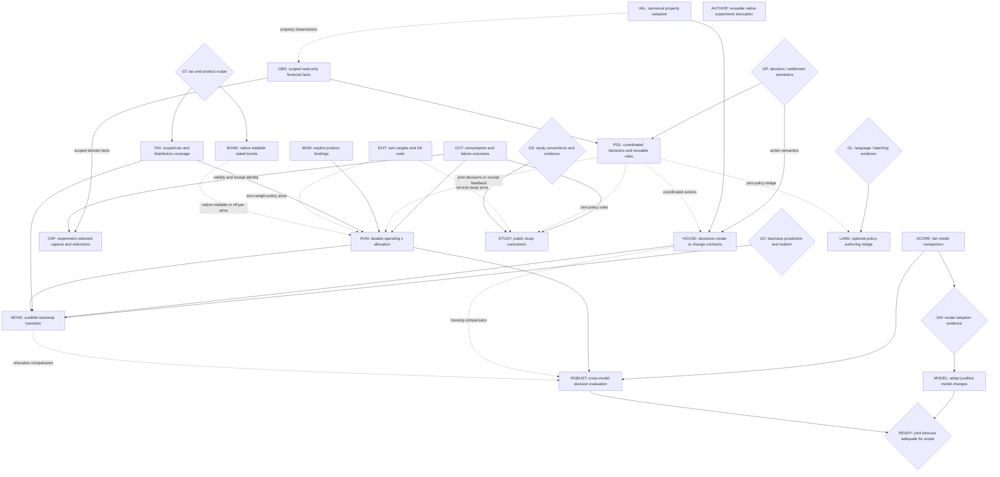

# Augur: experiment-driven modularization

This is the landing plan for a composable financial simulator: an experiment
loads or samples worlds, varies financial decisions, runs the shared mechanics,
and examines distributions and individual timelines. The primary acceptance
case is joint spending-flexibility × allocation planning with supported taxes.
Housing remains a capability; the house-buying web app does not define the library.

Grounded at `devel` `2c5b748072` (2026-09-09). The
[experiment/interface sketches, PR #5859](https://github.com/agentydragon/ducktape/pull/5859)
remain a proposal, not an API to implement wholesale. This plan owns sequencing;
[allocation experiments](allocation_program.md) owns the remaining experiment
questions. Other plans and issues are inputs, not additional prerequisite chains.
Remove entries and edges as their work lands; put proven contracts in `SPEC.md`
and responsibility docstrings beside the implementing modules.

## Destination and stopping conditions

- An author can load named datasets, fit/sample or supply paths, compose a
  financial situation and executable policies, sweep them, and request outcomes
  or a selected trace without importing the app or editing engine policy enums.
- Trinity, flexible-spending and changing-allocation studies are runnable examples
  with explicit conventions and deviations. Offline checks run in CI; sourced
  long-running reproductions remain separately runnable.
- A taxable household experiment starts from actual lots and tax state, pays
  spending through canonical settlement, and reports consumption, cuts,
  shortfalls, taxes and terminal wealth—not merely whether wealth stays positive.
  Private inputs stay downstream. The public acceptance case uses synthetic data.
- Model experiments independently compare predictive behavior and the financial
  decisions models support. A report identifies its evidence, assumptions and
  uncertainty; passing an accounting test does not certify a market forecast.
- Mortgages and multi-agent transfers still work through the same mechanics.
  Existing contracts survive a policy change; experiments need not implement
  optimizing lenders, landlords, or a general-equilibrium economy.

The library milestone includes truthful products/valuation (BIND/VAL), scoped
observations and outcomes (OBS/OUT/CAP), composable decisions (POL/EXIT), and
reusable authoring (AUTHOR), exercised by STUDY and the HOUSE preservation example.
A new experiment must not require a new engine policy variant, app configuration,
transport implementation, or copy of financial mechanics. These are acceptance
areas, not prerequisites for starting every experiment.

The first usable household milestone is **RUN** below, for an explicitly bounded
product/tax/residency scope. The broader decision-support milestone is **ROBUST**,
plus **BOND**, **HOUSE**, and **MOVE** when those capabilities enter the chosen
experiment. A cheaper USD spending tier is not completion of the Europe backstop.
Until that branch is supported or explicitly excluded, relocation remains an
unmet part of the goal.

The forecast goal additionally requires **READY**: a prospective joint
equity/rates/inflation model whose evaluated behavior supports the declared
decision scope. Particular model families are optional; this behavioral gate is
not. Early ROBUST results under limited models do not complete it. If no candidate
passes, keep the modeling gap open and qualify the household report accordingly.

Do not make completion depend on every paper, an institutional-quality label,
exact proprietary forecasts, or proof of perpetual sustainability from finite
data. More horizons, models and stress assumptions can expose uncertainty; they
cannot make it disappear.

## Build on what is already there

`compile_run` already accepts caller-supplied paths and produces one
`ExecutionInput`. Reuse native spending and allocation functions, dynamic purchase
lots, compact consumption receipts, and scoring without simulator outputs.
Historical replay needs no structural-model fit; market sampling is separate from
product construction. These seams still have the limitations below.

Reuse [Trinity](../study/trinity/README.md),
[bounded spending](../x/bounded_spending/README.md),
[bond policies](../x/bond_policies/README.md), and
`study/macro_window/{holdout,mixed_windows,stability}.py` as consumers and controls.
The bond example supplies discount curves and unitizes strategies; it does **not**
make a native `BondHolding` tradable.

## Intended responsibilities

These are module responsibilities, not a demand for new packages, services,
crates, registries or a mandatory interface count. Move existing definitions
only where ownership or a real consumer demands it. Keep short responsibility
docstrings on the resulting modules, as in the interface sketches.

| Building block        | Owns                                                                                                                                                                             | Does not own / current starting point                                                                                                                                                                  |
| --------------------- | -------------------------------------------------------------------------------------------------------------------------------------------------------------------------------- | ------------------------------------------------------------------------------------------------------------------------------------------------------------------------------------------------------ |
| Money and instruments | Currency/quantity precision; product identity, contractual terms and distribution character shared by all consumers.                                                             | Investor strategy or fitted dynamics. Start with `sim/fixed_point.py`, `model/{equity,bond_fund,nominal_bond}.py` and scenario holding types; `BondFundSpec` is still a particular proxy construction. |
| Books and taxes       | Positions/lots, balanced transfers, accumulated filing-unit facts, versioned statutory consequences and payment liabilities; read-only views at an explicit phase and mark time. | Which lifestyle or asset to choose. Reuse `sim/` declarations and Rust accounting/tax execution.                                                                                                       |
| Valuation             | Product-specific valuation from contractual terms, position state and supplied marks, shared by settlement, observations and reporting.                                          | A second position store or a forecast model. Start with the conflicting property valuations; reuse dated-bond math when BOND extends the supported products.                                           |
| Contracts             | Due claims, amortization, origination and termination/payoff consequences.                                                                                                       | Whether to buy, move, refinance or cut spending. Reuse existing mortgage/property lifecycle mechanics.                                                                                                 |
| Data and markets      | Author-named datasets and alignment; model-specific fit/condition/sample functions; explicit bindings from factors to compatible product prices/cashflows.                       | A universal evidence bundle, investor decisions, or settlement. Reuse `finance/evidence`, `fit/` and `model/`; scoring-only models need no product bindings.                                           |
| Policies              | Read-only current observations and path-local memory → proposed budgets, allocation/trades and actions. Common funding/rebalancing rules are executable helpers.                 | Direct book mutation or private copies of tax/trade settlement. Compose the existing native seams; parameter data remains serializable.                                                                |
| Execution and state   | Opening financial facts, scheduling, validated settlement, isolated rollout state and actual receipts.                                                                           | Loading evidence, fitting markets, sweep selection or HTTP requests. Keep the single canonical executor and self-contained prepared input.                                                             |
| Results               | Account/actor-scoped financial measures, experiment-selected reductions, traces and reproduction inputs.                                                                         | A universal objective or every metric ever needed in an engine enum. Reuse event frames and compact capture; app projections sit above them.                                                           |
| Experiment/app shells | Explicit composition, parameter grids, model/policy selection, storage and presentation.                                                                                         | New financial semantics. `study/`, `x/`, downstream code and the web app are peer consumers.                                                                                                           |

Code dependencies point from shells to these blocks, never from settlement into
`product/`, HTTP, datasets or a particular forecast provider. Models and policies
are **compatible, not independent**: an experiment binds the same products,
currencies, timing, prices and payouts on both sides, and unsupported combinations
fail before execution. Use concrete supported types/functions, not a universal
plugin protocol. Presampled markets assume these actors do not move market prices.

## Antipatterns to remove

Paths are relative to `finance/augur/`. Each row names the change that removes it.

| Existing problem and evidence                                                                                                                                                            | Replacement / deletion criterion                                                                                                                                                       | Landing unit             |
| ---------------------------------------------------------------------------------------------------------------------------------------------------------------------------------------- | -------------------------------------------------------------------------------------------------------------------------------------------------------------------------------------- | ------------------------ |
| Product-shaped `Engine` methods require a primary actor and fixed metric slabs; spending observations use `ProductInputs`/`BaseMetrics` (`sim/backend.py`, `rust/engine/spending.rs`).   | Scoped domain facts feed both policy observations and selected capture; app fans/terminal projections consume them. No new study adds an app metric or requests every slab by default. | OBS, CAP                 |
| Compact failure metadata does not identify the unpaid component or contract (`rust/product.rs`).                                                                                         | Domain-owned cause/claim/component identity reconciles to actual receipts; preserve stop books and explicit observation validity.                                                      | OUT                      |
| Property sale escalates from month 0, reporting from purchase month (`rust/engine/property.rs`, `rust/product.rs`).                                                                      | One valuation owner and explicit mark time; settlement and reported gross value agree before separately identified costs, taxes and loan payoff.                                       | VAL                      |
| Native spending/allocation callbacks cannot be composed jointly; target changes still use built-in funding/cash-band/drift heuristics.                                                   | Joint decisions and receipt-aware state use shared scoped observations; reusable heuristics produce requests and canonical execution settles them.                                     | OBS, POL; gate GP        |
| Allocation requires positive targets, making a full exit an invalid input.                                                                                                               | Zero is a supported target, with correct integer-rounded funding, full-exit and redeposit behavior.                                                                                    | EXIT                     |
| Consumption is converted into `ActiveObligation`; chosen spend and existing promises share an all-or-none funding group.                                                                 | Preserve the shared payment machinery, distinguish claim/request/receipt. Do not infer legal commitment from a cash-demand implementation type.                                        | OUT, HOUSE; gate GP      |
| A total-return equity proxy can look like a taxable security, and `SecurityDistribution` treats payouts as interest.                                                                     | Explicit product bindings and supported distribution character; separate price return from payouts for taxed holdings.                                                                 | BIND, TAX                |
| `BondHolding` means par-bought, unmarked and unsellable; a portfolio choice is encoded as an instrument invariant.                                                                       | The same dated position can pay coupons, sell partially, or redeem; hold/sell/roll are choices. Keep the old constant-maturity approximation explicitly labeled.                       | BOND                     |
| Tax surface is narrower than the intended fidelity: single filing status; missing NIIT/qualified-dividend support; no effective-year schedule in `Jurisdiction`.                         | Declared supported-case matrix, dated rules and opening tax state; unsupported relevant cases reject. Existing loss netting/carryforward is not reimplemented.                         | GT, TAX                  |
| Each callable experiment builds JSON/subprocess/CLI plumbing; `CompiledRun.execution_input` exposes an untyped document (`x/allocation_glide/{compare.py,policy.rs}`, `sim/backend.py`). | Reuse preparation/transport/runner helpers with one validated boundary. Authors compose functions and parameters without editing execution dictionaries or copying I/O.                | AUTHOR; optional GL/LANG |
| `x/allocation_sensitivity.py::standard_error_points` uses heuristic historical effective counts and reports "separable" winners.                                                         | Justified uncertainty or explicit refusal to rank; preserve dependence and model limitations.                                                                                          | SCORE                    |

`x/allocation_sensitivity.py` is a deliberately tax-free independent recurrence.
Keep it as a named simplified control if useful; do not promote its answer to a
taxable recommendation or silently change its methodology. The user-facing
experiment **RUN** must use canonical execution.

## Landing DAG

Solid arrows are **content/behavior prerequisites**, not preferred chronology or
overlapping files; dashed arrows apply only to the labeled arms. Unconnected roots
can land independently. Diamonds are decisions with bounded evidence below; a gate
blocks only its outgoing branches.
An empty prerequisite means ready to scope now, not permission to implement all
of this plan in one PR. Several nodes explicitly split into smaller PRs.
For such nodes, an edge consumes the named contract, not every later improvement
under that ID. The acceptance table identifies the first slices.

**Deliberate non-edges:** native POL does
not wait for LANG; STUDY does not wait for TAX; pricing BOND does not wait for a
generative curve or BIND's payout work; RUN/ROBUST do not wait for MODEL or
every study. RUN can begin with generated paths and static allocation varied
between cells. Existing limited models can already expose disagreement. AUTHOR
does not wait for GL/LANG, OBS/CAP or joint policies; shared native I/O is useful
already. EXIT does not wait for GP. OBS initially extracts existing cash/public
holdings/CPI views; adding property observations consumes VAL's corrected values.
CAP can start with separate callbacks and existing capture modes; joint callback
capture consumes POL only when introduced. Experiments may use current output
and invocation APIs while CAP/AUTHOR improve them. These are library acceptance
requirements, not gates on all RUN/STUDY work.

### Small landing units and acceptance

| Unit   | Independently reviewable change(s)                                                                                                                                                                                                                                                                                                                                                          | Evidence required before calling it complete                                                                                                                                                                                                                                                                                                                                                                             |
| ------ | ------------------------------------------------------------------------------------------------------------------------------------------------------------------------------------------------------------------------------------------------------------------------------------------------------------------------------------------------------------------------------------------- | ------------------------------------------------------------------------------------------------------------------------------------------------------------------------------------------------------------------------------------------------------------------------------------------------------------------------------------------------------------------------------------------------------------------------ |
| OUT    | Identify unpaid consumption, contract and tax claims with compact cause/claim/component identity, without inferring legal default from a cash-demand type. Make reporting CPI/base date explicit; domain output ownership belongs to OBS/CAP.                                                                                                                                               | Compact and forensic causes/receipts agree, including failure with remaining house/debt. Preserve actual stop books, observed-only monthly fans, completed-horizon wealth, recorded-through-stop shortfall and policy-component requested/paid parity. No recovery or partial settlement.                                                                                                                                |
| VAL    | Correct mid-horizon property valuation and replace sale/reporting formulas with one calculation using an explicit valuation time. Audit other duplicated valuations as their products enter BIND/BOND, not as prerequisites for this fix.                                                                                                                                                   | Independently calculated purchase/hold/sale cases with a changing pre-purchase index; reported gross value equals executable gross sale value at the same mark time. Reconcile closing costs, payoff and tax basis separately. Correct wrong expectations, then remove the acknowledged mismatch from `rust/docs/product_metrics.md`.                                                                                    |
| OBS    | Extract scoped cash/position/CPI reads from `ProductInputs`/`BaseMetrics`; use them in both existing callbacks and metric capture. Then add known contracts/tax facts needed by GP's first joint consumer. Keep computed views over canonical books, not a second state store.                                                                                                              | An agent with multiple accounts and another actor exposes the declared account/actor/product scope without silently including inaccessible assets. Equal scopes and mark times give equal values in observations and output. Future-path perturbations cannot change a decision; no policy imports product-output machinery.                                                                                             |
| CAP    | First add compact allocation capture using existing execution. Then expose experiment-selected domain facts/receipts and reductions, migrating product-specific `Engine` methods to app adapters. Keep selected traces and compact capture distinct; no universal metric enum.                                                                                                              | Spending and allocation consumers can select holdings, funded consumption, taxes and failure identity by actor/account/component without retaining a dense trace or all base slabs. Compact/trace parity, stable rollout IDs and OUT validity survive. Verify selected capture/transfer with the repository profiler; do not claim the current Python reductions occur in Rust.                                          |
| BIND   | First make proxy/distributing-product semantics explicit and validate held **and purchasable** support at composition. Then supply equity price-return **and dividend-amount paths**, with explicit historical/fitted payout assumptions, coordinated with TAX's supported character slice. Reconcile remaining `typed_series_config.md` work here; do not redo typed keys already present. | A total-return proxy cannot silently become a taxable distributing holding. Missing payouts, incompatible tax character and double-counted total returns reject before execution; legitimate zero payouts remain valid. Price plus payouts reconcile before tax, with timing and provenance. Product terms, construction assumptions and investor strategy have distinct owners; no global registry or universal fitter. |
| POL    | After scoped GP/OBS choices, expose one entrypoint composing budget/allocation functions. Next add receipt-aware state updates. Extract reusable cash-band/funding/rebalance decision helpers as concrete consumers vary those rules; retain trade, lot, tax and payment settlement in the executor.                                                                                        | Joint decisions preserve causal observations and isolated state; one cell can vary both spending and rebalancing behavior without modifying settlement. Two consumers reuse an ordinary rule helper; actual receipts drive execution-dependent state changes. Record meaningful transitions, not closure internals. Full exits are EXIT; compact capture is CAP.                                                         |
| EXIT   | Correct allocation arithmetic to admit zero targets and sell a sleeve completely, separately from callback composition. Keep an all-zero request invalid in this slice; an explicit cash allocation requires its own declared semantics.                                                                                                                                                    | Full-exit sales, zero-weight deposits and later re-entry reconcile units, basis, proceeds and rounding. Cash-flow and drift controls, including sale-to-fund-tax behavior, remain independently checked. No division by zero or implicit liquidation of untargeted accounts.                                                                                                                                             |
| AUTHOR | Extract reusable prepared-input loading/validation and native runner/transport helpers from bounded-spending and allocation-glide consumers. Keep serialized data at one boundary; experiment code uses typed construction and an opaque prepared run, not dictionary surgery.                                                                                                              | Both consumers retain ordinary policy functions and experiment-specific parameters but share I/O machinery. Adding another native policy comparison needs no copied parser/serializer or engine enum. Same original rollout IDs, replay and failure propagation. JSON/subprocess transport may remain; choosing an FFI/batch bridge belongs to GL/LANG.                                                                  |
| TAX    | After GT, land separate supported-case changes: distribution characterization/qualified dividends; NIIT if applicable; calendar/law-year selection and opening year-to-date facts/payment timing; any additional filing/residency gaps actually in scope.                                                                                                                                   | Independently sourced annual-liability examples plus integrated sale-to-fund-spend, reinvestment basis, year-crossing, exemption and tax-payment tests. Compare with a second calculation, not a copy of the engine formula. Reject or exclude unimplemented cases explicitly. No second simulator or universal tax-law DSL.                                                                                             |
| BOND   | Land marking/partial sale for the supported existing nominal-bond slice, then off-par acquisition/accrual treatment separately. First consumer supplies explicit dated sale orders and curve/cashflow inputs; future adaptive POL decisions use the same settlement operation. Reuse `model/nominal_bond.py` and supplied-curve controls.                                                   | One position can sell or mature, with conserved face, correct remaining coupons/basis, and no duplicate principal. Cash, accrued interest and taxable gains reconcile. Remove `BondHolding`'s structural illiquidity doctrine; hold-to-maturity is a policy. Preserve redemption controls and explicit unsupported cases; unitization is not native settlement.                                                          |
| HOUSE  | Separate contract schedules/state from decision functions; first wrap existing mortgage/property lifecycle mechanics in a callable action consumer.                                                                                                                                                                                                                                         | A two-agent financed-purchase/hold/sale example conserves transfers and settles loan payoff and taxes. Changing spend does not cancel a mortgage; rejected purchases leave no half-originated loan. No fractional-ownership or many-agent economy redesign.                                                                                                                                                              |
| STUDY  | Separate PRs for Guyton–Klinger and glide-path consumers. Extend the existing bounded-spending example's outcomes rather than writing it again. Extract policy helpers only when another consumer needs them.                                                                                                                                                                               | Paper-specific success/spending definitions, hand-checkable rule transitions, tax-free controls and documented substitutions. For a smaller first GK spending-only variant, drop unnecessary POL dependency but label it as a variant, not the full portfolio-rule reproduction.                                                                                                                                         |
| RUN    | Public synthetic-lot example plus downstream private composition: a finite spending-anchor/flex × allocation grid on shared paths.                                                                                                                                                                                                                                                          | Canonical taxes/settlement; consumption/cut/default distributions and selected traces; explicit cash reserve, reinvestment, rebalancing and trade-cost assumptions. Static controls agree where conventions match. Optional scope branches are not silently approximated.                                                                                                                                                |
| SCORE  | Reuse existing fitting/scoring and macro-window experiments in an author-wired comparison shell. Resolve allocation-sensitivity's heuristic effective-n uncertainty and "separable" winner claims separately.                                                                                                                                                                               | Same observables, units, transformations, origins and held-out periods; explicit release/revised vintage; marginal and joint/path diagnostics; dependence-aware uncertainty or an explicit refusal to rank. No invented Gaussian density for a sample-only model.                                                                                                                                                        |
| MODEL  | One independently evaluated model/data change per PR, only after GM. Promote existing mixed-window experiments only if their evidence warrants it.                                                                                                                                                                                                                                          | Fit artifact/provenance, held-out comparison and limitations published; no regression in unrelated product construction. Rejecting a candidate is a valid completed experiment. No mandatory all-model rewrite.                                                                                                                                                                                                          |
| ROBUST | Select from RUN's candidate policies under each model, then evaluate all candidates and selected policies on fresh evaluation draws under other models.                                                                                                                                                                                                                                     | Paired differences within each model, separate finite-history/model/parameter uncertainty, no assumed coupling from equal cross-model seeds. Report trade-offs and infeasibility; no automatic scalar utility or forced winner. Include instrument-construction sensitivity, not just sampler sensitivity.                                                                                                               |
| MOVE   | After GX, implement the chosen transition's notice/cost/contract consequences and supported location/FX/tax treatment; then add it to the household example.                                                                                                                                                                                                                                | Before/after books, tax years, currencies and purchasing-power bases reconcile. Trigger, accepted action and resulting spend are distinct. A move cannot retroactively erase existing claims.                                                                                                                                                                                                                            |
| LANG   | Only if GL justifies it, add the narrow measured authoring bridge, one consumer first. Update any language contract explicitly.                                                                                                                                                                                                                                                             | Same decisions, taxes and outcomes as native execution; causal observations and isolated state; measured authoring cost, throughput and memory. Remove superseded machinery atomically. No new parallel financial engine.                                                                                                                                                                                                |

Keep housing/PE/mortgage, double-entry, lot-basis, tax and failure regressions
running throughout. A boundary change updates all callers and relevant
README/SPEC claims in that PR; no transition shims in this monorepo.

## Decision gates

The [tax-coverage checklist](tax_coverage.md) and
[executable policy-timing cases](policy_timing.md) supply evidence and concrete
choices for GT and the remaining GP scope. Separate native callbacks do not settle
joint budget/allocation review, receipt-aware state updates or recovery semantics.
The checklist's [housing-basis mismatch](tax_coverage.md#housing-basis-reconciliation)
is a GT/TAX slice for affected housing arms, not a prerequisite for VAL.

| Gate                                                              | Bounded next step and decision                                                                                                                                                                                                                                                                                                                                                                                                               | What proceeds regardless                                                                                                                                                                                                            |
| ----------------------------------------------------------------- | -------------------------------------------------------------------------------------------------------------------------------------------------------------------------------------------------------------------------------------------------------------------------------------------------------------------------------------------------------------------------------------------------------------------------------------------- | ----------------------------------------------------------------------------------------------------------------------------------------------------------------------------------------------------------------------------------- |
| GP — what can a decision see/do?                                  | For each joint/action consumer, pin observation scope/phase, known contract/tax visibility, proposal ordering and which state changes commit on request versus receipt. Retain opening review and all-or-none settlement initially. Separately choose whether priorities, partial payment, retry or recovery are needed; none is implicit in composition.                                                                                    | VAL, existing OBS extraction, OUT, EXIT and AUTHOR need no new policy semantics. A non-mutating funding/tax preview is added only when a consumer needs it and reuses canonical mechanics.                                          |
| GT — what must be financially faithful first?                     | Inventory downstream-required account/product kinds, tax years, filing status, residency and opening YTD facts without publishing values. Commit a public supported-case matrix with source/independent-oracle cases. For BOND, also resolve clean/dirty price, coupon/accrual dates, sale/redemption ordering, premium/discount tax treatment and unsupported TIPS/credit cases. The owner selects scope; implementation must not guess it. | Tax-free studies, supplied-curve valuation and interface cleanup. NIIT/qualified dividends cannot stay silently absent from a personal comparison that needs them. Future tax law must be an explicit assumption, not a prediction. |
| GS — reproduction or adaptation?                                  | For each study, pin the source/table, accessible data, within-period ordering, rebalancing/withdrawal rules and denominators. If exact inputs or rules are unavailable, resolve the adaptation before labeling the result.                                                                                                                                                                                                                   | Other studies and synthetic rule tests. No need to reproduce proprietary Vanguard paths.                                                                                                                                            |
| GM — which extra market complexity earns its cost?                | Use SCORE to compare simple controls and existing fits before adopting new dynamics. Separate joint equity/rates/inflation, curve shape, regimes, window selection and parameter uncertainty. Set comparison criteria before examining the final holdout; preserve disagreements when evidence cannot select.                                                                                                                                | RUN and ROBUST use explicitly limited current models. A new model need not beat every score, but its adoption must name the improved behavior and trade-off. “Institutional-grade” is not a test.                                   |
| READY — is the market goal actually met?                          | Review held-out multi-horizon behavior of jointly generated equity, rates and inflation, including dependence in adverse paths, persistence, drawdown/shortfall tails, and product returns at the durations in scope. Use ROBUST to test decision consequences, not as substitute evidence for forecast quality. Agree tolerances and acceptable limitations before adoption.                                                                | Exploratory reports remain useful if the gate fails, but must not claim realistic forecast fidelity. Replan the specific failed capability; no family such as regimes, DNS or bootstrap is mandatory merely by name.                |
| GX — what is the Europe backstop?                                 | Owner chooses destination/residency assumptions, notice/reversibility and whether a staged sensitivity bound is useful before full treatment. Identify required FX, local inflation, moving costs, housing and cross-border taxes. A bounded approximation must be labeled as such, not a realistic relocation path.                                                                                                                         | Domestic tiers and a domestic household report; no invented foreign tax rules or claim that one CPI represents both locations.                                                                                                      |
| GL — Rust functions, batch bridge, or another execution boundary? | Profile existing bounded-spending and taxable-lot workloads with the repository profilers; isolate sampling, preparation, transfer, policy evaluation, settlement and capture. Distinguish duplicated I/O solved by AUTHOR from the cost of writing policies in Rust. Probe a batched callback only if that remaining friction warrants it; agree representative workload and latency/memory budgets before choosing.                        | AUTHOR and native POL/STUDY/RUN. Keep Rust if the bridge adds little value; change the boundary if evidence favors it. Neither a blanket Python rollback nor keeping every component in Rust is predetermined.                      |

Market research candidates already tracked include
[joint equity/macro #5487](https://github.com/agentydragon/ducktape/issues/5487),
[regimes #5488](https://github.com/agentydragon/ducktape/issues/5488),
[resampling #5510](https://github.com/agentydragon/ducktape/issues/5510), and
[muni curves #5835](https://github.com/agentydragon/ducktape/issues/5835).
Data availability and ragged history are gates, not reasons to silently discard
early equity history or treat one muni index yield as an entire curve.

The two-point Treasury curve still clamps beyond ten years in
`model/bond_fund.py`. [#5834](https://github.com/agentydragon/ducktape/issues/5834)
was closed without a recorded reason or implementing commit. **GM must resolve
whether to pursue that proposed direction**, not infer that it shipped or reopen
it automatically. Deterministic discounting, observed curve interpolation,
real-world forecasts and risk-neutral valuation are distinct tasks; none requires
all the others to be solved first.

## What to dispatch first

1. Land **VAL**'s property correction, **OBS**'s existing-view extraction and
   **AUTHOR**'s shared native invocation independently. None needs a tax-scope or
   language decision. **EXIT** and CAP's compact-allocation slice are also ready
   against the separate callbacks; they do not wait for joint-policy design.
2. Scope **OUT**'s cause-identity remainder.
   Run **GP**, **GT**, and **GS** as bounded decisions alongside implementation.
   Define BIND's product validation/payout cases against existing consumers;
   unsupported-composition rejection need not wait for all payout/tax machinery.
3. Use OBS and the scoped GP answer for **POL**; use domain observations and OUT's
   validity/receipt contract for CAP's selected-output migration. Keep **SCORE**
   independent, reusing runnable holdouts. Start **RUN** as soon as its declared
   financial scope is supported; broaden by adding branches rather than waiting
   for every library/API improvement.

GL is a probe when policy authoring becomes the bottleneck, not a requirement to
benchmark every language before continuing. Complete-checkpoint continuation and
nested forecast-feedback policies are a later branch: first prove that a resumed
run preserves pending contracts, tax state, reporting basis and policy memory.
They are not needed for the initial spending/allocation or cross-model study.

Likewise, new property-media storage, mortgage UI redesign, prediction-market
calibration expansion and a general experiment framework are not prerequisites.
Keep their useful work independently reviewable; do not let the old app agenda
define the critical path again.
