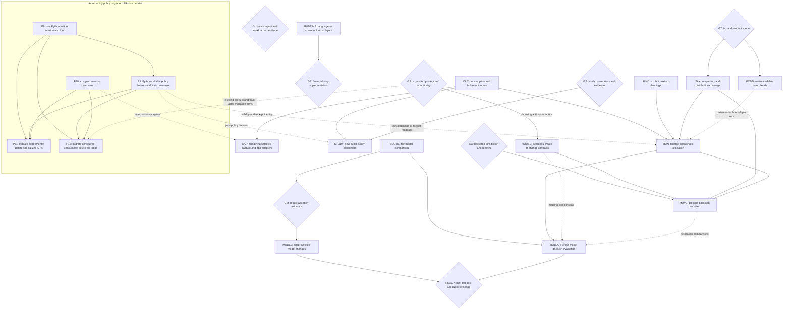

# Augur: experiment-driven modularization

This is the landing plan for a composable financial simulator: an experiment
loads or samples worlds, varies financial decisions, runs the shared mechanics,
and examines distributions and individual timelines. The primary acceptance
case is joint spending-flexibility × allocation planning with supported taxes.
Housing remains a capability; the house-buying web app does not define the library.

Grounded at `devel` `003a9bee96` (2026-09-09). The
[experiment/interface sketches, PR #5859](https://github.com/agentydragon/ducktape/pull/5859)
remain a proposal, not an API to implement wholesale. This plan owns sequencing;
[allocation experiments](allocation_program.md) owns the remaining experiment
questions. Other plans and issues are inputs, not additional prerequisite chains.
Remove entries and edges as their work lands; put proven contracts in `SPEC.md`
and responsibility docstrings beside the implementing modules.

## Destination and stopping conditions

- An author can load named datasets, fit/sample or supply paths, compose a
  financial situation and executable policies, sweep them, and request outcomes
  or a selected trace without importing the app or editing engine policy enums.
- Trinity, flexible-spending and changing-allocation studies are runnable examples
  with explicit conventions and deviations. Offline checks run in CI; sourced
  long-running reproductions remain separately runnable. Exercise runnable examples
  through Bazel in CI, using deterministic generated financial inputs where source
  data is private, unavailable or too costly for routine runs. Cover the documented
  entrypoint where practical, real policy/execution code and meaningful financial
  assertions. Label these offline controls separately from sourced reproductions.
- A taxable household experiment starts from actual lots and tax state, pays
  spending through canonical settlement, and reports consumption, cuts,
  shortfalls, taxes and terminal wealth—not merely whether wealth stays positive.
  Private inputs stay downstream. The public acceptance case uses synthetic data.
- Model experiments independently compare predictive behavior and the financial
  decisions models support. A report identifies its evidence, assumptions and
  uncertainty; passing an accounting test does not certify a market forecast.
- Mortgages and multi-agent transfers still work through the same mechanics.
  Existing contracts survive a policy change; experiments need not implement
  optimizing lenders, landlords, or a general-equilibrium economy.

The near-term policy milestone is **one batch action interface and Python-controlled
outer loops everywhere**, including examples, benchmarks and the app. A Python
`run(...)` convenience function uses the same session as an experiment-owned loop.
The executor owns financial phase ordering, settlement, taxes and state transitions;
the caller advances between decision opportunities, not individual accounting rules.
P9 exposes this session, P11 migrates specialized experiments and removes their APIs,
and P12 cuts over configured consumers and removes the remaining Rust-owned rollout
loops. Native policy-loop migration is not an additional intermediate milestone.

RUNTIME/GE decide the implementation **inside a financial step**: Rust, Python or
Python with native kernels. They do not gate Python orchestration or interface
convergence. GL evaluates the chosen batch representation and workload costs;
an unacceptable measurement requires bounded revision, not a parallel policy API.

The broader library milestone also includes truthful products (BIND), remaining
outcome/capture work (OUT/CAP), new STUDY consumers and the HOUSE
action example. The migration preserves existing housing and other supported mechanics;
they do not complete adaptive housing purchases, native tradable bonds, expanded
tax coverage, relocation or market-model improvements.
A new experiment must not require a new engine policy variant, app configuration,
transport implementation, or copy of financial mechanics. These are acceptance
areas, not prerequisites for starting every experiment.

The first usable household milestone is **RUN** below, for an explicitly bounded
product/tax/residency scope. The broader decision-support milestone is **ROBUST**,
plus **BOND**, **HOUSE**, and **MOVE** when those capabilities enter the chosen
experiment. A cheaper USD spending tier is not completion of the Europe backstop.
Until that branch is supported or explicitly excluded, relocation remains an
unmet part of the goal.

The forecast goal additionally requires **READY**: a prospective joint
equity/rates/inflation model whose evaluated behavior supports the declared
decision scope. Particular model families are optional; this behavioral gate is
not. Early ROBUST results under limited models do not complete it. If no candidate
passes, keep the modeling gap open and qualify the household report accordingly.

Do not make completion depend on every paper, an institutional-quality label,
exact proprietary forecasts, or proof of perpetual sustainability from finite
data. More horizons, models and stress assumptions can expose uncertainty; they
cannot make it disappear.

## Build on what is already there

`compile_run` already accepts caller-supplied paths and produces one
`ExecutionInput`. Reuse native spending and allocation functions, dynamic purchase
lots, compact consumption receipts, and scoring without simulator outputs.
Historical replay needs no structural-model fit; market sampling is separate from
product construction. Reuse scoped cash/public holdings in `rust/holdings.rs`,
borrowed actor books/claims in `rust/engine/observations.rs`, purchase-anchored
property marks in `rust/property.rs`, and shared native invocation
in `rust/invocation.{py,rs}`. Private `RolloutState` already owns initialized books,
contracts, tax state, capture and the month/stop cursor. Native full-run and
single-month advancement share one evaluator, with immutable input/product context
borrowed only for execution rather than retained in financial state. Shared
monthly preparation and closing are extracted; the Python spending-session bridge
has landed without a second evaluator. Its bounded-spending Python consumer and
scalar-adapter/batch-authored comparison are also available; their measured scope
and limitations are recorded in `debug/augur_python_policy_batches_20260909.md`
at the repository root. They do not decide GL or GE. Actor books
expose originated mortgages and known tax facts;
opening review still precedes claim assembly. `rust/engine/claims.rs` separately
assembles configured, recurring, property/mortgage and tax demands without
funding or payment. Exact-lot trade execution in `rust/engine/trades.rs` now shares
canonical gains, basis and receipts across configured callers. Explicit claim
payments and consumption in `rust/engine/payments.rs` share canonical posting;
the configured full-run control still groups their funding. The native ordered
batch actor loop in `rust/engine/actors.rs` now observes after cashflows/claims,
executes caller-ordered actions without implicit funding, and preserves successful
prefixes when one rollout stops. It retains forensic output; compact capture and
the supported Python action surface remain separate work. `rust/allocation.rs`
and `rust/engine/target_allocation.rs` support selected zero targets, exact
integer-rounded funding and full exits, including rounded-zero lot dust. An
all-zero target vector remains invalid; product-shell exclusion is still distinct
from a selected core zero target.

Strategy-independent account/asset pool declarations are now explicit in
`ExecutionInput`; `ActorBooks` exposes these pools and current public prices even
before the first purchase. The cash-only purchase example and tests are present.
P9 therefore has no remaining declaration prerequisite.

The runnable `x/monthly_actions` CLI and its synthetic financial assertions run in
CI. It is a consumer to migrate to Python in P9, not another permanent native runner.

Reuse [Trinity](../study/trinity/README.md),
[bounded spending](../x/bounded_spending/README.md),
[bond policies](../x/bond_policies/README.md), and
`study/macro_window/{holdout,mixed_windows,stability}.py` as consumers and controls.
The bond example supplies discount curves and unitizes strategies; it does **not**
make a native `BondHolding` tradable.

## Intended responsibilities

These are module responsibilities, not a demand for new packages, services,
crates, registries or a mandatory interface count. Move existing definitions
only where ownership or a real consumer demands it. Keep short responsibility
docstrings on the resulting modules, as in the interface sketches.

| Building block        | Owns                                                                                                                                                                                                | Does not own / current starting point                                                                                                                                                                  |
| --------------------- | --------------------------------------------------------------------------------------------------------------------------------------------------------------------------------------------------- | ------------------------------------------------------------------------------------------------------------------------------------------------------------------------------------------------------ |
| Money and instruments | Currency/quantity precision; product identity, contractual terms and distribution character shared by all consumers.                                                                                | Investor strategy or fitted dynamics. Start with `sim/fixed_point.py`, `model/{equity,bond_fund,nominal_bond}.py` and scenario holding types; `BondFundSpec` is still a particular proxy construction. |
| Books and taxes       | Positions/lots, balanced transfers, accumulated filing-unit facts, versioned statutory consequences and payment liabilities; read-only views at an explicit phase and mark time.                    | Which lifestyle or asset to choose. Reuse `sim/` declarations and Rust accounting/tax execution.                                                                                                       |
| Valuation             | Product-specific valuation from contractual terms, position state and supplied marks, shared by settlement, observations and reporting.                                                             | A second position store or a forecast model. Reuse `rust/property.rs` and dated-bond math as BIND/BOND extend the supported products.                                                                  |
| Contracts             | Due claims, amortization, origination and termination/payoff consequences.                                                                                                                          | Whether to buy, move, refinance or cut spending. Reuse existing mortgage/property lifecycle mechanics.                                                                                                 |
| Data and markets      | Author-named datasets and alignment; model-specific fit/condition/sample functions; explicit bindings from factors to compatible product prices/cashflows.                                          | A universal evidence bundle, investor decisions, or settlement. Reuse `finance/evidence`, `fit/` and `model/`; scoring-only models need no product bindings.                                           |
| Policies              | Actor-observable information and path-local memory → economic action requests. Budgets, target weights and funding/rebalancing/lot-selection algorithms belong inside policies or optional helpers. | Direct book mutation or private settlement. Python authors the batch policy; measured native calculation kernels are optional. The engine does not silently choose extra trades.                       |
| Execution and state   | Opening financial facts, scheduling, validated execution/settlement, isolated rollout state and actual results; financial steps behind the common Python-controlled session.                        | Actor strategy, outer rollout loops, evidence loading, market fitting, sweep selection or HTTP. Enforce contracts and explicit standing instructions; keep financial state in the canonical executor.  |
| Results               | Account/actor-scoped financial measures, experiment-selected reductions, traces and reproduction inputs.                                                                                            | A universal objective or every metric ever needed in an engine enum. Reuse event frames and compact capture; app projections sit above them.                                                           |
| Experiment/app shells | Explicit composition, Python-controlled decision loops, parameter grids, model/policy selection, storage and presentation.                                                                          | New financial semantics or a separate app executor. `study/`, `x/`, downstream code and the web app are peer consumers of the same action session.                                                     |

Code dependencies point from shells to these blocks, never from settlement into
`product/`, HTTP, datasets or a particular forecast provider. Models and policies
are **compatible, not independent**: an experiment binds the same products,
currencies, timing, prices and payouts on both sides, and unsupported combinations
fail before execution. Use concrete supported types/functions, not a universal
plugin protocol. Presampled markets assume these actors do not move market prices.
Spending-tier ladders and their transition rules belong in experiment policy code,
not a central structured ladder policy or engine-owned fallback.

The [actor-facing interface plan](policy_interfaces.md) specifies the proposed
observation/action loop and module docstrings. Its economic boundary is agreed;
one batch-shaped policy function is also settled. An optional scalar-to-batch
helper uses that same interface. Exact batch layout, adapter cost and usability
remain decisions for GL. The first household example's monthly timing is
settled in [the timing contract](policy_timing.md). GP gates expanded product/housing
and cross-actor timing, not the initial ordered-action integration.

## Antipatterns to remove

Paths are relative to `finance/augur/`. Each row names the change that removes it.

| Existing problem and evidence                                                                                                                                                                        | Replacement / deletion criterion                                                                                                                                                                                                          | Landing unit        |
| ---------------------------------------------------------------------------------------------------------------------------------------------------------------------------------------------------- | ----------------------------------------------------------------------------------------------------------------------------------------------------------------------------------------------------------------------------------------- | ------------------- |
| Product-shaped `Engine` methods require a primary actor and fixed metric slabs (`sim/backend.py`); known contract/tax views are not yet selected domain capture.                                     | Extend scoped facts and compact session outcomes; app projections consume selected domain outputs. No new study requires every product slab.                                                                                              | P10, CAP            |
| Compact failure metadata does not identify the unpaid component or contract (`rust/product.rs`).                                                                                                     | Domain-owned cause/claim/component identity reconciles to actual receipts; preserve stop books and explicit observation validity. P10 uses landed payment/claim identities for action-session results; OUT covers existing-run reporting. | OUT, P10            |
| Native spending/allocation callbacks cannot be composed jointly; target changes still invoke engine-owned funding/cash-band/drift and lot-selection heuristics (`rust/engine/target_allocation.rs`). | Actor observations → concrete trades/payments → results; optional sleeve helpers produce proposals. Migrate all callers of each replaced API and remove implicit public-portfolio strategy from execution input.                          | P8–P9, P11–P12; GP  |
| Configured settlement still groups consumption requests and existing claims under all-or-none funding.                                                                                               | Distinguish consumption requests, due claims, payment actions and receipts. Contracts generate claims; actors choose funding/payment. Current grouping is a named control, not the target API.                                            | P12, OUT, HOUSE; GP |
| A total-return equity proxy can look like a taxable security, and `SecurityDistribution` treats payouts as interest.                                                                                 | Explicit product bindings and supported distribution character; separate price return from payouts for taxed holdings.                                                                                                                    | BIND, TAX           |
| `BondHolding` means par-bought, unmarked and unsellable; a portfolio choice is encoded as an instrument invariant.                                                                                   | The same dated position can pay coupons, sell partially, or redeem; hold/sell/roll are choices. Keep the old constant-maturity approximation explicitly labeled.                                                                          | BOND                |
| Tax surface is narrower than the intended fidelity: single filing status; missing NIIT/qualified-dividend support; no effective-year schedule in `Jurisdiction`.                                     | Declared supported-case matrix, dated rules and opening tax state; unsupported relevant cases reject. Existing loss netting/carryforward is not reimplemented.                                                                            | GT, TAX             |
| Scalar spending/allocation APIs, `PrototypeSpendingSession` and native `actors::simulate` overlap; configured full-run controls still own the loop.                                                  | One Python batch action session; replace callers and delete specialized APIs/loops in the same migration slice. RUNTIME does not postpone deletion.                                                                                       | P9, P11–P12         |
| The bounded annual spending rule exists in Rust, scalar Python and batch Python; actor/grouped runners separately project payment receipts.                                                          | Keep alternate rule implementations only as explicitly isolated, actively used comparison controls. Reuse canonical payment identities and capture; no new independent interpretation of financial outcomes.                              | P10–P11; GL         |
| `x/allocation_sensitivity.py::standard_error_points` uses heuristic historical effective counts and reports "separable" winners.                                                                     | Justified uncertainty or explicit refusal to rank; preserve dependence and model limitations.                                                                                                                                             | SCORE               |

`x/allocation_sensitivity.py` is a deliberately tax-free independent recurrence.
Keep it as a named simplified control if useful; do not promote its answer to a
taxable recommendation or silently change its methodology. The user-facing
experiment **RUN** must use canonical execution.

## Landing DAG

Solid arrows are **content/behavior prerequisites**, not preferred chronology or
overlapping files; dashed arrows apply only to the labeled arms. Unconnected roots
can land independently. Diamonds are decisions with bounded evidence below; a gate
blocks only its outgoing branches.
An empty prerequisite means ready to scope now, not permission to implement all
of this plan in one PR. Several nodes explicitly split into smaller PRs.
For such nodes, an edge consumes the named contract, not every later improvement
under that ID. The acceptance table identifies the first slices.

**Deliberate non-edges:** RUNTIME/GE have no edge to P9, P11 or P12: they can revise
step internals without reopening Python loop ownership. GL's workload checks are
acceptance work alongside migration, not a prerequisite research program. A failed
cost check blocks only the affected workload's cutover until bounded revision;
correctness failures always block the affected change.

P9's strategy-independent declarations have landed. Policies can submit exact
actions without waiting for portfolio helpers or P10's compact output. Remaining
P8 follows P9 so each shared helper lands with a real Python action consumer, not
another Rust-only intermediate API. P11 and P12 consume the helpers and compact capture, and proceed independently of each
other. GP gates only P12's additional product/multi-actor cases. Port the already
supported public case first; explicitly scope missing existing capabilities before
migrating housing/private-equity consumers. New adaptive HOUSE/BOND capabilities
are not prerequisites for preserving existing behavior. P10 proceeds without P9.
P8 can be scoped/stacked once P9's observation/action contract is specified; do not
wait just for a merge. Overlap is not a gate.

OUT and CAP's existing-native-output improvements can
proceed separately; only CAP's labeled contract/tax or actor-session capture arms
reuse existing actor views and consume P10. P10 owns the bounded session-capture requirement, not CAP's whole
app/general-output redesign. OUT supplies existing-run cause reporting; P10
supplies action-session results using landed payment/claim identities without
waiting for that reporting migration.
Reuse their domain identities rather than creating parallel claim vocabularies.

STUDY does not wait for TAX or every consumer's Python migration. New policy-loop
consumers use P9 when available; do not add another specialized runner. P11 migrates executable examples;
P12 migrates configured controls; STUDY adds paper-specific consumers. RUN can
begin with current APIs, supported taxes, supplied paths and static allocation
varied between cells; reuse P11's joint shell when available. Neither P11 nor P12
certifies RUN's broader tax/residency scope. Pricing BOND does not wait for a
generative curve or BIND's payout work. RUN/ROBUST do not wait for MODEL or every
study; existing limited models can already expose disagreement.

### Converge the Python policy boundary now

The [interface plan](policy_interfaces.md) defines the destination: actor-visible
observations, executable policies, economic actions and execution results.
Wrapping today's amount/weight callbacks is a language probe, not completion of
that boundary. P8 moves strategy into optional policy-callable helpers; GP and
BOND/HOUSE define the scoped action/execution contracts.

The landed spending-control probe uses Rust-owned financial state and batched
transfer through the existing Python extension. P9 reuses this transport for the
general action session, initially retaining Rust step internals; GE may revise
those internals later, without changing who owns the loop.
No per-month subprocess or Python callback per path on Rust workers. Transfer
selected observations, responses and results; prepared paths and
books stay in Rust. The sole policy callable accepts and returns batches. GL
compares an optional scalar-to-batch helper against directly batch-authored
functions using that same engine interface. Data layout and costs remain open,
not the number of supported policy function shapes.

Retained `RolloutState` stepping already shares the native full-horizon machinery.
Owned books are separate from borrowed immutable execution context, so an extension
session can own its lifetime without duplicating books or the evaluator.
The Python consumer ports the existing bounded-spending rule, retaining opening-month review and all-or-none settlement
**as parity controls**, not freezing the actor API at that phase. Moving today's
allocator to an opening callback would miss later cashflows and claims; the native
actor loop already observes after both. Preserve that phase when exposing it to Python.

Keep exact currency units, scoped facts and explicit completed/stopped status.
Original actor/path/decision identities are runner routing, not economic
observations. Policy memory is actor/path-local; execution-dependent updates use
actual results. Batch/chunk ordering must not change independent paths' decisions
or outcomes, and stopped paths receive no later calls.

Before measuring, agree representative rollout counts, horizons, tax-free and
supported taxable-lot cases, and acceptable latency/memory budgets. Use repository
profilers to separate preparation, transfer, Python policy work, settlement and
capture; compare authoring effort as well as cost. Use the simplest existing typed
batch representation for P9, then use GL to identify bounded revisions for actual
consumers. Do not wait for a best-possible representation or the language comparison
before replacing overlapping APIs. A fast amount-only probe is not acceptance of
the whole action boundary. Python policy authoring and loop ownership are settled;
a whole-engine Python rewrite is not.

This probe needs in-memory continuation, not serialized checkpoints, forkable
worlds, nested forecasts or a general plugin/action framework. It adds no tax or
settlement implementation in Python.

### Executor-language reevaluation

The [recorded benchmark baselines](../rust/benchmark/README.md) compare Rust dense
and compact runs from different workload revisions. They do not isolate Python
versus Rust, or prove that removing padded variable-length outputs accounts for
the earlier speedup. Audit available historical measurements before drawing that
conclusion; attribution may remain unresolved even after choosing a better design.

RUNTIME separates language, execution strategy and output representation:

- Use matching financial cases, supplied paths, policy decisions, precision and
  required outputs. Begin with a representative supported lots/tax/payment slice,
  including heterogeneous event counts and early stops; state coverage limits.
- Within each implementation, compare shape-constrained/padded side outputs with
  variable-length recording on the same slice. Then compare Python and Rust with
  equivalent execution/output work. If not all comparison cells are feasible,
  identify the confounding rather than attribute the residual to language.
- Measure no-trace execution, compact results and full event capture separately.
  Dropping outputs is not a same-output layout improvement. Also distinguish
  interpreted Python, array/JIT execution and native kernels; batch-friendly
  numeric state need not force ragged events into one rectangular shape.
- Reuse existing benchmark inputs and real profilers. Control hardware, threads,
  paths and workloads; report cold/JIT/build cost, warm execution, peak memory,
  recording, serialization/FFI transfer and end-to-end notebook cost separately.
- Exercise a concrete notebook edit/run/debug workflow for policies and calculators.
  Include two-language maintenance/build/deployment cost, not just rollout speed.

This is a bounded research prototype, not a second supported financial engine or
revival of deleted production code. Check financial parity before timing and do
not extrapolate a simplified slice to unsupported products. GE can retain Rust
financial-step execution, choose Python with small native hot kernels, or choose
Python step execution. All choices retain Python-controlled outer loops.
Any migration needs an explicit replacement plan and removal of duplicate
implementations. The actor/environment boundary and one canonical set of financial
mechanics survive whichever language is chosen.

### Policy-interface PRs and acceptance

Policy-prefixed names are task IDs, not GitHub PR numbers or a demand to serialize the work.
Each row is one independently reviewable change. Split again if a row proves too
large, preserving the named completion condition and atomic caller updates.
The **Needs** column names immediate prerequisites; inherited prerequisites still
apply. P9 is ready on landed declarations; P8 consumes its Python action contract,
then P11/P12 consume the helpers. No convergence node waits for RUNTIME/GE.

| Unit                                                    | Independently reviewable change                                                                                                                                                                                                                                                                                                                                                          | Needs                             | Evidence required before calling it complete                                                                                                                                                                                                                                                                                                                             |
| ------------------------------------------------------- | ---------------------------------------------------------------------------------------------------------------------------------------------------------------------------------------------------------------------------------------------------------------------------------------------------------------------------------------------------------------------------------------- | --------------------------------- | ------------------------------------------------------------------------------------------------------------------------------------------------------------------------------------------------------------------------------------------------------------------------------------------------------------------------------------------------------------------------ |
| P8 — Python-callable policy helpers                     | Shared cash-band, sleeve withdrawal/deposit/rebalance and lot-selection functions are ordinary Python-callable library helpers, implemented in Python by default. Split by calculation and land each with a real Python action consumer on P9; no Rust-only helper extraction prerequisite.                                                                                              | P9                                | Notebook policy code imports and calls helpers without rebuilding Rust. Proposals do not execute; the caller can compose or ignore them. Exact rounding, zero targets/full exits, invalid bounds and quantity-scale tests remain. Run actual consumer CLI tests with synthetic inputs. A native kernel needs measured justification and the same Python-facing contract. |
| P9 — one Python action session                          | Expose the existing actor mechanics as a batch `start/advance` session through the existing extension. Python owns the loop and optional `run(...)`. Port `monthly_actions` and its actual CLI tests; replace its native callback runner rather than keeping both. Expose the current lot, price, quantity-scale and cash facts needed by Python helpers, not native policy calculators. | —                                 | Ordered-action, fatal-stop, tax/basis, exact-cash and selected/reordered replay tests exercise the Python loop. Native tests may call the same step primitives, not maintain another production driver. Keep financial state/paths in the step executor; no per-month subprocess. The spending-only prototype has a named P11 retirement, not another adoption path.     |
| P10 — compact session outcomes                          | Provide population-scale consumption, taxes, holdings and failure results without every trace; retain selected detailed replay. Reuse canonical payment receipts/claim identities for actor and configured reporting. This is the bounded session slice, not all of CAP.                                                                                                                 | —                                 | Compact and forensic modes share execution; request/result identity, actor/account/component scope, explicit validity and compact/trace agreement hold. Stop books remain intact; post-stop padding is not observed data. Profile selected capture and transfer.                                                                                                         |
| P11 — migrate experiments and delete specialized APIs   | Move bounded-spending and allocation-glide to Python batch actions/helpers, in independently landable caller migrations. Replace the spending-only Python prototype and delete the native amount/weight callbacks, obsolete policy binaries and their plumbing as their last callers migrate. Then demonstrate joint spending-flex × allocation on shared paths.                         | P8, P9, P10                       | Runnable synthetic CLI tests report distributions and selected traces; rules vary without engine edits. Preserve declared study conventions or explicitly test/document timing changes. No specialized session/callback callers remain. Rule implementations used only for active benchmarking are isolated controls, not alternate library APIs.                        |
| P12 — migrate configured consumers and delete old loops | Move Trinity, bond examples, benchmarks and the app to the same Python session and explicit policies. Land supported public-consumer slices first; extend the common action path only for capabilities existing housing/PE/multi-actor callers require. Remove old full-run entrypoints, allocator orchestration and policy schema fields with their last callers.                       | P8, P9, P10; GP for expanded arms | All actual simulation outer loops are Python-controlled, including app/high-N runs. Rust retains step mechanics/kernels, not a parallel driver. Preserve existing financial capabilities and explicitly resolve phase/grouped-funding differences; no silent behavior change or compatibility runner. No new adaptive housing, tax or market capability is implied.      |

### Shared helpers: Python first, with consumers

P8's first slice ports the small cash-band proposal and its boundary tests into
Python and uses it in P9's Python monthly-actions example. The Rust-only proposal
extraction in [#6002](https://github.com/agentydragon/ducktape/pull/6002) is superseded,
not a dependency or a reason to add a binding for a few comparisons/subtractions.

Then port sleeve withdrawal/deposit/rebalance and scoped lot-selection calculations
with their first consuming policies. A new helper must be importable from Python
and used by a runnable/tested experiment in the same slice; tests alone or a Rust
example about to be removed are not the consumer. Scope lot selection by account,
asset and economic units: do not expose the existing mixed-scale raw-quantity PE
behavior as a generic helper contract. Correct wrong math with independent checks.

These are policy calculations, not Python reimplementations of tax or settlement.
Use exact money/quantity semantics; preserve financial-step admission and posting
in the canonical executor. Only retain/add native calculation kernels after a
representative profile establishes a need, behind the same Python-callable surface.
RUNTIME is not required to move these small policy calculations to Python.

P11/P12 replace remaining callers of the corresponding old Rust calculations and
delete each when its last legacy caller migrates. If a Python port temporarily
coexists with a calculation needed by the old configured runner, name those exact
remaining callers and its P11/P12 deletion slice in the migration PR; do not add
new callers, a second supported helper API, or reverse Python callbacks from that
runner just to bridge the transition. The end state has one maintained helper
implementation, not Python/Rust twins. BIND's broader product/payout work remains
separate from the already-landed pool declarations.

Current legacy readers make that retirement concrete:

- `engine/target_allocation.rs` owns inline cash-band strategy and calls sleeve
  withdrawal/deposit/rebalance calculations: P12 removes those configured callers.
- `trades::select_fifo` serves target allocation, `engine/securities.rs` scheduled
  sales and `engine/private_equity.rs` recovery/forced/tender flows: their respective
  P12 public/expanded-product migrations remove the legacy selection strategy.
- `allocation::quantity_for_value` serves target allocation and the cash-only
  monthly-actions example. P9 must bring the minimal exact Python-callable quantity
  calculation with that first consumer (reuse existing fixed-point code where
  applicable), without waiting for broader P8. P12 removes its remaining configured
  Rust reader. This is not a reason to bind the whole native policy module.

P12 must also preserve the product shell's explicit exclusion authority: its current
zero weight means "do not sell this holding", whereas a zero target in a selected
core portfolio means "exit this sleeve". Make exclusion and target weight distinct
when migrating that shell; do not silently turn an excluded holding into a sale.

### Deletion checkpoints, not another interface family

- **P9:** replace `engine::actors::simulate` and the native monthly-actions driver
  with one session plus Python orchestration. A native single-step unit-test harness
  is not a supported alternative rollout runner.
- **P11:** retire `engine::{spending,allocation}` callback entrypoints,
  `spending::batch::Session` / `PrototypeSpendingSession`, their binding exports,
  callback slots in `advance_month`, and specialized experiment binaries as their
  callers move. This includes `x/bounded_spending/profile.py`,
  `rust/test_invocation.py` and their BUILD/runfiles references, not just study CLIs;
  these consumers do not wait under P12's general benchmark migration.
  Use P8's Python-callable calculations; remove old Rust versions as their named
  remaining callers migrate. No permanent Rust/Python helper copies. Benchmark-only variants survive only with
  a named active comparison and parity tests, and leave when that comparison ends.
  This exception permits calculator controls, not retired full-run/prototype drivers.
- **P12:** remove configured full-run Rust/Python entrypoints and the old implicit
  allocator/grouped-payment orchestration. The app can retain projections over
  common outputs, not a private simulation interface. Delete each superseded path
  in its last caller's migration PR, not a later cleanup campaign.

Old opening-month/all-or-none controls and the post-claims action contract are not
interchangeable wrappers. Pin expected decisions and paid outcomes for each moved
consumer, explain intentional differences, and reject accidental drift. Existing
housing/PE consumers remain on the explicitly tracked P12 branch until their
required actions and timing are supported; they do not delay the public-experiment
deletions. Keep any independent study recurrence as a labeled mathematical control,
not a second financial executor.

Completion requires both the joint Python experiment and the app on the same
session, with no old specialized policy APIs or Rust-owned production rollout loops.
Passing through P9 while leaving its predecessors indefinitely alive is not completion.

### Other landing units and acceptance

| Unit    | Independently reviewable change(s)                                                                                                                                                                                                                                                                                                                                                          | Evidence required before calling it complete                                                                                                                                                                                                                                                                                                                                                                             |
| ------- | ------------------------------------------------------------------------------------------------------------------------------------------------------------------------------------------------------------------------------------------------------------------------------------------------------------------------------------------------------------------------------------------- | ------------------------------------------------------------------------------------------------------------------------------------------------------------------------------------------------------------------------------------------------------------------------------------------------------------------------------------------------------------------------------------------------------------------------ |
| RUNTIME | Audit historical speedup evidence and run the matched language/execution/output-layout comparison above, using a bounded prototype and existing inputs. No production executor switch in this slice.                                                                                                                                                                                        | Independently checked financial parity and stated feature coverage; record which comparison cells actually ran. Distinguish language, JIT/vectorization, recording layout and output volume; publish profiling and notebook/maintenance evidence for GE. No unsupported whole-engine speed claim or permanent second evaluator.                                                                                          |
| OUT     | Identify unpaid consumption, contract and tax claims in existing-run compact reporting. Reuse landed payment/claim/component identities as P10 adds action-session results; make reporting CPI/base date explicit.                                                                                                                                                                          | Compact and forensic causes/receipts agree, including failure with remaining house/debt. Preserve actual stop books, observed-only fans, completed-horizon wealth, recorded-through-stop shortfall and requested/paid parity. No recovery or partial settlement.                                                                                                                                                         |
| CAP     | Remaining experiment-selected domain facts/reductions and migration of product-specific `Engine` output methods to app adapters. Reuse P10 for actor-session capture; existing native-output improvements can land independently. Keep selected traces and compact capture distinct.                                                                                                        | Actor/account/component selection without every base slab, stable path IDs and OUT validity. Richer contract/tax capture uses existing actor views. Verify transfer/capture costs with the repository profiler; do not claim current Python reductions run in Rust. No universal metric enum or duplicate P10 implementation.                                                                                            |
| BIND    | First make proxy/distributing-product semantics explicit and validate held **and purchasable** support at composition. Then supply equity price-return **and dividend-amount paths**, with explicit historical/fitted payout assumptions, coordinated with TAX's supported character slice. Reconcile remaining `typed_series_config.md` work here; do not redo typed keys already present. | A total-return proxy cannot silently become a taxable distributing holding. Missing payouts, incompatible tax character and double-counted total returns reject before execution; legitimate zero payouts remain valid. Price plus payouts reconcile before tax, with timing and provenance. Product terms, construction assumptions and investor strategy have distinct owners; no global registry or universal fitter. |
| TAX     | After GT, land separate supported-case changes: distribution characterization/qualified dividends; NIIT if applicable; calendar/law-year selection and opening year-to-date facts/payment timing; any additional filing/residency gaps actually in scope.                                                                                                                                   | Independently sourced annual-liability examples plus integrated sale-to-fund-spend, reinvestment basis, year-crossing, exemption and tax-payment tests. Compare with a second calculation, not a copy of the engine formula. Reject or exclude unimplemented cases explicitly. No second simulator or universal tax-law DSL.                                                                                             |
| BOND    | Land marking/partial sale for the supported existing nominal-bond slice, then off-par acquisition/accrual treatment separately. First consumer supplies explicit dated sale orders and curve/cashflow inputs; adaptive actor/helper decisions use the same settlement operation. Reuse `model/nominal_bond.py` and supplied-curve controls.                                                 | One position can sell or mature, with conserved face, correct remaining coupons/basis, and no duplicate principal. Cash, accrued interest and taxable gains reconcile. Remove `BondHolding`'s structural illiquidity doctrine; hold-to-maturity is a policy. Preserve redemption controls and explicit unsupported cases; unitization is not native settlement.                                                          |
| HOUSE   | Separate contract schedules/state from decision functions; first wrap existing mortgage/property lifecycle mechanics in a callable action consumer.                                                                                                                                                                                                                                         | A two-agent financed-purchase/hold/sale example conserves transfers and settles loan payoff and taxes. Changing spend does not cancel a mortgage; rejected purchases leave no half-originated loan. No fractional-ownership or many-agent economy redesign.                                                                                                                                                              |
| STUDY   | Separate PRs for Guyton–Klinger and glide-path consumers. Extend the existing bounded-spending example's outcomes rather than writing it again. Extract policy helpers only when another consumer needs them.                                                                                                                                                                               | Paper-specific success/spending definitions, hand-checkable rule transitions, tax-free controls and documented substitutions. For a smaller first GK spending-only variant, drop unnecessary P8 dependency but label it as a variant, not the full portfolio-rule reproduction.                                                                                                                                          |
| RUN     | Public synthetic-lot example plus downstream private composition: a finite spending-anchor/flex × allocation grid on shared paths.                                                                                                                                                                                                                                                          | Canonical taxes/settlement; consumption/cut/default distributions and selected traces; explicit cash reserve, reinvestment, rebalancing and trade-cost assumptions. Static controls agree where conventions match. Optional scope branches are not silently approximated.                                                                                                                                                |
| SCORE   | Reuse existing fitting/scoring and macro-window experiments in an author-wired comparison shell. Resolve allocation-sensitivity's heuristic effective-n uncertainty and "separable" winner claims separately.                                                                                                                                                                               | Same observables, units, transformations, origins and held-out periods; explicit release/revised vintage; marginal and joint/path diagnostics; dependence-aware uncertainty or an explicit refusal to rank. No invented Gaussian density for a sample-only model.                                                                                                                                                        |
| MODEL   | One independently evaluated model/data change per PR, only after GM. Promote existing mixed-window experiments only if their evidence warrants it.                                                                                                                                                                                                                                          | Fit artifact/provenance, held-out comparison and limitations published; no regression in unrelated product construction. Rejecting a candidate is a valid completed experiment. No mandatory all-model rewrite.                                                                                                                                                                                                          |
| ROBUST  | Select from RUN's candidate policies under each model, then evaluate all candidates and selected policies on fresh evaluation draws under other models.                                                                                                                                                                                                                                     | Paired differences within each model, separate finite-history/model/parameter uncertainty, no assumed coupling from equal cross-model seeds. Report trade-offs and infeasibility; no automatic scalar utility or forced winner. Include instrument-construction sensitivity, not just sampler sensitivity.                                                                                                               |
| MOVE    | After GX, implement the chosen transition's notice/cost/contract consequences and supported location/FX/tax treatment; then add it to the household example.                                                                                                                                                                                                                                | Before/after books, tax years, currencies and purchasing-power bases reconcile. Trigger, accepted action and resulting spend are distinct. A move cannot retroactively erase existing claims.                                                                                                                                                                                                                            |

Keep housing/PE/mortgage, double-entry, lot-basis, tax and failure regressions
running throughout. Parity protects established behavior, not incorrect math:
independently verify discrepancies and land scoped corrections with changed
results explained. A boundary change updates all callers and relevant README/SPEC
claims in that PR; no transition shims in this monorepo.

## Decision gates

The [tax-coverage checklist](tax_coverage.md) and
[executable policy-timing cases](policy_timing.md) supply evidence and concrete
choices for GT and the remaining GP scope. Separate native callbacks do not settle
joint budget/allocation review or next-month receipt-aware state updates.
The native actor loop makes one batch call per month; each live path supplies one
action list in caller order. An unexecutable action stops only its rollout, preserving successful earlier
actions. There is no within-month retry or policy callback.
The checklist's [housing-basis mismatch](tax_coverage.md#housing-basis-reconciliation)
is a GT/TAX slice for affected housing arms, independent of the policy-language probe.

| Gate                                                  | Bounded next step and decision                                                                                                                                                                                                                                                                                                                                                                                                               | What proceeds regardless                                                                                                                                                                                                                                             |
| ----------------------------------------------------- | -------------------------------------------------------------------------------------------------------------------------------------------------------------------------------------------------------------------------------------------------------------------------------------------------------------------------------------------------------------------------------------------------------------------------------------------- | -------------------------------------------------------------------------------------------------------------------------------------------------------------------------------------------------------------------------------------------------------------------- |
| GP — expanded information and settlement semantics    | The first household example observes after cashflows/claim assembly, executes one ordered list, and stops on an invalid action or a still-unpaid due claim. Pin additional product/housing/PE settlement and deadlines, and ordering between multiple decision-making actors before migrating P12's affected existing consumers or enabling new cases.                                                                                       | P9/P11 and P12's supported public-consumer slices proceed. Funding helpers return proposals; no implicit allocator, retry protocol or recovery model. Existing capabilities cannot be dropped to claim convergence.                                                  |
| GT — what must be financially faithful first?         | Inventory downstream-required account/product kinds, tax years, filing status, residency and opening YTD facts without publishing values. Commit a public supported-case matrix with source/independent-oracle cases. For BOND, also resolve clean/dirty price, coupon/accrual dates, sale/redemption ordering, premium/discount tax treatment and unsupported TIPS/credit cases. The owner selects scope; implementation must not guess it. | Tax-free studies, supplied-curve valuation and interface cleanup. NIIT/qualified dividends cannot stay silently absent from a personal comparison that needs them. Future tax law must be an explicit assumption, not a prediction.                                  |
| GS — reproduction or adaptation?                      | For each study, pin the source/table, accessible data, within-period ordering, rebalancing/withdrawal rules and denominators. If exact inputs or rules are unavailable, resolve the adaptation before labeling the result.                                                                                                                                                                                                                   | Other studies and synthetic rule tests. No need to reproduce proprietary Vanguard paths.                                                                                                                                                                             |
| GM — which extra market complexity earns its cost?    | Use SCORE to compare simple controls and existing fits before adopting new dynamics. Separate joint equity/rates/inflation, curve shape, regimes, window selection and parameter uncertainty. Set comparison criteria before examining the final holdout; preserve disagreements when evidence cannot select.                                                                                                                                | RUN and ROBUST use explicitly limited current models. A new model need not beat every score, but its adoption must name the improved behavior and trade-off. “Institutional-grade” is not a test.                                                                    |
| READY — is the market goal actually met?              | Review held-out multi-horizon behavior of jointly generated equity, rates and inflation, including dependence in adverse paths, persistence, drawdown/shortfall tails, and product returns at the durations in scope. Use ROBUST to test decision consequences, not as substitute evidence for forecast quality. Agree tolerances and acceptable limitations before adoption.                                                                | Exploratory reports remain useful if the gate fails, but must not claim realistic forecast fidelity. Replan the specific failed capability; no family such as regimes, DNS or bootstrap is mandatory merely by name.                                                 |
| GX — what is the Europe backstop?                     | Owner chooses destination/residency assumptions, notice/reversibility and whether a staged sensitivity bound is useful before full treatment. Identify required FX, local inflation, moving costs, housing and cross-border taxes. A bounded approximation must be labeled as such, not a realistic relocation path.                                                                                                                         | Domestic tiers and a domestic household report; no invented foreign tax rules or claim that one CPI represents both locations.                                                                                                                                       |
| GL — which batch representation meets workload needs? | Measure parity, scalar-adapted versus batch-native authoring, transfer/capture, throughput and peak memory against representative workloads/budgets agreed before measuring. Use the real action consumer, not only the old amount-only probe.                                                                                                                                                                                               | Start P9 with a concrete typed representation and revise that one interface atomically if needed. Failed cost checks block only affected workload cutovers; no general research gate or permission for separate scalar/batch APIs. Python loop ownership is settled. |
| GE — what implements each financial step?             | Use RUNTIME's controlled comparisons and GL evidence to choose Rust steps, Python with smaller native kernels, or Python steps. Weigh notebook debugging, time/memory and maintenance cost; historical aggregate speedup cannot decide this gate.                                                                                                                                                                                            | P9/P11/P12 convergence proceeds without GE. All outcomes retain Python orchestration and one canonical set of financial mechanics. A replacement of step internals requires its own scoped parity/deletion plan, not a new outer-loop API or automatic rewrite.      |

Market research candidates already tracked include
[joint equity/macro #5487](https://github.com/agentydragon/ducktape/issues/5487),
[regimes #5488](https://github.com/agentydragon/ducktape/issues/5488),
[resampling #5510](https://github.com/agentydragon/ducktape/issues/5510), and
[muni curves #5835](https://github.com/agentydragon/ducktape/issues/5835).
Data availability and ragged history are gates, not reasons to silently discard
early equity history or treat one muni index yield as an entire curve.

The two-point Treasury curve still clamps beyond ten years in
`model/bond_fund.py`. [#5834](https://github.com/agentydragon/ducktape/issues/5834)
was closed without a recorded reason or implementing commit. **GM must resolve
whether to pursue that proposed direction**, not infer that it shipped or reopen
it automatically. Deterministic discounting, observed curve interpolation,
real-world forecasts and risk-neutral valuation are distinct tasks; none requires
all the others to be solved first.

## What to dispatch first

1. **P9** and **P10** are dispatched; the declaration slice is merged. P9 ports the
   monthly-actions CLI to the Python loop and retires its native runner.
2. Scope/stack **P8's Python helpers** on that observation/action contract, beginning
   with cash-band proposals and the Python monthly-actions consumer. Do not resume
   #6002 or expand the native policy-helper surface. Dispatch **P11** and
   **P12's public-consumer slices** as soon as their required
   helpers/session/capture contracts are specified. Migrate callers and delete old
   interfaces together. Scope **GP** for remaining existing housing/PE/multi-actor
   consumers without holding public convergence behind those cases.
3. Agree GL's representative cost budgets and measure along these migrations.
   **RUNTIME/GE** are a separate, currently parked implementation investigation;
   resuming it must not become a prerequisite for the convergence train.
4. **OUT, BIND and SCORE** remain separate work. Scope GT/GS alongside them;
   start RUN as soon as its declared financial scope is supported. Extend the
   existing DAG branches for new capabilities rather than waiting for every API
   or market-model improvement.

Existing stepping and the Python bridge provide in-memory continuation, not complete checkpoints or nested
forecast feedback. Those later capabilities must additionally preserve pending
contracts, tax state, reporting basis and policy memory across save/restore or
forks. They are not prerequisites for this migration or cross-model studies.

Likewise, new property-media storage, mortgage UI redesign, prediction-market
calibration expansion and a general experiment framework are not prerequisites.
Keep their useful work independently reviewable; do not let the old app agenda
define the critical path again.
