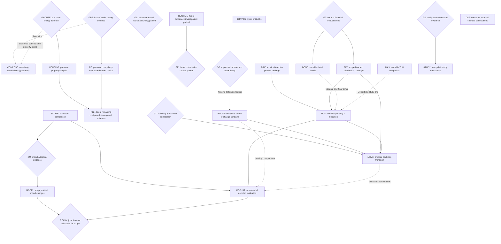

# Augur: experiment-driven modularization

This is the landing plan for a composable financial simulator: an experiment
loads or samples worlds, varies financial decisions, runs the shared mechanics,
and examines distributions and individual timelines. The primary acceptance
case is joint spending-flexibility × allocation planning with supported taxes.
Housing remains a capability; the house-buying web app does not define the library.

The [experiment/interface sketches, PR #5859](https://github.com/agentydragon/ducktape/pull/5859)
remain a proposal, not an API to implement wholesale. This plan owns sequencing;
[allocation experiments](allocation_program.md) owns the remaining experiment
questions. The [capability backlog](future_work.md) retains deferred research and
requirements from the old TODOs without a second dispatch order. Other plans and
issues are inputs, not additional prerequisite chains.
Remove entries and edges as their work lands; put proven contracts in `SPEC.md`
and responsibility docstrings beside the implementing modules.

## Committed library cleanups

The composition is a coordinating `World` over tracked actors, described in
[the simulator design](../sim/DESIGN.md); [the gate note](library_design_gates.md)
holds the graph of the remaining `World` slices. This roadmap alone owns dispatch
and dependencies.

Committed and still open: retire configured implicit strategies. Keep useful
preparation, canonical accounting, explicit tax treatment and independent financial
assertions. These cleanups do not authorize new financial features or silent timing
changes.

### Expansion freeze and executable landing slices

The freeze prevents new dependence on legacy layers; correctness fixes and atomic
reader migrations remain allowed. It does not block preserving supported behavior.

- Do not add new implicit policies; a policy is something a household consults.
- Do not add a central component constructor/dispatch for a new experiment; declare
  and track it on `World`. Keep one owner per financial fact.
- Do not add product-specific counters/slabs to `World`; the app records in `product/`.

| Unit    | Scope                                                                                                                                                                                                                                     | Immediate prerequisite and completion evidence                                                                                                    |
| ------- | ----------------------------------------------------------------------------------------------------------------------------------------------------------------------------------------------------------------------------------------- | ------------------------------------------------------------------------------------------------------------------------------------------------- |
| COMPOSE | The remaining `World` slices in [the gate note's graph](library_design_gates.md#remaining-work-in-dependency-order): one public TLH cohort type; the offers slice and drain; seasoned contracts and a tracked property; the rollout axis. | The gate note's graph; its offers slice waits on GPE and its seasoned-contract and property slices on GHOUSE. No replacement giant config schema. |
| P12     | Retire configured strategy orchestration: the app's configured household, its allocation proposer and funding-policy lowering.                                                                                                            | Continue independently landable slices on settled contracts; full P12 still needs HOUSING and PE for their readers.                               |

P12's public-portfolio slices can start now; the rollout axis is postponed. Keep older
financial capability branches scoped as below. No
dependency is introduced merely because files overlap or a rebase will be needed.

## Destination and stopping conditions

- An author can load named datasets, fit/sample or supply paths, compose a
  financial situation and executable policies, sweep them, and request outcomes
  or a selected trace without importing the app or editing engine policy enums.
- Trinity, flexible-spending and changing-allocation studies are runnable examples
  with explicit conventions and deviations. Offline checks run in CI; sourced
  long-running reproductions remain separately runnable. Exercise runnable examples
  through Bazel in CI, using deterministic generated financial inputs where source
  data is private, unavailable or too costly for routine runs. Cover the documented
  entrypoint where practical, real policy/execution code and meaningful financial
  assertions. Label these offline controls separately from sourced reproductions.
- A taxable household experiment starts from actual lots and tax state, pays
  spending through canonical settlement, and reports consumption, cuts,
  shortfalls, taxes and terminal wealth—not merely whether wealth stays positive.
  Private inputs stay downstream. The public acceptance case uses synthetic data.
- Model experiments independently compare predictive behavior and the financial
  decisions models support. A report identifies its evidence, assumptions and
  uncertainty; passing an accounting test does not certify a market forecast.
- Mortgages and multi-agent transfers still work through the same mechanics.
  Existing contracts survive a policy change; experiments need not implement
  optimizing lenders, landlords, or a general-equilibrium economy.

The priority is **domain modeling and experiment APIs, not large-N performance**.
Prefer Python for a clear, inspectable object model and composable financial steps;
further domain moves follow actual TLH-portfolio and FIRE-study needs. Correctness
and atomic caller migration remain gates; GL and RUNTIME/GE are parked future
optimization work and do not block this phase.

The `product/` application shell is not a near-term feature priority. Defer new
endpoints, metrics/UI surfaces and scenario capabilities there. Work in that
package should correct existing behavior, simplify its interfaces or retire its
configured strategy (P12). Financial components such as the Python-owned TLH portfolio
and experiment-owned reports are distinct from the `product/` shell.

The broader library milestone also includes truthful financial products (BIND),
consumer-driven capture (CAP), new STUDY consumers and the HOUSE action example.
The migration preserves existing housing and other supported mechanics;
they do not complete adaptive housing purchases, tradable bonds, expanded
tax coverage, relocation or market-model improvements.
A new experiment must not require a new engine policy variant, app configuration,
transport implementation, or copy of financial mechanics. These are acceptance
areas, not prerequisites for starting every experiment.

The first usable household milestone is **RUN** below, for an explicitly bounded
product/tax/residency scope. The broader decision-support milestone is **ROBUST**,
plus **BOND**, **HOUSE**, and **MOVE** when those capabilities enter the chosen
experiment. A cheaper USD spending tier is not completion of the Europe backstop.
Until that branch is supported or explicitly excluded, relocation remains an
unmet part of the goal.

The forecast goal additionally requires **READY**: a prospective joint
equity/rates/inflation model whose evaluated behavior supports the declared
decision scope. Particular model families are optional; this behavioral gate is
not. Early ROBUST results under limited models do not complete it. If no candidate
passes, keep the modeling gap open and qualify the household report accordingly.

Do not make completion depend on every paper, an institutional-quality label,
exact proprietary forecasts, or proof of perpetual sustainability from finite
data. More horizons, models and stress assumptions can expose uncertainty; they
cannot make it disappear.

## Build on what is already there

Reuse `World` composition on caller-supplied paths, shared market/product construction,
scoring without simulator output, canonical lot/tax/payment operations and
purchase-anchored property marks ([the simulator design](../sim/DESIGN.md)).
`x/monthly_actions` owns its Python policy and outer loop, including population,
selected replay and profile entrypoints; its generated financial controls run in CI.
The batch session returns compact account/pool series, payment identities, taxes,
stop books and optional dense/forensic traces; reuse that capture for new consumers.
`policy/{cash_band,sleeves}.py` and `sim/fixed_point.py::quantity_for_value` propose
withdrawal/deposit/rebalance trades with scoped FIFO selection; none executes trades.

`study/trinity` and `x/{bounded_spending,allocation_glide}` drive the batch session.
Bounded spending reads current CPI, and its scalar-adapted and batch-authored rule
comparison uses one session, including its profiler. `x/joint_spending_allocation`
steps one tracked household per `World`, varies both policy dimensions on shared
synthetic taxable paths, records intentions separately from actual requests and
payments, and verifies selected replay.

Reuse [Trinity](../study/trinity/README.md),
[bounded spending](../x/bounded_spending/README.md),
[bond policies](../x/bond_policies/README.md), and
`study/macro_window/{holdout,mixed_windows,stability}.py` as consumers and controls.
The bond example supplies discount curves and unitizes strategies; it does **not**
make a native `BondHolding` tradable.

## Intended responsibilities

These are module responsibilities, not a demand for new packages, services,
crates, registries or a mandatory interface count. Move existing definitions
only where ownership or a real consumer demands it. Keep short responsibility
docstrings on the resulting modules, as in the interface sketches.

| Building block        | Owns                                                                                                                                                                                                | Does not own / current starting point                                                                                                                                                                  |
| --------------------- | --------------------------------------------------------------------------------------------------------------------------------------------------------------------------------------------------- | ------------------------------------------------------------------------------------------------------------------------------------------------------------------------------------------------------ |
| Money and instruments | Currency/quantity precision; product identity, contractual terms and distribution character shared by all consumers.                                                                                | Investor strategy or fitted dynamics. Start with `sim/fixed_point.py`, `model/{equity,bond_fund,nominal_bond}.py` and scenario holding types; `BondFundSpec` is still a particular proxy construction. |
| Books and taxes       | Ordinary positions/lots, balanced transfers, filing-unit facts, statutory consequences and payment liabilities; read-only views at explicit phase/mark times.                                       | Investor strategy or a mirror of the Python TLH component's private cohorts. Reuse `sim/` declarations and canonical accounting/tax execution.                                                         |
| Valuation             | Product-specific valuation from contractual terms, position state and supplied marks, shared by settlement, observations and reporting.                                                             | A second position store or a forecast model. Reuse `sim/property.py` and dated-bond math as BIND/BOND extend the supported products.                                                                   |
| Contracts             | Due claims, amortization, origination and termination/payoff consequences.                                                                                                                          | Whether to buy, move, refinance or cut spending. Reuse existing mortgage/property lifecycle mechanics.                                                                                                 |
| Data and markets      | Author-named datasets and alignment; model-specific fit/condition/sample functions; explicit bindings from factors to compatible product prices/cashflows.                                          | A universal evidence bundle, investor decisions, or settlement. Reuse `finance/evidence`, `fit/` and `model/`; scoring-only models need no product bindings.                                           |
| Policies              | Actor-observable information and path-local memory → economic action requests. Budgets, target weights and funding/rebalancing/lot-selection algorithms belong inside policies or optional helpers. | Direct book mutation or private settlement. Python authors the batch policy; measured native calculation kernels are optional. The engine does not silently choose extra trades.                       |
| Execution and state   | Opening financial facts, scheduling, validated execution/settlement, isolated rollout state and actual results; financial steps behind the common Python-controlled session.                        | Actor strategy, outer rollout loops, evidence loading, market fitting, sweep selection or HTTP. Enforce contracts and explicit standing instructions; keep financial state in the canonical executor.  |
| Results               | Account/actor-scoped financial measures, experiment-selected reductions, traces and reproduction inputs.                                                                                            | A universal objective or every metric ever needed in an engine enum. Reuse event frames and compact capture; app projections sit above them.                                                           |
| Experiment/app shells | Explicit composition, Python-controlled decision loops, parameter grids, model/policy selection, storage and presentation.                                                                          | New financial semantics or a separate app executor. `study/`, `x/`, downstream code and the web app are peer consumers of the same `World`.                                                            |

Code dependencies point from shells to these blocks, never from settlement into
`product/`, HTTP, datasets or a particular forecast provider. Models and policies
are **compatible, not independent**: an experiment binds the same products,
currencies, timing, prices and payouts on both sides, and unsupported combinations
fail before execution. Use concrete supported types/functions, not a universal
plugin protocol. Presampled markets assume these actors do not move market prices.
Spending-tier ladders and their transition rules belong in experiment policy code,
not a central structured ladder policy or engine-owned fallback.

The settled policy contract (one batch-shaped policy, ordered monthly actions,
fatal rejection) is in <../SPEC.md>. The [actor-facing interface plan](policy_interfaces.md)
keeps the observation and action extensions not yet built; exact batch layout and
adapter cost remain decisions for GL. GP gates expanded product/housing and
cross-actor timing.

## Antipatterns to remove

Paths are relative to `finance/augur/`. Each row names the change that removes it.

| Existing problem and evidence                                                                                                                                    | Replacement / deletion criterion                                                                                                                                 | Landing unit |
| ---------------------------------------------------------------------------------------------------------------------------------------------------------------- | ---------------------------------------------------------------------------------------------------------------------------------------------------------------- | ------------ |
| Known contract views are not yet selected domain capture.                                                                                                        | CAP adds concrete missing financial observations.                                                                                                                | CAP          |
| The app still lowers funding policies (`product/scenarios.py::_target_allocation_policies_from_funding_policy`) for `policy/configured_household.py` to consult. | Migrate consumers to common actions; remove configured policy schemas, lowering and orchestration with their last caller, reusing the shared Python helpers.     | P12; GP      |
| A total-return equity proxy can look like a taxable security, and `SecurityDistribution` treats payouts as interest.                                             | Explicit product bindings and supported distribution character; separate price return from payouts for taxed holdings.                                           | BIND, TAX    |
| `BondHolding` means par-bought, unmarked and unsellable; a portfolio choice is encoded as an instrument invariant.                                               | The same dated position can pay coupons, sell partially, or redeem; hold/sell/roll are choices. Keep the old constant-maturity approximation explicitly labeled. | BOND         |
| Tax surface is narrower than the intended fidelity: single filing status; missing NIIT/qualified-dividend support; no effective-year schedule in `Jurisdiction`. | Declared supported-case matrix, dated rules and opening tax state; unsupported relevant cases reject. Existing loss netting/carryforward is not reimplemented.   | GT, TAX      |

The user-facing experiment **RUN** must use canonical execution.

## Landing DAG

Solid arrows are **content/behavior prerequisites**, not preferred chronology or
overlapping files; dashed arrows apply only to the labeled arms. Unconnected roots
can land independently. Diamonds are decisions with bounded evidence below; a gate
blocks only its outgoing branches.
An empty prerequisite means ready to scope now, not permission to implement all
of this plan in one PR. Several nodes explicitly split into smaller PRs.
For such nodes, an edge consumes the named contract, not every later improvement
under that ID. The acceptance table identifies the first slices.

**COMPOSE non-edges:** COMPOSE's remaining slices do not block existing
policy-loop experiments, CAP's specific factual observations or P12 slices using
already-settled interfaces. GHOUSE and GPE gate only the COMPOSE slices on their
edges; GP and GT are not COMPOSE prerequisites.

**Deliberate non-edges:** GL and RUNTIME/GE have no edge to near-term domain/API
work, TLH portfolios, FIRE studies or P12. Large-N cost is not a current
acceptance gate. Financial correctness and supported-domain coverage still gate
the affected change. Parallelism across independent worlds does not require dense
whole-horizon execution or uniform event/position counts.

Reuse existing held-bond principal capture and product reporting, alongside
`product/funding.py`, `product/action_projection.py` and the held-bond observations;
their implementations are not backlog. P12 still removes configured funding
lowering and preserves existing scope. The current app has one decision-making
owner; scripted counterparties do not require a general multi-policy scheduler.
New adaptive HOUSE/BOND features are not prerequisites for preserving current
behavior. The [paired TLH study plan](managed_portfolio.md) specifies MA3 on the existing
Python component and action session. It does not wait for housing, PE or
RUNTIME/GE. Component ownership, settlement and timing are documented on
[the TLH component](../sim/tlh.py).

Outcome reporting is a consumer acceptance requirement, not a separate prerequisite
project. Common-session summaries already retain payment/claim identities, unpaid amounts and causes,
stop books and failed-action receipts; the joint example separates policy
intentions, attempted requests and paid consumption. These results are typed.
Preserving them belongs to each P12 migration's acceptance. A study supplies its
own cut or shortfall definition and CPI/base-date convention using these facts; no universal
success metric is implied. CAP adds only facts demanded by a named consumer and
removes replaced adapters with their last readers. Do not create parallel claim
vocabularies or another compact collector.

STUDY does not wait for TAX or every consumer's Python migration. New policy-loop
consumers use the existing action session; do not add another specialized runner.
P12 migrates configured controls; STUDY adds paper-specific consumers. RUN can
begin with the action session, supported taxes, supplied paths and allocation
varied between cells; extend the existing joint shell. Its synthetic controls do
not certify RUN's broader tax/residency scope. Pricing BOND does not wait for a
generative curve or BIND's payout work. RUN/ROBUST do not wait for MODEL or every
study; existing limited models can already expose disagreement.

### Converge configured consumers on the policy boundary

Configured consumers move to the existing action session or a tracked agent, with
optional Python proposal helpers; GP and BOND/HOUSE define the scoped
action/execution contracts. Domain changes serve an actual consumer.

For each configured consumer, preserve its financial cadence and identify changes
caused by post-claims timing or explicit ordered funding. Its Python policy owns proposal ordering,
spending/tax reserves and the chosen cash-band/drift convention.

Use the simplest clear typed representation that serves actual experiments.
Current acceptance is correctness, notebook-friendly composition and coherent
ownership, not a throughput/memory budget. GL can investigate batch representation
when a real workload needs it; it cannot multiply policy interfaces or justify
padding all variable-sized domain objects into a universal shape.

These consumer migrations need in-memory continuation, not serialized checkpoints,
forkable worlds, nested forecasts or a general plugin/action framework.

### Policy-interface PRs and acceptance

Policy-prefixed names are task IDs, not GitHub PR numbers or a demand to serialize the work.
Each row is one independently reviewable change. Split again if a row proves too
large, preserving the named completion condition and atomic caller updates.
The **Needs** column names immediate prerequisites; inherited prerequisites still
apply only to the consuming slice. No convergence node waits for RUNTIME/GE.

| Unit                                          | Independently reviewable change                                                                                                                                                                                                                                                                                            | Needs                            | Evidence required before calling it complete                                                                                                                                                                                                                                                                                                |
| --------------------------------------------- | -------------------------------------------------------------------------------------------------------------------------------------------------------------------------------------------------------------------------------------------------------------------------------------------------------------------------- | -------------------------------- | ------------------------------------------------------------------------------------------------------------------------------------------------------------------------------------------------------------------------------------------------------------------------------------------------------------------------------------------- |
| P12 — retire configured controls and adapters | Move the app's configured household to an ordinary policy submitting common actions. Land supported slices independently; extend the common action path only for capabilities existing callers require. Remove the configured allocator orchestration, funding-policy lowering and policy schemas with their last readers. | HOUSING, PE (their readers only) | Every production caller's decisions come from an ordinary policy over the common actions; ported Python tests exercise canonical steps. Preserve existing financial capabilities and explicitly resolve phase differences; no silent behavior change or compatibility runner. No new adaptive housing, tax or market capability is implied. |

### Domain composition and existing-app retirement

| Unit    | Change and acceptance                                                                                                                                                                                                                                  | Needs                             |
| ------- | ------------------------------------------------------------------------------------------------------------------------------------------------------------------------------------------------------------------------------------------------------ | --------------------------------- |
| MA3     | Runnable paired TLH/no-harvest comparison on identical supplied paths, documented CLI tests, compact outcomes and selected replay. Calibration validation remains separate.                                                                            | None; use existing action session |
| HOUSING | Preserve scheduled purchase, occupancy, rent, improvements, sale and mortgage/tax lifecycle through shared financial steps and capture. Test funding failure, purchase basis, deductions and rental transitions. This is not adaptive purchase policy. | GHOUSE                            |
| PE      | Separate compulsory issuer state/cash events from Python tender choice. Enforce eligibility, capacity and lockups through canonical execution; preserve collapse/recovery, IPO transition, gains and event outputs.                                    | GPE                               |

HOUSING and PE are deferred priorities. Their preservation remains necessary for
complete P12 retirement, but does not gate public-portfolio experiments,
funding, reporting or TLH-component work. Do not start their implementation merely
to finish P12.

### Concrete cleanup slices

[The P12 reader list](cleanup_migration.md) names the configured strategy's live
readers and their deletion criteria.

| Unit    | Change                                                        | Needs |
| ------- | ------------------------------------------------------------- | ----- |
| IDTYPES | Type the captured lot asset; typed config-model construction. | None  |

The [entity-ID note](typed_series_config.md) scopes IDTYPES without turning artifact/wire churn into an active cleanup prerequisite.

### Deletion checkpoints, not another interface family

P12 removes the remaining implicit allocator orchestration. The
app can retain projections over common outputs, not a private simulation
interface. Delete each superseded path in its last caller's migration PR, not a later cleanup campaign. The active
scalar-adapted/batch-authored bounded-rule comparison remains an experiment control
using one action session, not another execution API.

Old opening-month controls and the post-claims action contract are not
interchangeable wrappers. Pin expected decisions and paid outcomes for each moved
consumer, explain intentional differences, and reject accidental drift. Existing
housing/PE consumers remain on the explicitly tracked P12 branch until their
required actions and timing are supported; they do not delay the public-experiment
deletions. Keep any independent study recurrence as a labeled mathematical control,
not a second financial executor.

Completion requires the app's household to decide through an ordinary policy over
the same `World` and actions as the Python experiments, not a configured strategy.

### Other landing units and acceptance

CAP's concrete actor-tax-observation slice exposes recorded income, jurisdiction
gain/carryforward facts and assessed outstanding liabilities through the Python
observation, reusing canonical Python accounting and tax records. Those facts exist
internally but are not in the current policy observation. Test same-month component losses,
prior sales, year-end/reset and actor scope without future assessments. This
gates tax-aware policy rules, not MA3's fixed-flow accounting control or all studies.

| Unit    | Independently reviewable change(s)                                                                                                                                                                                                                                                                                                                                                                         | Evidence required before calling it complete                                                                                                                                                                                                                                                                                                                                                                             |
| ------- | ---------------------------------------------------------------------------------------------------------------------------------------------------------------------------------------------------------------------------------------------------------------------------------------------------------------------------------------------------------------------------------------------------------- | ------------------------------------------------------------------------------------------------------------------------------------------------------------------------------------------------------------------------------------------------------------------------------------------------------------------------------------------------------------------------------------------------------------------------ |
| RUNTIME | Parked: investigate an actual slow workload when large-N use requires it, separating language, execution and output layout.                                                                                                                                                                                                                                                                                | Comparable financial work/outputs and real profiling, not historical aggregate speedup attribution. No prerequisite edge to current domain/API work.                                                                                                                                                                                                                                                                     |
| CAP     | Add consumer-required actor/account/component financial observations using canonical records, including the recorded-tax slice above.                                                                                                                                                                                                                                                                      | Preserve source scope, exact units and observed/stopped validity. Existing views do not need a metrics framework; app-specific recording stays in `product/`.                                                                                                                                                                                                                                                            |
| BIND    | First make proxy/distributing-product semantics explicit and validate held **and purchasable** support at composition. Then supply equity price-return **and dividend-amount paths**, with explicit historical/fitted payout assumptions, coordinated with TAX's supported character slice. Reuse typed conditioning records; IDTYPES is deferred and does not gate this slice. Reuse existing typed keys. | A total-return proxy cannot silently become a taxable distributing holding. Missing payouts, incompatible tax character and double-counted total returns reject before execution; legitimate zero payouts remain valid. Price plus payouts reconcile before tax, with timing and provenance. Product terms, construction assumptions and investor strategy have distinct owners; no global registry or universal fitter. |
| TAX     | After GT, land separate supported-case changes: distribution characterization/qualified dividends; NIIT if applicable; calendar/law-year selection and opening year-to-date facts/payment timing; any additional filing/residency gaps actually in scope.                                                                                                                                                  | Independently sourced annual-liability examples plus integrated sale-to-fund-spend, reinvestment basis, year-crossing, exemption and tax-payment tests. Compare with a second calculation, not a copy of the engine formula. Reject or exclude unimplemented cases explicitly. No second simulator or universal tax-law DSL.                                                                                             |
| BOND    | Land marking/partial sale for the supported existing nominal-bond slice, then off-par acquisition/accrual treatment separately. First consumer supplies explicit dated sale orders and curve/cashflow inputs; adaptive actor/helper decisions use the same settlement operation. Reuse `model/nominal_bond.py` and supplied-curve controls.                                                                | One position can sell or mature, with conserved face, correct remaining coupons/basis, and no duplicate principal. Cash, accrued interest and taxable gains reconcile. Remove `BondHolding`'s structural illiquidity doctrine; hold-to-maturity is a policy. Preserve redemption controls and explicit unsupported cases; unitization is not direct bond settlement.                                                     |
| HOUSE   | Compose existing mortgage servicing with property acquisition/lifecycle actions; keep policy decisions separate from contract obligations.                                                                                                                                                                                                                                                                 | A two-agent financed-purchase/hold/sale example conserves transfers and settles loan payoff and taxes. Changing spend does not cancel a mortgage; rejected purchases leave no half-originated loan. No fractional-ownership or many-agent economy redesign.                                                                                                                                                              |
| STUDY   | Separate PRs for Guyton–Klinger and paper-specific glide-path consumers. Extend existing bounded/joint examples and reuse Python helpers.                                                                                                                                                                                                                                                                  | Paper-specific success/spending definitions, hand-checkable rule transitions, tax-free controls and documented substitutions. A smaller first GK spending-only variant must be labeled as a variant, not the full portfolio-rule reproduction. No dependency on unused portfolio helpers.                                                                                                                                |
| RUN     | Public synthetic-lot example plus downstream private composition: a finite spending-anchor/flex × allocation grid on shared paths.                                                                                                                                                                                                                                                                         | Canonical taxes/settlement; consumption/cut/default distributions and selected traces; explicit cash reserve, reinvestment, rebalancing and trade-cost assumptions. Static controls agree where conventions match. Optional scope branches are not silently approximated.                                                                                                                                                |
| SCORE   | Reuse existing fitting/scoring and macro-window experiments in an author-wired comparison shell.                                                                                                                                                                                                                                                                                                           | Same observables, units, transformations, origins and held-out periods; explicit release/revised vintage; marginal and joint/path diagnostics; dependence-aware uncertainty or an explicit refusal to rank. No invented Gaussian density for a sample-only model.                                                                                                                                                        |
| MODEL   | One independently evaluated model/data change per PR, only after GM. Promote existing mixed-window experiments only if their evidence warrants it.                                                                                                                                                                                                                                                         | Fit artifact/provenance, held-out comparison and limitations published; no regression in unrelated product construction. Rejecting a candidate is a valid completed experiment. No mandatory all-model rewrite.                                                                                                                                                                                                          |
| ROBUST  | Select from RUN's candidate policies under each model, then evaluate all candidates and selected policies on fresh evaluation draws under other models.                                                                                                                                                                                                                                                    | Paired differences within each model, separate finite-history/model/parameter uncertainty, no assumed coupling from equal cross-model seeds. Report trade-offs and infeasibility; no automatic scalar utility or forced winner. Include instrument-construction sensitivity, not just sampler sensitivity.                                                                                                               |
| MOVE    | After GX, implement the chosen transition's notice/cost/contract consequences and supported location/FX/tax treatment; then add it to the household example.                                                                                                                                                                                                                                               | Before/after books, tax years, currencies and purchasing-power bases reconcile. Trigger, accepted action and resulting spend are distinct. A move cannot retroactively erase existing claims.                                                                                                                                                                                                                            |

Keep housing/PE/mortgage, double-entry, lot-basis, tax and failure regressions
running throughout. Parity protects established behavior, not incorrect math:
independently verify discrepancies and land scoped corrections with changed
results explained. A boundary change updates all callers and relevant README/SPEC
claims in that PR; no transition shims in this monorepo.

## Decision gates

The [tax-coverage checklist](tax_coverage.md) supplies evidence and concrete
choices for GT. GP extends the settled monthly contract (<../SPEC.md>) without
within-month retries or policy callbacks.
The checklist's [housing-basis mismatch](tax_coverage.md#housing-basis-reconciliation)
is a GT/TAX slice for affected housing arms, independent of runtime-language research.

The existing app needs these bounded GP decisions before its affected capability
migrations, without reopening the settled ordered-action/no-retry contract:

- **GHOUSE — committed purchases (deferred):** the intended boundary is a policy
  action that acquires the house and signs the mortgage/contracts together.
  Insufficient funding stops the trajectory, like an unpaid bill; no partial
  purchase/origination is created, while preceding successful actions remain.
  The current scheduled purchase debits cash during preparation, before policy
  observation. Still resolve within-month closing/servicing order and expose the
  existing mechanics through the action boundary. No general multi-agent scheduler
  is needed.
- **GPE — compulsory events and voluntary tenders (deferred):** forced recovery
  and other compulsory issuer events cannot be skipped by policy. Actions represent
  choices the holder could actually make, not permission for external events to
  happen. Every presented sale opportunity requires an explicit policy response:
  sell with specified terms/quantity, or decline. Omission is an invalid response,
  never an implicit decline; validate complete opportunity coverage in the existing
  monthly batch without another policy callback or within-month retry. Future
  controls must distinguish decline, omitted response and compulsory execution.
  Still decide when forced proceeds become spendable and where compulsory events
  fall relative to a rollout-stopping failure. Currently
  PE processing follows successful payments, and absence of a tender policy also
  skips forced recovery (`sim/private_equity.py`). Compulsory issuer events
  must not depend on opting into a tender strategy. Pin independent failure/timing
  controls before changing that behavior; these are future requirements, not current
  action-session guarantees.

| Gate                                               | Bounded next step and decision                                                                                                                                                                                                                                                                                                                                                                                                               | What proceeds regardless                                                                                                                                                                                                            |
| -------------------------------------------------- | -------------------------------------------------------------------------------------------------------------------------------------------------------------------------------------------------------------------------------------------------------------------------------------------------------------------------------------------------------------------------------------------------------------------------------------------- | ----------------------------------------------------------------------------------------------------------------------------------------------------------------------------------------------------------------------------------- |
| GP — expanded information and settlement semantics | The first household example observes after cashflows/claim assembly, executes one ordered list, and stops on an invalid action or a still-unpaid due claim. Pin additional product/housing/PE settlement and deadlines, and ordering between multiple decision-making actors before migrating P12's affected existing consumers or enabling new cases.                                                                                       | P12's supported public-consumer slices proceed. Funding helpers return proposals; no implicit allocator, retry protocol or recovery model. Existing capabilities cannot be dropped to claim convergence.                            |
| GT — what must be financially faithful first?      | Inventory downstream-required account/product kinds, tax years, filing status, residency and opening YTD facts without publishing values. Commit a public supported-case matrix with source/independent-oracle cases. For BOND, also resolve clean/dirty price, coupon/accrual dates, sale/redemption ordering, premium/discount tax treatment and unsupported TIPS/credit cases. The owner selects scope; implementation must not guess it. | Tax-free studies, supplied-curve valuation and interface cleanup. NIIT/qualified dividends cannot stay silently absent from a personal comparison that needs them. Future tax law must be an explicit assumption, not a prediction. |
| GS — reproduction or adaptation?                   | For each study, pin the source/table, accessible data, within-period ordering, rebalancing/withdrawal rules and denominators. If exact inputs or rules are unavailable, resolve the adaptation before labeling the result.                                                                                                                                                                                                                   | Other studies and synthetic rule tests. No need to reproduce proprietary Vanguard paths.                                                                                                                                            |
| GM — which extra market complexity earns its cost? | Use SCORE to compare simple controls and existing fits before adopting new dynamics. Separate joint equity/rates/inflation, curve shape, regimes, window selection and parameter uncertainty. Set comparison criteria before examining the final holdout; preserve disagreements when evidence cannot select.                                                                                                                                | RUN and ROBUST use explicitly limited current models. A new model need not beat every score, but its adoption must name the improved behavior and trade-off. “Institutional-grade” is not a test.                                   |
| READY — is the market goal actually met?           | Review held-out multi-horizon behavior of jointly generated equity, rates and inflation, including dependence in adverse paths, persistence, drawdown/shortfall tails, and product returns at the durations in scope. Use ROBUST to test decision consequences, not as substitute evidence for forecast quality. Agree tolerances and acceptable limitations before adoption.                                                                | Exploratory reports remain useful if the gate fails, but must not claim realistic forecast fidelity. Replan the specific failed capability; no family such as regimes, DNS or bootstrap is mandatory merely by name.                |
| GX — what is the Europe backstop?                  | Owner chooses destination/residency assumptions, notice/reversibility and whether a staged sensitivity bound is useful before full treatment. Identify required FX, local inflation, moving costs, housing and cross-border taxes. A bounded approximation must be labeled as such, not a realistic relocation path.                                                                                                                         | Domestic tiers and a domestic household report; no invented foreign tax rules or claim that one CPI represents both locations.                                                                                                      |
| GL — future batch tuning (parked)                  | When an actual workload needs optimization, measure representation/transfer/capture and consider bounded changes.                                                                                                                                                                                                                                                                                                                            | Domain/API work, Python migrations and studies proceed without performance budgets. Keep one batch interface; correctness is not deferred.                                                                                          |
| GE — future optimization choice (parked)           | Use actual bottleneck evidence to choose Python/vectorized/native implementation details later.                                                                                                                                                                                                                                                                                                                                              | No near-term Python switch needs speedup evidence. Preserve the domain model and one canonical implementation regardless of optimization choice.                                                                                    |

The [Guyton–Klinger source contract](../docs/guyton_klinger.md) grounds GS for
that consumer: source versions and portfolio/spending rules, data access and
remaining convention choices. Its [implementation plan](guyton_klinger.md) maps
small STUDY slices onto the current session. Historical application of the 2006
policy is distinct from its Monte Carlo table results.

Market research candidates already tracked include
[joint equity/macro #5487](https://github.com/agentydragon/ducktape/issues/5487),
[regimes #5488](https://github.com/agentydragon/ducktape/issues/5488),
[resampling #5510](https://github.com/agentydragon/ducktape/issues/5510), and
[muni curves #5835](https://github.com/agentydragon/ducktape/issues/5835).
Data availability and ragged history are gates, not reasons to silently discard
early equity history or treat one muni index yield as an entire curve.

The two-point Treasury curve still clamps beyond ten years in
`model/bond_fund.py`. [#5834](https://github.com/agentydragon/ducktape/issues/5834)
was closed without a recorded reason or implementing commit. **GM must resolve
whether to pursue that proposed direction**, not infer that it shipped or reopen
it automatically. Deterministic discounting, observed curve interpolation,
real-world forecasts and risk-neutral valuation are distinct tasks; none requires
all the others to be solved first.

## Current dispatch and priorities

1. **COMPOSE**: the rollout axis is postponed until a real large-N workload needs it;
   the TLH cohort type is postponed and waits on the open question in its gate-note
   entry; the offers and seasoned-contract/property slices wait on GPE and GHOUSE.
   **P12**'s public-portfolio reader slices proceed on settled contracts.
2. **MA3** remains a runnable paired TLH comparison on the existing Python
   component/session. Continue **STUDY** consumers alongside cleanup. Scope GT/GS
   and continue independent BIND/SCORE work. **domain composition** selects further domain
   moves for actual consumers. The `product/` shell gets no new feature agenda.
3. **GHOUSE and GPE remain deferred.** Full P12 retirement retains
   the capabilities they actually need; do not remove those regressions or add
   a compatibility driver to claim convergence. Public reader deletions proceed.
   **GL and RUNTIME/GE remain parked** without outgoing gates to this work.
   **IDTYPES** has no prerequisite, the “exogenous” rename is only a consideration, and
   constituent-level managed portfolios wait for decision-relevant fidelity gaps.
   New evidence-fetch/cache infrastructure waits for observed throttling; richer
   PE app controls are dropped, not a deferred product feature.

Existing stepping provides in-memory continuation, not complete checkpoints or nested
forecast feedback. Those later capabilities must additionally preserve pending
contracts, tax state, reporting basis and policy memory across save/restore or
forks. They are not prerequisites for this migration or cross-model studies.

Likewise, new property-media storage, mortgage UI redesign, prediction-market
calibration expansion and a general experiment framework are not prerequisites.
Keep their useful work independently reviewable; do not let the old app agenda
define the critical path again.
