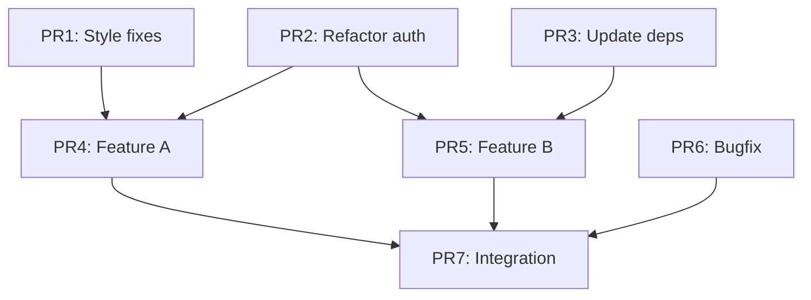

# Branch Splitter

Transform a large, messy branch with many changes into a DAG of independent, reviewable PRs. Think like an expert software engineer preparing work for smooth code review and trunk merge.

## Core Philosophy

1. **Atomic changes** - Each PR does one logical thing
2. **No dead code** - If a PR adds code, it must be used in that same PR
3. **No orphaned deletions** - If a PR removes the last user of code, delete that code too
4. **Consistent state** - Repo must build and pass tests at every PR boundary
5. **Truthful documentation** - If behavior changes, docs must change in same PR
6. **Tests with implementation** - If tests exist in the source branch, they accompany their implementation

## Acceptable Outcomes

### A: Clean DAG of PRs

```
PR1 (style fixes) ──┐
                    ├──> PR4 (feature A) ──┐
PR2 (refactor X) ───┤                      ├──> PR7 (integration)
                    ├──> PR5 (feature B) ──┤
PR3 (dep update) ───┘                      │
                    PR6 (bugfix) ──────────┘
```

Each PR:

- Has clear description of what it does
- Builds and passes tests independently
- Can be reviewed in isolation
- Merges cleanly in any valid DAG order

### B: Partial Split with Documented Tangles

When some changes can't be cleanly separated:

```
Split into 5 PRs:
- PR1-3: Independent, ready for review
- PR4-5: Tangled, kept together with explanation of why

Tangle reason: Database migration in PR4 adds column that PR5's
code requires. Cannot split without adding transitional migration
that doesn't exist in original branch.
```

## Workflow

### Phase 1: Analysis (Use Parallel Subagents)

Launch subagents to analyze the source branch in parallel:

```
Subagent 1: Identify all modified files, group by subsystem
Subagent 2: Find pure refactors (renames, moves, style fixes)
Subagent 3: Find documentation-only changes
Subagent 4: Find test-only changes (new tests for existing code)
Subagent 5: Identify schema/migration changes and their dependents
Subagent 6: Map import/dependency relationships between changes
```

Each subagent produces a report without making file edits.

### Phase 2: Planning

Synthesize subagent reports into a split plan:

1. **Identify independent atoms**:
   - Style/lint fixes with no semantic change
   - Documentation improvements
   - Refactors that don't change behavior
   - Dependency updates
   - New tests for existing code

2. **Identify dependent clusters**:
   - Feature + its tests
   - Schema change + code using it
   - API change + callers

3. **Build the DAG**:
   - Independent atoms become leaf PRs (no dependencies)
   - Dependent clusters form chains
   - Cross-cutting changes may need transitional states

4. **Check for transitional needs**:
   - Does splitting require intermediate states not in original?
   - Example: deprecate field → migrate readers → remove field
   - Document any added transitional commits

### Phase 3: Extraction (Use Git Worktrees)

**Critical**: Use separate git worktrees for each PR branch to avoid conflicts.

```bash
# Create worktrees in parallel (agents can work independently)
git worktree add ../split-pr1 -b pr1-style-fixes origin/main
git worktree add ../split-pr2 -b pr2-refactor-x origin/main
git worktree add ../split-pr3 -b pr3-feature-a pr1-style-fixes  # depends on PR1
```

Assign each worktree to a subagent:

```
Subagent for PR1: Works in ../split-pr1, cherry-picks style commits
Subagent for PR2: Works in ../split-pr2, cherry-picks refactor commits
Subagent for PR3: Works in ../split-pr3, cherry-picks feature commits
```

Subagents must:

- Only modify files in their assigned worktree
- Commit with clear messages referencing original commits
- Run build/tests before declaring success
- Report any conflicts or issues

### Phase 4: Validation

#### 4.1: Individual PR Validation

Each PR branch must pass:

```bash
bazel build --config=check //...  # or project-specific build
bazel test //...                   # or project-specific tests
```

#### 4.2: DAG Order Validation

**Enumerate all valid orderings** of the DAG and verify each:

```python
def validate_dag_orderings(dag: dict[str, list[str]], branches: list[str]):
    """Validate patches apply cleanly in all valid DAG orderings."""
    valid_orderings = list(all_topological_sorts(dag))

    for ordering in valid_orderings:
        with temp_worktree() as ws:
            for branch in ordering:
                # Apply branch as patch
                result = apply_branch_as_patch(ws, branch)
                assert result.success, f"Failed at {branch} in ordering {ordering}"

                # Build and test
                assert run_build(ws).success
                assert run_tests(ws).success

    # Verify final state matches original
    assert diff_trees(result_tree, original_branch_tree) == empty
```

For small DAGs (< 10 nodes), test all orderings. For larger DAGs, sample representative orderings covering:

- Each edge exercised at least once
- Longest path through DAG
- Maximum parallel merges

#### 4.3: Content Invariant Validation

The union of all PR diffs must equal the original branch diff:

```bash
# Get original diff
git diff main...feature-branch > original.diff

# Apply all PRs in any valid order, get final diff
git checkout main
for pr in $(topo_sort dag); do
    git merge --no-ff $pr
done
git diff main > split.diff

# Diffs must match (ignoring commit metadata)
diff <(normalize_diff original.diff) <(normalize_diff split.diff)
```

#### 4.4: Consistency Checks

For each PR, verify:

- [ ] **No dead code added**: Every function/class/constant added is used
- [ ] **No orphaned code left**: If last user of code is removed, code is removed
- [ ] **Docs match behavior**: Changed behavior has matching doc changes
- [ ] **Tests accompany implementation**: New features include their tests

```python
def check_pr_consistency(pr_diff):
    added_symbols = extract_added_symbols(pr_diff)
    used_symbols = extract_used_symbols(pr_diff)
    removed_usages = extract_removed_usages(pr_diff)

    # Check no dead code
    for sym in added_symbols:
        assert sym in used_symbols, f"Added {sym} but never used"

    # Check no orphaned code (requires full repo context)
    for usage in removed_usages:
        remaining = count_usages_in_repo(usage.symbol)
        if remaining == 0:
            assert symbol_deleted(usage.symbol), f"{usage.symbol} has no users but wasn't deleted"
```

### Phase 5: Documentation

Produce a summary document:

````markdown
# Branch Split: feature-branch → 7 PRs

## DAG Structure


````

## PR Descriptions

### PR1: Style fixes (independent)

- Files: 12 changed
- Scope: Lint fixes, formatting
- Review: Can merge anytime

### PR2: Refactor auth module (independent)

- Files: 5 changed
- Scope: Extract AuthContext class
- Review: Can merge anytime
- Note: PR4 and PR5 depend on this

[... etc ...]

## Validation Results

- All 24 valid DAG orderings tested: PASS
- Content invariant (union = original): PASS
- No dead code: PASS
- No orphaned code: PASS
- Docs consistency: PASS

## Transitional States Added

None required.

## Recommended Merge Order

1. PR1, PR2, PR3 (parallel, no deps)
2. PR4, PR5, PR6 (parallel, after their deps)
3. PR7 (final integration)

```

## Subagent Coordination Rules

### Preventing Conflicts

1. **File ownership**: Each subagent owns specific files, no overlap
2. **Worktree isolation**: Each subagent works in separate git worktree
3. **No shared state**: Subagents communicate via reports, not shared files
4. **Sequential git ops**: Only one agent commits to a branch at a time

### Communication Pattern

```

Main Agent
│
├── Spawn Analysis Subagents (parallel, read-only)
│ ├── Analyzer 1 → Report 1
│ ├── Analyzer 2 → Report 2
│ └── Analyzer N → Report N
│
├── Synthesize Plan (main agent)
│
├── Spawn Extraction Subagents (parallel, separate worktrees)
│ ├── Extractor 1 (worktree A) → Branch 1
│ ├── Extractor 2 (worktree B) → Branch 2
│ └── Extractor N (worktree N) → Branch N
│
├── Spawn Validation Subagent (sequential per ordering)
│ └── Validator → Pass/Fail Report
│
└── Generate Documentation (main agent)

```

## Handling Edge Cases

### Tangled Changes

When changes can't be separated:

1. Document why they're tangled
2. Keep them in same PR with explanation
3. Consider if transitional state would help

### Missing Tests

If original branch has implementation without tests:

1. Note in PR description: "Tests to be added in follow-up"
2. Or: Add tests in same PR if scope is reasonable

### Schema Migrations

Database migrations often create dependencies:

1. Migration must come before code using new schema
2. Consider: migration PR → code PR chain
3. Or: combined PR if separation adds no review value

### Circular Dependencies

If analysis reveals circular deps:

1. Identify the cycle
2. Find a cut point (what can be split first?)
3. May need transitional state (interface, feature flag)
4. Document the resolution

## Output Artifacts

The skill produces:

1. **Branch set**: Named branches in remote, ready for PR creation
2. **DAG description**: Mermaid diagram or similar
3. **Validation report**: Test results for all orderings
4. **PR descriptions**: Draft text for each PR
5. **Merge guide**: Recommended order and notes

## When NOT to Split

Some branches shouldn't be split:

- Single atomic change (already reviewable)
- Tightly coupled changes where split adds no value
- Time-sensitive fixes where review speed matters more
- When the "split" would be artificial (one PR = rename, next PR = use new name)

In these cases, document why splitting wasn't done.

## Activation Triggers

Use this skill when:

- User says "split this into PRs"
- User says "make this reviewable"
- User says "this branch is too big"
- Branch has > 500 lines changed across > 10 files
- Branch touches > 3 unrelated subsystems
- Review would take > 1 hour due to size

## Example Invocation

```

User: This branch has grown to 2000 lines. Can you split it into reviewable PRs?

Agent: I'll analyze the branch and split it into independent PRs.

[Spawns analysis subagents in parallel]
[Receives reports, builds DAG plan]
[Creates worktrees, spawns extraction subagents]
[Validates all orderings]
[Produces documentation]

Here's the split:

- 5 independent PRs identified
- DAG: [diagram]
- All 12 valid orderings tested and pass
- Branches pushed: pr1-style, pr2-refactor, pr3-tests, pr4-feature, pr5-integration

```

```
