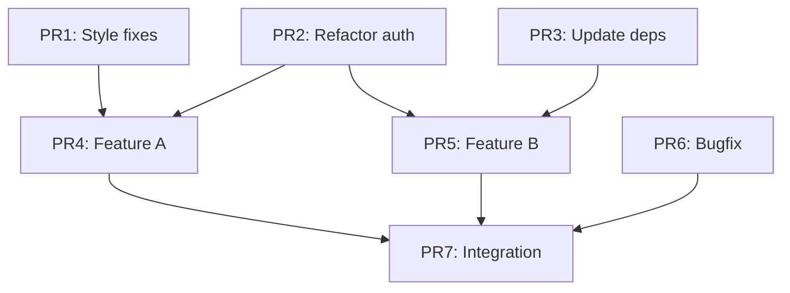

# Branch Splitter

Transform a large, messy branch with many changes into a DAG of independent, reviewable PRs. Think like an expert software engineer preparing work for smooth code review and trunk merge.

## Core Philosophy

1. **Atomic changes** - Each PR does one logical thing
2. **No dead code** - If a PR adds code, it must be used in that same PR
3. **No orphaned deletions** - If a PR removes the last user of code, delete that code too
4. **Don't make things worse** - Each PR must not break what wasn't already broken (see Imperfect Baselines)
5. **Truthful documentation** - If behavior changes, docs must change in same PR
6. **Documentation claims must be true** - If docs claim something is done, the implementation must exist (see Documentation Consistency below)
7. **Tests with implementation** - If tests exist in the source branch, they accompany their implementation
8. **Complete coverage** - The union of all split PRs MUST equal the original branch diff (validated programmatically)

## Splitting is De Novo, Not Commit-Following

**Critical**: Treat the original branch as a single monolithic diff to split de novo. Do NOT slavishly follow the original commit structure.

### What This Means

- **Ignore original commits**: The commit history is irrelevant. Only the final diff matters.
- **Split within commits**: A single original commit may become parts of multiple PRs.
- **Combine across commits**: Changes from multiple original commits may combine into one PR.
- **Extract sub-patches**: If commit X changes files A, B, C but only A is independent, extract just the A changes.

### Example

Original branch has 3 commits:

```
commit 1: "Refactor auth + update STYLE.md"
  - auth.py (200 lines changed)
  - STYLE.md (2 lines changed)

commit 2: "Add feature + tests"
  - feature.py (100 lines)
  - test_feature.py (50 lines)

commit 3: "Fix bug in auth"
  - auth.py (10 lines changed)
```

**Wrong approach**: "I can't split STYLE.md because it's in the same commit as auth.py"

**Correct approach**: Extract sub-patches:

```
PR1: STYLE.md changes only (2 lines from commit 1)
PR2: auth.py refactor (200 lines from commit 1 + 10 lines from commit 3)
PR3: feature.py + test_feature.py (from commit 2)
```

The original commits are just how work happened chronologically. The split is how work should be reviewed logically.

### Completeness Requirement

After splitting, the union of all PR diffs MUST exactly equal the original branch diff. This is validated programmatically by the validation script. If any change from the original branch is missing from the split PRs, validation fails.

## Imperfect Baselines

Real codebases often have pre-existing issues: flaky tests, lint warnings, incomplete migrations. The goal is **not to require perfection**, but to **not make things worse**.

### Establishing Baseline

Before splitting, record the base branch's health:

```bash
# Record what already fails on base branch
git checkout origin/devel
bazel test //... 2>&1 | tee baseline-test-results.txt
bazel build --config=check //... 2>&1 | tee baseline-lint-results.txt

# Extract failing targets
grep "FAILED" baseline-test-results.txt > known-failures.txt
```

### Validation Principle

For each split PR, the rule becomes:

- **Must pass**: Everything that passed on the base branch
- **Allowed to fail**: Tests/lint that already failed on base branch
- **Must not introduce**: New failures not in the baseline

The validation script (`validate-dag-split.py`) implements this comparison — run tests, compare against baseline, and report only new failures.

### Documentation

When baseline has issues, document them:

```markdown
## Known Issues (Pre-existing)

The base branch has these known failures that are not addressed by this PR:

- `//foo:test_bar` - Flaky, fails ~10% of runs
- `//baz:lint` - Has 3 pre-existing lint warnings

This PR does not make these worse.
```

## Documentation Consistency

**Critical**: Documentation that claims something is done must not be mergeable before the actual implementation. This is a DAG constraint.

### The Problem

Consider a plan document that tracks progress:

```markdown
# Credential Passthrough Plan

## Phase 1: Rename Database Getter ✅

- Renamed `get_db` to `get_admin_db` for explicit admin access
- Updated all call sites in backend routes

## Phase 2: Add Agent Credentials (planned)

...
```

If this documentation is in branch `pr-cred-plan` and the actual rename is in branch `pr-db-refactor`, there's a dangerous state: merging `pr-cred-plan` first would commit documentation claiming the rename is done before it actually exists.

### Solutions

**Option A: DAG Constraint** (Preferred)

Add a dependency edge so the documentation branch depends on the implementation branch:

```json
{
  "branches": {
    "pr-db-refactor": [],
    "pr-cred-plan": ["pr-db-refactor"]
  }
}
```

This ensures the rename is always merged before the docs claiming it's complete.

**Option B: Intermediate Documentation States**

Split documentation into stages that match progress:

```
pr-cred-plan-v1:  "Phase 1: Rename Database Getter (planned)"
pr-db-refactor:   [actual rename implementation]
pr-cred-plan-v2:  "Phase 1: Rename Database Getter ✅"
```

With DAG: `pr-cred-plan-v1` → `pr-db-refactor` → `pr-cred-plan-v2`

**Option C: Combined PR**

If documentation and implementation are tightly coupled, keep them in the same PR:

```
pr-db-refactor-with-docs: [rename code + updated plan document]
```

### What to Check

When splitting, examine documentation files for:

- Progress markers (✅, "done", "complete", "implemented")
- Claims about what code does ("the getter is now named X")
- References to specific functions/files that must exist
- Status updates in plan documents

If documentation claims X is done, ensure either:

1. X is in the same PR as the docs, OR
2. The docs PR depends on the PR that implements X

### Example: Credential Passthrough Split

Original branch has:

- `agent-credential-passthrough.md` with "Phase 1 complete: renamed get_db"
- `deps.py` with actual `get_admin_db` function

**Wrong split**:

```json
{
  "pr-cred-plan": [],
  "pr-db-refactor": []
}
```

Both independent = can merge docs before code = broken claim

**Correct split**:

```json
{
  "pr-db-refactor": [],
  "pr-cred-plan": ["pr-db-refactor"]
}
```

Plan depends on refactor = docs never claim completion before code exists

## Acceptable Outcomes

### A: Clean DAG of PRs

```
PR1 (style fixes) ──┐
                    ├──> PR4 (feature A) ──┐
PR2 (refactor X) ───┤                      ├──> PR7 (integration)
                    ├──> PR5 (feature B) ──┤
PR3 (dep update) ───┘                      │
                    PR6 (bugfix) ──────────┘
```

Each PR:

- Has clear description of what it does
- Does not introduce new build/test failures (may inherit pre-existing ones)
- Can be reviewed in isolation
- Merges cleanly in any valid DAG order

### B: Partial Split with Documented Tangles

When some changes can't be cleanly separated:

```
Split into 5 PRs:
- PR1-3: Independent, ready for review
- PR4-5: Tangled, kept together with explanation of why

Tangle reason: Database migration in PR4 adds column that PR5's
code requires. Cannot split without adding transitional migration
that doesn't exist in original branch.
```

## Workflow

### Phase 1: Analysis (Use Parallel Subagents)

Launch subagents to analyze the source branch in parallel:

```
Subagent 1: Identify all modified files, group by subsystem
Subagent 2: Find pure refactors (renames, moves, style fixes)
Subagent 3: Find documentation-only changes
Subagent 4: Find test-only changes (new tests for existing code)
Subagent 5: Identify schema/migration changes and their dependents
Subagent 6: Map import/dependency relationships between changes
```

Each subagent produces a report without making file edits.

### Phase 2: Planning

Synthesize subagent reports into a split plan:

1. **Identify independent atoms**:
   - Style/lint fixes with no semantic change
   - Documentation improvements
   - Refactors that don't change behavior
   - Dependency updates
   - New tests for existing code

2. **Identify dependent clusters**:
   - Feature + its tests
   - Schema change + code using it
   - API change + callers

3. **Build the DAG**:
   - Independent atoms become leaf PRs (no dependencies)
   - Dependent clusters form chains
   - Cross-cutting changes may need transitional states

4. **Check for transitional needs**:
   - Does splitting require intermediate states not in original?
   - Example: deprecate field → migrate readers → remove field
   - Document any added transitional commits

### Phase 3: Extraction (Use Git Worktrees)

**Critical**: Use separate git worktrees for each PR branch to avoid conflicts.

```bash
# Create worktrees in parallel (agents can work independently)
git worktree add ../split-pr1 -b pr1-style-fixes origin/main
git worktree add ../split-pr2 -b pr2-refactor-x origin/main
git worktree add ../split-pr3 -b pr3-feature-a pr1-style-fixes  # depends on PR1
```

**Worktree Setup**: After creating each worktree, install repo-specific commit hooks:

```bash
cd ../split-pr1
pre-commit install  # If repo uses pre-commit
# Or run any other repo-specific setup scripts
```

This ensures commits in worktrees go through the same validation as the main repo.

Assign each worktree to a subagent:

```
Subagent for PR1: Works in ../split-pr1, cherry-picks style commits
Subagent for PR2: Works in ../split-pr2, cherry-picks refactor commits
Subagent for PR3: Works in ../split-pr3, cherry-picks feature commits
```

Subagents must:

- Only modify files in their assigned worktree
- Commit with clear messages referencing original commits
- Verify no new failures introduced (compare against baseline)
- Report any conflicts or issues
- For doc-only PRs, build validation may be skipped

### Phase 4: Validation

#### 4.0: Establish Baseline (First!)

Before validating any PRs, record what already fails on the base branch:

```bash
git checkout origin/devel  # or whatever base branch
bazel test //... 2>&1 | grep -E "(PASSED|FAILED|ERROR)" > baseline.txt
bazel build --config=check //... 2>&1 | grep -E "(error|warning)" >> baseline.txt
```

This baseline defines "don't make things worse" - PRs must not introduce failures beyond this.

#### 4.1: Individual PR Validation

Each PR branch must not introduce new failures:

```bash
# Run on PR branch
bazel build --config=check //...  # or project-specific build
bazel test //...                   # or project-specific tests

# Compare against baseline - new failures are blockers, pre-existing are allowed
```

For documentation-only PRs (plans, READMEs), build/test validation may be skipped if no code is touched.

#### 4.2: DAG Order Validation

**Enumerate all valid orderings** of the DAG and verify each. The `validate-dag-split.py` script does this automatically — it generates all topological sorts, tests merges in each ordering, and verifies the content invariant.

For small DAGs (< 10 nodes), it tests all orderings. For larger DAGs, it samples representative orderings covering:

- Each edge exercised at least once
- Longest path through DAG
- Maximum parallel merges

#### 4.3: Content Invariant Validation

The union of all PR diffs must equal the original branch diff:

```bash
# Get original diff
git diff main...feature-branch > original.diff

# Apply all PRs in any valid order, get final diff
git checkout main
for pr in $(topo_sort dag); do
    git merge --no-ff $pr
done
git diff main > split.diff

# Diffs must match (ignoring commit metadata)
diff <(normalize_diff original.diff) <(normalize_diff split.diff)
```

#### 4.4: Consistency Checks

For each PR, verify:

- [ ] **No dead code added**: Every function/class/constant added is used
- [ ] **No orphaned code left**: If last user of code is removed, code is removed
- [ ] **Docs match behavior**: Changed behavior has matching doc changes
- [ ] **Tests accompany implementation**: New features include their tests

These checks are manual code review items — the validation script handles merge conflicts and content invariants, but symbol usage analysis requires human judgment.

### Phase 5: Documentation

Produce a summary document:

````markdown
# Branch Split: feature-branch → 7 PRs

## DAG Structure


````

## PR Descriptions

### PR1: Style fixes (independent)

- Files: 12 changed
- Scope: Lint fixes, formatting
- Review: Can merge anytime

### PR2: Refactor auth module (independent)

- Files: 5 changed
- Scope: Extract AuthContext class
- Review: Can merge anytime
- Note: PR4 and PR5 depend on this

[... etc ...]

## Validation Results

- Baseline established: 2 pre-existing test failures, 0 lint errors
- All 24 valid DAG orderings tested: PASS (no new failures)
- Content invariant (union = original): PASS
- No dead code: PASS
- No orphaned code: PASS
- Docs consistency: PASS

## Pre-existing Issues (not addressed)

- `//legacy:test_deprecated` - Known flaky test
- `//old_module:integration_test` - Requires external service

## Transitional States Added

None required.

## Recommended Merge Order

1. PR1, PR2, PR3 (parallel, no deps)
2. PR4, PR5, PR6 (parallel, after their deps)
3. PR7 (final integration)

```

## Subagent Coordination Rules

### Preventing Conflicts

1. **File ownership**: Each subagent owns specific files, no overlap
2. **Worktree isolation**: Each subagent works in separate git worktree
3. **No shared state**: Subagents communicate via reports, not shared files
4. **Sequential git ops**: Only one agent commits to a branch at a time

### Communication Pattern

```

Main Agent
│
├── Spawn Analysis Subagents (parallel, read-only)
│ ├── Analyzer 1 → Report 1
│ ├── Analyzer 2 → Report 2
│ └── Analyzer N → Report N
│
├── Synthesize Plan (main agent)
│
├── Spawn Extraction Subagents (parallel, separate worktrees)
│ ├── Extractor 1 (worktree A) → Branch 1
│ ├── Extractor 2 (worktree B) → Branch 2
│ └── Extractor N (worktree N) → Branch N
│
├── Spawn Validation Subagent (sequential per ordering)
│ └── Validator → Pass/Fail Report
│
└── Generate Documentation (main agent)

````

## Handling Edge Cases

### Tangled Changes

When changes can't be separated:

1. Document why they're tangled
2. Keep them in same PR with explanation
3. Consider if transitional state would help

### Missing Tests

If original branch has implementation without tests:

1. Note in PR description: "Tests to be added in follow-up"
2. Or: Add tests in same PR if scope is reasonable

### Schema Migrations

Database migrations often create dependencies:

1. Migration must come before code using new schema
2. Consider: migration PR → code PR chain
3. Or: combined PR if separation adds no review value

### Circular Dependencies

If analysis reveals circular deps:

1. Identify the cycle
2. Find a cut point (what can be split first?)
3. May need transitional state (interface, feature flag)
4. Document the resolution

## Validation Script

The split must be validated by a reproducible script that tests all valid DAG orderings. A skeleton Python script is provided at `validate-dag-split.py` in this skill directory. Copy it to your repo and customize as needed.

### What the Script Validates

1. **Merge cleanliness**: All branches merge without conflicts in every valid DAG ordering
2. **No regressions**: No new test failures compared to baseline (optional, can skip with `--skip-tests`)
3. **Content invariant**: The union of all PR diffs exactly equals the original branch diff

The content invariant check is **critical** — it ensures the split is complete and nothing was lost or added.

### DAG Input Format

Provide the DAG as a JSON file:

```json
{
  "base": "origin/devel",
  "original_branch": "origin/claude/my-feature-branch",
  "test_command": "bazel test //...",
  "build_command": "bazel build --config=check //...",
  "branches": {
    "pr1-style-fixes": [],
    "pr2-refactor-auth": [],
    "pr3-feature-a": ["pr1-style-fixes", "pr2-refactor-auth"],
    "pr4-feature-b": ["pr2-refactor-auth"],
    "pr5-integration": ["pr3-feature-a", "pr4-feature-b"]
  }
}
```

**Required fields**:

- `base`: The base branch all PRs target (e.g., `origin/devel`)
- `original_branch`: The original feature branch being split (for content invariant check)
- `branches`: Map of branch names to their dependencies (empty array = no dependencies)

**Optional fields**:

- `test_command`: Command to run tests (default: `true` = skip)
- `build_command`: Command to run build (default: `true` = skip)

### Running Validation

```bash
# Full validation with tests
./validate-dag-split.py dag.json

# Skip tests (just check merges and content invariant)
./validate-dag-split.py dag.json --skip-tests

# Example output:
# === Configuration ===
# Base branch: origin/devel
# Original branch: origin/claude/my-feature-branch
# === Capturing original branch diff ===
# Original diff: 2847 lines
# === Establishing baseline on origin/devel ===
# Baseline failures: 2 targets
# === Generating valid DAG orderings ===
# Valid orderings: 12
# === Testing 12 valid DAG orderings ===
# --- Ordering 1/12: pr1-style pr2-refactor pr3-feature pr4-tests pr5-integration ---
#   Merging pr1-style...
#   Merging pr2-refactor...
#   ...
# === All 12 orderings merge cleanly ===
# === Verifying content invariant (split union = original diff) ===
# ✓ Content invariant PASSED: split union equals original diff
# === VALIDATION PASSED ===
```

### Content Invariant Failures

If the content invariant fails, the script reports what's missing:

```
FAIL: Content invariant violated!

Files in original: 15
Files in split union: 12

Files in original but MISSING from split:
diff --git a/src/utils.py b/src/utils.py
diff --git a/tests/test_utils.py b/tests/test_utils.py
diff --git a/STYLE.md b/STYLE.md
```

This means you need to add the missing file changes to one of your PR branches.

### Large DAGs

For DAGs with many valid orderings (factorial growth), sample instead of exhaustive testing:

- Test one "canonical" ordering (dependency order)
- Test reverse of canonical where valid
- Test random samples (10-100 orderings)
- Test orderings that maximize parallel merges

```bash
# Sample 50 random orderings for large DAGs
head -50 "$WORK_DIR/orderings.txt" | while read ...
```

### Handling Validation Failures (Iterate Until Clean)

Validation failures are expected during initial splitting. **Do not stop at first failure** — iterate until all orderings pass.

#### Common Failure Types and Fixes

**1. Merge Conflict in Some Orderings**

```
FAIL: Conflict merging pr3-feature-a in ordering 5
```

The DAG is missing a dependency. PR3 touches files that PR1 or PR2 also touch.

**Fix**: Add the missing edge to make the DAG more constraining:

```json
// Before: pr3-feature-a has no deps
"pr3-feature-a": []

// After: pr3-feature-a depends on pr1-style-fixes
"pr3-feature-a": ["pr1-style-fixes"]
```

**2. Test Failures in Specific Orderings**

```
FAIL: New test failures in ordering 7:
//module:test_integration FAILED
```

A test depends on code from another PR that hasn't been merged yet in this ordering.

**Fix options**:

- Add dependency edge so the test's PR always comes after its dependency
- Move the test to the same PR as the code it tests
- If test is in PR-A but tests code from PR-B, merge them or add A→B edge

**3. Test Failures in All Orderings**

```
FAIL: New test failures in ordering 1:
//module:test_foo FAILED
...
FAIL: New test failures in ordering 12:
//module:test_foo FAILED
```

The split introduced a bug, or a PR is missing necessary changes.

**Fix options**:

- Check if a file edit was accidentally omitted from a PR
- Verify cherry-picks were complete (no partial commits)
- Re-examine the split — maybe changes that seemed independent aren't

**4. Content Invariant Mismatch**

```
FAIL: Final diff doesn't match original branch
```

The union of all PRs doesn't equal the original branch's changes.

**Fix**: Check for:

- Commits that weren't assigned to any PR
- Cherry-pick conflicts that were resolved differently than original
- Files modified in original but not in any split PR

#### Iteration Loop

```
while validation fails:
    1. Run validation script
    2. Identify failure type (conflict, test, invariant)
    3. Apply fix:
       - Conflict → add DAG edge
       - Test failure in some orderings → add DAG edge or move test
       - Test failure in all orderings → fix the PR content
       - Invariant mismatch → find missing changes
    4. Update branches (amend commits, force push)
    5. Re-run validation

until: all orderings pass AND content invariant holds
```

#### Example Iteration Session

```
$ ./validate-dag-split.py dag.json
FAIL: Conflict merging pr3-feature in ordering 3

# Analyze: pr3 edits auth.py, pr2 also edits auth.py
# Fix: pr3 must come after pr2

$ vim dag.json  # add "pr2-refactor" to pr3's deps
$ ./validate-dag-split.py dag.json
FAIL: Test failure //auth:test_login in ordering 1

# Analyze: test_login tests code added in pr2, but test is in pr3
# Fix: move test to pr2, or add edge pr3→pr2

$ git -C ../split-pr2 cherry-pick <test-commit>
$ git -C ../split-pr3 rebase -i  # remove test commit
$ git push --force  # update both branches

$ ./validate-dag-split.py dag.json
=== All 6 orderings passed ===
```

#### When Iteration Reveals Fundamental Issues

Sometimes iteration reveals the split is wrong:

- **Too many edges needed**: If most PRs depend on most others, the split adds no value
- **Circular dependencies**: Can't add edges without creating a cycle
- **Test coverage gaps**: Tests exist but in wrong PRs, hard to reassign

In these cases, reconsider the split strategy:

- Merge some PRs back together
- Try a different split boundary
- Accept a larger, tangled PR with documentation

## Ongoing Maintenance

Splits are not one-time operations. As the user merges PRs or requests changes, the split may need updates.

### When Maintenance is Needed

1. **User merges a split branch** → Remaining branches may need rebasing
2. **User requests edits to the original branch** → Changes propagate to affected split branches
3. **Base branch (devel) moves forward** → All split branches need rebasing
4. **User wants to add more changes** → May need new split branches or updates to existing ones
5. **Review feedback** → Edits to split branches require re-validation

### Maintenance Operations

**After a split branch is merged:**

```bash
# Fetch latest base
git fetch origin devel

# Rebase remaining split branches on new base
for branch in pr2-refactor pr3-feature pr4-integration; do
  git checkout $branch
  git rebase origin/devel
  git push --force-with-lease
done

# Re-run validation (DAG may have fewer nodes now)
./validate-dag-split.py dag.json
```

**After user requests edits to original branch:**

1. Apply edits to the original branch
2. Identify which split branches are affected by the edits
3. Cherry-pick or reapply changes to affected split branches
4. Re-run validation to ensure content invariant still holds

**After adding new changes:**

1. Decide if changes fit in existing split branches or need new ones
2. If new branch needed:
   - Create branch from appropriate base (devel or a split branch it depends on)
   - Add to DAG config with correct dependencies
   - Update original branch to include the new changes
3. Re-run validation

### Updating the DAG Config

As branches are merged, update `dag.json`:

```json
// Before: 5 branches
{
  "branches": {
    "pr1-style": [],
    "pr2-refactor": [],
    "pr3-feature": ["pr1-style", "pr2-refactor"],
    "pr4-tests": ["pr2-refactor"],
    "pr5-integration": ["pr3-feature", "pr4-tests"]
  }
}

// After pr1-style and pr2-refactor merged:
// Remove merged branches, update deps to reference base
{
  "branches": {
    "pr3-feature": [],
    "pr4-tests": [],
    "pr5-integration": ["pr3-feature", "pr4-tests"]
  }
}
```

### Handling Obsolete Branches

Sometimes changes to the original branch make split branches obsolete:

- **Migration squashing**: If incremental migrations are squashed into base, branches containing the old migrations become invalid
- **Feature removal**: If a feature is removed from original, the split branch for it should be deleted
- **Restructuring**: If the split strategy changes, old branches may need deletion and recreation

When branches become obsolete:

```bash
# Delete local branch
git branch -D pr-obsolete-feature

# Delete remote branch (if pushed)
git push origin --delete pr-obsolete-feature

# Update DAG config to remove the branch
# Re-run validation
```

### Communication Pattern

When maintaining splits:

```
User: "I merged pr1-style, please update the other branches"
Agent:
  1. Fetch latest devel (now includes pr1-style)
  2. Rebase pr2, pr3, pr4, pr5 on new devel
  3. Update dag.json to remove pr1-style
  4. Re-run validation
  5. Push updated branches

User: "I need to add a bugfix to the original branch"
Agent:
  1. Add bugfix to original branch
  2. Determine which split branch should contain the fix
  3. Cherry-pick or apply fix to that branch
  4. Re-run validation (content invariant must still hold)
  5. Push updated branches
```

### Validation After Maintenance

Always re-run validation after maintenance:

```bash
# After any maintenance operation
./validate-dag-split.py dag.json

# Check for:
# - Merge conflicts (may need new DAG edges)
# - Content invariant (original branch changes must be in split union)
# - Test failures (rebasing may reveal issues)
```

If validation fails after maintenance, apply the same iteration loop as during initial splitting.

## Output Artifacts

The skill produces:

1. **Branch set**: Named branches in remote, ready for PR creation
2. **DAG description**: JSON file for validation script input
3. **Validation report**: Script output showing all orderings tested
4. **PR descriptions**: Draft text for each PR
5. **Merge guide**: Recommended order and notes

## When NOT to Split

Some branches shouldn't be split:

- Single atomic change (already reviewable)
- Tightly coupled changes where split adds no value
- Time-sensitive fixes where review speed matters more
- When the "split" would be artificial (one PR = rename, next PR = use new name)

In these cases, document why splitting wasn't done.

## Activation Triggers

Use this skill when:

- User says "split this into PRs"
- User says "make this reviewable"
- User says "this branch is too big"
- Branch has > 500 lines changed across > 10 files
- Branch touches > 3 unrelated subsystems
- Review would take > 1 hour due to size

## Example Invocation

```

User: This branch has grown to 2000 lines. Can you split it into reviewable PRs?

Agent: I'll analyze the branch and split it into independent PRs.

[Spawns analysis subagents in parallel]
[Receives reports, builds DAG plan]
[Creates worktrees, spawns extraction subagents]
[Validates all orderings]
[Produces documentation]

Here's the split:

- 5 independent PRs identified
- DAG: [diagram]
- All 12 valid orderings tested and pass
- Branches pushed: pr1-style, pr2-refactor, pr3-tests, pr4-feature, pr5-integration

```

```

```
````
