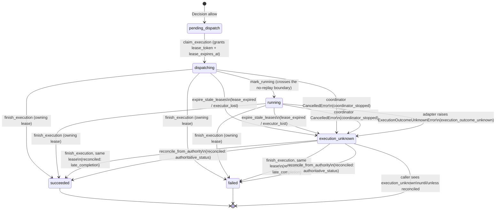

# Executor liveness and orphan recovery

Status: **implemented**, including the in-process MCP adapter. The
[Action Service](../action_service/README.md) owns production composition; fixture executors remain
test-only. This contract does not require an out-of-process worker transport, and it is independent
of backend credentials: an OAuth-linked group's adapter resolves the operator linkage token per
request ([README § MCP executor transports](../action_service/README.md#mcp-executor-transports))
without involving the lease.

## Problem

The Action Service coordinator dispatches at most one Execution per allowed ActionRequest and must
never retry once a dispatch attempt may have started (see
[`../action_service/README.md`](../action_service/README.md)). Before this change, the only
recovery signal was the coordinator's own process restart: `start()` unconditionally marked every
`dispatching`/`running` Execution `execution_unknown`. That is correct only because dispatch was
in-process — the coordinator restarting _was_ the executor dying. It breaks the moment dispatch and
execution become separable processes: a coordinator restart must not assume a live, still-working
executor died with it, and a genuinely dead executor must eventually be noticed even if the
coordinator process never restarts at all.

## Design

Two independent, durable liveness signals, both stored in Postgres so a bounded expiry rule applies
the same way regardless of which process (or how many restarts of it) happens to be running:

- **Executor-level health heartbeat** (`action_executor_heartbeat`): a coarse "this executor
  identity is alive" signal, sent on a fixed interval for as long as the coordinator process is up,
  independent of whether it currently holds any Execution.
- **Per-Execution lease** (`action_execution.lease_token` / `lease_expires_at`): granted at claim
  time with an unguessable `lease_token`, the authentication artifact for every later
  worker-originated call about that one `request_id` — the seam a future out-of-process worker
  would present over the wire, called in-process for v0 via `ExecutionLease.heartbeat()`. The MCP
  adapter renews it on a fixed interval while `tools/call` is in flight, and the coordinator keeps
  renewing while it persists the completion
  ([README § Shutdown budgets](../action_service/README.md#shutdown-budgets)). Renewal proves the
  local owner is alive, not that the backend is progressing: a hung call is bounded by the adapter's
  execution deadline, which raises `ExecutionOutcomeUnknownError`, while lease expiry catches a
  dead or stalled owner.

A periodic sweep (`ActionStore.expire_stale_leases`) — not process startup — marks a lease-holding
Execution `execution_unknown` when its lease lapses. The owning coordinator also records
uncertainty itself when it can: `execution_outcome_unknown` when the adapter raises
`ExecutionOutcomeUnknownError`, and `coordinator_stopped` when a claimed dispatch is cancelled,
whether `dispatching` or `running`. The sweep runs identically before and after any coordinator
restart, so "the old process died" and "a separate worker died" are indistinguishable by design,
and both get the same safe treatment. The sweep also distinguishes, for operator
diagnosis only, whether the owning executor's own health heartbeat is also stale
(`executor_lost`) or the executor is otherwise heartbeating and only this one attempt stopped
renewing (`lease_expired`); both are equally final.

Because a lapsed lease does not prove the external effect stopped, the terminal `execution_unknown`
row can still be **reconciled** later — never replayed — by whichever of two authenticated paths
learns the truth first:

- **Late completion**: the _same_ `executor_id`/`lease_token` issued at claim time finally reports
  a result. Authenticated by presenting that lease; this is the identical call an on-time
  completion would have made, so no new coordinator logic decides "was this late."
- **Authoritative reconciliation**: a separate, adapter-specific authoritative status lookup
  reports the true outcome. This path only ever applies to an Execution already
  `execution_unknown` — it never touches a still-dispatching/running row, so it cannot race or
  preempt a live attempt and cannot start a second effect.

## State transitions

An owning caller can cancel `pending_dispatch` before the atomic claim; the Execution becomes
`cancelled` without a `started_at`. After claim, caller cancellation is refused even if the executor
has not yet been invoked. See [the cancellation API](../action_service/README.md#cancellation).

## Reason codes

`UnknownOutcomeReason` (`error.kind` on an `execution_unknown` Execution):

| Code                        | Meaning                                                                    |
| --------------------------- | -------------------------------------------------------------------------- |
| `execution_outcome_unknown` | The adapter itself raised `ExecutionOutcomeUnknownError`.                  |
| `coordinator_stopped`       | Graceful shutdown mid-dispatch; the coordinator marked it unknown itself.  |
| `lease_expired`             | The lease lapsed; the owning executor's own health heartbeat is fresh.     |
| `executor_lost`             | The lease lapsed and the owning executor's health heartbeat is also stale. |

`ReconciliationSource` (`reconciliation_source` on a reconciled Execution, operator/audit-only —
not projected to callers):

| Code                   | Meaning                                                               |
| ---------------------- | --------------------------------------------------------------------- |
| `late_completion`      | The original lease-holding attempt finally reported in.               |
| `authoritative_status` | A separate authoritative status lookup reconciled an unknown outcome. |

None of these carry adapter/provider text; `FAILED` executions still classify by
`type(error).__name__` as before, unrelated to this liveness mechanism.

## What this does not decide

- Transport for a real out-of-process worker (still in-process; `ExecutionLease` is the contract a
  network call would eventually carry).
- Which credential a worker process may hold, or its Kubernetes ServiceAccount boundary.
- Any concrete authoritative status lookup — `reconcile_from_authority` exists as a store primitive;
  no adapter calls it yet.
- Executor identity lifecycle: `executor_id` is a fresh random value per coordinator process
  lifetime, so `action_executor_heartbeat` accumulates one stale row per past restart. Acceptable at
  this scale; a stable pod-derived identity or a row-expiry sweep is future work if it isn't.
