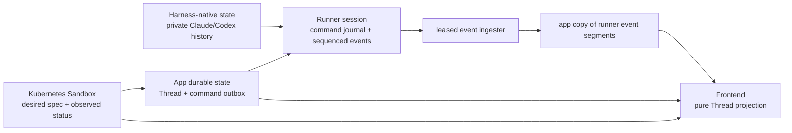

# Thread, runner, and harness layering

Status: **target contract.** This is the single cross-layer contract for durable
Threads, commands, event projection, and the Thread page. It applies to the hard-cut
runner command protocol; it provides no compatibility for older runner events or
stored histories. [The runner specification](../runner/SPEC.md) owns exact wire fields
and runner recovery mechanics. This document owns their meaning above the runner.
Plans and UI work should link here rather than restating this model.

The aim is simple: accepting user intent survives a tab close, app-replica crash,
runner restart, and reload, without claiming a harness or model did something before
evidence says so.

## Separate representations, separate authorities



| Representation                    | Owner and identity                                                                                                     | Ordering / promise                                                                                                                 | It is not                                                          |
| --------------------------------- | ---------------------------------------------------------------------------------------------------------------------- | ---------------------------------------------------------------------------------------------------------------------------------- | ------------------------------------------------------------------ |
| Harness-native conversation       | Claude Code or Codex; native thread/session/message ids are harness-owned.                                             | Whatever that harness can resume and report. It can include context, queue state, compaction, and facts the runner never observes. | A portable LLM transcript or cross-harness canonical conversation. |
| Runner session                    | Runner state volume, client-chosen session id; it owns a command journal and Event log.                                | Dense, strictly increasing Event sequence within that session, replayed across reconnect/restart.                                  | The durable product Thread or an Attach transport stream.          |
| Thread                            | App PostgreSQL thread id; product identity used in URLs, sidebar, and archive.                                         | Owns ordered desired commands; may use several runner-session associations over time.                                              | A native harness thread or runner session.                         |
| Thread runner-session association | App record of one Thread attached to one runner session in one concrete Sandbox; a successor can name its predecessor. | One ordered runner Event segment. No invented global runner order across segments.                                                 | Proof of native continuation before the runner records it.         |
| Sandbox lifecycle / bootstrap     | Kubernetes owns Sandbox desired state and observed CR/Pod status; runner initialization owns its sandbox-scoped log.   | Kubernetes status/resource order and initialization sequence are their own orders.                                                 | Runner/harness Event sequence, command admission, or transcript.   |
| Thread-page projection            | Frontend reducer over app-replayed records.                                                                            | Deterministic from durable Thread commands and copied runner Event segments plus a projection version.                             | Another authority over runner or Kubernetes facts.                 |

The harness is deliberately below the product boundary. A Thread aims to remain a
stable, useful history when its **same harness** exits and resumes, but Agentplane
cannot make Claude and Codex expose the same underlying model transcript while it
does not own either harness. Native frames remain evidence; the product view never
pretends native structures are interchangeable.

## Durable identities and replica ownership

The app accepts a **Thread command** in one database transaction. A new Thread mints
its Thread id, records a Sandbox target and first runner-session plan, and appends
the first command. An existing Thread only appends a command. The command id is chosen
then and is the same id delivered to the runner; there is no separate conversation,
input, transport, or launch request id.

A Thread command is durable product intent across Sandbox suspension and successor
harness sessions. A runner Command is its session-scoped delivery/execution form. The
app targets the active Thread runner-session association with the same stable command
id; the runner deduplicates it within that session. The fate of a command unsettled
when that association is replaced is intentionally deferred below; initial
reconciliation makes no automatic cross-session replay choice.

A Thread Sandbox target is targeting, not a second Sandbox lifecycle record: it either
pins an existing Sandbox name/UID or holds enough resolved input to create one. Once
Kubernetes materializes a new target, the app pins its identity and Kubernetes remains
the sole owner of mutable desired state and status. A preset only pre-fills fields the
user can edit; it is not a runtime identity.

Several app replicas may accept and reconcile Thread commands. PostgreSQL row locks
and uniqueness constraints serialize command ordinals and prevent conflicting targets
or payloads from occupying one identity. A reconciler never holds a transaction across
Kubernetes or gRPC: it retries those calls with the durable Sandbox identity,
runner-session id, and command id.

Runner Event ingestion has a different ownership rule. Exactly one _current_ app
replica holds the renewable, PostgreSQL-fenced ingestion lease for a Sandbox. That
holder follows every runner session in the Sandbox and writes copied Events from its
committed cursor. A crashed/expired holder is replaced; replay is idempotent by
runner-session sequence. It need not be the replica that accepted or dispatched a
command. Browser SSE reads committed PostgreSQL state, never an ingester's local
stream.

### Required app records

The SQL shape may evolve, but these identities and boundaries are required:

| Record                      | Required contents and invariant                                                                                                                                                                                |
| --------------------------- | -------------------------------------------------------------------------------------------------------------------------------------------------------------------------------------------------------------- |
| **Thread**                  | Product Thread id, presentation fields, and archive state. The id is minted before the first command and is never a runner-session id.                                                                         |
| **ThreadSandboxTarget**     | Either an existing Sandbox name/UID or fully resolved creation input until Kubernetes creates the correlated object. Afterwards it pins the concrete name/UID without mirroring mutable Sandbox lifecycle.     |
| **ThreadRunnerSessionPlan** | Planned runner-session id and immutable session spec; it may exist before a Sandbox UID or running harness. A successor plan may name the prior association only as requested continuation intent.             |
| **ThreadRunnerSession**     | Actual Thread-to-Sandbox-UID-to-runner-session association, written only after runner evidence. It stores any predecessor/continuation proof the runner supplied. One is the active delivery target at a time. |
| **ThreadCommand**           | Thread id, stable command id, one Thread ordinal, and the exact immutable protobuf `Command` payload. Its committed presence is app admission; it is desired intent, never a mutable launch phase.             |
| **Copied runner Event**     | Thread runner-session association plus runner sequence and exact Event payload. Its uniqueness makes replay idempotent and is the normal-projection input.                                                     |

The runner journal is runner-owned recovery support, not an app table or a second
outbox. Its native correlation and durable admission/effect records reach the app only
through replayable Events. The existing Thread-start persistence is a transition toward
the atomic **Thread + target + session plan + first Thread command** write; it must not
remain a parallel launch subsystem.

### The outbox is desired state, not lifecycle history

```text
new Thread request                         existing Thread request
------------------                         -----------------------
mint Thread id                             use Thread id
write Thread + target + session plan       append ThreadCommand
append first ThreadCommand                 commit
              \                           /
               durable Thread-command outbox
                            |
                            v
        reconcile Sandbox prerequisites, runner association, then command
                            |
                            v
                 copied runner admission/effect/outcome Events
```

Kubernetes status is a prerequisite observation, never a Thread-command phase. The
outbox and runner Event copy therefore express one desired record and one actual
record without an app-owned imitation of Sandbox lifecycle.

### One `Command` / `Event` language through the app

The app does not translate an ordinary product command into a frontend-specific input
body and then translate it again for the runner. The generated protobuf `Command` is
the payload on both hops, with one stable `command_id`:

```text
frontend -- Command(id) --> app ThreadCommand ledger
app ThreadCommand ledger -- same Command(id) --> runner journal
runner -- Event(CommandAdmitted / effect / terminal outcome) --> app copy --> frontend
```

Committing the `ThreadCommand` is the app's additional durable boundary: the app has
the command even if no runner exists or it has not attempted delivery. It is not a
runner `CommandAdmitted` Event and must not be rendered as one. The runner alone emits
`CommandAdmitted`, causal effects, failures, and no-ops. App validation that refuses
to store a command is a request error, not a fabricated runner failure.

The app-to-frontend replay stream therefore has a small typed transport envelope, not
a second command/event vocabulary:

```text
ThreadRecord {
  thread_id
  replay_cursor                  // lossless browser replay only, not transcript order
  command: { ordinal, payload: Command }
       | runner_event: { runner_session_association, payload: Event }
}
```

The envelope supplies the Thread identity, command ordinal or runner-session
association, and a durable browser replay cursor. A runner Event sequence remains
ordered only within its runner session; the app cursor must never be used to invent a
cross-session conversation order. Sandbox/Kubernetes lifecycle observations remain
separately-provenanced operational state, not runner Events.

The browser sends generated `Command` JSON, observes the echoed durable `Command`
record, and reduces the same generated `Event` payload the runner emitted. It can
therefore reconstruct after reload and across browsers without a server-side
conversation-item protocol: a command with no `CommandAdmitted` is awaiting runner
admission; admission/effect/terminal UI state is a pure fold of that command and later
runner Events. The normal conversation spine still projects runner Events only, so an
app-stored command remains in the distinct pending queue until native evidence places
it in the conversation.

## Command protocol: intent, admission, then outcome

The app outbox and runner journal are different records.

| Stage               | Durable authority                           | Meaning                                                                                                                                   | Truthful UI state                           |
| ------------------- | ------------------------------------------- | ----------------------------------------------------------------------------------------------------------------------------------------- | ------------------------------------------- |
| App stored          | App Thread-command ledger                   | The app durably has this exact `Command`; no runner admission is observed.                                                                | Awaiting runner admission.                  |
| Dispatch attempted  | App delivery diagnostics, when retained     | A replica attempted idempotent delivery; a lost response cannot prove admission. Retry the same id.                                       | Still awaiting runner admission.            |
| Runner admitted     | Runner journal plus `CommandAdmitted` Event | Runner durably recorded this command. It has not promised native delivery, model selection, interruption, or timing.                      | Runner admitted; awaiting outcome.          |
| Effect              | Causal runner Event                         | The operation took effect: harness user-message confirmation, model changed, interrupted turn completion, or command-caused harness exit. | The completed effect at its Event position. |
| Terminal non-effect | Causal runner Event                         | Command failure cannot take effect; no-op became inapplicable.                                                                            | Failed/no-op, with reason.                  |

Admission and terminal outcome replay separately. A runner restart reconciles its own
journaled nonterminal command under the original command id; the app never treats a
timeout as failure and never manufactures a generic **uncertain** terminal state. An
unreachable runner or Sandbox is a prerequisite observation, not an outcome.

The runner serializes command _admission_ under its session lock. Admission therefore
has runner-journal admission order. That is not HTTP arrival order across
concurrent app requests or Attach streams, and not a promise that terminal effects
occur in that order. A terminal Event names the causal command; its runner sequence,
not a cross-layer timestamp, is the ordering fact the view may use.

Thread ordinal defines desired order, but command eligibility is operation-aware. A
runner-admitted model change blocks a later command that would start a new turn until it has
an effect or terminal non-effect; it need not stop a harness-supported input from
joining the already-active turn. An interrupt targets the clicked turn id and must not
wait behind unrelated queued inputs or reach a later turn. These are reconciliation
rules, not a claim that terminal runner effects have one universal ordering.

### Inputs preserve actual harness grouping

Submit input is requested input. It becomes a user-message card only at harness user
message confirmation, which carries exact native text, a harness message id, turn id,
and all originating command ids. Claude may coalesce compatible queued inputs with
newlines; Codex may preserve them separately. The confirmation records grouping the harness
actually confirmed instead of inventing one-input/one-message.

### Interrupting before queued input reaches native history

An interrupted turn is not by itself an outcome for admitted inputs waiting in a
harness queue. After the causal interrupt outcome, the runner must settle every such
input command from native evidence:

- input already confirmed remains a confirmed harness message;
- input the harness dropped because of the interrupt receives a terminal CommandNoop
  whose reason names that interruption; and
- input the harness retains and later processes receives its normal confirmation at
  that later native position.

The runner must not leave a dropped input indefinitely as merely admitted, and it must
not call it confirmed because the app sent it. If a harness cannot prove one of these
facts across the relevant restart window, that input/interrupt combination has not
passed the durable Thread-command gate; it needs native evidence rather than an
invented uncertain state.

### Controls have effects, not invented scheduling modes

Model change, interrupt turn, and stop runner session use the same admission/effect rule.
A model picker is not successful when the app accepts it or the runner admits it:
success is the model-changed Event. Claude and Codex can reach that fact by different
native mechanisms, including a later Codex turn boundary. The protocol deliberately
does not offer arbitrary **now**/**at boundary** choices.

A future runner capability snapshot may report an operation-specific, time-local fact
such as “a model change would be promptly admissible now” or “the runner is busy and
would retain it.” It is advisory: it races with the command and never replaces admission
or terminal effect/outcome. It must name the operation and harness evidence, not become
a generic capability flag.

## Reconciliation and external prerequisites

For the oldest eligible Thread command, any app replica repeatedly reads the Thread
target, active runner-session association, copied Events, and Kubernetes snapshot,
then performs only the missing idempotent step:

1. Materialize/find a new Sandbox target, or observe the selected existing one.
2. Wait for Kubernetes/Pod state and runner reachability needed for attachment.
   Bootstrap output is operational evidence, not a Thread message.
3. Open or resume the planned runner session when its contract requires it. Persist a
   Thread runner-session association only after runner evidence identifies the actual
   attachment and any native continuation.
4. Dispatch the stable command id, then wait for copied runner admission and terminal
   Event. Retry delivery/observation paths; never replace the id.

Suspending/resuming a Sandbox is Kubernetes lifecycle, not a runner command and not
proof that a harness is ready for a Thread. A Sandbox resume can preserve processes,
replace them, or leave a runner temporarily unreachable; reconciliation obtains
runner/harness evidence before delivery. Conversely, a stopped or lost harness may need
explicit native harness resume even when Kubernetes says the Sandbox is runnable. The
runner owns the native resume operation and successor-session proof. This permits the
same high-level shape for “send after a suspended Sandbox resumes” and “send a first
message into a new Sandbox,” without fusing Sandbox, runner, and harness state machines.

### Deferred: commands unsettled across successor sessions

When a runner session/harness goes away with an admitted-but-unsettled Thread command,
the product may eventually choose either to recover it only in the predecessor session,
or to let a successor session resume and deliver it. Both can be sensible in different
native harness situations. This contract deliberately chooses neither yet: a successor
must expose its native continuation proof and the runner must demonstrate how it can
preserve command provenance and avoid duplicate native effects. Until then, the command
remains visibly pending with its predecessor association and no automatic replay occurs.

### Required harness-loss and Sandbox lifecycle cross-check

Harness process loss and Sandbox suspension are separate fault domains. Before making
either path product-automatic, pinned Claude and Codex tests must establish this
matrix against the mocked LLM server and a real runner state directory:

| Situation                                                  | Facts that remain separate                                                                                   | Required assertion                                                                                                                                                                                    |
| ---------------------------------------------------------- | ------------------------------------------------------------------------------------------------------------ | ----------------------------------------------------------------------------------------------------------------------------------------------------------------------------------------------------- |
| Harness process is killed while its runner remains         | Runner observes process loss/exit; the harness-native continuation may or may not resume in a new process.   | The Event log records loss and later restart/continuation evidence. No input/model command is duplicated; each is confirmed, failed/no-op, or remains pending only under the deferred successor rule. |
| Runner process is killed, state volume remains             | Runner journal/Event log survive; the former child process does not.                                         | Reattach replays exact admission/effect history and runner recovery reconciles the same command ids. The new harness process is checked for actual native resume behavior.                            |
| Sandbox is suspended then resumed                          | Kubernetes lifecycle says neither that a runner Attachment survived nor that native harness resume occurred. | The app shows operational suspension/reachability separately, re-establishes runner evidence before delivery, and preserves Thread/command queue through reload.                                      |
| Sandbox/pod is recreated during resume                     | Kubernetes may provide a new runner and the runner may provide a new harness process.                        | Record which predecessor/continuation proof exists; do not infer same-Thread native resume from Sandbox readiness.                                                                                    |
| Pending inputs are interrupted, then any case above occurs | Input queue fate is harness-native; interruption and process loss are distinct.                              | Each command is confirmed, failed/no-op, or later confirmed when proven, with no duplicate mocked-LLM request. Unsupported recovery remains visibly pending.                                          |

This matrix is evidence-first. It may supply facts needed for the deferred
cross-session-delivery choice, but does not pre-decide that choice.

### Storage/API migration before multi-session Threads

Today's session-shaped event/feed storage cannot represent this contract by merely
renaming columns. Before a Thread can have several runner sessions:

1. Introduce Thread runner-session associations, backfill one for each existing
   Thread, and make product Thread ids independent of runner-session ids.
2. Key copied Events by **Thread runner-session association + runner sequence** and
   move feed state to that association. Do not fabricate a global sequence across
   associations; add a Thread display order only if a later product need proves it.
3. Derive current Thread state from its active association instead of overwriting one
   session-shaped Thread feed snapshot.
4. Move list, read, title, archive, and transcript routes to Thread ids. Retain
   Sandbox/session routes only as explicit manual/diagnostic object views.

This is an atomic monorepo API change: no production path may sometimes treat a
runner-session id as a Thread id.

## Projection and the Thread page

The frontend owns the normal Thread projection. It has one conversation spine per
runner-session Event segment and is a pure, deterministic projection of replayed
runner Events plus a projection version: it does not inspect current Kubernetes state,
client time, or a live connection to create/reorder conversation items. Replaying the
same stored segment gives the same cards.

- Harness user-message confirmation creates the user-message card where the harness
  confirmed it, with origin command ids available for inspection.
- Item/turn Events create assistant text, reasoning, tool-call, and streaming cards in
  runner sequence. Normal mode compacts deltas; Raw mode expands exact Event order.
- Model change, interrupt, stop, failure, and no-op are distinct control/system
  cards, never assistant/user bubbles. The causal Event determines their position.
- A harness can emit assistant items before confirming later queued input. Confirmed
  input appears where it was processed, not where the browser submitted it.

The command queue is separate from the conversation spine. The frontend folds replayed
app-stored `Command` records with copied Events to list pending inputs, runner-admitted
inputs, model changes awaiting effect, targeted interrupts, and so on. It survives
reload from the outbox plus copied Events. It never makes a pending input look like
transcript content or a runner-admitted model change look applied. Terminal entries
leave it for the appropriate control/message card and inspectable history.

Sandbox status, bootstrap progress, runner reachability, and a deleted target are
separate operational status. They explain blocked delivery but are not inserted into the
harness conversation timeline.

### Raw mode is additive, never a fictitious total order

Raw mode remains on this Thread page and preserves normal cards at runner positions. It
adds expandable `ThreadRecord` provenance, exact generated `Command`/`Event` payloads,
native frames, source sequences, command ids, harness ids, and projection provenance.
Streaming, coalescing, admissions, and terminal effects are therefore debuggable beside
the normal view.

Runner Events belong on the per-session conversation spine because the runner owns
their sequence. App outbox acceptance/delivery observations and Kubernetes lifecycle
facts do not share it. Raw mode shows them in linked, visually distinct diagnostic
records—by command id, Sandbox identity, and their own durable order—rather than
interleaving timestamps into a fictitious global timeline. An unadmitted command is
visibly awaiting runner admission; a Kubernetes pause never masquerades as a harness Event.

### Client server state

The React client uses a server-state cache (for example, TanStack Query) for a Thread
record snapshot/replay and separate Sandbox operational state. SSE/transactional change
notifications invalidate or replace those server snapshots. A mutation may show only a
`Command` after the app has durably stored it; no component owns provisioning, delivery
retry, or inferred completion in local state.

## Implementation sequence

1. Normalize Thread identity versus runner-session association and persist the command outbox.
   Keep a Thread on one durable runner session at first: that session's Event sequence survives
   runner-process restart and reconnect, so successor-session Event segments are not an initial
   delivery prerequisite.
2. Prove native input behavior, then implement the multi-replica outbox reconciler for an
   existing Thread/Sandbox/runner session. It delivers the stable input id and persists only
   runner-authoritative admission/effect/no-op/failure Events.
3. Extend that working path to atomically create a Thread, select or create its Sandbox target,
   establish the planned runner session, and deliver its first outbox command. Do not expose a
   combined Sandbox+Thread start on the persistence-only foundation.
4. Ship the additive unified composer and durable pending-command queue; preserve
   manual Sandbox/session surfaces.
5. Add controls through the same outbox only after their per-harness admission/effect
   recovery gates pass.
6. Decide and implement successor-session delivery, including per-association Event segments,
   only after the deferred native continuation evidence exists.

### Product command cutover

The Thread page has one command ingress: it persists `SubmitInput`, `InterruptTurn`,
`ChangeModel`, and `StopRunnerSession` in the Thread outbox. The reconciler is the only normal
app component that may turn that durable intent into a runner `Command` write. This does not make
the runner transport indirect; it forbids a second app/UI path that can bypass durable intent and
its admission/effect projection.

Accordingly, the direct session-command HTTP routes for input, interrupt, model change, and runner
stop are removed with this cutover, along with their normal frontend callers. No compatibility
aliases remain. Manual Sandbox/runner lifecycle and inspection surfaces still exist, but a normal
runner command from them must name or create a Thread and enter the same outbox. A test-only or
explicitly diagnostic runner control can exist only as a separately bounded surface, never as a
fallback from product UI.

## Required guarantees and tests

| Contract           | Required evidence                                                                                                                                                                                                                                                                                                                        |
| ------------------ | ---------------------------------------------------------------------------------------------------------------------------------------------------------------------------------------------------------------------------------------------------------------------------------------------------------------------------------------- |
| Native translation | Scripted Claude and Codex tests against the mocked LLM server cover input grouping, interruption, queued-input fate after interrupt, harness loss, Sandbox suspend/resume, model effects, restart/resume, and native correlation. A common Event is emitted only for proven behavior.                                                    |
| Runner recovery    | Real-process crash tests cover journal-before-admission Event, admission before app observation, native effect before public Event, and terminal Event before app ingestion, including an interrupt racing queued inputs and a runner/harness restart. Test checkpoints use the normal replayable runner stream only under test options. |
| App reconciliation | Integration tests kill/restart delivering replicas at each delivery window, run competing replicas, and prove one durable command id converges without duplicate native effect. PostgreSQL locks/fences are exercised.                                                                                                                   |
| Projection         | Replay/property tests project identical stored Event segments identically; visual tests prove a pending command is absent from normal transcript until causal Event.                                                                                                                                                                     |
| Reload and UI      | Cover new Sandbox+Thread, new Thread in existing Sandbox, history, Sandbox starting/suspended/missing, streaming, admission-without-effect (especially queued model change), terminal outcome, and Raw provenance. Reload retains the same Thread and pending/observed state.                                                            |

Manual object-lifecycle surfaces remain: create a Sandbox without a Thread, inspect or
open a runner session, and operate Sandbox lifecycle directly. Thread-first is a
reliable higher-level workflow, not concealment of the underlying objects.

## Non-goals and cutover

- No cross-harness native transcript portability.
- No claim that a Sandbox transition, bootstrap action, gRPC write, or runner admission
  is a harness effect.
- No generic unqualified “policy”: targeting names explicit egress policies and action
  policy sets.
- The runner command cutover reads/writes only the new command-journal and causal-event
  schema. It does not translate, dual-write, migrate, or infer older command histories.
