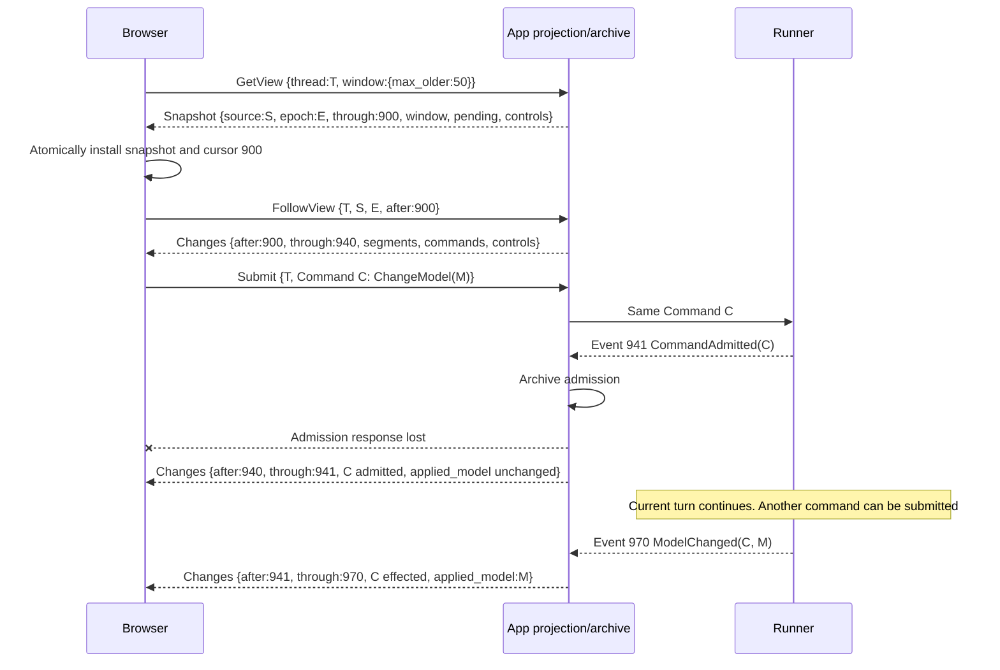
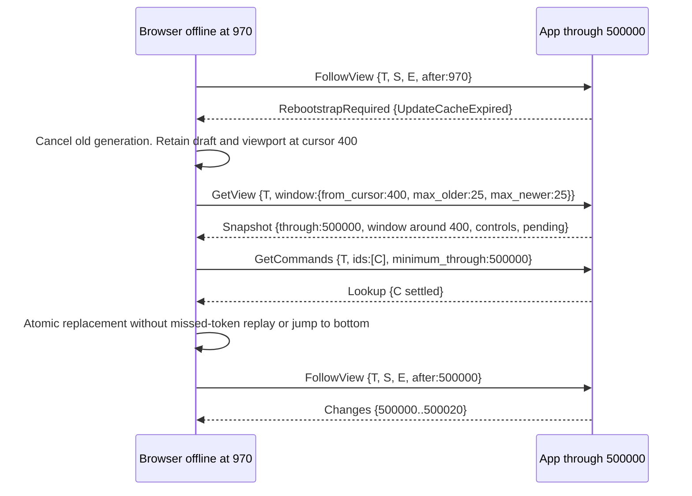
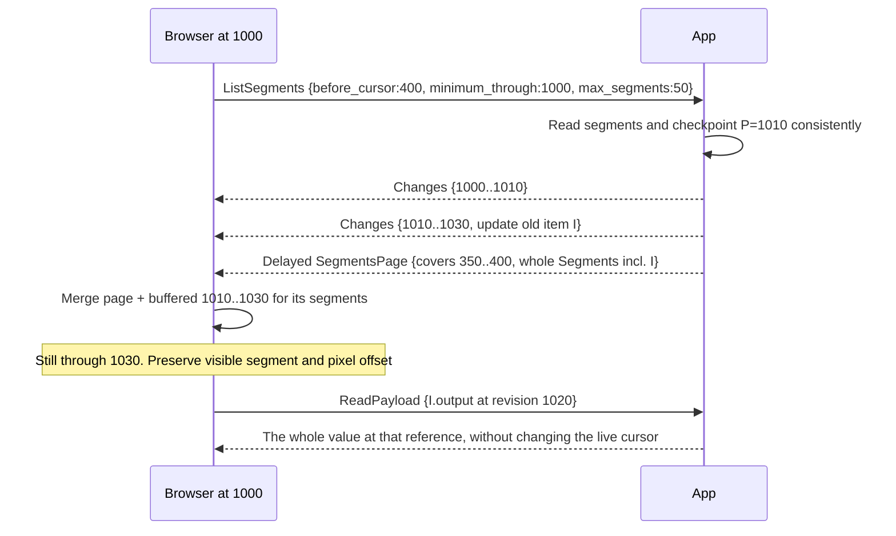

# Thread view synchronization

Status: **proposed contract, not deployed.** This document owns the derived
app-to-browser read API. [Thread layering](thread_layering.md) owns identities,
runner durability, command semantics, and the distinction between conversation,
pending commands, and operational state. The schemas below select API shapes;
they are not checked-in executable protobuf definitions yet.

## Requirements

What the protocol must do, independent of how. Each is falsifiable, and the
[acceptance matrix](#failure-and-acceptance-matrix) says how each is observed. The
decisions below are answers to these; where a decision stops serving one, the decision
is what changes.

1. **Opening is bounded.** What opening a Thread transfers and processes does not grow
   with the Thread's length. A month-old Thread opens like a new one.
2. **A screenful is enough to work.** What arrives first is the part of the conversation
   the reader is looking at, the current controls, and the pending queue — enough to read
   it and to submit a command. Older history and exact evidence load on demand, and never
   load in the background merely because a tab stayed open.
3. **Values stream as they grow.** An assistant message, a reasoning step, and a tool
   call's arguments and output appear while they are being produced, not only once they
   complete. Following a growing value costs what was added to it, not its size on every
   update — otherwise the view costs more than the raw Events it replaces.
4. **Following never reloads.** A reader holding a view receives what changed and never
   re-reads the Thread to stay current. After a gap it resumes from the position it
   holds, or is told explicitly that it must bootstrap again.
5. **A command's fate is observable.** A command can be submitted and what became of it —
   admitted, taken effect, failed, or not yet observed — read afterwards, including across
   a lost response or a reload, without downloading history to find it.
6. **Every step is consistent.** A bootstrap plus every update that follows equals what a
   rebuild at the same position produces. No update leaves a reader holding a state the
   log never passed through.
7. **Nothing is lost underneath.** Everything the view omits stays exactly retrievable.
   The derived view is a convenience over the archive, never a replacement for it.

## Decisions

- Keep the runner's sole command queue and the app's lossless copy of its Events.
  Materialize a rebuildable conversation read model in PostgreSQL. Opening a page
  must not replay the entire Thread on either server or browser.
- Normal mode reads recent assembled segments, current controls, and pending-command
  summaries, then follows compact changes. Raw Events and large payloads are demand
  reads. Neither initial loading nor idle background work downloads full history.
- Use protobuf-defined unary RPCs and server streaming. No client or bidirectional
  stream is needed: commands are independent unary calls; subscriptions resume with
  an explicit cursor. A dropped connection does not cancel admitted work.
- Use one original runner cursor space. A projection checkpoint is a position in
  that space, not a new app Event number. Derived changes are explicitly not Events.
- Evaluate TanStack DB as the read-only normalized frontend store. The actual
  library spike supports same-collection atomicity; transport and React integration
  still need their own tests. Do not add a second mutable server-state cache.

The [measured short Thread](../debug/thread_load_20260915.md) had eight turns but
3,091 Events and approximately 1.79 MB of SSE. Completed text/reasoning contained
6,278 bytes. This motivates materialization, not just compression or virtualization.

## RPC transport and generation

Browsers need a browser-compatible transport, not a direct `grpc.aio` connection.
Preferred integration to validate: `@connectrpc/connect-web` with binary protobuf
and a Python Connect ASGI service mounted alongside FastAPI on the existing origin.
The same client supports [Connect and gRPC-Web](https://connectrpc.com/docs/web/choosing-a-protocol/).
Choose Connect wire transport for the ASGI integration; call it Connect, not native
gRPC. Unary and server-streaming service definitions remain ordinary protobuf RPCs.

[Connect Python](https://github.com/connectrpc/connect-py) supports ASGI and Google's
protobuf runtime with its `protobuf=google` plugin option. Reuse existing `_pb2`
types and Protobuf-ES messages; do not introduce another Python message runtime.
This is a candidate backed by upstream support, **not an executed Agentplane
transport validation**. If it fails the build/auth/streaming gate, evaluate
`grpc.aio` plus a standard gRPC-Web translator. Do not write a framing protocol.

Generation must use standard Bazel rules and pinned local plugins:

- Keep `@protobuf` message targets and Aspect `ts_proto_library`.
  [Protobuf-ES service descriptors](https://connectrpc.com/docs/web/generating-code/)
  are sufficient for Connect clients; no second TypeScript service generator.
- Evaluate [standard Python gRPC rules](https://rules-proto-grpc.com/en/latest/lang/python.html)
  or their [plugin extension mechanism](https://rules-proto-grpc.com/en/latest/custom_plugins.html)
  for the chosen service generator. A Connect server requires its Connect plugin;
  `grpc_python_plugin` alone generates a different server interface.
- The repository currently has a narrow service-codegen rule in
  <../../../devinfra/python/grpc.bzl>. Its historical `rules_python` conflict is not
  sufficient justification: current `MODULE.bazel` already uses `rules_python` 2
  and patches `rules_conda` for it. Recheck the selected standard rules in a build;
  record a concrete remaining blocker before proposing an exception. No new
  shell-driven codegen, remote Buf plugin service, checked-in stubs, or duplicate
  import-closure wiring. Retiring the existing workaround can be a separate PR.

Transport acceptance requires an actual Bazel-built browser client and Python
server: unary, incremental server messages before EOF, cancellation, terminal RPC
errors, cookies, auth expiry, and cursors above `2^53`. Then exercise the deployed
ingress: buffering, idle timeout, reconnect, and replica replacement. HTTP/2 support
at an ingress does not by itself prove gRPC-Web translation or native gRPC support.
Extend `//x/agentplane/app:test_thread_browser`, which already exercises a real
browser, app and PostgreSQL. Mount RPCs before the SPA fallback, and retain app
draining behavior for open streams.

Mounting an ASGI service does **not** inherit FastAPI route dependencies. Every RPC
must use the existing caller/session authorization boundary, including resource
access checks; middleware alone is not proof. Require same-origin requests, explicit
cookie/CSRF protection for mutations, no wildcard credentialed CORS, and structured
unauthenticated errors instead of HTML login redirects inside a stream. Bound stream
lifetime and recheck authorization so an expired/revoked login cannot read forever.
Cancellation releases listeners/transactions; it never issues an interrupt command.

## Schema ownership and service surface

Keep `protocol/{command,event,event_log}.proto` harness-neutral and unchanged by view
requirements. `app/thread_view.proto` holds the derived types, `app/thread_api.proto` the
services and request envelopes. Both reuse the generated `Command`, `Event`, `EventEntry`,
`EventOrigin`, item/turn enums and timestamps. The runner must not import either app file.
There is no product identity named Conversation.

**Those two files are the service surface.** They carry the protocol overview, worked
interactions and per-field semantics, and this document does not restate them. An earlier
version of this section listed every method and request shape, and drifted from the schema
within a week of the schema existing.

`ThreadCommandService` covers submission and queries of both pending and settled commands.
Its reads share the view's materialized checkpoint; the service boundary does not introduce
an app-owned queue or another ordering.

Operational inventory and runner status remain a separate authority. Existing live
inventory endpoints stay. A later RPC replacement can offer unary reads and
server-streaming snapshots with its own version and staleness metadata; it cannot borrow a
Thread projection cursor. Sandbox CRUD, egress and action policies, Actions, connections,
consent and settings are not converted by this work.

## Positions, segments and payloads

The shapes are in `thread_view.proto`. What follows is what a schema cannot state about
itself.

**One integer timeline.** The runner journal's dense sequence. The app archives each Event
under that same number rather than assigning its own, which `TrajectoryStore.record`
enforces, so a Segment's position, a Command's admission and a payload's revision are
directly comparable. A projection checkpoint is a position in that space, never a new app
Event number, and derived changes are explicitly not Events.

- `source_id` is the original runner journal identity. A changed source is an integrity and
  recovery condition, not a routine cache reset. Where the app has not observed that
  identity yet, answer with an explicit projection-not-ready error rather than inventing a
  source for an empty view. A known empty source can legitimately sit at a zero checkpoint.
- `projection_epoch` identifies one coherent materialization generation. It is not an Event
  counter and not a compatibility version. A rebuild publishes a new epoch atomically, and
  clients rebootstrap rather than combine generations.
- `through_cursor` covers every original Event through that position, including Events that
  produced no Segment. Only a successful atomic installation advances it. A Segment's
  revision says when that Segment last changed, not what a browser has consumed.

**Most Events are carried, not transcribed.** Only an Item is folded, because only an Item
accumulates across Events -- it is why a derived view exists at all. An Event whose meaning
is already its final state is carried verbatim, so a reader learns one vocabulary rather
than a parallel restatement of it, and keeps the Event's timestamp and causal
`source_sequences`. Three things are genuinely derived, each joining or accumulating rather
than renaming: `Item`, `CommandSummary`, and `Controls`.

Command Events drive the queue and the controls, and produce no Segment. Grouping runs of
tool calls and reasoning is a rendering rule over whatever a client is showing, not a fact
about the log, so nothing marks one.

`Controls` carry the evidenced applied model, active-turn identity and observed harness
state. Initial configuration is separately identified as configuration provenance.
`Attached` may be ahead of the archive and must not seed these Event-derived values.

**A growing value streams as its growth.** A batch extending a Segment the caller is known
to hold carries only what was added; re-sending a value whole on every update costs the sum
of its prefixes, which is worse than the raw deltas the view replaces. A Segment the
interval created arrives whole, as does a value replaced rather than grown -- authoritative
arguments are not an extension of the partial JSON they supersede. A caller that cannot
apply an extension re-reads that Segment rather than inventing a base. Snapshots and history
pages only ever carry whole values.

**Payloads are immutable at a reference**, scoped to the source and projection epoch, so a
corrected rebuild cannot reuse an old derived payload's cache identity. Exact raw references
remain epoch-independent original Event identities, not derived payload references, and
`ReadPayload` with an `EventOrigin` returns serialized `EventEntry` bytes. A payload is
returned whole: a finished value is never split across responses. UTF-8 byte offsets within
one are not JavaScript string indices.

Unloaded, loading, loaded-empty, streaming, failed-fetch and unavailable payloads are
distinct UI states. Loaded payload caches are immutable and separate from mutable Segment
metadata; they never become another authority for item completion.

## Server materialization and replay

The projection is a deterministic fold of a **committed contiguous** archive prefix,
plus explicit immutable configuration provenance where Events lack an initial seed.
It preserves the existing normal/Raw grouping semantics without retaining native
payloads in each segment. Test parity with the current reducer's meaningful output;
do not preserve accidental duplicate completion presentation.

For each bounded batch `(H, K]`, a projector transaction locks the Thread projection
checkpoint, reads its next archived Events, updates segments/command indexes/controls,
records the derived change batch, and advances the checkpoint to `K`. Commit before
notification. Multiple app replicas can serve reads and submissions; a row lock or
fenced worker lease serializes projection writes. This is independent of the existing
Sandbox ingestion lease. Projection may lag archival; report the two positions
separately in debug/operational status.

Retain a bounded journal of **derived updates** for short reconnects. It is a
rebuildable cache, not another durable command queue or independent Event history.
Each batch records original interval endpoints, not an app sequence number. Read
transactions observe segments, controls and the checkpoint consistently. `LISTEN/NOTIFY`
only wakes durable rereads; notifications lost between replicas or over reconnect
cannot create gaps. Follow registers for wakeups before its last empty reread and
checks again after listener reconnection. Do not hold a DB transaction open for the
lifetime of a browser stream.

Publish empty-visible-change batches too: a run of only native Events still advances
coverage. Coalescing within a batch must retain every new historical Segment and
command/control effect, even when its final state supersedes an earlier intermediate
state. Exact intermediate streaming chronology remains in Raw.

Keep the committed batch boundaries on replay; every snapshot position is one of
those boundaries. A single source Event can affect many segments: if its update exceeds
the transport budget, require bounded rebootstrap rather than publish half an effect
or invent intermediate runner cursors. Large bodies remain referenced payloads.

Before replay, enforce limits on retained batches, bytes and catch-up work. If the
cursor expired or the budget would be exceeded, send `RebootstrapRequired` with a
typed reason, then close normally. A slow consumer gets bounded buffering and the
same resync path, not unbounded memory. A broken source, conflicting duplicate,
future cursor, or corrupt projection is an error, not an empty fresh snapshot.
Transport keepalives are not committed progress and have no invented cursor.

Rebuild off the archived prefix into a new epoch, catch up, and atomically select
that epoch. Reject/make explicit an incomplete archive; never skip corrupt Events.
An unsupported new observation must halt the affected projection with a diagnostic
until interpreted; exact evidence remains readable. Rebuild is background work,
not work charged to the first viewer. Update-journal expiry does not delete raw data.

## Snapshot, live stream, and command recovery

A batch that extends a Segment the caller holds carries only what was added, so an Item
streaming over hundreds of Events costs its final size rather than the sum of its prefixes.
A caller that cannot apply an extension re-reads that Segment.

`Submit` never waits for native effect. A normal return proves archived admission;
a timeout/cancellation does not prove non-admission. Retain the exact local command
until matched against archived evidence. A submit receipt beyond the installed view
cursor can show saved confirmation but must not advance view coverage or applied
controls. Ordinary input, model change and interrupt share this rule; interrupt
continues to identify the intended turn and cannot drift onto a later turn.

`GetCommands` reconciles old **settled** commands as well as currently pending ones.
`not_observed_through:H` is explicitly not a NACK. If the runner is reachable, retry
the same immutable ID/payload against its journal; never mint a replacement ID to
resolve an ambiguous response. Payload conflict remains a conflict. After a tab
reload, local records that were reconciled can be removed without downloading all
history. A queued model change remains pending until `ModelChanged`, failed or noop.

Pending summaries have their own bounded page independent of conversation segments.
Keep unresolved count and controls always present, locally submitted IDs pinned,
and fetch further pending entries on demand. Live command summaries/outcomes update
loaded entries and counts even when their admission is outside the history window.
The count must not imply the visible first page is the whole queue. Compare generated
Commands on reconciliation, not just summary text or IDs.

On a short reconnect, follow from the last installed position. Batches must start at
that position; duplicates require matching identity/content. Partial overlap or a
gap is not guessed through. Recover by rereading/rebootstrap; report conflicting
content as an integrity error. Connection loss leaves visible data marked stale.

On a long gap or epoch change, cancel the old subscription, increment the frontend
request generation, and get a new bounded snapshot whose window is where the reader is
parked rather than the tail. Install its segments, controls, commands and position
atomically, then follow, and reconcile any locally retained Command ids with
`GetCommands` against the position just installed. Preserve drafts, disclosures and
viewport position, not stale server truth. Old generation callbacks cannot write into the
new store. An unavailable cursor is reported with a reason; the client does not silently
jump to the tail.

## History and live-data races

History is keyset-paginated by each Segment's immutable cursor, not by timestamp or
offset. A new Segment cannot appear behind a cursor a caller already processed, and an
updated old Item keeps the cursor it started at.

**Chosen consistency:** each page is a current short DB snapshot at `P`, at least
the request's `minimum_through`. Adjacent pages need not share a long-lived historic
DB snapshot; stable cursors prevent insert-induced holes. A page's Segment revisions
are at most `P`. It does not advance the browser's live cursor.

The view stream includes compact changes for every affected segment, including those
outside loaded windows. The browser keeps a **bounded** recent change buffer, not all
those segments. This permits race-free hydration without a bidirectional subscription
or per-browser server-side window registry:

1. At installed cursor `H`, request the page with `minimum_through:H`; retain change
   batches from `H` while the request is outstanding.
2. A response at `P > current_cursor` waits until the live stream reaches `P`.
   It must not inject future state into an earlier snapshot.
3. If the browser is already at `K >= P`, merge the page plus buffered changes `(P, K]`
   for those Segments in one transaction. Ignoring a late lower-revision Segment is
   sufficient only where a newer whole Segment is already loaded; an evicted Segment may
   need the buffered extensions replayed onto the page, which is why the buffer exists.
4. If the needed buffer was evicted, an extension names a revision the page does not
   carry, or the epoch or source changed, discard and retry hydration or rebootstrap
   bounded windows. Never declare a stale page current. Requests and buffered bytes have
   explicit limits.

A page always carries whole Segments, so it is a valid base to replay extensions onto. An
extension for an unloaded Segment is buffered for a pending hydration rather than applied
to a fabricated empty Item. A page becomes observable only after that replay; showing an
unreconciled page as current would violate the checkpoint contract. Where a minimum cursor
cannot be served before the request deadline, report projection lag rather than return an
older successful page.

Pending-page and command-lookup hydration obey the same position/generation rules.
For pending membership, live settlement removes an entry even if it raced the page;
new admissions have higher cursors and are found through live updates. An immutable
payload needs no Segment overwrite: cache it by reference and show it only while that
reference is selected, or label a historical revision explicitly.

Keep a bounded tail window and, while reading far back, a bounded window around the
viewport. Evict/refetch intervening history; do not accumulate a month of segments just
because the tab stayed open. Pin controls, pending-page metadata and local commands,
not the entire turn. Prepending preserves the visible segment plus pixel offset. New
output sticks to the bottom only if the user was already there. Virtualization
bounds mounted DOM independently of network/cache bounds.

## Raw and debug surface

Raw remains additive to the same conversation order and disclosures. Show source,
Segment cursor and revision, installed projection cursor, applied command evidence and
separately reported archive/runner positions. Fetch exact frames and causal
`source_sequences` only when requested. Raw chronological entries retain original
cursor order even when an aggregate card spans interleaved streaming Events.

`ListEvents` reports the original range it scanned, which bounds what an empty page
proves and is where a caller resumes from. A direct evidence lookup can find Native frames
before the visible page and command Events, which the conversation carries no Segment for.
The raw follower is an explicit debugging option, not a background
requirement for normal mode. Neither raw pagination nor direct lookup moves the
conversation checkpoint. A live Raw panel follows archive availability separately
from the potentially lagging projection.

Availability is typed: retained, not-yet-archived, and unavailable. Transport failure is
not empty evidence. Raw authentication is no weaker than conversation authentication, and
raw payloads are not copied into routine telemetry or error messages.

Initial implementation retains **all** observed runner Events, native frames and
deltas. Optional app-wide/per-Thread retention is separate: define policy precedence,
runner/app scope, future capture versus deletion, absent-range explanations and
rebuild/recovery consequences before deleting anything. Final assembled text is not
a lossless replacement for partial output, crash boundaries or streaming chronology.

## Frontend ownership

One TanStack DB collection per open Thread owns a tagged union of segment, command,
control and coverage records. Commit each snapshot/change envelope with a single
collection transaction, so direct subscribers cannot see a new cursor with old
controls. Read-only custom synchronization owns writes; optimistic user mutations
cannot manufacture harness effects. Use selective queries per segment/queue/control.
Separate immutable payload/raw collections do not participate in live coverage.
Request generations and cancellation protect route changes and rebootstrap.

The test-only spike's focused Bazel tests passed collection atomicity, selective
subscriptions, generated `uint64` values above `2^53`, late-page regression, stale
generation rejection, evidence separation, eviction and mutation rejection:
[expanded test invocation](https://app.buildbuddy.io/invocation/0c593693-929f-4bab-a4ad-cb437efa60ff),
in [the test-only evaluation PR](https://github.com/agentydragon/ducktape/pull/7069).
This does **not** prove React render consistency, HTTP streaming, the page-buffer
algorithm above, or deployed performance. Validate those before production cutover.
If the library fails the required integration, use Redux Toolkit/RTK Query as the
alternative owner, not as another cache beside it.

Validate an entire batch before `begin`: the evaluated sync API has no public
rollback transaction. Await the commit receipt before marking initial load ready.
Automatic query-to-server pushdown is not established by the spike; the view manager
explicitly owns bounded requests, stream consumption and eviction.

Draft text, scroll/disclosure state and exact locally unconfirmed Commands remain
local state with distinct provenance. Do not persist authentication-independent
server caches across users; logout/identity change cancels subscriptions and clears
accessible cached data. React consumes the collection through the library's supported
external-store integration; no effect-based second copy of the entire Thread.

## Failure and acceptance matrix

RPC errors distinguish invalid input/ID conflict, authentication/authorization,
missing Thread, temporary unavailability/projection lag, exhausted resource budgets,
and integrity loss. A command rejected before admission has no runner Event;
post-admission failure has `CommandFailed`. A submit deadline is neither kind of
NACK. Retriable read errors preserve stale visible state and an actionable retry.
`RebootstrapRequired` is a typed sync transition, not an arbitrary transport error.

| Case                                                | Required observation                                                                                                              |
| --------------------------------------------------- | --------------------------------------------------------------------------------------------------------------------------------- |
| Short high-delta or month-long Thread               | Bounded first payload and work; assembled past text; no eventual full-history fetch                                               |
| First screenful only                                | The visible conversation, controls and pending queue render and accept a command before any history or evidence is fetched        |
| Item streaming over hundreds of Events              | Text and tool output appear while produced; bytes followed are proportional to what was added, not to the value's size per update |
| Empty/new Thread; projector behind archive          | Valid empty snapshot or explicit projection-not-ready; never fake successful catch-up                                             |
| Native-only interval                                | Coverage advances without fabricated conversation segments                                                                        |
| Active pre-window item, huge turn/output            | Current controls intact; bounded segments/previews; exact demand-loaded content                                                   |
| Model queued during Codex turn                      | Admission visible as pending; picker changes only on evidenced effect                                                             |
| Interrupt or command failure                        | Original target/cause and error shown; no fabricated interrupted/completed state                                                  |
| Claude-coalesced input                              | Exact confirmed text and all origin command IDs, at native confirmation position                                                  |
| Failed turn without output                          | Terminal Event visible with its error, without Raw and without a duplicate completion card                                        |
| Lost submit response; old settled local command     | Exact ID/payload reconciliation outside visible history; no duplicate send under a new ID                                         |
| App/projector/replica restart, missed notification  | Replay resumes from durable committed checkpoint; segments and coverage agree                                                     |
| Crash between projection writes/checkpoint          | Transaction rollback or complete batch, never partial progress                                                                    |
| Long gap, expired update cache, slow client         | Explicit bounded rebootstrap preserving draft and viewport; local ids reconciled on the new position                              |
| Late page/lookup/detail, eviction, stream race      | No regression or future contamination; buffered extensions replayed onto the page, or an explicit retry                           |
| Single Event revising many Segments                 | The whole batch or none of it; no partial cursor advancement                                                                      |
| Old-epoch payload returns after rebuild             | Immutable cache identity cannot collide; stale response cannot replace current bytes                                              |
| Repeated upward paging during live changes          | No gaps/duplicates; stable viewport, explicit exhaustion, bounded cache                                                           |
| Raw entry outside the loaded window                 | Exact original provenance and order; independent cursor and explicit availability                                                 |
| Sandbox suspended/deleted; runner unreachable       | Archived page readable, controls show evidence/staleness, submit does not pretend to queue                                        |
| Source conflict, unknown observation, corrupt batch | Explicit integrity/projection error; never silently reset or drop evidence                                                        |
| Auth expiry, cross-user cache, CSRF, stream cancel  | No auth bypass/leak; controlled login/reconnect; no unintended command cancellation                                               |

Reducer tests compare `snapshot(H) + changes(H,K]` to direct projection at `K`,
including randomized batch boundaries and all command outcome types. Database tests
exercise transactions, indexed bounded reads and cross-replica wakeup races. Frontend
tests exercise subscriber and render boundaries, the full hydration algorithm, and
visual states. Browser acceptance measures transfer, decoded bytes, mounted segments,
first usable view and reconnect work against the measured staging shape and synthetic
long history. Report browser measurements separately from host HTTP/store benchmarks.

## Implementation boundaries

Implement in independently reviewable units: transport/codegen probe; pure projection
and parity tests; transactional read model/rebuild/update journal; RPC reads/follow
and auth; frontend store/Thread cutover; history/payload/Raw demand reads and browser
acceptance. History and payload semantics must be supported by the initial schema,
even if their UI lands later. Delete obsolete full-history stores/reducers and direct
Thread HTTP callers at their replacement cutover; do not retain a compatibility mode.

No runner protocol migration, new command queue, combined Sandbox+Thread creation,
resume implementation, optional retention deletion or conversation-density redesign
is authorized by this document. Other app pages may adopt the chosen request/store
patterns later, preserving their own authoritative versions and domain APIs.
