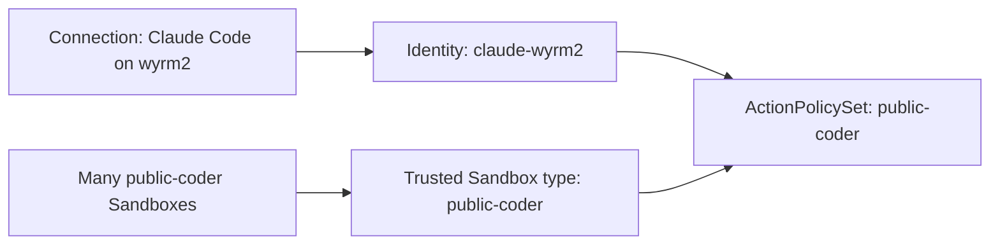

# Configured Action policies for external and hosted callers

Status: **`POLICYBIND` design gate before `CALLERPOLICY` and `SBPOLICY` implementation in
[the task DAG](task_dag.md).** The single
operator configures bounded auto-approval for both external MCP connections and harnesses running
in Threads inside Sandboxes. Both use the canonical Action Service and Decision lifecycle.

## Callers and policy selectors

| Caller                      | Trusted policy selector                                                                                                                                            | Request ownership                                                        |
| --------------------------- | ------------------------------------------------------------------------------------------------------------------------------------------------------------------ | ------------------------------------------------------------------------ |
| External MCP client         | Configured Identity resolved through its authorized Connection.                                                                                                    | Stable Identity; preserve the exact submitting Connection as provenance. |
| Harness in a Sandbox Thread | Authenticated `SandboxPrincipal` plus an authoritative classification of the Sandbox's configured type; the binding model below may resolve a configured Identity. | Existing namespace/Sandbox UID caller; preserve workload provenance.     |

Sandbox type groups callers for policy evaluation; it is not a shared caller identity. Two Sandboxes
of the same type may receive the same auto-approval policy but cannot thereby read each other's
Actions or share idempotency scope. Multiple Threads in one Sandbox currently share its workload
caller scope; this plan does not invent authenticated per-Thread isolation. Hosted harnesses keep
their workload-token path and need neither OAuth/DCR nor a configured external Identity.

The external enrollment workflow is in [external MCP connections](external_mcp_connections.md).
Shared concepts remain Identity (configured authority), Connection (runtime named client enrollment), Thread
(execution/conversation state), and Sandbox (workload boundary). No multi-operator management is
required for either caller class.

## `POLICYBIND`: storage and binding model

### Reusable policy sets and one source of truth

**Required reuse:** the operator can give an external Claude Code Connection the same Action
permissions as a class of hosted Sandboxes without duplicating configuration or sharing caller
identity. Use `ActionPolicySet` as a working name for the indirection: a named reusable definition
of permitted Actions, conditions, and bounded auto-approval deciders. Its final name/schema and
storage remain open; references to one canonical definition are the required behavior.

For example:

The Sandbox association may go through a configured Identity if the model below selects that
shape; either route references the same policy set. The Sandbox type and policy set can share a
display name, but an explicit reference is the authority: matching names never imply a binding.
The Connection still binds an Identity, whose policy association selects the reusable set.

Policies belong to the set and are evaluated through its reference. Creating a Sandbox, enrolling
a Connection, or binding another Identity must not copy those rules into an independently editable
configuration. An edit to `public-coder` applies to every reference under the chosen rollout and
in-flight consistency contract. Keep the evaluated policy revision as Decision evidence; that audit
snapshot is not another active policy definition. Missing/deleted references must not fall back to
an old copied allow or a coincidentally same-named replacement.

Keep the first model small: one reusable set can satisfy this example without an inheritance tree.
Whether a set references named constituent policies, callers may bind several sets, or bindings may
add narrower constraints remains design work. Define precedence and expansion limits before adding
composition; permission reuse must not silently become additive privilege union. Identity, caller
receipt ownership, credential bindings, and Sandbox/host restrictions remain separate. Sharing
`public-coder` means equivalent Action permissions under its conditions, not control over Claude
Code's local tools or automatic access to a particular upstream account's credentials.

This is the Action-only reuse slice. The broader cross-authority profile in [profiles](profiles.md)
remains deferred; do not create a competing Action-policy owner when that profile is later designed.

### Open model and storage choices

**Open design gate, not a selected schema.** Specify how policy configuration is associated with
authority and where that association is stored before implementing policy selectors or identity
tables. The policy binding and the OAuth Connection are different relationships:

- **Policy definition / set:** canonical named, versioned Action conditions and decider
  configuration reusable across caller classes, as above.
- **Policy binding:** an explicit reference from an Identity or trusted workload selector to a
  reusable policy set. Decide cardinality and combination/precedence without copying the definition
  or deriving authority from a shared name.
- **Runtime Connection binding:** the operator creates a named Connection during OAuth enrollment,
  associates it with a configured Identity, and can later rename, unbind, or rebind it. This mutable
  runtime relationship is separate from the configured Identity's policy bindings and must have a
  writable authority even when all policy configuration is in Git.
  Enrollment and later management live in the integration app; its BFF calls the canonical runtime
  authority. This UI choice does not determine which store owns the binding.
- **Caller resolution:** external token → Connection → configured Identity; workload token →
  SandboxPrincipal → trusted Sandbox classification. Decide whether the latter selects policy
  bindings directly or first resolves a configured Identity. Thread IDs do not supply authority.

These two Sandbox models are both candidates:

| Model                                                | Consequence to resolve                                                                                                                                                             |
| ---------------------------------------------------- | ---------------------------------------------------------------------------------------------------------------------------------------------------------------------------------- |
| Type → policy bindings                               | Keeps the existing Sandbox caller; Identity and type are distinct typed selectors for shared policy evaluation.                                                                    |
| Type/Sandbox → configured Identity → policy bindings | Shares one policy-assignment concept with external callers; must distinguish that authority association from per-Sandbox receipt ownership and from the exact submitting workload. |

Do not infer that sharing an Identity's policy makes all its Sandboxes and external Connections
one caller for reads or idempotency. Preserve the current per-Sandbox ownership unless an explicit
scope migration is designed. Decide whether mappings can vary per instance, whether external and
hosted callers may intentionally share authority, and what happens when a type or Identity is removed.

Storage options for policy definitions and their bindings:

| Option                                               | Tradeoff                                                                                                                                                                                                                                                    |
| ---------------------------------------------------- | ----------------------------------------------------------------------------------------------------------------------------------------------------------------------------------------------------------------------------------------------------------- |
| Git-managed app configuration                        | Reviewable definitions, Identities, and explicit bindings; changes follow configuration rollout and need stable references and removal/reload semantics.                                                                                                    |
| Kubernetes resources                                 | Dedicated policy/Identity/binding resources can be GitOps-owned, changed without an app rollout, and resolved alongside Sandboxes. Define CRDs or a smaller resource shape, namespace/reference rules, RBAC ownership, and watch/cache freshness semantics. |
| Definitions in configuration, bindings in PostgreSQL | Supports single-operator UI assignment; requires one explicit owner for bindings and handling of removed/renamed configured policies.                                                                                                                       |
| Definitions and bindings in PostgreSQL               | Enables policy editing without rollout; adds policy authoring, versioning, audit, and export work that the first slice may not need.                                                                                                                        |

**No storage option is selected.** Compare Git-managed app configuration with Kubernetes-owned
policy/binding resources as the first two declarative candidates; GitOps can own either. Kubernetes
is attractive when assignments should follow Sandbox/type resources and change independently of app
rollouts. Include an external Identity/Connection in the worked example so the model is not limited
to workloads that happen to live in Kubernetes. Consider database-managed bindings if operator UI
assignment is needed now. Definitions and bindings need not share a physical store, but each fact
must have exactly one authoritative owner.

For the Kubernetes candidate, compare explicit policy and binding resources with references on
existing Sandbox resources. A human-readable label or annotation is not automatically an authority:
define its schema, who may write it, and the resolver that validates it. Work through informer lag,
relist/restart, deletion/recreation, and stale or unavailable policy state before dispatch. Preserve
the evaluated version and stable identity across resource changes; deleting and recreating the same
name must not silently transfer existing grants or pending Actions. Kubernetes RBAC on configuration
writers and per-Action authorization solve different parts of that contract.

Runtime Connection records, names, current Identity bindings, and grant/revocation state could
remain in PostgreSQL while referring to Kubernetes- or configuration-owned Identities. Alternatively,
a service-owned Kubernetes Connection resource could hold enrollment metadata and the active
association, with credential state in an appropriate private store. Compare both for runtime create,
rename, unbind, and rebind; this is not a choice between predeclaring every DCR client in Git and
supporting no enrollment. A GitOps reconciler must not overwrite runtime-owned Connection changes.

Neither split is selected: decide how dangling references, renamed/deleted resources, and policy
changes invalidate access without treating cached or mirrored data as another authority. Do not copy
the same editable binding into both Kubernetes and PostgreSQL. The
[Connection lifecycle](external_mcp_connections.md) requires old Action provenance to survive rebind;
token behavior and binding revisions are part of this storage/model decision.

The design decision must name the canonical owner for every relationship, identifier stability,
cardinality and precedence, cross-reference validation, mutation path, and reload/revocation behavior
for in-flight Actions. Persist enough policy-version and caller/binding evidence to explain a
Decision after configuration changes. This is a single-operator configuration and enrollment problem, not a
multi-operator account or ownership framework. A worked external Connection and a worked Sandbox
submission, including a policy edit between admission and dispatch, are the acceptance for the design.

## Bounded decisions

Configure exact Action group/name and validated argument/resource conditions for a selected Identity
or Sandbox type. For example, a configured coder Sandbox type could auto-approve a configured
read Action only for an explicit repository set; another type receives no such auto-allow.
Time/use/budget bounds are required only when the chosen policy calls for them.

Separate the caller's permitted envelope from the deciders allowed to remove human review:

- an in-bounds auto-allow uses the existing canonical Decision and at most one Execution;
- a policy miss may defer to the existing human path only within the permitted envelope;
- a prohibited Action cannot be rescued by another provider's allow or ordinary human review; and
- missing/invalid policy, unknown required classification, or failure of a mandatory bound cannot
  permit execution. An explicit configured human-only policy is a valid policy.

The existing aggregation treats provider errors as `no_opinion` and can accept another provider's
allow. Mandatory authorization bounds therefore cannot be optional advisory providers. Specify
their enforcement separately from deciders which authorize automatic execution inside the envelope.
No caller-controlled Action field, `origin`, `correlation`, Thread ID, environment value, or claimed
type may select authority. Provide trusted caller/classification context to deciders and execution,
and retain bounded policy/version evidence with the canonical Action records.

## Design choices and implementation boundary

- **Sandbox type authority:** decide whether type means an app-owned SandboxPreset, a reviewed
  SandboxTemplate association, or a separate configured category. Trace who may create, assign,
  or change it. An editable label, chosen image, or preset name alone is not sufficient proof;
  validate the authoritative association and who may provision into a privileged type.
- **Classification lifetime:** specify behavior for existing/unclassified Sandboxes, Pod replacement,
  preset/template edits, reclassification, and temporarily unavailable metadata. Prevent stale
  classification from retaining removed auto-approval. Do not make broader capability profiles a
  prerequisite for one explicit type-to-policy mapping.
- **Configuration/composition:** resolve `POLICYBIND` above, then choose minimal typed conditions and
  precedence of mandatory bounds and deciders. External selectors require `EID`; the shared
  policy machinery and Sandbox slice can proceed before external identity/OAuth implementation.
- **Pending work and revocation:** define admission/Decision/dispatch consistency and record the
  evaluated policy version. Revalidate required authority before dispatch and specify the
  linearization point and revocation bound. A replacement Connection or changed Sandbox type must
  not silently lend new authority to queued work; already-started effects are not undone.

[`SandboxPrincipal`](../sandbox_auth/principal.py) and its Action caller adapter already prove
workload ownership, but do not carry a configured type. The
[`fixture policy`](../action_service/fixture_policy.py) matches a bounded Everything echo Action
for Kubernetes Sandbox callers; it is not configurable per type. The current
[`DecisionContext`](../action_service/models.py) carries a trusted caller and optional
`agent_identity`; design a typed context for the actual callers and update all consumers together.
Do not use Thread identity or a caller-supplied type string to populate it.

## Acceptance

- A real harness in a Sandbox Thread submits a configured Action via workload authentication;
  the matching trusted type and in-bounds arguments produce auto-approval and one Execution.
- The same request from a different type does not inherit that allow; an argument-boundary miss
  takes the configured human/deny path. Same-type Sandboxes retain separate reads and idempotency.
- Forged type/preset/Identity fields, unauthorized classification changes, missing classification,
  and mandatory-policy failure never grant authority. Classification/revocation changes during
  pending work obey the agreed dispatch contract, including after Pod/service restart.
- Bind multiple `public-coder` Sandboxes and the distinct `claude-wyrm2` Identity to the same reusable
  set. Equivalent Actions/arguments receive the same permissions/decider behavior; one change to
  that set reaches both caller classes without editing their bindings. Verify revision evidence,
  removal/tightening, and preservation of separate caller reads/idempotency and submission provenance.
- External Identity A and a Sandbox type share policy only through explicit references;
  external Identity B does not inherit A's policy by name or provenance. Test with canonical Action/Decision/Execution
  evidence, including safe results, bounded reasons, and unchanged retry/unknown-outcome semantics.

Prove the Sandbox slice independently of external enrollment. Claude.ai and externally running
Claude Code compose at `EXTERNALMCP`; all callers reuse the same policy evaluation and Action lifecycle.
