# Agentplane task DAG

This is the authoritative map of remaining Agentplane work. Edges are technical dependencies;
operator priority is separate. Completed implementation belongs in the component contracts, not
this backlog. See the [Action Service specification](../action_service/SPEC.md),
[service integration details](../action_service/README.md),
[workload authentication](../docs/workload_authentication.md),
[operator federation](../docs/operator_federation.md),
[launch presets](../docs/launch_presets.md), and [action policies](../docs/action_policies.md).

## Operator priority

All Agentplane components and their acceptance contracts are multi-replica by default. Durable
state belongs to the owning PostgreSQL or Kubernetes authority; cross-replica change fanout uses
the authority's notification/watch mechanism (PostgreSQL `NOTIFY` for Action Service state), with
reconnect/replay from durable state rather than process-local memory. A single-replica deployment
is an explicit temporary operational constraint, never an implicit correctness assumption.

Deployed Claude.ai access to the Action Service MCP facade, the first priority, is met (§ Tested
on staging). Next is console policy parity (`CONSOLE_POLICIES`), then retiring the Haku Console
MCP aggregator behind Agentplane's (`MCPAGG`, `RETIRE_TOOLS`). Transcript search/lookup (`T3`) is
deliberately deferred until a later product-planning point; it is not in the current execution
sequence. Search is technically independent, so this deferral is a priority decision rather than a
claim that its implementation depends on MCP. Agent/conversation migration (`RETIRE_AGENT`) is not
prioritized.

## DAG

```mermaid
flowchart TB
    classDef active fill:#dbeafe,stroke:#1d4ed8,color:#1e3a8a,stroke-width:3px
    classDef decision fill:#ffedd5,stroke:#c2410c,color:#7c2d12,stroke-width:2px,stroke-dasharray:5 3
    classDef future fill:#f3f4f6,stroke:#6b7280,color:#374151
    classDef milestone fill:#ede9fe,stroke:#6d28d9,color:#4c1d95,stroke-width:2px

    MCPAUTH["Remaining acceptance<br/>credentialed MCP account<br/>refresh, rotation, Kubernetes provider"]:::active
    ELEVATE["Planned behavior<br/>agent-requested temporary permission<br/>ServiceAccount and Sandbox callers, operator-approved"]:::future
    FORK["Deferred design<br/>per-task identity fork<br/>sub-identity scoped by token possession"]:::future
    MCPAGG["Deferred migration<br/>replace Haku Console MCP aggregator<br/>inventory and migrate Haku workflows"]:::future
    SSHDURABLE["Deferred support<br/>systemd-backed durable processes<br/>host daemon + signals/output"]:::future
    RETIRE_AGENT["Deferred migration<br/>retire Haku Console Agent/<br/>conversation management"]:::future
    RETIRE_TOOLS["Deferred migration<br/>retire Haku Console tool-call/<br/>approval management"]:::future
    INPUT_DELIVERY["P0 behavior, independent<br/>input delivery/replay semantics<br/>harness research and captures first"]:::active
    T3["Deferred product work<br/>trajectory search and lookup<br/>later prioritization"]:::future
    PC_EGRESS["Milestone<br/>public-coder-agent egress migration<br/>prod Agentplane proxy"]:::milestone
    PROFILES["Deferred decision<br/>capability profiles<br/>Rai design confirmation required"]:::future
    ACCESS["Deferred design<br/>delegated vs brokered external access<br/>grants and revocation"]:::future
    EGRESS_CHANGE["Deferred design<br/>agent-requested egress<br/>policy expansion"]:::future
    LIVE_CLEAN["Deferred cleanup<br/>executor heartbeat identity/<br/>row retention"]:::future

    BB["Deferred decision<br/>BuildBuddy hosted-run credential boundary"]:::future
    ING["Deferred support<br/>Event & Notification Hub<br/>external events -> Agent/Thread ingress"]:::future
    DT["P2 deferred<br/>driver-provided declarations/background control"]:::future
    AG["Deferred<br/>hosted Thread lifecycle<br/>cross-Identity read policy"]:::future
    PROD["Milestone<br/>production-capable governed action execution"]:::milestone
    ACTION_PROVENANCE_PRUNE["Deferred idea<br/>prune ActionRequestInput origin/correlation<br/>collapse to one client-authored identifier?"]:::future
    CONNECTION_SA_REBIND["Planned mutation<br/>rebind a Connection's ServiceAccount in place<br/>no mutation exists; only a fresh OAuth consent does"]:::future
    SANDBOX_SA["Deferred design<br/>one ServiceAccount per Sandbox<br/>a native Kubernetes identity to separate and grant on"]:::future
    DENY_LISTS["Deferred behavior<br/>autoDenyIf / autoDenyUnless<br/>when an Action needs them"]:::future
    CONSOLE_POLICIES["Deferred migration<br/>console auto-approval policies not yet sets<br/>each needs an ActionGroup, a kind, or DENY_LISTS"]:::future

    UISHELL_DRAWER["Planned UI<br/>pending-approval badge + drawer<br/>global subscription, non-modal"]:::future
    UISHELL_NEWTHREAD_SANDBOX["Deferred combined UI<br/>pre-scoped '+ New thread' on a Sandbox's page<br/>Sandbox selected, Thread fields editable"]:::future
    UISHELL_NEWTHREAD_LANDING["Deferred combined UI<br/>sidebar '+' unscoped new-thread composer<br/>Sandbox/preset/model pickers + prompt"]:::future
    COMMAND_QUEUE_DECISION["Deferred decision<br/>accept commands while runner unavailable?<br/>current slice uses runner admission first"]:::decision
    CLAUDE_RECOVERY["Required evidence then implementation<br/>Claude execution before durable runner proof<br/>native correlation and safe recovery"]:::active
    CODEX_RECOVERY["Required evidence then implementation<br/>Codex execution before durable runner proof<br/>native correlation and safe recovery"]:::active
    RUNNER_WRITER_HANDOFF["Planned correctness<br/>exclusive runner ownership of retained state<br/>fence old writer and native dispatch"]:::future
    SANDBOX_LIFECYCLE_DURABILITY["Planned lifecycle correctness<br/>retained state through suspension<br/>archive before managed storage deletion"]:::future
    THREAD_EVENT_CONTINUITY["Planned identity cutover<br/>one Thread journal across incarnations<br/>exclusive runner writer and retained state"]:::future
    THREAD_COMMAND_DELIVERY["Deferred backend<br/>app outbox delivery to existing runner<br/>only if app-first acceptance is chosen later"]:::future
    THREAD_REPLAY_PROTOCOL["Remaining browser acceptance<br/>unobserved admission and replay boundaries<br/>one canonical Thread Event prefix"]:::active
    THREAD_TAIL_FIRST["Future performance<br/>open recent conversation window first<br/>bounded catch-up for long-running Threads"]:::future
    THREAD_LAZY_HISTORY["Future UI<br/>load older Thread history on demand<br/>stable scroll and concurrent live following"]:::future
    THREAD_NATIVE_LAZY["Deferred design<br/>fetch native payloads only when requested<br/>explicit partial-data and replay contract"]:::future
    THREAD_SCROLL_FOLLOW["Queued UI<br/>follow new content only at bottom<br/>preserve position while reading earlier messages"]:::future
    THREAD_SUBMIT_500["Reported bug<br/>message submission and Retry return 500<br/>Awaiting saved confirmation persists"]:::active
    NEWTHREAD_DURABLE["Deferred combined workflow<br/>server-owned sandbox+thread provisioning<br/>survive browser close and app restart"]:::future
    THREAD_OUTBOX_CUTOVER["Deferred cutover<br/>all product commands via app outbox if chosen<br/>no competing relay path"]:::future
    THREAD_SUCCESSOR_DELIVERY["Deferred decision<br/>unsettled Thread command across<br/>successor runner session"]:::future
    CONTROL_STATE["Deferred decision<br/>dynamic runtime control state<br/>model/effort acceptance"]:::future
    UISHELL_SIDEBAR_LIVE["Bug + planned fix<br/>sidebar Thread/Sandbox state goes stale<br/>rename, sandbox status icon never push-update"]:::future
    UISHELL_SIDEBAR_ALL_SANDBOXES["Bug<br/>threadless Sandboxes missing from sidebar<br/>e.g. still waiting for a pod to land"]:::future
    UISHELL_NEWSANDBOX_NAV["Planned UI<br/>'New sandbox' should open the created Sandbox's page<br/>currently just resets the form"]:::future
    THREAD_BROWSE_PAGINATE["Deferred, way later<br/>paginated/searchable all-threads page<br/>find an old Thread once the sidebar list outgrows it"]:::future
    NO_MANUAL_REFRESH["Planned principle<br/>no page in the app needs a Refresh button<br/>push (WS or SSE) everywhere, not just Sandboxes/Actions"]:::future
    ACTION_JSON_POLISH["Planned UI polish<br/>parse MCP content blocks in Action results<br/>rest landed via #6303 (#6309 open)"]:::future

    MCPAUTH --> PROD
    ELEVATE --> FORK
    MCPAGG -. replacement surface .-> RETIRE_TOOLS
    CONSOLE_POLICIES -. policy parity .-> RETIRE_TOOLS
    AG -. hosted Thread lifecycle .-> RETIRE_AGENT

    INPUT_DELIVERY -. reliable Thread ingress .-> ING
    THREAD_TAIL_FIRST --> THREAD_LAZY_HISTORY
    RUNNER_WRITER_HANDOFF --> THREAD_EVENT_CONTINUITY
    THREAD_EVENT_CONTINUITY --> THREAD_SUCCESSOR_DELIVERY
    CLAUDE_RECOVERY -. native continuation evidence .-> THREAD_SUCCESSOR_DELIVERY
    CODEX_RECOVERY -. native continuation evidence .-> THREAD_SUCCESSOR_DELIVERY
    COMMAND_QUEUE_DECISION -. if app-first acceptance chosen .-> THREAD_COMMAND_DELIVERY
    THREAD_COMMAND_DELIVERY --> THREAD_OUTBOX_CUTOVER
    THREAD_OUTBOX_CUTOVER --> NEWTHREAD_DURABLE
    NEWTHREAD_DURABLE --> UISHELL_NEWTHREAD_SANDBOX
    NEWTHREAD_DURABLE --> UISHELL_NEWTHREAD_LANDING
    T3 -. product work .-> PROD

    ACCESS -. authority choice .-> EGRESS_CHANGE
```

Completed work is off this board: the credentialless MCP vertical, whose deployed Claude/Codex
proof is the [acceptance suite](../acceptance/README.md), and the first external client, operator
approval, and Web Push proofs below. Credentialed upstream access is `MCPAUTH`. Input delivery and
proxy survivability proceed independently of the external-client track.

### Tested on staging

On 2026-09-12 the deployed MCP facade accepted a Claude.ai OAuth Connection from Claude Code, an
external harness rather than an Agentplane-hosted one, bound to a labeled ServiceAccount; policy
bindings auto-approved GitHub reads that executed through the operator-linked GitHub upstream; a
repeated idempotency key was refused and recovered by key; a pending Action was approved by the
operator through Authentik federation and executed; and a browser push arrived and was decided
from its buttons. Not tested: upstream refresh, rotation, and the Kubernetes provider (`MCPAUTH`);
that operator REST and enrollment-management routes are unreachable through the public MCP route;
and, left to bug reports, the Deny control, grant retention across refresh and restart, negative
isolation and revocation for an external client, duplicate Decision or Execution under retries or
reconnect, push subscription revocation, unavailable-push and SSE fallbacks, and Web Push
reconciliation after reconnect.

The external-client track is complete and single-operator: Identity (configured authority),
Connection (runtime named client enrollment), and Thread (execution/conversation state), with no
multi-operator management or per-operator ownership model. A Connection binds to a ServiceAccount,
the principal policies bind to; backend credentials are the ActionGroup executor's auth modes
([MCP executor transports](../action_service/README.md#mcp-executor-transports)), shared by every
caller of the group, and no linked token, static bearer, or kubeconfig reaches the MCP
client, Sandbox, transcript, or Action prompt; outbound account OAuth remains `MCPAUTH`. Generic
tool discovery stays compact; a client that needs more opts into a schema or description per
Action. The Kubernetes, SSH, and
GitHub affordances run behind the frontend; what remains of the Haku Console cutover is policy
parity (`CONSOLE_POLICIES`) and retiring the aggregator (`MCPAGG`, `RETIRE_TOOLS`).
The deny lists of the landed [action policies](../docs/action_policies.md) are `DENY_LISTS`.
Processes that must outlive an SSH connection to the `ssh-mcp` server
(<../../ssh_mcp_server/README.md>) are `SSHDURABLE`.
Haku Console migration is split: Agent/conversation management and tool-call/approval management
can retire on different schedules after their respective replacement surfaces exist.

The Thread correctness/UI track is independent of Action Service milestones.
Its authority and failure contracts are in
[Thread, runner, and harness layering](../docs/thread_layering.md).
The current slice uses the runner's command queue: make runner admission, app archival,
pending-command UI, and reconnect reliable. Accepting commands while no runner is
available is deferred under `COMMAND_QUEUE_DECISION`, along with the app outbox and
combined-start workflow. Normal replay and controls do not depend on that later choice.

The graph's edges gate integrated acceptance, not starting an independently reviewable
change. UI reducers and visual cases can proceed against established Events while
native recovery research runs. Automatic recovery is gated separately for each harness
and operation by its evidence; do not claim it from a working ordinary command path.

**Current dispatch wave:** canonical command ingress, runner admission/scheduling,
Thread archive replay, pending controls, and additive Raw presentation have landed.
Finish the named browser transport acceptance gaps and verify the deployed path with
real Claude and Codex. Native recovery follows each harness's evidence; ordinary
controls do not wait for automatic recovery.
Reuse existing agent worktrees. Each self-contained change gets its own PR against
`devel`; stack only on required implementation content and remove completed tasks as
their work lands.

The combined start composers require `NEWTHREAD_DURABLE` before promising “submit
and walk away.” A browser-owned provisioning chain is not a correct intermediate
version of that promise. Manual Sandbox creation and explicit open/resume remain
available while combined start is deferred. The persistent left
sidebar (`UISHELL_SIDEBAR`) and its phone-width collapse behind a hamburger (`UISHELL_MOBILE`) have
both landed, replacing the top nav row entirely as one atomic cutover; `UISHELL_DRAWER` and
`UISHELL_NEWTHREAD_LANDING` (the sidebar's own "+", currently a stub that opens the Sandbox list) now
build on that chrome, as do three correctness/completeness gaps found in the landed sidebar itself:
`UISHELL_SIDEBAR_LIVE`, `UISHELL_SIDEBAR_ALL_SANDBOXES`, and
`UISHELL_NEWSANDBOX_NAV`. `THREAD_BROWSE_PAGINATE` is explicitly deferred, not designed: finding one
old Thread once the sidebar's working-set list outgrows it needs its own paginated/searchable page
eventually, flagged now only so the with-sandboxes endpoint isn't assumed to stay one unpaginated
call forever. Stable Thread pages already replay archived history after Sandbox deletion; their
identity and operational-state boundary is specified in [Thread layering](../docs/thread_layering.md).

### `BB` — BuildBuddy hosted-run credential boundary

**Deferred decision:** accept the weaker hosted-runner boundary — a narrow `runner.RunRequest`
rewrite that keeps the real key out of the local Sandbox but hands it to agent-controlled code on
BuildBuddy's runner — or wait for a stronger seam (a per-run BuildBuddy credential or a run-scoped
gateway). The boundary, wire shape and required evidence are in
[`buildbuddy_remote_auth.md`](../docs/buildbuddy_remote_auth.md).

### `EGRESS_CHANGE` — agent-requested egress policy expansion

**Deferred design:** define how an agent can request an expansion or change to its egress rules.
The request may become a policy-gated Action with operator approval, or use another reviewed
configuration path. Keep the authority, approval, persistence, and rollback model open until a
concrete caller and policy owner are chosen. This does not grant agents a direct policy mutation
path and does not block current credential-placeholder egress.

### `ACTION_PROVENANCE_PRUNE` — prune `ActionRequestInput.origin`/`correlation`

**Deferred idea:** `origin` and `correlation` on `ActionRequestInput` are two open-ended
`dict[str, JsonValue]` bags with no consumer: nothing in the Action Service parses or acts on
their contents; they are stored, returned in `ActionRequestView` (redacted for non-operators),
and otherwise inert. Consider collapsing both down to one client-authored identifier field, or
confirm no simplification is warranted.

This is a breaking schema change to already-shipped, in-production surface — a real Pydantic
model, real DB columns, real tests, and documented invariants (`action_service/SPEC.md`,
`action_service/README.md`) — not something to fold into a separate, unrelated addition of new
caller-facing fields to the same model. No dependency on anything else; nothing waits on this.

### `CONNECTION_SA_REBIND` — rebind a Connection's ServiceAccount in place

**Planned mutation:** no mutation exists today, frontend or backend, to change which ServiceAccount
an existing Connection acts as. `connections.py`'s `ConnectionAuthority` and the exposed
`ConnectionService` (`list`/`callerServiceAccounts`/`rename`/`unbind` in `client.ts`) cover listing,
renaming, and unbinding, but the only way to change a Connection's bound ServiceAccount is a fresh
OAuth consent authorization (`consent.tsx`) that creates a new grant — a new revision, prior grants
revoked, not an in-place edit. The frontend's OAuth-clients settings table currently shows the
ServiceAccount as read-only text for exactly this reason.

**Design questions, not yet settled:** should rebinding revoke the prior grant's revision the same
way a fresh consent does, or coexist with it; does it need its own audit trail distinct from a
reconnect; and does it require re-running eligibility checks (the ServiceAccount must still carry
`agentplane.allegedly.works/action-caller: "true"`) at rebind time, not just at original consent.
No dependency on anything else; nothing waits on this. Once it exists, the settings table's
ServiceAccount column becomes a real dropdown instead of static text.

### `SANDBOX_SA` — one ServiceAccount per Sandbox

**Deferred design:** every Sandbox Pod runs as the shared `agentplane-runner` ServiceAccount
(`sandboxtemplate-agentplane-runner.yaml`), so a Sandbox has no Kubernetes identity of its own: the
Action Service tells Sandboxes apart by namespace and UID from workload authentication, and an
`ActionPolicyBinding` names one with the `sandbox {name, uid}` subject rather than a ServiceAccount.
Running each Sandbox under its own ServiceAccount would give it a native identity to separate
permissions on, and letting an agent act in Kubernetes directly would become a Kubernetes-native
RoleBinding on its Sandbox's ServiceAccount rather than a governed Action or a policy exception.

**Questions, not yet settled:** who creates and garbage-collects the per-Sandbox ServiceAccount (the
integration app at launch, with an `ownerReference` like the bindings it writes, or the Sandbox
controller); whether the ServiceAccount then becomes the one policy subject for both caller classes,
collapsing the `sandbox` and `serviceAccount` subject forms and the two operator policy-read routes
into one; and how the workload token's pinning of the live Sandbox (name and UID from TokenReview
and the Pod) carries over. No dependency on anything else; nothing waits on this.

### `DENY_LISTS` — `autoDenyIf` and `autoDenyUnless`

**Deferred behavior:** an `ActionPolicySet` carries three lists and only `autoApproveIf` decides
today; the CRD accepts `autoDenyIf` and `autoDenyUnless` and evaluation ignores them. Their
semantics are settled in the [action policies design](../docs/action_policies.md): a request matching any
`autoDenyIf` policy is auto-denied, one matching none of the `autoDenyUnless` policies is
auto-denied, deny wins over approve, and a request matching nothing takes the human path.
`autoDenyIf` first, when an Action needs it; `autoDenyUnless` later. Nothing waits on this; the
console policies that need it (schema misses recorded as denied Decisions, the disabled kubectl
passthrough redundancy check) are under `CONSOLE_POLICIES`.

### `CONSOLE_POLICIES` — console auto-approval policies without a set

**Deferred migration:** the Haku console's `auto_approval_policies`
(`cluster/k8s/haku/console/config.yaml`) is the reviewed authority the Action policy model
replaces; its GitHub policies exist as sets in `cluster/k8s/agentplane-staging/actions/`. What
remains, each with what it needs; an entry leaves when its set can be written.

- **`exact_tools` for servers with no ActionGroup**: `gmail_reads`, `google_calendar_reads`,
  `grocy_reads` (`grocy-sf`), `tana_safe_tools` (`tana-rw`), `postscanmail_reads`
  (`postscanmail-mcp`), `home_assistant_reads` (`home-assistant`), and the console's own
  in-process `sandbox` (`haku_sandbox_control`) and `grants` servers (`kubernetes_reads`,
  `grants_whoami`, `grants_own_revoke`). Each is a plain `exact_actions` set once the backend is an
  ActionGroup in the Action Service settings, with its executor credential (operator OAuth
  linkage for Google, a static bearer or in-cluster route for the rest) and network-policy egress.
  `sandbox` and `grants` are console-internal servers with no Action Service counterpart at all;
  they need an equivalent surface before a set can name them.
- **`home_assistant_entity_control`** (`home_assistant_desk_light_control`): every Home Assistant
  write is one generic `ha_call_service`, so the console's evaluator allow-lists the argument keys
  it has reviewed and admits one entity with its listed services. Argument-only, so once a
  `home-assistant` ActionGroup exists this is either an `argument_schema` set (`const` entity,
  `enum` services, `additionalProperties: false` over the reviewed keys) or a kind if the
  configured entity map stays the operator's vocabulary.
- **`gmail_label_namespace`** (`managed_gmail_labels`): `labels_patch`/`labels_delete` name a
  label by id, so the evaluator resolves the id to a name through the Gmail API before checking
  the prefix. A kind with an injected Gmail client, arriving with the `gmail` ActionGroup and its
  operator-linked credential.
- **`grant_self_list` and grants self-introspection** (`grants_own_list`,
  `grants_self_introspection`): `list_grants(principal=self)` is argument-only, an
  `argument_schema` set over a `grants` ActionGroup; but the grant model itself is console-owned,
  so this waits on the Action Service having its own grant surface, not on a kind.
- **Schema auto-denial** (`autoDenyIf` equivalent): the console records a call whose arguments
  fail the registered tool schema as born-denied. The Action Service refuses such a request at
  admission before persisting anything, so the audit row the console keeps does not exist here;
  matching it needs `DENY_LISTS` and a recorded, denied Decision for the schema miss.
- **Kubectl passthrough redundancy check** (`kubectl_passthrough_redundancy_check`, commented out
  in the console): auto-deny a `kubectl-passthrough-mcp` call the caller's own Kubernetes identity
  already covers by SubjectAccessReview, pointing at the direct path. A kind with an injected
  authorization service and a caller-to-Kubernetes-identity mapping, on `autoDenyIf`. The console
  keeps it disabled because direct access is not yet an equivalent substitute (its kubeconfig
  cannot execute the POST/SPDY transport the passthrough carries); the same condition gates it
  here.

Nothing waits on this except `RETIRE_TOOLS`, which needs policy parity for the affordances it
retires.

## Named gates and acceptance evidence

### `MCPAUTH` — credentialed MCP account and OAuth boundary

Operator-linked OAuth upstreams are implemented ([service README](../action_service/README.md)),
and staging's GitHub upstream has been linked, discovered, and executed against (§ Tested on
staging).

**Remaining acceptance:** on the staging GitHub provider, refresh without MCP calls, observe
refresh failure and degraded/reconnect behavior, and prove token rotation is used without
rebuilding the executor; then add Kubernetes provider acceptance; preserve negative isolation for
an unbound or different account. This milestone is not folded into the credentialless fixture
test.

### `ELEVATE` — agent-requested temporary permission

**Planned behavior:** a caller that knows it will need an Action outside its current policy asks
for it through an Action of its own: the request names the set to add (or the binding to remove),
the subject (its own ServiceAccount or Sandbox; never another caller), and an `expiresAt`. The
operator sees it rendered as that specific request, with the set's lists shown, not as a generic
approval card. Approval writes the `ActionPolicyBinding` with the requested expiry through the same
authority the app uses; denial writes nothing. Both caller classes get this: a ServiceAccount-bound
OAuth client and a harness in a Sandbox.

**Design gate / acceptance:** the requesting Action is an ordinary Action with an ordinary Decision,
so the request itself can be auto-approved by policy later, never by default. A granted binding is
evaluated like any other, once per subsequent Action at admission. Prove: a Sandbox requests a set,
the operator approves, the next matching Action auto-approves and the Decision names the new
binding; the same request from a different subject grants nothing to the requester; expiry ends it.

### `FORK` — per-task identity fork

**Deferred design:** a wide ServiceAccount-bound identity such as "Claude Code web via OIDC" may
serve several concurrent agent threads managed outside Agentplane. An agent forks its identity into
a per-task sub-identity, requests permission for that sub-identity through `ELEVATE`, and uses the
sub-identity's credential for the task. Scope then follows possession of that credential: a thread
that never receives it never gains the permission. Open questions: how a sub-identity is
represented (a derived ServiceAccount, or a child Connection under the parent's OAuth grant),
whether the parent's permissions flow down, and how the sub-identity ends. Low priority; nothing
else depends on it.

### `T3` — trajectory search and lookup

**Deferred product work:** search and look up stored trajectories at a later product-planning point.
This is technically independent of the MCP facade, but it is intentionally not in the current work
sequence. Existing transcript persistence and unrelated lifecycle reliability work are not
reclassified as search implementation by this deferral.

### `PROFILES` — cross-cutting capability profiles

**Deferred decision — Rai confirmation required:** define a durable authority for capabilities shared by egress, approvals, MCP
reachability, and other tool permissions. Do not widen the landed launch-preset slice merely to
reserve the concept; Kubernetes remains a storage candidate, and the profile owner, inheritance, and policy
read/verification boundary remain open. Do not start implementation before the design is confirmed.

**Acceptance evidence:** one profile can be resolved consistently by each participating authority,
with explicit precedence and negative tests for stale, cross-Agent, or caller-supplied profile names.

### `ACCESS` — delegated versus brokered external access

**Deferred design:** choose per-system whether an Action uses the Agent's delegated identity, a
brokered operator credential, or a hybrid. Keep target-side RBAC and egress enforcement authoritative;
use grants/revocation reconciliation where a broker mints delegated authority. This is the broader
external-access policy behind `MCPAUTH` and the SSH MCP server, not a prerequisite for the completed credentialless MCP vertical.

**Acceptance evidence:** a selected system proves the credential boundary, approval behavior, and
revocation/expiry semantics without putting a reusable privileged credential in the harness.

### `PC_EGRESS` — public-coder-agent egress migration

**Milestone:** replace the existing `haku-console` / `iron-proxy` proxy path in front of
`public-coder-agent` with the Agentplane egress proxy, using a dedicated production (non-staging)
Agentplane instance. Preserve the current public-coder configuration as the starting contract: its
wide-open egress and the small set of substituted tokens are intentional inputs to the migration,
not an invitation to redesign policy in this milestone.

**Needed support:** deploy and operate the production Agentplane egress instance, express the
public-coder destination rules and token substitutions in its reviewed configuration, and provide
the required ServiceAccount, network policy, routing, and secret wiring. Compare effective behavior
against the existing path before cutover; do not infer equivalence from source configuration alone.

**Acceptance evidence:** public-coder can reach every currently supported destination, each existing
substituted token is presented only at its intended destination, denied/unmatched traffic behaves as
specified, and the Agentplane proxy survives rollout/restart without silently dropping the agent's
in-flight work. Run the real devbox/agent acceptance through the new path, retain redacted effective
rules and token-boundary evidence, then cut over with a reversible rollback window. Retire the old
`haku-console` / `iron-proxy` resources only after the production path is proven and rollback is
available; this milestone is an egress migration, not permission to widen the stable configuration.

### `MCPAGG` — Haku Console MCP aggregator replacement

**Deferred migration:** use the implemented generic Action MCP frontend as the replacement surface for Haku
Console's aggregator. Verify the required external harness/client workflows against it before
retiring the old surface; do not build a second frontend, approval coordinator, or authority store.
The real-client proof (§ Tested on staging) is the client-compatibility evidence for this
migration, not just a protocol fixture; grant refresh and revocation are left to bug reports.
Inventory and migrate the remaining Haku tools, policies, and client workflows separately; backend
credential requirements remain adapter-specific. The initial facade uses generic Action tools;
per-Action projection may never be needed and is not required for migration. Actual generic-client
evidence determines whether to explore it. The migration order remains open.
Tool-call/approval management retirement remains the separate `RETIRE_TOOLS` milestone.

### `SSHDURABLE` — durable SSH-backed processes

**Deferred support:** the `ssh-mcp` server behind the MCP Executor runs one-shot commands; for
processes that must survive an SSH disconnect, add a small `agentplane-execd` host component for
`rugged` and `wyrm2`. SSH still authenticates as the configured target user; an
unprivileged stdio client forwards structured requests over a local Unix socket to a root-owned
daemon. The daemon derives the execution user from kernel Unix-socket peer credentials and does not
accept a requested-user field. It delegates process lifetime, cgroups, signals, and unit status to
the host systemd system manager, so user lingering is not required.

The daemon's durable handle is a systemd transient unit derived from the Agentplane Execution ID.
Future code-owned Actions may start, inspect, read bounded output from, signal, and terminate that
unit. Agentplane remains authoritative for Action schemas, approval, caller control rights, durable
Execution state, leases, and unknown-outcome reconciliation; the daemon is only a constrained
systemd adapter. See [the durable SSH process plan](ssh_durable_processes.md) for the protocol and
acceptance boundaries. Do not add this daemon, PTYs, or stdin streaming to the first one-shot implementation.

### `LIVE_CLEAN` — executor heartbeat retention cleanup

**Deferred cleanup:** executor liveness currently creates one heartbeat identity row per coordinator
process lifetime. Once deployment scale makes that accumulation meaningful, choose a stable executor
identity or bounded expiry/compaction policy and add retention tests; do not change the exactly-one
claim or unknown-outcome semantics while doing so.

### `RETIRE_AGENT` — Haku Console Agent/conversation management migration

**Deferred migration:** retire Haku Console's own Agent and conversation management only after
Agentplane has the external Identity, durable Thread lifecycle, conversation read/control, and
replacement runtime surfaces required by Haku. This is a migration and decommissioning milestone,
not a prerequisite for Action execution; preserve explicit read/export and rollback evidence before
removing the old owner.

### `RETIRE_TOOLS` — Haku Console tool-call and approval management migration

**Deferred migration:** retire Haku Console's connected-MCP catalog, tool-call application/approval
queue, and related tool-call management only after the `MCPAGG` compatibility migration,
integration-app approval UI, credential bindings, and canonical Action/Decision APIs cover the
required workflows.
This track may move independently of Agent/conversation management: Haku Console may continue to own
conversations while Agentplane owns external tool calls, or the reverse during a staged migration.
Preserve tool-call audit/export and rollback evidence before removing the old owner.

### `INPUT_DELIVERY` — native queue evidence before durable Thread-command delivery

**P0 behavior:** an input crossing the app/runner boundary has an honest, correlated delivery
outcome after disconnect/reconnect, without silently losing it or blindly submitting it twice.
This work is independent of live Action/MCP staging acceptance and is not Action cancellation.
Its desired admission/effect outcomes and app presentation are in
[Thread, runner, and harness layering](../docs/thread_layering.md#command-protocol-intent-admission-then-outcome).

**Needed support — mandatory first step:** re-read the landed
[Claude queue research](../docs/claude_input_queue.md),
[Claude/Codex protocol notes](../docs/harness_protocols.md),
[native harness evidence](../docs/harness_evidence.md),
[Claude runtime contracts](../docs/claude_runtime_contracts.md), and
[current common protocol](../docs/common_protocol.md), then inspect the pinned drivers/tests.
Reconsider the common protocol's input semantics from this evidence rather than assuming the
bridge is the only queue or that one input equals one turn.

- Claude: UUID command handles, lifecycle receipts, capability negotiation, targeted withdrawal,
  interrupt receipts/queued survivors, and coalescing that can make cancellation batch-granular.
  Do not interpret an ambiguous `cancelled:false` as a guaranteed no-op or fabricate receipts.
- Codex: distinguish joined input in the active turn's in-memory pending list from the separate
  experimental durable `thread/queue/*` API. Examine queue promotion, dispatch/delete locking,
  interruption, and correlated user-message evidence; an RPC acknowledgement is not consumption
  or completion, and a queue-changed notification alone does not prove promotion.

**Observed evidence boundary:** some queue behavior comes from declarations/static analysis, not
capture-pinned tests. Refresh live probes/captures against both pinned binaries for the behavior
being adopted before changing the common protocol; then encode supported behavior in scripted
native-harness CI tests against the controlled model endpoint. Missing capabilities and blocked
experiments stay explicit, not normalized into success. This research may justify common-protocol
changes, but it does not preselect a queue facade, selective cancellation, or a new persistence layer.

**Acceptance evidence:** exercise disconnect before delivery, delivery before observed admission,
reconnect/replay with the same command id, and restart. Prove duplicate-ID handling at each actual
boundary rather than assuming native idempotency. Include Claude coalescing/interrupt/withdrawal
and Codex join-versus-durable-queue cases, preserving raw native evidence and harness differences.
In both harnesses, queue several inputs, interrupt before native message confirmation, and prove
each input is confirmed, terminally dropped/no-op, or later confirmed; none may remain indefinitely
admitted without a terminal outcome. No acknowledgement, retry, steering, cancellation, or completion may be invented by the
runner. Keep unsupported operations native or explicitly unavailable. **Deferred:** generic queue
management and unproven per-input cancellation.

### `COMMAND_QUEUE_DECISION` — where submission becomes durable

**Deferred beyond this slice:** [queue placement](../docs/thread_layering.md#queue-placement-decision)
compares runner admission first with accepting commands in an app outbox before the
runner is reachable. Build the runner-first path now. Revisit app-first acceptance
when its additional availability promise is needed.

Keep #6625's outbox and #6985's mixed Thread-record design outside the current merge
sequence. Review them for independently useful changes to salvage into appropriate
slices; do not stack new work on their deferred queue design. Preserve the runner's
own journal in either option.

### `CLAUDE_RECOVERY` — native execution before durable runner evidence

**Evidence first, then runner implementation:** pin the uncovered crash window where
Claude has acted on input but the runner has not durably recorded its outcome. Test
the exact mocked-LLM requests and native correlation/history available after resume.
Existing interrupt/queued-input evidence is a starting point, not proof of this window.
Use the Claude RE when needed, with additional RE work in its own PR.

Land a focused native-behavior PR, then runner recovery changes justified by that
evidence, with real-process crash tests. Prove duplicate-input prevention and original
command provenance; gate unsupported automatic recovery rather than inventing an
outcome. Follow [the command recovery contract](../docs/thread_layering.md#command-protocol-intent-admission-then-outcome).

### `CODEX_RECOVERY` — native execution before durable runner evidence

**Evidence first, then runner implementation:** pin Codex's corresponding crash window,
including what `turn/start` acceptance, native persisted history, and subsequent resume
can establish. Assert exact mocked-LLM input contents and duplicate behavior. Keep
Codex scenarios separate where its native semantics differ from Claude's.

Land the native evidence and resulting runner changes as independently reviewable
PRs, with real-process crash tests preserving command provenance. The same
[recovery contract](../docs/thread_layering.md#command-protocol-intent-admission-then-outcome)
applies; neither harness waits for the other's research to land its own proven change.

### `RUNNER_WRITER_HANDOFF` — exclusive ownership of retained runner state

**Planned correctness:** establish the exclusive state-volume ownership and replacement
handoff needed by [Thread continuity](../docs/thread_layering.md#one-thread-event-high-water-mark-across-harness-sessions).
Fence the old runner's journal writes and native dispatch before a successor continues.
The PostgreSQL ingestion lease is not this fence.

Acceptance starts competing/replacement runner processes against the same retained
state and proves that only the owner can append or dispatch. Preserve the native
recovery artifacts; a copied app cursor cannot substitute for missing runner state.

### `SANDBOX_LIFECYCLE_DURABILITY` — preserve state through suspension and deletion

**Planned lifecycle correctness:** verify the actual runner state mount, native artifacts,
graceful shutdown, and explicit native resume across Pod replacement. Implement
[archive-before-deletion](../docs/thread_layering.md#storage-loss-and-sandbox-lifecycle)
with quiesced writers and the final runner prefix copied before managed storage removal.

Acceptance covers suspended/resumed Sandboxes, app downtime during suspension,
unreachable runners at deletion, and incomplete recovery state. Storage inspection
and native evidence can proceed independently; full archive-preservation acceptance
requires Event durability and app replication. Gate lifecycle automation on its own
evidence without blocking ordinary messaging and UI work.

### `THREAD_EVENT_CONTINUITY` — one runner-owned Thread Event log through harness resume

**Identity/storage cutover:** implement
[one Thread high-water mark](../docs/thread_layering.md#one-thread-event-high-water-mark-across-harness-sessions):
app-minted Thread identity, explicit incarnation association, retained runner journal,
and exclusive writer handoff. Thread owns its static Sandbox; association rows do not
duplicate it. App and browser checkpoints refer to the runner's sequence.
Requires `RUNNER_WRITER_HANDOFF`, not the entire native
recovery backlog.

A successor reopens the journal; it cannot replace missing state with “app cursor + 1.”
Test runner replacement, fenced old writers, native resume, and unavailable recovery
state. Change protocol, runner storage, app routes, tests, and specification atomically.
No compatibility with old histories is required.

Replay of an existing single-session Thread can improve independently; multiple
incarnations must not ship by inventing a second Event counter. This item does not
choose successor command replay (`THREAD_SUCCESSOR_DELIVERY`).

### `THREAD_COMMAND_DELIVERY` — optional app command delivery queue

**Deferred for this slice, conditional on `COMMAND_QUEUE_DECISION`:** if the app promises acceptance while the
runner is unavailable, implement the
[app queue contract](../docs/thread_layering.md#optional-app-queue) for existing Threads
before combined creation. An unconsumed outbox is not a product ingress.

Cover immutable ids/payloads, multi-replica delivery, cancellation/expiry, unavailable
targets, and response loss at admission. Delivery order must not wait for terminal
effects; the runner owns scheduling. Input, model, interrupt, and stop need one coherent
app admission policy. No automatic cross-successor replay is implied.

### `PROD` — production-capable governed action execution

**Milestone:** a production Agentplane instance, distinct from staging, governing Actions for real
operator work; `PC_EGRESS` needs the same instance. Gated on `MCPAUTH`'s remaining upstream
acceptance; `T3` is product work that lands on it, not a prerequisite. What "production-capable"
requires beyond the staging deployment is not defined.

### `AG` — hosted Agent and Thread model

**Deferred:** the hosted Agent/Thread model beyond today's Sandbox-bound Threads: a durable Thread
lifecycle that outlives a Sandbox, conversation read and control surfaces, and an explicit policy
for reading across Identities, which `ING` needs for cross-Identity delivery. Nothing waits on it
except `RETIRE_AGENT`, whose replacement runtime it is.

### `DT` — driver-provided declarations and background control

**P2, deferred pending a real consumer:** a driver may declare model-visible tools and control
background work, but any such runner surface reuses the Action Service contracts rather than a
second tool-request lifecycle; the settled harness behavior and the seam are in
[driver tools and background work](driver_tools_and_background.md).

### `CONTROL_STATE` — dynamic runtime control acceptance

**Deferred native-capability work:** the admission/effect contract, display of an
admitted-but-not-effective model change, and any future time-local capability snapshot
are specified in [Thread, runner, and harness layering](../docs/thread_layering.md#command-protocol-intent-admission-then-outcome).
The harness-specific evidence still needed for model/effort capability reporting is in
[runtime control acceptance](../docs/runtime_control.md). Do not introduce an app-side
common active-turn gate or make the picker claim success before a causal effect.

### `ING` — Event & Notification Hub

**Deferred support:** consume Action events and external sources such as GitHub/Calendar, match
user/Agent subscriptions, and deliver structured events into an Agent/Thread ingress. The Hub owns
subscription matching, deduplication, batching/debounce, rate limits, backpressure, offline delivery,
and Thread wake/queue semantics. It is not an executor or an Action decision authority. It consumes
the canonical Action event sequence, preserving individual events and ordering, and adds no second
Action outbox or event store; cross-Identity delivery requires an explicit read policy.

### `UISHELL_DRAWER` — pending-approval badge and drawer

**Planned UI:** a persistent badge, reachable from any route regardless of phone collapse state,
opens a non-modal drawer over the current page showing pending Action approvals
(group/name, caller, collapsible arguments, Approve/Deny) — the shape
`haku/console/frontend/shell_chrome.tsx` already ships for its own approval queue.

**Unblocked**: both the sidebar's chrome (`UISHELL_SIDEBAR`) and its phone-width collapse
(`UISHELL_MOBILE`) have landed — `app.tsx`'s `.agentplane-mobile-topbar` (`shell.css`) is the
sticky top bar to add the badge to at phone width; it currently holds only the hamburger. The
subscription plumbing is designed in [the push mechanism plan](push_mechanism.md) (not yet
confirmed): lift `/actions/stream` into an app-shell-level provider so the badge and the
`/actions`/`/actions/history` pages share one subscription instead of each opening their own.

### `UISHELL_NEWTHREAD_SANDBOX` — pre-scoped "+ New thread" on a Sandbox's page

**Deferred combined UI:** a Sandbox's page opens the shared new-Thread composer with
that Sandbox selected and editable Thread fields prefilled. Accepting the first input
before a runner attachment is ready requires `NEWTHREAD_DURABLE`; explicit creation
and opening remain available independently.

### `UISHELL_NEWTHREAD_LANDING` — sidebar "+" unscoped new-thread composer

**Deferred combined UI:** the sidebar's "+" and a Sandbox page's own "+ New thread" open the same page an open
Thread already uses — same composer, same layout — just with no Sandbox/Thread bound yet. That state
lets the operator target an existing Sandbox or describe a new one (reusing `sandboxes.tsx`'s New
Sandbox fields and `sandbox_page.tsx`'s New Session fields, composed on one page); pressing Enter
persists the Thread command immediately, provisions whatever is missing, and rebinds the page to
the real Thread in place — the composer itself never moves or remounts. Pending input appears in
the command queue above the composer, not as a transcript bubble, until runner evidence confirms
its actual harness message. Mocked in
[`mocks/new_thread_landing.html`](mocks/new_thread_landing.html). Depends on `NEWTHREAD_DURABLE` for
the durable acceptance promise, same as `UISHELL_NEWTHREAD_SANDBOX`.

**Existing chrome:** the sidebar's "+" currently opens the Sandbox list. Replacing it
with this combined composer waits for the durable acceptance dependency above. Whether this composer
eventually becomes the default landing page instead of requiring the sidebar click first is an open
question, not decided.

### `NEWTHREAD_DURABLE` — server-owned sandbox+thread provisioning

**Deferred, conditional on choosing app-first acceptance:** extend a proven,
authoritative existing-Thread outbox (`THREAD_OUTBOX_CUTOVER`) to atomically persist
Thread identity, resolved target/opening intent, and first command. Reconcile
Kubernetes prerequisites and native attachment without a live browser.

Acceptance follows [the optional app queue flow](../docs/thread_layering.md#optional-app-queue):
stable URL and pending input survive app/browser restart, while operational status
and runner effects remain distinct. Each preset field is individually editable.
Do not infer native resume from Sandbox readiness or silently transfer unsettled
commands into a successor scope.

### `THREAD_REPLAY_PROTOCOL` — remaining browser transport acceptance

**Implementation landed:** canonical generated Command ingress (#7009), runner
admission/scheduling (#7001), retained Thread pages (#7019), pending controls (#7016),
and additive Raw evidence (#7022). The contracts remain in
[Thread layering](../docs/thread_layering.md#timeline-pending-queue-and-operational-state),
not duplicated here.

App-process loss and HTTP/SSE handoff are covered by
[replica-safe runner delivery](../app/README.md#replica-safe-runner-delivery).
The built SPA also has real-Chromium retained/live/reload, ahead-of-prefix snapshot,
rejected runner gap/source-change, canonical admission, persisted same-id retry after
a pre-forward abort, and streamed admission after post-commit response loss. Mocked
component streams alone do not cover those boundaries.
**Remaining:** keep a genuinely unobserved committed admission (both HTTP reply and SSE lost) separate
from a request aborted before forwarding. Also exercise an HTTP admission arriving ahead
of the browser's contiguous Event prefix without skipping preceding Events.
Exercise reconnect with unconfirmed commands and Raw evidence against that same prefix.
The existing snapshot-ahead browser case is not proof of the HTTP-receipt-ahead case.
Follow [reconnect and catch-up](../docs/thread_layering.md#reconnect-and-catch-up);
native crash-recovery research is not a prerequisite for these browser tests.

### `THREAD_SUBMIT_500` — investigate failed submission and retry

**Reported on staging:** in [Thread 70bf54a7-81e1-46f5-8fed-381ae1ce870f](https://agentplane-staging.allegedly.works/#/threads/70bf54a7-81e1-46f5-8fed-381ae1ce870f),
submitting “test out the egress boundaries and allowances and autoapproved actions”
showed “Awaiting saved confirmation” and “Internal Server Error”; Retry also failed.
Correlate the original Command ID with the app traceback, runner admission journal,
and archived Event prefix to establish whether admission occurred before the 500.
Pin the failure and same-ID retry in an integration test: retained input must not be
lost or duplicated, and the UI must not claim admission or execution without evidence.

### `THREAD_SCROLL_FOLLOW` — follow new content only while at the bottom

**Queued UI work:** when the viewport is at the conversation bottom, keep newly
arriving messages and streaming growth in view. Scrolling upward opts out; preserve
the user's reading position until they return to the bottom. Test all three transitions
in normal and Raw modes, including content resizing. This can land independently of
tail-first/lazy history; prepending older history must preserve its scroll anchor,
not trigger bottom-following.

### `THREAD_TAIL_FIRST` — recent history first for long-running Threads

**Observed on staging:** the operator reported roughly 1,000 Events in an already
small conversation, with visible catch-up taking about 2–3 seconds. Measure and cover
that case as well as month-long histories; identify transfer, replay, projection, and
render costs rather than assuming the event count alone explains the delay.

**Future work, not a gate on the current UI cutover:** opening a Thread that has run
continuously for a month should show roughly the last screenful or two first, without
transferring or reducing its entire Event log from the beginning. Add bounded,
cursor-addressed recent-window reads and a gap-free handoff to live following.

Design the checkpoint/window contract explicitly: folding a suffix from empty state
cannot recover an older pending admission, the current model, or a streaming item
whose start precedes the window. Current command/control state must remain correct
without loading every historical message. Any projection checkpoint is derived from
the authoritative Events at a named cursor, not a new Event counter or independent
truth; operational snapshots remain distinguishable. Keep native evidence and
off-window references fetchable, and mark incomplete item context honestly.

Acceptance uses a large synthetic history with pending commands and item starts
before the returned window. Assert bounded initial transfer/render work, correct
current state, and no missed or duplicated Events across the window/live boundary.
Do not hide a full-history download behind a fast first paint. This concerns history
inside one Thread, not the all-Threads search/list task `THREAD_BROWSE_PAGINATE`.

### `THREAD_NATIVE_LAZY` — consider on-demand native evidence

**Later design work:** evaluate not transferring full native payloads until Raw/debug
inspection asks for them; even the reported small conversation already had about
1,000 Events. Retain lossless native evidence at its authority and preserve cursor,
ordering, and causal references. Make omitted/unloaded data explicit: a filtered or
partial browser representation must not masquerade as a complete, untransformed Event
prefix. Define catch-up/reconnect guarantees and on-demand hydration alongside the
tail-first and lazy-history contracts before selecting a protocol change.

### `THREAD_LAZY_HISTORY` — fetch older conversation history only when needed

**Future work:** build on `THREAD_TAIL_FIRST`'s bounded history contract. Fetch older
pages on upward navigation or explicit loading; opening a Thread must not eventually
download everything back to its start without user demand. Preserve the visible scroll
anchor while prepending history, follow new Events concurrently, and support loading
the context/native evidence around a referenced item.

Acceptance covers page overlaps and boundaries, tool/streaming items spanning pages,
reconnect during a history fetch, exhausted history, and Raw/normal presentation.
Loading old Events must neither regress live model/harness/pending-command state nor
advance the live replay cursor. Deduplicate only agreeing entries and surface gaps or
conflicts. Virtualized rendering can bound DOM cost but does not replace lazy network
and projection loading.

### `THREAD_OUTBOX_CUTOVER` — one ingress if the app queue is chosen

**Deferred for this slice, conditional on `COMMAND_QUEUE_DECISION`:** when the app queue has its complete
delivery/recovery semantics, move every normal product `Command` through it in one
cutover. Retire the ordinary relay path and per-operation bypasses, including manual
UI controls that issue runner commands. Manual Sandbox lifecycle remains available.

Prove input, interrupt, model change, and stop through app commit, runner admission,
effect/non-effect, and reload. Keep “saved by app” distinct from “runner admitted.”
This is an extension of the chosen ingress, not a second concurrent normal path.

### `THREAD_SUCCESSOR_DELIVERY` — unsettled command across a successor runner session

**Deferred decision:** when a harness/session is replaced, decide whether an admitted-but-unsettled
Thread command is recoverable only in its predecessor session or may be delivered by a successor.
The required native continuation proof, command-provenance guarantee, and no-duplicate-effect test
gate are in [Thread, runner, and harness layering](../docs/thread_layering.md#deferred-commands-unsettled-across-successor-sessions).
Until then there is no automatic cross-session replay.

### `UISHELL_SIDEBAR_LIVE` — sidebar Thread/Sandbox state goes stale

**Bug, reported on staging:** the sidebar's Thread list and per-Sandbox status icon
(`GroupStateIcon` in `sidebar.tsx`) both come from one `useThreadsWithSandboxes()` fetch on mount
(`listThreadsWithSandboxes`), with a manual-refresh generation counter and no push update after
that — renaming a Thread (`session.tsx`'s `ThreadTitle`) only updates the open session's own local
state, and a Sandbox's operating-mode change (running/suspended/pending) never reaches the sidebar
until a full remount. Observed concretely: a Sandbox suspended on `agentplane-staging`
(`s-mtwsuqj1`) still showed its harness as running in the sidebar. Checking the cluster afterward
found no Pod for that Sandbox in `agent-workspaces` at all, consistent with the suspend contract
documented in `cluster/k8s/agents/agent-sandbox/README.md` ("pause: pod goes away") — so the leading
hypothesis is that this was the sidebar's own stale fetch, not a controller/harness bug, though the
state at the moment it was actually observed wasn't captured, so that isn't fully confirmed.

**Fix:** `sandboxes.tsx`/`sandbox_page.tsx` already get live Sandbox state via `live.tsx`'s
`useLive`/`/live/sandboxes`; the sidebar needs to consume the same stream instead of its own
one-shot fetch. Thread rename has no live source at all yet — the with-sandboxes endpoint needs the
same `Changes`-backed push treatment (`live.py`) that [the push mechanism plan](push_mechanism.md)
(not yet confirmed) designs for other resources, before the sidebar can reflect a rename without a
remount.

### `UISHELL_SIDEBAR_ALL_SANDBOXES` — sidebar hides Sandboxes with no Thread yet

**Bug:** `thread_groups.ts`'s `groupThreads` builds one row per Sandbox a _Thread_ names — a Sandbox
with no Thread yet (e.g. still provisioning: `WAITING_FOR_POD`/`WAITING_FOR_POD_READY` in
`inventory.py`) never gets a group and is invisible in the sidebar, even though `sandboxes.tsx`'s own
list page already shows it. The sidebar should show every Sandbox, not only ones a Thread happens to
name.

**No dependency** on `UISHELL_SIDEBAR_LIVE` above: this widens what `groupThreads`/the
with-sandboxes response covers to Sandboxes with zero Threads, independent of whether the state shown
for them is push-updated.

### `UISHELL_NEWSANDBOX_NAV` — "New sandbox" should open the created Sandbox's page

**Bug:** `sandboxes.tsx`'s `create()` POSTs `/sandboxes` and, on success, only resets the form — it
never navigates anywhere. Clicking "New sandbox" should take the operator straight to the new
Sandbox's own page instead of leaving them on the list.

### `THREAD_BROWSE_PAGINATE` — paginated/searchable all-threads page

**Deferred, way later:** the sidebar's Threads list is fine for a working set, but finding one old
Thread once it runs past the dozens needs its own answer — probably a full page, the same shape as
the Action history page. Not designed here; flagged only so the with-sandboxes endpoint doesn't get
assumed to stay one unpaginated call forever.

**Depends on** the cross-sandbox Thread-listing endpoint (extends it with cursor pagination and,
eventually, search). Nothing above waits on this.

### `NO_MANUAL_REFRESH` — no page in the app should ever need a Refresh button

**Planned principle:** every page in the integration app should stay automatically up to date by
listening for changes — push (WebSocket, SSE, or similar), not a manual Refresh button and not a
poll timer. Concretely missing it today: the Settings modal's OAuth-clients tab
(`settings/connections.tsx`), MCP-servers tab (`settings/mcp_servers.tsx`), and Notifications tab
(`settings/push.tsx`) all fetch once on mount and rely on an explicit "Refresh" button for anything
that changes afterward. This is not starting from nothing: `sandboxes.tsx`/`sandbox_page.tsx`
already push via `live.tsx`'s `useLive`/`EventSource` mechanism (`/live/sandboxes`,
`/live/sandboxes/:name`), and `actions.tsx` already opens its own `/actions/stream` `EventSource`
independently of that. [The push mechanism plan](push_mechanism.md) (not yet confirmed) designs a
`live.tsx`-style snapshot-on-change stream for each Settings tab's own resource (Connections, MCP
linkages, push subscriptions), reusing `live.py`'s generic `frames()` helper on the Action Service
side rather than a third hand-rolled implementation.

**No dependency** on the UI-shell cluster above; ships independently, one tab/page at a time.

### `ACTION_JSON_POLISH` — parse the MCP content-block shape in Action results

**Landed via #6303** (merged): a shared syntax-highlighted-JSON component (`json_view.tsx`) reused
at every raw-JSON dump site (`actions.tsx`, `actions_history.tsx`, `session.tsx`,
`sandbox_page.tsx`), verbose per-request identifiers (`request.id`, the external-grant
caller/client/issuer/connection lines) collapsed behind one disclosure widget, and styling parity
between the pending and history cards.

**Remaining, in #6309 (open):** an MCP tool call's `execution.result` is
`{"content": [<json-encoded string>, ...]}`; recursively parse/pretty-print a JSON string sitting
inside a `content` array rather than leaving it double-encoded, so it renders as structure instead
of one escaped-quote wall of text.

**No dependency** on the UI-shell cluster; ships independently.

## Deferred

- capability matrices or a broad Agent identity/privilege framework;
- cross-cutting capability profiles — see [`profiles.md`](profiles.md);
- delegated-versus-brokered external-access policy and grant/revocation semantics — see
  [`external_access.md`](external_access.md);
- MCP registry, dynamic action marketplace, standing grants, and cross-agent permissions;
- access to Agentplane services beyond Actions for hosted agents and external harnesses — the
  constraints are in
  [workload authentication § Access beyond Actions](../docs/workload_authentication.md#access-beyond-actions);
- per-destination workload audiences until recipient isolation is required;
- per-Action MCP projection and new generic-tool metadata such as output schemas;
- registration/enrollment retention cleanup, once actual growth is measured — bounded expiry that
  preserves historical attribution and replay tombstones, never a gate for client use;
- broad profiles beyond the landed launch-preset slice;
- separating the egress proxy's rule namespace from its Sandbox namespace — both deployments pass
  one namespace for both today, the reason separation mattered is not recorded, and a split has to
  replace the app's binding-to-Sandbox ownerReference cascade with a sweep
  (`x/agentplane/app/egress.py`);
- a runtime editing surface for `ActionPolicySet`s, and for bindings beyond the one the app
  writes at launch — Git and `kubectl` are the editors;
- creating a labeled caller ServiceAccount at OAuth enrollment instead of by a Git edit;
- a TokenReview admission path for an external client holding a ServiceAccount token with a
  dedicated audience, as Sandboxes authenticate, instead of OAuth; and
- cryptographic Decision signing until Decisions cross a boundary that requires it.
