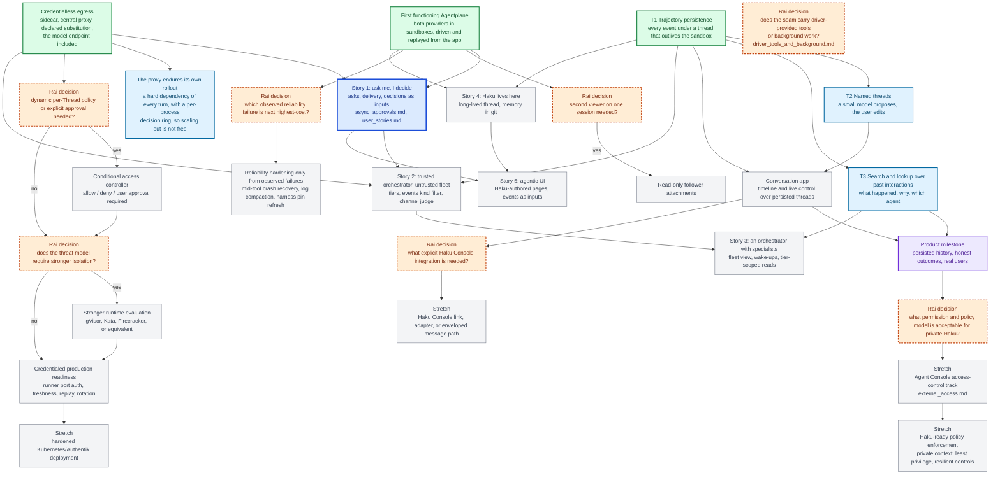

# Agentplane task DAG

This is the single project overview for Agentplane work. It is a dependency map, not a workflow
engine or a request to build every future subsystem. Boxes are sized as coherent agent work packages
that ship as their own PRs; the detailed tasks live in the supporting documents. An edge is a real
dependency, meaning the downstream package cannot be specified or tested without the upstream one.
Packages without an edge between them are meant to be worked in parallel, and a conflict between
two of them is resolved by whoever lands second rebasing.

A package leaves this page when it lands. What it guarantees afterwards lives where the code does:
[`../runner/SPEC.md`](../runner/SPEC.md), [`../egress/SPEC.md`](../egress/SPEC.md),
[`../app/README.md`](../app/README.md), [`../acceptance/README.md`](../acceptance/README.md), and
the design notes under [`../docs/`](../docs/).

## Outcome

The first functioning product is reached: Rai opens the integration app, creates a sandbox running
one Claude or Codex runner, sends an Input, watches response and tool activity arrive, detaches and
comes back to what happened since, suspends and resumes with the conversation intact, and reads the
raw native frames behind any event — and the agent working on Agentplane does all of that without
Rai, against staging on the cheap-experiments key. A sandbox holds no credential of its own: its
tools and its model traffic both leave through the sidecar, and the central proxy substitutes the
real value.

What is left is that trajectories should be as findable as they are durable — what an agent did, and
why, under a name someone can search for — and the five experiences in
[`user_stories.md`](user_stories.md): asks Rai decides, a trusted orchestrator delegating public-only
work to an untrusted fleet under a judge, an orchestrator running specialists, Haku itself as a
long-lived agent here, and a UI Haku authors and is driven through.

## Current status

**Next: story 1, the ask** ([`user_stories.md`](user_stories.md) § 1). Credentialless egress was its
gate and is through: a refused call is already a `403` with a machine-readable reason, which is
where an ask comes from; the delivery and batching design is written
([`async_approvals.md`](async_approvals.md)); the decision arriving as a thread input is decided; and
a standing grant has an object to be — an `EgressBinding` the app already creates and revokes while a
sandbox runs. What is missing is the ask itself as something the app stores and shows.

`T2` and `T3` are blocked on nothing in code. They want a first reader of the persisted history who
needs a name or a search, which is the thing to find rather than an upstream package to build.

**Every turn now depends on the proxy.** Model traffic takes the sidecar like everything else, so a
proxy that is rolling is a proxy that ends the turns in flight — and it is single-replica by design,
since its decision ring is per-process (`PR`).

**Access-control scope is intentionally deferred:** the current Ducktape work can use its existing
broad internet boundary and scoped GitHub credential for `agentydragon-agent`; that convenience is
not a policy model for the private, high-context Haku agent.

## DAG

Three landed nodes stay on the map because the remaining work hangs off them; everything else that
landed is gone from this page.

Legend: green is landed and kept only to carry an edge; the bold blue node is ready to start now;
light blue is work nothing in code blocks; purple is a milestone; orange diamonds are unresolved
decisions requiring Rai's product or design input; gray is conditional or stretch work.

`DT` hangs off nothing on purpose: it is not blocked on a package but on a first consumer above the
seam that wants either surface.

The orange nodes are deliberately limited to choices that change downstream implementation ordering.
A "no" choice should close or defer that branch rather than create speculative scaffolding.
Decided already, and not re-litigated here: the conversation app stays a separate deployment;
trajectories live in PostgreSQL (a CNPG cluster beside the runner Pods; staging's is disposable);
approval decisions and other notifications reach a thread as inputs
([`async_approvals.md`](async_approvals.md)); and profiles — the preset a sandbox runs under — are
deferred pending a design that is not settled by egress, their first consumer
([`profiles.md`](profiles.md)).

The `P`/`K` path is only the narrow access decision needed for a credentialed Agentplane egress
deployment. It is not the general Agent Console permission model represented by `AA`/`AB`, and it
must not be reused as a private-Haku policy language by default. The existing broad Ducktape lane is
a scoped operational convenience, not evidence that the same grants are safe for an agent with Rai's
personal context.

## Work-package acceptance

- **Story 1 (`Y`) the ask.** A sandboxed agent's request — this token for this call, this verb on
  this namespace, this command on this host — is an object the app stores and shows with its
  rationale, it reaches Rai as a notification that can answer it, and the answer arrives in the
  thread as an input. The four missing pieces and what already stands under each are in
  [`user_stories.md`](user_stories.md) § 1; the envelope, the batcher, and the no-expiry rule are in
  [`async_approvals.md`](async_approvals.md).
- **`T2` named threads:** a small model proposes a name from the first turn, the user can edit it,
  and the name lives on the thread record; naming never touches the runner or the harness.
- **`T3` search and lookup:** find past interactions by text and by what an agent did; answer "what
  happened here", "why did the agent do that", and "which agent did this" from the persisted
  trajectory, with the raw frames one step away.
- **`PR` the proxy endures its own rollout.** Tracked outside this plan; the node stays because the
  dependency is real — every turn now runs through the proxy, so its availability is the app's.
- **`DT` driver-provided tools and background work.** Both harnesses offer both surfaces and the
  provider evidence is settled ([`../docs/driver_tools.md`](../docs/driver_tools.md),
  [`../docs/background_work.md`](../docs/background_work.md)); what is open is whether the runner
  protocol carries either, and in what shape. It waits on a first consumer above the seam, which
  story 1 may well be. The decisions and their sub-questions:
  [`driver_tools_and_background.md`](driver_tools_and_background.md).
- **Conversation app (`E`):** timeline and live control over persisted threads, as a client of the
  same API; how archived threads are presented stays in this layer. The archived flag still lives
  on the Sandbox; it moves to the thread record here, after which an archived sandbox may be
  deleted without losing anything.
- **Credentialed production readiness (`L`):** durable freshness and replay defence, per-Sandbox and
  per-Thread binding, rotation, runner-port authentication, and escape tests. Staging spends a
  scoped PAT and a capped model key through the proxy today; neither is evidence that the path is
  ready for a credential that matters.
- **Reliability (`M`):** choose one observed failure with the highest user cost. Candidates already
  known: recovery of a turn lost mid-tool beyond `PROCESS_LOST`, session log growth, and the harness
  pin refresh workflow. Each hardening slice needs its own reproduction and acceptance test; do not
  implement every candidate in advance.
- **Stretch branches:** collaboration, external events, Haku Console integration, stronger runtimes,
  hardened deployment, and the private-Haku access-control track each begin only after the
  corresponding decision node and dependencies are resolved. The private-Haku track must cover tool
  execution, HTTP/API calls, credential handling, approvals, and policy behavior without assuming that
  routine per-action approval clicks are a reliable safety mechanism.

## Ownership and sequencing rules

- Kubernetes/Agent Sandbox owns Sandbox, Pod, PVC, readiness, suspension, and workload lifecycle.
- Native harnesses own native history, execution semantics, and provider-native resume.
- The runner owns harness supervision, the session log, and the protocol; Agentplane's app owns
  the sandbox inventory it derives from Kubernetes, the browser API, and later the live
  `Pod -> Sandbox -> Thread -> Agent` mapping once that mapping is required.
- The conversation app owns product UX such as generated Thread names, naming persistence, archive
  presentation, and timeline behavior. It may remain separate or later be hosted by Haku Console, but
  must not create shared runtime, route, frontend, or persistence coupling.
- Do not add a persistence schema, UI projection, Kubernetes controller, credential path, or
  approval framework ahead of the first test or feature that cannot pass without it.
- Real upstream credentials stay behind the credentialed-readiness gate (`L`).
- One runner per sandbox and one runner attachment per session are acceptable for the first
  functioning product; the app fans that attachment out to every browser tab on the session.
  Multi-Agent rooms, subscriptions, external events, advanced retention, and provider migration
  are not hidden prerequisites.

## Detailed plans

- The integration app's shape and decisions: [app README](../app/README.md).
- What the egress proxy guarantees: [egress SPEC](../egress/SPEC.md); how policies, bindings and
  sandboxes compose into one decision: [`../docs/egress_composition.md`](../docs/egress_composition.md);
  the design they implement: [egress ADR](adr_sandbox_proxy_gateway.md).
- Native provider scenarios and the scripted-test workflow: [`experiments.md`](experiments.md), the
  [native driver README](../native/README.md), the [harness tests README](../harness_tests/README.md),
  and the [live capture probe README](../capture/README.md).
- The runner protocol and its tests: [runner README](../runner/README.md) and
  [runner SPEC](../runner/SPEC.md).
- Sandbox identity and egress evidence: [observed identity evidence](../docs/sandbox_egress_identity_evidence.md).
- Driver-provided tools and background work, and the decisions the seam is waiting on:
  [`driver_tools_and_background.md`](driver_tools_and_background.md).
- Profiles, and what would revive them: [`profiles.md`](profiles.md).
- Product/API layering and deferred capabilities: [`product_surface.md`](product_surface.md) and
  [`architecture.md`](architecture.md).
- Asynchronous approvals, decision delivery, and the notification batcher:
  [`async_approvals.md`](async_approvals.md).
- Delegated identity versus brokered credentials per external system, and the rule for choosing:
  [`external_access.md`](external_access.md).
