# Agentplane task DAG

This is the authoritative map of remaining Agentplane work. Edges are technical dependencies;
operator priority is separate. Completed implementation belongs in the component contracts, not
this backlog. See the [Action Service specification](../action_service/SPEC.md),
[service integration details](../action_service/README.md),
[workload authentication](../docs/workload_authentication.md),
[operator federation](../docs/operator_federation.md),
[launch presets](../docs/launch_presets.md), [action policies](../docs/action_policies.md), and the
[staging evidence](../docs/staging_evidence.md).

## Operator priority

All Agentplane components and their acceptance contracts are multi-replica by default. Durable
state belongs to the owning PostgreSQL or Kubernetes authority; cross-replica change fanout uses
the authority's notification/watch mechanism (PostgreSQL `NOTIFY` for Action Service state), with
reconnect/replay from durable state rather than process-local memory. A single-replica deployment
is an explicit temporary operational constraint, never an implicit correctness assumption.

Deployed Claude.ai access to the Action Service MCP facade, the first priority, is met
([staging evidence](../docs/staging_evidence.md)); no next priority is set here. Transcript
search/lookup (`T3`) is deliberately deferred until a later product-planning point; it is not in
the current execution sequence. Search is technically independent, so this deferral is a priority
decision rather than a claim that its implementation depends on MCP. Local Claude Code acceptance
(`EXTERNALMCP`) and full Haku migration are not prioritized.

## DAG

```mermaid
flowchart TB
    classDef active fill:#dbeafe,stroke:#1d4ed8,color:#1e3a8a,stroke-width:3px
    classDef decision fill:#ffedd5,stroke:#c2410c,color:#7c2d12,stroke-width:2px,stroke-dasharray:5 3
    classDef future fill:#f3f4f6,stroke:#6b7280,color:#374151
    classDef milestone fill:#ede9fe,stroke:#6d28d9,color:#4c1d95,stroke-width:2px

    MCPAUTH["Remaining acceptance<br/>credentialed MCP account<br/>refresh, rotation, Kubernetes provider"]:::active
    CRED["Deferred decision<br/>static credential + binding design<br/>ownership, lifecycle, revocation"]:::future
    ELEVATE["Planned behavior<br/>agent-requested temporary permission<br/>ServiceAccount and Sandbox callers, operator-approved"]:::future
    FORK["Deferred design<br/>per-task identity fork<br/>sub-identity scoped by token possession"]:::future
    EXTERNALMCP["Planned milestone<br/>external Claude Code<br/>identity-bound Action execution"]:::future
    MCPAGG["Deferred migration<br/>replace Haku Console MCP aggregator<br/>real Claude.ai/Claude Code proof"]:::future
    CUTOVER["Planned milestone<br/>Haku Console affordance cutover<br/>Kubernetes + SSH + GitHub"]:::active
    K8SAUTH["Planned support<br/>browser-mediated Kubernetes auth<br/>linkage, refresh, revocation"]:::future
    SSHDURABLE["Deferred support<br/>systemd-backed durable processes<br/>host daemon + signals/output"]:::future
    RETIRE_AGENT["Deferred migration<br/>retire Haku Console Agent/<br/>conversation management"]:::future
    RETIRE_TOOLS["Deferred migration<br/>retire Haku Console tool-call/<br/>approval management"]:::future
    INPUT_DELIVERY["P0 behavior, independent<br/>input delivery/replay semantics<br/>provider research and captures first"]:::active
    T3["Deferred product work<br/>trajectory search and lookup<br/>later prioritization"]:::future
    PC_EGRESS["Milestone<br/>public-coder-agent egress migration<br/>prod Agentplane proxy"]:::milestone
    PROFILES["Deferred decision<br/>capability profiles<br/>Rai design confirmation required"]:::future
    ACCESS["Deferred design<br/>delegated vs brokered external access<br/>grants and revocation"]:::future
    EGRESS_CHANGE["Deferred design<br/>agent-requested egress<br/>policy expansion"]:::future
    LIVE_CLEAN["Deferred cleanup<br/>executor heartbeat identity/<br/>row retention"]:::future

    BB["Deferred decision<br/>BuildBuddy hosted-run credential boundary"]:::future
    ING["Deferred support<br/>Event & Notification Hub<br/>external events -> Agent/Thread ingress"]:::future
    DT["Deferred<br/>driver-provided declarations/background control"]:::future
    AG["Deferred<br/>hosted Thread lifecycle<br/>cross-Identity read policy"]:::future
    IDENTITY_SCOPE["Deferred discussion<br/>cross-service static Identity access<br/>MCP and binding-authority placement"]:::future
    PROD["Milestone<br/>production-capable governed action execution"]:::milestone
    ACTION_PROVENANCE_PRUNE["Deferred idea<br/>prune ActionRequestInput origin/correlation<br/>collapse to one client-authored identifier?"]:::future
    CONNECTION_SA_REBIND["Planned mutation<br/>rebind a Connection's ServiceAccount in place<br/>no mutation exists; only a fresh OAuth consent does"]:::future
    SANDBOX_SA["Deferred design<br/>one ServiceAccount per Sandbox<br/>a native Kubernetes identity to separate and grant on"]:::future
    DENY_LISTS["Deferred behavior<br/>autoDenyIf / autoDenyUnless<br/>when an Action needs them"]:::future
    CONSOLE_POLICIES["Deferred migration<br/>console auto-approval policies not yet sets<br/>each needs an ActionGroup, a kind, or DENY_LISTS"]:::future

    CRED --> MCPAUTH
    MCPAUTH --> PROD
    ELEVATE --> FORK
    EXTERNALMCP --> MCPAGG
    K8SAUTH --> CUTOVER
    MCPAUTH --> CUTOVER
    MCPAGG -. replacement surface .-> RETIRE_TOOLS
    CONSOLE_POLICIES -. policy parity .-> RETIRE_TOOLS
    AG -. hosted Thread lifecycle .-> RETIRE_AGENT

    INPUT_DELIVERY -. reliable Thread ingress .-> ING
    T3 -. product work .-> PROD

    ACCESS -. authority choice .-> EGRESS_CHANGE
```

Completed work is off this board: the credentialless MCP vertical, whose deployed Claude/Codex
proof is the [acceptance suite](../acceptance/README.md), and the first external client, operator
approval, and Web Push proofs, recorded in the [staging evidence](../docs/staging_evidence.md).
Credentialed upstream access is `MCPAUTH`. Input delivery and proxy survivability proceed
independently of the external-client track.

The external-client track is single-operator and independent of the credentialless MCP vertical
and the broader `AG` model. Its product terms are Identity (configured authority), Connection
(runtime named client enrollment), and Thread (execution/conversation state); it adds no
multi-operator management or per-operator ownership model. What remains of it is `EXTERNALMCP`, an
independently running Claude Code; the [external connection plan](external_mcp_connections.md)
owns that delivery and compatibility work. A caller ServiceAccount does not select backend
credentials or wait for `CRED`/`PROFILES`; outbound account OAuth remains `MCPAUTH`. Client proof
does not establish Haku tool parity (`CONSOLE_POLICIES`, `RETIRE_TOOLS`).
The deny lists of the landed [action policies](../docs/action_policies.md) are `DENY_LISTS`.
Processes that must outlive an SSH connection to the `ssh-mcp` server
(<../../ssh_mcp_server/README.md>) are `SSHDURABLE`.
Haku Console migration is split: Agent/conversation management and tool-call/approval management
can retire on different schedules after their respective replacement surfaces exist.

### `BB` — BuildBuddy hosted-run credential boundary

**Deferred decision:** accept the weaker hosted-runner boundary — a narrow `runner.RunRequest`
rewrite that keeps the real key out of the local Sandbox but hands it to agent-controlled code on
BuildBuddy's runner — or wait for a stronger seam (a per-run BuildBuddy credential or a run-scoped
gateway). The boundary, wire shape and required evidence are in
[`buildbuddy_remote_auth.md`](../docs/buildbuddy_remote_auth.md).

### `EGRESS_CHANGE` — agent-requested egress policy expansion

**Deferred design:** define how an agent can request an expansion or change to its egress rules.
The request may become a policy-gated Action with operator approval, or use another reviewed
configuration path. Keep the authority, approval, persistence, and rollback model open until a
concrete caller and policy owner are chosen. This does not grant agents a direct policy mutation
path and does not block current credential-placeholder egress.

### `ACTION_PROVENANCE_PRUNE` — prune `ActionRequestInput.origin`/`correlation`

**Deferred idea:** `origin` and `correlation` on `ActionRequestInput` are two open-ended
`dict[str, JsonValue]` bags with no consumer: nothing in the Action Service parses or acts on
their contents; they are stored, returned in `ActionRequestView` (redacted for non-operators),
and otherwise inert. Consider collapsing both down to one client-authored identifier field, or
confirm no simplification is warranted.

This is a breaking schema change to already-shipped, in-production surface — a real Pydantic
model, real DB columns, real tests, and documented invariants (`action_service/SPEC.md`,
`action_service/README.md`) — not something to fold into a separate, unrelated addition of new
caller-facing fields to the same model. No dependency on anything else; nothing waits on this.

### `CONNECTION_SA_REBIND` — rebind a Connection's ServiceAccount in place

**Planned mutation:** no mutation exists today, frontend or backend, to change which ServiceAccount
an existing Connection acts as. `connections.py`'s `ConnectionAuthority` and the exposed
`ConnectionService` (`list`/`callerServiceAccounts`/`rename`/`unbind` in `client.ts`) cover listing,
renaming, and unbinding, but the only way to change a Connection's bound ServiceAccount is a fresh
OAuth consent authorization (`consent.tsx`) that creates a new grant — a new revision, prior grants
revoked, not an in-place edit. The frontend's OAuth-clients settings table currently shows the
ServiceAccount as read-only text for exactly this reason.

**Design questions, not yet settled:** should rebinding revoke the prior grant's revision the same
way a fresh consent does, or coexist with it; does it need its own audit trail distinct from a
reconnect; and does it require re-running eligibility checks (the ServiceAccount must still carry
`agentplane.allegedly.works/action-caller: "true"`) at rebind time, not just at original consent.
No dependency on anything else; nothing waits on this. Once it exists, the settings table's
ServiceAccount column becomes a real dropdown instead of static text.

### `SANDBOX_SA` — one ServiceAccount per Sandbox

**Deferred design:** every Sandbox Pod runs as the shared `agentplane-runner` ServiceAccount
(`sandboxtemplate-agentplane-runner.yaml`), so a Sandbox has no Kubernetes identity of its own: the
Action Service tells Sandboxes apart by namespace and UID from workload authentication, and an
`ActionPolicyBinding` names one with the `sandbox {name, uid}` subject rather than a ServiceAccount.
Running each Sandbox under its own ServiceAccount would give it a native identity to separate
permissions on, and letting an agent act in Kubernetes directly would become a Kubernetes-native
RoleBinding on its Sandbox's ServiceAccount rather than a governed Action or a policy exception.

**Questions, not yet settled:** who creates and garbage-collects the per-Sandbox ServiceAccount (the
integration app at launch, with an `ownerReference` like the bindings it writes, or the Sandbox
controller); whether the ServiceAccount then becomes the one policy subject for both caller classes,
collapsing the `sandbox` and `serviceAccount` subject forms and the two operator policy-read routes
into one; and how the workload token's pinning of the live Sandbox (name and UID from TokenReview
and the Pod) carries over. No dependency on anything else; nothing waits on this.

### `DENY_LISTS` — `autoDenyIf` and `autoDenyUnless`

**Deferred behavior:** an `ActionPolicySet` carries three lists and only `autoApproveIf` decides
today; the CRD accepts `autoDenyIf` and `autoDenyUnless` and evaluation ignores them. Their
semantics are settled in the [action policies design](../docs/action_policies.md): a request matching any
`autoDenyIf` policy is auto-denied, one matching none of the `autoDenyUnless` policies is
auto-denied, deny wins over approve, and a request matching nothing takes the human path.
`autoDenyIf` first, when an Action needs it; `autoDenyUnless` later. Nothing waits on this; the
console policies that need it (schema misses recorded as denied Decisions, the disabled kubectl
passthrough redundancy check) are under `CONSOLE_POLICIES`.

### `CONSOLE_POLICIES` — console auto-approval policies without a set

**Deferred migration:** the Haku console's `auto_approval_policies`
(`cluster/k8s/haku/console/config.yaml`) is the reviewed authority the Action policy model
replaces; its GitHub policies exist as sets in `cluster/k8s/agentplane-staging/actions/`. What
remains, each with what it needs; an entry leaves when its set can be written.

- **`exact_tools` for servers with no ActionGroup**: `gmail_reads`, `google_calendar_reads`,
  `grocy_reads` (`grocy-sf`), `tana_safe_tools` (`tana-rw`), `postscanmail_reads`
  (`postscanmail-mcp`), `home_assistant_reads` (`home-assistant`), and the console's own
  in-process `sandbox` (`haku_sandbox_control`) and `grants` servers (`kubernetes_reads`,
  `grants_whoami`, `grants_own_revoke`). Each is a plain `exact_actions` set once the backend is an
  ActionGroup in the Action Service settings, with its executor credential (operator OAuth
  linkage for Google, a static bearer or in-cluster route for the rest) and network-policy egress.
  `sandbox` and `grants` are console-internal servers with no Action Service counterpart at all;
  they need an equivalent surface before a set can name them.
- **`home_assistant_entity_control`** (`home_assistant_desk_light_control`): every Home Assistant
  write is one generic `ha_call_service`, so the console's evaluator allow-lists the argument keys
  it has reviewed and admits one entity with its listed services. Argument-only, so once a
  `home-assistant` ActionGroup exists this is either an `argument_schema` set (`const` entity,
  `enum` services, `additionalProperties: false` over the reviewed keys) or a kind if the
  configured entity map stays the operator's vocabulary.
- **`gmail_label_namespace`** (`managed_gmail_labels`): `labels_patch`/`labels_delete` name a
  label by id, so the evaluator resolves the id to a name through the Gmail API before checking
  the prefix. A kind with an injected Gmail client, arriving with the `gmail` ActionGroup and its
  operator-linked credential.
- **`grant_self_list` and grants self-introspection** (`grants_own_list`,
  `grants_self_introspection`): `list_grants(principal=self)` is argument-only, an
  `argument_schema` set over a `grants` ActionGroup; but the grant model itself is console-owned,
  so this waits on the Action Service having its own grant surface, not on a kind.
- **Schema auto-denial** (`autoDenyIf` equivalent): the console records a call whose arguments
  fail the registered tool schema as born-denied. The Action Service refuses such a request at
  admission before persisting anything, so the audit row the console keeps does not exist here;
  matching it needs `DENY_LISTS` and a recorded, denied Decision for the schema miss.
- **Kubectl passthrough redundancy check** (`kubectl_passthrough_redundancy_check`, commented out
  in the console): auto-deny a `kubectl-passthrough-mcp` call the caller's own Kubernetes identity
  already covers by SubjectAccessReview, pointing at the direct path. A kind with an injected
  authorization service and a caller-to-Kubernetes-identity mapping, on `autoDenyIf`. The console
  keeps it disabled because direct access is not yet an equivalent substitute (its kubeconfig
  cannot execute the POST/SPDY transport the passthrough carries); the same condition gates it
  here.

Nothing waits on this except `RETIRE_TOOLS`, which needs policy parity for the affordances it
retires.

## Named gates and acceptance evidence

### `CUTOVER` — Haku Console affordance cutover

**Planned milestone:** move the highest-value Haku Console affordances behind Agentplane's generic
MCP frontend, then retire the old tool-call/approval surface only after equivalent authority,
provenance, result recovery, and rollback evidence exists. The initial cutoff set is:

- **Kubernetes MCP:** expose the existing Kubernetes affordances through the frontend, but first
  implement browser-mediated cluster/auth linkage. The linkage needs an explicit cluster identity,
  consent or re-authentication, expiry/refresh, revocation, and wrong-cluster/wrong-user isolation.
  Do not copy a kubeconfig or reusable bearer into the MCP client, Sandbox, or transcript; Kubernetes
  RBAC remains authoritative and the browser flow returns only the reviewed linkage needed to call it.
- **SSH:** the `ssh-mcp` server is wired behind the MCP Executor; repoint the Haku Console
  affordance at the Agentplane-owned route through a reversible rollout rather than changing the
  frontend and every credential deployment at once.
- **GitHub:** use the credentialed-upstream account track (`MCPAUTH`) behind the generic MCP frontend.
  Prove account linkage, safe read execution, refresh/reconnect, revocation, and account isolation;
  PAT or OAuth refresh credentials stay with the broker/account authority, never in the MCP client,
  Sandbox, or Action prompt.

**Needed support:** inventory every remaining Haku Console affordance and classify it as cutover-P0,
required support, or deferred. At minimum record whether Gmail, Calendar, Home Assistant, Tana,
messaging, browser, image, and similar tools need Agentplane routes, Actions, or can remain on the old
surface temporarily. Preserve stable tool semantics where compatibility matters, but do not build
parity for unused affordances.

**Acceptance:** from a real external client, exercise one harmless Kubernetes read after browser
linkage, one SSH Action through the configured executor path, and one GitHub read through a linked
account. For each, inspect canonical caller identity, authorization, Action/Execution provenance,
redacted results, retry/reconnect behavior, and revocation. Run the old and new routes in parallel
behind a rollback switch before retiring Haku Console's corresponding tool surface.

### `MCPAUTH` — credentialed MCP account and OAuth boundary

Operator-linked OAuth upstreams are implemented ([service README](../action_service/README.md)),
and staging's GitHub upstream has been linked, discovered, and executed against
([staging evidence](../docs/staging_evidence.md)).

**Remaining acceptance:** on the staging GitHub provider, refresh without MCP calls, observe
refresh failure and degraded/reconnect behavior, and prove token rotation is used without
rebuilding the executor; then add Kubernetes provider acceptance; preserve negative isolation for
an unbound or different account. The broader static credential and binding model remains the
separate `CRED` design gate. This milestone is not folded into the credentialless fixture test.

### `ELEVATE` — agent-requested temporary permission

**Planned behavior:** a caller that knows it will need an Action outside its current policy asks
for it through an Action of its own: the request names the set to add (or the binding to remove),
the subject (its own ServiceAccount or Sandbox; never another caller), and an `expiresAt`. The
operator sees it rendered as that specific request, with the set's lists shown, not as a generic
approval card. Approval writes the `ActionPolicyBinding` with the requested expiry through the same
authority the app uses; denial writes nothing. Both caller classes get this: a ServiceAccount-bound
OAuth client and a harness in a Sandbox.

**Design gate / acceptance:** the requesting Action is an ordinary Action with an ordinary Decision,
so the request itself can be auto-approved by policy later, never by default. A granted binding is
evaluated like any other, once per subsequent Action at admission. Prove: a Sandbox requests a set,
the operator approves, the next matching Action auto-approves and the Decision names the new
binding; the same request from a different subject grants nothing to the requester; expiry ends it.

### `FORK` — per-task identity fork

**Deferred design:** a wide ServiceAccount-bound identity such as "Claude Code web via OIDC" may
serve several concurrent agent threads managed outside Agentplane. An agent forks its identity into
a per-task sub-identity, requests permission for that sub-identity through `ELEVATE`, and uses the
sub-identity's credential for the task. Scope then follows possession of that credential: a thread
that never receives it never gains the permission. Open questions: how a sub-identity is
represented (a derived ServiceAccount, or a child Connection under the parent's OAuth grant),
whether the parent's permissions flow down, and how the sub-identity ends. Low priority; nothing
else depends on it.

### `T3` — trajectory search and lookup

**Deferred product work:** search and look up stored trajectories at a later product-planning point.
This is technically independent of the MCP facade, but it is intentionally not in the current work
sequence. Existing transcript persistence and unrelated lifecycle reliability work are not
reclassified as search implementation by this deferral.

### `EXTERNALMCP` — hosted clients and external harnesses using governed Actions

**Remaining client acceptance:** Claude Code running on an operator machine (for example wyrm2),
not an Agentplane-hosted harness, uses a configured static Identity to discover and submit one
credentialless Action for human approval, receives a durable pending receipt, and reads the result
after review; its native callback, registration, refresh, and fresh authorization need their own
evidence. Independently verify Action ownership, binding, Decisions, Execution, replay, isolation,
and revocation as specified in the [external connection plan](external_mcp_connections.md); the
Deny path, grant retention across refresh and restart, negative isolation, and unbind/revocation
have no recorded evidence for any external client yet. This milestone precedes Haku migration and
does not require backend account OAuth or the full Agent/conversation model. External harnesses
need no Agentplane Sandbox/Thread or upstream credentials; only Actions routed through this service
are governed by it.

### `CRED` — static credential and binding design

This gate concerns static credentials and backend bindings. Configured static Identities already
authenticate through inbound OAuth and do not depend on selecting a static backend credential.

**Deferred decision — Rai confirmation required:** define what a static credential is bound to
(Identity, external account, MCP server, or another authority), which component owns issuance and
storage, how expiry/refresh/revocation works, how a binding is selected at execution time, and what
the Agent/API may observe. This node is a design discussion, not an implementation task; do not
start code or schema work from it until Rai confirms the design.

### `PROFILES` — cross-cutting capability profiles

**Deferred decision — Rai confirmation required:** define a durable authority for capabilities shared by egress, approvals, MCP
reachability, and other tool permissions. Do not widen the landed launch-preset slice merely to
reserve the concept; Kubernetes remains a storage candidate, and the profile owner, inheritance, and policy
read/verification boundary remain open. Do not start implementation before the design is confirmed.

**Acceptance evidence:** one profile can be resolved consistently by each participating authority,
with explicit precedence and negative tests for stale, cross-Agent, or caller-supplied profile names.

### `ACCESS` — delegated versus brokered external access

**Deferred design:** choose per-system whether an Action uses the Agent's delegated identity, a
brokered operator credential, or a hybrid. Keep target-side RBAC and egress enforcement authoritative;
use grants/revocation reconciliation where a broker mints delegated authority. This is the broader
external-access policy behind `MCPAUTH` and the SSH MCP server, not a prerequisite for the completed credentialless MCP vertical.

**Acceptance evidence:** a selected system proves the credential boundary, approval behavior, and
revocation/expiry semantics without putting a reusable privileged credential in the harness.

### `PC_EGRESS` — public-coder-agent egress migration

**Milestone:** replace the existing `haku-console` / `iron-proxy` proxy path in front of
`public-coder-agent` with the Agentplane egress proxy, using a dedicated production (non-staging)
Agentplane instance. Preserve the current public-coder configuration as the starting contract: its
wide-open egress and the small set of substituted tokens are intentional inputs to the migration,
not an invitation to redesign policy in this milestone.

**Needed support:** deploy and operate the production Agentplane egress instance, express the
public-coder destination rules and token substitutions in its reviewed configuration, and provide
the required ServiceAccount, network policy, routing, and secret wiring. Compare effective behavior
against the existing path before cutover; do not infer equivalence from source configuration alone.

**Acceptance evidence:** public-coder can reach every currently supported destination, each existing
substituted token is presented only at its intended destination, denied/unmatched traffic behaves as
specified, and the Agentplane proxy survives rollout/restart without silently dropping the agent's
in-flight work. Run the real devbox/agent acceptance through the new path, retain redacted effective
rules and token-boundary evidence, then cut over with a reversible rollback window. Retire the old
`haku-console` / `iron-proxy` resources only after the production path is proven and rollback is
available; this milestone is an egress migration, not permission to widen the stable configuration.

### `MCPAGG` — Haku Console MCP aggregator replacement

**Deferred migration:** use the implemented generic Action MCP frontend as the replacement surface for Haku
Console's aggregator. Verify the required external harness/client workflows against it before
retiring the old surface; do not build a second frontend, approval coordinator, or authority store.
The real-client proof must exercise Claude.ai and independently running Claude Code with OAuth and
configured Identities, including DCR, consent, discovery, human approval, result recovery, refresh,
and revocation. `EXTERNALMCP` is the client-compatibility evidence for this migration, not just a
protocol fixture.
Inventory and migrate the remaining Haku tools, policies, and client workflows separately; backend
credential requirements remain adapter-specific. The initial facade uses generic Action tools;
per-Action projection may never be needed and is not required for migration. Actual generic-client
evidence determines whether to explore it. The migration order remains open.
Tool-call/approval management retirement remains the separate `RETIRE_TOOLS` milestone.

### `SSHDURABLE` — durable SSH-backed processes

**Deferred support:** the `ssh-mcp` server behind the MCP Executor runs one-shot commands; for
processes that must survive an SSH disconnect, add a small `agentplane-execd` host component for
`rugged` and `wyrm2`. SSH still authenticates as the configured target user; an
unprivileged stdio client forwards structured requests over a local Unix socket to a root-owned
daemon. The daemon derives the execution user from kernel Unix-socket peer credentials and does not
accept a requested-user field. It delegates process lifetime, cgroups, signals, and unit status to
the host systemd system manager, so user lingering is not required.

The daemon's durable handle is a systemd transient unit derived from the Agentplane Execution ID.
Future code-owned Actions may start, inspect, read bounded output from, signal, and terminate that
unit. Agentplane remains authoritative for Action schemas, approval, caller control rights, durable
Execution state, leases, and unknown-outcome reconciliation; the daemon is only a constrained
systemd adapter. See [the durable SSH process plan](ssh_durable_processes.md) for the protocol and
acceptance boundaries. Do not add this daemon, PTYs, or stdin streaming to the first one-shot implementation.

### `LIVE_CLEAN` — executor heartbeat retention cleanup

**Deferred cleanup:** executor liveness currently creates one heartbeat identity row per coordinator
process lifetime. Once deployment scale makes that accumulation meaningful, choose a stable executor
identity or bounded expiry/compaction policy and add retention tests; do not change the exactly-one
claim or unknown-outcome semantics while doing so.

### `RETIRE_AGENT` — Haku Console Agent/conversation management migration

**Deferred migration:** retire Haku Console's own Agent and conversation management only after
Agentplane has the external Identity, durable Thread lifecycle, conversation read/control, and
replacement runtime surfaces required by Haku. This is a migration and decommissioning milestone,
not a prerequisite for Action execution; preserve explicit read/export and rollback evidence before
removing the old owner.

### `RETIRE_TOOLS` — Haku Console tool-call and approval management migration

**Deferred migration:** retire Haku Console's connected-MCP catalog, tool-call application/approval
queue, and related tool-call management only after the `MCPAGG` compatibility migration,
integration-app approval UI, credential bindings, and canonical Action/Decision APIs cover the
required workflows.
This track may move independently of Agent/conversation management: Haku Console may continue to own
conversations while Agentplane owns external tool calls, or the reverse during a staged migration.
Preserve tool-call audit/export and rollback evidence before removing the old owner.

### `INPUT_DELIVERY` — native queue evidence before common-protocol changes

**P0 behavior:** an input crossing the app/runner boundary has an honest, correlated delivery
outcome after disconnect/reconnect, without silently losing it or blindly submitting it twice.
This work is independent of live Action/MCP staging acceptance and is not Action cancellation.

**Needed support — mandatory first step:** re-read the landed
[Claude queue research](../docs/claude_input_queue.md),
[Claude/Codex protocol notes](../docs/provider_protocols.md),
[native harness evidence](../docs/harness_evidence.md),
[Claude runtime contracts](../docs/claude_runtime_contracts.md), and
[current common protocol](../docs/common_protocol.md), then inspect the pinned drivers/tests.
Reconsider the common protocol's input semantics from this evidence rather than assuming the
bridge is the only queue or that one input equals one turn.

- Claude: UUID command handles, lifecycle receipts, capability negotiation, targeted withdrawal,
  interrupt receipts/queued survivors, and coalescing that can make cancellation batch-granular.
  Do not interpret an ambiguous `cancelled:false` as a guaranteed no-op or fabricate receipts.
- Codex: distinguish joined input in the active turn's in-memory pending list from the separate
  experimental durable `thread/queue/*` API. Examine queue promotion, dispatch/delete locking,
  interruption, and correlated user-message evidence; an RPC acknowledgement is not consumption
  or completion, and a queue-changed notification alone does not prove promotion.

**Observed evidence boundary:** some queue behavior comes from declarations/static analysis, not
capture-pinned tests. Refresh live probes/captures against both pinned binaries for the behavior
being adopted before changing the common protocol; then encode supported behavior in scripted
native-harness CI tests against the controlled model endpoint. Missing capabilities and blocked
experiments stay explicit, not normalized into success. This research may justify common-protocol
changes, but it does not preselect a queue facade, selective cancellation, or a new persistence layer.

**Acceptance evidence:** exercise disconnect before delivery, delivery before observed receipt,
reconnect/replay with the same `input_id`, and restart. Prove duplicate-ID handling at each actual
boundary rather than assuming native idempotency. Include Claude coalescing/interrupt/withdrawal
and Codex join-versus-durable-queue cases, preserving raw native evidence and provider differences.
No acknowledgement, retry, steering, cancellation, or completion may be invented by the runner.
Decide the narrow common contract only after these observations; keep unsupported operations native
or explicitly unavailable. **Deferred:** generic queue management and unproven per-input cancellation.

### `IDENTITY_SCOPE` — cross-service Identity authority and MCP placement

**Deferred discussion:** hosted agents will access multiple Agentplane services through Sandbox-token
authentication; external harnesses should likewise be eligible for explicitly authorized access
beyond Actions without becoming hosted Sandboxes. Conversation search/reading is one example,
not the scope of the feature. Reconsider whether the MCP frontend and Connection-to-Identity binding
authority should move out of the Action Service. Compare shared-facade and direct-service access;
each resource-owning service retains its authorization, independent of caller authentication.
Sharing an Identity's Action scope does not by itself grant access to another service.

Discuss resource-specific permissions, credential audiences, trusted identity propagation, revocation, and preservation
of exact client provenance across services. The [external connection plan](external_mcp_connections.md)
records the boundary. This is not a prerequisite for the current DCR/consent slice, not a decision
to extract now, and not a reason to add speculative service interfaces or preset coupling.

### `ING` — Event & Notification Hub

**Deferred support:** consume Action events and external sources such as GitHub/Calendar, match
user/Agent subscriptions, and deliver structured events into an Agent/Thread ingress. The Hub owns
subscription matching, deduplication, batching/debounce, rate limits, backpressure, offline delivery,
and Thread wake/queue semantics. It is not an executor or an Action decision authority. It consumes
the canonical Action event sequence, preserving individual events and ordering, and adds no second
Action outbox or event store; cross-Identity delivery requires an explicit read policy.

## Deferred

- capability matrices or a broad Agent identity/privilege framework;
- cross-cutting capability profiles — see [`profiles.md`](profiles.md);
- delegated-versus-brokered external-access policy and grant/revocation semantics — see
  [`external_access.md`](external_access.md);
- MCP registry, dynamic action marketplace, standing grants, and cross-agent permissions;
- per-destination workload audiences until recipient isolation is required;
- broad profiles beyond the landed launch-preset slice;
- separating the egress proxy's rule namespace from its Sandbox namespace — both deployments pass
  one namespace for both today, the reason separation mattered is not recorded, and a split has to
  replace the app's binding-to-Sandbox ownerReference cascade with a sweep
  (`x/agentplane/app/egress.py`);
- a runtime editing surface for `ActionPolicySet`s, and for bindings beyond the one the app
  writes at launch — Git and `kubectl` are the editors;
- creating a labeled caller ServiceAccount at OAuth enrollment instead of by a Git edit;
- a TokenReview admission path for an external client holding a ServiceAccount token with a
  dedicated audience, as Sandboxes authenticate, instead of OAuth; and
- cryptographic Decision signing until Decisions cross a boundary that requires it.
