# Agentplane task DAG

This is the authoritative map of remaining Agentplane work. Edges are technical dependencies;
operator priority is separate. Completed implementation belongs in the component contracts, not
this backlog. See the [Action Service specification](../action_service/SPEC.md),
[service integration details](../action_service/README.md),
[workload authentication](../docs/workload_authentication.md),
[operator federation](../docs/operator_federation.md), and
[launch presets](../docs/launch_presets.md).

## Operator priority

Prioritize working deployed Claude.ai access to the Action Service MCP facade (`CLAUDEAI`), then
transcript search/lookup (`T3`). Search is technically independent; this is the desired order of
work, not a claim that its implementation depends on MCP. Additional local Claude Code acceptance
in `EXTERNALMCP` and full Haku migration are not part of that priority condition.

## DAG

```mermaid
flowchart TB
    classDef active fill:#dbeafe,stroke:#1d4ed8,color:#1e3a8a,stroke-width:3px
    classDef decision fill:#ffedd5,stroke:#c2410c,color:#7c2d12,stroke-width:2px,stroke-dasharray:5 3
    classDef future fill:#f3f4f6,stroke:#6b7280,color:#374151
    classDef milestone fill:#ede9fe,stroke:#6d28d9,color:#4c1d95,stroke-width:2px

    MCP0["P0 behavior<br/>credentialless remote MCP Action<br/>real staging LLM acceptance"]:::active
    MCPAUTH["Deferred support<br/>credentialed MCP account<br/>OAuth + credential-broker boundary"]:::future
    CRED["Deferred decision<br/>static credential + binding design<br/>ownership, lifecycle, revocation"]:::future
    MCPACCEPT["Milestone<br/>rerunnable Action/MCP acceptance<br/>against the deployed stack"]:::milestone
    EID["Planned support<br/>configured static external identity<br/>trusted caller + connection binding"]:::future
    POLICYBIND["Design gate<br/>shared ActionPolicySets + bindings<br/>model, storage, ownership"]:::decision
    MCPOAUTH["Planned support<br/>OAuth/DCR + integration-app enrollment<br/>named Connections, rename/unbind/rebind"]:::future
    CALLERPOLICY["Planned support<br/>configured caller Action bounds<br/>and auto-approval deciders"]:::future
    SBPOLICY["Planned behavior<br/>auto-approve configured Actions<br/>through concrete Sandbox bindings"]:::future
    MCPFRONT["Planned support<br/>generic Action MCP tools<br/>discover, request, read, cancel"]:::future
    CLAUDEAI["Priority milestone<br/>working Claude.ai MCP facade<br/>deployed Action execution"]:::active
    EXTERNALMCP["Planned milestone<br/>Claude.ai + external Claude Code<br/>identity-bound Action execution"]:::future
    MCPAGG["Deferred migration<br/>replace Haku Console MCP aggregator<br/>external harness/client compatibility"]:::future
    HOSTEXEC["Deferred adapter<br/>hostexec-backed Action execution"]:::future
    APPROVALUI["Needed live evidence<br/>deployed operator federation + BFF<br/>identity and approval proof"]:::active
    RETIRE_AGENT["Deferred migration<br/>retire Haku Console Agent/<br/>conversation management"]:::future
    RETIRE_TOOLS["Deferred migration<br/>retire Haku Console tool-call/<br/>approval management"]:::future
    INPUT_DELIVERY["P0 behavior, independent<br/>input delivery/replay semantics<br/>provider research and captures first"]:::active
    T3["Lower priority<br/>trajectory search and lookup"]:::future
    PR["P0 behavior, independent<br/>proxy rollout survivability"]:::active
    PROFILES["Deferred decision<br/>capability profiles<br/>Rai design confirmation required"]:::future
    ACCESS["Deferred design<br/>delegated vs brokered external access<br/>grants and revocation"]:::future
    LIVE_CLEAN["Deferred cleanup<br/>executor heartbeat identity/<br/>row retention"]:::future

    BB["Deferred decision<br/>BuildBuddy hosted-run credential boundary"]:::future
    PROVIDERLOG["Ready fix<br/>safe formatted provider-error logs"]:::active
    NOTIFY["Deferred delivery<br/>human approval notifications"]:::future
    ING["Deferred support<br/>Event & Notification Hub<br/>external events -> Agent/Thread ingress"]:::future
    DT["Deferred<br/>driver-provided declarations/background control"]:::future
    AG["Deferred<br/>hosted Thread lifecycle<br/>cross-Identity read policy"]:::future
    IDENTITY_SCOPE["Deferred discussion<br/>cross-service static Identity access<br/>MCP and binding-authority placement"]:::future
    PROD["Milestone<br/>production-capable governed action execution"]:::milestone

    MCP0 --> MCPACCEPT
    MCP0 --> MCPAUTH
    CRED --> MCPAUTH
    MCPAUTH --> PROD
    EID --> MCPOAUTH
    POLICYBIND --> CALLERPOLICY
    CALLERPOLICY --> SBPOLICY
    MCPFRONT --> CLAUDEAI
    MCPOAUTH --> CLAUDEAI
    APPROVALUI --> CLAUDEAI
    CLAUDEAI --> EXTERNALMCP
    EXTERNALMCP --> MCPAGG
    MCPFRONT -. replacement surface .-> MCPAGG
    MCPFRONT -. replacement surface .-> RETIRE_TOOLS
    MCPAGG -. replacement surface .-> RETIRE_TOOLS
    APPROVALUI -. replacement surface .-> RETIRE_TOOLS
    EID -. external identity .-> RETIRE_AGENT
    AG -. hosted Thread lifecycle .-> RETIRE_AGENT

    INPUT_DELIVERY -. reliable Thread ingress .-> ING
    T3 -. product work .-> PROD
    PR -. independent reliability .-> PROD

    MCP0 --> AG
```

The credentialless deployed gate is `MCP0 -> MCPACCEPT`: use the existing staging-owned
streamable-HTTP fixture and real Claude/Codex acceptance turns. Implementation and CI evidence
already exist; deployed proof remains. Credentialed upstream access is separate (`MCPAUTH`).
Input delivery and proxy survivability can proceed independently of the external-client track.

The external-client track is single-operator and independent of `MCP0` and the broader `AG` model.
Its product terms are Identity (configured authority), Connection (runtime named client enrollment), and Thread
(execution/conversation state); it adds no multi-operator management or per-operator ownership model.
Its first Identity is configured and static (`EID`); OAuth/DCR enrollment (`MCPOAUTH`) binds a Connection to
it. The first external slice uses human approval, not configurable per-Identity auto-approval. These join the canonical MCP frontend
(`MCPFRONT`), landed Executor support, and deployed operator review first at `CLAUDEAI`: a real
Claude.ai connection running governed Actions. `EXTERNALMCP` additionally proves independently
running Claude Code. The [external connection plan](external_mcp_connections.md)
owns the workflow and remaining design choices. Static identity does not select static credentials
or wait for `CRED`/`PROFILES`; outbound backend-account OAuth remains the separate `MCPAUTH` track.
`EXTERNALMCP` is the initial client proof for `MCPAGG`, not proof of full Haku tool parity.
`POLICYBIND` separately settles policy definition/assignment storage before `CALLERPOLICY`; neither
gates `EID`, `MCPOAUTH`, or the human-approved `CLAUDEAI`/`EXTERNALMCP` proof. Stable caller identity,
runtime Connection/grant bookkeeping, and revocation still need real contracts before OAuth implementation.
Hosted harnesses continue to call Actions from their Sandbox Threads: `CALLERPOLICY -> SBPOLICY`
adds configurable auto-approval through concrete Actions-owned Sandbox bindings. SandboxPreset stays
an integration-app-only recipe: the app resolves preset defaults and per-Sandbox additions into each
subsystem's bindings. Actions and egress do not resolve presets or depend on one another. The
[Action policy plan](action_policies.md) owns shared bounds and deciders; policy representation remains open.
Hostexec is another adapter behind the existing Executor contract; its final ordering relative to the credentialed
MCP path is deferred.
Haku Console migration is split: Agent/conversation management and tool-call/approval management
can retire on different schedules after their respective replacement surfaces exist. Neither is a
prerequisite for the first Action/MCP acceptance.

## Named gates and acceptance evidence

### `MCP0` — credentialless remote MCP vertical slice

**P0 behavior:** a real staging Claude/Codex Agent discovers one configured ActionGroup, submits one
read-only ActionRequest, and polls durable Action events to a safe result produced by a remote MCP
server without the Agent or Action Service holding a provider credential.

**Observed evidence:** production composition, remote transport, staging Everything binding,
bounded echo auto-allow policy, and `x/agentplane/acceptance/test_mcp.py` are implemented.

**Needed support:** verify deployed images/configuration and run that suite through the real
OIDC/BFF and harness paths. Keep real MCP tools for success cases and isolated doubles only for
controlled failures/concurrency. CI composition tests do not satisfy this live gate.

**Acceptance evidence:** `//x/agentplane/acceptance:all` runs the scenario against the deployed
stack for both real harness providers, verifies catalog discovery, exactly one Action execution,
cursor-based event polling, and the exact safe tool result. It must not assert success from the
Agent's prose alone.

### `MCPAUTH` — credentialed MCP account and OAuth boundary

**Deferred support:** connect a user's GitHub MCP account without moving browser OAuth state or
refresh credentials into the harness. Haku Console or a shared credential broker should own the
operator identity, authorization-code + PKCE flow, callback state, token exchange/refresh, and
durable token association. Action Service should receive only an opaque account/credential binding
and own MCP discovery/call translation. If standalone operation later requires Action Service to own
OAuth, implement the smallest separately tested subset rather than copying Haku Console wholesale.
The static credential and binding model is a separate design decision below and requires Rai's
confirmation before implementation begins.

**Acceptance evidence:** a separate credentialed live scenario proves account linkage, catalog
refresh, one safe GitHub read, token refresh/reconnect, and negative isolation for an unbound or
different account. This milestone must not block `MCP0` or be folded into the credentialless fixture
test.

### `EID` — configured external Identity and authentication

**Planned first slice:** a configured static external identity, independent of Thread, Sandbox,
OAuth client registration, and credential lifetime. It is the caller known to Action authorization,
DecisionProviders, and execution; an authorized connection binding preserves exact submission
provenance and revocation. Use Identity for this authority, Connection for the runtime named client
enrollment and its current binding, and Thread for execution/conversation state. The single operator configures Identities and authorizes
Connections. Multiple-operator management and per-operator ownership are out of scope, as are the
full `AG` lifecycle and static-bearer schemes. Username and caller-supplied provenance are not authority.

**Design gate:** settle stable configured Identity references, single-operator consent, Connection
granularity, caller read/idempotency scope, runtime auth bookkeeping, and revocation/dispatch consistency
in the [external connection plan](external_mcp_connections.md). Policy representation is not a
prerequisite: the first external callers use human approval; add policy associations through
`CALLERPOLICY` later without replacing identity or rewriting original client provenance.

**Acceptance evidence:** a trusted connection resolves to identity A throughout an Action's
lifecycle; B cannot impersonate A or read its receipts. Refresh preserves identity, reconnect
requires authorized binding, and disabling A invalidates its bindings under the defined contract.
Preserve the exact authenticated OAuth client registration, Connection, and grant/binding revision
on each Action independently of its owning Identity. Two clients sharing one Identity remain
distinguishable in audit; rename/rebind/removal and duplicate submission cannot rewrite attribution.

### `MCPOAUTH` — OAuth/DCR enrollment and runtime Connection management

**Planned support:** Claude.ai and independently running harnesses such as Claude Code discover the
remote MCP endpoint and complete their OAuth flow, including DCR support, operator consent,
and token exchange. During enrollment the operator names the client Connection and selects an
existing configured `EID`. Connections are persisted at runtime and can be renamed, unbound, or
rebound to another configured Identity. DCR metadata alone grants no Action authority. Keep this inbound
connection separate from `MCPAUTH`, which connects Executors to credentialed upstream accounts.

**UI ownership:** enrollment consent/name/Identity selection and subsequent Connection management
live in the integration app. DCR registration is machine-to-machine; the authorization endpoint
hands the browser to that UI, the app authenticates the single operator and records consent through
its BFF, and the authorization server returns a code to the client's registered callback. Keep
operator-login credentials/state separate from the client's OAuth transaction and eventual token.

**Design gate / acceptance:** choose the authorization-server owner and reusable OAuth machinery,
including the transaction-bound integration-app handoff and authenticated BFF completion/management
API. Inspect the existing operator federation for reuse; its current Action-review support does not
implement this enrollment protocol. Then prove the real browser flow, naming/Identity selection, resource-bound tokens, refresh,
reconnect, rename, unbind, and rebind. Settle binding history, pending Actions/old receipt scope, and
whether rebind changes existing tokens' effective authority or requires reauthorization. Registration
mechanism and mutable names must not determine durable identity. See the
[external connection plan](external_mcp_connections.md), including DCR/CIMD compatibility.
Build on the operator-approved assumption that Haku Console's DCR works, reusing pinned
FastMCP/Authlib and existing `mcp_infra` protocol/persistence machinery. Do not require more
compatibility probes or live Claude.ai proof before implementation; test the new consent/authority
boundaries and fix client compatibility during subsequent acceptance. No configurable policy or
SandboxPreset representation is required.

### `POLICYBIND` — policy-binding model and storage

**Open design decision:** identify where policy definitions, Identity-to-policy bindings, and
concrete Sandbox-to-policy bindings live and how they are modeled. Distinguish configured policy
bindings from runtime named Connection-to-Identity bindings created/edited during enrollment and
management. Keep SandboxPreset resolution and per-Sandbox additions in the integration app;
downstream services only consume their own policy bindings. Choose
cardinality/precedence, stable IDs, mutation ownership, and rollout/revocation semantics. This is
single-operator; multiple-operator management is out of scope.

**Required reuse:** a `public-coder` Sandbox type and a distinct external `claude-wyrm2` Identity can
reference the same canonical ActionPolicySet (working name). One edit changes their Action policy
under the chosen consistency contract without copying rules into each caller's configuration.
Explicit references share permissions, not caller identity, receipt ownership, or upstream credentials.
The first slice does not require a general inheritance system; the [Action policy plan](action_policies.md)
owns the worked example, composition choices, and shared-policy acceptance.

The [Action policy plan](action_policies.md) compares app configuration, Kubernetes resources,
PostgreSQL, and mixed ownership. No option is selected. For Kubernetes, define resource shape,
RBAC, references, and informer freshness. Runtime Connections need a writable authority, whether
PostgreSQL or service-owned Kubernetes resources, even with Git-managed policy definitions.
Walk one external and one hosted request through enrollment/rebind, resolution, policy edit, and dispatch
before implementing `CALLERPOLICY` persistence, not before `EID` or OAuth bookkeeping. Existing Sandbox authentication and Action
execution remain usable while this design is open.

### `CALLERPOLICY` — bounded Action deciders for external and hosted callers

**Planned support:** configure exact Actions/argument conditions and auto-approval deciders selected
through reusable policy-set bindings for an external Identity or an authenticated Sandbox.
The integration app may derive concrete Sandbox bindings from its presets and instance additions;
the Action Service does not interpret presets. Reuse the existing DecisionProvider aggregation and
the canonical Decision/Execution lifecycle. Mandatory authorization bounds must fail closed even
when another provider allows; permitted requests without auto-approval may take the human path.

**Design gate / acceptance:** after `POLICYBIND`, the [Action policy plan](action_policies.md) owns typed caller
selectors, mandatory bounds, decider composition, and policy changes between submission and dispatch.
Prove matching auto-allow, changed-argument review/deny, caller-class isolation, and rejection on
failed mandatory bounds. External selector integration needs `EID`; the shared machinery and Sandbox
slice do not wait for it. Broad `PROFILES` and a policy DSL remain deferred.

### `SBPOLICY` — preset-selected and per-Sandbox auto-approval

**Planned behavior:** an agent harness running in a Thread in a Sandbox calls the Action Service
through its existing workload authentication. The integration app resolves SandboxPreset defaults
and per-Sandbox additions into concrete Actions-owned policy bindings, independently of the egress
bindings it also manages. Neither enforcement service knows preset names or depends on the other.
Sandbox authentication already exists; configurable bindings are new work.

**Design gate / acceptance:** choose policy reference/addition semantics, binding writer authority,
ownership/reconciliation and update/revocation rules. Verify matching/different Sandbox bindings and
arguments, forged references, app outage, instance additions surviving preset updates, and policy
changes before dispatch. Same-preset Sandboxes retain separate caller reads/idempotency; Threads
within one Sandbox retain current shared workload scope. See [Action policies](action_policies.md).

### `CLAUDEAI` — working Claude.ai MCP facade before transcript search

**Operator-priority milestone:** the operator can connect Claude.ai to the deployed Action Service
MCP facade, name/bind the Connection through integration-app enrollment, discover Actions, and use
them under the configured Identity with real human-approved results. Preserve service safety constraints
and exact authenticated client provenance. Configurable per-Identity auto-approval is subsequent
`CALLERPOLICY` work, not an acceptance requirement for this milestone.
Registration alone, mocks, and CI composition tests do not establish this user-visible outcome.

The broader `EXTERNALMCP` milestone also covers local Claude Code. The operator priority above names
this Claude.ai outcome specifically; it does not require the additional client or full Haku migration.

### `T3` — trajectory search and lookup

**Lower-priority product work:** search and look up stored trajectories. This is technically
independent of `CLAUDEAI`; prioritize the working facade first. Existing transcript persistence and
unrelated lifecycle reliability work are not reclassified as search implementation by this ordering.

### `EXTERNALMCP` — hosted clients and external harnesses using governed Actions

**Planned milestone:** `EID`/`MCPOAUTH` and `MCPFRONT` compose with the existing Executor
and operator-review paths. Real Claude.ai and local Claude Code connections (for example on wyrm2)
use selected static Identities to discover and submit one credentialless Action for human approval,
receive a durable pending receipt
and read the result after human review. Independently verify Action ownership, binding, Decisions,
Execution, replay, isolation, and revocation as specified in the
[external connection plan](external_mcp_connections.md). This milestone precedes Haku migration and
does not require backend account OAuth or the full Agent/conversation model. Verify each client's
OAuth/redirect/refresh/reconnect and approval/result flows. External harnesses need no Agentplane
Sandbox/Thread or upstream credentials; only Actions routed through this service are governed by it.

### `CRED` — static credential and binding design

This gate concerns static credentials and backend bindings; the configured static identity in
`EID` authenticates through OAuth in `MCPOAUTH` and does not depend on selecting a static credential.

**Deferred decision — Rai confirmation required:** define what a static credential is bound to
(Identity, external account, MCP server, or another authority), which component owns issuance and
storage, how expiry/refresh/revocation works, how a binding is selected at execution time, and what
the Agent/API may observe. This node is a design discussion, not an implementation task; do not
start code or schema work from it until Rai confirms the design.

### `PROFILES` — cross-cutting capability profiles

The Action-only reusable policy-set slice is planned under `POLICYBIND`/`CALLERPOLICY`; it can serve
both Sandbox types and external Identities without waiting for this broader profile.

**Deferred decision — Rai confirmation required:** define a durable authority for capabilities shared by egress, approvals, MCP
reachability, and other tool permissions. Do not widen the landed launch-preset slice merely to
reserve the concept; Kubernetes remains a storage candidate, and the profile owner, inheritance, and policy
read/verification boundary remain open. Do not start implementation before the design is confirmed.

**Acceptance evidence:** one profile can be resolved consistently by each participating authority,
with explicit precedence and negative tests for stale, cross-Agent, or caller-supplied profile names.

### `ACCESS` — delegated versus brokered external access

**Deferred design:** choose per-system whether an Action uses the Agent's delegated identity, a
brokered operator credential, or a hybrid. Keep target-side RBAC and egress enforcement authoritative;
use grants/revocation reconciliation where a broker mints delegated authority. This is the broader
external-access policy behind `MCPAUTH` and `HOSTEXEC`, not a prerequisite for `MCP0`.

**Acceptance evidence:** a selected system proves the credential boundary, approval behavior, and
revocation/expiry semantics without putting a reusable privileged credential in the harness.

### `MCPFRONT` — Action Service MCP frontend

**Planned support — smallest user-visible behavior:** an authenticated MCP client discovers
Actions, submits one ActionRequest with an optional bounded wait, and reads its pending Decision and
eventual safe result. This is external MCP presentation over the canonical Action API, not another
executor, remote MCP runtime, or lifecycle store.

**Placement selected:** host the MCP server in the Action Service process, sharing its catalog,
authentication, service/store, and lifecycle. No separate pod or sidecar is required for the first
slice. Use FastMCP for consistency and caller-neutral naming (such as `ActionsMcp`):
external Identities use the same surface. OAuth authorization-server placement remains
a separate `MCPOAUTH` design question.

**Initial surface chosen:** fixed generic tools such as `list_actions`, `get_action`, and
`request_action`, plus request-status/event reads and `cancel_action_request`. An Action definition and a submitted ActionRequest
are distinct. Do not mirror Actions into individually exposed MCP tools in this first slice; the
[connection plan](external_mcp_connections.md) owns the working inventory, schemas to settle, and
client workflow. Detailed schemas/descriptions are opt-in through `include_fields`; default discovery
stays compact. Per-Action projection is an optional experiment contingent on evidence from the generic
interface, not a scheduled follow-on or required migration step.

**Available foundations:** canonical catalog, Decision/Action-state, durable events, notification-driven
bounded waits, owner-only pre-claim cancellation, and Sandbox authentication. The shared frontend accepts both Sandbox workload
bearers and external OAuth access tokens; `EID`/`MCPOAUTH` add the external path and are required for
`CLAUDEAI`, not for implementing the common tools or Sandbox-authenticated MCP. Caller-supplied Agent/Thread names and
origin/correlation are not identity authority. `MCPFRONT` is not a prerequisite for `MCP0`.
The initial external clients are Claude.ai and Claude Code through `MCPOAUTH`, initially using human
approval. Their combined acceptance is `EXTERNALMCP`; `CALLERPOLICY` adds bounded per-Identity deciders
later. The [connection plan](external_mcp_connections.md)
keeps the remaining generic-tool schema and authorization design choices explicit.

**Needed support / contract:**

- **Authentication:** reuse workload bearer validation and live Sandbox resolution, including the
  existing egress token-substitution path, alongside external Connection/Identity resolution. Preserve
  each caller kind's ownership and policy context; no DCR requirement for Sandboxes, no operator
  authority, and no permissive fallback between validators. Both paths expose the same generic tools.
- **Catalog:** compact list/get views preserve group/name identity; `include_fields` explicitly
  selects existing input schemas and full descriptions. Do not embed the catalog in the generic
  tools' own schemas or return omitted detail through nested fields. Defer output schemas and other
  new Action metadata until after a working frontend; they do not gate `MCPFRONT` or `CLAUDEAI`.
  Reject unsupported field selections clearly. Never expose executor
  bindings or credentials, create an MCP-owned registry, or dispatch directly to an upstream tool.
- **Submit:** forward the canonical ActionRequest envelope and caller-scoped idempotency key under
  the authenticated external Identity or Sandbox principal. Return the durable request ID and current state,
  including `decision_pending`, immediately by default. Submission and request-status reads both
  offer an explicit bounded wait for decision resolution or terminal execution; expiry returns the
  current receipt, not an Action failure. An MCP wait timeout/disconnect never cancels or retries the
  durable Action. Reuse the landed notification-driven wait implementation and
  [bounded-wait contract](../action_service/SPEC.md#bounded-receipt-waits); no transport-owned polling loop.
- **Get / events:** read only that caller's canonical request and ordered durable Action events.
  `after_sequence` is the last event sequence already received; return later events in order, use
  the last returned sequence for the next poll, and return an empty list when none are newer.
  Reconnect/restart resumes from the same request ID and cursor, without another submission or
  execution. Do not add a frontend-owned cursor, queue, or event log.
- **Cancel:** `cancel_action_request(request_id)` calls canonical owner-only cancellation without
  an expected version. Preserve typed outcomes, dispatch-claim cutoff, audit, idempotence, and
  wakeups of receipt waiters. See [cancellation](../action_service/SPEC.md#cancellation).
- **Deployment:** add the `/mcp` route to the staging Actions egress destination policy with the
  existing token substitution. Current REST-only allow rules do not establish harness reachability.
- **Approvals:** canonical DecisionProviders and the existing operator UI/BFF remain the decision
  path, including expected-version/idempotent allow/deny. MCP clients cannot acquire operator
  authority or bypass the canonical single-Execution/no-blind-retry lifecycle.
- **Isolation / projection:** preserve caller-own reads and canonical redaction of arguments,
  results, errors, and events. The human `decision_note` remains shared unchanged with caller and
  operator, not a private channel; non-human `reason_code`/`reason_description` remain separate.

**Acceptance evidence:** a real external MCP client, authenticated as Identity A, discovers a configured
Action, submits it, observes pending state, and resumes event polling after reconnect and service
restart. Allow through the canonical operator BFF produces exactly one Execution and the same safe
result as the Action API; deny produces none. Replay duplicate submission/Decision delivery and
prove Identity B cannot get or poll A's request, forged provenance cannot change ownership, and no
operator-only arguments, credential-bearing bindings, or unsafe executor payloads leak through MCP.
Exercise bounded polling on submission and reads, including pending deadlines, decision-only versus
execution completion, already-complete requests, and reconnect without duplicate execution.
Verify notification-driven wakeups, setup-race safety, channel-loss handling, and no periodic state
queries while idle.
Separately prove the same MCP workflow with a Sandbox workload bearer, without DCR, retaining
per-Sandbox receipt/idempotency isolation and rejecting invalid credentials. This frontend auth proof
does not require the new configurable `SBPOLICY` behavior.
Use the existing FastMCP stack; no frontend-specific persistence is needed.

### `MCPAGG` — Haku Console MCP aggregator replacement

**Deferred migration:** use `MCPFRONT` as the replacement external MCP presentation surface for Haku
Console's aggregator. Verify the required external harness/client workflows against it before
retiring the old surface; do not build a second frontend, approval coordinator, or authority store.
`EXTERNALMCP` proves Claude.ai and independently running Claude Code with OAuth and configured Identities.
Inventory and migrate the remaining Haku tools, policies, and client workflows separately; backend
credential requirements remain adapter-specific. The initial facade uses generic Action tools;
per-Action projection may never be needed and is not required for migration. Actual generic-client
evidence determines whether to explore it. The migration order remains open.
Tool-call/approval management retirement remains the separate `RETIRE_TOOLS` milestone.

### `HOSTEXEC` — hostexec-backed Action execution

**Deferred support:** add hostexec as an Action Service Executor adapter, preserving hostexec's
existing machine/user authorization, credential exchange, process-state, output, and no-retry
boundaries. This is an adapter behind the existing execution contract, not a reason to build a generic worker framework first.

**Acceptance evidence:** one approved host command produces one durable Execution with bounded output
and safe terminal/unknown handling; duplicate starts do not run the command twice, and the Action
Service never receives a reusable host credential.

### `LIVE_CLEAN` — executor heartbeat retention cleanup

**Deferred cleanup:** executor liveness currently creates one heartbeat identity row per coordinator
process lifetime. Once deployment scale makes that accumulation meaningful, choose a stable executor
identity or bounded expiry/compaction policy and add retention tests; do not change the exactly-one
claim or unknown-outcome semantics while doing so.

### `APPROVALUI` — verify the deployed integration-app operator approval path

**Observed evidence:** PostgreSQL sessions, request-bound federation, Authentik configuration,
dedicated acceptance-operator bootstrap, and canonical BFF review/events are implemented.
The app's Actions page lists pending/recent requests, exact arguments and caller principal, shows
Decision/result/error state, and offers Allow/Deny for pending requests. `/actions` BFF routes and
frontend/integration tests cover those controls; this is not a missing UI implementation.

**Needed support:** verify actual deployment and provider claims, distinct authorized identities
and rejected identities, then execute the existing BFF approval acceptance. Signed mock integration
is CI evidence, not deployed Authentik proof. Do not add another approval coordinator or require
push notifications for the polling UI.

**User-visible acceptance:** a Claude.ai-submitted Action appears in the deployed integration app;
the operator inspects its exact arguments and authenticated submitting Identity/client/Connection,
allows or denies it there, and Claude.ai receives the resulting durable receipt and safe result
(one Execution on allow, none on deny). The basic review UI is present; displaying the new external
client/Connection provenance is additional integration when `EID` lands. Verify the browser controls
as well as BFF requests. This flow is part of `CLAUDEAI`, enabling a useful partial Haku replacement
without claiming complete tool parity or permission to retire Haku.

### `RETIRE_AGENT` — Haku Console Agent/conversation management migration

**Deferred migration:** retire Haku Console's own Agent and conversation management only after
Agentplane has the external Identity, durable Thread lifecycle, conversation read/control, and
replacement runtime surfaces required by Haku. This is a migration and decommissioning milestone,
not a prerequisite for Action execution; preserve explicit read/export and rollback evidence before
removing the old owner.

### `RETIRE_TOOLS` — Haku Console tool-call and approval management migration

**Deferred migration:** retire Haku Console's connected-MCP catalog, tool-call application/approval
queue, and related tool-call management only after `MCPFRONT`, the `MCPAGG` compatibility migration,
integration-app approval UI, credential bindings, and canonical Action/Decision APIs cover the
required workflows.
This track may move independently of Agent/conversation management: Haku Console may continue to own
conversations while Agentplane owns external tool calls, or the reverse during a staged migration.
Preserve tool-call audit/export and rollback evidence before removing the old owner.

### `PROVIDERLOG` — safe provider failure logging

**Ready fix:** `ActionService._ask` uses `logger.exception`; its formatted traceback can contain
credential-bearing provider exception text. The existing test inspects `record.getMessage()`,
which excludes exception formatting. Remove unsafe exception material from emitted logs and test
the full formatted output with a sentinel secret. Preserve bounded durable error codes and the
existing provider aggregation behavior; do not label log safety implemented before this fix.

### `NOTIFY` — human approval notification delivery

**Deferred support:** notify the human that a request needs review, linking to the existing
integration-app approval surface. Responses use the canonical authenticated Decision route;
duplicate/stale callbacks cannot create another authority or lifecycle. This does not gate the
existing polling UI or `CLAUDEAI`. See [remaining delivery work](async_approvals.md).

### `INPUT_DELIVERY` — native queue evidence before common-protocol changes

**P0 behavior:** an input crossing the app/runner boundary has an honest, correlated delivery
outcome after disconnect/reconnect, without silently losing it or blindly submitting it twice.
This work is independent of live Action/MCP staging acceptance and is not Action cancellation.

**Needed support — mandatory first step:** re-read the landed
[Claude queue research](../docs/claude_input_queue.md),
[Claude/Codex protocol notes](../docs/provider_protocols.md),
[native harness evidence](../docs/harness_evidence.md),
[Claude runtime contracts](../docs/claude_runtime_contracts.md), and
[current common protocol](../docs/common_protocol.md), then inspect the pinned drivers/tests.
Reconsider the common protocol's input semantics from this evidence rather than assuming the
bridge is the only queue or that one input equals one turn.

- Claude: UUID command handles, lifecycle receipts, capability negotiation, targeted withdrawal,
  interrupt receipts/queued survivors, and coalescing that can make cancellation batch-granular.
  Do not interpret an ambiguous `cancelled:false` as a guaranteed no-op or fabricate receipts.
- Codex: distinguish joined input in the active turn's in-memory pending list from the separate
  experimental durable `thread/queue/*` API. Examine queue promotion, dispatch/delete locking,
  interruption, and correlated user-message evidence; an RPC acknowledgement is not consumption
  or completion, and a queue-changed notification alone does not prove promotion.

**Observed evidence boundary:** some queue behavior comes from declarations/static analysis, not
capture-pinned tests. Refresh live probes/captures against both pinned binaries for the behavior
being adopted before changing the common protocol; then encode supported behavior in scripted
native-harness CI tests against the controlled model endpoint. Missing capabilities and blocked
experiments stay explicit, not normalized into success. This research may justify common-protocol
changes, but it does not preselect a queue facade, selective cancellation, or a new persistence layer.

**Acceptance evidence:** exercise disconnect before delivery, delivery before observed receipt,
reconnect/replay with the same `input_id`, and restart. Prove duplicate-ID handling at each actual
boundary rather than assuming native idempotency. Include Claude coalescing/interrupt/withdrawal
and Codex join-versus-durable-queue cases, preserving raw native evidence and provider differences.
No acknowledgement, retry, steering, cancellation, or completion may be invented by the runner.
Decide the narrow common contract only after these observations; keep unsupported operations native
or explicitly unavailable. **Deferred:** generic queue management and unproven per-input cancellation.

### `IDENTITY_SCOPE` — cross-service Identity authority and MCP placement

**Deferred discussion:** hosted agents will access multiple Agentplane services through Sandbox-token
authentication; external harnesses should likewise be eligible for explicitly authorized access
beyond Actions without becoming hosted Sandboxes. Conversation search/reading is one example,
not the scope of the feature. Reconsider whether the MCP frontend and Connection-to-Identity binding
authority should move out of the Action Service. Compare shared-facade and direct-service access;
each resource-owning service retains its authorization, independent of caller authentication.
Sharing an Identity's Action scope does not by itself grant access to another service.

Discuss resource-specific permissions, credential audiences, trusted identity propagation, revocation, and preservation
of exact client provenance across services. The [external connection plan](external_mcp_connections.md)
records the boundary. This is not a prerequisite for the current DCR/consent slice, not a decision
to extract now, and not a reason to add speculative service interfaces or preset coupling.

### `ING` — Event & Notification Hub

**Deferred support:** consume Action events and external sources such as GitHub/Calendar, match
user/Agent subscriptions, and deliver structured events into an Agent/Thread ingress. The Hub owns
subscription matching, deduplication, batching/debounce, rate limits, backpressure, offline delivery,
and Thread wake/queue semantics. It is not an executor or an Action decision authority.

## Deferred

- capability matrices or a broad Agent identity/privilege framework;
- cross-cutting capability profiles — see [`profiles.md`](profiles.md);
- delegated-versus-brokered external-access policy and grant/revocation semantics — see
  [`external_access.md`](external_access.md);
- MCP registry, dynamic action marketplace, standing grants, and cross-agent permissions;
- per-destination workload audiences until recipient isolation is required;
- broad profiles beyond the landed launch-preset slice; and
- cryptographic Decision signing until Decisions cross a boundary that requires it.
