# Agentplane task DAG

This is the authoritative map of remaining Agentplane work. Edges are technical dependencies;
operator priority is separate. Completed implementation belongs in the component contracts, not
this backlog. See the [Action Service specification](../action_service/SPEC.md),
[service integration details](../action_service/README.md),
[workload authentication](../docs/workload_authentication.md),
[operator federation](../docs/operator_federation.md),
[launch presets](../docs/launch_presets.md), and [action policies](../docs/action_policies.md).

## Operator priority

All Agentplane components and their acceptance contracts are multi-replica by default. Durable
state belongs to its authority: runner SQLite for admitted commands and Events, PostgreSQL for
the app archive and Action Service, and Kubernetes for Sandbox intent. Cross-replica change fanout uses
the authority's notification/watch mechanism (PostgreSQL `NOTIFY` for Action Service state), with
reconnect/replay from durable state rather than process-local memory. A single-replica deployment
is an explicit temporary operational constraint, never an implicit correctness assumption.

Proposed execution order for the Thread correctness/UI track:

- **P0:** finish the reported submission/retry failure (`THREAD_SUBMIT_500`) and close
  deployed Claude/Codex acceptance (`THREAD_DEPLOYED_ACCEPTANCE`), including the current
  model-path availability failure (`EGRESS_IDENTITY_AVAILABILITY`). Keep one runner-owned
  command queue; no app outbox or combined-start expansion in this batch.
- **P1, current batch:** end-to-end LLM error evidence (`LLM_ERROR_SURFACE`) and the
  conversation-view sync design gate (`THREAD_VIEW_SYNC`). Design reduced-state
  bootstrap/live updates, on-demand Raw, and bounded payloads together before
  implementing `THREAD_TAIL_FIRST`, `THREAD_VIEW_CATCHUP`, `THREAD_LAZY_HISTORY`, and
  `THREAD_PAYLOAD_LAZY`.
  Select frontend state libraries after defining ownership and synchronization contracts.
  Duplicate turn-status presentation (`THREAD_TURN_STATUS_UI`), compact activity mocks
  (`THREAD_ACTIVITY_MOCKS`), Sandbox continuation (`THREAD_SUSPEND_RESUME`), and native
  resume/recovery remain on the board but are excluded from this dispatch batch.
- **P2:** browser-driven acceptance against the deployed cluster (`CLUSTER_BROWSER_ACCEPTANCE`)
  and driver-hosted tools (`DT`). Neither blocks the current API-level acceptance closure.
- **Low priority:** adopting harness-native subagents as Threads (`NATIVE_SUBAGENT_THREADS`)
  and optional app-wide/per-Thread raw-evidence retention controls (`THREAD_EVIDENCE_RETENTION`).
  The first view-sync implementation keeps the archive lossless.

The independent Action Service track still has credentialed-provider acceptance (`MCPAUTH`),
console policy parity (`CONSOLE_POLICIES`), and Haku MCP/tool-approval retirement (`MCPAGG`,
`RETIRE_TOOLS`). Transcript search/lookup (`T3`) remains deferred. Priority is not a dependency
between these tracks.

## DAG

```mermaid
flowchart TB
    classDef active fill:#dbeafe,stroke:#1d4ed8,color:#1e3a8a,stroke-width:3px
    classDef decision fill:#ffedd5,stroke:#c2410c,color:#7c2d12,stroke-width:2px,stroke-dasharray:5 3
    classDef future fill:#f3f4f6,stroke:#6b7280,color:#374151
    classDef milestone fill:#ede9fe,stroke:#6d28d9,color:#4c1d95,stroke-width:2px

    MCPAUTH["Remaining acceptance<br/>credentialed MCP account<br/>refresh, rotation, Kubernetes provider"]:::active
    ELEVATE["Planned behavior<br/>agent-requested temporary permission<br/>ServiceAccount and Sandbox callers, operator-approved"]:::future
    MCPAGG["Deferred migration<br/>replace Haku Console MCP aggregator<br/>inventory and migrate Haku workflows"]:::future
    RETIRE_TOOLS["Deferred migration<br/>retire Haku Console tool-call/<br/>approval management"]:::future
    INPUT_DELIVERY["Remaining native evidence<br/>input/interrupt/recovery gaps<br/>exact upstream requests and queue fates"]:::active
    T3["Deferred product work<br/>trajectory search and lookup<br/>later prioritization"]:::future
    PC_EGRESS["Milestone<br/>public-coder-agent egress migration<br/>prod Agentplane proxy"]:::milestone
    ACCESS["Deferred design<br/>delegated vs brokered external access<br/>grants and revocation"]:::future
    EGRESS_CHANGE["Deferred design<br/>agent-requested egress<br/>policy expansion"]:::future

    ING["Deferred support<br/>Event & Notification Hub<br/>Action decisions and subscribed external events -> Thread ingress"]:::future
    DT["P2 deferred<br/>driver-provided declarations/background control"]:::future
    AG["Deferred<br/>hosted Thread lifecycle<br/>cross-Identity read policy"]:::future
    PROD["Milestone<br/>production-capable governed action execution"]:::milestone
    ACTION_PROVENANCE_PRUNE["Deferred idea<br/>prune ActionRequestInput origin/correlation<br/>collapse to one client-authored identifier?"]:::future
    CONNECTION_SA_REBIND["Planned mutation<br/>rebind a Connection's ServiceAccount in place<br/>no mutation exists; only a fresh OAuth consent does"]:::future
    SANDBOX_SA["Deferred design<br/>one ServiceAccount per Sandbox<br/>a native Kubernetes identity to separate and grant on"]:::future
    SANDBOX_RBAC["Planned Kubernetes access<br/>Sandbox permissions and lifecycle<br/>individually editable, optionally preset"]:::future
    CONSOLE_POLICIES["Deferred migration<br/>console auto-approval policies not yet sets<br/>each needs an ActionGroup, a kind, or DENY_LISTS"]:::future

    UISHELL_DRAWER["Planned UI<br/>pending-approval badge + drawer<br/>global subscription, non-modal"]:::future
    UISHELL_NEWTHREAD_SANDBOX["Deferred combined UI<br/>pre-scoped '+ New thread' on a Sandbox's page<br/>Sandbox selected, Thread fields editable"]:::future
    UISHELL_NEWTHREAD_LANDING["Deferred combined UI<br/>sidebar '+' unscoped new-thread composer<br/>Sandbox/preset/model pickers + prompt"]:::future
    COMMAND_QUEUE_DECISION["Deferred decision<br/>accept commands while runner unavailable?<br/>current slice uses runner admission first"]:::decision
    CLAUDE_RECOVERY["Required evidence then implementation<br/>Claude execution before durable runner proof<br/>native correlation and safe recovery"]:::active
    CODEX_RECOVERY["Required evidence then implementation<br/>Codex execution before durable runner proof<br/>native correlation and safe recovery"]:::active
    SANDBOX_LIFECYCLE_DURABILITY["Planned lifecycle correctness<br/>retained state through suspension<br/>archive before managed storage deletion"]:::future
    THREAD_SUSPEND_RESUME["Reported continuation failure<br/>Thread stays finalized after Sandbox resume<br/>resume native conversation and allow new input"]:::active
    SANDBOX_VM_ISOLATION["Deferred investigation<br/>selectable container or VM Sandbox implementation<br/>contain agent resource exhaustion"]:::future
    THREAD_EVENT_CONTINUITY["Planned identity cutover<br/>one Thread journal across incarnations<br/>exclusive runner writer and retained state"]:::future
    THREAD_COMMAND_DELIVERY["Deferred backend<br/>app outbox delivery to existing runner<br/>only if app-first acceptance is chosen later"]:::future
    THREAD_VIEW_SYNC["P1 design gate<br/>derived conversation snapshot + updates<br/>on-demand Raw and state ownership"]:::decision
    THREAD_VIEW_PROJECTION["Planned backend<br/>pure projection and transactional read model<br/>bounded update journal and rebuild"]:::future
    THREAD_VIEW_RPC["Planned API<br/>snapshot, changes, history, payload and evidence<br/>cross-replica synchronization"]:::future
    THREAD_TAIL_FIRST["Planned performance<br/>recent reduced items, not old token replay<br/>bounded short and long Thread loads"]:::future
    THREAD_VIEW_CATCHUP["Planned reconnect correctness<br/>bounded catch-up after long gaps<br/>refresh state without losing reading position"]:::future
    THREAD_LAZY_HISTORY["Future UI<br/>load older Thread history on demand<br/>stable scroll and concurrent live following"]:::future
    THREAD_PAYLOAD_LAZY["Planned bounded delivery<br/>Raw evidence and tool details on demand<br/>explicit partial-data contract"]:::future
    THREAD_EVIDENCE_RETENTION["Low-priority design<br/>optional app-wide / per-Thread raw retention<br/>lossless storage remains the default contract"]:::future
    THREAD_SUBMIT_500["Reported bug<br/>message submission and Retry return 500<br/>Awaiting saved confirmation persists"]:::active
    THREAD_DEPLOYED_ACCEPTANCE["P0 remaining acceptance<br/>deployed commands/events cutover<br/>real Claude and Codex via devbox"]:::active
    EGRESS_IDENTITY_AVAILABILITY["P0 observed availability failure<br/>egress authentication ApiException / 502<br/>trace Kubernetes, ingress, LiteLLM hops"]:::active
    LLM_ERROR_SURFACE["P1 correctness<br/>native LLM errors through protocol and UI<br/>partial output, retries, terminal failure"]:::future
    THREAD_TURN_STATUS_UI["Reported UI duplication<br/>turn header and completion entry repeat status<br/>one clear outcome with Raw evidence preserved"]:::future
    THREAD_ACTIVITY_MOCKS["P1 UI design<br/>mock compact tool/reasoning activity<br/>one-line calls with individual expansion"]:::future
    THREAD_ACTIVITY_DENSITY["Planned UI after mock review<br/>compact activity with per-item disclosure<br/>preserve status, ordering, and Raw evidence"]:::future
    CLUSTER_BROWSER_ACCEPTANCE["P2 deployed browser acceptance<br/>in-cluster frontend button clicks<br/>screenshots and behavioral assertions"]:::future
    NATIVE_SUBAGENT_THREADS["Low-priority exploration<br/>adopt native Claude/Codex subagents<br/>as linked Agentplane Threads"]:::future
    RUNNER_ATTACHMENT_SCOPE["Pending refactor<br/>scope ordinary runner attachments<br/>retain admission/drain/cancel semantics"]:::future
    NEWTHREAD_DURABLE["Deferred combined workflow<br/>server-owned sandbox+thread provisioning<br/>survive browser close and app restart"]:::future
    THREAD_OUTBOX_CUTOVER["Deferred cutover<br/>all product commands via app outbox if chosen<br/>no competing relay path"]:::future
    THREAD_SUCCESSOR_DELIVERY["Deferred decision<br/>unsettled Thread command across<br/>successor runner session"]:::future
    NO_MANUAL_REFRESH["Planned principle<br/>no page in the app needs a Refresh button<br/>push (WS or SSE) everywhere, not just Sandboxes/Actions"]:::future
    ACTION_JSON_POLISH["Planned UI polish<br/>parse MCP content blocks in Action results<br/>rest landed via #6303 (#6309 open)"]:::future

    MCPAUTH --> PROD
    EGRESS_IDENTITY_AVAILABILITY --> THREAD_DEPLOYED_ACCEPTANCE
    MCPAGG -. replacement surface .-> RETIRE_TOOLS
    CONSOLE_POLICIES -. policy parity .-> RETIRE_TOOLS

    INPUT_DELIVERY -. reliable Thread ingress .-> ING
    THREAD_VIEW_SYNC --> THREAD_VIEW_PROJECTION
    THREAD_VIEW_PROJECTION --> THREAD_VIEW_RPC
    THREAD_VIEW_RPC --> THREAD_TAIL_FIRST
    THREAD_VIEW_RPC --> THREAD_PAYLOAD_LAZY
    THREAD_TAIL_FIRST --> THREAD_VIEW_CATCHUP
    THREAD_TAIL_FIRST --> THREAD_LAZY_HISTORY
    THREAD_ACTIVITY_MOCKS --> THREAD_ACTIVITY_DENSITY
    THREAD_EVENT_CONTINUITY --> THREAD_SUCCESSOR_DELIVERY
    CLAUDE_RECOVERY -. native continuation evidence .-> THREAD_SUCCESSOR_DELIVERY
    CODEX_RECOVERY -. native continuation evidence .-> THREAD_SUCCESSOR_DELIVERY
    COMMAND_QUEUE_DECISION -. if app-first acceptance chosen .-> THREAD_COMMAND_DELIVERY
    THREAD_COMMAND_DELIVERY --> THREAD_OUTBOX_CUTOVER
    THREAD_OUTBOX_CUTOVER --> NEWTHREAD_DURABLE
    NEWTHREAD_DURABLE --> UISHELL_NEWTHREAD_SANDBOX
    NEWTHREAD_DURABLE --> UISHELL_NEWTHREAD_LANDING
    T3 -. product work .-> PROD

    ACCESS -. authority choice .-> EGRESS_CHANGE
    SANDBOX_SA -. if per-Sandbox ServiceAccounts chosen .-> SANDBOX_RBAC
    ACCESS -. Kubernetes authority and credential choices .-> SANDBOX_RBAC
```

Completed work is off this board: the credentialless MCP vertical, whose deployed Claude/Codex
proof is the [acceptance suite](../acceptance/README.md), and the first external client, operator
approval, and Web Push proofs below. Credentialed upstream access is `MCPAUTH`. Input delivery and
proxy survivability proceed independently of the external-client track.

### Tested on staging

On 2026-09-12 the deployed MCP facade accepted a Claude.ai OAuth Connection from Claude Code, an
external harness rather than an Agentplane-hosted one, bound to a labeled ServiceAccount; policy
bindings auto-approved GitHub reads that executed through the operator-linked GitHub upstream; a
repeated idempotency key was refused and recovered by key; a pending Action was approved by the
operator through Authentik federation and executed; and a browser push arrived and was decided
from its buttons. Not tested: upstream refresh, rotation, and the Kubernetes provider (`MCPAUTH`);
that operator REST and enrollment-management routes are unreachable through the public MCP route;
and, left to bug reports, the Deny control, grant retention across refresh and restart, negative
isolation and revocation for an external client, duplicate Decision or Execution under retries or
reconnect, push subscription revocation, unavailable-push and SSE fallbacks, and Web Push
reconciliation after reconnect.

The external-client track is complete and single-operator: Identity (configured authority),
Connection (runtime named client enrollment), and Thread (execution/conversation state), with no
multi-operator management or per-operator ownership model. A Connection binds to a ServiceAccount,
the principal policies bind to; backend credentials are the ActionGroup executor's auth modes
([MCP executor transports](../action_service/README.md#mcp-executor-transports)), shared by every
caller of the group, and no linked token, static bearer, or kubeconfig reaches the MCP
client, Sandbox, transcript, or Action prompt; outbound account OAuth remains `MCPAUTH`. Generic
tool discovery stays compact; a client that needs more opts into a schema or description per
Action. The Kubernetes, SSH, and
GitHub affordances run behind the frontend; what remains of the Haku Console cutover is policy
parity (`CONSOLE_POLICIES`) and retiring the aggregator (`MCPAGG`, `RETIRE_TOOLS`).
The deny lists of the landed [action policies](../docs/action_policies.md) are `DENY_LISTS`.
Processes that must outlive an SSH connection to the `ssh-mcp` server
(<../../ssh_mcp_server/README.md>) are `SSHDURABLE`.
Haku Console migration is split: Agent/conversation management and tool-call/approval management
can retire on different schedules after their respective replacement surfaces exist.

The Thread correctness/UI track is independent of Action Service milestones.
Its authority and failure contracts are in
[Thread, runner, and harness layering](../docs/thread_layering.md).
The current slice uses the runner's command queue: make runner admission, app archival,
pending-command UI, and reconnect reliable. Accepting commands while no runner is
available is deferred under `COMMAND_QUEUE_DECISION`, along with the app outbox and
combined-start workflow. Normal replay and controls do not depend on that later choice.

The graph's edges gate integrated acceptance, not starting an independently reviewable
change. UI reducers and visual cases can proceed against established Events while
native recovery research runs. Automatic recovery is gated separately for each harness
and operation by its evidence; do not claim it from a working ordinary command path.

**Proposed next dispatch wave:** finish deployed relay verification and operator-login
acceptance, then use two independent lanes: conversation UI fixes and one narrowly scoped
native-evidence gap at a time. The coordinating agent owns deployed acceptance, landing/CI, and
the tail-first profiling and contract probe. Native evidence does not block independent UI work.
Keep ordinary attachment cleanup (`RUNNER_ATTACHMENT_SCOPE`) separate from the delivery
incident and native recovery semantics.
Reuse existing agent worktrees. Each self-contained change gets its own PR against
`devel`; stack only on required implementation content and remove completed tasks as
their work lands.

The combined start composers require `NEWTHREAD_DURABLE` before promising “submit
and walk away.” A browser-owned provisioning chain is not a correct intermediate
version of that promise. Manual Sandbox creation and explicit open/resume remain
available while combined start is deferred. The persistent left
sidebar (`UISHELL_SIDEBAR`) and its phone-width collapse behind a hamburger (`UISHELL_MOBILE`) have
both landed, replacing the top nav row entirely as one atomic cutover; `UISHELL_DRAWER` and
`UISHELL_NEWTHREAD_LANDING` (the sidebar's own "+", currently a stub that opens the Sandbox list) now
build on that chrome. Threadless Sandboxes now appear in the sidebar
([#7041](https://github.com/agentydragon/ducktape/pull/7041)), and successful manual creation opens
the new Sandbox's details page ([#7040](https://github.com/agentydragon/ducktape/pull/7040));
normal and Raw conversation views follow growth only while the reader is at the bottom
([#7039](https://github.com/agentydragon/ducktape/pull/7039)). Sidebar freshness and reconnect behavior
are documented in the [app README](../app/README.md#sidebar-inventory-updates).
`THREAD_BROWSE_PAGINATE` is explicitly deferred, not designed: finding one
old Thread once the sidebar's working-set list outgrows it needs its own paginated/searchable page
eventually, flagged now only so the with-sandboxes endpoint isn't assumed to stay one unpaginated
call forever. Stable Thread pages already replay archived history after Sandbox deletion; their
identity and operational-state boundary is specified in [Thread layering](../docs/thread_layering.md).

### `EGRESS_CHANGE` — agent-requested egress policy expansion

**Deferred design:** define how an agent can request an expansion or change to its egress rules.
The request may become a policy-gated Action with operator approval, or use another reviewed
configuration path. Keep the authority, approval, persistence, and rollback model open until a
concrete caller and policy owner are chosen. This does not grant agents a direct policy mutation
path and does not block current credential-placeholder egress.

### `ACTION_PROVENANCE_PRUNE` — prune `ActionRequestInput.origin`/`correlation`

**Deferred idea:** `origin` and `correlation` on `ActionRequestInput` are two open-ended
`dict[str, JsonValue]` bags with no consumer: nothing in the Action Service parses or acts on
their contents; they are stored, returned in `ActionRequestView` (redacted for non-operators),
and otherwise inert. Consider collapsing both down to one client-authored identifier field, or
confirm no simplification is warranted.

This is a breaking schema change to already-shipped, in-production surface — a real Pydantic
model, real DB columns, real tests, and documented invariants (`action_service/SPEC.md`,
`action_service/README.md`) — not something to fold into a separate, unrelated addition of new
caller-facing fields to the same model. No dependency on anything else; nothing waits on this.

### `CONNECTION_SA_REBIND` — rebind a Connection's ServiceAccount in place

**Planned mutation:** no mutation exists today, frontend or backend, to change which ServiceAccount
an existing Connection acts as. `connections.py`'s `ConnectionAuthority` and the exposed
`ConnectionService` (`list`/`callerServiceAccounts`/`rename`/`unbind` in `client.ts`) cover listing,
renaming, and unbinding, but the only way to change a Connection's bound ServiceAccount is a fresh
OAuth consent authorization (`consent.tsx`) that creates a new grant — a new revision, prior grants
revoked, not an in-place edit. The frontend's OAuth-clients settings table currently shows the
ServiceAccount as read-only text for exactly this reason.

**Design questions, not yet settled:** should rebinding revoke the prior grant's revision the same
way a fresh consent does, or coexist with it; does it need its own audit trail distinct from a
reconnect; and does it require re-running eligibility checks (the ServiceAccount must still carry
`agentplane.allegedly.works/action-caller: "true"`) at rebind time, not just at original consent.
No dependency on anything else; nothing waits on this. Once it exists, the settings table's
ServiceAccount column becomes a real dropdown instead of static text.

### `SANDBOX_SA` — one ServiceAccount per Sandbox

**Deferred design:** every Sandbox Pod runs as the shared `agentplane-runner` ServiceAccount
(`sandboxtemplate-agentplane-runner.yaml`), so a Sandbox has no Kubernetes identity of its own: the
Action Service tells Sandboxes apart by namespace and UID from workload authentication, and an
`ActionPolicyBinding` names one with the `sandbox {name, uid}` subject rather than a ServiceAccount.
Running each Sandbox under its own ServiceAccount would give it a native identity to separate
permissions on, and letting an agent act in Kubernetes directly would become a Kubernetes-native
RoleBinding on its Sandbox's ServiceAccount rather than a governed Action or a policy exception.

**Questions, not yet settled:** who creates and garbage-collects the per-Sandbox ServiceAccount (the
integration app at launch, with an `ownerReference` like the bindings it writes, or the Sandbox
controller); whether the ServiceAccount then becomes the one policy subject for both caller classes,
collapsing the `sandbox` and `serviceAccount` subject forms and the two operator policy-read routes
into one; and how the workload token's pinning of the live Sandbox (name and UID from TokenReview
and the Pod) carries over. `SANDBOX_RBAC` consumes this principal lifecycle if per-Sandbox
ServiceAccounts are chosen; it does not require unifying the Action policy subject forms.

### `SANDBOX_RBAC` — manage Sandbox Kubernetes access, optionally through presets

**Planned, not in the current Thread correctness batch:** support explicit Kubernetes
role selections and namespace/cluster scope for a Sandbox, for example “public-coder
Sandboxes receive these Kubernetes roles.” Add the same individually editable fields
to Sandbox creation and optional preset defaults. Presets only prefill values; neither
the apiserver nor credential handling interprets preset names as authority. This does
not require the broad `PROFILES` design.

Resolve independently attributable Sandbox principals and their lifecycle with `ACCESS`
and, if using per-Sandbox ServiceAccounts, `SANDBOX_SA`. Separate ServiceAccounts can
share role definitions without sharing identity;
Threads inside one Sandbox share its workload authority. Preserve live Sandbox UID/Pod
attribution in workload authentication. Distinct ServiceAccounts in accepted namespaces
are already supported by that authenticator; a wholesale identity-model replacement is
not a prerequisite. Any unification with external-caller identities is a separate decision.

The credential path and whether/how Kubernetes RBAC objects represent grants remain
open under `ACCESS`; their canonical design questions are in
[external-system permissions](external_access.md#kubernetes-sandbox-access-decisions).
This task integrates the chosen model into Sandbox creation, access inspection/change,
and lifecycle cleanup, including cross-namespace resources where applicable. Respect
existing GitOps ownership. Merely creating a RoleBinding does not provide a usable or
safely revocable API access path.
Current `ELEVATE` grants Action policy bindings, not Kubernetes roles; any Kubernetes
elevation workflow must authorize the grant itself.

**Acceptance:** launch with a public-coder-style preset and without a preset using the
same explicit fields; prove equivalent effective access, including overrides and an empty
selection. Real API requests succeed only for intended operations/scopes; unauthorized
role selection, another Sandbox's identity, and privilege-escalating grants are refused.
Cover independent grants for two Sandboxes, inspection of effective access, revocation
and reconciliation failure, suspend/resume, deletion/name reuse, and orphan-grant
cleanup. Preset edits must not silently widen existing Sandboxes' grants. Verify the
chosen credential boundary without exposing privileged credentials in evidence.

### `CONSOLE_POLICIES` — console auto-approval policies without a set

**Deferred migration:** the Haku console's `auto_approval_policies`
(`cluster/k8s/haku/console/config.yaml`) is the reviewed authority the Action policy model
replaces; its GitHub policies exist as sets in `cluster/k8s/agentplane-staging/actions/`. What
remains, each with what it needs; an entry leaves when its set can be written.

- **`exact_tools` for servers with no ActionGroup**: `gmail_reads`, `google_calendar_reads`,
  `grocy_reads` (`grocy-sf`), `tana_safe_tools` (`tana-rw`), `postscanmail_reads`
  (`postscanmail-mcp`), `home_assistant_reads` (`home-assistant`), and the console's own
  in-process `sandbox` (`haku_sandbox_control`) and `grants` servers (`kubernetes_reads`,
  `grants_whoami`, `grants_own_revoke`). Each is a plain `exact_actions` set once the backend is an
  ActionGroup in the Action Service settings, with its executor credential (operator OAuth
  linkage for Google, a static bearer or in-cluster route for the rest) and network-policy egress.
  `sandbox` and `grants` are console-internal servers with no Action Service counterpart at all;
  they need an equivalent surface before a set can name them.
- **`home_assistant_entity_control`** (`home_assistant_desk_light_control`): every Home Assistant
  write is one generic `ha_call_service`, so the console's evaluator allow-lists the argument keys
  it has reviewed and admits one entity with its listed services. Argument-only, so once a
  `home-assistant` ActionGroup exists this is either an `argument_schema` set (`const` entity,
  `enum` services, `additionalProperties: false` over the reviewed keys) or a kind if the
  configured entity map stays the operator's vocabulary.
- **`gmail_label_namespace`** (`managed_gmail_labels`): `labels_patch`/`labels_delete` name a
  label by id, so the evaluator resolves the id to a name through the Gmail API before checking
  the prefix. A kind with an injected Gmail client, arriving with the `gmail` ActionGroup and its
  operator-linked credential.
- **`grant_self_list` and grants self-introspection** (`grants_own_list`,
  `grants_self_introspection`): `list_grants(principal=self)` is argument-only, an
  `argument_schema` set over a `grants` ActionGroup; but the grant model itself is console-owned,
  so this waits on the Action Service having its own grant surface, not on a kind.
- **Schema auto-denial** (`autoDenyIf` equivalent): the console records a call whose arguments
  fail the registered tool schema as born-denied. The Action Service refuses such a request at
  admission before persisting anything, so the audit row the console keeps does not exist here;
  matching it needs `DENY_LISTS` and a recorded, denied Decision for the schema miss.
- **Kubectl passthrough redundancy check** (`kubectl_passthrough_redundancy_check`, commented out
  in the console): auto-deny a `kubectl-passthrough-mcp` call the caller's own Kubernetes identity
  already covers by SubjectAccessReview, pointing at the direct path. A kind with an injected
  authorization service and a caller-to-Kubernetes-identity mapping, on `autoDenyIf`. The console
  keeps it disabled because direct access is not yet an equivalent substitute (its kubeconfig
  cannot execute the POST/SPDY transport the passthrough carries); the same condition gates it
  here.

Nothing waits on this except `RETIRE_TOOLS`, which needs policy parity for the affordances it
retires.

## Named gates and acceptance evidence

### `THREAD_DEPLOYED_ACCEPTANCE` — close the deployed command/Event cutover

**P0:** finish operator-login/MCP-linkage setup and run the explicit egress,
instructions, launch-preset, and MCP acceptance targets from the cluster devbox
against the final deployed app/runner images. Existing runs cover egress, instructions,
basic MCP execution on both harnesses, and preset behavior; they do not close the
operator-authenticated cases or validate the command-relay candidate on its deployed image.
Use the [acceptance suite](../acceptance/README.md) as the runbook, retain sanitized
test/runtime evidence, and verify fixture cleanup. Do not resend the operator's failed
staging input as a test. This is API-level deployed proof, not browser click-through proof.
Testing operator federation still needs the explicit Dex access-token claim profile.
See the [sanitized investigation](../debug/agentplane_testing_operator_dex_20260915.md).
After the Dex code and both images land, activate the testing profile and rerun the
operator cases; signed offline tests alone do not close this gate.

### `EGRESS_IDENTITY_AVAILABILITY` — locate the observed model-path 502

**P0:** the live run [92f9cd4c](https://app.buildbuddy.io/invocation/92f9cd4c-2f08-4914-b14d-cc343381b0b0)
passed five egress cases, both instruction cases, and the preset case. Claude's late-binding
case failed before executing its GitHub probe: retained Events show command admission,
input confirmation, and `TURN_STATUS_FAILED` with an HTTP 502 diagnostic. In the same
08:01–08:03 UTC window on 2026-09-15, central egress logged three `ApiException` failures
and `unavailable` refusals before identifying a Sandbox. Its per-Sandbox decision query
therefore returned no rows. The model vendor is not established as the source of the 502.

The shared workload resolver now logs the fixed Kubernetes operation and numeric API status
without exception bodies, reasons, headers or tracebacks. The historical type-only logs cannot
identify which operation failed. After this diagnostic reaches the proxy, retain new safe
failure evidence and correlate it with Kubernetes health; this is not an incident repair.

Correlate the path from runner/sidecar through central egress authentication, Kubernetes
TokenReview/live Pod reads, Agentplane LLM ingress, LiteLLM, and the model backend. Identify
the first failing hop and distinguish policy denial, identity-service unavailability,
transport failure, and backend rejection using safe status/correlation evidence. Do not
log bearer headers or relax the fail-closed identity boundary. Fix the established cause
in a focused PR, rerun the failed case, and retain both failed and successful evidence.

### `LLM_ERROR_SURFACE` — truthful model-turn failures through every layer

**P1, independent of the particular 502 cause:** audit and pin native error behavior for
Claude and Codex with the scripted LLM endpoints. Cover an HTTP error before content,
failure after partial streaming, a native retry that succeeds, exhausted retries, and
a later successful turn. Assert exact request/response evidence; process loss is a
separate outcome, and a native internal retry is not an app-issued replacement command.

Verify runner normalization and app archival/replay preserve the terminal status and
available safe diagnostic/native evidence without turning an admitted or confirmed input
back into an unsaved command. Do not attribute an opaque harness error to LiteLLM, egress,
or a model vendor without evidence, or invent retryability guarantees. Use the existing
[layering contract](../docs/thread_layering.md), extending it only where the evidence
requires a new guarantee; do not create a parallel error protocol.

Finish native-backed verification of these failures through the app archive and normal/Raw
views, including reload and a later successful input; controlled-source browser coverage is
not native harness evidence. Any future retry control must explicitly distinguish same-command
delivery retry from requesting a new model turn; do not silently resend the original input.

### `THREAD_TURN_STATUS_UI` — avoid redundant turn-completion presentation

**Reported on staging:** the conversation shows both `Turn <id>: COMPLETED` and a
`turn <id>` header with a `COMPLETED` badge. The supplied examples name different
turns; do not infer duplicate source Events from the text alone. The current
`session.tsx` renders status in both `TurnHeader` and the terminal control entry.
Reproduce the affected view and correlate turn IDs and Event cursors before deciding
whether this is redundant presentation, duplicate projection, or a source problem.

Give each turn one clear terminal outcome in normal mode, retaining failures and
interruptions at their actual timeline position. Raw mode must still expose the
underlying Events without posing their debug details as another conversation outcome.
Cover adjacent turns, empty turns, streaming completion, failure, interruption, and
reload/reconnect in behavioral and visual tests; do not delete evidence to tidy the UI.

### `THREAD_ACTIVITY_MOCKS` — design compact tool and reasoning activity

**P1, mocks before implementation:** long tool/reasoning runs require too much scrolling.
The current run disclosure expands into full tool cards; grouping alone does not give
each tool its own compact disclosure. Mock default one-line tool summaries with individual
click-to-expand details, and compact reasoning steps, before choosing the final layout.
Compare a compact per-item list with a grouped run that expands into those same compact
rows; keep assistant answers and user messages readable in their actual order.

Collapsed reasoning should preview the available summary text on one line, showing
as much as fits with ellipsis for overflow; expanding reveals the full text. Cover
short, long, absent, and streaming summaries at narrow and wide viewport sizes.

Include many mixed steps, long tool names/arguments/output, running and failed calls,
an expanded call while others stream, narrow screens, and normal/Raw views. Summaries
must not imply success or invent unavailable reasoning. Review the mocks with the operator
before changing production presentation; this task does not settle the layout.

### `THREAD_ACTIVITY_DENSITY` — implement the reviewed compact activity design

Implement the selected mocks with individually expandable tools, keyboard-accessible
disclosures, visible running/failure state, and stable expansion/scroll behavior while
Events arrive. Preserve timeline order and Raw evidence. Add behavioral and visual
coverage of the reviewed cases, including reload and reconnect.

This presentation slice can use already-loaded details; it does not depend on
`THREAD_PAYLOAD_LAZY`. Later on-demand loading must retain the same interaction and
explicitly distinguish unloaded, streaming, empty, and unavailable details.

### `CLUSTER_BROWSER_ACCEPTANCE` — browser-driven acceptance in the cluster

**P2:** run a real browser from a controlled cluster devbox or dedicated test workload
against the deployed frontend, app, runner, and real Claude/Codex harnesses. Exercise
operator login, manual Sandbox/Thread creation, composer submission, pending-to-effective
controls, normal/Raw views, and reload/reconnect through visible buttons and fields.
Assert behavior and durable command/Event evidence; screenshots alone are not a pass.
Capture screenshots and sanitized traces at meaningful transitions and on failure.

Reuse the existing browser fixtures and acceptance setup where appropriate. The
deterministic real-Chromium transport suite in [the app README](../app/README.md#replica-safe-runner-delivery)
already covers gated failure/reconnect cases, but its scripted runner is not deployed
native-harness evidence. Keep both layers. Resolve the Bazel/browser runner, cluster
identity/network access, and safe artifact-capture boundary explicitly; never capture
credentials, login form contents, OAuth state, or unrelated user Threads. Clean up only
resources the run owns. Independent of tail-first history and combined start; expand
the scenarios as those features land, without making this P2 suite their prerequisite.

### `NATIVE_SUBAGENT_THREADS` — adopt harness-native subagents as Threads

**Low-priority exploration:** when Claude or Codex starts a native subagent, discover
its native identity and available transcript/events and expose it as a linked child
Thread in Agentplane. Start with separate harness evidence for creation, output,
completion, and restart/resume; verify what is observable rather than inferring child
messages from the parent's tool summary. Preserve native frames and parent/child
provenance, and deduplicate rediscovery across reconnects and restarts.

Decide the mapping to Sandbox, Thread, and harness incarnation before implementation.
Adoption is not spawning another Agentplane-managed harness or claiming the parent's
command receipts for a child. Read-only inspection may be the first useful slice;
independent input, interrupt, model control, and resume are separate evidence-gated
capabilities. Nothing in the current delivery/UI batch depends on this.

### `RUNNER_ATTACHMENT_SCOPE` — ordinary attachment ownership

Reconcile [#6862](https://github.com/agentydragon/ducktape/pull/6862) with the current
relay before landing its async-context-manager migration. Preserve successful
Detach/drain, exceptional cancellation, and terminal stop behavior, including the
matching-admission boundary from `THREAD_SUBMIT_500`. Keep the change separately
reviewable; lifecycle convenience must not reintroduce premature relay cancellation.

### `MCPAUTH` — credentialed MCP account and OAuth boundary

Operator-linked OAuth upstreams are implemented ([service README](../action_service/README.md)),
and staging's GitHub upstream has been linked, discovered, and executed against (§ Tested on
staging).

**Remaining acceptance:** on the staging GitHub provider, refresh without MCP calls, observe
refresh failure and degraded/reconnect behavior, and prove token rotation is used without
rebuilding the executor; then add Kubernetes provider acceptance; preserve negative isolation for
an unbound or different account. This milestone is not folded into the credentialless fixture
test.

### `ELEVATE` — agent-requested temporary permission

**Planned behavior:** a caller that knows it will need an Action outside its current policy asks
for it through an Action of its own: the request names the set to add (or the binding to remove),
the subject (its own ServiceAccount or Sandbox; never another caller), and an `expiresAt`. The
operator sees it rendered as that specific request, with the set's lists shown, not as a generic
approval card. Approval writes the `ActionPolicyBinding` with the requested expiry through the same
authority the app uses; denial writes nothing. Both caller classes get this: a ServiceAccount-bound
OAuth client and a harness in a Sandbox.

**Design gate / acceptance:** the requesting Action is an ordinary Action with an ordinary Decision,
so the request itself can be auto-approved by policy later, never by default. A granted binding is
evaluated like any other, once per subsequent Action at admission. Prove: a Sandbox requests a set,
the operator approves, the next matching Action auto-approves and the Decision names the new
binding; the same request from a different subject grants nothing to the requester; expiry ends it.

### `T3` — trajectory search and lookup

**Deferred product work:** search and look up stored trajectories at a later product-planning point.
This is technically independent of the MCP facade, but it is intentionally not in the current work
sequence. Existing transcript persistence and unrelated lifecycle reliability work are not
reclassified as search implementation by this deferral.

### `ACCESS` — delegated versus brokered external access

**Deferred design:** choose per-system whether an Action uses the Agent's delegated identity, a
brokered operator credential, or a hybrid. Keep target-side RBAC and egress enforcement authoritative;
use grants/revocation reconciliation where a broker mints delegated authority. This is the broader
external-access policy behind `MCPAUTH` and the SSH MCP server, not a prerequisite for the completed credentialless MCP vertical.
The [external-access design](external_access.md) is the source of truth for these choices;
its [Kubernetes decisions](external_access.md#kubernetes-sandbox-access-decisions) also
cover `SANDBOX_RBAC`, separately from that task's Sandbox/preset UI and lifecycle wiring.
Evaluate existing authorization engines/protocols and possible hybrids against the concrete
[GitHub, Kubernetes, and HTTP compatibility probes](external_access.md#compatibility-evaluation-github-kubernetes-http)
before selecting a shared decision service; protocol reuse does not settle grant or credential ownership.

**Acceptance evidence:** a selected system proves the credential boundary, approval behavior, and
revocation/expiry semantics without putting a reusable privileged credential in the harness.

### `PC_EGRESS` — public-coder-agent egress migration

**Milestone:** replace the existing `haku-console` / `iron-proxy` proxy path in front of
`public-coder-agent` with the Agentplane egress proxy, using a dedicated production (non-staging)
Agentplane instance. Preserve the current public-coder configuration as the starting contract: its
wide-open egress and the small set of substituted tokens are intentional inputs to the migration,
not an invitation to redesign policy in this milestone.

**Needed support:** deploy and operate the production Agentplane egress instance, express the
public-coder destination rules and token substitutions in its reviewed configuration, and provide
the required ServiceAccount, network policy, routing, and secret wiring. Compare effective behavior
against the existing path before cutover; do not infer equivalence from source configuration alone.

**Acceptance evidence:** public-coder can reach every currently supported destination, each existing
substituted token is presented only at its intended destination, denied/unmatched traffic behaves as
specified, and the Agentplane proxy survives rollout/restart without silently dropping the agent's
in-flight work. Run the real devbox/agent acceptance through the new path, retain redacted effective
rules and token-boundary evidence, then cut over with a reversible rollback window. Retire the old
`haku-console` / `iron-proxy` resources only after the production path is proven and rollback is
available; this milestone is an egress migration, not permission to widen the stable configuration.

### `MCPAGG` — Haku Console MCP aggregator replacement

**Deferred migration:** use the implemented generic Action MCP frontend as the replacement surface for Haku
Console's aggregator. Verify the required external harness/client workflows against it before
retiring the old surface; do not build a second frontend, approval coordinator, or authority store.
The real-client proof (§ Tested on staging) is the client-compatibility evidence for this
migration, not just a protocol fixture; grant refresh and revocation are left to bug reports.
Inventory and migrate the remaining Haku tools, policies, and client workflows separately; backend
credential requirements remain adapter-specific. The initial facade uses generic Action tools;
per-Action projection may never be needed and is not required for migration. Actual generic-client
evidence determines whether to explore it. The migration order remains open.
Tool-call/approval management retirement remains the separate `RETIRE_TOOLS` milestone.

### `RETIRE_TOOLS` — Haku Console tool-call and approval management migration

**Deferred migration:** retire Haku Console's connected-MCP catalog, tool-call application/approval
queue, and related tool-call management only after the `MCPAGG` compatibility migration,
integration-app approval UI, credential bindings, and canonical Action/Decision APIs cover the
required workflows.
This track may move independently of Agent/conversation management: Haku Console may continue to own
conversations while Agentplane owns external tool calls, or the reverse during a staged migration.
Preserve tool-call audit/export and rollback evidence before removing the old owner.

### `INPUT_DELIVERY` — remaining native queue and recovery evidence

**Remaining evidence:** close the harness-specific queue and recovery gaps, independently of
live Action/MCP acceptance. The admission/effect outcomes and app presentation are in
[Thread, runner, and harness layering](../docs/thread_layering.md#command-protocol-intent-admission-then-outcome).
Do not rebuild the ordinary command/reconnect path or repeat already-pinned scenarios.
Claude fresh-process resume framing is under investigation in
[#6996](https://github.com/agentydragon/ducktape/pull/6996); it is not recovery support.
Long-running Bash interruption, partial output, and queued-message fate are tracked in
[#6807](https://github.com/agentydragon/ducktape/issues/6807). Reuse native tests and the
sibling `gaffer-private` checkout; new evidence gates only the operations it proves.

**Needed support — mandatory first step:** re-read the landed
[Claude queue research](../docs/claude_input_queue.md),
[Claude/Codex protocol notes](../docs/harness_protocols.md),
[native harness evidence](../docs/harness_evidence.md),
[Claude runtime contracts](../docs/claude_runtime_contracts.md), and
[current common protocol](../docs/common_protocol.md), then inspect the pinned drivers/tests.
Reconsider the common protocol's input semantics from this evidence rather than assuming the
bridge is the only queue or that one input equals one turn.

- Claude: UUID command handles, lifecycle receipts, capability negotiation, targeted withdrawal,
  interrupt receipts/queued survivors, and coalescing that can make cancellation batch-granular.
  Do not interpret an ambiguous `cancelled:false` as a guaranteed no-op or fabricate receipts.
- Codex: distinguish joined input in the active turn's in-memory pending list from the separate
  experimental durable `thread/queue/*` API. Examine queue promotion, dispatch/delete locking,
  interruption, and correlated user-message evidence; an RPC acknowledgement is not consumption
  or completion, and a queue-changed notification alone does not prove promotion.

**Observed evidence boundary:** some queue behavior comes from declarations/static analysis, not
capture-pinned tests. Refresh live probes/captures against both pinned binaries for the behavior
being adopted before changing the common protocol; then encode supported behavior in scripted
native-harness CI tests against the controlled model endpoint. Missing capabilities and blocked
experiments stay explicit, not normalized into success. This research may justify common-protocol
changes, but it does not preselect a queue facade, selective cancellation, or a new persistence layer.

**Acceptance evidence:** exercise disconnect before delivery, delivery before observed admission,
reconnect/replay with the same command id, and restart. Prove duplicate-ID handling at each actual
boundary rather than assuming native idempotency. Include Claude coalescing/interrupt/withdrawal
and Codex join-versus-durable-queue cases, preserving raw native evidence and harness differences.
In both harnesses, queue several inputs, interrupt before native message confirmation, and prove
each input is confirmed, terminally dropped/no-op, or later confirmed; none may remain indefinitely
admitted without a terminal outcome. No acknowledgement, retry, steering, cancellation, or completion may be invented by the
runner. Keep unsupported operations native or explicitly unavailable. **Deferred:** generic queue
management and unproven per-input cancellation.

### `COMMAND_QUEUE_DECISION` — where submission becomes durable

**Deferred beyond this slice:** [queue placement](../docs/thread_layering.md#queue-placement-decision)
compares runner admission first with accepting commands in an app outbox before the
runner is reachable. Build the runner-first path now. Revisit app-first acceptance
when its additional availability promise is needed.

Keep #6625's outbox and #6985's mixed Thread-record design outside the current merge
sequence. Review them for independently useful changes to salvage into appropriate
slices; do not stack new work on their deferred queue design. Preserve the runner's
own journal in either option.

### `CLAUDE_RECOVERY` — native execution before durable runner evidence

**Evidence first, then runner implementation:** pin the uncovered crash window where
Claude has acted on input but the runner has not durably recorded its outcome. Test
the exact mocked-LLM requests and native correlation/history available after resume.
Existing interrupt/queued-input evidence is a starting point, not proof of this window.
Use the Claude RE when needed, with additional RE work in its own PR.

Land a focused native-behavior PR, then runner recovery changes justified by that
evidence, with real-process crash tests. Prove duplicate-input prevention and original
command provenance; gate unsupported automatic recovery rather than inventing an
outcome. Follow [the command recovery contract](../docs/thread_layering.md#command-protocol-intent-admission-then-outcome).

### `CODEX_RECOVERY` — native execution before durable runner evidence

**Evidence first, then runner implementation:** pin Codex's corresponding crash window,
including what `turn/start` acceptance, native persisted history, and subsequent resume
can establish. Assert exact mocked-LLM input contents and duplicate behavior. Keep
Codex scenarios separate where its native semantics differ from Claude's.

Land the native evidence and resulting runner changes as independently reviewable
PRs, with real-process crash tests preserving command provenance. The same
[recovery contract](../docs/thread_layering.md#command-protocol-intent-admission-then-outcome)
applies; neither harness waits for the other's research to land its own proven change.

### `SANDBOX_LIFECYCLE_DURABILITY` — preserve state through suspension and deletion

**Planned lifecycle correctness:** verify the actual runner state mount, native artifacts,
graceful shutdown, and explicit native resume across Pod replacement. Implement
[archive-before-deletion](../docs/thread_layering.md#storage-loss-and-sandbox-lifecycle)
with quiesced writers and the final runner prefix copied before managed storage removal.

Acceptance covers suspended/resumed Sandboxes, app downtime during suspension,
unreachable runners at deletion, and incomplete recovery state. Storage inspection
and native evidence can proceed independently; full archive-preservation acceptance
requires Event durability and app replication. Gate lifecycle automation on its own
evidence without blocking ordinary messaging and UI work.

### `THREAD_SUSPEND_RESUME` — continue existing Threads after Sandbox resume

**P1, reported on staging:** after suspending and resuming its Sandbox,
[Thread 70bf54a7-81e1-46f5-8fed-381ae1ce870f](https://agentplane-staging.allegedly.works/#/threads/70bf54a7-81e1-46f5-8fed-381ae1ce870f)
appears finalized and cannot accept further messages. Record this as an observed
symptom, not a diagnosed storage loss or harness failure. Sandbox readiness, an ended
runner attachment, and the lifetime of its Thread must not be conflated.

**Existing mechanism to wire through:** `Runner.open` with a known `session_id` and
its matching stored `spec` calls `Session.ensure_running`; the Claude adapter uses
its retained native resume ID and Codex calls `thread/resume`. `test_attach.py` and
`test_restart.py` already exercise this path against both harnesses with retained
conversation assertions. This is not proof of deployed Sandbox resume: the app's
Sandbox resume route only changes Kubernetes operating mode, ingestion attaches
without a spec, and the Thread composer disables submission for an ended feed.
Trace and expose the missing product continuation path, reusing the existing runner
operation rather than presuming a new native resume protocol is needed. Validate
deployed state before attributing this particular report to those code paths.

Resume the native conversation in a new harness process as needed, preserve the same
Thread ID/URL and history, and restore message submission once its runner/harness is
ready. Preserve the retained journal and single Event sequence; align with
`THREAD_EVENT_CONTINUITY` without gating a working existing-session resume path on
that larger identity cutover.
Do not merely enable the composer against a dead session, create a replacement Thread,
or treat a fresh harness without the original context as a successful resume. Missing
recovery state must be explicit. This does not introduce offline command admission or
automatic replay of unsettled predecessor commands (`THREAD_SUCCESSOR_DELIVERY`).

Add integration and deployed acceptance for both Claude and Codex: create at least two
Threads in one fixture Sandbox, complete a turn in each, suspend until the old Pod is
gone, resume, and continue each original Thread with a new message. Pin native resume
and retained context with exact mocked-LLM request assertions; deployed acceptance must
observe new input confirmation and a completed reply, not just a Ready Pod. Verify
monotonic replay without duplicate history and no cross-Thread routing/context mix-up.
Add focused frontend coverage that the original page and a reloaded page both recover
from the ended attachment and can send successfully. Cover in-flight suspension
separately with explicit pending-command outcomes. Use owned test fixtures, not the
operator's affected Thread. Archive-before-deletion work does not gate this regression.

### `SANDBOX_VM_ISOLATION` — selectable VM-backed Sandbox isolation

**Deferred investigation:** evaluate running harnesses and agent-controlled tools in
VMs or microVMs to contain resource exhaustion, especially an agent workload OOM-killing
its own runner/Pod. Revisit the [runtime isolation decision](../docs/adr_sandbox_proxy_gateway.md#not-firecrackerkatagvisor-immediately)
for availability as well as container escape. Verify the suggested Claude Code Web
comparison before using it as evidence; no runtime is selected by this task.

If implemented, make the Sandbox implementation an explicit creation-time choice,
retaining container-backed Sandboxes alongside VM-backed ones, not a global replacement
or a harness-specific choice. Presets only prefill this individually editable field.
Expose unsupported capabilities honestly; a creation-time selection does not promise
live migration between implementations.

Define where the runner, journal, proxy, and untrusted processes live and which memory
budgets protect them. A VM label alone is not an OOM guarantee: account for guest,
hypervisor/container, and host limits and reserve resources for the control plane.
Compare failure containment, startup overhead, storage retention, suspend/resume,
network/egress enforcement, debugging, and cluster support. Acceptance must force guest
memory exhaustion and process loss, then prove the claimed control/journal survival,
truthful failure reporting, and recovery without invented or duplicated command effects.
This investigation does not block current container correctness work.

### `THREAD_EVENT_CONTINUITY` — one runner-owned Thread Event log through harness resume

**Identity/storage cutover:** implement
[one Thread high-water mark](../docs/thread_layering.md#one-thread-event-high-water-mark-across-harness-sessions):
app-minted Thread identity, explicit incarnation association, and a retained runner journal on
the landed exclusive writer fence. Thread owns its static Sandbox; association rows do not
duplicate it. App and browser checkpoints refer to the runner's sequence. Native recovery remains
separately evidence-gated.

A successor reopens the journal; it cannot replace missing state with “app cursor + 1.”
Test runner replacement, fenced old writers, native resume, and unavailable recovery
state. Change protocol, runner storage, app routes, tests, and specification atomically.
No compatibility with old histories is required.

Replay of an existing single-session Thread can improve independently; multiple
incarnations must not ship by inventing a second Event counter. This item does not
choose successor command replay (`THREAD_SUCCESSOR_DELIVERY`).

### `THREAD_COMMAND_DELIVERY` — optional app command delivery queue

**Deferred for this slice, conditional on `COMMAND_QUEUE_DECISION`:** if the app promises acceptance while the
runner is unavailable, implement the
[app queue contract](../docs/thread_layering.md#optional-app-queue) for existing Threads
before combined creation. An unconsumed outbox is not a product ingress.

Cover immutable ids/payloads, multi-replica delivery, cancellation/expiry, unavailable
targets, and response loss at admission. Delivery order must not wait for terminal
effects; the runner owns scheduling. Input, model, interrupt, and stop need one coherent
app admission policy. No automatic cross-successor replay is implied.

### `PROD` — production-capable governed action execution

**Milestone:** a production Agentplane instance, distinct from staging, governing Actions for real
operator work; `PC_EGRESS` needs the same instance. Gated on `MCPAUTH`'s remaining upstream
acceptance; `T3` is product work that lands on it, not a prerequisite. What "production-capable"
requires beyond the staging deployment is not defined.

### `AG` — hosted Agent and Thread model

**Deferred:** the hosted Agent/Thread model beyond today's Sandbox-bound Threads: a durable Thread
lifecycle that outlives a Sandbox, conversation read and control surfaces, and an explicit policy
for reading across Identities, which `ING` needs for cross-Identity delivery.

### `DT` — driver-provided declarations and background control

**P2, deferred pending a real consumer:** a driver may declare model-visible tools and control
background work, but any such runner surface reuses the Action Service contracts rather than a
second tool-request lifecycle; the settled harness behavior and the seam are in
[driver tools and background work](driver_tools_and_background.md).

### `ING` — Event & Notification Hub

**Deferred support:** consume Action events and external sources such as GitHub/Calendar, match
user/Agent subscriptions, and deliver structured events into an Agent/Thread ingress. The Hub owns
subscription matching, deduplication, batching/debounce, rate limits, backpressure, offline delivery,
and Thread wake/queue semantics. It is not an executor or an Action decision authority. It consumes
the canonical Action event sequence, preserving individual events and ordering, and adds no second
Action outbox or event store; cross-Identity delivery requires an explicit read policy.

Make Action approval and denial notifications an explicit first consumer: deliver the
decision to the requesting Agent/Thread, correlated with the original Action request.
Distinguish approval from execution success and preserve later execution results/errors.
Use this same ingress for subscribed external notifications, with an agent-facing
interface to create, inspect, update, and cancel subscriptions (initially including
GitHub event filters), subject to source authorization and destination access checks.

Define notification identity, provenance, ordering, retry/deduplication, and the point
at which delivery is confirmed by the harness. Notifications are not fabricated human
messages or runner observations. Specify busy, suspended, and unavailable Thread
behavior before promising offline delivery; this deferred Hub must not silently add
an app command queue to the current runner-only design. Test approval/denial while an
agent is busy or disconnected, duplicate/replayed events, subscription cancellation,
unauthorized sources/destinations, and truthful delivery state after reconnect.

### `UISHELL_DRAWER` — pending-approval badge and drawer

**Planned UI:** a persistent badge, reachable from any route regardless of phone collapse state,
opens a non-modal drawer over the current page showing pending Action approvals
(group/name, caller, collapsible arguments, Approve/Deny) — the shape
`haku/console/frontend/shell_chrome.tsx` already ships for its own approval queue.

**Unblocked**: both the sidebar's chrome (`UISHELL_SIDEBAR`) and its phone-width collapse
(`UISHELL_MOBILE`) have landed — `app.tsx`'s `.agentplane-mobile-topbar` (`shell.css`) is the
sticky top bar to add the badge to at phone width; it currently holds only the hamburger. The
subscription plumbing is designed in [the push mechanism plan](push_mechanism.md) (not yet
confirmed): lift `/actions/stream` into an app-shell-level provider so the badge and the
`/actions`/`/actions/history` pages share one subscription instead of each opening their own.

### `UISHELL_NEWTHREAD_SANDBOX` — pre-scoped "+ New thread" on a Sandbox's page

**Deferred combined UI:** a Sandbox's page opens the shared new-Thread composer with
that Sandbox selected and editable Thread fields prefilled. Accepting the first input
before a runner attachment is ready requires `NEWTHREAD_DURABLE`; explicit creation
and opening remain available independently.

### `UISHELL_NEWTHREAD_LANDING` — sidebar "+" unscoped new-thread composer

**Deferred combined UI:** the sidebar's "+" and a Sandbox page's own "+ New thread" open the same page an open
Thread already uses — same composer, same layout — just with no Sandbox/Thread bound yet. That state
lets the operator target an existing Sandbox or describe a new one (reusing `sandboxes.tsx`'s New
Sandbox fields and `sandbox_page.tsx`'s New Session fields, composed on one page); pressing Enter
persists the Thread command immediately, provisions whatever is missing, and rebinds the page to
the real Thread in place — the composer itself never moves or remounts. Pending input appears in
the command queue above the composer, not as a transcript bubble, until runner evidence confirms
its actual harness message. Mocked in
[`mocks/new_thread_landing.html`](mocks/new_thread_landing.html). Depends on `NEWTHREAD_DURABLE` for
the durable acceptance promise, same as `UISHELL_NEWTHREAD_SANDBOX`.

**Existing chrome:** the sidebar's "+" currently opens the Sandbox list. Replacing it
with this combined composer waits for the durable acceptance dependency above. Whether this composer
eventually becomes the default landing page instead of requiring the sidebar click first is an open
question, not decided.

### `NEWTHREAD_DURABLE` — server-owned sandbox+thread provisioning

**Deferred, conditional on choosing app-first acceptance:** extend a proven,
authoritative existing-Thread outbox (`THREAD_OUTBOX_CUTOVER`) to atomically persist
Thread identity, resolved target/opening intent, and first command. Reconcile
Kubernetes prerequisites and native attachment without a live browser.

Acceptance follows [the optional app queue flow](../docs/thread_layering.md#optional-app-queue):
stable URL and pending input survive app/browser restart, while operational status
and runner effects remain distinct. Each preset field is individually editable.
Do not infer native resume from Sandbox readiness or silently transfer unsettled
commands into a successor scope.

### `THREAD_SUBMIT_500` — investigate failed submission and retry

**Reported on staging:** in [Thread 70bf54a7-81e1-46f5-8fed-381ae1ce870f](https://agentplane-staging.allegedly.works/#/threads/70bf54a7-81e1-46f5-8fed-381ae1ce870f),
submitting “test out the egress boundaries and allowances and autoapproved actions”
showed “Awaiting saved confirmation” and “Internal Server Error”; Retry also failed.
Correlate the original Command ID with the app traceback, runner admission journal,
and archived Event prefix to establish whether admission occurred before the 500.
Pin the failure and same-ID retry in an integration test: retained input must not be
lost or duplicated, and the UI must not claim admission or execution without evidence.

Verify the relay-retention change from [#7035](https://github.com/agentydragon/ducktape/pull/7035)
on its deployed image before removing this task; its gated service-consumer test
demonstrates the cancellation mechanism, not the original staging attempt's packet order.

### `THREAD_VIEW_SYNC` — design the derived conversation read contract

**Current design gate:** review the concrete
[Thread view synchronization contract](../docs/thread_view_sync.md), owned separately
from the cross-layer identity/durability contract. The staging inspection linked there demonstrates that a short
conversation already downloads thousands of generation Events. Normal mode should
sync reduced item state, not merely a shorter slice of that raw stream.

Validate the proposed projection/checkpoint transaction, bounded replay-buffer page
hydration, RPC shapes, pending-command pagination/reconciliation, exact evidence and
single-owner frontend store. Preserve the runner-only queue. No production cutover
is implied by approving the design; the concrete transport/build gate follows.

**Evaluation under review:** [test-only TanStack DB spike](https://github.com/agentydragon/ducktape/pull/7069), using the
real library under Bazel. Collection-level tests cover snapshot/update visibility together with coverage,
64-bit protobuf cursors, older-page/live races, long-gap replacement and stale
responses, lazy Raw evidence, selective subscriptions, and bounded loaded state.
Use a minimal typed transport sketch without declaring it the production wire API.
Keep the runner/app/UI production path unchanged. Report fit and gaps, then select
the integration; Redux Toolkit with RTK Query is the fallback, not a simultaneous
second implementation. Library behavior alone is not deployed loading acceptance;
React rendering, page-buffer reconciliation and transport remain separate tests.

### `THREAD_VIEW_PROJECTION` — materialize the derived read model

After contract review, implement pure projection/parity tests and then transactional
segments, command indexes, controls, original-cursor checkpoints and a bounded derived
update journal. Separate PRs are appropriate for the pure fold and PostgreSQL worker.
Test receipt/lifecycle grouping, empty failed turns, authoritative completed text,
batch atomicity, replica fencing, lost notifications and epoch rebuild. Retain raw
Events losslessly; opening a page cannot trigger a whole-Thread fold.

### `THREAD_VIEW_RPC` — expose the concrete read/follow contract

Build on the transport probe and materialization. Implement the methods and bounded
hydration/error semantics in the [API design](../docs/thread_view_sync.md), preserving
shared exact Commands/EventEntries. Unary submit remains archived runner admission,
not app queuing or effect completion. Short replay and explicit long-gap rebootstrap
must work before frontend cutover. Include cross-replica and auth-boundary tests;
history, payload and evidence RPCs can be independent slices on the same contract.

### `THREAD_TAIL_FIRST` — bounded reduced-state loading for short and long Threads

**After `THREAD_VIEW_RPC`:** cut the frontend over to the bounded recent-item
bootstrap and live-update handoff defined in the view-sync design. Completed text
loads assembled; active items load their accumulated state plus subsequent changes.
Neither browser nor server should replay a Thread's full history on each page open.

Acceptance includes a short, high-delta conversation like the staging report and a
month-long synthetic history. Cover old pending commands, old settled commands still
retained locally after a lost response, applied controls, and pre-window streaming
items. Compare snapshot-plus-updates with full projection and bound initial transfer
and processing work. Raw remains accessible on demand; no hidden full-history fetch.
This is distinct from all-Threads search/list task `THREAD_BROWSE_PAGINATE`.

### `THREAD_VIEW_CATCHUP` — bounded catch-up after a long gap

**Build on the cursor-bound view bootstrap:** implement the short-replay versus
explicit rebootstrap contract in
[long-gap catch-up](../docs/thread_view_sync.md#snapshot-live-stream-and-command-recovery).
A sleeping/reloaded tab must reach current state without replaying every missed text
delta. Preserve locally retained commands, refresh outcomes/controls, and prevent
old in-flight responses from replacing the new snapshot. Catch-up while scrolled up
must preserve the reading anchor rather than force navigation to the tail.

Acceptance includes long gaps with completed messages, old commands settling, model
changes, a streaming item completing, expired update history, and reconnect racing an
older-page/detail fetch. Bound catch-up work and retain explicit source/loss checks.

### `THREAD_PAYLOAD_LAZY` — load native evidence and tool details on demand

**Designed in `THREAD_VIEW_SYNC`, implement as reviewable slices:** extend selective synchronization beyond native protocol frames
to detailed tool-call arguments and outputs, including large streamed payloads. Initial
Thread sync should transfer the metadata and summaries needed to display the conversation
and its current state, not every detail behind a collapsed tool card. Fetch those details
when a user expands the item or follows a Raw/evidence link. Raw remains an additive
view of the same conversation, with exact retained frames available on demand.

Retain full-fidelity payloads at their authority. Preserve item identity, ordering,
status, command outcomes, and causal references in the lightweight representation;
do not omit facts needed for pending commands or applied control state. Make unloaded
details explicit and distinguish them from empty content, still-streaming content,
and unavailable evidence. A partial browser representation must not masquerade as a
complete, untransformed Event prefix. Hydrating an older payload must not advance the
live cursor, reorder items, or regress newer state.

Follow the catch-up/reconnect and hydration guarantees in the view-sync design; do not
create a competing raw/normal contract here. Omitting payloads from initial transfer
does not change retention. Optional retention is `THREAD_EVIDENCE_RETENTION`, not a
dependency of lossless on-demand delivery.
Acceptance covers large tool inputs/outputs omitted from initial transfer, expansion
during streaming, reconnect during a detail fetch, references outside the loaded history
window, and unavailable payloads. Prove bounded initial transfer/projection work and
exact hydrated contents without gaps, duplicates, or loss of the live suffix.

### `THREAD_LAZY_HISTORY` — fetch older conversation history only when needed

**Future work:** build on `THREAD_TAIL_FIRST`'s bounded history contract. Fetch older
pages on upward navigation or explicit loading; opening a Thread must not eventually
download everything back to its start without user demand. Preserve the visible scroll
anchor while prepending history, follow new Events concurrently, and support loading
the context/native evidence around a referenced item.

Acceptance covers page overlaps and boundaries, tool/streaming items spanning pages,
reconnect during a history fetch, exhausted history, and Raw/normal presentation.
Use stable item boundaries rather than offsets that move with live arrivals; test
repeated upward scrolling, visible-anchor preservation, request failure/retry,
page eviction/refetch, and independent long-gap catch-up while viewing old history.
Loading older projected items or raw evidence must neither regress live
model/harness/pending-command state nor advance live coverage. Merge by the projection
revision contract; deduplicate only agreeing raw entries and surface gaps/conflicts.
Virtualized rendering can bound DOM cost but does not replace lazy network and
projection loading.

### `THREAD_EVIDENCE_RETENTION` — optional raw-frame retention controls

**Low-priority follow-up, not part of initial view sync:** consider an app-wide
default and per-Thread overrides for underlying native-frame retention. Preserve
the [retention design boundary](../docs/thread_view_sync.md#raw-and-debug-surface):
delivery filtering, capture/retention, and normalized-delta compaction are separate.
Settle storage authority, policy precedence/change timing, evidence availability,
rebuild, and recovery guarantees before removing anything. Test Raw with retained,
not-loaded, capture-disabled, expired, and unavailable evidence. No plan checkbox or
hidden Raw panel authorizes dropping data; current lossless retention is unchanged.

### `THREAD_OUTBOX_CUTOVER` — one ingress if the app queue is chosen

**Deferred for this slice, conditional on `COMMAND_QUEUE_DECISION`:** when the app queue has its complete
delivery/recovery semantics, move every normal product `Command` through it in one
cutover. Retire the ordinary relay path and per-operation bypasses, including manual
UI controls that issue runner commands. Manual Sandbox lifecycle remains available.

Prove input, interrupt, model change, and stop through app commit, runner admission,
effect/non-effect, and reload. Keep “saved by app” distinct from “runner admitted.”
This is an extension of the chosen ingress, not a second concurrent normal path.

### `THREAD_SUCCESSOR_DELIVERY` — unsettled command across a successor runner session

**Deferred decision:** when a harness/session is replaced, decide whether an admitted-but-unsettled
Thread command is recoverable only in its predecessor session or may be delivered by a successor.
The required native continuation proof, command-provenance guarantee, and no-duplicate-effect test
gate are in [Thread, runner, and harness layering](../docs/thread_layering.md#deferred-commands-unsettled-across-successor-sessions).
Until then there is no automatic cross-session replay.

### `NO_MANUAL_REFRESH` — no page in the app should ever need a Refresh button

**Planned principle:** every page in the integration app should stay automatically up to date by
listening for changes — push (WebSocket, SSE, or similar), not a manual Refresh button and not a
poll timer. Concretely missing it today: the Settings modal's OAuth-clients tab
(`settings/connections.tsx`), MCP-servers tab (`settings/mcp_servers.tsx`), and Notifications tab
(`settings/push.tsx`) all fetch once on mount and rely on an explicit "Refresh" button for anything
that changes afterward. This is not starting from nothing: `sandboxes.tsx`/`sandbox_page.tsx`
already push via `live.tsx`'s `useLive`/`EventSource` mechanism (`/live/sandboxes`,
`/live/sandboxes/:name`), and `actions.tsx` already opens its own `/actions/stream` `EventSource`
independently of that. [The push mechanism plan](push_mechanism.md) (not yet confirmed) designs a
`live.tsx`-style snapshot-on-change stream for each Settings tab's own resource (Connections, MCP
linkages, push subscriptions), reusing `live.py`'s generic `frames()` helper on the Action Service
side rather than a third hand-rolled implementation.

**No dependency** on the UI-shell cluster above; ships independently, one tab/page at a time.

### `ACTION_JSON_POLISH` — parse the MCP content-block shape in Action results

**Landed via #6303** (merged): a shared syntax-highlighted-JSON component (`json_view.tsx`) reused
at every raw-JSON dump site (`actions.tsx`, `actions_history.tsx`, `session.tsx`,
`sandbox_page.tsx`), verbose per-request identifiers (`request.id`, the external-grant
caller/client/issuer/connection lines) collapsed behind one disclosure widget, and styling parity
between the pending and history cards.

**Remaining, in #6309 (open):** an MCP tool call's `execution.result` is
`{"content": [<json-encoded string>, ...]}`; recursively parse/pretty-print a JSON string sitting
inside a `content` array rather than leaving it double-encoded, so it renders as structure instead
of one escaped-quote wall of text.

**No dependency** on the UI-shell cluster; ships independently.

## Deferred work

Real work items, parked. Most are here because they had no edge of any kind -- not a hard
dependency, not a dotted soft one -- so the diagram carried their boxes without carrying any
relationship. The rest are parked by decision even though they had one. Where that happens the
edge leaves the diagram with the node and the relationship it carried is stated in the entry's
own text instead, so bringing one back means restoring an edge rather than inventing one.

- **`THREAD_VIEW_TRANSPORT`** — reconsider an RPC transport, gated on authorization
- **`SSHDURABLE`** — durable SSH-backed processes
- **`PROFILES`** — cross-cutting capability profiles
- **`BB`** — BuildBuddy hosted-run credential boundary
- **`DENY_LISTS`** — `autoDenyIf` and `autoDenyUnless`
- **`THREAD_BROWSE_PAGINATE`** — paginated/searchable all-threads page
- **`CONTROL_STATE`** — dynamic runtime control acceptance
- **`LIVE_CLEAN`** — executor heartbeat retention cleanup
- **`FORK`** — per-task identity fork (depends on `ELEVATE`, which stays on the board)

### `THREAD_VIEW_TRANSPORT` — reconsider an RPC transport, gated on authorization

Deferred, and no longer blocking: the read API's transport is settled as REST and SSE
carrying proto-JSON, per the [transport decision](../docs/thread_view_sync.md#transport-rest-and-sse-with-protobuf-payloads).
Both candidates were built and measured rather than estimated — gRPC-Web through an Envoy
translation hop, then Connect — and both records, with the constraints that decided them,
are in that document.

**The gate is authorization, not transport ergonomics.** What made both attempts expensive
was the surrounding work, and most of that was credential plumbing: an ASGI mount inherits
no FastAPI route dependency, so the caller check had to be re-reached, and a separate
server would have needed its own. The browser credential and what an RPC surface would
need from it are settled in
[operator federation](../docs/operator_federation.md#why-the-browser-holds-a-handle-and-not-a-token),
including the short-lived RPC token that is available but unbuilt. Reopen this node
against that model — not because generated service stubs are appealing again.

Cheap to reopen, because the durable half already exists: the shapes are protobuf and the
generated types land on both ends regardless, so what a transport adds is `service` blocks
over messages that are already there. Also unresolved and worth settling first: connecpy's
generated async client delivered nothing from an open stream, so a Python consumer of such
an RPC currently has no working client.

### `SSHDURABLE` — durable SSH-backed processes

**Deferred support:** the `ssh-mcp` server behind the MCP Executor runs one-shot commands; for
processes that must survive an SSH disconnect, add a small `agentplane-execd` host component for
`rugged` and `wyrm2`. SSH still authenticates as the configured target user; an
unprivileged stdio client forwards structured requests over a local Unix socket to a root-owned
daemon. The daemon derives the execution user from kernel Unix-socket peer credentials and does not
accept a requested-user field. It delegates process lifetime, cgroups, signals, and unit status to
the host systemd system manager, so user lingering is not required.

The daemon's durable handle is a systemd transient unit derived from the Agentplane Execution ID.
Future code-owned Actions may start, inspect, read bounded output from, signal, and terminate that
unit. Agentplane remains authoritative for Action schemas, approval, caller control rights, durable
Execution state, leases, and unknown-outcome reconciliation; the daemon is only a constrained
systemd adapter. See [the durable SSH process plan](ssh_durable_processes.md) for the protocol and
acceptance boundaries. Do not add this daemon, PTYs, or stdin streaming to the first one-shot implementation.

### `PROFILES` — cross-cutting capability profiles

**Deferred decision — Rai confirmation required:** define a durable authority for capabilities shared by egress, approvals, MCP
reachability, and other tool permissions. Do not widen the landed launch-preset slice merely to
reserve the concept; Kubernetes remains a storage candidate, and the profile owner, inheritance, and policy
read/verification boundary remain open. Do not start implementation before the design is confirmed.

**Acceptance evidence:** one profile can be resolved consistently by each participating authority,
with explicit precedence and negative tests for stale, cross-Agent, or caller-supplied profile names.

### `BB` — BuildBuddy hosted-run credential boundary

**Deferred decision:** accept the weaker hosted-runner boundary — a narrow `runner.RunRequest`
rewrite that keeps the real key out of the local Sandbox but hands it to agent-controlled code on
BuildBuddy's runner — or wait for a stronger seam (a per-run BuildBuddy credential or a run-scoped
gateway). The boundary, wire shape and required evidence are in
[`buildbuddy_remote_auth.md`](../docs/buildbuddy_remote_auth.md).

### `DENY_LISTS` — `autoDenyIf` and `autoDenyUnless`

**Deferred behavior:** an `ActionPolicySet` carries three lists and only `autoApproveIf` decides
today; the CRD accepts `autoDenyIf` and `autoDenyUnless` and evaluation ignores them. Their
semantics are settled in the [action policies design](../docs/action_policies.md): a request matching any
`autoDenyIf` policy is auto-denied, one matching none of the `autoDenyUnless` policies is
auto-denied, deny wins over approve, and a request matching nothing takes the human path.
`autoDenyIf` first, when an Action needs it; `autoDenyUnless` later. Nothing waits on this; the
console policies that need it (schema misses recorded as denied Decisions, the disabled kubectl
passthrough redundancy check) are under `CONSOLE_POLICIES`.

### `THREAD_BROWSE_PAGINATE` — paginated/searchable all-threads page

**Deferred, way later:** the sidebar's Threads list is fine for a working set, but finding one old
Thread once it runs past the dozens needs its own answer — probably a full page, the same shape as
the Action history page. Not designed here; flagged only so the with-sandboxes endpoint doesn't get
assumed to stay one unpaginated call forever.

**Depends on** the cross-sandbox Thread-listing endpoint (extends it with cursor pagination and,
eventually, search). Nothing above waits on this.

### `CONTROL_STATE` — dynamic runtime control acceptance

**Deferred native-capability work:** the admission/effect contract, display of an
admitted-but-not-effective model change, and any future time-local capability snapshot
are specified in [Thread, runner, and harness layering](../docs/thread_layering.md#command-protocol-intent-admission-then-outcome).
The harness-specific evidence still needed for model/effort capability reporting is in
[runtime control acceptance](../docs/runtime_control.md). Do not introduce an app-side
common active-turn gate or make the picker claim success before a causal effect.

### `LIVE_CLEAN` — executor heartbeat retention cleanup

**Deferred cleanup:** executor liveness currently creates one heartbeat identity row per coordinator
process lifetime. Once deployment scale makes that accumulation meaningful, choose a stable executor
identity or bounded expiry/compaction policy and add retention tests; do not change the exactly-one
claim or unknown-outcome semantics while doing so.

### `FORK` — per-task identity fork

**Deferred design:** a wide ServiceAccount-bound identity such as "Claude Code web via OIDC" may
serve several concurrent agent threads managed outside Agentplane. An agent forks its identity into
a per-task sub-identity, requests permission for that sub-identity through `ELEVATE`, and uses the
sub-identity's credential for the task. Scope then follows possession of that credential: a thread
that never receives it never gains the permission. Open questions: how a sub-identity is
represented (a derived ServiceAccount, or a child Connection under the parent's OAuth grant),
whether the parent's permissions flow down, and how the sub-identity ends. Low priority; nothing
else depends on it.

## Out of scope

Not deferred work with a node below, but scope this project is not pursuing:

- capability matrices or a broad Agent identity/privilege framework;
- cross-cutting capability profiles — see [`profiles.md`](profiles.md);
- delegated-versus-brokered external-access policy and grant/revocation semantics — see
  [`external_access.md`](external_access.md);
- MCP registry, dynamic action marketplace, standing grants, and cross-agent permissions;
- access to Agentplane services beyond Actions for hosted agents and external harnesses — the
  constraints are in
  [workload authentication § Access beyond Actions](../docs/workload_authentication.md#access-beyond-actions);
- per-destination workload audiences until recipient isolation is required;
- per-Action MCP projection and new generic-tool metadata such as output schemas;
- registration/enrollment retention cleanup, once actual growth is measured — bounded expiry that
  preserves historical attribution and replay tombstones, never a gate for client use;
- broad profiles beyond the landed launch-preset slice;
- separating the egress proxy's rule namespace from its Sandbox namespace — both deployments pass
  one namespace for both today, the reason separation mattered is not recorded, and a split has to
  replace the app's binding-to-Sandbox ownerReference cascade with a sweep
  (`x/agentplane/app/egress.py`);
- a runtime editing surface for `ActionPolicySet`s, and for bindings beyond the one the app
  writes at launch — Git and `kubectl` are the editors;
- creating a labeled caller ServiceAccount at OAuth enrollment instead of by a Git edit;
- a TokenReview admission path for an external client holding a ServiceAccount token with a
  dedicated audience, as Sandboxes authenticate, instead of OAuth; and
- cryptographic Decision signing until Decisions cross a boundary that requires it.
