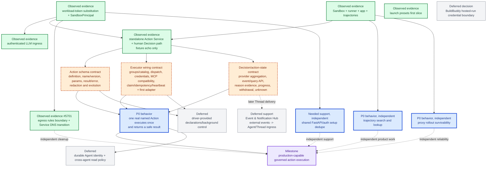

# Agentplane task DAG

This is the authoritative project overview for Agentplane. It records landed behavior as evidence and
keeps only work with a current user-visible outcome or a named design gate in the active path. Edges
are real dependencies; packages without an edge may proceed independently. Labels mean:

- **P0 behavior**: the next user-visible behavior;
- **needed support**: implementation needed to prove that behavior;
- **observed evidence**: already landed or measured; and
- **deferred**: deliberately outside the current slice.

## Current truth on `devel`

**Observed evidence — workload authentication and LLM ingress landed.** PR
[#5685](https://github.com/agentydragon/ducktape/pull/5685) added the generic
`authenticatedWorkloadToken` credential source. PR
[#5696](https://github.com/agentydragon/ducktape/pull/5696) added the shared immutable
`SandboxPrincipal` resolver. PR [#5698](https://github.com/agentydragon/ducktape/pull/5698) added and
wired the independently deployable authenticated LLM ingress. Staging runners present only the
`agentplane-credential-agentplane-workload` placeholder; central egress substitutes the authenticated
Pod-bound bearer for the selected destination, which resolves the live Sandbox and forwards
provider-native traffic to LiteLLM with a server-held virtual key. The compatibility audience is
still `agentplane-egress`; `agentplane-workload` remains a possible coordinated rename, not missing
P0 behavior. See [`../docs/workload_authentication.md`](../docs/workload_authentication.md).

**Observed evidence — the standalone Action Service landed.** PR
[#5700](https://github.com/agentydragon/ducktape/pull/5700) made the service the PostgreSQL owner of
`ActionRequest`, `Decision`, `Execution`, state events, and a pending-decision outbox reference. The
current caller envelope accepts exactly a 1–200 character `idempotency_key`, a 1–240 character
`capability`, a JSON-object `arguments`, and optional JSON-object `origin`/`correlation`; extra
top-level fields are rejected, and origin/correlation are untrusted provenance. Workload callers can read their own redacted records; the operator surface can read all
and issue an expected-version, idempotent human allow/deny Decision. Allow auto-dispatches exactly
one Execution; there are no blind retries, and unsafe restart state becomes `execution_unknown`.

The only accepted capability is `agentplane:v0.echo`. `EchoExecutor` returns
`{"echo": <arguments>}` in-process and exists only to prove the coordinator seam, redaction,
single-execution claim, and recovery behavior. It is not a production action definition, backend,
MCP adapter, HTTP adapter, worker protocol, or credential-bearing executor. No real backend is wired
because the Action schema and Executor wiring contracts below have not been decided or tested.

**Observed evidence — launch presets landed.** PR
[#5648](https://github.com/agentydragon/ducktape/pull/5648) landed the app-owned `SandboxPreset` and
`ThreadPreset` first slice, including `public-coder`, runner initialization, UI selection, and the
manual live acceptance target. Broader capability profiles remain deferred; see
[`../docs/launch_presets.md`](../docs/launch_presets.md) and [`profiles.md`](profiles.md).

**Observed evidence — executor liveness and orphan-recovery contract landed for the in-process
fixture executor.** Executor-level health heartbeats, a per-Execution lease/heartbeat with bounded
expiry, `lease_expired`/`executor_lost` reason attribution, and authenticated late-completion or
authoritative-status reconciliation restricted to an Execution already `execution_unknown` resolve
`EW` item 6 and part of item 5. Dispatch is still in-process, so items 2–4, 7, and 9 remain open; see
[`../docs/executor_liveness.md`](../docs/executor_liveness.md).

**Observed evidence — egress rules API boundary landed.** PR
[#5701](https://github.com/agentydragon/ducktape/pull/5701) made
`http://agentplane-egress.agentplane-staging.svc.cluster.local/v1/rules` an ordinary destination:
normal policy and exact workload-placeholder substitution, then independent destination bearer
validation through `SandboxPrincipalAuthenticator`. Service port 80 targets a separate API listener
in the same process/Pod; port 8888 remains the forward proxy. `RulesProjection` shares the enforcement
index and the redacted response contract. No local-dispatch branch or new credential mode is needed.

## DAG

The critical path to production action execution is `ACTION0 -> AS + EW + DEL -> ACTION1`. Egress
introspection cleanup, shared FastAPI/auth deduplication, trajectory search, and proxy survivability
can proceed without waiting for those gates. Their independence must not be described as evidence
that the current echo-only Action Service can execute production work.

## Named gates and acceptance evidence

### `AS` — Action schema contract

**P0 behavior:** a caller can submit one stable, reviewable, namespaced Action whose parameters are
validated before a Decision or dispatch, and whose result/error can be safely replayed.

**Needed support / decisions:**

1. Define **Action** as the code-owned capability concept and **ActionRequest** as one immutable
   invocation of that Action. Keep the existing request lifecycle and one-logical-intent model.
2. Choose a stable group/action name and catalog evolution behavior. No public `action_version` is
   required; execution re-checks the current executor/tool schema and refuses incompatible arguments.
3. Define parameter representation and validation. **Recommendation:** use the live MCP/tool schema
   for the first adapter; introduce a smaller typed contract only if a non-MCP executor needs it.
4. Define the result and stable error envelope, including which backend/provider details are safe to
   persist and return.
5. Define redaction and projection rules for inputs, results, errors, Decision views, events, logs,
   and replay fixtures. Do not add a generic `sensitivity` field to every Action.
6. Keep ActionGroup-to-executor and MCP-server/tool bindings in reviewed runtime configuration such
   as YAML, so backend/account changes do not require an image roll.

**Acceptance evidence:** connect the configured GitHub MCP server as the user's account, mirror its
catalog, auto-allow safe public-repository reads, and prove with an acceptance test that an Agent can
invoke one read Action and receive a safe result. Include negative tests for unknown group/action,
malformed parameters, incompatible current tool schema, malformed result/error, and sensitive data
appearing in any projection or log.

### `EW` — Executor wiring contract

**P0 behavior:** one accepted and allowed ActionRequest selects exactly one healthy configured
Executor, crosses a defined credential boundary, and produces one durable result or explicit unknown
outcome without replay.

**Needed support / decisions:**

1. Define how `(action name, definition version)` selects an Executor and how capability/definition
   registration is validated at startup. Duplicate, missing, or incompatible registrations fail
   startup or request admission; they do not fall through at dispatch time.
2. Define adapter/backend configuration and validation, including what is static code/config and what
   may be changed without rebuilding.
3. Choose in-process execution versus a separate worker/process for the first adapter, and record the
   failure/isolation property that justifies the choice. **Recommendation:** use an in-process,
   code-owned adapter only if its SDK/transport can uphold the credential and no-retry boundary;
   otherwise choose a separate worker before adding a generic worker framework.
4. Define the credential and Kubernetes ServiceAccount boundary. State which process may receive a
   real credential, how central egress or native workload identity is used, and what the Action
   Service itself must never possess.
5. Define dispatch transport and result/event delivery back to the Action Service, including how a
   worker proves which request it is completing. **Landed in part:** the lease-token bearer a
   worker presents to heartbeat or complete is decided (`docs/executor_liveness.md`); the transport
   that would carry it out of process is not.
6. **Landed:** preserve the exactly-one claim — one Execution row, atomic claim before dispatch, no
   retry after dispatch may have begun, bounded lease expiry to `execution_unknown` on ambiguous
   loss, and adapter-agnostic reconciliation (late completion or an authoritative status lookup)
   restricted to an Execution already `execution_unknown`, never preempting a live attempt. See
   `docs/executor_liveness.md`.
7. Define idempotency-key behavior at request admission and at the backend boundary. A backend key
   may reduce duplicate effects but does not weaken the service's no-retry rule.
8. Define executor health and capability discovery as startup/readiness evidence, not a broad dynamic
   registry. **Landed in part:** an executor-level health heartbeat exists internally and feeds
   orphan-reason attribution; no external readiness/discovery endpoint exists yet.
9. Select one concrete first adapter and write its acceptance fixture before implementation.
   Minimum evidence: the named Action validates, allow auto-dispatches once, the configured backend
   receives the exact intended payload and credential identity, duplicate Decision/start paths do
   not call it twice, success and safe failure are delivered, and ambiguous transport loss becomes
   unknown without retry.

`agentplane:v0.echo` remains explicitly fixture-only and cannot satisfy this gate.

### `DEL` — decision and Action-state contract

**P0 behavior:** submission remains non-blocking; the Action API and durable Action events expose a pending
human Decision and the eventual Decision/Execution result with bounded provider-authored reason
evidence. Originating-Thread notification is a later integration node, not a prerequisite for
proving that an Agent can use an Action backed by MCP.

**Observed evidence — synchronous DecisionProvider aggregation landed.** PR
[#5732](https://github.com/agentydragon/ducktape/pull/5732) added deny-dominant aggregation of
configured synchronous non-human providers ahead of the existing human path, with bounded
provider-authored reason evidence and a shared optimistic-version/idempotency commit path for both
human and auto-provider Decisions. See [`async_approvals.md`](async_approvals.md).

**Needed support:** define durable Action event append/query, human decision callbacks, withdrawal
before execution, bounded progress, redacted payload projection, and what an Agent receives for
`execution_unknown`. A separate outbox is not required for this slice.

**Acceptance evidence:** a scripted replay covering submit -> pending -> allow/deny -> one execution
or no execution -> Action API polling, including process restart and duplicate callback delivery.

### `ING` — Event & Notification Hub

**Deferred support:** consume Action events and external sources such as GitHub/Calendar, match
user/Agent subscriptions, and deliver structured events into an Agent/Thread ingress. The Hub owns
subscription matching, deduplication, batching/debounce, rate limits, backpressure, offline delivery,
and Thread wake/queue semantics. It is not an executor or an Action decision authority.

## Preserved decisions

These are observed product decisions and must not be reopened by the schema or wiring gates:

- `ActionRequest` is one logical intent with an invariant request shape.
- `Decision` and `Execution` are separate durable records.
- One ActionRequest may create at most one Execution.
- A final allow Decision may auto-dispatch; there is no universal agent `commit` step.
- The v0 DecisionProvider is human/operator-backed.
- Dispatch is never blindly retried; ambiguity becomes `execution_unknown`.
- Caller-own and operator-all reads remain the v0 access scope, with credential-shaped data redacted.

## Deferred

- capability matrices or a broad Agent identity/privilege framework;
- MCP registry, dynamic action marketplace, standing grants, and cross-agent permissions;
- production executor implementation in this planning PR;
- per-destination workload audiences until recipient isolation is required;
- broad profiles beyond the landed launch-preset slice; and
- cryptographic Decision signing until Decisions cross a boundary that requires it.
