# Agentplane task DAG

This is the authoritative map of remaining Agentplane work. Edges are technical dependencies;
operator priority is separate. Completed implementation belongs in the component contracts, not
this backlog. See the [Action Service specification](../action_service/SPEC.md),
[service integration details](../action_service/README.md),
[workload authentication](../docs/workload_authentication.md),
[operator federation](../docs/operator_federation.md), and
[launch presets](../docs/launch_presets.md).

## Operator priority

All Agentplane components and their acceptance contracts are multi-replica by default. Durable
state belongs to the owning PostgreSQL or Kubernetes authority; cross-replica change fanout uses
the authority's notification/watch mechanism (PostgreSQL `NOTIFY` for Action Service state), with
reconnect/replay from durable state rather than process-local memory. A single-replica deployment
is an explicit temporary operational constraint, never an implicit correctness assumption.

Prioritize working deployed Claude.ai access to the Action Service MCP facade (`CLAUDEAI`).
Transcript search/lookup (`T3`) is deliberately deferred until a later product-planning point; it
is not in the current execution sequence. Search is technically independent, so this deferral is a
priority decision rather than a claim that its implementation depends on MCP. Additional local
Claude Code acceptance and full Haku migration are not part of the current priority condition.

## DAG

```mermaid
flowchart TB
    classDef active fill:#dbeafe,stroke:#1d4ed8,color:#1e3a8a,stroke-width:3px
    classDef decision fill:#ffedd5,stroke:#c2410c,color:#7c2d12,stroke-width:2px,stroke-dasharray:5 3
    classDef future fill:#f3f4f6,stroke:#6b7280,color:#374151
    classDef milestone fill:#ede9fe,stroke:#6d28d9,color:#4c1d95,stroke-width:2px

    MCP0["P0 behavior<br/>credentialless remote MCP Action<br/>real staging LLM acceptance"]:::active
    MCPAUTH["Deferred support<br/>credentialed MCP account<br/>OAuth + credential-broker boundary"]:::future
    CRED["Deferred decision<br/>static credential + binding design<br/>ownership, lifecycle, revocation"]:::future
    MCPACCEPT["Milestone<br/>rerunnable Action/MCP acceptance<br/>against the deployed stack"]:::milestone
    POLICYBIND["Design gate<br/>shared ActionPolicySets + bindings<br/>model, storage, ownership"]:::decision
    MCPDEPLOY["In progress<br/>OAuth-capable images + staging wiring<br/>public MCP and Sandbox reachability"]:::active
    RECONNECT["Remaining support<br/>fresh consent for existing Connection<br/>explicit reconnect or Identity change"]:::future
    CALLERPOLICY["Planned support<br/>configured caller Action bounds<br/>and auto-approval deciders"]:::future
    SBPOLICY["Planned behavior<br/>auto-approve configured Actions<br/>through concrete Sandbox bindings"]:::future
    CLAUDEAI["Priority milestone<br/>working Claude.ai MCP facade<br/>deployed Action execution"]:::active
    EXTERNALMCP["Planned milestone<br/>Claude.ai + external Claude Code<br/>identity-bound Action execution"]:::future
    MCPAGG["Deferred migration<br/>replace Haku Console MCP aggregator<br/>real Claude.ai/Claude Code proof"]:::future
    HOSTEXEC["Deferred adapter<br/>hostexec-backed Action execution"]:::future
    APPROVALUI["Needed live evidence<br/>deployed SSE/push operator federation + BFF<br/>identity and approval proof"]:::active
    RETIRE_AGENT["Deferred migration<br/>retire Haku Console Agent/<br/>conversation management"]:::future
    RETIRE_TOOLS["Deferred migration<br/>retire Haku Console tool-call/<br/>approval management"]:::future
    INPUT_DELIVERY["P0 behavior, independent<br/>input delivery/replay semantics<br/>provider research and captures first"]:::active
    T3["Deferred product work<br/>trajectory search and lookup<br/>later prioritization"]:::future
    PR["P0 behavior, independent<br/>proxy rollout survivability"]:::active
    PC_EGRESS["Milestone<br/>public-coder-agent egress migration<br/>prod Agentplane proxy"]:::milestone
    PROFILES["Deferred decision<br/>capability profiles<br/>Rai design confirmation required"]:::future
    ACCESS["Deferred design<br/>delegated vs brokered external access<br/>grants and revocation"]:::future
    EGRESS_CHANGE["Deferred design<br/>agent-requested egress<br/>policy expansion"]:::future
    LIVE_CLEAN["Deferred cleanup<br/>executor heartbeat identity/<br/>row retention"]:::future

    BB["Deferred decision<br/>BuildBuddy hosted-run credential boundary"]:::future
    PROVIDERLOG["Ready fix<br/>safe formatted provider-error logs"]:::active
    NOTIFY["Observed evidence<br/>web push approval notifications<br/>delivery implementation complete"]:::milestone
    ING["Deferred support<br/>Event & Notification Hub<br/>external events -> Agent/Thread ingress"]:::future
    DT["Deferred<br/>driver-provided declarations/background control"]:::future
    AG["Deferred<br/>hosted Thread lifecycle<br/>cross-Identity read policy"]:::future
    IDENTITY_SCOPE["Deferred discussion<br/>cross-service static Identity access<br/>MCP and binding-authority placement"]:::future
    PROD["Milestone<br/>production-capable governed action execution"]:::milestone

    MCP0 --> MCPACCEPT
    MCP0 --> MCPAUTH
    CRED --> MCPAUTH
    MCPAUTH --> PROD
    POLICYBIND --> CALLERPOLICY
    CALLERPOLICY --> SBPOLICY
    MCPDEPLOY --> CLAUDEAI
    APPROVALUI --> CLAUDEAI
    CLAUDEAI --> EXTERNALMCP
    EXTERNALMCP --> MCPAGG
    MCPAGG -. replacement surface .-> RETIRE_TOOLS
    APPROVALUI -. replacement surface .-> RETIRE_TOOLS
    AG -. hosted Thread lifecycle .-> RETIRE_AGENT

    INPUT_DELIVERY -. reliable Thread ingress .-> ING
    T3 -. product work .-> PROD
    PR -. independent reliability .-> PROD
    PR --> PC_EGRESS

    MCP0 --> AG
    ACCESS -. authority choice .-> EGRESS_CHANGE
```

The credentialless deployed gate is `MCP0 -> MCPACCEPT`: use the existing staging-owned
streamable-HTTP fixture and real Claude/Codex acceptance turns. Implementation and CI evidence
already exist. A real two-provider echo pass is recorded in
[#5922](https://github.com/agentydragon/ducktape/pull/5922); the full rerunnable evidence gate remains.
Credentialed upstream access is separate (`MCPAUTH`).
Input delivery and proxy survivability can proceed independently of the external-client track.

The external-client track is single-operator and independent of `MCP0` and the broader `AG` model.
Its product terms are Identity (configured authority), Connection (runtime named client enrollment), and Thread
(execution/conversation state); it adds no multi-operator management or per-operator ownership model.
Configured static Identities, runtime Connection/grant authority, OAuth/DCR enrollment with app
consent, the generic MCP frontend, Connection list/rename/unbind UI, and provenance display are implemented.
The remaining first-delivery work is staging rollout (`MCPDEPLOY`) and real operator/client proof
(`APPROVALUI` / `CLAUDEAI`). `RECONNECT` extends management independently and does not gate
the initial new-Connection flow. `EXTERNALMCP` additionally proves independently
running Claude Code. The [external connection plan](external_mcp_connections.md) owns remaining
delivery and compatibility work, not a duplicate of the implemented contracts.
The first external slice uses human approval. `POLICYBIND` settles policy-definition/assignment
storage before `CALLERPOLICY`; neither gates the human-approved client proof. Connection authority
already lives in PostgreSQL and is not part of that open storage decision. Static Identity does
not select backend credentials or wait for `CRED`/`PROFILES`; outbound account OAuth remains
`MCPAUTH`. Initial client proof does not establish full Haku tool parity.
Hosted harnesses continue to call Actions from their Sandbox Threads: `CALLERPOLICY -> SBPOLICY`
adds configurable auto-approval through concrete Actions-owned Sandbox bindings. SandboxPreset stays
an integration-app-only recipe: the app resolves preset defaults and per-Sandbox additions into each
subsystem's bindings. Actions and egress do not resolve presets or depend on one another. The
[Action policy plan](action_policies.md) owns shared bounds and deciders; policy representation remains open.
Hostexec is another adapter behind the existing Executor contract; its final ordering relative to the credentialed
MCP path is deferred.
Haku Console migration is split: Agent/conversation management and tool-call/approval management
can retire on different schedules after their respective replacement surfaces exist. Neither is a
prerequisite for the first Action/MCP acceptance.

### `EGRESS_CHANGE` — agent-requested egress policy expansion

**Deferred design:** define how an agent can request an expansion or change to its egress rules.
The request may become a policy-gated Action with operator approval, or use another reviewed
configuration path. Keep the authority, approval, persistence, and rollback model open until a
concrete caller and policy owner are chosen. This does not grant agents a direct policy mutation
path and does not block current credential-placeholder egress.

## Named gates and acceptance evidence

### `MCP0` — credentialless remote MCP vertical slice

**P0 behavior:** a real staging Claude/Codex Agent discovers one configured ActionGroup, submits one
read-only ActionRequest, and polls durable Action events to a safe result produced by a remote MCP
server without the Agent or Action Service holding a provider credential.

**Observed evidence:** production composition, remote transport, staging Everything binding,
bounded echo auto-allow policy, and `x/agentplane/acceptance/test_mcp.py` are implemented.
[#5922](https://github.com/agentydragon/ducktape/pull/5922) records a real Claude/Codex echo pass.
The broader independent-evidence scenarios in
[#5822](https://github.com/agentydragon/ducktape/pull/5822) remain open; reconcile that PR against
current federation/cancellation contracts before adding overlapping acceptance work.

**Needed support:** verify deployed images/configuration and run that suite through the real
OIDC/BFF and harness paths. Keep real MCP tools for success cases and isolated doubles only for
controlled failures/concurrency. CI composition tests do not satisfy this live gate.

**Acceptance evidence:** `//x/agentplane/acceptance:all` runs the scenario against the deployed
stack for both real harness providers, verifies catalog discovery, exactly one Action execution,
cursor-based event polling, and the exact safe tool result. It must not assert success from the
Agent's prose alone.

### `MCPAUTH` — credentialed MCP account and OAuth boundary

**Deferred support:** connect a user's GitHub MCP account without moving browser OAuth state or
refresh credentials into the harness. Haku Console or a shared credential broker should own the
operator identity, authorization-code + PKCE flow, callback state, token exchange/refresh, and
durable token association. Action Service should receive only an opaque account/credential binding
and own MCP discovery/call translation. If standalone operation later requires Action Service to own
OAuth, implement the smallest separately tested subset rather than copying Haku Console wholesale.
The static credential and binding model is a separate design decision below and requires Rai's
confirmation before implementation begins.

**Acceptance evidence:** a separate credentialed live scenario proves account linkage, catalog
refresh, one safe GitHub read, token refresh/reconnect, and negative isolation for an unbound or
different account. This milestone must not block `MCP0` or be folded into the credentialless fixture
test.

### `MCPDEPLOY` — stage the external MCP endpoint

**In progress:** [#5926](https://github.com/agentydragon/ducktape/pull/5926) prepares the
dedicated Authentik provider, persistent OAuth keys, configured Identity, public protocol routes,
and Sandbox `/mcp` egress substitution. Keep it draft until published Action Service, migration,
and integration-app images contain the merged consent/OAuth implementation and the deployment pins
are compatible. A merged source PR or a healthy old pod does not establish readiness.

**Acceptance:** after operator-approved rollout, verify migrations, required reflected configuration,
public discovery/callback/resource URLs, and external MCP reachability. Follow the rollout runbook
in that PR. Then run `CLAUDEAI`; this configuration task alone cannot satisfy it. Verify Sandbox
MCP reachability in parallel; that caller's acceptance is not a prerequisite for `CLAUDEAI`.

### `RECONNECT` — authorize an existing Connection through fresh consent

**Remaining support:** extend enrollment and the app consent UI with an explicit new/existing
Connection choice, reviewed Connection version, and authority-change confirmation. The trusted
`ReconnectConnection` primitive already exists, but enrollment currently always uses
`NewConnection`. Reuse the existing browser-bound consent and operator authority.

The grant semantics are settled: replacement ends the old grant when the pending revision is
bound; old tokens never gain the replacement Identity, and failed activation does not restore the
old grant. Preserve historical Action provenance and original-grant dispatch checks. Do not infer
an existing Connection from a display name or fresh DCR client ID.

**Acceptance:** same-Identity reconnect and explicit A-to-B rebind, stale/conflicting browser
submissions, failed replacement issuance, old-token rejection, and unchanged historical receipts.
Neither this feature nor configurable policies gates the initial Claude.ai connection.

### `POLICYBIND` — policy-binding model and storage

**Open design decision:** identify where policy definitions, Identity-to-policy bindings, and
concrete Sandbox-to-policy bindings live and how they are modeled. Distinguish configured policy
bindings from runtime named Connection-to-Identity bindings created/edited during enrollment and
management. Keep SandboxPreset resolution and per-Sandbox additions in the integration app;
downstream services only consume their own policy bindings. Choose
cardinality/precedence, stable IDs, mutation ownership, and rollout/revocation semantics. This is
single-operator; multiple-operator management is out of scope.

**Required reuse:** a `public-coder` Sandbox type and a distinct external `claude-wyrm2` Identity can
reference the same canonical ActionPolicySet (working name). One edit changes their Action policy
under the chosen consistency contract without copying rules into each caller's configuration.
Explicit references share permissions, not caller identity, receipt ownership, or upstream credentials.
The first slice does not require a general inheritance system; the [Action policy plan](action_policies.md)
owns the worked example, composition choices, and shared-policy acceptance.

The [Action policy plan](action_policies.md) compares app configuration, Kubernetes resources,
PostgreSQL, and mixed ownership. No option is selected. For Kubernetes, define resource shape,
RBAC, references, and informer freshness. Runtime Connections/grants already use the Action
Service's PostgreSQL authority. Walk one external and one hosted request through policy resolution,
policy edit, and dispatch before implementing `CALLERPOLICY` persistence. Existing human-approved
external access, Sandbox authentication, and Action execution remain usable while this design is open.

### `CALLERPOLICY` — bounded Action deciders for external and hosted callers

**Planned support:** configure exact Actions/argument conditions and auto-approval deciders selected
through reusable policy-set bindings for an external Identity or an authenticated Sandbox.
The integration app may derive concrete Sandbox bindings from its presets and instance additions;
the Action Service does not interpret presets. Reuse the existing DecisionProvider aggregation and
the canonical Decision/Execution lifecycle. Mandatory authorization bounds must fail closed even
when another provider allows; permitted requests without auto-approval may take the human path.

**Design gate / acceptance:** after `POLICYBIND`, the [Action policy plan](action_policies.md) owns typed caller
selectors, mandatory bounds, decider composition, and policy changes between submission and dispatch.
Prove matching auto-allow, changed-argument review/deny, caller-class isolation, and rejection on
failed mandatory bounds. Trusted external Identity and Sandbox caller resolution already exist;
this task adds policy associations and enforcement. Broad `PROFILES` and a policy DSL remain deferred.

### `SBPOLICY` — preset-selected and per-Sandbox auto-approval

**Planned behavior:** an agent harness running in a Thread in a Sandbox calls the Action Service
through its existing workload authentication. The integration app resolves SandboxPreset defaults
and per-Sandbox additions into concrete Actions-owned policy bindings, independently of the egress
bindings it also manages. Neither enforcement service knows preset names or depends on the other.
Sandbox authentication already exists; configurable bindings are new work.

**Design gate / acceptance:** choose policy reference/addition semantics, binding writer authority,
ownership/reconciliation and update/revocation rules. Verify matching/different Sandbox bindings and
arguments, forged references, app outage, instance additions surviving preset updates, and policy
changes before dispatch. Same-preset Sandboxes retain separate caller reads/idempotency; Threads
within one Sandbox retain current shared workload scope. See [Action policies](action_policies.md).

### `CLAUDEAI` — working Claude.ai MCP facade

**Operator-priority milestone:** the operator can connect Claude.ai to the deployed Action Service
MCP facade, name/bind the Connection through integration-app enrollment, discover Actions, and use
them under the configured Identity with real human-approved results. Preserve service safety constraints
and exact authenticated client provenance. Configurable per-Identity auto-approval is subsequent
`CALLERPOLICY` work, not an acceptance requirement for this milestone.
Registration alone, mocks, and CI composition tests do not establish this user-visible outcome.

The broader `EXTERNALMCP` milestone also covers local Claude Code. The operator priority above names
this Claude.ai outcome specifically; it does not require the additional client or full Haku migration.

### `T3` — trajectory search and lookup

**Deferred product work:** search and look up stored trajectories at a later product-planning point.
This is technically independent of `CLAUDEAI`, but it is intentionally not in the current work
sequence. Existing transcript persistence and unrelated lifecycle reliability work are not
reclassified as search implementation by this deferral.

### `EXTERNALMCP` — hosted clients and external harnesses using governed Actions

**Remaining client acceptance:** use the implemented OAuth, generic MCP, Executor, and operator-review
paths. Real Claude.ai and local Claude Code connections (for example on wyrm2)
use selected static Identities to discover and submit one credentialless Action for human approval,
receive a durable pending receipt
and read the result after human review. Independently verify Action ownership, binding, Decisions,
Execution, replay, isolation, and revocation as specified in the
[external connection plan](external_mcp_connections.md). This milestone precedes Haku migration and
does not require backend account OAuth or the full Agent/conversation model. Verify each client's
OAuth/redirect/refresh/reconnect and approval/result flows. External harnesses need no Agentplane
Sandbox/Thread or upstream credentials; only Actions routed through this service are governed by it.

### `CRED` — static credential and binding design

This gate concerns static credentials and backend bindings. Configured static Identities already
authenticate through inbound OAuth and do not depend on selecting a static backend credential.

**Deferred decision — Rai confirmation required:** define what a static credential is bound to
(Identity, external account, MCP server, or another authority), which component owns issuance and
storage, how expiry/refresh/revocation works, how a binding is selected at execution time, and what
the Agent/API may observe. This node is a design discussion, not an implementation task; do not
start code or schema work from it until Rai confirms the design.

### `PROFILES` — cross-cutting capability profiles

The Action-only reusable policy-set slice is planned under `POLICYBIND`/`CALLERPOLICY`; it can serve
both Sandbox types and external Identities without waiting for this broader profile.

**Deferred decision — Rai confirmation required:** define a durable authority for capabilities shared by egress, approvals, MCP
reachability, and other tool permissions. Do not widen the landed launch-preset slice merely to
reserve the concept; Kubernetes remains a storage candidate, and the profile owner, inheritance, and policy
read/verification boundary remain open. Do not start implementation before the design is confirmed.

**Acceptance evidence:** one profile can be resolved consistently by each participating authority,
with explicit precedence and negative tests for stale, cross-Agent, or caller-supplied profile names.

### `ACCESS` — delegated versus brokered external access

**Deferred design:** choose per-system whether an Action uses the Agent's delegated identity, a
brokered operator credential, or a hybrid. Keep target-side RBAC and egress enforcement authoritative;
use grants/revocation reconciliation where a broker mints delegated authority. This is the broader
external-access policy behind `MCPAUTH` and `HOSTEXEC`, not a prerequisite for `MCP0`.

**Acceptance evidence:** a selected system proves the credential boundary, approval behavior, and
revocation/expiry semantics without putting a reusable privileged credential in the harness.

### `PC_EGRESS` — public-coder-agent egress migration

**Milestone:** replace the existing `haku-console` / `iron-proxy` proxy path in front of
`public-coder-agent` with the Agentplane egress proxy, using a dedicated production (non-staging)
Agentplane instance. Preserve the current public-coder configuration as the starting contract: its
wide-open egress and the small set of substituted tokens are intentional inputs to the migration,
not an invitation to redesign policy in this milestone.

**Needed support:** deploy and operate the production Agentplane egress instance, express the
public-coder destination rules and token substitutions in its reviewed configuration, and provide
the required ServiceAccount, network policy, routing, and secret wiring. Compare effective behavior
against the existing path before cutover; do not infer equivalence from source configuration alone.

**Acceptance evidence:** public-coder can reach every currently supported destination, each existing
substituted token is presented only at its intended destination, denied/unmatched traffic behaves as
specified, and the Agentplane proxy survives rollout/restart without silently dropping the agent's
in-flight work. Run the real devbox/agent acceptance through the new path, retain redacted effective
rules and token-boundary evidence, then cut over with a reversible rollback window. Retire the old
`haku-console` / `iron-proxy` resources only after the production path is proven and rollback is
available; this milestone is an egress migration, not permission to widen the stable configuration.

### `MCPAGG` — Haku Console MCP aggregator replacement

**Deferred migration:** use the implemented generic Action MCP frontend as the replacement surface for Haku
Console's aggregator. Verify the required external harness/client workflows against it before
retiring the old surface; do not build a second frontend, approval coordinator, or authority store.
The real-client proof must exercise Claude.ai and independently running Claude Code with OAuth and
configured Identities, including DCR, consent, discovery, human approval, result recovery, refresh,
and revocation. `EXTERNALMCP` is the client-compatibility evidence for this migration, not just a
protocol fixture.
Inventory and migrate the remaining Haku tools, policies, and client workflows separately; backend
credential requirements remain adapter-specific. The initial facade uses generic Action tools;
per-Action projection may never be needed and is not required for migration. Actual generic-client
evidence determines whether to explore it. The migration order remains open.
Tool-call/approval management retirement remains the separate `RETIRE_TOOLS` milestone.

### `HOSTEXEC` — hostexec-backed Action execution

**Deferred support:** add hostexec as an Action Service Executor adapter, preserving hostexec's
existing machine/user authorization, credential exchange, process-state, output, and no-retry
boundaries. This is an adapter behind the existing execution contract, not a reason to build a generic worker framework first.

**Acceptance evidence:** one approved host command produces one durable Execution with bounded output
and safe terminal/unknown handling; duplicate starts do not run the command twice, and the Action
Service never receives a reusable host credential.

### `LIVE_CLEAN` — executor heartbeat retention cleanup

**Deferred cleanup:** executor liveness currently creates one heartbeat identity row per coordinator
process lifetime. Once deployment scale makes that accumulation meaningful, choose a stable executor
identity or bounded expiry/compaction policy and add retention tests; do not change the exactly-one
claim or unknown-outcome semantics while doing so.

### `APPROVALUI` — verify the deployed integration-app operator approval path

**Observed evidence:** PostgreSQL sessions, request-bound federation, Authentik configuration,
dedicated acceptance-operator bootstrap, canonical BFF review/events, authenticated SSE snapshots,
listener recovery, browser registration management, and durable Web Push reconciliation are
implemented. The app's Actions page lists pending/recent requests, exact arguments and caller
principal, shows Decision/result/error state, and offers Allow/Deny for pending requests. `/actions`
BFF routes, `/actions/stream`, `/push/*` routes, frontend tests, and service-worker tests cover the
controls and live-update path; this is not a missing UI implementation.

**Needed live evidence:** verify actual deployment, provider claims, allowed/denied operator access,
VAPID configuration, reviewed push-service egress, and browser/service-worker behavior. Execute the
existing BFF approval acceptance without widening allowlists for a test. [#5922](https://github.com/agentydragon/ducktape/pull/5922)
fixed login-client CSRF handling and the source-subject mapping, but its live run did not complete
the approval gate; verify the corrected configuration has rolled out before rerunning. Signed mock
integration and CI are evidence for code paths, not deployed Authentik, SSE, or OS push proof.

### `RETIRE_AGENT` — Haku Console Agent/conversation management migration

**Deferred migration:** retire Haku Console's own Agent and conversation management only after
Agentplane has the external Identity, durable Thread lifecycle, conversation read/control, and
replacement runtime surfaces required by Haku. This is a migration and decommissioning milestone,
not a prerequisite for Action execution; preserve explicit read/export and rollback evidence before
removing the old owner.

### `RETIRE_TOOLS` — Haku Console tool-call and approval management migration

**Deferred migration:** retire Haku Console's connected-MCP catalog, tool-call application/approval
queue, and related tool-call management only after the `MCPAGG` compatibility migration,
integration-app approval UI, credential bindings, and canonical Action/Decision APIs cover the
required workflows.
This track may move independently of Agent/conversation management: Haku Console may continue to own
conversations while Agentplane owns external tool calls, or the reverse during a staged migration.
Preserve tool-call audit/export and rollback evidence before removing the old owner.

### `PROVIDERLOG` — safe provider failure logging

**Ready fix:** `ActionService._ask` uses `logger.exception`; its formatted traceback can contain
credential-bearing provider exception text. The existing test inspects `record.getMessage()`,
which excludes exception formatting. Remove unsafe exception material from emitted logs and test
the full formatted output with a sentinel secret. Preserve bounded durable error codes and the
existing provider aggregation behavior; do not label log safety implemented before this fix.

### `NOTIFY` — web push approval notification delivery

**Observed evidence:** PR #5937 implements the Action Service sender and integration-app browser
surface. PostgreSQL `NOTIFY` wakes replicas while durable Action state and delivery rows provide
recovery; subscription-row locking prevents concurrent replicas from sending the same logical
notification simultaneously. Failed sends remain retryable, dead subscriptions are cleaned up,
and startup/reconnect reconciliation repairs missed notifications. Push endpoints are constrained
to reviewed HTTPS service hosts, registrations are operator-scoped, payloads omit Action arguments,
results, credentials, and unrestricted errors, and the service worker rechecks canonical state
before presenting approval buttons. Approve/Deny uses the existing authenticated Decision route;
body taps only open review, and resolved/stale notifications do not offer decisions.

**Remaining live acceptance:** a real operator must receive a push for a pending Action, approve
and deny from buttons, see the canonical Action state update, and observe no duplicate Decision or
Execution under retries, refresh, reconnect, or an already-decided request. Prove subscription
revocation and unavailable-push fallback to the existing app UI with configured VAPID keys and
reviewed push-service egress. Crash-after-send-before-commit may resend under the same notification
tag; this is retryable delivery, not exactly-once push. This feature is not required to prove the
first Claude.ai connection, but remains required before treating Agentplane push delivery as a
replacement for the Haku Console experience.

### `INPUT_DELIVERY` — native queue evidence before common-protocol changes

**P0 behavior:** an input crossing the app/runner boundary has an honest, correlated delivery
outcome after disconnect/reconnect, without silently losing it or blindly submitting it twice.
This work is independent of live Action/MCP staging acceptance and is not Action cancellation.

**Needed support — mandatory first step:** re-read the landed
[Claude queue research](../docs/claude_input_queue.md),
[Claude/Codex protocol notes](../docs/provider_protocols.md),
[native harness evidence](../docs/harness_evidence.md),
[Claude runtime contracts](../docs/claude_runtime_contracts.md), and
[current common protocol](../docs/common_protocol.md), then inspect the pinned drivers/tests.
Reconsider the common protocol's input semantics from this evidence rather than assuming the
bridge is the only queue or that one input equals one turn.

- Claude: UUID command handles, lifecycle receipts, capability negotiation, targeted withdrawal,
  interrupt receipts/queued survivors, and coalescing that can make cancellation batch-granular.
  Do not interpret an ambiguous `cancelled:false` as a guaranteed no-op or fabricate receipts.
- Codex: distinguish joined input in the active turn's in-memory pending list from the separate
  experimental durable `thread/queue/*` API. Examine queue promotion, dispatch/delete locking,
  interruption, and correlated user-message evidence; an RPC acknowledgement is not consumption
  or completion, and a queue-changed notification alone does not prove promotion.

**Observed evidence boundary:** some queue behavior comes from declarations/static analysis, not
capture-pinned tests. Refresh live probes/captures against both pinned binaries for the behavior
being adopted before changing the common protocol; then encode supported behavior in scripted
native-harness CI tests against the controlled model endpoint. Missing capabilities and blocked
experiments stay explicit, not normalized into success. This research may justify common-protocol
changes, but it does not preselect a queue facade, selective cancellation, or a new persistence layer.

**Acceptance evidence:** exercise disconnect before delivery, delivery before observed receipt,
reconnect/replay with the same `input_id`, and restart. Prove duplicate-ID handling at each actual
boundary rather than assuming native idempotency. Include Claude coalescing/interrupt/withdrawal
and Codex join-versus-durable-queue cases, preserving raw native evidence and provider differences.
No acknowledgement, retry, steering, cancellation, or completion may be invented by the runner.
Decide the narrow common contract only after these observations; keep unsupported operations native
or explicitly unavailable. **Deferred:** generic queue management and unproven per-input cancellation.

### `IDENTITY_SCOPE` — cross-service Identity authority and MCP placement

**Deferred discussion:** hosted agents will access multiple Agentplane services through Sandbox-token
authentication; external harnesses should likewise be eligible for explicitly authorized access
beyond Actions without becoming hosted Sandboxes. Conversation search/reading is one example,
not the scope of the feature. Reconsider whether the MCP frontend and Connection-to-Identity binding
authority should move out of the Action Service. Compare shared-facade and direct-service access;
each resource-owning service retains its authorization, independent of caller authentication.
Sharing an Identity's Action scope does not by itself grant access to another service.

Discuss resource-specific permissions, credential audiences, trusted identity propagation, revocation, and preservation
of exact client provenance across services. The [external connection plan](external_mcp_connections.md)
records the boundary. This is not a prerequisite for the current DCR/consent slice, not a decision
to extract now, and not a reason to add speculative service interfaces or preset coupling.

### `ING` — Event & Notification Hub

**Deferred support:** consume Action events and external sources such as GitHub/Calendar, match
user/Agent subscriptions, and deliver structured events into an Agent/Thread ingress. The Hub owns
subscription matching, deduplication, batching/debounce, rate limits, backpressure, offline delivery,
and Thread wake/queue semantics. It is not an executor or an Action decision authority.

## Deferred

- capability matrices or a broad Agent identity/privilege framework;
- cross-cutting capability profiles — see [`profiles.md`](profiles.md);
- delegated-versus-brokered external-access policy and grant/revocation semantics — see
  [`external_access.md`](external_access.md);
- MCP registry, dynamic action marketplace, standing grants, and cross-agent permissions;
- per-destination workload audiences until recipient isolation is required;
- broad profiles beyond the landed launch-preset slice;
- live browser/OS push acceptance and production VAPID/egress rollout; and
- cryptographic Decision signing until Decisions cross a boundary that requires it.
