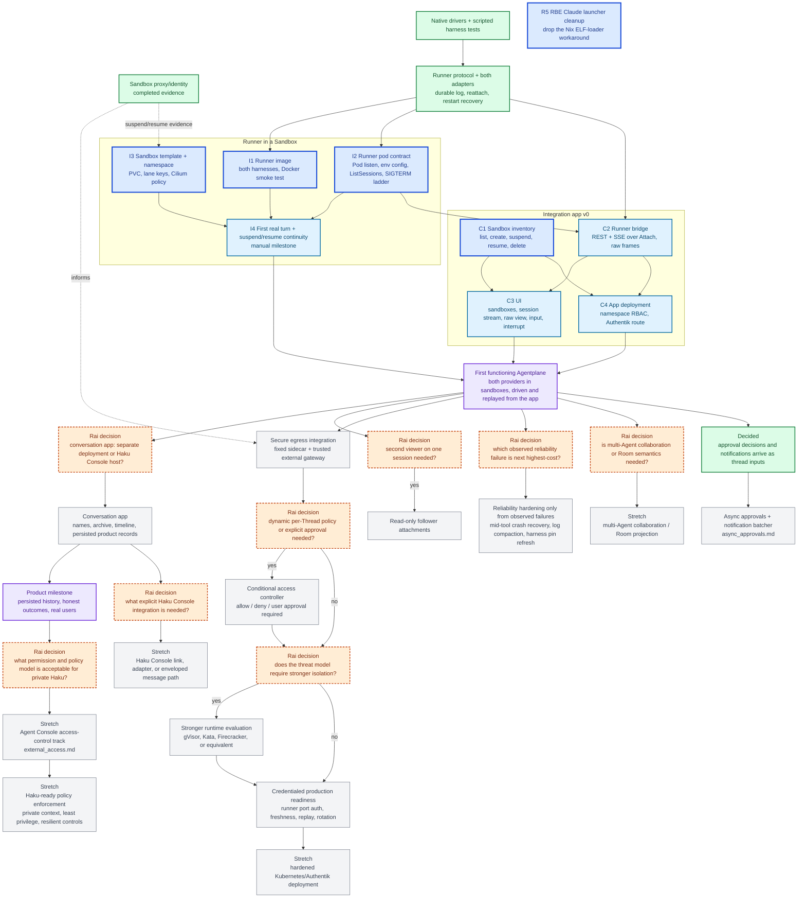

# Agentplane task DAG

This is the single project overview for Agentplane work. It is a dependency map, not a workflow
engine or a request to build every future subsystem. Boxes are sized as coherent agent work packages
that ship as their own PRs; the detailed tasks live in the supporting documents. An edge is a real
dependency, meaning the downstream package cannot be specified or tested without the upstream one.
Packages without an edge between them are meant to be worked in parallel, and a conflict between
two of them is resolved by whoever lands second rebasing.

## Outcome

Rai can open a separate integration app backed by Agentplane, create a sandbox running one Claude
or Codex runner, send an Input, watch response and tool activity arrive, detach and come back to
what happened since, suspend and resume the sandbox with the conversation intact, and read the raw
native frames behind any event. The first functioning product is credentialless toward external
systems; real upstream credentials are a later gate.

## Current status

- **Landed:** the sandbox proxy/identity spike's evidence; the native drivers and scripted harness
  tests ([`../native/`](../native/), [`../harness_tests/`](../harness_tests/),
  [`../capture/`](../capture/)); the runner protocol and service
  ([`../runner/`](../runner/), [`../runner/SPEC.md`](../runner/SPEC.md)) with a durable
  per-session log, cursor reattach, idempotent inputs, and restart recovery, pinned by one set of
  interaction scripts run against both binaries; typed wire models for both harness vocabularies
  and the `py_grpc_library` macro that generates the protocol stubs.
- **Next:** the runner in an Agent Sandbox and the first integration app,
  [`runner_sandbox_and_app.md`](runner_sandbox_and_app.md). Its packages are the ready-now nodes
  below; four of them can start today in parallel.
- **Access-control scope is intentionally deferred:** the current Ducktape work can use its existing
  broad internet boundary and scoped GitHub credential for `agentydragon-agent`; that convenience is
  not a policy model for the private, high-context Haku agent.

## DAG

Legend: green is landed; the bold blue nodes are ready to start now, in
parallel; light blue is next work blocked only on a node in this slice; purple is a milestone;
orange diamonds are unresolved decisions requiring Rai's product or design input; gray is
conditional or stretch work.

Ready now, with no edge between them: **I1**, **I2**, **I3**, **C1**, **R5**. C2 needs only I2's
`ListSessions`, and its tests run against a local runner with the scripted model, so it can start
as soon as that RPC's shape is agreed. C3 and C4 wait on C1 and C2 only for their API schema and
image; their manifests and page skeletons can be drafted alongside.

The orange nodes are deliberately limited to choices that change downstream implementation
ordering. `D` is assumed answered as "separate deployment" for this slice, since the integration
app is a separate client by construction; the decision remains open for the conversation app.
External-event scope is decided: approval decisions and other notifications reach a thread as
inputs ([`async_approvals.md`](async_approvals.md)). A "no" choice should close or defer that
branch rather than create speculative scaffolding.

The `P`/`K` path is only the narrow access decision needed for a credentialed Agentplane egress
deployment. It is not the general Agent Console permission model represented by `AA`/`AB`, and it must
not be reused as a private-Haku policy language by default. The existing broad Ducktape lane is a
scoped operational convenience, not evidence that the same grants are safe for an agent with Rai's
personal context.

## Work-package acceptance

- **Sandbox evidence:** the committed spike and evidence memo distinguish proven credential exclusion,
  Pod/Sandbox authentication, replay/lifecycle behavior, and unsupported same-Pod route confinement.
- **Native drivers + scripted harness tests:** real Claude and Codex binaries driven over stdio by
  [`../native/`](../native/); the scripted tests in [`../harness_tests/`](../harness_tests/) cover
  turns, idle resume, tool round trips, steering/interrupt and mid-turn input, and upstream
  connection loss for both providers, asserting each step's upstream request markers and native
  frames. The scenario matrix is in [`experiments.md`](experiments.md); what each harness exposes
  beyond the tests is in [`../native/docs/protocol_roster.md`](../native/docs/protocol_roster.md).
- **Live capture probe:** [`../capture/`](../capture/) records raw native and upstream logs outside
  Git as reference material for authoring or repairing a script, never as test inputs. A harness
  bump or newly tested protocol area requires a probe run, human inspection of the differences
  against the scripted expectations, and a script update.
- **Runner protocol + adapters:** one gRPC contract justified by observed native frames, with both
  Claude and Codex adapters exercised through the same interaction scripts. Landed as
  [`../runner/`](../runner/); its contract is [`../runner/SPEC.md`](../runner/SPEC.md).
- **I1 runner image:** an `oci_image` with the runner and both pinned harnesses, registered for the
  Forgejo registry, whose Docker smoke test attaches over the protocol and runs one scripted turn
  per harness on RBE.
- **I2 runner pod contract:** the runner listens on the Pod address with its state on a volume,
  takes provider configuration from the environment, answers `ListSessions`, and on SIGTERM stops
  every harness through the stdin-close ladder before exiting; a runner test covers the RPC and the
  signal path.
- **I3 sandbox template:** `cluster/k8s/agentplane/` carries the namespace, the `SandboxTemplate`,
  the reflected lane keys, and Cilium policy; the cluster validator passes and a claim from it
  reaches Ready once the image is published.
- **I4 first real turn:** one turn per provider against LiteLLM from inside a sandbox, then
  detach, suspend, resume, reattach from the cursor, and the earlier turn visible in the resumed
  conversation; observations that change a guarantee go into the runner SPEC.
- **C1 sandbox inventory:** REST with an OpenAPI schema over Agentplane's claims and sandboxes:
  list with provisioning state, create, suspend, resume, delete; tested without a live cluster.
- **C2 runner bridge:** sessions per sandbox, attach with a cursor, inputs, interrupt, shutdown,
  and SSE with the event sequence as the SSE id; `Native` events pass through; tested against a
  local runner with the scripted model.
- **C3 UI:** a small SPA over C1 and C2 with the sandbox list and controls, the session stream, a
  raw-frames view, an input box, and interrupt; provisioning, running, suspended, lost, and
  uncertain states shown honestly.
- **C4 app deployment:** Deployment, Service, Authentik-fronted route, and namespace-scoped RBAC,
  with the image registered like the runner's.
- **R5 RBE launcher cleanup:** the Claude harness tests run on RBE without the Nix ELF-loader
  workaround in [`../harness_tests/claude/harness.py`](../harness_tests/claude/harness.py);
  drivers and assertions unchanged.
- **First functioning Agentplane (F0):** from the app, both providers run in sandboxes, a session is
  driven, left, and replayed, a sandbox survives suspend and resume with its conversation, and the
  raw frames behind any event are one click away.
- **Conversation app (E):** names, archive, timeline, and the persisted product records they need,
  as a client of the same API; generated names and archive presentation stay in this layer.
- **Secure egress and credentialed readiness:** one narrow synthetic operation proves the fixed sidecar
  to trusted gateway path before any real upstream credential is enabled. Real credentials remain only
  at the gateway; durable freshness/replay, per-Sandbox/Thread binding, rotation, runner-port
  authentication, and escape tests gate production use.
- **Reliability:** choose one observed failure with the highest user cost after the first functioning
  product. Candidates already known: recovery of a turn lost mid-tool beyond `PROCESS_LOST`, session
  log growth, and the harness pin refresh workflow. Each hardening slice needs its own reproduction
  and acceptance test; do not implement every candidate in advance.
- **Stretch branches:** collaboration, external events, Haku Console integration, stronger runtimes,
  hardened deployment, and the private-Haku access-control track each begin only after the
  corresponding decision node and dependencies are resolved. The private-Haku track must cover tool
  execution, HTTP/API calls, credential handling, approvals, and policy behavior without assuming that
  routine per-action approval clicks are a reliable safety mechanism.

## Ownership and sequencing rules

- Kubernetes/Agent Sandbox owns Claim, Sandbox, Pod, PVC, readiness, suspension, and workload lifecycle.
- Native harnesses own native history, execution semantics, and provider-native resume.
- The runner owns harness supervision, the session log, and the protocol; Agentplane's app owns
  the sandbox inventory it derives from Kubernetes, the browser API, and later the live
  `Pod -> Sandbox -> Thread -> Agent` mapping once that mapping is required.
- The conversation app owns product UX such as generated Thread names, naming persistence, archive
  presentation, and timeline behavior. It may remain separate or later be hosted by Haku Console, but
  must not create shared runtime, route, frontend, or persistence coupling.
- Do not add a persistence schema, UI projection, Kubernetes controller, credential path, or
  approval framework ahead of the first test or feature that cannot pass without it.
- Do not enable real upstream credentials until the secure-egress and credentialed-readiness gates pass.
- One runner per sandbox and one attachment per session are acceptable for the first functioning
  product. Multi-Agent rooms, subscriptions, external events, advanced retention, and provider
  migration are not hidden prerequisites.

## Detailed plans

- The next slice, runner in a sandbox and the integration app:
  [`runner_sandbox_and_app.md`](runner_sandbox_and_app.md).
- Native provider scenarios and the scripted-test workflow: [`experiments.md`](experiments.md), the
  [native driver README](../native/README.md), the [harness tests README](../harness_tests/README.md),
  and the [live capture probe README](../capture/README.md).
- The runner protocol and its tests: [runner README](../runner/README.md) and
  [runner SPEC](../runner/SPEC.md).
- Sandbox identity and egress evidence: [sandbox spike README](../sandbox-spike/README.md) and [egress
  ADR](adr_sandbox_proxy_gateway.md).
- Product/API layering and deferred capabilities: [`product_surface.md`](product_surface.md) and
  [`architecture.md`](architecture.md).
- Asynchronous approvals, decision delivery, and the notification batcher:
  [`async_approvals.md`](async_approvals.md).
- Delegated identity versus brokered credentials per external system, and the rule for choosing:
  [`external_access.md`](external_access.md).
