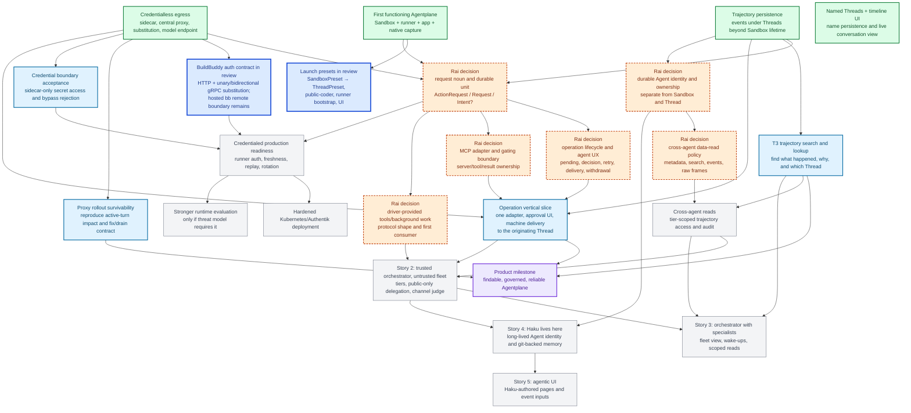

# Agentplane task DAG

This is the single project overview for Agentplane work. It is a dependency map, not a workflow
engine or a request to build every future subsystem. Each active box is a coherent package with a
named acceptance test; completed work is recorded as evidence, not kept as an open task. Edges are
real dependencies. Packages without an edge are intended to proceed in parallel, with whoever lands
second rebasing.

The implemented contracts live with the app, runner, egress proxy, acceptance suite, and durable
notes under [`../docs/`](../docs/). This directory contains only current design gates, active work,
and deferred work.

## Outcome already reached

The first functioning product is landed: Rai can open the integration app, create a Sandbox running
Claude or Codex, send an Input, watch response and tool activity, detach and return to history,
suspend and resume with the conversation intact, and read raw native frames. The app persists
trajectories beyond Sandbox lifetime. Sandboxes hold no upstream credential: model and tool traffic
leave through the sidecar, and the central proxy substitutes the real value.

The current app also already has named Thread persistence and the conversation/timeline UI needed
for this slice. These are completed foundations, not pending DAG packages.

## Current status

**Launch presets are in review**, not an unstarted task: PR #5648 carries the first vertical slice
for app-owned `SandboxPreset` and `ThreadPreset` defaults, the public-coder definition, runner-owned
bootstrap execution, UI, and a manual acceptance target. Once it lands and deploys, run the live
acceptance target; do not extend the preset abstraction before that evidence.

**The next product gate is the operation contract**, not yet an implementation task. “Ask” is useful
conversation copy but is not a settled wire noun. Before building approval delivery, Rai needs to
choose the durable object, lifecycle, pending-turn behavior, single-operation versus standing-grant
semantics, and the MCP adapter boundary. The discussion and recommendations are in
[`operations_and_access.md`](operations_and_access.md).

**BuildBuddy's local-client seam is measured and in review:** PR #5650 proves that the HTTP API,
Bazel remote cache/execution, BES, and Remote Runner control all carry the complete API key in
`x-buildbuddy-api-key`, and that the existing `wholeValue` target substitutes its placeholder across
HTTP, unary gRPC, and bidirectional gRPC with trailers intact. `bb remote` remains outside the safe
slice because it also embeds the key in the Bazel command executed on BuildBuddy's hosted runner.
That nested process is beyond Agentplane egress and needs a runner-side credential reference or
separate broker; it is not evidence for another proxy matcher.

Independently ready now: trajectory search (`T3`), proxy rollout survivability, and sidecar-only
credential security acceptance. They are separate slices with different write surfaces and do not
depend on the preset deployment or operation-contract decision.

## DAG

Legend: green is completed evidence; bold blue is active work or in review; light blue is ready to
start; orange diamonds are Rai decisions/design gates; gray is future work; purple is a milestone.
A completed item leaves the active queue even when it supplies an edge.

## Work packages and acceptance

- **`LP` launch presets:** PR #5648. The integration app owns the preset defaults and Sandbox
  association; explicit fields override; the runner executes configured bootstrap source; the UI
  selects presets and exposes editable inherited Thread defaults. Acceptance is the configured
  `public-coder` live target after deployment, including GitHub egress, bootstrap persistence,
  instructions, and per-Thread override behavior. Follow-up revision history and rollout semantics
  wait for live evidence.
- **`BB` BuildBuddy auth contract:** PR #5650 establishes the complete
  `x-buildbuddy-api-key` HTTP/gRPC metadata value and reuses the existing whole-header target. Its
  fake-stack test exercises HTTP, a unary REAPI-shaped call, and a bidirectional BES-shaped stream
  through sidecar, hosted mitmproxy, and upstream TLS, preserving multiple messages and trailers.
  `bb remote` remains blocked at the hosted runner, which receives a nested Bazel command outside
  Agentplane's fence. The focused test and build passed in BuildBuddy invocations
  `e96f0276-2075-4fff-bb32-9815fd9ee500` and `58eb6493-79a3-4101-9cd8-c09c3074c856`.
- **`OPD` request noun/unit:** Rai chooses the product noun (the current recommendation is
  `ActionRequest`) and whether the durable object is a logical intent with attempts or one execution
  attempt. The discussion is in
  [`operations_and_access.md`](operations_and_access.md). No implementation starts on “ask” alone.
- **`OPS` operation lifecycle/agent UX:** settle pending behavior, decision delivery, retry,
  withdrawal, expiry/no-expiry, one-operation versus standing-grant semantics, sensitive-field
  handling, and the machine envelope. The smallest acceptance is a hand-authored lifecycle and
  replay example that makes each transition and agent-visible input unambiguous.
- **`MCPD` MCP boundary:** decide whether the first MCP server is trusted external infrastructure,
  where server/tool schemas live, what policy gates, and which layer owns MCP transport/errors.
  Acceptance is one adapter boundary diagram plus one end-to-end test shape; no MCP registry is
  built before this gate.
- **`OPI` operation vertical slice:** one real adapter from agent intent through policy/approval to
  execution/result and later Thread delivery. The operation layer may initially be colocated with
  the integration app, but the test must keep runtime lifecycle, access authority, adapter, and
  trajectory responsibilities separable.
- **`T3` trajectory search:** search persisted text and action evidence, answer “what happened,”
  “why,” and “which Thread,” and link to raw frames. Scope is the caller's already-authorized
  trajectory surface; cross-agent visibility is not silently included.
- **`PR` proxy survivability:** reproduce a proxy rollout during a live model turn, then implement
  only the smallest graceful-drain/recovery or persistence change the reproduction demands. A
  passing ordinary health check is not acceptance.
- **`SEC` credential boundary:** deployed acceptance proves the runner receives placeholders only,
  the real credential is sidecar/proxy-only, and direct runner-to-central requests or alternate
  paths are rejected. Keep this separate from the preset feature.
- **`AGD` Agent identity:** Rai decides what durable product Agent means and how it maps to an opaque
  authorization principal. It must not be inferred from Sandbox or Thread IDs.
- **`DATAD` cross-agent read policy:** Rai decides the minimum data scopes and authority boundary
  for reading another Agent's trajectories. Candidate scopes are metadata, derived summary, search
  results, full events, and raw native frames. No scope inventory should be built until a real
  cross-agent consumer exists.
- **`XREAD` cross-agent reads:** only after `AGD`, `DATAD`, and `T3`; enforce caller/target/scope at
  the read boundary and audit the result without making Agentplane a universal identity registry.
- **`DT` driver tools/background:** provider evidence exists, but protocol shape waits for a real
  consumer. It now also depends on the operation/MCP boundary so tool invocation is not designed as
  a second incompatible request model.
- **`L` credentialed readiness:** runner-port authentication, credential freshness/replay defence,
  rotation, and acceptance escape tests. BuildBuddy's fake-stack acceptance proves local-client
  transport and substitution, not production-key scope, freshness, rotation, or revocation. Hosted
  `bb remote` credential delivery remains a distinct external-boundary requirement.

## Decisions and ownership rules

- The Sandbox and Thread runtime remains Agentplane's concern; named presets and their UI remain an
  integration-app concern.
- An Operation/ApprovalRequest, if adopted, must not make Agentplane runtime own every external
  protocol. The access authority owns allow/deny/approval and grants; adapters own MCP/HTTP/
  Kubernetes/host execution; the conversation app owns operator presentation; the trajectory store
  preserves evidence.
- An Agent is a future product identity, distinct from a Sandbox (runtime infrastructure), Thread
  (interaction context), and authorization principal (policy subject). Cross-agent reads require an
  explicit mapping and data-read policy.
- Egress remains enforced by the existing proxy and target policy. A preset or operation adapter
  cannot bypass it or turn a placeholder into a reusable credential.
- Do not add persistence schemas, controllers, policy DSLs, MCP registries, or permission matrices
  before the first acceptance test that needs them. Preserve whole evidence payloads rather than
  duplicating derivable hashes, lengths, manifests, or parsed mirrors.
- Existing completed foundations — T2 named Threads, the timeline app, native capture, credentialless
  egress, and trajectory persistence — are not reopened as tasks. New work must name the observed
  failure or user behavior it proves.

## Deferred until the gates resolve

- general capability/access profiles;
- arbitrary preset inheritance and a preset editor;
- cross-agent rooms, subscriptions, and delegation graphs;
- Haku Console/Matrix migration;
- provider migration and multi-agent hosting;
- stronger isolation runtimes unless the threat-model decision requires them; and
- a private-Haku policy model until Rai accepts an access and data boundary that does not depend on
  routine approval clicks.

See [`operations_and_access.md`](operations_and_access.md) for the detailed operation, MCP, Agent
identity, and cross-agent data-access design discussion. See [`launch_presets.md`](launch_presets.md)
for the completed preset contract and live acceptance target.
