# Agentplane task DAG

This is the single project overview for Agentplane work. It is a dependency map, not a workflow
engine or a request to build every future subsystem. Boxes are sized as coherent agent work packages
that ship as their own PRs; the detailed tasks live in the supporting documents. An edge is a real
dependency, meaning the downstream package cannot be specified or tested without the upstream one.
Packages without an edge between them are meant to be worked in parallel, and a conflict between
two of them is resolved by whoever lands second rebasing.

## Outcome

Rai can open a separate integration app backed by Agentplane, create a sandbox running one Claude
or Codex runner, send an Input, watch response and tool activity arrive, detach and come back to
what happened since, suspend and resume the sandbox with the conversation intact, and read the raw
native frames behind any event. The first instance is a staging one on the cheap-experiments
model key, and the agent working on Agentplane can drive it end to end without Rai: create a
sandbox, run a turn, read what happened, tear it down. The first functioning product is
credentialless toward external systems; real upstream credentials are a later gate. Sandboxes are disposable, trajectories are
not: what an agent did, and why, outlives the sandbox it ran in, under a name, and is searchable
later. Beyond this slice, the experiences the stretch nodes exist for are the three stories in
[`user_stories.md`](user_stories.md): asks Rai decides, a trusted orchestrator delegating
public-only work to an untrusted fleet under a judge, an orchestrator running specialists, Haku itself as a long-lived agent here, and a UI Haku
authors and is driven through.

## Current status

- **Landed:** the sandbox proxy/identity spike's evidence; the native drivers and scripted harness
  tests ([`../native/`](../native/), [`../harness_tests/`](../harness_tests/),
  [`../capture/`](../capture/)); the runner protocol and service
  ([`../runner/`](../runner/), [`../runner/SPEC.md`](../runner/SPEC.md)) with a durable
  per-session log, cursor reattach, idempotent inputs, and restart recovery, pinned by one set of
  interaction scripts run against both binaries; typed wire models for both harness vocabularies
  and the `py_grpc_library` macro that generates the protocol stubs; the runner image with both
  harnesses, the runner's Pod contract (`ListSessions`, the SIGTERM ladder), the
  `agentplane-staging` namespace with its `SandboxTemplate` on the cheap-experiments key and the
  agent's standing access; and the first integration app ([`../app/`](../app/)): the sandbox
  inventory with archive, the runner bridge with SSE fanned out to every tab, the UI with its
  phone layout, the staging deployment behind Authentik, and the PostgreSQL trajectory store.
  The first functioning Agentplane (`F0`) is reached: both providers ran real turns on staging
  from the app, and a sandbox came back from suspension with its conversation.
- **Next:** the secure egress integration (`J`), the gate for every credentialed external system
  and for stories 1 and 2. Named threads (`T2`) and search (`T3`) wait only on a first user of
  the persisted history.
- **Access-control scope is intentionally deferred:** the current Ducktape work can use its existing
  broad internet boundary and scoped GitHub credential for `agentydragon-agent`; that convenience is
  not a policy model for the private, high-context Haku agent.

## DAG

```mermaid
flowchart TB
    classDef completed fill:#dcfce7,stroke:#15803d,color:#14532d,stroke-width:2px
    classDef ready fill:#dbeafe,stroke:#1d4ed8,color:#1e3a8a,stroke-width:3px
    classDef next fill:#e0f2fe,stroke:#0369a1,color:#0c4a6e,stroke-width:2px
    classDef inflight fill:#fef9c3,stroke:#a16207,color:#713f12,stroke-width:2px
    classDef milestone fill:#ede9fe,stroke:#6d28d9,color:#4c1d95,stroke-width:2px
    classDef decision fill:#ffedd5,stroke:#c2410c,color:#7c2d12,stroke-width:2px,stroke-dasharray:5 3
    classDef future fill:#f3f4f6,stroke:#6b7280,color:#374151
    classDef withdrawn fill:#fee2e2,stroke:#b91c1c,color:#7f1d1d,stroke-width:2px,stroke-dasharray:4 3

    S0["Sandbox proxy/identity<br/>completed evidence"]:::completed
    A["Native drivers + scripted harness tests"]:::completed
    B["Runner protocol + both adapters<br/>durable log, reattach, restart recovery"]:::completed

    subgraph pod["Runner in a Sandbox"]
        I1["I1 Runner image<br/>both harnesses, Docker smoke test"]:::completed
        I2["I2 Runner pod contract<br/>Pod listen, env config, ListSessions, SIGTERM ladder"]:::completed
        I3["I3 Staging namespace<br/>sandbox template, PVC, cheap-experiments key,<br/>standing agent access"]:::completed
        I4["I4 First real turn + suspend/resume continuity<br/>manual milestone"]:::completed
    end

    subgraph app["Integration app v0"]
        C1["C1 Sandbox inventory<br/>list, create, suspend, resume, delete"]:::completed
        C2["C2 Runner bridge<br/>REST + SSE over Attach, fan-out to every tab"]:::completed
        C3["C3 UI<br/>sandboxes, session stream, raw view, input, interrupt"]:::completed
        C4["C4 App deployment into staging<br/>RBAC, Authentik route, agent-reachable API"]:::completed
        C5["C5 Archive<br/>out of the active view, history kept"]:::completed
        C6["C6 Session view legibility<br/>the input's own text, over the protocol"]:::ready
        C7["C7 Lifecycle controls on the sandbox page<br/>suspend there, delete once suspended"]:::completed
        C8["C8 Live push for every view<br/>the server says what changed, no page polls"]:::completed
        C9["C9 The profile a sandbox runs under<br/>withdrawn: profiles deferred pending design"]:::withdrawn
        C10["C10 Egress actions that say what they do<br/>a binding is the permission; revoke deletes it"]:::completed
        C11["C11 An agent reads the egress rules that apply to it<br/>same listener, its own projection, no field a Secret could reach"]:::ready
    end

    F0["First functioning Agentplane<br/>both providers in sandboxes, driven and replayed from the app"]:::completed

    subgraph traj["Trajectories outlive sandboxes"]
        T1["T1 Trajectory persistence<br/>session log + native frames copied out of the sandbox<br/>keyed by thread, sandbox, agent"]:::completed
        T2["T2 Named threads<br/>a small model proposes, the user edits"]:::next
        T3["T3 Search and lookup over past interactions<br/>what happened, why, which agent"]:::next
    end
    D["Decided<br/>conversation app: a separate deployment"]:::completed
    E["Conversation app<br/>timeline and live control over persisted threads"]:::future
    F["Product milestone<br/>persisted history, honest outcomes, real users"]:::milestone

    G["Rai decision<br/>second viewer on one session needed?"]:::decision
    R1["Read-only follower attachments"]:::future

    J["Secure egress integration<br/>per-Pod sidecar wraps traffic with the Pod's SA token;<br/>central proxy holds credentials and egress policy;<br/>first credential: the agentydragon-agent GitHub PAT"]:::ready
    H["Declared substitution rules<br/>the policy names the parse and the location;<br/>the placeholder matches a whole component exactly"]:::next
    P["Rai decision<br/>dynamic per-Thread policy or explicit approval needed?"]:::decision
    K["Conditional access controller<br/>allow / deny / user approval required"]:::future
    R["Rai decision<br/>does the threat model require stronger isolation?"]:::decision
    L["Credentialed production readiness<br/>runner port auth, freshness, replay, rotation"]:::future
    V["Stronger runtime evaluation<br/>gVisor, Kata, Firecracker, or equivalent"]:::future

    Q["Rai decision<br/>which observed reliability failure is next highest-cost?"]:::decision
    M["Reliability hardening only from observed failures<br/>mid-tool crash recovery, log compaction, harness pin refresh"]:::future

    N["Story 2: trusted orchestrator, untrusted fleet<br/>tiers, events kind filter, channel judge<br/>user_stories.md"]:::future
    O["Story 3: an orchestrator with specialists<br/>fleet view, wake-ups, tier-scoped reads"]:::future
    HK["Story 4: Haku lives here<br/>long-lived thread, memory in git"]:::future
    UI["Story 5: agentic UI<br/>Haku-authored pages, events as inputs"]:::future
    X["Decided<br/>approval decisions and notifications arrive as thread inputs"]:::completed
    Y["Story 1: ask me, I decide<br/>asks, delivery, decisions as inputs<br/>async_approvals.md, user_stories.md"]:::future
    Z["Rai decision<br/>what explicit Haku Console integration is needed?"]:::decision
    U["Stretch<br/>Haku Console link, adapter, or enveloped message path"]:::future
    AA["Rai decision<br/>what permission and policy model is acceptable for private Haku?"]:::decision
    AB["Stretch<br/>Agent Console access-control track<br/>external_access.md"]:::future
    AC["Stretch<br/>Haku-ready policy enforcement<br/>private context, least privilege, resilient controls"]:::future
    W["Stretch<br/>hardened Kubernetes/Authentik deployment"]:::future

    A --> B
    B --> I1
    B --> I2
    I1 --> I4
    I2 --> I4
    I3 --> I4
    B --> C2
    I2 --> C2
    C1 --> C3
    C2 --> C3
    C1 --> C4
    C2 --> C4
    C1 --> C5
    C3 --> C6
    C1 --> C7
    C3 --> C8
    C1 --> C9
    C4 --> C10
    C4 --> C11
    J --> C11
    C5 --> E
    I4 --> F0
    C3 --> F0
    C4 --> F0
    C2 --> T1
    T1 --> T2
    T1 --> T3
    F0 --> D
    D --> E
    T1 --> E
    T2 --> E
    E --> F
    T3 --> F
    F0 --> G -->|yes| R1
    F0 --> J --> P
    J --> H
    P -->|yes| K --> R
    P -->|no| R
    R -->|yes| V --> L
    R -->|no| L
    F0 --> Q --> M
    J --> N
    T1 --> N
    Y --> N
    N --> O
    I4 --> HK
    T1 --> HK
    HK --> UI
    Y --> UI
    T3 --> O
    F0 --> X --> Y
    J --> Y
    E --> Z --> U
    F --> AA --> AB --> AC
    L --> W
    S0 -. informs .-> J
    S0 -. suspend/resume evidence .-> I3
```

Legend: green is landed; yellow is in flight, with a PR open; the bold blue nodes are ready to
start now, in parallel; light blue is next work blocked only on a node in this slice; purple is a
milestone;
orange diamonds are unresolved decisions requiring Rai's product or design input; red dashed is
withdrawn — the package will not be built as specified; gray is conditional or stretch work.

Ready now: **J**, **C6**, and **C11**, which share nothing and can run in parallel. **T2** and **T3** are
blocked on nothing in code; they start when the persisted history has a first reader who needs a
name or a search.

The orange nodes are deliberately limited to choices that change downstream implementation
ordering. `D` is decided: the conversation app stays a separate deployment, at least for now.
T1's store is PostgreSQL (a CNPG cluster beside the runner Pods; staging's is disposable).
External-event scope is decided: approval decisions and other notifications reach a thread as
inputs ([`async_approvals.md`](async_approvals.md)). A "no" choice should close or defer that
branch rather than create speculative scaffolding.

`J` is decided in shape: the ADR's composition, a per-Pod sidecar that takes unauthenticated
traffic from the sandbox and forwards it to a central proxy under the Pod-bound ServiceAccount
token, with the central proxy holding the real credentials and the per-identity egress rules
(methods, hosts, paths, and which placeholder tokens it substitutes). It is Agentplane's own
code, not a reuse of Haku's egress proxy, and the integration app shows a sandbox's allowed
egress, tokens, and decisions. The `P`/`K` path is only the narrow access decision needed for a
credentialed Agentplane egress deployment. It is not the general Agent Console permission model represented by `AA`/`AB`, and it must
not be reused as a private-Haku policy language by default. The existing broad Ducktape lane is a
scoped operational convenience, not evidence that the same grants are safe for an agent with Rai's
personal context.

## Work-package acceptance

Landed packages are described where they live (§ Current status); what follows is the bar for the
ones still open.

- **C6 a user input shows what was typed.** It shows only its opaque `input_id` today, because
  `InputSubmitted` carries the id alone ([`../runner/protocol.proto`](../runner/protocol.proto));
  the client half already renders `input.text`. Decided (Rai): the protocol changes, so the text
  arrives with the event and a client that joined later or replayed from the log sees it too —
  which is the case an app-side echo of what this tab sent cannot cover.
- **C9 the profile a sandbox runs under: withdrawn** (Rai). Making profiles visible and pickable
  presumed the concept, and the concept has no design yet: a profile is expected to span more than
  egress, so nothing about it may be settled by its first consumer. The half of it that had
  landed — a profile label the app stamped and an `EgressBinding` selector that matched it — is
  removed rather than left in place. Grounds and what would revive this work:
  [`profiles.md`](profiles.md).
- **C11 an agent reads the egress rules that apply to it.** On the listener the operator API
  already answers on, a sandboxed agent asks which rules its own sandbox is bound to and gets what
  it needs to make a call: the hosts, methods and paths a rule admits, and the `placeholder` to send
  in the named header. The app surfaces no placeholder today; `CredentialView` (<../app/egress.py>)
  names the Secret and key behind a rule instead, operator detail an agent has no use for. So the
  agent view is its own projection, secretless by construction — no field that could carry a Secret
  value — rather than `BindingView` behind a filter someone has to remember to apply. Decided: the
  caller is identified the way the proxy identifies one, with `PodIdentityVerifier`
  (<../egress/identity.py>) — TokenReview, the live Pod by UID and source address, the
  controller-owner Sandbox — since every runner Pod runs as the one `agentplane-runner`
  ServiceAccount, so a token alone does not say which sandbox is asking. That takes a second
  projected token volume in the `SandboxTemplate`
  (<../../../cluster/k8s/agentplane-staging/app/sandboxtemplate-agentplane-runner.yaml>): the one
  there carries audience `agentplane-egress` and reaches the sidecar alone, and spending it at the
  app would collapse that separation. The trap is reaching this through the operator token path —
  the runner ServiceAccount is shared, so admitting it as an operator subject hands every sandbox
  full operator powers over every other sandbox. The agent surface is a distinct authorization path,
  read-only and scoped to the caller's own sandbox. Open: whether an agent also reads its own recent
  decisions, since the proxy's ring already answers "why was I denied" and a self-diagnosable
  failure is the practical win; and whether this surface versions separately from the operator API,
  since agents are long-lived and roll independently of the app.
- **H declared substitution rules:** an `EgressPolicy` says which parse and which location a
  credential is substituted into, and the placeholder equals a whole component of that parse — no
  substring replace, no undeclared `Basic` fallback, and one shared parse behind both detection and
  substitution. Acceptance: a policy declares each target it substitutes into; a placeholder that
  is a substring of a header value rather than a whole component is not substituted and not
  detected; a request presenting a granted placeholder at a declared target is substituted at every
  declared target it presents it in; one that presents a placeholder nothing bound to it resolves
  is still refused `placeholder-unresolved`; and the staging policy is expressed in the new shape
  with the old one gone from the CRD. Design and open questions:
  [`egress_substitution_rules.md`](egress_substitution_rules.md).
- **T2 named threads:** a small model proposes a name from the first turn, the user can edit it,
  and the name lives on the thread record; naming never touches the runner or the harness.
- **T3 search and lookup:** find past interactions by text and by what an agent did; answer "what
  happened here", "why did the agent do that", and "which agent did this" from the persisted
  trajectory, with the raw frames one step away.
- **Conversation app (E):** timeline and live control over persisted threads, as a client of the
  same API; how archived threads are presented stays in this layer. The archived flag still lives
  on the Sandbox; it moves to the thread record here, after which an archived sandbox may be
  deleted without losing anything.
- **Secure egress and credentialed readiness:** one narrow synthetic operation proves the fixed sidecar
  to trusted gateway path before any real upstream credential is enabled. Real credentials remain only
  at the gateway; durable freshness/replay, per-Sandbox/Thread binding, rotation, runner-port
  authentication, and escape tests gate production use.
- **Reliability:** choose one observed failure with the highest user cost after the first functioning
  product. Candidates already known: recovery of a turn lost mid-tool beyond `PROCESS_LOST`, session
  log growth, and the harness pin refresh workflow. Each hardening slice needs its own reproduction
  and acceptance test; do not implement every candidate in advance.
- **Stretch branches:** collaboration, external events, Haku Console integration, stronger runtimes,
  hardened deployment, and the private-Haku access-control track each begin only after the
  corresponding decision node and dependencies are resolved. The private-Haku track must cover tool
  execution, HTTP/API calls, credential handling, approvals, and policy behavior without assuming that
  routine per-action approval clicks are a reliable safety mechanism.

## Ownership and sequencing rules

- Kubernetes/Agent Sandbox owns Sandbox, Pod, PVC, readiness, suspension, and workload lifecycle.
- Native harnesses own native history, execution semantics, and provider-native resume.
- The runner owns harness supervision, the session log, and the protocol; Agentplane's app owns
  the sandbox inventory it derives from Kubernetes, the browser API, and later the live
  `Pod -> Sandbox -> Thread -> Agent` mapping once that mapping is required.
- The conversation app owns product UX such as generated Thread names, naming persistence, archive
  presentation, and timeline behavior. It may remain separate or later be hosted by Haku Console, but
  must not create shared runtime, route, frontend, or persistence coupling.
- Do not add a persistence schema, UI projection, Kubernetes controller, credential path, or
  approval framework ahead of the first test or feature that cannot pass without it. Trajectory
  persistence (T1) is that feature for the database: it enters with T1, not before.
- Do not enable real upstream credentials until the secure-egress and credentialed-readiness gates pass.
- One runner per sandbox and one runner attachment per session are acceptable for the first
  functioning product; the app fans that attachment out to every browser tab on the session.
  Multi-Agent rooms, subscriptions, external events, advanced retention, and provider migration
  are not hidden prerequisites.

## Detailed plans

- The integration app's shape and decisions: [app README](../app/README.md).
- The secure egress integration, its resources and packages: [`egress_proxy.md`](egress_proxy.md).
- Native provider scenarios and the scripted-test workflow: [`experiments.md`](experiments.md), the
  [native driver README](../native/README.md), the [harness tests README](../harness_tests/README.md),
  and the [live capture probe README](../capture/README.md).
- The runner protocol and its tests: [runner README](../runner/README.md) and
  [runner SPEC](../runner/SPEC.md).
- Sandbox identity and egress evidence: [sandbox spike README](../sandbox-spike/README.md) and [egress
  ADR](adr_sandbox_proxy_gateway.md).
- Product/API layering and deferred capabilities: [`product_surface.md`](product_surface.md) and
  [`architecture.md`](architecture.md).
- Asynchronous approvals, decision delivery, and the notification batcher:
  [`async_approvals.md`](async_approvals.md).
- Delegated identity versus brokered credentials per external system, and the rule for choosing:
  [`external_access.md`](external_access.md).
