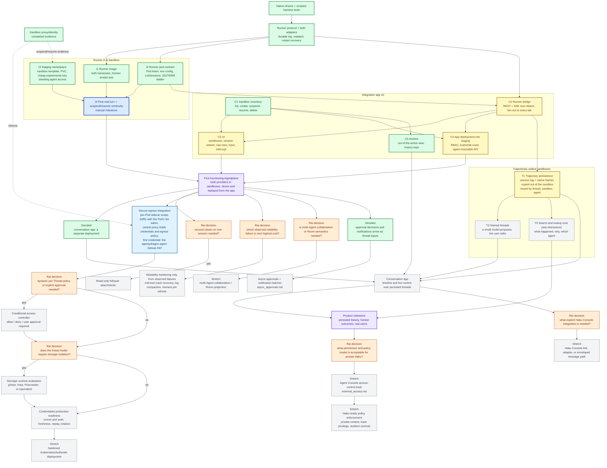

# Agentplane task DAG

This is the single project overview for Agentplane work. It is a dependency map, not a workflow
engine or a request to build every future subsystem. Boxes are sized as coherent agent work packages
that ship as their own PRs; the detailed tasks live in the supporting documents. An edge is a real
dependency, meaning the downstream package cannot be specified or tested without the upstream one.
Packages without an edge between them are meant to be worked in parallel, and a conflict between
two of them is resolved by whoever lands second rebasing.

## Outcome

Rai can open a separate integration app backed by Agentplane, create a sandbox running one Claude
or Codex runner, send an Input, watch response and tool activity arrive, detach and come back to
what happened since, suspend and resume the sandbox with the conversation intact, and read the raw
native frames behind any event. The first instance is a staging one on the cheap-experiments
model key, and the agent working on Agentplane can drive it end to end without Rai: create a
sandbox, run a turn, read what happened, tear it down. The first functioning product is
credentialless toward external systems; real upstream credentials are a later gate. Sandboxes are disposable, trajectories are
not: what an agent did, and why, outlives the sandbox it ran in, under a name, and is searchable
later.

## Current status

- **Landed:** the sandbox proxy/identity spike's evidence; the native drivers and scripted harness
  tests ([`../native/`](../native/), [`../harness_tests/`](../harness_tests/),
  [`../capture/`](../capture/)); the runner protocol and service
  ([`../runner/`](../runner/), [`../runner/SPEC.md`](../runner/SPEC.md)) with a durable
  per-session log, cursor reattach, idempotent inputs, and restart recovery, pinned by one set of
  interaction scripts run against both binaries; typed wire models for both harness vocabularies
  and the `py_grpc_library` macro that generates the protocol stubs; the runner image with both
  harnesses, the runner's Pod contract (`ListSessions`, the SIGTERM ladder), the
  `agentplane-staging` namespace with its `SandboxTemplate` on the cheap-experiments key and the
  agent's standing access, and the app's sandbox inventory with archive.
- **Next:** the rest of the first integration app,
  [`runner_sandbox_and_app.md`](runner_sandbox_and_app.md): the bridge and UI are in review, the
  deployment and the first real turn on staging follow.
- **Access-control scope is intentionally deferred:** the current Ducktape work can use its existing
  broad internet boundary and scoped GitHub credential for `agentydragon-agent`; that convenience is
  not a policy model for the private, high-context Haku agent.

## DAG

Legend: green is landed; yellow is in flight, with a PR open; the bold blue nodes are ready to
start now, in parallel; light blue is next work blocked only on a node in this slice; purple is a
milestone;
orange diamonds are unresolved decisions requiring Rai's product or design input; gray is
conditional or stretch work.

In flight as stacked PRs: **C2**, **C3**, and **C4**. Ready now: **I4**, since the runner image
is published to staging. T1 needs only C2, since the bridge already reads the full session log; it is not required
for F0, but nothing stops it starting alongside C4.

The orange nodes are deliberately limited to choices that change downstream implementation
ordering. `D` is decided: the conversation app stays a separate deployment, at least for now.
T1's store is PostgreSQL (a CNPG cluster beside the runner Pods; staging's is disposable).
External-event scope is decided: approval decisions and other notifications reach a thread as
inputs ([`async_approvals.md`](async_approvals.md)). A "no" choice should close or defer that
branch rather than create speculative scaffolding.

`J` is decided in shape: the ADR's composition, a per-Pod sidecar that takes unauthenticated
traffic from the sandbox and forwards it to a central proxy under the Pod-bound ServiceAccount
token, with the central proxy holding the real credentials and the per-identity egress rules
(methods, hosts, paths, and which placeholder tokens it substitutes). It is Agentplane's own
code, not a reuse of Haku's egress proxy, and the integration app shows a sandbox's allowed
egress, tokens, and decisions. The `P`/`K` path is only the narrow access decision needed for a
credentialed Agentplane egress deployment. It is not the general Agent Console permission model represented by `AA`/`AB`, and it must
not be reused as a private-Haku policy language by default. The existing broad Ducktape lane is a
scoped operational convenience, not evidence that the same grants are safe for an agent with Rai's
personal context.

## Work-package acceptance

- **Sandbox evidence:** the committed spike and evidence memo distinguish proven credential exclusion,
  Pod/Sandbox authentication, replay/lifecycle behavior, and unsupported same-Pod route confinement.
- **Native drivers + scripted harness tests:** real Claude and Codex binaries driven over stdio by
  [`../native/`](../native/); the scripted tests in [`../harness_tests/`](../harness_tests/) cover
  turns, idle resume, tool round trips, steering/interrupt and mid-turn input, and upstream
  connection loss for both providers, asserting each step's upstream request markers and native
  frames. The scenario matrix is in [`experiments.md`](experiments.md); what each harness exposes
  beyond the tests is in [`../native/docs/protocol_roster.md`](../native/docs/protocol_roster.md).
- **Live capture probe:** [`../capture/`](../capture/) records raw native and upstream logs outside
  Git as reference material for authoring or repairing a script, never as test inputs. A harness
  bump or newly tested protocol area requires a probe run, human inspection of the differences
  against the scripted expectations, and a script update.
- **Runner protocol + adapters:** one gRPC contract justified by observed native frames, with both
  Claude and Codex adapters exercised through the same interaction scripts. Landed as
  [`../runner/`](../runner/); its contract is [`../runner/SPEC.md`](../runner/SPEC.md).
- **I1 runner image:** an `oci_image` with the runner and both pinned harnesses, registered for the
  Forgejo registry, whose Docker smoke test attaches over the protocol and runs one scripted turn
  per harness on RBE.
- **I2 runner pod contract:** the runner listens on the Pod address with its state on a volume,
  takes provider configuration from the environment, answers `ListSessions`, and on SIGTERM stops
  every harness through the stdin-close ladder before exiting; a runner test covers the RPC and the
  signal path.
- **I3 staging namespace:** `cluster/k8s/agentplane-staging/` carries the namespace, the
  `SandboxTemplate` with its PVC on wyrm2 (`local-path-proxmox`, `Delete` reclaim), a standing
  copy of the `cheap-experiments` LiteLLM key for the runner Pods, Cilium policy, and the agent's
  standing access: the namespace is labeled
  agent-readable for metadata and logs, and a per-service `agent-rbac/` binding lets the
  existing agent identities create, suspend, resume, and delete sandboxes, exec into
  runner Pods, and port-forward. The cluster validator passes and a Sandbox reaches Ready once
  the image is published.
- **I4 first real turn:** run by the agent on staging without Rai: one turn per provider against
  LiteLLM from inside a sandbox, then detach, suspend, resume, reattach from the cursor, and the
  earlier turn visible in the resumed conversation; observations that change a guarantee go
  into the runner SPEC.
- **C1 sandbox inventory:** REST with an OpenAPI schema over Agentplane's standalone Sandboxes:
  list with provisioning state, create, suspend, resume, delete; tested without a live cluster.
- **C2 runner bridge:** sessions per sandbox, attach with a cursor, inputs, interrupt, shutdown,
  and SSE with the event sequence as the SSE id; `Native` events pass through; tested against a
  local runner with the scripted model.
- **C3 UI:** a small SPA over C1 and C2 with the sandbox list and controls, the session stream, a
  raw-frames view, an input box, and interrupt; provisioning, running, suspended, lost, and
  uncertain states shown honestly.
- **C4 app deployment into staging:** Deployment, Service, Authentik-fronted route, and
  namespace-scoped RBAC in `agentplane-staging`, with the image registered like the runner's.
  The API is reachable to the agent from inside the cluster, so the app's own flows (create,
  drive, archive, delete) can be exercised autonomously; a production instance is a second
  copy of the same manifests with its own keys, and does not exist until something needs it.
- **C5 archive:** a sandbox can be marked archived from the app: it leaves the active list, its
  Pod is torn down by suspension, and its PVC and session log stay, so unarchiving resumes it.
  Archive is never deletion. Once T1 holds the trajectory, the flag moves to the thread record
  and an archived sandbox may be deleted without losing anything.
- **First functioning Agentplane (F0):** from the app, both providers run in sandboxes, a session is
  driven, left, and replayed, a sandbox survives suspend and resume with its conversation, and the
  raw frames behind any event are one click away.
- **T1 trajectory persistence:** a thread's session log and native frames are copied out of the
  sandbox into durable storage as they arrive, keyed by thread, sandbox, and agent, so deleting
  the sandbox loses nothing and a thread can be read without a runner; the store is the app's
  first database, chosen when this lands (PostgreSQL is the default expectation). Haku's session
  store and recall index are prior art for the shape, not a dependency.
- **T2 named threads:** a small model proposes a name from the first turn, the user can edit it,
  and the name lives on the thread record; naming never touches the runner or the harness.
- **T3 search and lookup:** find past interactions by text and by what an agent did; answer "what
  happened here", "why did the agent do that", and "which agent did this" from the persisted
  trajectory, with the raw frames one step away.
- **Conversation app (E):** timeline and live control over persisted threads, as a client of the
  same API; how archived threads are presented stays in this layer.
- **Secure egress and credentialed readiness:** one narrow synthetic operation proves the fixed sidecar
  to trusted gateway path before any real upstream credential is enabled. Real credentials remain only
  at the gateway; durable freshness/replay, per-Sandbox/Thread binding, rotation, runner-port
  authentication, and escape tests gate production use.
- **Reliability:** choose one observed failure with the highest user cost after the first functioning
  product. Candidates already known: recovery of a turn lost mid-tool beyond `PROCESS_LOST`, session
  log growth, and the harness pin refresh workflow. Each hardening slice needs its own reproduction
  and acceptance test; do not implement every candidate in advance.
- **Stretch branches:** collaboration, external events, Haku Console integration, stronger runtimes,
  hardened deployment, and the private-Haku access-control track each begin only after the
  corresponding decision node and dependencies are resolved. The private-Haku track must cover tool
  execution, HTTP/API calls, credential handling, approvals, and policy behavior without assuming that
  routine per-action approval clicks are a reliable safety mechanism.

## Ownership and sequencing rules

- Kubernetes/Agent Sandbox owns Sandbox, Pod, PVC, readiness, suspension, and workload lifecycle.
- Native harnesses own native history, execution semantics, and provider-native resume.
- The runner owns harness supervision, the session log, and the protocol; Agentplane's app owns
  the sandbox inventory it derives from Kubernetes, the browser API, and later the live
  `Pod -> Sandbox -> Thread -> Agent` mapping once that mapping is required.
- The conversation app owns product UX such as generated Thread names, naming persistence, archive
  presentation, and timeline behavior. It may remain separate or later be hosted by Haku Console, but
  must not create shared runtime, route, frontend, or persistence coupling.
- Do not add a persistence schema, UI projection, Kubernetes controller, credential path, or
  approval framework ahead of the first test or feature that cannot pass without it. Trajectory
  persistence (T1) is that feature for the database: it enters with T1, not before.
- Do not enable real upstream credentials until the secure-egress and credentialed-readiness gates pass.
- One runner per sandbox and one runner attachment per session are acceptable for the first
  functioning product; the app fans that attachment out to every browser tab on the session.
  Multi-Agent rooms, subscriptions, external events, advanced retention, and provider migration
  are not hidden prerequisites.

## Detailed plans

- The next slice, runner in a sandbox and the integration app:
  [`runner_sandbox_and_app.md`](runner_sandbox_and_app.md).
- Native provider scenarios and the scripted-test workflow: [`experiments.md`](experiments.md), the
  [native driver README](../native/README.md), the [harness tests README](../harness_tests/README.md),
  and the [live capture probe README](../capture/README.md).
- The runner protocol and its tests: [runner README](../runner/README.md) and
  [runner SPEC](../runner/SPEC.md).
- Sandbox identity and egress evidence: [sandbox spike README](../sandbox-spike/README.md) and [egress
  ADR](adr_sandbox_proxy_gateway.md).
- Product/API layering and deferred capabilities: [`product_surface.md`](product_surface.md) and
  [`architecture.md`](architecture.md).
- Asynchronous approvals, decision delivery, and the notification batcher:
  [`async_approvals.md`](async_approvals.md).
- Delegated identity versus brokered credentials per external system, and the rule for choosing:
  [`external_access.md`](external_access.md).
